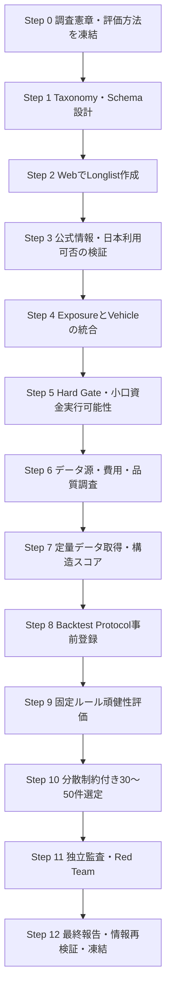

# Phase 0: 現代に適した取引アセット調査・選定計画書

- 文書状態: 実行前計画ドラフト
- 基準日: 2026-08-02
- 上位計画: `plan/自動トレードシステム_要件定義書.md`
- 戦略原典: `research/タートルズ・トレンドフォロー戦略.md`
- 目的: 候補市場を体系的に調査・採点し、最終候補30～50件と初期実装候補3～5件を選定する
- この文書の範囲: 調査・評価・選定の方法を定義する。実際のWeb調査、データ購入、バックテスト、最終選定はまだ行わない

> 本計画は研究・システム設計を目的とし、投資助言ではない。評価点は将来収益を保証せず、法律、税制、証券会社の取扱商品、API、必要証拠金、データ料金は調査実行時に再確認する。

---

## 1. 調査目的

タートルズ型トレンドフォローを現代市場で自動運用するため、次の条件を満たす取引候補を選ぶ。

1. 日本居住者が適法かつ実務的に利用できる。
2. APIで価格取得、発注、注文・ポジション・残高確認ができる。
3. ロングとショートの双方を継続的に実行できる。
4. 初期資金100万円未満でも、最小取引単位と証拠金が過大にならない。
5. 長期・1分足データを合理的な費用で取得できる。
6. Spread、Slippage、手数料、Roll、Funding、Borrow等のコストを推定できる。
7. 20～200日程度の複数時間軸で、過剰適合に依存しない検証ができる。
8. 単独の過去収益だけでなく、流動性、データ品質、運用容易性、分散効果を含めて評価できる。
9. 最終候補30～50件が、同じ経済リスクへ重複集中しない。
10. 最終候補から、システム実装・Paper試験用の3～5件を選べる。

---

## 2. 既存要件から引き継ぐ制約

| 項目 | 制約・方針 |
|---|---|
| 利用者 | 日本居住者 |
| 証券会社 | Interactive Brokers Japanを第一候補。必要に応じて代替業者も調査 |
| 運用資金 | Live開始時100万円未満 |
| 初期月額費用 | データ、クラウド、ソフトウェア合計1万円未満を目標 |
| 方向 | ロング・ショート双方 |
| 戦略 | 原典版と現代版を並行比較 |
| Unit | 原典1N＝1%を基準とし、0.25%、0.5%も実行可能性比較 |
| DD目標 | 15%以内 |
| 原典上限 | 単一市場4、強相関群6、緩相関群10、同一方向12 Unit |
| データ粒度 | 初期候補3～5件は利用可能な全期間の1分足 |
| 対象数 | 最終候補30～50件、初期実装3～5件 |
| 研究環境 | 自宅PC |
| Shadow/Paper/Live | 東京リージョンのクラウドVM |

### 2.1 この調査で解消する未確定事項

- どの資産クラスを対象にするか。
- どの経済的Exposureを取引するか。
- ExposureごとにどのVehicleを使用するか。
- 初期資金で実行可能な最小取引単位か。
- 履歴・リアルタイムデータの入手方法と費用。
- 先物の場合の商品別Roll方法。
- 最終候補30～50件と初期候補3～5件。

---

## 3. 用語と評価単位

### 3.1 Exposure

値動きの経済的な対象を指す。

例:

- 米国大型株指数。
- 日本円対米ドル。
- 金。
- WTI原油。
- 米国10年金利。

### 3.2 Vehicle

Exposureを実際に取引する商品を指す。

例:

- 標準先物、Micro先物。
- Spot FX。
- ETF、ETN。
- CFD。
- Crypto spot、Perpetual、先物。

### 3.3 Candidate

`Exposure × Vehicle × Broker/Venue`の組合せを1候補とする。

同じ金価格を参照する金先物、Micro金先物、金ETF、金CFDは別Candidateだが、最終30～50件を数える際は原則として同一Exposureの重複採用を避ける。第一Vehicleと代替Vehicleを別欄で保持する。

### 3.4 最終成果物での「30～50件」

- 原則30～50の異なるExposureを選ぶ。
- 各ExposureにPrimary Vehicleを1件割り当てる。
- 必要に応じてFallback Vehicleを記録するが、30～50件の件数には含めない。
- 同一Exposureを複数Vehicleで採用する場合は、明確な運用上の理由を要求する。

---

## 4. 対象Universe

最初から特定商品へ絞らず、次の資産クラスからLonglistを作る。

| 資産クラス | 主なExposure例 | Vehicle候補 | 特有の確認事項 |
|---|---|---|---|
| 株価指数 | 国・地域・大型/小型・Sector | 先物、Micro、ETF、CFD | 取引時間、空売り、配当、構成変更 |
| 金利 | 国債、短期金利 | 先物、ETF、CFD | DV01、限月、政策転換、負価格ではないが価格表現 |
| FX | Major、Cross、Emerging | FX先物、Micro、Spot FX、CFD | Swap、取引先、週末Gap、通貨換算 |
| Energy | 原油、製品、天然ガス | 先物、Micro、CFD、ETF | 現物受渡し、負価格、Roll、季節性 |
| Metal | 金、銀、銅等 | 先物、Micro、CFD、ETF | 契約粒度、現物受渡し、通貨 |
| Grain/Oilseed | 小麦、トウモロコシ、大豆等 | 先物、Mini、CFD | First Notice、値幅制限、季節性 |
| Soft | 砂糖、コーヒー、綿花等 | 先物、CFD | 流動性、Gap、受渡し、データ費用 |
| Livestock | 生牛、豚等 | 先物、CFD | Gap、値幅制限、流動性 |
| Volatility | 株式Volatility等 | 先物、ETP | 強いRoll、平均回帰、期限構造 |
| Crypto | BTC、ETH等Major | Spot、Perpetual、先物 | 日本からの利用可否、Funding、24/7、Custody |
| Real estate | REIT指数等 | ETF、先物、CFD | 株式との重複、空売り、配当 |
| Environmental/Power | Carbon、Power等 | 先物、CFD | Retail access、データ、極端な季節性 |

### 4.1 初期Longlist目標

- Exposure: 100～200件。
- Candidate Vehicle: 150～300件。
- 公式情報確認後: 100～200件。
- Hard Gate通過: 60～120件。
- 定量・頑健性評価後: 40～80件。
- 最終選定: 30～50件。
- 初期実装: 3～5件。

候補数が不足してもHard Gateを自動的に緩めない。不足理由を報告し、人の承認後にのみ条件を変更する。

---

## 5. 全体工程



---

## 6. AIエージェントの役割分離

同じエージェントが候補発見、証拠確認、採点、最終監査をすべて行わない。

| Role | 責任 | 禁止事項 |
|---|---|---|
| Orchestrator | 入力配布、進捗、Schema検査、成果物統合 | 個別Candidateの点数を恣意的に変更しない |
| Asset Scout | 資産クラス別Longlist作成 | 非公式情報だけで適格判定しない |
| Evidence Verifier | 公式情報、URL、日付、可否を検証 | 過去収益で候補を除外しない |
| Broker/Legal Verifier | 日本利用、Broker、API、Short、口座条件 | 法的断定を出典なしで行わない |
| Data Specialist | 履歴、1分足、契約定義、費用、品質 | 欠損を黙って補完しない |
| Quant Evaluator | 固定ルールで指標計算、頑健性評価 | 候補ごとに最良Parameterを選ばない |
| Portfolio Selector | 重複排除、Cluster、30～50件選定 | 個別Score順だけで機械選定しない |
| Red Team Reviewer | バイアス、出典、計算、例外を監査 | 元の採点を上書きしない |
| Final Integrator | 最終レポートと決定ログ | 未解決事項を確定扱いしない |

資産クラス別Scoutは並列実行できる。各Scoutの担当クラスと出力ファイルを重複させない。

---

## 7. Web調査方針

### 7.1 Web調査を行う工程

- Step 2: 公式商品一覧からLonglistを作る。
- Step 3: 取引可否、API、Short、契約仕様、取引時間を検証する。
- Step 6: データVendor、履歴期間、粒度、License、料金を調査する。
- Step 12: 最終候補について、変化しやすい情報を再確認する。

### 7.2 情報源の優先順位

1. 取引所、Broker、Regulator、税務当局、Data Vendorの公式情報。
2. 商品目論見書、契約仕様書、API仕様書、料金表。
3. 査読論文、Working paperの原文。
4. 信頼できる業界資料。
5. 二次記事は候補発見だけに使用し、重要事実の最終根拠にはしない。

### 7.3 必須Evidence項目

各重要事実について次を保存する。

- source_url。
- source_title。
- publisher。
- accessed_at。
- effective_dateまたはpublished_date。
- 対応するCandidate ID。
- 根拠となる要点の日本語要約。
- primary / secondary区分。
- confidence: A / B / C / Unknown。
- 再確認期限。

### 7.4 Web検索ルール

- 検索結果Snippetだけで判定せず、必ず元ページを開く。
- 価格、証拠金、税、取扱商品、API、居住地制限は変化しやすいため、調査日を記録する。
- 技術仕様は公式Documentationを使う。
- 法務・税務は公的機関とBroker契約文書を優先し、不明なら専門家確認事項とする。
- 重要なHard Gateは、可能ならBrokerと取引所等の独立した2情報源で照合する。
- PDF仕様書は該当ページ番号も記録する。
- 矛盾する情報を平均せず、`conflict_status`として残す。

---

## 8. Candidate Schema

最低限、次の列を持つCSVまたはParquetを作る。

```text
candidate_id
exposure_id
exposure_name_ja
asset_class
risk_cluster
vehicle_type
symbol
exchange_or_venue
broker
broker_contract_id
currency
long_available
short_available
api_order_available
api_account_available
japan_resident_eligible
trading_hours
tick_size
contract_multiplier
minimum_quantity
last_trade_rule
first_notice_rule
physical_delivery_risk
margin_initial_jpy
margin_maintenance_jpy
median_daily_volume
median_open_interest
median_spread
history_start
minute_data_available
realtime_data_available
estimated_monthly_data_cost_jpy
commission_roundtrip_jpy
funding_borrow_roll_method
evidence_confidence
evidence_urls
hard_gate_status
hard_gate_reasons
structural_score
robustness_score
final_score
rank_stability
selection_status
review_notes
```

数値の単位、観測期間、通貨、As-of dateを別Data Dictionaryで固定する。

---

## 9. Hard Gate

採点前に実行不可能な候補を除外する。`Unknown`はPassにしない。

### 9.1 必須Gate

| Gate | Pass条件 | Fail時 |
|---|---|---|
| G1 日本利用 | 日本居住者が口座・商品を利用可能 | 除外 |
| G2 API | 発注と注文・Position・Account確認がAPIで可能 | 除外またはResearch-only |
| G3 双方向 | Long・Short双方を継続的に行える | 原則除外 |
| G4 データ | 検証可能な履歴とLive価格が入手可能 | 除外 |
| G5 商品定義 | Tick、Multiplier、最小数量、取引時間を確認可能 | 除外 |
| G6 Capital fit | 最小数量のNリスクと証拠金が資金制約内 | Live候補から除外 |
| G7 流動性 | 想定注文量に対してSpread・Volume・Depthが十分 | 除外 |
| G8 Cost | 保守的往復コストが戦略のNに対し過大でない | 除外または条件付き |
| G9 Operational safety | 受渡し、Borrow、Funding、清算等を管理可能 | 除外または条件付き |
| G10 Evidence | Critical項目に公式根拠がある | 保留 |

### 9.2 小口資金Gate

資金額が「100万円未満」とだけ決まっているため、50万円と100万円の2Scenarioで計算する。

計算項目:

- 最小数量の1N損益額と口座比率。
- 2N Stop損失とGap stress後損失。
- 4 Unit積み増し後の理論損失。
- 初期証拠金とStress margin。
- FX換算10%変動時の影響。
- 同時3市場・5市場保有時の証拠金利用率。

暫定判定:

- `Tradable-original`: 100万円Scenarioで最小1Nリスクが概ね1%以内。
- `Tradable-modern-only`: 原典1%は困難だが、別Vehicleや小数数量で0.25～0.5%へ調整可能。
- `Research-only`: 戦略検証対象にはできるが、100万円未満のLiveには不適。
- `Exclude`: データ、流動性、API、安全性等で研究対象にも不適。

境界Toleranceと証拠金利用率上限は、実際の資金額確定時に人が承認する。

### 9.3 Vehicle別追加Gate

#### Futures

- First Notice、Last Trade、現物受渡しを確認。
- 期限切れ契約を含む履歴を取得可能。
- Roll候補と流動性移動を確認。
- 価格制限、取引停止、負価格可能性を確認。

#### ETF/ETN/株式

- Short borrow、売禁、Borrow feeを確認。
- 上場廃止・Survivorship biasを処理可能。
- Leveraged/Inverseの日次Reset商品は原則別枠。
- ETNは発行体信用リスクを別評価。

#### FX/CFD

- 取引先と価格形成、Spread拡大、Overnight fundingを確認。
- Broker固有価格と参照市場の差を記録。
- APIとDemo/Paperの機能差を確認。

#### Crypto

- 日本居住者利用可否、Custody、法的Entityを確認。
- Funding、Liquidation、24/7運用、取引所障害を確認。
- Major以外は流動性・履歴・上場廃止Gateを厳格化。

---

## 10. 採点方式

### 10.1 原則

- Hard Gate通過候補だけ採点する。
- 評価WeightはBacktest結果を見る前に凍結する。
- 過去収益のWeightを過大にしない。
- 欠損値を平均点で埋めない。Unknownは減点または保留。
- ScoreとEvidence confidenceを別々に表示する。
- 1点差を有意な優劣と解釈しない。

### 10.2 100点Scorecard

| 大項目 | 配点 | 小項目 |
|---|---:|---|
| Execution・流動性 | 20 | Spread/N 6、Slippage 4、Volume/Depth 5、取引時間・停止 2、注文機能 3 |
| 小口資金適合 | 20 | 最小1Nリスク 8、2N+Gap 5、証拠金 4、Sizing粒度 3 |
| Access・運用 | 15 | 日本/Broker/API 5、Long/Short 3、運用複雑性 3、Roll/Borrow/Funding/Counterparty 4 |
| データ品質・費用 | 15 | 履歴年数 5、1分足 4、商品定義 3、License・月額費用 3 |
| 分散価値 | 15 | Exposure独自性 5、通常時相関 4、危機時相関 3、資産クラス寄与 3 |
| Trend頑健性 | 15 | 固定ルールOOS 5、複数速度・期間 4、Parameter安定性 3、Cost stress耐性 3 |
| 合計 | 100 |  |

### 10.3 Step 7時点の暫定Score

Backtest前はTrend頑健性15点を採点せず、残り85点を100点へ比例換算して`structural_score_pretest`を作る。

### 10.4 Evidence係数とPenalty

```text
FinalScore = BaseScore × EvidenceFactor - OperationalPenalty
```

| Evidence | Factor | 条件 |
|---|---:|---|
| A | 1.00 | Critical項目が公式一次情報で確認済み |
| B | 0.95 | 主要項目は公式確認、一部が信頼できる二次情報 |
| C | 0.85 | 重要な不確実性が残る |
| Unknown | 採点禁止 | Hard Gateの再調査が必要 |

Operational Penaltyは0～10点とし、受渡し、Short停止、Funding急変、価格制限、Counterparty集中等、Score項目だけでは表現しにくいRiskへ使用する。Penalty理由を必ず記録する。

### 10.5 Score正規化

- Vehicle type間で単位が違うため、絶対閾値とClass内Percentileを併用する。
- 流動性は単純Volumeではなく、想定注文量、Contract value、Spreadを考慮する。
- CostはbpsだけでなくN比率でも比較する。
- Marginは金額だけでなく資金Scenario比率で比較する。
- 相関は同じ通貨換算・同じSession定義のReturnで計算する。

---

## 11. Trend頑健性評価Protocol

アセット選択用Backtestは、戦略最適化用Backtestと分離する。

### 11.1 事前登録する固定ルール

- Entry/Exit: 20/10、55/20、100/50、200/100。
- Long/Short双方。
- NはWilder型20日を基準。
- Entry当日値をChannel計算に含めない。
- CostはLow、Base、Stressの3Scenario。
- 未知のIntraday順序は不利な順序。
- 先物は同一の事前登録Roll規則を使用し、商品ごとの成績でRoll規則を選ばない。

### 11.2 Candidateごとに禁止すること

- Candidateごとに最良Lookbackを採用する。
- Candidateごとに最良Stopを採用する。
- 最良期間だけ切り出す。
- 成績の良い市場だけを後からUniverseへ追加する。
- Backtest後にWeightを変更して同じ結果を正式採点する。

### 11.3 評価指標

- Fixed ruleごとのCost控除後Return。
- Sharpe、Sortino、Calmar、Max DD、回復期間。
- 勝率、平均利益/損失、Tail loss。
- Turnover、Trade数、Slippage感応度。
- 複数速度で正の期待値を示した割合。
- 開発期、OOS、危機期ごとの一貫性。
- Parameter近傍の安定性。
- 結果が少数Tradeへ集中していないか。
- DSR、PBO等の多重試験補正候補。

Trend Scoreは最高Sharpeではなく、固定候補群のMedian、Worst acceptable case、正の結果割合、Cost stress耐性から作る。

---

## 12. 30～50件のPortfolio選定規則

単純なFinalScore上位順にはしない。

### 12.1 制約

- 原則1 ExposureにつきPrimary Vehicleは1件。
- Return相関が常時高い候補はCluster化する。
- Pairwise correlationが高く、経済要因も同一ならScore上位だけをPrimaryにする。
- 1資産クラスが最終候補の25%を大きく超えないことを目安とする。
- 可能なら5以上の資産クラスを含める。
- 同一Broker/Venue/通貨/Funding方式への集中を表示する。
- 原典4/6/10/12 Unit分類に使えるRisk clusterを付与する。
- `Research-only`は最終Live候補30～50件に含めず、別表とする。

### 12.2 選定手順

1. Hard Gate通過CandidateをFinalScore順に並べる。
2. 同一ExposureのVehicleを比較しPrimaryとFallbackを決める。
3. 相関Clusterと共通Risk factorを付ける。
4. 高Scoreから追加し、Cluster・資産クラス制約を検査する。
5. Candidate追加による分散改善を計測する。
6. Weight、Cost、相関期間を変えたSensitivityでRank安定性を測る。
7. 多くのScenarioで上位に残る候補を優先する。
8. 30～50件をTier A/Bに分ける。

### 12.3 Tier

- Tier A: データ、API、資金、運用条件が整い、実装準備へ進める。
- Tier B: 有望だが、データ費用、Margin、Roll、Broker等に条件が残る。
- Reserve: Scoreは高いが重複、集中、Evidence不足で見送り。
- Research-only: 戦略研究には使うが、初期資金でLive不可。

### 12.4 初期3～5件の選び方

最も高収益だった3～5件ではなく、システム機能を幅広く検証できる組合せを選ぶ。

- 異なる資産クラス。
- 異なる取引時間・通貨。
- 少なくとも1件はRoll処理を必要とする商品。先物を採用する場合。
- 十分な流動性と小さい最小数量。
- 1分足データ費用が予算内。
- Entry、Stop、追加、Exitがある程度発生する。
- 相関が過度に高くない。

---

## 13. 成果物構成

実行時は次の構成を推奨する。

```text
research/asset_selection/
  00_research_charter.md
  00_decision_log.md
  01_taxonomy.md
  01_candidate_schema.md
  02_longlist.csv
  02_scout_reports/
  03_evidence_registry.csv
  03_verified_universe.csv
  04_exposure_vehicle_map.csv
  05_hard_gate_results.csv
  05_capital_scenarios.csv
  06_data_vendor_matrix.csv
  06_data_quality_report.md
  07_structural_metrics.parquet
  07_structural_scores.csv
  08_backtest_protocol.md
  08_parameter_registry.yaml
  09_robustness_metrics.parquet
  09_full_scores.csv
  10_correlation_clusters.csv
  10_selection_30_50.csv
  10_initial_pilot_3_5.md
  11_independent_audit.md
  11_exceptions.csv
  12_final_asset_selection.md
  12_final_evidence_snapshot.csv
```

すべてのCSV/Parquetに`schema_version`、`as_of_date`、`generated_at`、`source_run_id`を含める。

---

## 14. 共通エージェントPrompt Header

各StepのPrompt先頭に次を付ける。

```text
あなたは、タートルズ型トレンドフォロー自動売買システムのアセット選定を担当するAIエージェントです。

共通制約:
- 日本居住者が利用する。
- IBKR Japanを第一候補とするが、代替Broker/Vehicleも根拠付きで検討する。
- Live開始資金は100万円未満、初期月額費用は1万円未満を目標とする。
- Long/Short双方、API発注・口座確認が必要。
- 最終候補30～50 Exposure、初期実装3～5 Exposureを目指す。
- 過去Returnだけで候補を選ばない。
- 不明な事実を推測で埋めず、Unknownとして記録する。
- 変化し得る事実にはAs-of dateとSource URLを付ける。
- Search snippetだけを根拠にせず、元ページを確認する。
- 公式一次情報を優先し、重要事実は可能なら複数Sourceで照合する。
- 本工程で許可されていないファイルを変更しない。
- 他のエージェントの成果物を上書きしない。
- 投資助言を行わず、研究・システム実行可能性の観点で評価する。

出力は日本語で、指定SchemaとMarkdown/CSV形式を厳守してください。
```

---

## 15. Step別実行計画とAIエージェントPrompt

## Step 0: 調査憲章と評価方法の凍結

### 目的

結果を見る前に、Universe、Hard Gate、Score weight、Backtest候補、例外承認方法を固定する。

### 入力

- 本計画書。
- 自動トレードシステム要件定義書。
- タートルズ戦略原典レポート。

### 出力

- `00_research_charter.md`
- `00_decision_log.md`
- Weight version。
- Human approval欄。

### Quality Gate G0

- Hard GateとWeightが明文化されている。
- 最終結果を見ていない状態でVersionを固定している。
- 変更時に新Versionを作る規則がある。

### エージェントPrompt

```text
[共通エージェントPrompt Headerを挿入]

Role: Research Charter Planner
Task: 入力文書を読み、アセット選定調査の事前登録文書を作成してください。

必須内容:
1. 研究目的、Scope、非Scope。
2. Exposure、Vehicle、Candidateの定義。
3. 初期Longlistから最終30～50件までの目標件数。
4. Hard Gate、Score weight、Evidence confidence、Penalty。
5. Backtest前に凍結するParameter群。
6. 例外申請、Weight変更、再実行のVersion規則。
7. Human approvalが必要なGate。
8. 想定Biasと防止策。

禁止:
- 具体的Candidateの優劣を判断しない。
- Backtest結果を想定してWeightを調整しない。

出力: 00_research_charter.md と 00_decision_log.md の原稿。
```

---

## Step 1: TaxonomyとCandidate Schema設計

### 目的

資産クラス、Exposure、Vehicle、Risk cluster、単位を統一し、並列調査結果を結合可能にする。

### 出力

- `01_taxonomy.md`
- `01_candidate_schema.md`
- Data Dictionary。

### Quality Gate G1

- ExposureとVehicleが混同されていない。
- すべての数値に単位・通貨・観測期間がある。
- Futures/ETF/FX/CFD/Crypto固有項目を表現できる。

### エージェントPrompt

```text
[共通エージェントPrompt Headerを挿入]

Role: Market Taxonomy and Schema Architect
Task: 複数資産クラスを一つの評価表へ統合できるTaxonomyとSchemaを設計してください。

必須内容:
- Asset class、Exposure、Vehicle、Venue、Broker、Currency、Risk clusterの階層。
- Futures、ETF/ETN、FX/CFD、Cryptoの共通列と固有列。
- Candidate IDとExposure IDの安定した命名規則。
- 数値列のUnit、Currency、Observation window、As-of date。
- Missing、Not applicable、Unknownの区別。
- Source URLとEvidence confidenceを複数保持する構造。
- Schema validation規則。

出力:
1. 01_taxonomy.md
2. 01_candidate_schema.md
3. CSV Header例

候補の採点や選定は行わないでください。
```

---

## Step 2: Web検索によるLonglist作成

### 目的

公式商品一覧を中心に100～200 Exposure、150～300 Candidate Vehicleを収集する。

### 実行方法

資産クラスごとにScoutを並列実行する。

- Equity index / Real estate。
- Rates。
- FX。
- Energy / Metal。
- Agriculture / Soft / Livestock。
- Volatility / Environmental。
- Crypto。

### 出力

- `02_scout_reports/<asset_class>.md`
- `02_longlist_<asset_class>.csv`
- Orchestratorが`02_longlist.csv`へ結合。

### Quality Gate G2

- Candidate ID重複なし。
- 各候補に少なくとも1つの公式Source候補がある。
- 候補発見時点で過去成績を使っていない。
- 同一ExposureのVehicleが識別されている。

### Scout用エージェントPrompt

```text
[共通エージェントPrompt Headerを挿入]

Role: Asset-class Scout
担当資産クラス: {{ASSET_CLASS}}
Task: Web検索を行い、担当資産クラスのExposureと日本から利用可能性のあるVehicleのLonglistを作成してください。

検索優先順位:
1. IBKR Japan/IBKRの公式商品・Exchange一覧。
2. 取引所公式の商品一覧・Contract specification。
3. 日本のBroker公式商品一覧。
4. Data Vendor公式Catalog。
5. 二次情報は候補発見の補助のみ。

各Candidateについて:
- candidate_id、exposure_id、名称、Vehicle、Symbol、Exchange/Venue、通貨。
- 公式Source URL、Access date。
- 日本利用、API、Short、1分足Dataの状態をPassではなく Known/Unknownで記録。
- 同じExposureの代替Vehicleを関連付ける。
- 明らかなLeveraged daily-reset、極端なIlliquidity等は除外せずFlagを付ける。

禁止:
- Backtest Return、Sharpe、最近のTrendで候補を選別しない。
- Source不明のVolumeやMarginを記載しない。

出力:
1. Markdown調査報告。
2. 指定SchemaのCSV。
3. 未解決Web調査項目一覧。
```

### Orchestrator統合Prompt

```text
[共通エージェントPrompt Headerを挿入]

Role: Longlist Integrator
Task: 資産クラス別Scout出力をSchema検証し、一つのLonglistへ統合してください。

実施内容:
- Candidate ID重複、Symbol衝突、Exposure重複を検査。
- 同じExposureのVehicleを統合Linkする。
- Field名、Unit、Unknown表現を統一する。
- 原文Source URLを保持する。
- 情報を補完推測しない。

出力:
- 02_longlist.csv
- 統合エラーと未解決事項のMarkdown
```

---

## Step 3: 公式Evidence・日本利用・Broker/API検証

### 目的

Longlistの各Candidateについて、取引可能性を一次情報で検証する。

### Web調査項目

- 日本居住者の口座・商品利用可否。
- Brokerでの取扱、必要権限、Account type。
- API発注、注文・Position・Balance取得。
- Long/Short、Short制約。
- Contract specification、取引時間、Tick、Multiplier、最小数量。
- Paper/Demo差異。
- 法務・税務上の要確認事項。

### 出力

- `03_evidence_registry.csv`
- `03_verified_universe.csv`
- `03_evidence_conflicts.md`

### Quality Gate G3

- Critical項目がUnknownのCandidateをPass扱いしていない。
- 重要事実に公式URLとAs-of dateがある。
- Broker情報と取引所仕様のSymbol対応が確認できる。

### エージェントPrompt

```text
[共通エージェントPrompt Headerを挿入]

Role: Independent Evidence and Broker Verifier
Input: 02_longlist.csv、01_candidate_schema.md
Task: Candidateごとに公式Web情報を開いて、利用可否と商品仕様を検証してください。

必須調査:
- 日本居住者利用可否。
- Broker/Account/Trading permission。
- API注文とAccount/Position照会。
- Long/Short可否。
- Exchange、Symbol、Tick、Multiplier、Minimum quantity、Session。
- FuturesならFirst Notice/Last Trade/Delivery。
- ETF/株式ならBorrow/Short制約。
- FX/CFDならFundingと取引先。
- Cryptoなら法的Entity、Funding/Custody。

Source規則:
- Broker、Exchange、Regulator、税務当局、公式Documentationを優先。
- Search snippetをEvidenceにしない。
- PDFはPage番号を保存。
- 矛盾は勝手に解消せずConflictとして記録。

出力:
1. Evidence registry。
2. Verified universe。
3. Unknown/Conflict/専門家確認事項。

採点やBacktestは行わないでください。
```

---

## Step 4: ExposureとVehicleの統合・重複整理

### 目的

同じ経済Exposureを参照する複数商品を束ね、比較単位を整える。

### 出力

- `04_exposure_vehicle_map.csv`
- 重複・Proxy関係図。

### Quality Gate G4

- 同じExposureが別名で重複していない。
- Primary候補とFallback候補を後で比較可能。
- Proxy商品は参照資産との差を記録。

### エージェントPrompt

```text
[共通エージェントPrompt Headerを挿入]

Role: Exposure-Vehicle Mapper
Input: 03_verified_universe.csv、Evidence registry
Task: Candidateを経済Exposure単位へ整理してください。

実施内容:
- 同じUnderlying/Index/Commodity/Currency riskを持つCandidateをCluster化。
- Direct exposureとProxy exposureを区別。
- Vehicle間の差: Contract size、Tracking error、Funding、Roll、Borrow、Counterparty。
- Primary/Fallbackはまだ確定せず、比較項目を作る。
- Exposure ID変更が必要な場合はMigration mapを出す。

出力:
- Exposure-Vehicle map CSV。
- 重複、Proxy、判断保留のMarkdown。
```

---

## Step 5: Hard Gate・小口資金実行可能性

### 目的

採点前に、実行不可能・危険・証拠不足の候補を除外または分類する。

### 出力

- `05_hard_gate_results.csv`
- `05_capital_scenarios.csv`
- `05_exclusions.md`

### Quality Gate G5

- 全CandidateにGate結果と理由がある。
- 50万円・100万円Scenarioを計算。
- Marginだけでなく1N、2N、4 Unit、Gapを評価。
- UnknownをPassにしていない。

### エージェントPrompt

```text
[共通エージェントPrompt Headerを挿入]

Role: Feasibility and Capital Gate Analyst
Input: Verified universe、Exposure-Vehicle map、原典N/Unit仕様
Task: 50万円と100万円の口座ScenarioでHard Gateを判定してください。

必須計算:
- 最小数量の1N JPY risk。
- 2N StopとGap stress。
- 4 Unit理論損失。
- Initial/Maintenance margin比率。
- 3市場・5市場同時保有Scenario。
- Commission、Spread、Funding/RollのN比率。

分類:
- Tradable-original
- Tradable-modern-only
- Research-only
- Exclude
- Pending-evidence

ルール:
- 不明なMargin/N/Multiplierを推定でPassしない。
- 現在値依存の数字にはAs-of dateを付ける。
- 境界Candidateは値を丸めずSensitivityを出す。

出力:
1. Gate結果CSV。
2. Capital Scenario CSV。
3. 除外・保留理由一覧。
```

---

## Step 6: データVendor・費用・品質のWeb調査

### 目的

Hard Gate通過候補について、BacktestとLiveに必要なDataの入手性と総費用を確認する。

### Web調査項目

- 1分足、Tick、Bid/Ask、Volume、Open interest。
- 期限切れ先物とContract definitions。
- 取引所Calendar、Corporate action、Delisting。
- 履歴開始日、更新頻度、Correction policy。
- API制限、License、Non-display条件。
- 一回購入費、月額費、Exchange fee。

### 出力

- `06_data_vendor_matrix.csv`
- `06_data_quality_report.md`
- 予算別取得案。

### Quality Gate G6

- 初期3～5候補の全期間1分足費用を見積可能。
- 30～50候補へ拡大した費用を別Scenarioで表示。
- Broker dataだけへ依存する候補を明示。

### エージェントPrompt

```text
[共通エージェントPrompt Headerを挿入]

Role: Market Data Vendor Researcher
Input: 05_hard_gate_results.csv、必要Data schema
Task: Web検索で公式Data Vendor資料を確認し、CandidateごとのData取得方法・品質・費用を比較してください。

必須項目:
- Historical start、1-minute、Tick/BidAsk、Volume/OI、Definitions。
- Expired futures、Delisted assets、Corporate actions。
- API rate limits、Download format、Correction history。
- Historical、Realtime、Exchange、Non-displayの費用。
- 初期3～5件、30件、50件の予算Scenario。
- JPY換算時の為替前提とAs-of date。

SourceはVendor/Exchange公式を使用し、Marketing記述と契約条件を区別してください。

出力:
- Vendor matrix CSV。
- 品質・License・費用Risk報告。
- 初期月額1万円未満を満たす取得案。
```

---

## Step 7: 定量データ取得・構造指標・暫定採点

### 目的

Backtest収益を使う前に、流動性、Cost、Capital fit、Data、分散価値を数値化する。

### 出力

- `07_structural_metrics.parquet`
- `07_structural_scores.csv`
- Data quality exceptions。

### Quality Gate G7

- 同一期間・単位・通貨で比較。
- Scoreの各値から元Dataへ追跡可能。
- Missingを勝手に補間していない。
- Score再計算が決定的。

### エージェントPrompt

```text
[共通エージェントPrompt Headerを挿入]

Role: Structural Market Quality Analyst
Input: Hard Gate通過候補、Data catalog、Scorecard v{{VERSION}}
Task: Backtest収益を使わずに構造指標と暫定Scoreを計算してください。

計算:
- Spread in bps and N。
- Estimated Slippage、ADV participation、OI比率。
- 最小1N/2N/4Unit risk、Margin比率。
- Data history、Missing bar、Correction、Session coverage。
- Funding/Borrow/Rollの観測可能性とCost。
- Return correlation、Crisis correlation、Exposure uniqueness。
- Evidence confidenceとOperational penalty。

要件:
- 計算式、Window、Currency conversionを記録。
- 85点部分を100へ再換算したPretest structural scoreを作る。
- 異常値とSensitivityを報告。
- Trend performanceは採点しない。

出力:
- Metrics Parquet schema。
- Structural score CSV。
- Reproducibility metadata。
```

---

## Step 8: Backtest Protocol事前登録

### 目的

Candidate別のParameter最適化を防ぎ、Trend頑健性の評価方法を結果確認前に凍結する。

### 出力

- `08_backtest_protocol.md`
- `08_parameter_registry.yaml`
- Protocol hash。

### Quality Gate G8

- Fixed ruleとCost Scenarioが固定。
- OOS/Holdoutが定義。
- Candidate別Parameter選択が禁止。
- 試行回数記録方法がある。

### エージェントPrompt

```text
[共通エージェントPrompt Headerを挿入]

Role: Independent Backtest Protocol Designer
Input: 原典戦略仕様、Hard Gate通過Universe、利用可能Data仕様
Task: アセット選定用の事前登録Backtest Protocolを作成してください。

固定候補:
- 20/10、55/20、100/50、200/100。
- Long/Short双方。
- Wilder N20。
- Low/Base/Stress cost。
- Roll ruleは事前指定。
- Intraday順序不明は不利な処理。

定義:
- Development/OOS/Holdout期間。
- Minimum history/trade count。
- Performance、Tail、Turnover、Parameter stability指標。
- DSR/PBO等の多重試験補正。
- Failed run、Data gap、上場期間短期の扱い。
- 全試行のExperiment registry。

禁止:
- Candidate別にLookback/Stop/Rollを最適化しない。
- 結果を見てProtocolを修正しない。修正時は新Versionにする。

出力: Protocol本文、Parameter YAML、承認Checklist。
```

---

## Step 9: 固定ルールBacktest・頑健性採点

### 目的

事前登録Protocolどおりに全候補を評価し、Trend頑健性15点を加える。

### 出力

- `09_robustness_metrics.parquet`
- `09_full_scores.csv`
- `09_experiment_registry.csv`
- Failed/exception report。

### Quality Gate G9

- Protocol hashが一致。
- 全候補が同じ固定候補群で評価されている。
- 全試行と失敗を記録。
- Holdoutを不正に再利用していない。

### エージェントPrompt

```text
[共通エージェントPrompt Headerを挿入]

Role: Quantitative Robustness Evaluator
Input: Approved protocol、Data catalog、Structural scores
Task: Protocolを変更せず、Candidateを固定ルール群でBacktestし、Trend頑健性を採点してください。

必須:
- Protocol hashとData versionを結果へ保存。
- すべてのParameter候補とCost Scenario結果を保存。
- Candidateごとの最高値ではなくMedian、一貫性、Worst acceptable caseを使う。
- Trade concentration、Regime、OOS、Cost stressを評価。
- Missing/Failed runを除外せず理由を記録。
- Trial count、DSR/PBO等を計算可能な形で保存。

禁止:
- CandidateごとにBest parameterを採用しない。
- 成績が悪いCandidateのData期間を変更しない。
- Structural scoreやWeightを変更しない。

出力:
- Robustness metrics。
- Full score。
- Reproduction command/config。
```

---

## Step 10: 分散制約付き30～50件選定

### 目的

Score、Evidence、Correlation、Exposure重複、運用集中を考慮し最終候補を作る。

### 出力

- `10_correlation_clusters.csv`
- `10_selection_30_50.csv`
- `10_initial_pilot_3_5.md`
- Reserve/Research-only一覧。

### Quality Gate G10

- 30～50件がExposure単位。
- 同じExposureのVehicle重複が説明されている。
- Score順だけでなく分散制約を適用。
- Weight/Cost/Correlation SensitivityでRank安定性を確認。

### エージェントPrompt

```text
[共通エージェントPrompt Headerを挿入]

Role: Diversified Candidate Portfolio Selector
Input: Full scores、Exposure-Vehicle map、Return/correlation metrics、Hard Gate
Task: 分散制約付きで最終30～50 Exposureと初期3～5 Exposureを選定してください。

手順:
1. 同一ExposureのPrimary/Fallback Vehicleを決める。
2. 通常時と危機時のCorrelation clusterを作る。
3. Score、Evidence、Operational penalty、Rank stabilityを統合。
4. 1資産クラス25%目安、5クラス以上目安、同一Risk factor集中を確認。
5. Weight ±20%、Cost stress、Correlation window変更でSensitivityを実行。
6. Tier A/B、Reserve、Research-onlyへ分類。
7. 初期3～5件は利益上位でなく、実装CoverageとCapital fitで選ぶ。

各選定・不選定についてReason codeを付けてください。

禁止:
- Pairwise correlationだけで経済的重複を無視しない。
- Rank 1位から機械的に50件取らない。
- Research-onlyをLive候補へ混ぜない。

出力:
- 30～50件CSV。
- Initial pilot提案。
- 制約違反とTrade-off報告。
```

---

## Step 11: 独立監査・Red Team

### 目的

調査担当と独立したAgentが、出典、計算、Bias、例外、再現性を監査する。

### 出力

- `11_independent_audit.md`
- `11_exceptions.csv`
- 修正要求一覧。

### Quality Gate G11

- Critical findingが解決または明示的に受容されている。
- Scoreを元Dataへ追跡できる。
- 例外採用に承認者と理由がある。

### エージェントPrompt

```text
[共通エージェントPrompt Headerを挿入]

Role: Independent Red Team Auditor
Task: あなたは候補発見・採点・選定を行っていません。全成果物を批判的に監査してください。

監査項目:
- Look-ahead、Survivorship、Selection、Multiple-testing bias。
- Candidate別Parameter最適化の痕跡。
- Hard GateのUnknown誤通過。
- 公式Source切れ、古い情報、Source間Conflict。
- Unit、通貨換算、Multiplier、Margin、N計算。
- Futures Roll、Delisting、Borrow、Funding、Corporate action。
- Score double counting、Weight変更、例外処理。
- Correlation clusterとExposure重複。
- 100万円未満・月額1万円未満との整合。
- ReproducibilityとData lineage。

FindingをCritical/High/Medium/Lowに分類し、Evidence、影響、修正案、再検査条件を記載してください。

禁止:
- 元Scoreを直接上書きしない。
- Findingを黙って修正しない。

出力: Audit report、Exception CSV、再実行が必要なStep一覧。
```

---

## Step 12: 最終情報再検証・選定凍結・報告

### 目的

監査を反映し、変化しやすい情報を公式Webで再確認して、最終30～50件をVersion固定する。

### Web再確認項目

- 日本居住者利用可否。
- Broker取扱とTrading permission。
- API機能。
- Margin、Commission、Market data fee。
- Contract specification、First Notice、Last Trade。
- Short/Borrow、Funding、取引所・Broker制限。

### 出力

- `12_final_asset_selection.md`
- `12_final_evidence_snapshot.csv`
- 最終30～50件CSV。
- 初期3～5件。
- 未解決事項と再確認日。

### Quality Gate G12

- Critical監査Findingが0件。
- 重要Web情報が最新As-of dateで再検証済み。
- 全候補に選定理由、Risk、Source、Score、Confidenceがある。
- 人による最終承認前にLive設定へ反映しない。

### エージェントPrompt

```text
[共通エージェントPrompt Headerを挿入]

Role: Final Research Integrator
Input: Step 0～11の承認済み成果物、Audit report
Task: 監査修正を反映し、最終候補について変化しやすい公式Web情報を再確認して、最終選定報告を作成してください。

必須:
- 最終30～50 ExposureとPrimary/Fallback Vehicle。
- Tier、Score内訳、Evidence confidence、Rank stability。
- Capital fit、Data cost、Broker/API、Long/Short、Operational risk。
- Risk clusterと原典Unit group。
- 初期実装3～5件と選定理由。
- Reserve、Research-only、除外理由。
- 未解決事項、情報有効期限、次回Review日。
- 全Source URL、Access date。
- Selection versionとInput hash。

Web再確認:
- Broker/Exchange/Data Vendor/Regulator等の公式一次情報を開く。
- 古い情報やConflictを確定扱いしない。

禁止:
- Auditで未解決のCritical findingがある状態でFinalとしない。
- 最終報告段階でWeightやBacktest Protocolを変更しない。

出力:
1. Final selection report Markdown。
2. Final candidate CSV。
3. Evidence snapshot。
4. Human approval checklist。
```

---

## 16. Human Approval Gate

AIエージェントの自動実行だけで次工程へ進めない。

| Gate | 人が確認する内容 | 承認後の工程 |
|---|---|---|
| H0 | Scope、Hard Gate、Weight、Bias対策 | Web Longlist調査 |
| H1 | LonglistのCoverage、重複、公式Evidence方針 | 詳細検証 |
| H2 | Hard Gate除外、Capital threshold、Data予算 | Data購入・取得 |
| H3 | Backtest Protocol、Holdout、試行回数 | 定量Backtest |
| H4 | 30～50件の分散、例外、Audit | 最終選定凍結 |
| H5 | 初期3～5件と費用 | 実装・Paper準備 |

---

## 17. 主なRiskと対策

| Risk | 重大度 | 対策 |
|---|---|---|
| 過去収益の高い市場だけ選ぶ | Critical | Structural Gateを先に実施、固定Protocol、Holdout |
| 同一Exposureの重複 | High | Exposure-Vehicle map、Correlationと経済要因の両方でCluster |
| 最小契約が資金に大きすぎる | Critical | 50万/100万円Scenario、Research-only分類 |
| Broker/APIの日本利用制限変更 | Critical | Step 3と12で公式再確認、期限付きEvidence |
| Margin・Feeの変動 | High | As-of date、Sensitivity、定期Review |
| Futures Rollの人工Signal | Critical | 実限月とSignal系列分離、Roll事前登録 |
| Survivorship/Delisting bias | High | 期限切れ・上場廃止Data、Point-in-time Universe |
| Short/Borrow/Funding不安定 | High | Vehicle別Gate、Stress cost、Fallback Vehicle |
| Data Vendor費用超過 | High | 初期3～5、30、50件の費用Scenario |
| Missing dataを良く見せる | High | Unknown/Failを保存、補完Rule事前登録 |
| 多重試験 | Critical | Trial registry、DSR/PBO、Candidate別最適化禁止 |
| 危機時相関上昇 | High | Crisis correlation、Risk cluster、原典Unit上限 |
| AIの出典捏造・誤読 | Critical | URL検証、独立Evidence agent、Red Team |
| Scoreの偽精密性 | Medium | Subscore、Confidence、Sensitivity、Tierで提示 |

---

## 18. 実行順序・依存関係・規模

### 18.1 依存関係

- Step 0と1が完了するまでScoutを開始しない。
- Step 2の資産クラスScoutは並列実行可能。
- Step 3のEvidence検証はLonglist統合後に行う。
- Data購入はH2承認後。
- BacktestはH3承認後。
- Final選定はRed Team修正後。

### 18.2 規模見積り

- Complexity: High。
- 工程数: 13 Step。
- 主なAI Task: 20～40 Task。資産クラス分割数と再調査件数で変動。
- Web検証対象: Candidate 150～300件から開始。
- 定量評価対象: Hard Gate後60～120件を想定。
- 最終人手承認: 6 Gate。

### 18.3 費用管理

- Step 0～5は原則無料の公式Web情報とBroker資料で実施する。
- Step 6でData費用を見積り、購入前にH2承認を行う。
- 全候補の1分足を最初から購入しない。
- Sample dataまたは日足でData品質を確認後、初期3～5件の1分足を取得する。
- 30～50件への拡大は初期検証後に別予算で承認する。

---

## 19. 最終報告のCandidate表示形式

各Candidateを最低限次の形式で示す。

| 項目 | 内容 |
|---|---|
| Rank/Tier | 総合順位とA/B/Reserve |
| Exposure | 経済的な値動きの対象 |
| Primary Vehicle | Symbol、Exchange、Broker |
| Fallback | 代替Vehicle |
| Score | Totalと6大項目Subscore |
| Confidence | A/B/C |
| Capital fit | 50万/100万円での1N、2N、4 Unit、Margin |
| Cost | Commission、Spread、Slippage、Funding/RollとN比率 |
| Data | 履歴開始、1分足、Realtime、月額費用 |
| Diversification | Asset class、Risk cluster、通常/危機Correlation |
| Robustness | 固定ルール群の一貫性、Cost stress、OOS |
| Operations | Roll、Borrow、Funding、取引時間、停止Risk |
| Evidence | 公式Source URL、As-of date |
| Decision | 採用、条件付き、Reserve、Research-only、除外 |

---

## 20. 完了条件

このPhase 0調査は、次をすべて満たした時点で完了する。

- 30～50の異なるExposureが選ばれている。
- 各ExposureにPrimary Vehicle、必要ならFallbackがある。
- 全候補がHard Gateを通過し、Evidence confidenceが付いている。
- Score内訳と元Dataへ追跡できる。
- 固定Backtest Protocolと全試行履歴がある。
- 同一Exposure・相関Clusterの重複が管理されている。
- 初期資金100万円未満と初期月額1万円未満の実行可能性が示されている。
- 初期実装3～5件が選ばれている。
- 独立Red TeamのCritical findingが0件。
- Human Gate H4/H5が承認されている。
- 最終候補の変化しやすいWeb情報が再検証されている。

---

## 21. 計画承認後の最初の実行

計画承認後は、Step 0のResearch Charter作成から開始する。具体的なCandidateのWeb検索、Data購入、Backtestは、該当Human Gateを通過するまで行わない。

