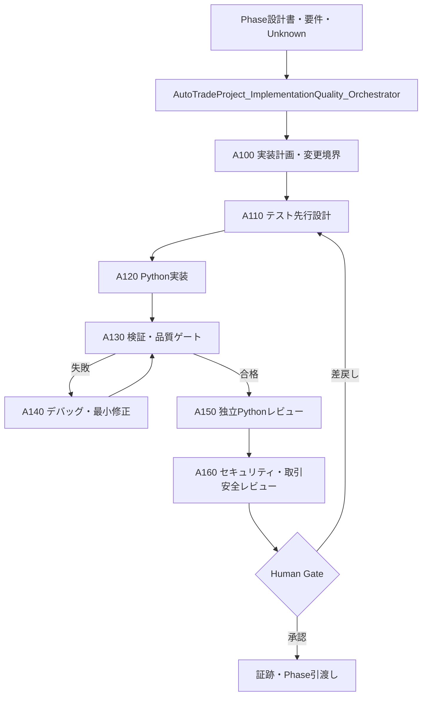

# Phase 2–5 本実装 AI 実行基盤構築計画

作成日: 2026-08-06  
対象: 自動トレードシステム Phase 2 以降（Python による実装、テスト、デバッグ、レビュー）  
状態: 実行前計画（ECC の導入済み部品を基に、Phase 2 の小さな実装単位で検証してから標準化する）

## 1. 目的と完了条件

Phase 2–5 の各実装作業を、要求・設計に対するトレーサビリティを失わずに、次の閉ループで自律実行できる基盤にする。

```text
設計を読む → テストを先に書く → 実装する → 静的検査・テストを実行する
     ↑                                                    ↓
  Human Gate ← 独立レビュー ← 失敗を切り分けて最小修正する
```

完了条件は次のとおりとする。

- 各実装単位に、入力設計書、変更範囲、テスト計画、実行ログ、レビュー結果、次工程への引渡し条件がある。
- Python の新規・変更コードは、テスト先行、型検査、lint、単体・結合テスト、差分レビューを通る。
- 失敗時は原因仮説、再現手順、修正差分、再実行結果を残し、同じ失敗を無限に再試行しない。
- Critical / High の未解決指摘、未知のデータ品質、Secret の露出、実取引へ接続する変更がある場合は自動で次工程へ進めず Human Gate に止まる。
- Phase 2 の一実装単位で有効性を確認してから、Phase 3–5 へ横展開する。

## 2. 取得元と導入済み資産

### 2.1 取得元の固定

- リポジトリ: `https://github.com/affaan-m/everything-claude-code`
- ローカル参照コピー: `third_party/everything-claude-code/`
- 取得コミット: `623f2c020f052319657674e4e6c29ab5d0ad566b`
- ライセンス: MIT（利用・改変時は取得元とコミットを本計画および各派生部品に記録する）

### 2.2 導入済み Codex スキル

以下は `C:\Users\ute3g\.codex\skills\` に導入済みであり、次回以降の Codex ターンから利用できる。いずれも ECC の原文を保管し、プロジェクト固有の制約は後述する薄いラッパーで追加する。

| 区分 | 導入スキル | 使用場面 |
|---|---|---|
| Python 実装 | `python-patterns`, `coding-standards` | 型、例外、境界、可読性を含む実装 |
| テスト | `python-testing`, `tdd-workflow`, `e2e-testing` | pytest、fixture、TDD、結合/E2E テスト |
| 検証 | `verification-loop`, `ai-regression-testing`, `eval-harness` | 静的検査、回帰、実行基盤そのものの評価 |
| デバッグ | `agent-introspection-debugging` | 再現、切り分け、復旧、再発防止 |
| レビュー・安全 | `security-review`, `llm-trading-agent-security` | API、Secret、外部データ、取引権限を扱う変更 |
| 自律運用 | `agent-self-evaluation`, `continuous-agent-loop`, `autonomous-loops`, `workspace-surface-audit` | 完了判定、品質ゲート、停止条件、構成監査 |

### 2.3 利用可能なサブエージェント

この実行環境には ECC 由来の次の役割が既に存在する。新規に同名部品を重複作成せず、プロジェクト固有のラッパー Agent から明示的に呼び分ける。

| 工程 | 利用する役割 |
|---|---|
| 計画・設計読解 | `planner`, `architect`, `explorer` |
| 実装 | `worker`, `tdd-guide` |
| テスト | `tdd-guide`, `e2e-runner` |
| デバッグ | `build-error-resolver` |
| コードレビュー | `python-reviewer`, `code-reviewer` |
| セキュリティ／データベース | `security-reviewer`, `database-reviewer` |
| リファクタリング・運用 | `refactor-cleaner`, `loop-operator`, `harness-optimizer` |

### 2.4 導入しない互換性のない自動化

ECC の Claude Code 専用フック、`CLAUDE_PLUGIN_ROOT` 依存スクリプト、Claude 用 command、未固定版 `npx` を起動する MCP 設定は有効化しない。これらは Codex Desktop のイベントモデルと互換でなく、外部プロセス・ネットワーク・認証情報への影響範囲を本計画の目的を超えて広げるためである。必要な効果は、後述するプロジェクト内スクリプト、Agent の指示、証跡、Human Gate で再現する。

## 3. 設計判断と責務境界

| ID | 判断 | 理由 |
|---|---|---|
| DEC-AIF-01 | ECC は原典スキル集として固定し、業務固有の指示は `autotrade_skill_*` ラッパーに置く | アップストリーム更新と本プロジェクトの取引安全ルールを分離するため |
| DEC-AIF-02 | 実装者とレビューアを同じ役割・同じ入力だけで完結させない | 同一視点による見逃しを抑え、独立した失敗仮説とレビューを得るため |
| DEC-AIF-03 | 品質ゲートはフックではなく、オーケストレータが必ず実行するチェックリストとスクリプトにする | Codex Desktop での再現性と、実行内容の追跡性を確保するため |
| DEC-AIF-04 | 実取引・Broker 認証情報・実データ取り込みは Phase 2–5 の自動実装ループから除外する | 誤発注、Secret 漏えい、外部副作用を防ぐため |
| DEC-AIF-05 | Phase 2 の Market Data の一機能をパイロットにし、合格後に横展開する | 大きな実装を始める前にプロンプト、品質ゲート、証跡の妥当性を実証するため |

## 4. 完成時の構成



新設候補の名前は全て汎用名前空間に置く。Phase 固有名を先に作らない。

| 種別 | 新設候補 | 主責務 | ECC の組合せ |
|---|---|---|---|
| Orchestrator | `AutoTradeProject_ImplementationQuality_Orchestrator_v0_1` | 実装単位の状態遷移、停止条件、証跡、Human Gate | `continuous-agent-loop`, `verification-loop`, `autonomous-loops` |
| Agent | `AutoTrade_A100_ImplementationPlanner_v0_1` | 詳細設計から実装チケットとテスト境界を切り出す | `planner`, `architect`, `explorer` |
| Agent | `AutoTrade_A110_PythonTestEngineer_v0_1` | 失敗するテスト、fixture、境界・異常系を先に作る | `tdd-guide`, `python-testing`, `ai-regression-testing` |
| Agent | `AutoTrade_A120_PythonImplementer_v0_1` | 承認済みの最小差分だけを実装する | `worker`, `python-patterns`, `coding-standards` |
| Agent | `AutoTrade_A130_VerificationEngineer_v0_1` | formatter、lint、型、テスト、coverage、差分を実行・記録する | `verification-loop`, `eval-harness` |
| Agent | `AutoTrade_A140_DebugEngineer_v0_1` | 失敗を再現・分類し、最小修正後に再検証する | `build-error-resolver`, `agent-introspection-debugging` |
| Agent | `AutoTrade_A150_PythonCodeReviewer_v0_1` | 正確性、型、境界、回帰、テスト不足を独立レビューする | `python-reviewer`, `code-reviewer` |
| Agent | `AutoTrade_A160_TradingSecurityReviewer_v0_1` | Secret、外部入力、データ完全性、誤発注経路を確認する | `security-reviewer`, `security-review`, `llm-trading-agent-security` |
| Skill | `autotrade_skill_python_implementation_v0_1` | 金融時系列、ID、時刻、数値型、例外境界の実装指針 | `python-patterns` |
| Skill | `autotrade_skill_python_test_quality_v0_1` | pytest、再現性、fixture、Golden/回帰テスト、quality gate | `python-testing`, `tdd-workflow`, `verification-loop` |
| Skill | `autotrade_skill_debug_recovery_v0_1` | 失敗分類、再現、最小修正、反復上限、証跡 | `agent-introspection-debugging` |
| Skill | `autotrade_skill_python_code_review_v0_1` | Python/安全/取引ドメインのレビュー観点 | `python-reviewer`, `code-reviewer`, `security-review` |

## 5. 標準実装ループ

各実装単位は 1 モジュールまたは 1 つの振る舞いに限定し、以下を必須とする。

| 状態 | 入力 | 実行 | 次へ進む条件 | 証跡 |
|---|---|---|---|---|
| `READY` | 承認済み詳細設計、要件 ID、Unknown | 変更範囲と禁止範囲を宣言 | Unknown が実装判断を妨げない | change manifest |
| `TEST_DESIGNED` | 受入条件、境界、失敗系 | まず失敗する pytest を作成 | 正常・境界・異常・回帰の観点がある | test plan と red 実行ログ |
| `IMPLEMENTED` | failing test | 最小の Python 差分を実装 | 設計外の変更がない | diff と実装メモ |
| `VERIFIED` | 実装差分 | formatter → lint → 型 → unit → integration → coverage の順に実行 | 全必須ゲートが Pass | 実行コマンド・結果・環境情報 |
| `DEBUGGING` | 失敗ログ | 再現、原因仮説、最小修正、再実行 | 同じ署名の失敗を 2 回連続させない | debug report |
| `REVIEWED` | Pass 済み差分 | Python と安全の独立レビュー | Critical / High が 0、残件は明記 | review report |
| `GATED` | 全証跡 | 人間が受入・保留・差戻しを判断 | 明示承認だけが引渡しを許可 | Human Gate 記録 |

失敗ループの上限は「同じ root cause 仮説で 2 回」までとし、3 回目は `BLOCKED` に遷移して人間へ原因・選択肢・必要な追加情報を提示する。テストを削除、skip、期待値緩和、型検査や lint の無効化で Pass を作ることは禁止する。

## 6. 品質ゲートと安全停止

### 6.1 基本ゲート

| Gate | 目的 | 必須条件 |
|---|---|---|
| G-01 変更境界 | 設計外の実装を防ぐ | 要件 ID、詳細設計 ID、対象・非対象ファイルを記録 |
| G-02 TDD | 仕様を先に固定する | 実装前に失敗するテストを確認。ただし純粋な設定・文書変更は N/A の根拠を記録 |
| G-03 静的品質 | 早期欠陥を検出する | formatter、lint、型検査が Pass。ツール未導入は導入計画を残して Gate を閉じない |
| G-04 テスト品質 | 振る舞いと回帰を確認する | unit と必要な integration、coverage 閾値、固定 fixture の再現性が Pass |
| G-05 デバッグ | 一時しのぎを防ぐ | 失敗時に再現手順・原因仮説・修正根拠・再実行結果が揃う |
| G-06 独立レビュー | 見逃しを減らす | `python-reviewer` と `code-reviewer` を必須。データ境界では `security-reviewer` も必須 |
| G-07 引渡し | Phase 間の安全性を保つ | レビュー残件、Unknown、依存、ロールバック方法を受入記録に残す |

### 6.2 取引システム固有の停止条件

次の場合は自動修正や実行を停止して Human Gate に移す。

- API key、口座 ID、Secret、実データの機微情報をログ・fixture・差分から検出した場合。
- Broker、注文、送金、実取引 API、Live 設定へ到達するコードや設定を変更する場合。
- `float` による金額・数量・損益の表現、時刻のタイムゾーン欠落、非決定的な data version を検出した場合。
- 品質ゲートの無効化、テストの skip、期待値の根拠なき変更、レビューの Critical / High 指摘がある場合。
- Phase の設計境界を超え、Strategy、Broker、Risk、Live 運用の仕様決定を必要とする場合。

## 7. 実施ステップ

### S0: 導入証跡と互換性マトリクスを確定する

成果物: `plan/phase2-5_ai_foundation/00_導入台帳.md`、`00_互換性マトリクス.md`  
内容: ECC コミット、導入スキル、利用する既存サブエージェント、除外する Claude 専用フック/MCP、ライセンス、更新方法を記録する。

実行プロンプト:

```text
ECC の固定コミットと、現在の Codex Skills/Agent の可用性を読取りで確認し、導入台帳と互換性マトリクスを plan/phase2-5_ai_foundation/ に作成してください。
Claude 専用フック・未固定の外部 MCP は有効化しないでください。各採用・除外について、理由、代替手段、確認コマンドを記録してください。
```

完了基準: 原典、バージョン、利用責務、互換性、更新手順が一意である。

### S1: プロジェクト固有スキルと Agent の仕様を作る

成果物: `doc/ai_foundation/18_Phase2-5本実装AI実行基盤設計書.html` と各 Agent/Skill の仕様  
内容: 第 4 節の新設候補について、入力、出力、禁止事項、停止条件、利用する ECC 部品、証跡、レビュー基準を定義する。

実行プロンプト:

```text
AutoTradeComponentLifecycle_Orchestrator_v0_1 を用い、Phase 2–5 の Python 実装品質基盤を設計してください。
既存の汎用 AutoTrade 部品と ECC 導入済みスキル・既存サブエージェントを再利用し、重複作成を避けてください。
新設候補ごとに責務、入出力、状態遷移、禁止事項、停止条件、証跡、更新元 ECC コミットを日本語で記載してください。
```

完了基準: `AutoTrade_*` / `autotrade_skill_*` の命名、責務境界、既存部品の再利用、Phase 1 部品の非使用がレビュー済みである。

### S2: 実行可能な最小基盤を実装する

成果物: `.codex/orchestrators/`、`.codex/agents/`、`.codex/skills/`、`scripts/quality_gate/`、`tests/quality_gate/`  
内容: 一括実行器ではなく、Run Manifest を入力として同じ順序で品質ゲートを実行し、JSON または Markdown の証跡を返す最小実装を作る。Python 実装基盤が未確定のため、実際の lint/type/test コマンドは `pyproject.toml` 導入時に確定する。

実行プロンプト:

```text
承認済みの AI 実行基盤設計書に従い、最小の実装品質オーケストレータ、Agent、Skill、品質ゲートスクリプトを実装してください。
スクリプトは外部ネットワーク、Broker、Secret、実取引に接続せず、Run Manifest に定義されたローカル検査だけを実行してください。
まずスクリプト自身の pytest を失敗状態で作り、TDD と独立レビューを完了してから追加してください。
```

完了基準: dry-run、成功、テスト失敗、lint 失敗、型失敗、レビュー差戻し、Human Gate 停止の全経路を自動テストできる。

### S3: Phase 2 の一機能でパイロットする

対象候補: `src/autotrade/market_data/` の Raw/Normalized 変換または Instrument Catalog の一振る舞い。  
成果物: `plan/phase2/実装証跡/`、`plan/phase2/HumanGate/`、実装・テスト・レビュー差分。

実行プロンプト:

```text
Phase 2 の承認済み詳細設計から、Raw/Normalized 変換または Instrument Catalog の一つの振る舞いだけを選び、ImplementationQuality オーケストレータで実装してください。
要件 ID と詳細設計 ID を Run Manifest に記録し、テスト先行、静的検査、pytest、独立 Python レビュー、取引安全レビュー、Human Gate を順番に実施してください。
実データ、Databento 認証情報、Broker 接続は使わず、固定 fixture のみを使ってください。
```

完了基準: 第 6 節の全 Gate が証跡で追跡でき、レビューによる少なくとも一回の改善を反映し、Human Gate が受入可能と判断する。

### S4: パイロット評価と基盤の改訂を行う

成果物: `plan/phase2-5_ai_foundation/04_パイロット評価.md`、改訂履歴、再レビュー結果。  
評価軸: 仕様逸脱の検出数、初回 Pass 率、再試行回数、レビューの有効指摘率、テストの振る舞い網羅、証跡欠落数、所要時間。

実行プロンプト:

```text
Phase 2 パイロットの実行ログ、差分、テスト、レビュー、Human Gate 記録を評価してください。
失敗原因を「仕様・実装・テスト・ツール設定・エージェント指示・外部依存」に分類し、再発防止の変更を最小限提案してください。
Critical/High 指摘、証跡欠落、設計外変更が残る場合は Pass にしないでください。
```

完了基準: 改訂は根拠と影響範囲を持ち、品質基盤自身のテスト・レビュー・再レビューが Pass する。

### S5: Phase 3–5 へ段階展開する

Phase 3 は Strategy/Backtest、Phase 4 は Broker/Paper、Phase 5 は Live 前の安全機能という順に、Phase ごとの実行計画書で有効化範囲を決める。

| Phase | 有効化する追加観点 | 必須 Human Gate |
|---|---|---|
| Phase 3 | Golden test、再現可能な Backtest、look-ahead bias、run manifest | 戦略仕様と期待値 fixture の承認 |
| Phase 4 | Adapter contract、Paper 環境分離、order/fill 整合性、障害注入 | Paper 接続資格情報と発注上限の承認 |
| Phase 5 | kill switch、最小権限、監視、ロールバック、Shadow/Paper 証跡 | Live を許可するかの経営・運用判断。自動承認禁止 |

実行プロンプト:

```text
対象 Phase の実行計画書を作成してください。Phase 2 パイロットで Pass した AI 実行基盤だけを再利用し、Phase 固有の安全条件、Golden/統合テスト、Human Gate、Unknown を追加してください。
Live 接続、権限昇格、Secret 登録、外部サービスへの書込みは人間の明示承認があるまで実行対象から除外してください。
```

完了基準: 各 Phase の開始前に、対象範囲・品質ゲート・担当 Agent・証跡・Human Gate が計画書で固定される。

## 8. 証跡、構成、更新運用

- 実装ログ: `plan/phaseX/実装証跡/<run-id>/`
- テスト結果: `plan/phaseX/実装証跡/<run-id>/test-results/`
- レビュー: `plan/phaseX/実装証跡/<run-id>/reviews/`
- Human Gate: `plan/phaseX/HumanGate/<gate-id>.md`
- 基盤の評価: `plan/phase2-5_ai_foundation/`
- 正式な設計書: `doc/ai_foundation/`。追加・更新時は `doc/index.html` を更新する。

ECC の更新は、Phase の途中では実施しない。Phase 境界で原典のコミットを更新候補として調査し、差分・ライセンス・互換性・悪性コード/外部実行面をレビューし、パイロットを再実行してから採用する。

## 9. 初回 Human Gate で決める事項

1. Python の標準ツールチェーン（`uv`/`pip`、`ruff`、`mypy` または `pyright`、`pytest`、coverage）と固定バージョン。
2. カバレッジの基準値。ECC の 80% は出発点とし、ドメイン重要度別の閾値とするかを決める。
3. Phase 2 パイロットの実装対象と、その詳細設計の承認状態。
4. E2E の対象。現時点で UI/API 面がない場合、E2E は N/A とし統合テストを優先する。
5. 生成する Agent/Skill/Orchestrator の初版を、プロジェクト共通部品として承認するか。

## 10. 本計画のレビュー観点

- `AutoTradePhase1_*` と `autotrade_phase1_skill_*` を新規実装工程に混在させていないか。
- ECC 原典を盲目的に有効化せず、Codex 互換性、外部副作用、取引安全を分けているか。
- 実装者、検証者、レビュー者の責務が重複していないか。
- Pass の根拠がログ、テスト、差分、レビュー、Human Gate で追跡できるか。
- Phase 5 の Live 判断を自律ループに委ねていないか。
