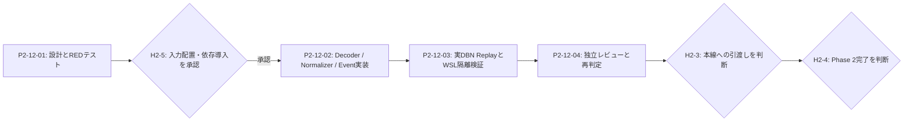

# Phase 2 P2-12 実DBN変換・Replay再検証 実行計画書 v0.1

作成日: 2026-08-08
対象: Phase 2の残課題 `BLK-P2-008`（実DBNを `NormalizedBar` / `MarketEvent` に変換し、Replayで確かめる境界）
親計画: `plan/Phase2_実行計画書_v0.1_2026-08-04.md` のP2-11後続
状態: 実行前。P2-12-01は着手可能、P2-12-02以降の実DBNを使う隔離検証にはH2-5の承認が必要。

## HASH-FUTURE-01〜08／Step 05 現行運用ルール

本計画では、文章管理、差分許可、Evidence・baseline・manifestの同一性確認だけを目的とする管理用hashを計算・保存・照合しない。ユーザー委譲により、管理用hashのstale停止・不一致retryは強制スキップして完了する。実DBN、raw/catalog、依存wheel、normalized/replay入力・出力の安全・データ・再現性に直接必要なprotected hashは、目的・対象・失敗時停止を明記して維持し、不一致時はfail-closedで停止する。過去hashは履歴として残すが、現行の管理Gateへ再利用しない。

以下の全プロンプトとスクリプトへこの権限を適用する。成果物の存在・構造、path、固定command、テスト、レビュー、Unknown、Secret、外部I/O、Human Gate、protected hash結果で受入を判定し、管理hashの代替としてfingerprint、UUID、mtime、別名checksumを追加しない。Agent未起動は独立実行済みとせず、`RUNTIME_DISPATCH_FALLBACK_REQUIRED` として記録する。

## 1. 目的

P2-08で最小取得した実DBN（`GLBX.MDP3` / `ohlcv-1m` / `MCL.FUT` / 1分）の内容を、外部提供元の型をCoreへ漏らさずに読み取り、UTC・銘柄ID・品質状態・Raw参照を持つ `NormalizedBar`、続いて `MarketEvent` へ変換する。実DBNを入力としたReplayを再現し、Data Gateを根拠付きで再判定する。

中学生でも分かる説明: すでに「本物のデータが入った箱」はあります。P2-12では、その箱を開けて必要な項目だけを読み、システム用の同じ形の表へ書き直します。読めない箱、時間や銘柄が分からない行、値がおかしい行は、無理に使わず止めます。

## 2. 現在確認できる入力と境界

| 項目 | 現在の状態 | P2-12での扱い |
|---|---|---|
| 実DBN | Windows側の `tests/evidence/phase2/RUN-P2-DP-002/raw/mcl-fut-20260615T1200Z-1201Z.dbn` に存在。22,760 bytes、SHA-256は `8fd0286a477e073c83e8306c4e1a8ebec3af693141010563edd7e0ec1990b65e`。Git管理外。 | 読み取り専用で使う。checksum不一致なら直ちに停止し、変換結果を作らない。 |
| Core側 | Raw / Normalized Store、QualityChecker、Manifest、fixture用MarketEvent、Catalog Resolverは実装済み。 | DBN decoder、Normalizer、MarketEvent生成の接続だけを追加する。既存のfixture契約を壊さない。 |
| Python依存 | 通常のプロジェクト `.venv` にはDBN decoder用ライブラリが未導入。 | P2-12-01で公式仕様と採用候補を固定する。P2-12-02で使う版・wheel hashをH2-5承認後に固定する。 |
| WSL | Git同期は可能だが、Git管理外の実DBNはWSLに存在しない。 | AIはコピーしない。H2-5承認後に人が隔離用の読取専用場所へ置き、runnerは存在とprotected input hashだけを確認する。管理用差分hashは扱わない。 |

### 2.1 対象外

- Databento APIの追加呼出し、取得範囲・費用・entitlementの拡大、Secretの投入・表示
- Broker接続、注文、Strategyの利益評価、Backtest採否、Phase 3の実装
- P2-08の実DBNをGitへ追加すること、AIによるWindowsからWSLへの直接コピー

## 3. 人による承認とUnknown

| ID | 内容 | 状態と実施時点 | 安全な扱い |
|---|---|---|---|
| H2-2 | P2-08の最小外部取得 | 承認済み。ただし追加取得は含まない。 | P2-12は既取得ファイルだけを読む。外部接続はしない。 |
| H2-5 | 既取得DBNを隔離WSL検証に使うための入力配置、および固定した公式decoder依存の導入 | 未承認。P2-12-01の設計・REDテスト後、P2-12-02の実DBN結合試験・P2-12-03の前に承認を得る。 | 人がhashを確認した既存DBNだけをWSLの保護された読取専用場所へ配置する。AIはコピーしない。依存は版・配布元・wheel hashを記録し、隔離実行中のネットワーク接続は禁止する。 |
| H2-3 | 実DBN Replay結果を本線へ渡す判断 | P2-12-04でHighが0件、Data GateがPASSになった場合だけ判断する。 | 承認まではSignal生成とPhase 3への引渡しを停止する。 |
| H2-4 | Phase 2完了・Phase 3移行 | H2-3後に別途判断する。 | P2-12だけでは自動承認しない。 |

H2-5の承認文例:

> P2-08で取得済みのDBN一件（SHA-256: `8fd0286a477e073c83e8306c4e1a8ebec3af693141010563edd7e0ec1990b65e`）を、追加取得やSecret投入を行わず、WSL隔離検証で読取専用に使用することを承認します。DBN decoder依存は、版・配布元・wheel hashを証跡に記録し、隔離検証中の外部接続を禁止してください。

## 4. 実行順序



- P2-12-01はH2-5前でも実行できる。
- P2-12-02の固定fixtureだけの実装・単体テストはH2-5前でも可能だが、実DBNを読む結合試験と依存導入はH2-5後に限る。
- P2-12-03とP2-12-04は前のステップが終わってから順に行う。並列実行しない。
- `BLK-P2-008`をUnknownのままPassへ変えない。途中で変換できない場合は、理由と証拠を同じ台帳行へ追記する。

## 5. 成果物と保存先

| 成果物ID | 内容 | 保存先 |
|---|---|---|
| P2-D16 | 実DBN変換・Replay詳細設計書、変換表、REDテスト仕様 | `doc/phase2/09_実DBN変換/09_実DBN変換_Replay実装詳細設計書.html` |
| P2-D17 | 実DBN変換・Replay検証結果 | `doc/phase2/09_実DBN変換/09_実DBN変換_Replay検証結果.html` |
| P2-D18 | 実DBN変換の独立レビュー・Phase 2再判定 | `doc/phase2/09_実DBN変換/09_実DBN変換_独立レビューと再判定.html` |
| Run証跡 | 実DBNのprotected hash、依存の版/hash、Manifest構造、固定4 Gate、Replay出力、レビュー | `tests/evidence/phase2/RUN-P2-DBN-001/` |
| 実行ログ | 各ステップの実行内容、RED/GREEN、承認状態 | `plan/phase2/ログ/P2-12_*.md` |

P2-D16からP2-D18のHTMLを追加したときは、必ず `doc/index.html` とPhase 2要件追跡マトリクスを更新する。

## 6. 実行プロンプト

### P2-12-01 実DBN変換の詳細設計・公式仕様照合・REDテスト

```text
ステップID: P2-12-01
ロール: 実DBN変換・Replay 実装詳細設計者
使用オーケストレータ完全名: AutoTradeProject_ImplementationDesign_Orchestrator_v0_1
担当サブエージェント完全名: AutoTrade_A82_ImplementationDetailDesigner_v0_1, AutoTrade_A91_ImplementationDetailReviewer_v0_1, AutoTrade_A50_AdapterArchitect_v0_1, AutoTrade_A70_OpsSecurityArchitect_v0_1
使用モデル: gpt-5.6-terra
使用Skill完全名: autotrade_skill_implementation_detail_design_v0_1, autotrade_skill_implementation_detail_review_v0_1, autotrade_skill_adapter_boundary_v0_1, autotrade_skill_official_research_v0_1, autotrade_skill_test_strategy_v0_1, autotrade_skill_traceability_v0_1

Phase Runbook:
- phase_id: Phase 2
- step_id: P2-12-01
- output_root: doc/phase2/09_実DBN変換/
- log_root: plan/phase2/ログ/
- detail_boundary: P2-08で取得済みのDBNを、Vendor固有型をCoreへ出さずにDecodedRecord、NormalizedBar、MarketEventへつなぐ契約だけを詳細化する。外部API、Secret、追加取得、Strategy、Broker、Phase 3実装は対象外。
- human_gate_policy: H2-5未承認中は、既存Windows側DBNの読み取りによる構造確認と固定fixtureのREDテスト設計だけを行う。依存導入、WSLへの実DBN配置、実DBN結合試験は行わない。

発火制御:
- 上記の完全名で指定したAI部品だけを使用する。
- 指定AI部品が存在しない場合は、既存Skill等で代替せず、不足部品として報告して停止する。
- AutoTradePhase1_* または autotrade_phase1_skill_* は参照対象として読むだけにする。実行部品として起動しない。
- default_orchestrator は変更しない。

入力:
- doc/phase2/03_市場データ詳細設計/05_Market_Data_Adapter詳細設計書.html
- doc/phase2/03_市場データ詳細設計/06_Raw_Normalized_Store詳細設計書.html
- doc/phase2/03_市場データ詳細設計/07_Instrument_Catalog詳細設計書.html
- doc/phase2/03_市場データ詳細設計/08_実装詳細設計レビュー反映記録.html
- doc/phase2/06_検証/06_Data_Quality_Replay検証結果.html
- doc/phase2/08_完了判定/08_Phase2完了判定とPhase3移行承認書.html
- doc/phase2/02_データソース調査/02_Databento公式仕様確認結果.html
- tests/evidence/phase2/RUN-P2-DP-002/acquisition-result.md
- tests/evidence/phase2/RUN-P2-DP-002/raw/mcl-fut-20260615T1200Z-1201Z.dbn（Windows側に存在する場合だけ読み取り。期待SHA-256は8fd0286a477e073c83e8306c4e1a8ebec3af693141010563edd7e0ec1990b65e）
- src/autotrade/market_data/ と tests/market_data/
- doc/00_全Phase残課題Blocked統合台帳.html

タスク:
実DBNのデコード、正規化、MarketEvent生成、実DBN Replayを、実装者が追加推測なしで着手できる詳細設計とREDテストとして作成してください。

作業:
1. DBNのofficial primary sourceだけを確認し、採用するdecoder依存候補、対応schema、対応record、版の固定方法を記録する。SDKの型・例外・SecretをCoreの公開型へ出さない。
2. DBN header / schema / record / price・volume・時刻 / symbolの入力から、DecodedRecord、NormalizedBar、MarketEventへ渡す値、変換規則、時刻の意味、精度、丸め禁止、失敗時の停止理由を表にする。
3. `src/autotrade/market_data/` の予定モジュール、公開型、依存方向、Raw Store・Catalog Resolver・QualityChecker・Manifestへの受渡しをMermaid図と受渡し表で示す。
4. DBN magic不一致、header不正、未対応schema/record、checksum不一致、非UTC・naive時刻、symbol未解決・複数解決、欠損/不正価格/出来高、未確定bar、decoder例外、Quality Gate不合格をすべてfail-closedにするREDテストを先に追加する。
5. 実DBNの期待値は、hash、record数、UTC範囲、resolved instrument_id、normalized content hash、MarketEvent系列の順序として固定する。外部から現在時刻を取らず、実DBN自体をGitへ追加しない。
6. P2-D16を作成し、A91がDD-01からDD-12とP2-11後の変更影響を再レビューする。Critical/Highがあれば設計を改訂して再レビューする。
7. `doc/index.html`、Phase 2要件追跡マトリクス、統合台帳のBLK-P2-008を更新する。問題内容・修正方針には既存記述の直下に中学生でも分かる説明を置き、人による承認の記載は日本語にする。

レビュー:
- AutoTrade_A91_ImplementationDetailReviewer_v0_1 が、DBN固有の型がCoreへ漏れないか、時刻・数値・catalog解決・失敗停止・テストが実装可能な粒度かをレビューする。
- AutoTrade_A50_AdapterArchitect_v0_1 が、Decoderの責務が取得・Store・Strategyと混ざっていないかをレビューする。
- AutoTrade_A70_OpsSecurityArchitect_v0_1 が、Secret、外部I/O、実DBNのGit混入、WSLへの無断コピーを監査する。

完了条件:
- P2-D16とREDテストが存在し、実DBN変換の入力・出力・停止条件・期待Replayが固定されている。
- H2-5で人が承認すべき入力配置・依存導入の内容が統合台帳だけを見て分かる。
- 実DBN変換を実装済みとは書かず、P2-12-02へ渡す未実装境界として残す。
```

### P2-12-02 DBN Decoder・Normalizer・MarketEvent最小実装

```text
ステップID: P2-12-02
ロール: 実DBN変換 Python実装者
使用オーケストレータ完全名: AutoTradeProject_ImplementationQuality_Orchestrator_v0_1
担当サブエージェント完全名: AutoTrade_A110_PythonTestEngineer_v0_1, AutoTrade_A120_PythonImplementer_v0_1, AutoTrade_A130_VerificationEngineer_v0_1, AutoTrade_A150_PythonCodeReviewer_v0_1, AutoTrade_A160_TradingSecurityReviewer_v0_1
使用モデル: gpt-5.6-terra
使用Skill完全名: autotrade_skill_python_implementation_v0_1, autotrade_skill_python_test_quality_v0_1, autotrade_skill_debug_recovery_v0_1, autotrade_skill_python_code_review_v0_1, autotrade_skill_adapter_boundary_v0_1

Phase Runbook:
- phase_id: Phase 2
- step_id: P2-12-02
- output_root: doc/phase2/09_実DBN変換/
- log_root: plan/phase2/ログ/
- run_id: RUN-P2-DBN-001（P2-12-01でtarget_paths、依存の版とprotected hash、保護対象の入力hashを設計し、H2-5承認後にtrusted scopeへ登録して使用する。管理用差分hashは登録しない）
- detail_boundary: P2-D16のREDテストを満たす最小のDBN decoder、Normalizer、MarketEvent生成、Raw/Normalized/Manifest接続だけを実装する。既存fixture、Catalog Resolver、Store契約を置換しない。
- human_gate_policy: H2-5未承認なら、依存導入、実DBN読込、WSL入力配置、実DBN結合試験を開始しない。固定fixtureだけの純粋関数テストはGREENにできても、実DBN境界はUNKNOWNのままにする。

発火制御:
- 上記の完全名で指定したAI部品だけを使用する。
- 指定AI部品が存在しない場合は、既存Skill等で代替せず、不足部品として報告して停止する。
- AutoTradePhase1_* または autotrade_phase1_skill_* は参照対象として読むだけにする。実行部品として起動しない。
- default_orchestrator は変更しない。

入力:
- P2-D16 実DBN変換・Replay実装詳細設計書
- tests/market_data/ のP2-12 REDテスト
- src/autotrade/market_data/ の既存実装
- tests/evidence/phase2/RUN-P2-DP-002/acquisition-result.md
- H2-5承認記録、固定したdecoder依存の版・配布元・wheel hash
- scripts/quality_gate/trusted_scopes.json
- doc/00_全Phase残課題Blocked統合台帳.html

タスク:
P2-D16とREDテストの範囲だけで、実DBNを安全にDecodedRecord、NormalizedBar、MarketEventへ変換できる最小実装を作成してください。

作業:
1. H2-5承認と実DBN hashを確認する。どちらかが欠ける場合は、実DBN境界を実行せず、台帳のBLK-P2-008にUNKNOWNとして記録する。
2. P2-D16で固定したdecoder依存だけを、Secretなし・版/hash記録ありで導入する。SDK型・例外はAdapter内部へ閉じ込める。
3. DBN header、schema、recordを検証してから、Vendor非依存の中間型へ変換する。未対応値やdecoder例外は `DECODE_OR_SCHEMA_ERROR` 等の停止理由へ変換し、通常行を返さない。
4. Catalog Resolverを使って一意のinstrument_idを決め、UTC時刻、価格、出来高、Raw参照、品質flagsを持つNormalizedBarを作る。QualityCheckerが不合格ならNormalized Store、Manifest、MarketEventを作らない。
5. 正規化内容digest、raw SHA-256、catalog version、normalization version、fixtureまたは実DBNの入力種別、code revisionをManifestへ結び付ける。可変な現在時刻をdata_versionの材料に入れない。
6. REDテストをGREENにする。さらに、実DBNのchecksum一致、固定順序のMarketEvent、同一入力でのReplay一致、改ざん・不正入力の停止をテストする。
7. 対象外の外部API、追加取得、Secret、Broker、Strategy、Backtestへ触れない。既存の61テストを壊さない。
8. Windows側でformatter、lint、mypy、pytest、coverageを実行し、RED/GREEN、依存版/hash、対象scope、未実装境界をRun証跡へ保存する。

レビュー:
- AutoTrade_A150_PythonCodeReviewer_v0_1 が、型、例外、UTC、Decimal/価格精度、data_version、既存契約との整合をレビューする。
- AutoTrade_A160_TradingSecurityReviewer_v0_1 が、異常DBNや未知recordを警告だけで通していないか、Secretや実DBNのGit混入がないかを監査する。
- 指摘は修正後に再レビューし、Critical/Highを残さない。未実装範囲はPassにせずUNKNOWNとして台帳へ残す。

完了条件:
- P2-D16の実装対象REDテストがGREENである。
- 実DBNのprotected hash、decoder依存の版/hash、Manifest構造、Replay出力がRUN-P2-DBN-001に記録される。管理用Manifest／Evidence hashは記録しない。
- 品質不良、decoder失敗、catalog不一致でSignal生成まで到達しない。
- WSL実DBN検証はまだP2-12-03の対象として残る。
```

### P2-12-03 実DBN Replay・WSL隔離品質Gate

```text
ステップID: P2-12-03
ロール: 実DBN Replay検証者
使用オーケストレータ完全名: AutoTradeProject_ImplementationQuality_Orchestrator_v0_1
担当サブエージェント完全名: AutoTrade_A130_VerificationEngineer_v0_1, AutoTrade_A150_PythonCodeReviewer_v0_1, AutoTrade_A160_TradingSecurityReviewer_v0_1, AutoTrade_A80_DocumentIntegrator_v0_1
使用モデル: gpt-5.6-terra
使用Skill完全名: autotrade_skill_python_test_quality_v0_1, autotrade_skill_python_code_review_v0_1, autotrade_skill_execution_model_v0_1, autotrade_skill_traceability_v0_1, autotrade_skill_html_doc_writer_v0_1

Phase Runbook:
- phase_id: Phase 2
- step_id: P2-12-03
- output_root: doc/phase2/09_実DBN変換/
- log_root: plan/phase2/ログ/
- run_id: RUN-P2-DBN-001
- detail_boundary: H2-5で配置済みの一件の実DBNを読取専用で検証し、DBN→NormalizedBar→MarketEvent→Replayの実測結果を記録する。外部接続、追加取得、Secret、Brokerは使わない。
- human_gate_policy: H2-5承認済みで、WSLの保護場所にある入力のhashが一致する場合だけ実行する。H2-3は結果を見た後の承認であり、この検証だけではPhase 3を許可しない。

発火制御:
- 上記の完全名で指定したAI部品だけを使用する。
- 指定AI部品が存在しない場合は、既存Skill等で代替せず、不足部品として報告して停止する。
- AutoTradePhase1_* または autotrade_phase1_skill_* は参照対象として読むだけにする。実行部品として起動しない。
- default_orchestrator は変更しない。

入力:
- P2-D16、P2-12-02の実装・テスト・レビュー結果
- H2-5承認記録
- WSLの保護された読取専用DBN入力（SHA-256が `8fd0286a477e073c83e8306c4e1a8ebec3af693141010563edd7e0ec1990b65e` と一致すること）
- scripts/wsl_quality_gate/run_test.ps1
- scripts/quality_gate/trusted_scopes.json のRUN-P2-DBN-001登録
- tests/evidence/phase2/RUN-P2-DBN-001/

タスク:
実DBNで決定的にReplayできることを、WindowsとWSL隔離環境で検証し、P2-D17を作成してください。

作業:
1. 新しいtrusted scopeがtarget_pathsだけを検査すること、固定4 Gate、実DBNのprotected SHA-256、decoder依存の版/hash、Manifest構造、証跡先を確認する。管理用Manifest hashは扱わず、既存RUN-P2-RPL-001のManifestを流用しない。
2. Windows側で実DBNを一度変換し、NormalizedBar数、UTC範囲、instrument_id、quality flags、normalized content hash、data_version、MarketEvent系列を記録する。
3. 同じ入力・catalog version・normalization version・decoder依存・code revisionから、同じManifestとMarketEvent系列が再現することを確認する。
4. checksum不一致、DBN破損、未対応record、Catalog不一致、品質異常、未来時刻、非UTC時刻、内容改ざんを注入し、Data Gate FAILまたはUNKNOWN、Signal生成停止になることを確認する。
5. WSL隔離実行では `networkingMode=none`、host isolation確認、formatter/lint/type/testの固定4 Gateを実行する。WSL側のDBN入力がない、protected input／dependency hash不一致、依存wheelがない場合はBLOCKEDとして止め、Windowsの結果で代用しない。管理用hash不一致では停止しない。
6. P2-D17、JSON/Markdown証跡、P2-09/P2-11既存証跡への更新関係を作る。Data GateをPASS/FAIL/UNKNOWNの根拠付きで記録する。

レビュー:
- AutoTrade_A150_PythonCodeReviewer_v0_1 が、Replayの決定性、Manifest入力、対象scope、現在時刻・外部I/O依存を確認する。
- AutoTrade_A160_TradingSecurityReviewer_v0_1 が、DBN異常を警告だけで通していないか、実DBN・Secret・外部接続が漏れていないかを監査する。
- AutoTrade_A80_DocumentIntegrator_v0_1 が、P2-D17、Run証跡、統合台帳、doc/index.htmlのリンクを確認する。

完了条件:
- WSL固定4 Gateと実DBN Replayが根拠付きで記録される。
- Data GateがPASSでなければSignal生成とPhase 3への引渡しを禁止し、理由をBLK-P2-008へ更新する。
- P2-D17が存在し、保護対象の入力hash・依存版/hash・code revision・data_version・Replay出力を追跡できる。管理用Evidence／差分hashは追跡しない。
```

### P2-12-04 独立レビュー・Phase 2再判定

```text
ステップID: P2-12-04
ロール: 実DBN変換の独立レビュー・Phase 2再判定者
使用オーケストレータ完全名: AutoTradeProject_DesignDocSet_Orchestrator_v0_1
担当サブエージェント完全名: AutoTrade_A90_DesignReviewer_v0_1, AutoTrade_A91_ImplementationDetailReviewer_v0_1, AutoTrade_A80_DocumentIntegrator_v0_1, AutoTrade_A81_DesignDocSetWriter_v0_1
使用モデル: gpt-5.6-terra
使用Skill完全名: autotrade_skill_design_review_v0_1, autotrade_skill_implementation_detail_review_v0_1, autotrade_skill_red_team_review_v0_1, autotrade_skill_revision_integration_v0_1, autotrade_skill_html_doc_writer_v0_1, autotrade_skill_traceability_v0_1

Phase Runbook:
- phase_id: Phase 2
- step_id: P2-12-04
- output_root: doc/phase2/09_実DBN変換/
- log_root: plan/phase2/ログ/
- document_set_id: P2-DBN-CLOSURE-DOCSET
- detail_boundary: P2-12-01からP2-12-03の設計・実装・実測・証跡を独立に確認し、BLK-P2-008、H2-3、H2-4の現在状態を再判定する。Strategy、Backtest、Broker、追加取得は対象外。
- human_gate_policy: H2-3は、実DBNのData Gate PASSかつCritical/High 0件を確認した後に、Data Quality / Replayを本線へ渡すかを人が判断する。H2-4は別の承認として残す。

発火制御:
- 上記の完全名で指定したAI部品だけを使用する。
- 指定AI部品が存在しない場合は、既存Skill等で代替せず、不足部品として報告して停止する。
- AutoTradePhase1_* または autotrade_phase1_skill_* は参照対象として読むだけにする。実行部品として起動しない。
- default_orchestrator は変更しない。

入力:
- P2-D16、P2-D17
- tests/evidence/phase2/RUN-P2-DBN-001/
- P2-D05からP2-D15、P2-10/P2-11のレビュー結果
- doc/00_全Phase残課題Blocked統合台帳.html
- plan/Phase2_P2-12_実行計画書_v0.1_2026-08-08.md

タスク:
実DBN変換の採否、残課題、H2-3/H2-4で人が判断すべき内容をP2-D18として整理し、現在状態の正本を更新してください。

作業:
1. DBN decoderの依存閉じ込め、Rawのprotected hash、schema/record拒否、UTC、価格精度、catalog解決、Quality Gate、Manifest構造、Replay、WSL隔離の全観点をレビューする。管理用Manifest／Evidence hashはレビュー条件にしない。
2. Critical/Highを件数だけでなく、根拠・問題内容・修正方針・中学生でも分かる説明とともに表にする。説明列を増やさず、問題内容・修正方針の既存記述の下へ置く。
3. Data Gate PASSかつCritical/High 0件なら、BLK-P2-008の解決可否とH2-3の承認文を提示する。どれか一つでも満たさなければ、BLK-P2-008を解決済みにせず、Signal停止とPhase 3への引渡し禁止を維持する。
4. P2-D13、P2-D14、P2-D15、P2-D18、doc/index.html、Phase 2要件追跡、統合台帳を更新する。古い証跡は履歴として残し、現在の状態だけを統合台帳で更新する。
5. H2-4を自動承認しない。Phase 2完了の全条件と、ユーザーが承認する日本語の文をP2-D18と統合台帳へ明記する。

レビュー:
- AutoTrade_A90_DesignReviewer_v0_1 が要件追跡、文書間矛盾、Data Gateの誤読を確認する。
- AutoTrade_A91_ImplementationDetailReviewer_v0_1 がP2-D16と実装の差、DD-01からDD-12への影響、Critical/Highを確認する。
- Red Team観点で、壊れたDBN、未知record、改ざん、WSL入力差し替え、外部I/O、Secret混入、Data Gateの誤ったPASS化を監査する。

完了条件:
- P2-D18が存在し、BLK-P2-008の解決/継続が根拠付きで記録される。
- H2-3とH2-4で人が承認する内容が、統合台帳だけを読んで日本語で分かる。
- Data Gate UNKNOWN/FAIL、Critical/High残存をPASSやPhase 3移行として扱っていない。
```

## 7. P2-12完了判定

P2-12は、P2-D16からP2-D18、RED/GREEN、Windows検証、H2-5後のWSL隔離検証、独立レビューまで完了したときに完了とする。

`BLK-P2-008`の解決およびH2-3の承認候補となる条件は、次をすべて満たすことである。

1. 実DBN hashが固定値と一致し、decoder依存の版/hashを追跡できる。
2. 実DBNがUTC・一意のinstrument_id・品質状態・Raw参照を持つNormalizedBarとMarketEventへ変換される。
3. 同一入力から同一Replay系列を再現し、改ざん・異常・未知入力はfail-closedで止まる。
4. WSL `networkingMode=none` の固定4 Gateと実DBN Replayが通る。
5. 独立レビューのCritical/Highが0件である。

この条件を満たすまでは、Data GateはUNKNOWNまたはFAILのままにし、Signal生成とPhase 3への引渡しを禁止する。
