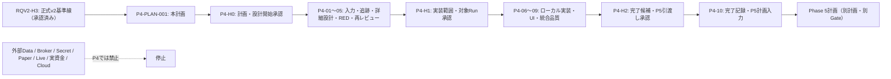

# Phase 4 実行計画書 v0.1

## 0. 文書情報

| 項目 | 内容 |
|---|---|
| 計画ID | `P4-PLAN-001` |
| Phase ID | `PHASE4_PRODUCT_APPLICATION_BACKTEST_2026_08_11` |
| 作成日 | 2026-08-11 |
| 状態 | `DRAFT_WAITING_P4-H0` |
| 目的 | 固定・再現可能な入力だけを使い、既存Python Coreを原則無改変で Product/Application 境界へ接続し、単一Backtest／Sweep／結果／Evidence を利用者が追跡できる形へ製品化する。 |
| この計画で実行しないこと | Phase 4の詳細設計、実装、テスト、外部I/O、依存導入、Broker／Secret／Paper／Live／実資金／Cloud。これらは `P4-H0` 以降の直接実行プロンプトでだけ扱う。 |
| 起点 | `RQV2-H3` 承認済みの正式要件v2基準線。これはPhase 4実装の承認ではない。 |
| 正本の置場 | 本計画は `plan/`、将来の正式設計書は `doc/phase4/`、実行ログは `plan/phase4/ログ/`、機械証跡は `tests/evidence/phase4/<RunId>/`。 |

## 1. 結論と発火制御

Phase 4 は、既存のReplay／Fill／Cost／Roll／Gap／Calendar／Holdout／Turtle／Manifest／固定fixtureを、**固定ローカル入力だけ**で利用できるProduct/Application境界へ接続するPhaseである。主対象は型付き設定、事前検査、Run／Job／Queue、単一Backtest、Sweep、Result、Evidence、固定ダミーによるUI接続、ローカル保存、停止・取消・再開の契約である。

この計画を作成しただけでは、`P4-01` 以降を起動しない。まず運用者が `P4-H0` を承認し、次にレビュー済み詳細設計・RED・対象Runを明記した `P4-H1` を承認し、最後に完了候補を `P4-H2` で承認する。未承認のGate、Unknown、外部I/O、Core差分、Critical／Highは安全側に停止する。



## 2. 入力正本と固定基準線

| 入力 | 参照目的 | 固定値・扱い |
|---|---|---|
| [`RQV2_Phase4以降再編ロードマップ_2026-08-11.md`](./requirements_update/RQV2_Phase4以降再編ロードマップ_2026-08-11.md) | P4の目的、依存、非対象、完了条件、Phase 5への送り先 | P4はProduct/Application基盤とBacktest製品化。P4→P5→P6→P7以降のDAGを変更しない。 |
| [`RQV2_Phase4計画引渡し入力一覧_2026-08-11.md`](./requirements_update/RQV2_Phase4計画引渡し入力一覧_2026-08-11.md) | RQV2-18の引渡し境界、Unknown／Blocked、入力優先順位 | RQV2-H3は承認済み。Phase 4の別計画・別Gateが必要。 |
| [`01_自動トレードシステム要件定義書_v2.html`](../doc/requirements/01_自動トレードシステム要件定義書_v2.html) | F01〜F06、REQ、UC、Screen、State、Gateの正本 | SHA-256: `97E248A36F71514B7C6312E614BE04B82D5EAE358541E195167E9611C14027FA` |
| [`01_自動トレードシステム要件定義書_v2.md`](./requirements_update/01_自動トレードシステム要件定義書_v2.md) | HTMLと対になる正式Markdown | SHA-256: `B54382E42D1DA3985B12A639CD1210075C5D7FF860B110772064B54816C6C921` |
| [`RQV2_既存Core再利用基準線_2026-08-11.md`](./requirements_update/RQV2_既存Core再利用基準線_2026-08-11.md) | Coreの再利用可否、凍結範囲、既存Evidence | 36 source filesの決定的Manifest SHA-256: `f8a25911a2dd4007e9d430f308965c36e9474abb37132d2813c3078d99ac1eeb`。関連tests／fixtures 58件のManifest SHA-256: `6909d2888bd65aac4dcf12a0827bcabab6d8766db39de29b4ef6b3b24ab13377`。 |
| [`RQV2_要件UIテスト追跡マトリクス_2026-08-11.md`](./requirements_update/RQV2_要件UIテスト追跡マトリクス_2026-08-11.md) | Q／UC／Screen／State／Test／Evidenceの抽出元 | Q基底305＋枝番3、UC67、Screen21、UISTATE10を母集団として扱う。P4の対象集合はP4-02で根拠付きに切り出す。 |
| [`01_自動トレードシステム_UIモック.html`](../doc/ui_mock/01_自動トレードシステム_UIモック.html) | 既存21画面・固定匿名ダミーの操作意味 | 現行UIモックは実装・認証・外部接続・実注文の証拠ではない。無承認で上書きしない。 |
| [`00_全Phase残課題Blocked統合台帳.html`](../doc/00_全Phase残課題Blocked統合台帳.html) | Human Gate、Unknown、Blockedの唯一の横断正本 | 本計画の `P4-H0`〜`P4-H2` はこの台帳に登録し、各実行Stepの開始前に再読する。 |

要件の主な読み取り範囲は、章13〜22（資産・時間足・Data／Strategy・Unit・Run／Job／Queue・Backtest／Sweep／Holdout）、章23〜30（Mode・Risk・OMSの外部副作用境界）、章31〜55（Ops・UI・API・保存・品質・Security）、章56〜62（Traceability・Gate・ロードマップ）である。具体的なP4追跡集合は、少なくとも `REQ-V2-0015`〜`REQ-V2-0055` とF05の該当要求を、P4-02でUC／Screen／State／Test／Evidenceへ対応付けて確定する。

## 3. Scope、固定事項、非対象

### 3.1 P4で実現する利用者能力

1. 型付きのData／Strategy／Config／Risk参照を、固定ローカル入力として作成・版管理し、実行前検査結果とともに保存する。
2. 単一BacktestとSweepを別Runとして開始し、Run／Job／Queueの状態、待機理由、取消、停止、上限付き再試行、checkpointからの再開を追跡する。
3. 固定Coreの出力を用いて、5指標、Chart、取引明細、全件表・CSV Job、同条件Run履歴、Holdout境界、Evidenceを表示・取得する。
4. API／UI／Worker／Persistenceの責務境界を、固定匿名ダミーとローカル契約試験で機械検証する。
5. 入力Manifest不一致、Risk参照欠落、未来参照、保存不一致、Idempotency不明、Critical／High、外部I/O混入ではFail-closedで停止する。

### 3.2 P4で固定する判断

| ID | 固定すること | 判断理由 |
|---|---|---|
| `P4-DEC-001` | P4の実行Modeは `Backtest` のみとし、外部副作用を持つModeへの昇格を実装・実行しない。 | `REQ-V2-0056`〜`0058` の副作用境界を守る。 |
| `P4-DEC-002` | 入力Dataは既存の固定local fixture／Manifestだけとし、継続取得・実市場期間・Provider契約を持ち込まない。 | P5でData契約・費用・Secret・Qualityを別Gateで扱う。 |
| `P4-DEC-003` | Coreの36 source filesを原則無改変とする。変更要求はP4の作業を止め、別詳細設計・RED・影響レビュー・Human Gateへ戻す。 | Phase 1〜3の検証済み境界を壊さず、再利用と製品化を分離する。 |
| `P4-DEC-004` | Riskは実金額・証拠金・契約数量を決めない。P4は型、参照、未入力拒否、監査記録だけを設計・実装対象にする。 | 実値は未確定であり、P6以降のPortfolio／Risk／OMS Gateに属する。 |
| `P4-DEC-005` | FastAPI、SQLite WAL／Migration、ローカルJob Queue／Worker、Reactは候補であり、P4-03のADRで採否・代替・依存固定を決める。 | 実装前に責務・保存・テスト可能性を検証し、推測でframeworkを固定しない。 |
| `P4-DEC-006` | UIは固定匿名ダミー・ローカル接続に限定する。既存UIモックの変更はP4-02の追跡とP4-H1の対象範囲に含まれる場合だけ行う。 | UIモックを実注文・認証・外部通信の証拠に一般化しない。 |

### 3.3 明示的な非対象と停止条件

以下を発見・要求・混入した時点で、そのStepを停止して統合台帳へ記録する。代替実装・暫定接続・環境変数投入では迂回しない。

- 外部Data取得、継続更新、Provider API、費用・entitlement、未固定の実市場データ
- Broker接続、注文、Paper、Live、実資金、口座、Secret、認証情報、Cloud、外部公開、端末・通信中継
- 実Cost／Slippage／Gap、正式Calendar、実市場の長期性能、利益性・頑健性の採用
- 実数量、証拠金、損失上限、Account、Portfolio、OMS、Risk実値の決定
- Core凍結範囲の無承認変更、入力／fixture／Manifestのhash不一致、Look-ahead、保存不一致、Idempotency未定義

## 4. Core再利用境界

| 区分 | P4での扱い | 禁止・要停止 |
|---|---|---|
| `src/autotrade/backtest/` | 既存のReplay、Backtest、結果、Cost／Roll／Gap／Holdout関連の公開済み最小APIを読む側として利用する。 | 対象内の振る舞い変更、既存fixtureの改変、P4都合の例外追加。 |
| `src/autotrade/market_data/` | 既存Catalog／Manifest／Replay入力契約を固定local入力として参照する。 | 外部取得、Provider接続、実Dataの補完、Calendar推測。 |
| `src/autotrade/strategy/` | Generic Strategy／Turtleの固定契約と版参照を利用する。 | Turtle規則の変更、実市場成績への一般化。 |
| Core外の新Product/Application層 | P4-03で承認した責務・依存方向・保存境界に限り追加する。 | Coreへ逆依存するUI、Workerからの外部副作用、未設計の任意ファイル書込み。 |

P4-01は開始時にCore source／tests／fixturesのManifestを再照合し、P4-06〜09は終了時にも再照合する。差分がゼロでなければ、差分の正当性を推測せず `P4-CORE-CHANGE-REQUIRED` として停止する。

## 5. Unknown、Blocked、後続Phaseへの送り先

| ID／対象 | 現在状態 | P4での扱い | 解消先・再開条件 |
|---|---|---|---|
| `UNK-P3-01` | 実市場Dataの適合・来歴・実証が未確定 | 固定fixtureのPASSと分離して表示する。P4では解消しない。 | P5：Provider、対象、期間、保存、Evidence、外部Data Gateを承認後に検証。 |
| `UNK-P3-05`／`UNK-P3-07` | 実Cost／Slippage／Gap／Calendar、長期・実市場運用が未確定 | 既存Coreの固定契約を使用できても、実測値・正式Calendarを推測しない。 | P5：実Data／Calendar／Cost Gate。未解消ならP6以降へ明示継承。 |
| `Q-243` | 4領域の後続Gate・未確定事項 | P4-02の追跡に残し、Risk・保存・外部境界への影響を記録する。 | 対象PhaseのGateとEvidenceが揃うまで `UNKNOWN` のまま。 |
| `RQV2-BLK-001` | `tests/evidence/phase1/` が物理的に欠落し、運用者上書きでRQV2を継続 | `PASS_WITH_OPERATOR_OVERRIDE` の事実を引用するだけで、P4品質証拠や機械PASSの代替にしない。 | 原欠落の復旧・再証明は別作業。P4では新たな機械証跡を独立に作る。 |
| Risk実値・Account・契約 | 未確定 | 型・参照・未入力拒否の設計だけを扱い、値を埋めない。 | P6以降のRisk／Account／OMS Human Gate。 |
| UI／Worker性能 | 未測定 | P4-04で測定設計・上限・Evidence形式を定義する。 | P4で測定し、未達ならP4-H2に残件として提示する。 |
| Broker／Secret／Paper／Live | 未接続・未承認 | `OUT_OF_SCOPE`。境界表示・Fail-closedのみ。 | P7以降の別計画・別Human Gate。 |

## 6. 将来成果物と保存規則

本計画が直接作るのはMarkdown計画書と台帳・引渡し入力の更新だけである。`P4-H0`承認後の各Stepは、以下の候補成果物を作成・更新する。正式HTMLを追加・更新したStepは、同じ変更で `doc/index.html` の導線も更新し、相対リンク・anchor・印刷・可読性を検査する。

| Step | 正式HTML候補 | 計画・ログ候補 | Evidence候補 |
|---|---|---|---|
| P4-01 | `doc/phase4/01_要件追跡/01_Phase4入力・Core再利用確認.html` | `plan/phase4/ログ/P4-01_入力・Core再利用確認_YYYY-MM-DD.md` | hash照合だけを記録する場合は対象Runなし。 |
| P4-02 | `doc/phase4/01_要件追跡/02_Phase4要件・UC・UI・Test追跡マトリクス.html` | `plan/phase4/ログ/P4-02_追跡範囲確定_YYYY-MM-DD.md` | 対象外。 |
| P4-03 | `doc/phase4/02_実装詳細設計/03_ProductApplication_Backtest実装詳細設計書.html` | `plan/phase4/ログ/P4-03_詳細設計_YYYY-MM-DD.md` | 対象外。 |
| P4-04 | `doc/phase4/03_品質設計/04_Phase4テスト戦略・RunManifest設計.html` | `plan/phase4/ログ/P4-04_RED・品質設計_YYYY-MM-DD.md` | `tests/evidence/phase4/<設計済みRunId>/` の構造だけを設計。 |
| P4-05 | `doc/phase4/04_レビュー/05_Phase4詳細設計レビュー・改訂記録.html` | `plan/phase4/ログ/P4-05_設計レビュー_YYYY-MM-DD.md` | Review findings／採否表。 |
| P4-06〜08 | P4-03の設計書を改訂するときだけ更新 | `plan/phase4/ログ/P4-0X_実装ログ_YYYY-MM-DD.md` | `tests/evidence/phase4/<RunId>/`。Run ID・target scope・fixture hash・approvalを登録後にだけ作成。 |
| P4-09 | `doc/phase4/04_レビュー/06_Phase4統合品質・独立レビュー.html` | `plan/phase4/ログ/P4-09_統合品質_YYYY-MM-DD.md` | `tests/evidence/phase4/<RunId>/verification.*`、review、hash、Gate結果。 |
| P4-10 | `doc/phase4/05_完了/07_Phase4完了判定・Phase5計画引渡し.html` | `plan/phase4/ログ/P4-10_完了・引渡し_YYYY-MM-DD.md` | P4-H2承認記録とPhase 5入力一覧。 |

## 7. 使用するAI部品

既存の汎用部品を使い、Phase 4専用のAgent／Skill／Orchestratorは新設しない。`AutoTradePhase1_*` および `autotrade_phase1_skill_*_v0_1` は frozen／legacy／Phase 1証跡であり、P4の実行部品に指定しない。

| 用途 | Orchestrator | 主Agent | 必須Skill |
|---|---|---|---|
| 計画の統制 | `AutoTradePhasePlanning_Orchestrator_v0_1` | `AutoTrade_A05_PhaseExecutionPlanner_v0_1` | `autotrade_skill_phase_execution_planning_v0_1`、`autotrade_skill_traceability_v0_1` |
| 正式HTML・追跡・文書統合 | `AutoTradeProject_DesignDocSet_Orchestrator_v0_1` | `AutoTrade_A10_RequirementsCurator_v0_1`、`AutoTrade_A80_DocumentIntegrator_v0_1`、`AutoTrade_A81_DesignDocSetWriter_v0_1`、`AutoTrade_A90_DesignReviewer_v0_1` | `autotrade_skill_source_reader_v0_1`、`autotrade_skill_design_doc_set_writer_v0_1`、`autotrade_skill_html_doc_writer_v0_1`、`autotrade_skill_design_review_v0_1`、`autotrade_skill_revision_integration_v0_1` |
| 実装詳細設計 | `AutoTradeProject_ImplementationDesign_Orchestrator_v0_1` | `AutoTrade_A20_ArchitectureDomainArchitect_v0_1`、`AutoTrade_A30_StrategyQaArchitect_v0_1`、`AutoTrade_A40_ExecutionEnginePocArchitect_v0_1`、`AutoTrade_A70_OpsSecurityArchitect_v0_1`、`AutoTrade_A82_ImplementationDetailDesigner_v0_1`、`AutoTrade_A91_ImplementationDetailReviewer_v0_1` | `autotrade_skill_implementation_detail_design_v0_1`、`autotrade_skill_implementation_detail_review_v0_1`、`autotrade_skill_execution_model_v0_1`、`autotrade_skill_test_strategy_v0_1`、`autotrade_skill_ops_security_v0_1` |
| ローカルPython品質ループ | `AutoTradeProject_ImplementationQuality_Orchestrator_v0_1` | `AutoTrade_A110_PythonTestEngineer_v0_1`、`AutoTrade_A120_PythonImplementer_v0_1`、`AutoTrade_A130_VerificationEngineer_v0_1`、`AutoTrade_A140_DebugEngineer_v0_1`、`AutoTrade_A150_PythonCodeReviewer_v0_1`、`AutoTrade_A160_TradingSecurityReviewer_v0_1` | `autotrade_skill_python_test_quality_v0_1`、`autotrade_skill_python_implementation_v0_1`、`autotrade_skill_debug_recovery_v0_1`、`autotrade_skill_python_code_review_v0_1` |
| 固定ダミーUIの接続・検証 | `AutoTradeProject_UiMock_Orchestrator_v0_1` | `AutoTrade_A170_UiMockEngineer_v0_1`、`AutoTrade_A171_UiVisualQaReviewer_v0_1` | `autotrade_skill_ui_mock_generation_v0_1`、`autotrade_skill_ui_visual_validation_v0_1`、`autotrade_skill_ui_accessibility_validation_v0_1` |

Orchestratorは `gpt-5.6-terra` を使う。各AgentはそのJSON実体に固定されたmodelを使い、利用不能な場合は別model・別部品へ静かに代替せず停止する。`default_orchestrator` は変更しない。

## 8. Human Gate

| Gate | 現在状態 | 承認対象 | 承認後に許可される範囲 | 明示的に許可しないこと |
|---|---|---|---|---|
| `P4-H0` | `WAITING_FOR_USER_APPROVAL` | 本計画、P4の固定local scope、Core凍結、P4-01〜05の設計・RED範囲 | P4-01〜05。入力照合、追跡、HTML詳細設計、RED test・Run Manifest設計、レビュー。 | 実装、依存導入、実行Run、外部I/O、Core変更、Broker／Secret／Paper／Live／実資金／Cloud。 |
| `P4-H1` | `WAITING_FOR_USER_APPROVAL` | P4-03〜05のレビュー済み詳細設計、RED、Core差分0、対象Run ID／target_paths／fixture hash／trusted scope、実装範囲 | P4-06〜09のローカル実装・固定fixture試験・UI検証。WSL品質Gateは承認文言が対象Run IDを明示した場合だけ実行。 | 未登録Run、外部I/O、未固定依存の取得、Core変更、実市場Data、Broker／Secret／Paper／Live／実資金／Cloud。 |
| `P4-H2` | `WAITING_FOR_USER_APPROVAL` | P4-09の最終候補、REQ／UC／Test／Evidence追跡、Core差分、品質・レビュー、残Unknown、Phase 5境界 | P4-10の完了記録・台帳同期・Phase 5計画入力引渡し。 | Phase 5実装・外部Data取得、Broker／Secret／Paper／Live／実資金／Cloud。 |

各Gateの現在状態、対象、期限、再開条件、証拠先は統合台帳を唯一の正本とする。ユーザーが本計画を承認するときは `P4-H0を承認します。` のようにGate IDを明記する。P4-H1では、実行を許す `RunId` も同じ承認文言または紐付く承認記録に明記する。

## 9. Step依存関係と実行順序

| Step | 目的 | 依存 | Gate | 実行形態 |
|---|---|---|---|---|
| P4-01 | 入力・Core凍結・既存Evidenceを再照合する | 本計画 | P4-H0 | 逐次 |
| P4-02 | REQ→UC→Screen／State→Test→Evidence→Gate のP4対象追跡を確定する | P4-01 | P4-H0 | P4-03と並行可。ただしP4-05前に完了。 |
| P4-03 | 型付きRunモデル、API／UI、Worker、Persistence、停止／復旧の詳細設計を作る | P4-01 | P4-H0 | P4-02と並行可。 |
| P4-04 | テスト戦略、RED契約、Run Manifest、trusted scope、証跡構造を設計する | P4-02, P4-03 | P4-H0 | 逐次 |
| P4-05 | 詳細設計の専門レビュー、改訂、再レビュー、P4-H1提出候補を作る | P4-02〜04 | P4-H0 | 逐次 |
| P4-06 | 型付き設定・Run／Job／Queue・Persistenceの最小ローカル実装を行う | P4-H1 | P4-H1 | 逐次 |
| P4-07 | 単一Backtest／Sweep／Result／Evidence／Holdout表示をP4設計どおり接続する | P4-06 | P4-H1 | 逐次 |
| P4-08 | 固定ダミーのUI接続、主要状態、visual／a11y検証を行う | P4-06, P4-07 | P4-H1 | P4-09の前に完了。 |
| P4-09 | 統合品質、独立コード／取引安全レビュー、Evidence束、P4-H2候補を作る | P4-07, P4-08 | P4-H1 | 逐次 |
| P4-10 | P4-H2承認後に完了記録、台帳同期、Phase 5計画入力を作る | P4-09, P4-H2 | P4-H2 | 逐次 |

## 10. 共通品質・安全規則

1. すべてのStepで、開始前と終了前に統合台帳、P4 Gate状態、対象の入力hash、Core差分を確認する。
2. Code変更があるStepでは、`AutoTrade_A110_PythonTestEngineer_v0_1` がREDを先に固定し、`AutoTrade_A120_PythonImplementer_v0_1` が最小実装を行う。REDなしの実装は受け入れない。
3. WSL隔離品質Gateは `scripts/wsl_quality_gate/run_test.ps1` だけを入口とし、`scripts/quality_gate/trusted_scopes.json` に登録済みのRun ID・固定コマンド・target_pathsだけを使う。host outbound isolationが確認できなければ `BLOCKED` とする。
4. P4ではWindows正本 `C:\project\strategy_test` のみを編集する。WSL cloneは通常編集しない。必要な隔離実行の条件が揃った場合も、プロジェクト規則の事前確認・可逆退避・`git pull --ff-only`以外の同期は禁止する。
5. UIの正式合否は固定 `@playwright/test`、Storybook、Vitest／axeで判定する。ローカル探索以外のAI向けCLI、外部SaaS、外部通信、匿名でないデータを使わない。
6. 各正式HTMLの追加・更新では、`doc/index.html`、相対リンク、anchor、読みやすさ、印刷、Mermaidの同義文章を同時に確認する。
7. `Critical` または `High` の未解決Findingは、次のStep・Human Gateへ進めない。Medium／Lowは採否・責任・期限・証拠先を明記し、UnknownをPASSへ変換しない。
8. 完了前に `git diff --check`、対象差分、Secret・鍵・個人情報の混入、機械検証結果、Evidence hashを確認する。既存ユーザー変更は混ぜない。

## 11. P4の追跡完成条件

P4-09でP4-H2候補と呼べるのは、次のすべてを満たすときだけである。

- P4対象のREQ、UC、Screen、State、Test、Evidence、Gateが一対多を含めて追跡可能で、孤立・無根拠の項目がない。
- 単一BacktestとSweepは別の入力、状態、結果、Evidence、取消・失敗・再開条件を持ち、同条件Runの表示と内部履歴が分離される。
- Data／Strategy／Config／Risk参照、Manifest、Core版、fixture hash、結果hash、Evidence hashがRunへ保存され、入力不一致では開始しない。
- API、UI、Worker、Persistence、ファイル出力、CSV Jobの契約を固定local入力で検証し、保存不一致、重複、Idempotency不明、未来参照、Risk参照欠落をFail-closedで扱う。
- P4対象範囲でCore差分がゼロ、または承認済み別ChangeのEvidenceがあり、その後の品質Gateを通過している。
- UI主要状態（少なくとも初期・入力不備・事前検査失敗・Queue待機・実行中・停止／取消・成功・部分失敗・復旧・Evidence参照）が固定ダミーで検証される。
- P4固有のCritical／Highが0で、`UNK-P3-01`、`UNK-P3-05`、`UNK-P3-07`、Q-243、`RQV2-BLK-001`、実Risk値、外部Data／Broker／Secret／Paper／Liveを正しい送り先へ残している。

## 12. 直接実行プロンプトの共通前提

以下のプロンプトは、該当Gateが承認済みであることを確認してから、一つずつ順に実行する。各Promptは、入力に含めたパスを最初に再読し、出力ファイルを作る前に既存ファイル・Git状態・台帳を確認する。記載のない外部接続、依存取得、Core変更、WSL操作、実行Runを推測で実施しない。

## 13. 計画レビュー結果

| Finding ID | 重大度 | 指摘 | 閉鎖方針 |
|---|---|---|---|
| `P4-PLAN-F-001` | Critical | Product化を理由に外部Data、Broker、Paper、LiveをP4へ混ぜると、未承認の副作用が発生する。 | Scope、Gate、各Promptの停止条件でP4を固定local Backtestへ限定した。 |
| `P4-PLAN-F-002` | High | Core凍結を「再利用可」と誤読すると、P4の都合で検証済みCoreを無承認変更する危険がある。 | Core Manifestの開始・終了再照合、別Change戻し、P4-H1条件を明記した。 |
| `P4-PLAN-F-003` | High | UI／Workerの機械検証だけを先に走らせると、保存・Idempotency・Run Manifestの契約が欠ける。 | P4-03→P4-04→P4-05で詳細設計・RED・Run Manifestを先行させた。 |
| `P4-PLAN-F-004` | High | `UNK-P3-01/05/07`、Q-243、`RQV2-BLK-001`をP4のPASSへ混入させる危険がある。 | Unknown／operator overrideの状態とP5以降の送り先を独立表へ固定した。 |
| `P4-PLAN-F-005` | Medium | 実行Runの承認範囲が曖昧だと、trusted scope外の品質Gateを起動し得る。 | P4-H1にRun ID・target_paths・fixture hash・trusted scopeの明記を要求した。 |

判定: `READY_FOR_P4-H0_REVIEW`。本計画には未解決Critical／Highはないが、`P4-H0`未承認のため実行可能状態ではない。

## 14. Step別の直接実行プロンプト

### P4-01 入力・Core再利用基準線の再照合

```text
Step ID: P4-01
Phase ID: PHASE4_PRODUCT_APPLICATION_BACKTEST_2026_08_11
Plan: P4-PLAN-001 / plan/Phase4_実行計画書_v0.1_2026-08-11.md
Orchestrator: AutoTradeProject_DesignDocSet_Orchestrator_v0_1
Agents: AutoTrade_A10_RequirementsCurator_v0_1, AutoTrade_A20_ArchitectureDomainArchitect_v0_1, AutoTrade_A80_DocumentIntegrator_v0_1, AutoTrade_A90_DesignReviewer_v0_1
Model: Orchestratorはgpt-5.6-terra。各Agentは定義JSONに固定されたmodelを使い、利用不能なら代替せず停止する。
Skills: autotrade_skill_source_reader_v0_1, autotrade_skill_traceability_v0_1, autotrade_skill_html_doc_writer_v0_1, autotrade_skill_design_review_v0_1
発火制御: 統合台帳でP4-H0=APPROVEDを確認してから実行する。P4-H1/P4-H2は不要。外部I/O、依存取得、Core変更、WSL操作、実行Runは発火しない。
入力: 正式要件v2 HTML/Markdown、RQV2 Phase4ロードマップ、Phase4引渡し入力一覧、RQV2既存Core再利用基準線、追跡マトリクス、統合台帳、Phase1〜3の正式成果物と既存Evidence。
実施: Core source 36件と関連tests/fixtures 58件のManifest/hash、既存Evidenceの状態、RQV2-H3、UNK-P3-01/05/07、Q-243、RQV2-BLK-001を再照合する。doc/phase4/01_要件追跡/01_Phase4入力・Core再利用確認.html と plan/phase4/ログ/P4-01_入力・Core再利用確認_YYYY-MM-DD.md を作成する。P4で再利用する公開境界、凍結対象、入力優先順位、P4外へ送る項目を明記し、doc/index.htmlへ導線を追加する。
レビュー: AutoTrade_A90_DesignReviewer_v0_1がFindings firstで、hash不足、Core状態の一般化、UnknownのPASS化、外部I/O混入、リンク不足を確認する。指摘は同Stepで改訂し、Critical/High=0にする。
完了条件: 入力hash、Core Manifest、再利用状態、未知事項、停止条件、正式HTML/ログ/doc indexの導線が相互に一致する。Coreと既存fixtureに差分を作らない。
停止条件: hash不一致、Core差分、必要入力欠落、台帳のGate不整合、外部Data/Broker/Secret/Paper/Live/Cloud/実資金の要求または混入、Critical/High未解決。
```

### P4-02 P4要件・UC・UI・Test追跡の確定

```text
Step ID: P4-02
Phase ID: PHASE4_PRODUCT_APPLICATION_BACKTEST_2026_08_11
Plan: P4-PLAN-001 / plan/Phase4_実行計画書_v0.1_2026-08-11.md
Orchestrator: AutoTradeProject_DesignDocSet_Orchestrator_v0_1
Agents: AutoTrade_A10_RequirementsCurator_v0_1, AutoTrade_A30_StrategyQaArchitect_v0_1, AutoTrade_A80_DocumentIntegrator_v0_1, AutoTrade_A81_DesignDocSetWriter_v0_1, AutoTrade_A90_DesignReviewer_v0_1
Model: Orchestratorはgpt-5.6-terra。各Agentは定義JSONに固定されたmodelを使い、利用不能なら代替せず停止する。
Skills: autotrade_skill_source_reader_v0_1, autotrade_skill_traceability_v0_1, autotrade_skill_design_doc_set_writer_v0_1, autotrade_skill_html_doc_writer_v0_1, autotrade_skill_test_strategy_v0_1, autotrade_skill_design_review_v0_1
発火制御: P4-H0=APPROVEDとP4-01完了を確認してから実行する。P4-03とは並行可だが、P4-05の前に完了する。外部I/O、実装、依存取得、Core変更は発火しない。
入力: P4-01確認書、正式要件v2の章13〜22、23〜30、31〜55、56〜62、RQV2要件UIテスト追跡マトリクス、既存UIモック、統合台帳。
実施: P4対象だけをREQ→UC→Screen/State→Test→Evidence→Gateへ追跡する。少なくとも型付き設定、Preflight、Run/Job/Queue、単一Backtest、Sweep、5指標、結果/Chart/取引明細、CSV Job、同条件Run履歴、Holdout境界、取消/停止/checkpoint/復旧、固定ダミーUI主要状態を収容する。対象外のBroker、Secret、Paper、Live、実市場Data、実Risk値を別欄に固定する。doc/phase4/01_要件追跡/02_Phase4要件・UC・UI・Test追跡マトリクス.html とログを作り、doc/index.htmlへ導線を追加する。
レビュー: AutoTrade_A90_DesignReviewer_v0_1が孤立REQ/UC/Screen/State/Test、既存UIモックの過大解釈、Unknownの誤閉鎖、Gate漏れを検査する。Critical/Highを閉鎖してからP4-04へ渡す。
完了条件: P4対象と非対象の境界が行単位で追跡でき、各Test/Evidence/Gateの責任が明確である。Unknownは正しい送り先を持つ。
停止条件: 必要な要件根拠がない、既存UIモックを実装・外部接続の証拠として扱う、外部副作用を含める、Critical/High未解決。
```

### P4-03 Product/Application・Backtest実装詳細設計

```text
Step ID: P4-03
Phase ID: PHASE4_PRODUCT_APPLICATION_BACKTEST_2026_08_11
Plan: P4-PLAN-001 / plan/Phase4_実行計画書_v0.1_2026-08-11.md
Orchestrator: AutoTradeProject_ImplementationDesign_Orchestrator_v0_1
Agents: AutoTrade_A20_ArchitectureDomainArchitect_v0_1, AutoTrade_A30_StrategyQaArchitect_v0_1, AutoTrade_A40_ExecutionEnginePocArchitect_v0_1, AutoTrade_A70_OpsSecurityArchitect_v0_1, AutoTrade_A82_ImplementationDetailDesigner_v0_1, AutoTrade_A91_ImplementationDetailReviewer_v0_1, AutoTrade_A90_DesignReviewer_v0_1
Model: Orchestratorはgpt-5.6-terra。各Agentは定義JSONに固定されたmodelを使い、利用不能なら代替せず停止する。
Skills: autotrade_skill_implementation_detail_design_v0_1, autotrade_skill_implementation_detail_review_v0_1, autotrade_skill_domain_modeling_v0_1, autotrade_skill_execution_model_v0_1, autotrade_skill_ops_security_v0_1, autotrade_skill_traceability_v0_1, autotrade_skill_design_review_v0_1
発火制御: P4-H0=APPROVEDとP4-01完了を確認してから実行する。P4-02とは並行可。実装、依存取得、外部I/O、Core変更、実行Runは発火しない。
入力: P4-01確認書、正式要件v2、P4-02追跡の暫定版、Core基準線、既存UIモック、統合台帳、AF-D16/AF-D17、doc/ai_foundation/14_実装詳細設計書構成標準.html、doc/ai_foundation/16_実装詳細設計書HTMLテンプレート.html。
実施: 型付きConfig/Data/Strategy/Risk参照、Run/Job/Queue/Checkpoint/Result/Evidence/CSV Jobの型と状態、API/UI/Worker/Persistenceの責務・依存方向、入力/出力/保存schema、SQLite WAL/Migration・FastAPI・React・local workerの候補ADR、ファイル出力の原子性、取消/停止/再試行/再開/重複拒否/Idempotency/Fail-closedを設計する。単一BacktestとSweepを別Runとして設計し、固定Core APIへの接続点を明記する。実値Risk、Account、Broker、外部Dataは型外・別Gateとして明記する。doc/phase4/02_実装詳細設計/03_ProductApplication_Backtest実装詳細設計書.html とログを作り、doc/index.htmlへ導線を追加する。
レビュー: AutoTrade_A91_ImplementationDetailReviewer_v0_1がモジュール、API、永続化、処理順、例外、テスト、改訂閉ループを監査する。AutoTrade_A90_DesignReviewer_v0_1がPhase境界・追跡・Core凍結を監査する。指摘を反映し再レビューする。
完了条件: 実装者が追加するProduct/Application層を判断なく実装でき、Coreへの変更なし、入力・出力・保存・状態・失敗・テストが具体化されている。Critical/High=0。
停止条件: Core変更が必要、外部I/Oが設計に入る、Risk実値を仮定する、保存/Idempotency/Look-aheadが未定義、Critical/High未解決。
```

### P4-04 テスト戦略・RED・Run Manifest設計

```text
Step ID: P4-04
Phase ID: PHASE4_PRODUCT_APPLICATION_BACKTEST_2026_08_11
Plan: P4-PLAN-001 / plan/Phase4_実行計画書_v0.1_2026-08-11.md
Orchestrator: AutoTradeProject_ImplementationDesign_Orchestrator_v0_1
Agents: AutoTrade_A30_StrategyQaArchitect_v0_1, AutoTrade_A70_OpsSecurityArchitect_v0_1, AutoTrade_A82_ImplementationDetailDesigner_v0_1, AutoTrade_A91_ImplementationDetailReviewer_v0_1, AutoTrade_A90_DesignReviewer_v0_1
Model: Orchestratorはgpt-5.6-terra。各Agentは定義JSONに固定されたmodelを使い、利用不能なら代替せず停止する。
Skills: autotrade_skill_test_strategy_v0_1, autotrade_skill_golden_test_v0_1, autotrade_skill_python_test_quality_v0_1, autotrade_skill_ops_security_v0_1, autotrade_skill_implementation_detail_review_v0_1, autotrade_skill_design_review_v0_1
発火制御: P4-H0=APPROVED、P4-02/P4-03完了を確認してから実行する。RED testの追加は許可されるが、実装、依存取得、未登録Run、外部I/O、Core変更は発火しない。
入力: P4-02追跡、P4-03詳細設計、Core基準線、scripts/quality_gate/trusted_scopes.json、scripts/wsl_quality_gate/run_test.ps1、既存固定fixture/Golden/Replay契約、統合台帳。
実施: REQ/UC/StateごとのRED、Golden/Replay、API/File契約、Persistence/Idempotency、Cancel/Stop/Retry/Checkpoint、Manifest mismatch、Risk参照欠落、Look-ahead、保存不一致、Sweep部分失敗、CSV非同期、UI主要状態、Failure injectionのテストケースを設計する。将来のRun ID、target_paths、固定fixture hash、期待出力、Evidence構造、approved user declaration、trusted scope登録手順、Windows/WSLの実行条件を明記する。必要最小のRED testsだけを追加し、REDであることを記録する。doc/phase4/03_品質設計/04_Phase4テスト戦略・RunManifest設計.html とログを作り、doc/index.htmlへ導線を追加する。
レビュー: AutoTrade_A91_ImplementationDetailReviewer_v0_1とAutoTrade_A90_DesignReviewer_v0_1が、REDの先行、対象Run承認、target-only、host outbound isolation、fixture hash、外部I/O禁止、Unknownの扱いを検査する。
完了条件: P4-H1が承認できる粒度で、実装対象、RED、Run Manifest、trusted scope、Evidence、停止条件、対象Run承認の方法が揃う。Critical/High=0。
停止条件: REDなし、target_paths不明、fixture hash不明、未登録Runの起動、host isolation未確認、外部接続/Secret/実Dataの要求、Core変更、Critical/High未解決。
```

### P4-05 詳細設計の統合レビュー・改訂・P4-H1提出

```text
Step ID: P4-05
Phase ID: PHASE4_PRODUCT_APPLICATION_BACKTEST_2026_08_11
Plan: P4-PLAN-001 / plan/Phase4_実行計画書_v0.1_2026-08-11.md
Orchestrator: AutoTradeProject_ImplementationDesign_Orchestrator_v0_1
Agents: AutoTrade_A80_DocumentIntegrator_v0_1, AutoTrade_A82_ImplementationDetailDesigner_v0_1, AutoTrade_A90_DesignReviewer_v0_1, AutoTrade_A91_ImplementationDetailReviewer_v0_1
Model: Orchestratorはgpt-5.6-terra。各Agentは定義JSONに固定されたmodelを使い、利用不能なら代替せず停止する。
Skills: autotrade_skill_design_doc_set_writer_v0_1, autotrade_skill_implementation_detail_review_v0_1, autotrade_skill_design_review_v0_1, autotrade_skill_red_team_review_v0_1, autotrade_skill_revision_integration_v0_1, autotrade_skill_traceability_v0_1
発火制御: P4-H0=APPROVED、P4-02〜04完了を確認してから実行する。P4-H1を承認するまで実装・依存取得・実行Runは発火しない。
入力: P4-02〜04の正式HTML/ログ/RED、Core再照合結果、統合台帳、git差分、P4-H1の承認要件。
実施: A90/A91/Red TeamのFindings firstレビューを統合し、設計・追跡・RED・Run Manifest・Core境界・外部I/O境界・UI範囲を改訂して再レビューする。doc/phase4/04_レビュー/05_Phase4詳細設計レビュー・改訂記録.html とログを作り、doc/index.htmlへ導線を追加する。P4-H1向けに、実装対象、Core差分0、依存固定案、対象Run ID、target_paths、fixture hash、trusted scope、停止条件、未解決Unknownを一枚で提示する。統合台帳のP4-H1は承認待ちのまま維持する。
レビュー: A90/A91/Red TeamのすべてのCritical/Highを閉鎖する。Medium/Lowは採否、期限、責任、証拠先を残す。
完了条件: P4-H1の承認対象が実装可能かつ限定的で、Core差分0、RED、Run Manifest、品質Gate、Evidence、外部I/O禁止、P5送り先が相互に整合する。
停止条件: Critical/High未解決、Core差分、未承認依存導入、対象Run/fixture/trusted scope不明、UnknownのPASS化、外部副作用の混入。
```

### P4-06 型付き設定・Run／Job／Queue・保存の最小実装

```text
Step ID: P4-06
Phase ID: PHASE4_PRODUCT_APPLICATION_BACKTEST_2026_08_11
Plan: P4-PLAN-001 / plan/Phase4_実行計画書_v0.1_2026-08-11.md
Orchestrator: AutoTradeProject_ImplementationQuality_Orchestrator_v0_1
Agents: AutoTrade_A110_PythonTestEngineer_v0_1, AutoTrade_A120_PythonImplementer_v0_1, AutoTrade_A130_VerificationEngineer_v0_1, AutoTrade_A140_DebugEngineer_v0_1, AutoTrade_A150_PythonCodeReviewer_v0_1, AutoTrade_A160_TradingSecurityReviewer_v0_1
Model: Orchestratorはgpt-5.6-terra。各Agentは定義JSONに固定されたmodelを使い、利用不能なら代替せず停止する。
Skills: autotrade_skill_python_test_quality_v0_1, autotrade_skill_python_implementation_v0_1, autotrade_skill_debug_recovery_v0_1, autotrade_skill_python_code_review_v0_1, autotrade_skill_ops_security_v0_1
発火制御: P4-H1=APPROVEDを確認し、承認記録にこのStepで使うRun ID、target_paths、fixture hash、trusted scopeが明記されている場合だけ実行する。P4-05のCritical/High=0とCore差分0も再確認する。
入力: P4-03詳細設計、P4-04 RED/Run Manifest、P4-05レビュー、承認済みP4-H1、Core基準線、trusted_scopes.json、固定fixture。
実施: REDを先に実行してから、承認済みのProduct/Application層だけに型付きConfig/Data/Strategy/Risk参照、Preflight、Run/Job/Queue状態、取消/停止/再試行/Checkpoint、ローカルPersistenceと監査記録を最小実装する。Risk実値・Account・Order・外部Adapterを実装しない。Core source 36件を変更しない。実装ログ、Run Manifest、Evidenceをtests/evidence/phase4/<RunId>/に保存する。
レビュー: A130が対象Runの機械検証・hash・scopeを確認し、A150がPython品質、A160が取引安全・外部副作用・Secret・Fail-closedを独立レビューする。失敗はA140が上限付きで原因別に最小修正し、再検証する。
完了条件: RED→GREEN、対象scope内の品質Gate、保存/Idempotency/停止契約、Core差分0、Critical/High=0、Evidence hashが揃う。WSL品質Gateはrun_test.ps1だけを使い、host outbound isolation未確認ならBLOCKEDとして止める。
停止条件: P4-H1または対象Run承認なし、REDなし、Core変更、未登録scope、外部I/O/Secret、Risk実値/Order導入、品質Gate失敗、Critical/High未解決。
```

### P4-07 単一Backtest・Sweep・Result・Evidence接続

```text
Step ID: P4-07
Phase ID: PHASE4_PRODUCT_APPLICATION_BACKTEST_2026_08_11
Plan: P4-PLAN-001 / plan/Phase4_実行計画書_v0.1_2026-08-11.md
Orchestrator: AutoTradeProject_ImplementationQuality_Orchestrator_v0_1
Agents: AutoTrade_A110_PythonTestEngineer_v0_1, AutoTrade_A120_PythonImplementer_v0_1, AutoTrade_A130_VerificationEngineer_v0_1, AutoTrade_A140_DebugEngineer_v0_1, AutoTrade_A150_PythonCodeReviewer_v0_1, AutoTrade_A160_TradingSecurityReviewer_v0_1
Model: Orchestratorはgpt-5.6-terra。各Agentは定義JSONに固定されたmodelを使い、利用不能なら代替せず停止する。
Skills: autotrade_skill_python_test_quality_v0_1, autotrade_skill_python_implementation_v0_1, autotrade_skill_golden_test_v0_1, autotrade_skill_debug_recovery_v0_1, autotrade_skill_python_code_review_v0_1, autotrade_skill_execution_model_v0_1
発火制御: P4-H1=APPROVED、P4-06完了、対象Run承認、Core差分0を確認してから実行する。外部Data/Broker/Paper/Live/Secret/実資金/Cloudは発火しない。
入力: P4-03詳細設計、P4-04 RED/Run Manifest、P4-06実装/Evidence、固定Core API、固定fixture、承認済みP4-H1。
実施: 単一BacktestとSweepを別Runとして接続し、入力固定、Preflight、Queue、進捗、取消、部分失敗、上限付き再試行、checkpoint再開、5指標、Chart/取引明細、全件表/CSV Job、同条件Run履歴、Holdout境界、Result/Evidence hashを設計どおり実装する。固定Coreの出力を利用し、実市場Data・実Cost・正式Calendar・実Risk値を導入しない。必要なRED/GREEN、Golden/Replay、API/File契約、Failure injectionを実行する。
レビュー: A130がRun/Manifest/fixture/Evidenceの一致、A150がコード品質・差分、A160がLook-ahead、Idempotency、誤った副作用、Secret混入、Fail-closedを確認する。
完了条件: 単一/Sweepの入力・状態・結果・Evidenceが固定条件で再現でき、異常系が停止または設計済み再開へ遷移する。Core差分0、Critical/High=0。
停止条件: Manifest/fixture/hash不一致、Look-ahead、保存不一致、Idempotency不明、Holdout再利用、外部I/O、Core変更、品質Gate失敗、Critical/High未解決。
```

### P4-08 固定ダミーUI接続・visual／a11y検証

```text
Step ID: P4-08
Phase ID: PHASE4_PRODUCT_APPLICATION_BACKTEST_2026_08_11
Plan: P4-PLAN-001 / plan/Phase4_実行計画書_v0.1_2026-08-11.md
Orchestrator: AutoTradeProject_UiMock_Orchestrator_v0_1
Agents: AutoTrade_A170_UiMockEngineer_v0_1, AutoTrade_A171_UiVisualQaReviewer_v0_1, AutoTrade_A10_RequirementsCurator_v0_1, AutoTrade_A90_DesignReviewer_v0_1
Model: Orchestratorはgpt-5.6-terra。各Agentは定義JSONに固定されたmodelを使い、利用不能なら代替せず停止する。
Skills: autotrade_skill_ui_mock_generation_v0_1, autotrade_skill_ui_visual_validation_v0_1, autotrade_skill_ui_accessibility_validation_v0_1, autotrade_skill_traceability_v0_1, autotrade_skill_design_review_v0_1
発火制御: P4-H1=APPROVED、P4-06/P4-07完了、P4-02のScreen/State対象、固定ローカルUI target scopeを確認してから実行する。外部通信、認証、Broker、実注文、実資金、Cloudは発火しない。
入力: P4-02追跡、P4-03 API/UI詳細設計、P4-07の固定local API契約、既存UIモック、P4-H1承認範囲、固定ダミーデータ。
実施: P4対象の初期、入力不備、Preflight失敗、Queue待機、実行中、停止/取消、成功、部分失敗、復旧、Evidence参照を、固定匿名ダミーで操作可能にする。既存UIモックを変更する場合は追跡根拠と差分を残し、対象外画面を変更しない。固定@playwright/test、Storybook、Vitest/axeでPC/スマートフォン相当のvisual/a11yを検証し、screenshotsと結果をEvidenceに保存する。
レビュー: A171が視覚差分、keyboard/focus、名前/役割、コントラスト、操作意味を検査し、A90がREQ/UC/Screen/Stateとの追跡と外部副作用の不混入を確認する。
完了条件: UI主要状態が固定local API契約と一致し、visual/a11yのCritical/High=0、外部通信0、固定ダミー以外のデータ0、追跡とEvidenceが揃う。
停止条件: UI target scope不明、外部接続/認証/Secret/Broker/実注文/Cloudの要求、既存UIモックの無根拠変更、a11y/visual Critical/High未解決。
```

### P4-09 統合品質・独立レビュー・P4-H2候補

```text
Step ID: P4-09
Phase ID: PHASE4_PRODUCT_APPLICATION_BACKTEST_2026_08_11
Plan: P4-PLAN-001 / plan/Phase4_実行計画書_v0.1_2026-08-11.md
Orchestrator: AutoTradeProject_ImplementationQuality_Orchestrator_v0_1
Agents: AutoTrade_A130_VerificationEngineer_v0_1, AutoTrade_A150_PythonCodeReviewer_v0_1, AutoTrade_A160_TradingSecurityReviewer_v0_1, AutoTrade_A80_DocumentIntegrator_v0_1, AutoTrade_A90_DesignReviewer_v0_1
Model: Orchestratorはgpt-5.6-terra。各Agentは定義JSONに固定されたmodelを使い、利用不能なら代替せず停止する。
Skills: autotrade_skill_python_test_quality_v0_1, autotrade_skill_python_code_review_v0_1, autotrade_skill_design_review_v0_1, autotrade_skill_red_team_review_v0_1, autotrade_skill_traceability_v0_1, autotrade_skill_revision_integration_v0_1
発火制御: P4-H1=APPROVED、P4-07/P4-08完了、承認済みRun IDとtrusted scopeを確認してから実行する。P4-H2はまだ承認しない。外部I/Oは発火しない。
入力: P4-01〜08の正式成果物/ログ/Evidence、Core基準線、Git差分、trusted scope、Run Manifest、統合台帳、P4-H2判定基準。
実施: REQ→UC→Screen/State→Test→Evidence→Gateの全追跡、単一/Sweep再現、Golden/Replay、API/File契約、Persistence、Worker、UI主要状態、Core差分、fixture/manifest/evidence hash、git diff --check、Secret/鍵/個人情報、外部通信0、レビューFindingを独立に検証する。doc/phase4/04_レビュー/06_Phase4統合品質・独立レビュー.html とログを作り、doc/index.htmlへ導線を追加する。P4-H2へ、合格事項と未解決Unknown/Medium/Low/P5送り先を分離して提出する。
レビュー: A150/A160/A90/Red Teamが相互独立にFindings firstで監査する。Critical/Highは実装または設計Stepへ戻して閉鎖し、Medium/Lowは採否表へ残す。
完了条件: P4の追跡完成条件を満たし、Core差分0、対象品質Gate PASS、Evidence hash、Critical/High=0、P4-H2の承認対象が揃う。P4-H2承認待ちとして停止する。
停止条件: 未承認Run、host isolation未確認、Critical/High、外部I/O、Secret、Core差分、Evidence不整合、UnknownのPASS化。
```

### P4-10 完了記録・統合台帳同期・Phase 5計画引渡し

```text
Step ID: P4-10
Phase ID: PHASE4_PRODUCT_APPLICATION_BACKTEST_2026_08_11
Plan: P4-PLAN-001 / plan/Phase4_実行計画書_v0.1_2026-08-11.md
Orchestrator: AutoTradeProject_DesignDocSet_Orchestrator_v0_1
Agents: AutoTrade_A10_RequirementsCurator_v0_1, AutoTrade_A80_DocumentIntegrator_v0_1, AutoTrade_A81_DesignDocSetWriter_v0_1, AutoTrade_A90_DesignReviewer_v0_1
Model: Orchestratorはgpt-5.6-terra。各Agentは定義JSONに固定されたmodelを使い、利用不能なら代替せず停止する。
Skills: autotrade_skill_traceability_v0_1, autotrade_skill_design_doc_set_writer_v0_1, autotrade_skill_html_doc_writer_v0_1, autotrade_skill_design_review_v0_1, autotrade_skill_revision_integration_v0_1
発火制御: 統合台帳でP4-H2=APPROVEDを確認してから実行する。P5の実装、外部Data取得、Broker/Secret/Paper/Live/実資金/Cloudは発火しない。
入力: P4-09統合品質候補、P4-H2承認記録、P4全成果物/ログ/Evidence、Core基準線、統合台帳、RQV2 Phase4以降ロードマップ、Phase5に送るUnknown一覧。
実施: doc/phase4/05_完了/07_Phase4完了判定・Phase5計画引渡し.html、plan/phase4/ログ/P4-10_完了・引渡し_YYYY-MM-DD.md、Phase5計画入力一覧を作成する。doc/index.htmlと統合台帳を同期し、P4-H2を承認済みへ更新する。P4で解消しないUNK-P3-01/05/07、Q-243、RQV2-BLK-001、実Risk値、外部Data/Broker/Secret/Paper/Liveを、状態・責任・再開条件・Evidence先付きでP5以降へ送る。
レビュー: A90が完了条件、Gate、Unknown、履歴リンク、doc/index、台帳全体のP4関連Human Gate/Blocked/Unknown/最新状態欄を横断点検する。
完了条件: P4の正本HTML、ログ、Evidence、台帳、doc index、Phase5入力が相互リンクし、P4の完了範囲とP5以降の未承認範囲が混ざっていない。Git差分・検証・Secret確認を完了する。
停止条件: P4-H2未承認、P4-09のCritical/High、EvidenceまたはCore差分不整合、UnknownのPASS化、P5実行や外部副作用の要求。
```

## 15. 現在の次アクション

現在の状態は `DRAFT_WAITING_P4-H0` である。次の実行は、運用者が統合台帳に記録された `P4-H0` を承認した後に、**P4-01だけ**を実行する。P4-H0の承認前にP4-02以降を先取りして実行しない。
