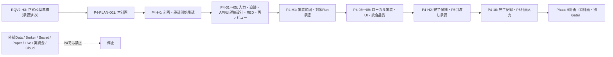

# Phase 4 実行計画書 v0.1（改訂4）

## 0. 文書情報

| 項目 | 内容 |
|---|---|
| 計画ID | `P4-PLAN-001` |
| Phase ID | `PHASE4_PRODUCT_APPLICATION_BACKTEST_2026_08_11` |
| 作成日 | 2026-08-11 |
| 状態 | `COMPLETED_P4-04B_P4-04C_PENDING` |
| 目的 | 固定・再現可能な入力だけを使い、既存Python Coreを原則無改変で Product/Application 境界へ接続し、単一Backtest／Sweep／結果／Evidence を利用者が追跡できる形へ製品化する。 |
| この改訂で実行しないこと | 本改訂は計画の補正だけであり、実装、依存導入、実行Run、外部I/O、Broker／Secret／Paper／Live／実資金／Cloudは発火しない。P4-H0で許可済みの設計・REDは、改訂後の直接実行プロンプトでだけ扱う。 |
| 起点 | `RQV2-H3` 承認済みの正式要件v2基準線。これはPhase 4実装の承認ではない。 |
| 正本の置場 | 本計画は `plan/`、将来の正式設計書は `doc/phase4/`、実行ログは `plan/phase4/ログ/`、機械証跡は `tests/evidence/phase4/<RunId>/`。 |
| 改訂 | 2026-08-12 改訂4。改訂3の実ランタイム起動契約を継承し、Coordinatorから子Agentを起動できない環境でも、起動不能を明示したローカル・フォールバック実行へ継続できるよう、P4-04C以降の各直接実行プロンプトを修正する。 |

## HASH-FUTURE-01〜08／Step 05 現行運用ルール

本計画の現行実行では、文章管理、差分許可、Evidence・baseline・manifestの同一性確認だけを目的とする管理用hashを計算・保存・照合しない。ユーザー委譲により、管理用hashのstale停止・不一致retryは強制スキップして完了する。fixture、raw/input、依存artifact、Replay、結果決定性など安全・データ・再現性へ直接因果のあるprotected hashは、目的・対象・失敗時停止を明記して維持し、不一致時はfail-closedで停止する。過去の管理hashは履歴として残すが、現行受入条件へ再利用しない。

P4-04C以降の全プロンプトとスクリプトへこの権限を適用する。成果物の存在・構造、対象path、固定command、テスト、レビュー、Unknown、Secret、外部I/O、Human Gate、protected hash結果で受入を判定し、管理hashの代替としてfingerprint、UUID、mtime、別名checksumを追加しない。Agent未起動は独立実行済みと報告せず、`RUNTIME_DISPATCH_FALLBACK_REQUIRED` として記録する。

## 1. 結論と発火制御

Phase 4 は、既存のReplay／Fill／Cost／Roll／Gap／Calendar／Holdout／Turtle／Manifest／固定fixtureを、**固定ローカル入力だけ**で利用できるProduct/Application境界へ接続するPhaseである。主対象は型付き設定、事前検査、Run／Job／Queue、単一Backtest、Sweep、Result、Evidence、固定ダミーによるUI接続、ローカル保存、停止・取消・再開の契約である。実装前に、P4で扱う全APIと既存21画面を漏れなく設計・追跡し、P4対象外画面も理由・次Phase・Gateを明示して未設計のまま残さない。

この計画を作成しただけでは、`P4-01` 以降を起動しない。まず運用者が `P4-H0` を承認し、次にレビュー済み詳細設計・RED・対象Runを明記した `P4-H1` を承認し、最後に完了候補を `P4-H2` で承認する。未承認のGate、Unknown、外部I/O、Core差分、Critical／Highは安全側に停止する。

P4-04C以降の直接実行では、プロンプトの `Orchestrator:`、`Agents:`、`Skills:` の列挙、JSON／Skillの読込、ルートAgentによる責務の自己適用を、部品の起動または独立レビューの証拠とみなさない。各プロンプトは実ランタイム起動を第一選択とし、起動できる場合は `orchestrator_agent_id`、全Agentの `agent_id`、固定model、受付・完了status、出力参照を取得する。Coordinatorまたは子Agentを起動できない場合は、`DISPATCH_MODE=LOCAL_FALLBACK_NO_SUBAGENTS` と理由・未起動Agentをログへ記録し、ルート実行Agentが各Agentの責務をチェックリストとして順次適用して作業を継続する。フォールバックで実施した確認を独立Agentの実行結果と偽らず、`independent=false`、`review_mode=SELF_REVIEW_FALLBACK`、`agent_id=N/A` を記録する。起動不能自体は停止条件にしないが、Human Gate未承認、スコープ違反、Secret／外部I/O、Critical／High未解決、UnknownのPassは引き続きFail-closedで停止する。



## 2. 入力正本と固定基準線

| 入力 | 参照目的 | 固定値・扱い |
|---|---|---|
| [`RQV2_Phase4以降再編ロードマップ_2026-08-11.md`](./requirements_update/RQV2_Phase4以降再編ロードマップ_2026-08-11.md) | P4の目的、依存、非対象、完了条件、Phase 5への送り先 | P4はProduct/Application基盤とBacktest製品化。P4→P5→P6→P7以降のDAGを変更しない。 |
| [`RQV2_Phase4計画引渡し入力一覧_2026-08-11.md`](./requirements_update/RQV2_Phase4計画引渡し入力一覧_2026-08-11.md) | RQV2-18の引渡し境界、Unknown／Blocked、入力優先順位 | RQV2-H3は承認済み。Phase 4の別計画・別Gateが必要。 |
| [`01_自動トレードシステム要件定義書_v2.html`](../doc/requirements/01_自動トレードシステム要件定義書_v2.html) | F01〜F06、REQ、UC、Screen、State、Gateの正本 | SHA-256: `97E248A36F71514B7C6312E614BE04B82D5EAE358541E195167E9611C14027FA` |
| [`01_自動トレードシステム要件定義書_v2.md`](./requirements_update/01_自動トレードシステム要件定義書_v2.md) | HTMLと対になる正式Markdown | SHA-256: `B54382E42D1DA3985B12A639CD1210075C5D7FF860B110772064B54816C6C921` |
| [`RQV2_既存Core再利用基準線_2026-08-11.md`](./requirements_update/RQV2_既存Core再利用基準線_2026-08-11.md) | Coreの再利用可否、凍結範囲、既存Evidence | 36 source filesの決定的Manifest SHA-256: `f8a25911a2dd4007e9d430f308965c36e9474abb37132d2813c3078d99ac1eeb`。関連tests／fixtures 58件のManifest SHA-256: `6909d2888bd65aac4dcf12a0827bcabab6d8766db39de29b4ef6b3b24ab13377`。 |
| [`RQV2_要件UIテスト追跡マトリクス_2026-08-11.md`](./requirements_update/RQV2_要件UIテスト追跡マトリクス_2026-08-11.md) | Q／UC／Screen／State／Test／Evidenceの抽出元 | Q基底305＋枝番3、UC67、Screen21、UISTATE10を母集団として扱う。P4の対象集合はP4-02で根拠付きに切り出す。 |
| [`01_自動トレードシステム_UIモック.html`](../doc/ui_mock/01_自動トレードシステム_UIモック.html) | 既存21画面・固定匿名ダミーの操作意味 | 現行UIモックは実装・認証・外部接続・実注文の証拠ではない。無承認で上書きしない。 |
| [`00_全Phase残課題Blocked統合台帳.html`](../doc/00_全Phase残課題Blocked統合台帳.html) | Human Gate、Unknown、Blockedの唯一の横断正本 | 本計画の `P4-H0`〜`P4-H2` はこの台帳に登録し、各実行Stepの開始前に再読する。 |

要件の主な読み取り範囲は、章13〜22（資産・時間足・Data／Strategy・Unit・Run／Job／Queue・Backtest／Sweep／Holdout）、章23〜30（Mode・Risk・OMSの外部副作用境界）、章31〜55（Ops・UI・API・保存・品質・Security）、章56〜62（Traceability・Gate・ロードマップ）である。具体的なP4追跡集合は、少なくとも `REQ-V2-0015`〜`REQ-V2-0055` とF05の該当要求を、P4-02でUC／Screen／State／Test／Evidenceへ対応付けて確定する。

## 3. Scope、固定事項、非対象

### 3.1 P4で実現する利用者能力

1. 型付きのData／Strategy／Config／Risk参照を、固定ローカル入力として作成・版管理し、実行前検査結果とともに保存する。
2. 単一BacktestとSweepを別Runとして開始し、Run／Job／Queueの状態、待機理由、取消、停止、上限付き再試行、checkpointからの再開を追跡する。
3. 固定Coreの出力を用いて、5指標、Chart、取引明細、全件表・CSV Job、同条件Run履歴、Holdout境界、Evidenceを表示・取得する。
4. API／UI／Worker／Persistenceの責務境界を、固定匿名ダミーとローカル契約試験で機械検証する。
5. 入力Manifest不一致、Risk参照欠落、未来参照、保存不一致、Idempotency不明、Critical／High、外部I/O混入ではFail-closedで停止する。
6. 既存21画面を一画面ずつ台帳化し、P4対象画面はレイアウト、部品、状態、API結線、操作、アクセシビリティ、レスポンシブ、テストまでを詳細化する。P4対象外画面は、未承認機能を実装しない境界仕様、次Phase、Human Gateを同じ設計書に残す。

### 3.2 P4で固定する判断

| ID | 固定すること | 判断理由 |
|---|---|---|
| `P4-DEC-001` | P4の実行Modeは `Backtest` のみとし、外部副作用を持つModeへの昇格を実装・実行しない。 | `REQ-V2-0056`〜`0058` の副作用境界を守る。 |
| `P4-DEC-002` | 入力Dataは既存の固定local fixture／Manifestだけとし、継続取得・実市場期間・Provider契約を持ち込まない。 | P5でData契約・費用・Secret・Qualityを別Gateで扱う。 |
| `P4-DEC-003` | Coreの36 source filesを原則無改変とする。変更要求はP4の作業を止め、別詳細設計・RED・影響レビュー・Human Gateへ戻す。 | Phase 1〜3の検証済み境界を壊さず、再利用と製品化を分離する。 |
| `P4-DEC-004` | Riskは実金額・証拠金・契約数量を決めない。P4は型、参照、未入力拒否、監査記録だけを設計・実装対象にする。 | 実値は未確定であり、P6以降のPortfolio／Risk／OMS Gateに属する。 |
| `P4-DEC-005` | FastAPI、SQLite WAL／Migration、ローカルJob Queue／Worker、Reactは候補であり、P4-03のADRで採否・代替・依存固定を決める。 | 実装前に責務・保存・テスト可能性を検証し、推測でframeworkを固定しない。 |
| `P4-DEC-006` | UIは固定匿名ダミー・ローカル接続に限定する。既存UIモックの変更はP4-02の追跡とP4-H1の対象範囲に含まれる場合だけ行う。 | UIモックを実注文・認証・外部通信の証拠に一般化しない。 |
| `P4-DEC-007` | P4-04は `P4-04A` API詳細設計、`P4-04B` DB・Persistence詳細設計／ER図、`P4-04C` 全21画面UI詳細設計、`P4-04D` RED／Run Manifest設計をこの順に完了する親Stepとする。 | API・DB・UI・品質を一つの粗い設計書へ混在させず、実装前に相互参照できる成果物セットを作る。 |
| `P4-DEC-008` | APIはP4で公開する全canonical command／query／file contractを一覧化し、HTTPは依存未固定の設計上の投影としてだけ扱う。21画面はP4対象・境界専用・後続Phaseを一画面ずつ明記する。 | 外部APIや未承認画面を推測実装せず、UIとAPIの欠落をP4-H1前に検出する。 |
| `P4-DEC-009` | P4-04Bでmetadata DBの論理・物理設計、ER図、migration、transaction、key／index、状態整合性、Result／Evidence file境界を確定する。Core ResultStoreの正本とApplication metadataの責務を混同しない。 | P4-03で保存候補と原子性の方針は設計済みだが、実装者がtable、FK、unique、index、状態履歴、冪等性、復旧条件を判断なく実装するにはDB詳細設計が必要である。 |

### 3.3 明示的な非対象と停止条件

以下を発見・要求・混入した時点で、そのStepを停止して統合台帳へ記録する。代替実装・暫定接続・環境変数投入では迂回しない。

- 外部Data取得、継続更新、Provider API、費用・entitlement、未固定の実市場データ
- Broker接続、注文、Paper、Live、実資金、口座、Secret、認証情報、Cloud、外部公開、端末・通信中継
- 実Cost／Slippage／Gap、正式Calendar、実市場の長期性能、利益性・頑健性の採用
- 実数量、証拠金、損失上限、Account、Portfolio、OMS、Risk実値の決定
- Core凍結範囲の無承認変更、protected input／fixture hash不一致、Look-ahead、保存不一致、Idempotency未定義。管理用Manifest／差分hash不一致は停止条件にしない。

## 4. Core再利用境界

| 区分 | P4での扱い | 禁止・要停止 |
|---|---|---|
| `src/autotrade/backtest/` | 既存のReplay、Backtest、結果、Cost／Roll／Gap／Holdout関連の公開済み最小APIを読む側として利用する。 | 対象内の振る舞い変更、既存fixtureの改変、P4都合の例外追加。 |
| `src/autotrade/market_data/` | 既存Catalog／Manifest／Replay入力契約を固定local入力として参照する。 | 外部取得、Provider接続、実Dataの補完、Calendar推測。 |
| `src/autotrade/strategy/` | Generic Strategy／Turtleの固定契約と版参照を利用する。 | Turtle規則の変更、実市場成績への一般化。 |
| Core外の新Product/Application層 | P4-03で承認した責務・依存方向・保存境界に限り追加する。 | Coreへ逆依存するUI、Workerからの外部副作用、未設計の任意ファイル書込み。 |

P4-01は開始時にCore source／tests／fixturesの対象path・構造・protected入力を確認し、P4-06〜09は終了時にも同じ非hash確認を行う。Core sourceの無承認変更が見つかれば、差分の正当性を推測せず `P4-CORE-CHANGE-REQUIRED` として停止する。管理用差分hashの計算・一致確認は行わない。

## 5. Unknown、Blocked、後続Phaseへの送り先

| ID／対象 | 現在状態 | P4での扱い | 解消先・再開条件 |
|---|---|---|---|
| `UNK-P3-01` | 実市場Dataの適合・来歴・実証が未確定 | 固定fixtureのPASSと分離して表示する。P4では解消しない。 | P5：Provider、対象、期間、保存、Evidence、外部Data Gateを承認後に検証。 |
| `UNK-P3-05`／`UNK-P3-07` | 実Cost／Slippage／Gap／Calendar、長期・実市場運用が未確定 | 既存Coreの固定契約を使用できても、実測値・正式Calendarを推測しない。 | P5：実Data／Calendar／Cost Gate。未解消ならP6以降へ明示継承。 |
| `Q-243` | 4領域の後続Gate・未確定事項 | P4-02の追跡に残し、Risk・保存・外部境界への影響を記録する。 | 対象PhaseのGateとEvidenceが揃うまで `UNKNOWN` のまま。 |
| `RQV2-BLK-001` | `tests/evidence/phase1/` が物理的に欠落し、運用者上書きでRQV2を継続 | `PASS_WITH_OPERATOR_OVERRIDE` の事実を引用するだけで、P4品質証拠や機械PASSの代替にしない。 | 原欠落の復旧・再証明は別作業。P4では新たな機械証跡を独立に作る。 |
| Risk実値・Account・契約 | 未確定 | 型・参照・未入力拒否の設計だけを扱い、値を埋めない。 | P6以降のRisk／Account／OMS Human Gate。 |
| UI／Worker性能 | 未測定 | P4-04で測定設計・上限・Evidence形式を定義する。 | P4で測定し、未達ならP4-H2に残件として提示する。 |
| Broker／Secret／Paper／Live | 未接続・未承認 | `OUT_OF_SCOPE`。境界表示・Fail-closedのみ。 | P7以降の別計画・別Human Gate。 |

## 6. 将来成果物と保存規則

本計画が直接作るのはMarkdown計画書と台帳・引渡し入力の更新だけである。`P4-H0`承認後の各Stepは、以下の候補成果物を作成・更新する。正式HTMLを追加・更新したStepは、同じ変更で `doc/index.html` の導線も更新し、相対リンク・anchor・印刷・可読性を検査する。

| Step | 正式HTML候補 | 計画・ログ候補 | Evidence候補 |
|---|---|---|---|
| P4-01 | `doc/phase4/01_要件追跡/01_Phase4入力・Core再利用確認.html` | `plan/phase4/ログ/P4-01_入力・Core再利用確認_YYYY-MM-DD.md` | protected input／fixture hashを確認する場合だけ対象Runを記録する。管理用hash照合だけのRunは作らない。 |
| P4-02 | `doc/phase4/01_要件追跡/02_Phase4要件・UC・UI・Test追跡マトリクス.html` | `plan/phase4/ログ/P4-02_追跡範囲確定_YYYY-MM-DD.md` | 対象外。 |
| P4-03 | `doc/phase4/02_実装詳細設計/03_ProductApplication_Backtest実装詳細設計書.html` | `plan/phase4/ログ/P4-03_詳細設計_YYYY-MM-DD.md` | 対象外。 |
| P4-04A | `doc/phase4/02_実装詳細設計/04_ProductApplication_API詳細設計書.html` | `plan/phase4/ログ/P4-04A_API詳細設計_YYYY-MM-DD.md` | 対象Runなし。API契約、失敗、冪等性、UI結線、テストIDを設計する。 |
| P4-04B | `doc/phase4/02_実装詳細設計/05_ProductApplication_DB_Persistence詳細設計書.html` | `plan/phase4/ログ/P4-04B_DB・ER詳細設計_YYYY-MM-DD.md` | 完了（対象Runなし）。metadata DB、Persistence、ER図、migration、transaction、保存境界を設計した。 |
| P4-04C | `doc/phase4/02_実装詳細設計/06_ProductApplication_UI全21画面詳細設計書.html` | `plan/phase4/ログ/P4-04C_UI全21画面詳細設計_YYYY-MM-DD.md` | 対象Runなし。21画面と10 UI状態の扱い、P4対象・境界・後続Gateを設計する。 |
| P4-04D | `doc/phase4/03_品質設計/04_Phase4テスト戦略・RunManifest設計.html` | `plan/phase4/ログ/P4-04D_RED・品質設計_YYYY-MM-DD.md` | `tests/evidence/phase4/<設計済みRunId>/` の構造だけを設計し、最小REDだけを追加する。 |
| P4-05 | `doc/phase4/04_レビュー/05_Phase4詳細設計レビュー・改訂記録.html` | `plan/phase4/ログ/P4-05_設計レビュー_YYYY-MM-DD.md` | Review findings／採否表。 |
| P4-06〜08 | P4-03、P4-04A〜Dの設計書を改訂するときだけ更新。P4-08は `doc/phase4/03_品質設計/05_P4-08_UI接続・VisualA11y検証.html` を正式検証HTMLとして追加。 | `plan/phase4/ログ/P4-0X_実装ログ_YYYY-MM-DD.md` | `tests/evidence/phase4/<RunId>/`。Run ID・target scope・protected fixture hash・approvalを登録後にだけ作成。 |
| P4-09 | `doc/phase4/04_レビュー/06_Phase4統合品質・独立レビュー.html` | `plan/phase4/ログ/P4-09_統合品質・独立レビュー_YYYY-MM-DD.md` | `tests/evidence/phase4/<RunId>/dispatch、manifest、verification、self-review、protected結果、Gate結果。 |
| P4-10 | `doc/phase4/05_完了/07_Phase4完了判定・Phase5計画引渡し.html` | `plan/phase4/ログ/P4-10_完了・引渡し_2026-08-12.md` | `tests/evidence/phase4/RUN-P4-04D-001/p4-10-*`、P4-H2承認記録、`plan/phase4/Phase5計画入力一覧_2026-08-12.md`。 |

## 7. 使用するAI部品

既存の汎用部品を使い、Phase 4専用のAgent／Skill／Orchestratorは新設しない。`AutoTradePhase1_*` および `autotrade_phase1_skill_*_v0_1` は frozen／legacy／Phase 1証跡であり、P4の実行部品に指定しない。

| 用途 | Orchestrator | 主Agent | 必須Skill |
|---|---|---|---|
| 計画の統制 | `AutoTradePhasePlanning_Orchestrator_v0_1` | `AutoTrade_A05_PhaseExecutionPlanner_v0_1` | `autotrade_skill_phase_execution_planning_v0_1`、`autotrade_skill_traceability_v0_1` |
| 正式HTML・追跡・文書統合 | `AutoTradeProject_DesignDocSet_Orchestrator_v0_1` | `AutoTrade_A10_RequirementsCurator_v0_1`、`AutoTrade_A80_DocumentIntegrator_v0_1`、`AutoTrade_A81_DesignDocSetWriter_v0_1`、`AutoTrade_A90_DesignReviewer_v0_1` | `autotrade_skill_source_reader_v0_1`、`autotrade_skill_design_doc_set_writer_v0_1`、`autotrade_skill_html_doc_writer_v0_1`、`autotrade_skill_design_review_v0_1`、`autotrade_skill_revision_integration_v0_1` |
| 実装詳細設計（API・DB／Persistence・全画面UIを含む） | `AutoTradeProject_ImplementationDesign_Orchestrator_v0_1` | `AutoTrade_A10_RequirementsCurator_v0_1`、`AutoTrade_A20_ArchitectureDomainArchitect_v0_1`、`AutoTrade_A30_StrategyQaArchitect_v0_1`、`AutoTrade_A70_OpsSecurityArchitect_v0_1`、`AutoTrade_A80_DocumentIntegrator_v0_1`、`AutoTrade_A82_ImplementationDetailDesigner_v0_1`、`AutoTrade_A91_ImplementationDetailReviewer_v0_1`、`AutoTrade_A90_DesignReviewer_v0_1`、`AutoTrade_A170_UiMockEngineer_v0_1`、`AutoTrade_A171_UiVisualQaReviewer_v0_1` | `autotrade_skill_implementation_detail_design_v0_1`、`autotrade_skill_implementation_detail_review_v0_1`、`autotrade_skill_design_doc_set_writer_v0_1`、`autotrade_skill_execution_model_v0_1`、`autotrade_skill_test_strategy_v0_1`、`autotrade_skill_ops_security_v0_1`、`autotrade_skill_traceability_v0_1`、`autotrade_skill_ui_mock_generation_v0_1`、`autotrade_skill_ui_visual_validation_v0_1`、`autotrade_skill_ui_accessibility_validation_v0_1` |
| ローカルPython品質ループ | `AutoTradeProject_ImplementationQuality_Orchestrator_v0_1` | `AutoTrade_A110_PythonTestEngineer_v0_1`、`AutoTrade_A120_PythonImplementer_v0_1`、`AutoTrade_A130_VerificationEngineer_v0_1`、`AutoTrade_A140_DebugEngineer_v0_1`、`AutoTrade_A150_PythonCodeReviewer_v0_1`、`AutoTrade_A160_TradingSecurityReviewer_v0_1` | `autotrade_skill_python_test_quality_v0_1`、`autotrade_skill_python_implementation_v0_1`、`autotrade_skill_debug_recovery_v0_1`、`autotrade_skill_python_code_review_v0_1` |
| 固定ダミーUIの接続・検証 | `AutoTradeProject_UiMock_Orchestrator_v0_1` | `AutoTrade_A170_UiMockEngineer_v0_1`、`AutoTrade_A171_UiVisualQaReviewer_v0_1` | `autotrade_skill_ui_mock_generation_v0_1`、`autotrade_skill_ui_visual_validation_v0_1`、`autotrade_skill_ui_accessibility_validation_v0_1` |

Orchestratorは `gpt-5.6-terra` を使う。各AgentはそのJSON実体に固定されたmodelを使い、利用不能な場合は別model・別部品へ静かに代替せず停止する。`default_orchestrator` は変更しない。

## 8. Human Gate

| Gate | 現在状態 | 承認対象 | 承認後に許可される範囲 | 明示的に許可しないこと |
|---|---|---|---|---|
| `P4-H0` | `APPROVED（2026-08-11）` | 本計画、P4の固定local scope、Core凍結、P4-01〜05の設計・RED範囲。改訂2でP4-04A（API）→P4-04B（DB／ER）→P4-04C（UI）→P4-04D（RED）へ分割して明文化した。 | P4-01〜05。入力照合、追跡、API詳細設計、DB／Persistence詳細設計・ER図、全21画面UI詳細設計、RED test・Run Manifest設計、レビュー。 | 実装、依存導入、実行Run、外部I/O、Core変更、Broker／Secret／Paper／Live／実資金／Cloud。 |
| `P4-H1` | `APPROVED（2026-08-12）` | P4-03、P4-04A〜D、P4-05のレビュー済み詳細設計、DB／ER／migration／transaction設計、RED、Core差分0、全P4 API inventory、21画面coverage register、対象Run ID／target_paths／protected fixture hash／trusted scope、実装範囲。承認記録は `tests/evidence/phase4/RUN-P4-04D-001/human-gate-p4-h1.md`。管理用Manifest／Evidence hashは承認対象にしない。 | P4-06〜09のローカル実装・固定fixture試験・全P4対象画面のUI検証。対象Runは `RUN-P4-04D-001`、target-onlyで実行する。WSL品質Gateはhost outbound isolation確認後だけ実行する。 | P4-10、未登録Run、外部I/O、未固定依存の取得、Core変更、実市場Data、Broker／Secret／Paper／Live／実資金／Cloud。 |
| `P4-H2` | `APPROVED（2026-08-12）` | P4-09の最終候補、REQ／UC／Test／Evidence追跡、Core差分、品質・レビュー、残Unknown、Phase 5境界。承認記録は `tests/evidence/phase4/RUN-P4-04D-001/human-gate-p4-h2.md`。 | P4-10の完了記録・台帳同期・Phase 5計画入力引渡し。 | Phase 5実装・外部Data取得、Broker／Secret／Paper／Live／実資金／Cloud。 |

各Gateの現在状態、対象、期限、再開条件、証拠先は統合台帳を唯一の正本とする。改訂2は、運用者がP4-04BへDB／Persistence詳細設計とER図を追加し、後続Stepを繰り下げる計画修正を指示したことを記録するものであり、P4-H0の設計・RED以外の権限を増やさない。P4-H1では、実行を許す `RunId` も同じ承認文言または紐付く承認記録に明記する。

## 9. Step依存関係と実行順序

| Step | 目的 | 依存 | Gate | 実行形態 |
|---|---|---|---|---|
| P4-01 | 入力・Core凍結・既存Evidenceを再照合する | 本計画 | P4-H0 | 逐次 |
| P4-02 | REQ→UC→Screen／State→Test→Evidence→Gate のP4対象追跡を確定する | P4-01 | P4-H0 | P4-03と並行可。ただしP4-04A前に完了。 |
| P4-03 | 型付きRunモデル、API／UI、Worker、Persistence、停止／復旧の詳細設計を作る | P4-01 | P4-H0 | P4-02と並行可。 |
| P4-04A | 全P4 canonical APIの詳細設計を作る | P4-02, P4-03 | P4-H0 | P4-04の親Step内。完了済み。 |
| P4-04B | DB・Persistence詳細設計、ER図、migration、transaction、保存境界を作る | P4-02, P4-03, P4-04A | P4-H0 | P4-04の親Step内。完了済み。P4-04Cへ引き渡す。 |
| P4-04C | 既存21画面の全画面UI詳細設計を作る | P4-02, P4-03, P4-04A, P4-04B | P4-H0 | P4-04の親Step内。APIとDB保存契約を確定後に逐次実行する。 |
| P4-04D | API／DB／UIに接続するRED契約、Run Manifest、trusted scope、証跡構造を設計する | P4-04A, P4-04B, P4-04C | P4-H0 | P4-04の親Step内。全設計IDをテストへ接続して逐次実行する。 |
| P4-05 | API／DB／UI詳細設計の専門レビュー、改訂、再レビュー、P4-H1提出候補を作る | P4-02, P4-03, P4-04A〜D | P4-H0 | 逐次 |
| P4-06 | 型付き設定・Run／Job／Queue・保存・基底APIの最小ローカル実装を行う | P4-H1 | P4-H1 | 逐次 |
| P4-07 | 単一Backtest／Sweep／Result／Evidence／全P4 APIを設計どおり接続する | P4-06 | P4-H1 | 逐次 |
| P4-08 | 全P4対象画面の固定ダミーUI接続、visual／a11y検証を行う | P4-06, P4-07 | P4-H1 | P4-04Cの画面仕様・全状態表とP4-04Bの保存契約を満たしてからP4-09へ進む。 |
| P4-09 | API／DB／UI coverageを含む統合品質、独立レビュー、Evidence束、P4-H2候補を作る | P4-07, P4-08 | P4-H1 | 逐次 |
| P4-10 | P4-H2承認後に完了記録、台帳同期、Phase 5計画入力を作る | P4-09, P4-H2 | P4-H2 | 逐次 |

## 10. 共通品質・安全規則

1. すべてのStepで、開始前と終了前に統合台帳、P4 Gate状態、対象の保護入力hash、Core差分（path・構造・状態）を確認する。管理用差分hashは確認しない。
2. Code変更があるStepでは、`AutoTrade_A110_PythonTestEngineer_v0_1` がREDを先に固定し、`AutoTrade_A120_PythonImplementer_v0_1` が最小実装を行う。REDなしの実装は受け入れない。
3. WSL隔離品質Gateは `scripts/wsl_quality_gate/run_test.ps1` だけを入口とし、`scripts/quality_gate/trusted_scopes.json` に登録済みのRun ID・固定コマンド・target_pathsだけを使う。host outbound isolationが確認できなければ `BLOCKED` とする。
4. P4ではWindows正本 `C:\project\strategy_test` のみを編集する。WSL cloneは通常編集しない。必要な隔離実行の条件が揃った場合も、プロジェクト規則の事前確認・可逆退避・`git pull --ff-only`以外の同期は禁止する。
5. UIの正式合否は固定 `@playwright/test`、Storybook、Vitest／axeで判定する。ローカル探索以外のAI向けCLI、外部SaaS、外部通信、匿名でないデータを使わない。
6. 各正式HTMLの追加・更新では、`doc/index.html`、相対リンク、anchor、読みやすさ、印刷、Mermaidの同義文章を同時に確認する。
7. `Critical` または `High` の未解決Findingは、次のStep・Human Gateへ進めない。Medium／Lowは採否・責任・期限・証拠先を明記し、UnknownをPASSへ変換しない。
8. 完了前に `git diff --check`、対象差分、Secret・鍵・個人情報の混入、機械検証結果、Evidenceの存在・構造・状態を確認する。Evidenceファイルの管理hashは計算しない。既存ユーザー変更は混ぜない。

## 11. P4の追跡完成条件

P4-09でP4-H2候補と呼べるのは、次のすべてを満たすときだけである。

- P4対象のREQ、UC、Screen、State、Test、Evidence、Gateが一対多を含めて追跡可能で、孤立・無根拠の項目がない。
- 単一BacktestとSweepは別の入力、状態、結果、Evidence、取消・失敗・再開条件を持ち、同条件Runの表示と内部履歴が分離される。
- Data／Strategy／Config／Risk参照、Manifestの構造、Core版、protected fixture hash、protected結果hashがRunへ保存され、protected入力不一致では開始しない。Evidence hashは保存・受入条件にしない。
- API、UI、Worker、Persistence、ファイル出力、CSV Jobの契約を固定local入力で検証し、保存不一致、重複、Idempotency不明、未来参照、Risk参照欠落をFail-closedで扱う。
- `P4-04A`のAPI inventoryが、P4で公開するcommand、query、file／CSV、Evidence、状態通知の全契約を漏れなく収容し、各APIに型、必須性、失敗、冪等性、副作用、状態遷移、version、UI利用箇所、Test／Evidenceがある。
- `P4-04B`のDB・Persistence詳細設計が、P4-04Aの全API、Run／Job／Queue／Checkpoint／Result／Evidence／CSV／Audit／Idempotencyの保存先、ER図、PK／FK、unique、index、transaction、migration、lock／lease、保持、復旧、Core ResultStore／file境界を収容する。
- `P4-04C`のUI全21画面coverage registerが21/21であり、各画面に画面目的、P4判定、入口／出口、PC／スマートフォン構成、部品、データ、API結線、許可状態、禁止操作、失敗／復旧、keyboard／focus／name／role、Test／Evidence、Unknownまたは後続Gateがある。P4対象外は`N/A`だけで終えず、理由・担当Phase・再開Gateを記録する。
- P4対象画面について、10 UI状態とのセルがすべて`SUPPORTED`、`PROHIBITED`または理由付き`N/A`として判定され、未定義セルがない。画面・API・状態・テストの一方通行の参照は受入れない。
- P4対象範囲でCore差分がゼロ、または承認済み別ChangeのEvidenceがあり、その後の品質Gateを通過している。
- UI主要状態（少なくとも初期・入力不備・事前検査失敗・Queue待機・実行中・停止／取消・成功・部分失敗・復旧・Evidence参照）が固定ダミーで検証される。
- P4固有のCritical／Highが0で、`UNK-P3-01`、`UNK-P3-05`、`UNK-P3-07`、Q-243、`RQV2-BLK-001`、実Risk値、外部Data／Broker／Secret／Paper／Liveを正しい送り先へ残している。

## 12. 直接実行プロンプトの共通前提

以下のプロンプトは、該当Gateが承認済みであることを確認してから、一つずつ順に実行する。各Promptは、入力に含めたパスを最初に再読し、出力ファイルを作る前に既存ファイル・Git状態・台帳を確認する。記載のない外部接続、依存取得、Core変更、WSL操作、実行Runを推測で実施しない。

## 13. 計画レビュー結果

| Finding ID | 重大度 | 指摘 | 閉鎖方針 |
|---|---|---|---|
| `P4-PLAN-F-001` | Critical | Product化を理由に外部Data、Broker、Paper、LiveをP4へ混ぜると、未承認の副作用が発生する。 | Scope、Gate、各Promptの停止条件でP4を固定local Backtestへ限定した。 |
| `P4-PLAN-F-002` | High | Core凍結を「再利用可」と誤読すると、P4の都合で検証済みCoreを無承認変更する危険がある。 | Core Manifestの開始・終了再照合、別Change戻し、P4-H1条件を明記した。 |
| `P4-PLAN-F-003` | High | UI／Workerの機械検証だけを先に走らせると、保存・Idempotency・Run Manifestの契約が欠ける。 | P4-03→P4-04A（API）→P4-04B（DB／ER）→P4-04C（全画面UI）→P4-04D（RED／Run Manifest）→P4-05で詳細設計と品質設計を先行させる。 |
| `P4-PLAN-F-004` | High | `UNK-P3-01/05/07`、Q-243、`RQV2-BLK-001`をP4のPASSへ混入させる危険がある。 | Unknown／operator overrideの状態とP5以降の送り先を独立表へ固定した。 |
| `P4-PLAN-F-005` | Medium | 実行Runの承認範囲が曖昧だと、trusted scope外の品質Gateを起動し得る。 | P4-H1にRun ID・target_paths・fixture hash・trusted scopeの明記を要求した。 |
| `P4-PLAN-F-006` | High | APIや画面を責務図だけで実装へ渡すと、型、状態、失敗、操作、アクセシビリティ、証跡が実装者ごとに異なる。 | P4-04Aで全APIを、P4-04BでDB／ER／保存契約を、P4-04Cで全21画面を個別設計し、P4-04DでAPI／DB／UIをREDとEvidenceへ結ぶ。P4-05はcoverage不足をCritical／Highとして扱う。 |
| `P4-PLAN-F-007` | High | 「全画面」をP4対象Subsetだけと誤読すると、対象外画面が無根拠に実装されたり、未設計のまま残る。 | 全21画面をcoverage registerへ入れる。P4対象画面は実装仕様、P4対象外画面は固定`UNAPPROVED`／`OUT_OF_SCOPE`境界、理由、後続Phase、Gateを個別に定義する。 |
| `P4-PLAN-F-008` | Critical | Orchestrator／Agentの完全名をプロンプトへ列挙するだけでは、Codex実ランタイムのサブエージェント起動、独立レビュー、固定modelの適用を保証できず、ルートAgentの自己適用を誤って完了扱いする危険がある。さらに、Coordinatorから子Agentを起動できない環境では、起動不能だけで設計・実装全体が停止する。 | P4-04C以降の各プロンプトで実ランタイム起動を第一選択として要求し、起動できたAgentだけを実行証跡へ記録する。起動不能時は `DISPATCH_MODE=LOCAL_FALLBACK_NO_SUBAGENTS` へ切り替え、Agentごとの責務・レビュー観点をルート実行Agentがチェックリストで適用する。未起動を独立レビュー済みと偽らず、起動不能自体は停止条件にしない。一方、Gate、スコープ、Secret／外部I/O、Critical／High、UnknownのPassは従来どおり停止する。 |

判定（2026-08-12実行後）: `COMPLETED_P4-09_P4-H2_BLOCKED`。ユーザーの「P4-H1を承認します。P4-06以降のプロンプトを順番に実行して下さい。」を受領し、P4-05で提示済みの `RUN-P4-04D-001`、target_paths、protected fixture hash、trusted scopeを承認記録へ固定した。P4-04C（全21画面UI）、P4-04D（RED／Run Manifest）、P4-05（統合レビュー・改訂・P4-H1提出候補）、P4-06（typed Application／Persistence／Run／Job／Queue、RED→GREEN、target quality）、P4-07（単一Backtest／Sweep／Result／Evidence／全19 API、RED→GREEN、target quality）、P4-08（固定UI契約、21画面、13画面×10状態、PC／mobile、axe、screenshots、外部通信0）、P4-09（API／DB／UI統合品質、Evidence再照合、P4-H2候補判定）が完了した。P4-09はCoordinatorを起動したが子Agentのspawn／wait backendが未提供だったため `LOCAL_FALLBACK_NO_SUBAGENTS` を記録し、未起動を独立実行と偽らずroot fallbackの責務チェックリストで確認した。旧Evidence hashやtarget差分hashは履歴として保持するが、現行受入では再利用しない。font／OS renderingは`UNK-P4-UI-002`、host outbound isolationは`UNK-P4-04D-004`として保持する。P4-H2未承認かつhost isolation未確認のためP4-10は実行しない。

## 14. Step別の直接実行プロンプト

### P4-01 入力・Core再利用基準線の再照合

```text
Step ID: P4-01
Phase ID: PHASE4_PRODUCT_APPLICATION_BACKTEST_2026_08_11
Plan: P4-PLAN-001 / plan/Phase4_実行計画書_v0.1_2026-08-11.md
Orchestrator: AutoTradeProject_DesignDocSet_Orchestrator_v0_1
Agents: AutoTrade_A10_RequirementsCurator_v0_1, AutoTrade_A20_ArchitectureDomainArchitect_v0_1, AutoTrade_A80_DocumentIntegrator_v0_1, AutoTrade_A90_DesignReviewer_v0_1
Model: Orchestratorはgpt-5.6-terra。各Agentは定義JSONに固定されたmodelを使い、利用不能なら代替せず停止する。
Skills: autotrade_skill_source_reader_v0_1, autotrade_skill_traceability_v0_1, autotrade_skill_html_doc_writer_v0_1, autotrade_skill_design_review_v0_1
発火制御: 統合台帳でP4-H0=APPROVEDを確認してから実行する。P4-H1/P4-H2は不要。外部I/O、依存取得、Core変更、WSL操作、実行Runは発火しない。
入力: 正式要件v2 HTML/Markdown、RQV2 Phase4ロードマップ、Phase4引渡し入力一覧、RQV2既存Core再利用基準線、追跡マトリクス、統合台帳、Phase1〜3の正式成果物と既存Evidence。
実施: Core source 36件と関連tests/fixtures 58件の対象path・構造・protected input、既存Evidenceの状態、RQV2-H3、UNK-P3-01/05/07、Q-243、RQV2-BLK-001を再確認する。管理用Manifest／Evidence hashは計算しない。doc/phase4/01_要件追跡/01_Phase4入力・Core再利用確認.html と plan/phase4/ログ/P4-01_入力・Core再利用確認_YYYY-MM-DD.md を作成する。P4で再利用する公開境界、凍結対象、入力優先順位、P4外へ送る項目を明記し、doc/index.htmlへ導線を追加する。
レビュー: AutoTrade_A90_DesignReviewer_v0_1がFindings firstで、hash不足、Core状態の一般化、UnknownのPASS化、外部I/O混入、リンク不足を確認する。指摘は同Stepで改訂し、Critical/High=0にする。
完了条件: 保護入力hash、Core Manifest構造、再利用状態、未知事項、停止条件、正式HTML/ログ/doc indexの導線が相互に一致する。Coreと既存fixtureに差分を作らない。
停止条件: protected input／fixture hash不一致、Core差分、必要入力欠落、台帳のGate不整合、外部Data/Broker/Secret/Paper/Live/Cloud/実資金の要求または混入、Critical/High未解決。管理用hash不一致は停止条件にしない。
```

### P4-02 P4要件・UC・UI・Test追跡の確定

```text
Step ID: P4-02
Phase ID: PHASE4_PRODUCT_APPLICATION_BACKTEST_2026_08_11
Plan: P4-PLAN-001 / plan/Phase4_実行計画書_v0.1_2026-08-11.md
Orchestrator: AutoTradeProject_DesignDocSet_Orchestrator_v0_1
Agents: AutoTrade_A10_RequirementsCurator_v0_1, AutoTrade_A30_StrategyQaArchitect_v0_1, AutoTrade_A80_DocumentIntegrator_v0_1, AutoTrade_A81_DesignDocSetWriter_v0_1, AutoTrade_A90_DesignReviewer_v0_1
Model: Orchestratorはgpt-5.6-terra。各Agentは定義JSONに固定されたmodelを使い、利用不能なら代替せず停止する。
Skills: autotrade_skill_source_reader_v0_1, autotrade_skill_traceability_v0_1, autotrade_skill_design_doc_set_writer_v0_1, autotrade_skill_html_doc_writer_v0_1, autotrade_skill_test_strategy_v0_1, autotrade_skill_design_review_v0_1
発火制御: P4-H0=APPROVEDとP4-01完了を確認してから実行する。P4-03とは並行可だが、P4-05の前に完了する。外部I/O、実装、依存取得、Core変更は発火しない。
入力: P4-01確認書、正式要件v2の章13〜22、23〜30、31〜55、56〜62、RQV2要件UIテスト追跡マトリクス、既存UIモック、統合台帳。
実施: P4対象だけをREQ→UC→Screen/State→Test→Evidence→Gateへ追跡する。少なくとも型付き設定、Preflight、Run/Job/Queue、単一Backtest、Sweep、5指標、結果/Chart/取引明細、CSV Job、同条件Run履歴、Holdout境界、取消/停止/checkpoint/復旧、固定ダミーUI主要状態を収容する。対象外のBroker、Secret、Paper、Live、実市場Data、実Risk値を別欄に固定する。doc/phase4/01_要件追跡/02_Phase4要件・UC・UI・Test追跡マトリクス.html とログを作り、doc/index.htmlへ導線を追加する。
レビュー: AutoTrade_A90_DesignReviewer_v0_1が孤立REQ/UC/Screen/State/Test、既存UIモックの過大解釈、Unknownの誤閉鎖、Gate漏れを検査する。Critical/Highを閉鎖してからP4-04へ渡す。
完了条件: P4対象と非対象の境界が行単位で追跡でき、各Test/Evidence/Gateの責任が明確である。Unknownは正しい送り先を持つ。
停止条件: 必要な要件根拠がない、既存UIモックを実装・外部接続の証拠として扱う、外部副作用を含める、Critical/High未解決。
```

### P4-03 Product/Application・Backtest実装詳細設計

```text
Step ID: P4-03
Phase ID: PHASE4_PRODUCT_APPLICATION_BACKTEST_2026_08_11
Plan: P4-PLAN-001 / plan/Phase4_実行計画書_v0.1_2026-08-11.md
Orchestrator: AutoTradeProject_ImplementationDesign_Orchestrator_v0_1
Agents: AutoTrade_A20_ArchitectureDomainArchitect_v0_1, AutoTrade_A30_StrategyQaArchitect_v0_1, AutoTrade_A40_ExecutionEnginePocArchitect_v0_1, AutoTrade_A70_OpsSecurityArchitect_v0_1, AutoTrade_A82_ImplementationDetailDesigner_v0_1, AutoTrade_A91_ImplementationDetailReviewer_v0_1, AutoTrade_A90_DesignReviewer_v0_1
Model: Orchestratorはgpt-5.6-terra。各Agentは定義JSONに固定されたmodelを使い、利用不能なら代替せず停止する。
Skills: autotrade_skill_implementation_detail_design_v0_1, autotrade_skill_implementation_detail_review_v0_1, autotrade_skill_domain_modeling_v0_1, autotrade_skill_execution_model_v0_1, autotrade_skill_ops_security_v0_1, autotrade_skill_traceability_v0_1, autotrade_skill_design_review_v0_1
発火制御: P4-H0=APPROVEDとP4-01完了を確認してから実行する。P4-02とは並行可。実装、依存取得、外部I/O、Core変更、実行Runは発火しない。
入力: P4-01確認書、正式要件v2、P4-02追跡の暫定版、Core基準線、既存UIモック、統合台帳、AF-D16/AF-D17、doc/ai_foundation/14_実装詳細設計書構成標準.html、doc/ai_foundation/16_実装詳細設計書HTMLテンプレート.html。
実施: 型付きConfig/Data/Strategy/Risk参照、Run/Job/Queue/Checkpoint/Result/Evidence/CSV Jobの型と状態、API/UI/Worker/Persistenceの責務・依存方向、入力/出力/保存schema、SQLite WAL/Migration・FastAPI・React・local workerの候補ADR、ファイル出力の原子性、取消/停止/再試行/再開/重複拒否/Idempotency/Fail-closedを設計する。単一BacktestとSweepを別Runとして設計し、固定Core APIへの接続点を明記する。実値Risk、Account、Broker、外部Dataは型外・別Gateとして明記する。doc/phase4/02_実装詳細設計/03_ProductApplication_Backtest実装詳細設計書.html とログを作り、doc/index.htmlへ導線を追加する。
レビュー: AutoTrade_A91_ImplementationDetailReviewer_v0_1がモジュール、API、永続化、処理順、例外、テスト、改訂閉ループを監査する。AutoTrade_A90_DesignReviewer_v0_1がPhase境界・追跡・Core凍結を監査する。指摘を反映し再レビューする。
完了条件: 実装者が追加するProduct/Application層を判断なく実装でき、Coreへの変更なし、入力・出力・保存・状態・失敗・テストが具体化されている。Critical/High=0。
停止条件: Core変更が必要、外部I/Oが設計に入る、Risk実値を仮定する、保存/Idempotency/Look-aheadが未定義、Critical/High未解決。
```

### P4-04 API・DB／Persistence・全画面UI・品質詳細設計（親Step）

`P4-04`は、次の`P4-04A`→`P4-04B`→`P4-04C`→`P4-04D`を一つずつ順に実行する親Stepである。四つの成果物が相互リンクし、P4-05のレビューでCritical／High=0になるまで、P4-04を完了扱いにしない。P4-04A〜DはいずれもP4-H0の設計・RED範囲だけを使い、実装、依存導入、実行Run、外部I/O、Core変更、`ui/mock`のソース変更を発火しない。

### P4-04A 全P4 canonical API詳細設計

```text
Step ID: P4-04A
Parent Step: P4-04
Phase ID: PHASE4_PRODUCT_APPLICATION_BACKTEST_2026_08_11
Plan: P4-PLAN-001 / plan/Phase4_実行計画書_v0.1_2026-08-11.md（改訂2）
Orchestrator: AutoTradeProject_ImplementationDesign_Orchestrator_v0_1
Agents: AutoTrade_A10_RequirementsCurator_v0_1, AutoTrade_A20_ArchitectureDomainArchitect_v0_1, AutoTrade_A30_StrategyQaArchitect_v0_1, AutoTrade_A70_OpsSecurityArchitect_v0_1, AutoTrade_A80_DocumentIntegrator_v0_1, AutoTrade_A82_ImplementationDetailDesigner_v0_1, AutoTrade_A91_ImplementationDetailReviewer_v0_1, AutoTrade_A90_DesignReviewer_v0_1
Model: Orchestratorはgpt-5.6-terra。各Agentは定義JSONに固定されたmodelを使い、利用不能なら代替せず停止する。
Skills: autotrade_skill_implementation_detail_design_v0_1, autotrade_skill_implementation_detail_review_v0_1, autotrade_skill_design_doc_set_writer_v0_1, autotrade_skill_execution_model_v0_1, autotrade_skill_test_strategy_v0_1, autotrade_skill_ops_security_v0_1, autotrade_skill_traceability_v0_1, autotrade_skill_design_review_v0_1
発火制御: P4-H0=APPROVED、P4-02/P4-03完了を確認してから実行する。設計書とログだけを更新する。実装、依存取得、HTTP server／routeの作成、未登録Run、外部I/O、Core変更、`ui/mock`ソース変更は発火しない。
入力: P4-01/P4-02/P4-03の正式HTMLとログ、正式要件v2、既存UIモック、Core基準線、既存Backtest/ResultStore/Runner/Experiment/fixture契約、統合台帳、AF-D14/AF-D16/AF-D17、doc/index.html。
実施: P4で公開する全canonical APIを、command、query、非同期Job、Result／Chart／Trade／Signal参照、CSV Job、Evidence参照、状態／Failure／Holdout Gateの全区分から抽出し、漏れのないAPI inventoryを作る。各APIへ一意なAPI-P4-IDを割当て、P4-03のDTO、Run／Job／Queue状態、Persistence、Core adapter、P4-02のREQ／UC／Screen／Stateを双方向に結ぶ。HTTPは依存未固定の設計上の投影に限り、外部公開・認証・Secret・Provider・Broker接続を含めない。
各APIについて、所有モジュール、公開境界、呼出元画面、目的、transport、version、path／methodまたはin-process contract、request／response DTO、fieldごとの型・必須性・nullable・既定値・制約、成功／失敗response、reason/error ID、前提状態、許可遷移、冪等性key、correlation/run/job ID、同期／非同期、read/write副作用、DB／file／Evidence更新、並行実行、pagination／sort／filter、再試行、監査、Secret境界、固定ダミー例、互換性、Test ID、Evidenceを具体化する。全APIについて、正常、入力不備、preflight失敗、Manifest mismatch、Risk参照欠落、Look-ahead、保存不一致、Cancel／Stop／Retry／Checkpoint、Sweep部分失敗、CSV失敗、Holdout再利用拒否、Unknown／Human Gateの失敗契約を定義する。
「全API」は見出しだけで済ませず、inventory総数、API-P4-ID一覧、呼出元画面、設計済み状態を表で示す。P4外の外部APIやBroker／Paper／Live APIは、UNSUPPORTED response、理由、担当Phase、Human Gateを定義し、実装対象に含めない。APIが未確定ならUnknown ID、決定者、決定時期、停止条件を記載し、空欄・後回し・Passにしない。
doc/phase4/02_実装詳細設計/04_ProductApplication_API詳細設計書.html と plan/phase4/ログ/P4-04A_API詳細設計_YYYY-MM-DD.md を作成し、doc/index.htmlへ導線を追加する。AF-D16の順序、Mermaidの構造図・正常／失敗シーケンス・直後の受渡し表、全APIのテスト仕様、REQ／DEC／UNK／ART、Findings first、改訂履歴、P4-04B/P4-04C/P4-04Dへの相互リンクを必須とする。
レビュー: AutoTrade_A91_ImplementationDetailReviewer_v0_1が全APIの型、必須性、状態、副作用、永続化、失敗、冪等性、テストを監査する。AutoTrade_A90_DesignReviewer_v0_1がREQ／UC／Screen／Stateとの網羅性、Core凍結、外部境界、Unknownを監査する。Critical／Highは同Stepで反映して再レビューする。
完了条件: P4 API inventoryに未分類・無ID・無呼出元・無失敗契約のAPIがなく、P4-04Bが参照できるDB coverage table、P4-04Cが参照できるUI binding table、P4-04Dが参照できるTest／Evidence tableがある。Critical/High=0。
停止条件: API inventoryの網羅性を確認できない、DTO／失敗／冪等性／副作用が未定義、外部公開やSecretが混入、Core変更が必要、実装または依存導入が必要、Critical/High未解決。
```

### P4-04B DB・Persistence詳細設計／ER図

```text
Step ID: P4-04B
Parent Step: P4-04
Phase ID: PHASE4_PRODUCT_APPLICATION_BACKTEST_2026_08_11
Plan: P4-PLAN-001 / plan/Phase4_実行計画書_v0.1_2026-08-11.md（改訂2）
Orchestrator: AutoTradeProject_ImplementationDesign_Orchestrator_v0_1
Agents: AutoTrade_A10_RequirementsCurator_v0_1, AutoTrade_A20_ArchitectureDomainArchitect_v0_1, AutoTrade_A30_StrategyQaArchitect_v0_1, AutoTrade_A70_OpsSecurityArchitect_v0_1, AutoTrade_A80_DocumentIntegrator_v0_1, AutoTrade_A82_ImplementationDetailDesigner_v0_1, AutoTrade_A91_ImplementationDetailReviewer_v0_1, AutoTrade_A90_DesignReviewer_v0_1
Model: Orchestratorはgpt-5.6-terra。各Agentは定義JSONに固定されたmodelを使い、利用不能なら代替せず停止する。
Skills: autotrade_skill_implementation_detail_design_v0_1, autotrade_skill_implementation_detail_review_v0_1, autotrade_skill_design_doc_set_writer_v0_1, autotrade_skill_domain_modeling_v0_1, autotrade_skill_execution_model_v0_1, autotrade_skill_test_strategy_v0_1, autotrade_skill_ops_security_v0_1, autotrade_skill_traceability_v0_1, autotrade_skill_design_review_v0_1
発火制御: P4-H0=APPROVED、P4-03/P4-04A完了を確認してから実行する。設計書とログだけを更新する。DB schema、migration、repository、fixture、Applicationソース、UIソース、依存、実行Run、WSL、外部I/O、Coreは変更・起動しない。
入力: P4-01/P4-02/P4-03の正式HTMLとログ、P4-04A API詳細設計、正式要件v2、統合台帳、既存Backtest／ResultStore／Runner／Experiment／fixture契約、P4-03のSQLite WAL／Migration・AtomicResultStore・CSV・Evidence・状態・冪等性ADR、AF-D14/AF-D16/AF-D17、doc/index.html。
実施: Product/Applicationのmetadata DBと、既存Core ResultStore／Evidence／CSV fileの責務を分離したDB詳細設計書を作成する。Run、RunCondition、RunStateTransition、Job、QueueItem、Checkpoint、ResultReference、EvidenceReference、SweepParent、SweepMember、CsvJob、IdempotencyRecord、AuditEvent、HoldoutAssessment、SchemaMigration等の保存単位を漏れなく抽出し、各tableの所有モジュール、目的、column、型、必須／nullable、default、PK、FK、unique、check、index、version、保持、削除／archive、Secret境界を定義する。
ER図はMermaidのerDiagramで作成し、親子、1対1、1対多、optional参照、履歴append-only、file reference、Core ResultStoreとの境界を図示する。ER図直後にエンティティ間受渡し表を置き、各関係の意味、FK、所有者、作成／更新者、状態不変条件、破損時の停止条件を日本語で記載する。別にmetadata／Core／file／Evidenceの境界図と正常／失敗transaction sequenceを置き、それぞれ直後に受渡し表を置く。
全P4 API-P4-IDについて、read/write table、transaction境界、commit順、idempotency record、expected revision、lease／fencing、optimistic lock、同時実行、retry、recovery、audit event、Evidenceの構造・状態の対応を一対一以上で結ぶ。API-P4-003/004/007/010/011/016/019、worker、ResultStore、CSV atomic outputの書込みを中心に、partial write、crash、protected marker／result hash不一致、migration不整合、stale revision、duplicate requestをFail-closedで定義する。管理用Evidence hash不一致は停止条件にしない。
logical schemaとSQLite候補のphysical schemaを分け、P4-03の条件付きADRを勝手に実装確定へ変換しない。table／column／index／constraintの根拠、migration version、up/downまたはforward-only方針、transaction isolation、WAL適用範囲、backup／restoreのP4外境界、保持期間のUnknownを記載する。Core ResultStoreのresult本文をmetadata DBへ複製しない。任意path、UNC、reparse、Secret、外部DB、Cloud、ORM／migration依存の追加は設計許可に含めない。
DB詳細設計の全テストを、schema／migration、FK／unique／check、transaction rollback、idempotency、state transition、lease／fencing、checkpoint、sweep partial failure、CSV Job、Evidence、concurrent write、crash recovery、secret／path boundary、API-P4-ID、REQ／UC／Test／Evidenceへ接続する。TEST-P4-DB-IDを付与し、固定local dummyでの入力、操作、期待、停止条件、Evidenceを文章で定義する。DBを実際に作成・migration実行・pytest実行しない。
P4-04Bで決定できないtable、retention、backup、concurrency、SQLite version、migration方式はUnknown ID、決定者、期限、後続Phase／Gate、未決時の停止条件を記録し、仮値でPassにしない。
doc/phase4/02_実装詳細設計/05_ProductApplication_DB_Persistence詳細設計書.html と plan/phase4/ログ/P4-04B_DB・ER詳細設計_YYYY-MM-DD.md を作成し、doc/index.htmlへ導線を追加する。AF-D16の順序、平易なドメイン概要、予定file tree、Mermaid構造図、ER図、正常／失敗flow、直後の受渡し表、全schema／table／index／transaction表、全テスト仕様、REQ／DEC／UNK／ART、Findings first、採否表、改訂履歴、P4-04A/P4-04C/P4-04Dへの相互リンクを必須とする。
レビュー: AutoTrade_A91_ImplementationDetailReviewer_v0_1がtable／column／型／PK／FK／unique／index／transaction／migration／lock／lease／retry／recovery／audit／test／Evidenceを監査する。AutoTrade_A90_DesignReviewer_v0_1がREQ／UC／API-P4-ID／Core ResultStore／file境界／外部I/O／Unknownを監査する。Critical／Highは同Stepで反映し再レビューする。
完了条件: P4-04Aの全API-P4-IDに保存先またはread-only／N/A理由があり、ER図に孤立table・未定義FK・重複所有がなく、全書込みのtransaction／rollback／idempotency／revision／audit／Evidenceが定義され、P4-04CとP4-04Dが参照できるDB coverage／Test／Evidence表がある。Critical/High=0。
停止条件: DB table／column／key／index／transaction／migration／Core／file境界のいずれかが未定義、ER図と本文が不一致、APIの保存先が不明、DBへSecret／実Risk／外部I/Oが混入、実DB作成や依存導入が必要、Unknownを仮決定、Critical/High未解決。
```

### P4-04C 全21画面UI詳細設計

```text
Step ID: P4-04C
Parent Step: P4-04
Phase ID: PHASE4_PRODUCT_APPLICATION_BACKTEST_2026_08_11
Plan: P4-PLAN-001 / plan/Phase4_実行計画書_v0.1_2026-08-11.md（改訂4）
Orchestrator: AutoTradeProject_ImplementationDesign_Orchestrator_v0_1
Agents: AutoTrade_A10_RequirementsCurator_v0_1, AutoTrade_A30_StrategyQaArchitect_v0_1, AutoTrade_A70_OpsSecurityArchitect_v0_1, AutoTrade_A80_DocumentIntegrator_v0_1, AutoTrade_A82_ImplementationDetailDesigner_v0_1, AutoTrade_A91_ImplementationDetailReviewer_v0_1, AutoTrade_A90_DesignReviewer_v0_1, AutoTrade_A170_UiMockEngineer_v0_1, AutoTrade_A171_UiVisualQaReviewer_v0_1
Model: Orchestratorはgpt-5.6-terra。実Agentは定義JSONに固定されたmodelを使う。利用不能またはmodel不受理時は代替Agentを起動済みと扱わず、`DISPATCH_MODE=LOCAL_FALLBACK_NO_SUBAGENTS`へ切り替える。
Skills: autotrade_skill_implementation_detail_design_v0_1, autotrade_skill_implementation_detail_review_v0_1, autotrade_skill_design_doc_set_writer_v0_1, autotrade_skill_ui_mock_generation_v0_1, autotrade_skill_ui_visual_validation_v0_1, autotrade_skill_ui_accessibility_validation_v0_1, autotrade_skill_test_strategy_v0_1, autotrade_skill_traceability_v0_1, autotrade_skill_ops_security_v0_1, autotrade_skill_design_review_v0_1
実ランタイム起動契約（優先実行＋継続フォールバック。名前の列挙・定義読込・ルートAgentの自己適用は起動の代替ではない）:
1. ルート実行Agentは、実サブエージェント機能 `multi_agent_v1__spawn_agent` と `multi_agent_v1__wait_agent` の利用可否を最初に確認する。利用可能なら、`Orchestrator`欄の完全名に対応するJSON、固定model、Phase／Step、入力・出力境界を `message/items` として渡し、`model=gpt-5.6-terra` の独立Coordinatorを起動する。ルートで起動機能を利用できない場合も、`DISPATCH_MODE=LOCAL_FALLBACK_NO_SUBAGENTS`、理由、確認時刻をログへ記録して停止せず次へ進む。
2. Coordinatorは起動後、`Agents`欄の全完全名を1体ずつ `multi_agent_v1__spawn_agent` で起動する。Orchestrator JSONの `agents` mapにないがPromptで完全名指定されたAgentも省略せず、JSON path、JSON定義の固定model（`model`引数を省略しない）、Skills完全名、担当範囲、停止条件を渡す。個別起動、固定model受理、受付statusが揃ったAgentだけを実Agent実行として扱う。
3. Coordinatorから子Agentを起動できない、map外Agentを受理できない、固定modelを受理できない、またはCoordinator自身が `multi_agent_v1__spawn_agent`／`multi_agent_v1__wait_agent` を利用できない場合は、`RUNTIME_DISPATCH_FALLBACK_REQUIRED` として未起動Agent、理由、`agent_id=N/A`、`independent=false` を記録する。これは停止条件ではなく、ルート実行Agentが当該Agentの責務をチェックリストとして順次適用する切替指示とする。未起動Agentを起動済み、独立レビュー済み、固定model実行済みとは記載しない。
4. 実Agentを起動できた場合は、`orchestrator_agent_id`、全Agentの `agent_id`・受付statusを取得してから対象ファイルを変更する。フォールバックの場合は、起動不能の記録を先に残した後、ルート実行AgentがPromptのスコープ内で作業を継続してよい。A91/A90/A171等の独立レビューが未起動の場合は、作成後に同じレビュー観点を別工程の自己レビュー・チェックリストで再確認し、`review_mode=SELF_REVIEW_FALLBACK` と記録する。
5. Coordinatorは起動できたAgentについて依存順、再レビュー、`multi_agent_v1__wait_agent` による完了statusを管理する。フォールバックでは、各Agentの入力・確認項目・出力・停止条件をルート実行Agentが順次実施し、実行ログにruntime backend、dispatch mode、試行した全agent名、JSON path、固定model、Skills、start/end、status、出力参照、独立性、再レビュー受付を記録する。名前の列挙や自己判定だけで独立Agent完了とはしない。
6. Coordinator／子Agentの起動不能、model不一致、Agent出力欠落、`wait_agent` 利用不能は、フォールバック記録と責務チェックリスト・自己レビューが完了する限り、単独では停止条件にしない。Human Gate未承認、実装範囲逸脱、Secret／外部I/O、Core変更禁止違反、Critical／High未解決、UnknownのPass、必須成果物・テスト・Evidenceの欠落は、フォールバック中もFail-closedで停止する。
発火制御: P4-H0=APPROVED、P4-04A/P4-04B完了を確認してから実行する。設計書とログだけを更新する。UIソース、Storybook、Vite、Playwright設定、依存、外部通信、認証、実行Run、Coreは変更しない。A170/A171は画面設計と受入条件の作成・レビューに限定し、クリック可能UIやスクリーンショットをこのStepで作らない。
入力: P4-02のREQ→UC→Screen／State追跡、P4-03詳細設計、P4-04A API詳細設計、P4-04B DB・Persistence詳細設計、既存21画面UIモックとui/mockの既存設定、正式要件v2、統合台帳、P4-H1の承認要件、固定ダミーデータ・Seed・基準日時・viewportの既存設定。
実施: SCREEN-01からSCREEN-21までを一画面ずつ扱う「全21画面coverage register」と、各画面の個別詳細設計節を作成する。P4対象画面は、実装者が追加判断なしに実装できる粒度で、画面ID、名称、目的、対象REQ／UC、P4判定、route／入口／出口／戻り先、PC／スマートフォンの情報構造とレイアウト、画面遷移、component tree、各部品の責務・props・event・local／server state、表示データと固定ダミー値、P4-04A API-P4-IDのrequest／response結線、P4-04Bの保存単位・read/write・transaction・Evidence参照、読み込み／空／入力不備／警告／停止／失敗／復旧／Human Gate／未承認の表示、許可・禁止操作、確認Dialog、Cancel／Stop／Retry／Resume、CSV／Evidence導線、表・Chart・Trade明細、エラー文言／reason ID、永続化なしのUI状態、Test ID、Evidence、Unknownを定義する。
UISTATE-NORMAL、UISTATE-LOADING、UISTATE-EMPTY、UISTATE-REQUIRED、UISTATE-WARNING、UISTATE-STOPPED、UISTATE-FAILED、UISTATE-RECOVERY、UISTATE-HUMAN-GATE、UISTATE-UNAPPROVEDを、P4対象画面ごとに一つの完全な状態表へ展開する。各セルはSUPPORTED、PROHIBITED、または理由・表示・遷移・Test ID・Evidenceを持つN/Aのいずれかにし、未定義セルを残さない。P4対象外の画面も個別節を作り、固定UNAPPROVED／OUT_OF_SCOPE境界、表示してよい匿名固定情報、実装してはいけない操作、外部副作用の禁止、理由、後続Phase、Human Gate、再開条件を定義する。対象外を機能実装の要求へ変換しない。
全画面に、見出し階層、可視の日本語ラベル、name／role、keyboard（Tab、Shift+Tab、Enter、Space、Escape）、focus順・Dialog復帰、Form label／error関連付け、Table見出し、色以外の状態表現、コントラスト確認項目、PC／スマートフォンのviewport方針、固定Seed・基準日時・locale・timezone、visual baseline方針、Storybook／Vitest／axe／PlaywrightのTest IDとEvidence条件を定義する。未確定のviewport・フォント・基盤は、実値を推測せずUnknownとし、P4-08の開始条件にする。
doc/phase4/02_実装詳細設計/06_ProductApplication_UI全21画面詳細設計書.html と plan/phase4/ログ/P4-04C_UI全21画面詳細設計_YYYY-MM-DD.md を作成し、doc/index.htmlへ導線を追加する。AF-D16に従い、Mermaidによる情報構造・状態遷移・画面/API受渡しと直後の表、全画面一覧、全状態表、component/API/DB/Test/Evidence/REQの双方向追跡、Findings first、改訂履歴、P4-04A/B/P4-04Dへの相互リンクを含める。
レビュー: AutoTrade_A91_ImplementationDetailReviewer_v0_1が画面ごとの部品、データ、API、状態、操作、テストの実装可能性を監査する。AutoTrade_A171_UiVisualQaReviewer_v0_1がPC／スマートフォン、表示意味、keyboard／focus、name／role、Dialog／Form／Table、色依存、visual/a11y受入条件の設計網羅性を監査する。AutoTrade_A90_DesignReviewer_v0_1が21/21 coverage、P4対象／対象外境界、REQ／UC／State追跡、外部副作用不混入を監査する。Critical／Highは同Stepで反映して再レビューする。
完了条件: 21/21画面に個別詳細設計節があり、P4対象画面の全状態セル、API binding、操作、a11y、responsive、Test／Evidenceが定義され、P4対象外画面は理由・Gate付きの境界仕様になっている。P4-04Aの全API-P4-IDとP4-04Bの保存契約とのUI binding漏れがない。Critical/High=0。
停止条件: 画面ID、API結線、状態、操作、a11y、responsive、Test／Evidenceのいずれかが未定義、既存UIモックを実装・認証・外部接続の証拠に扱う、外部接続／Secret／実注文を設計へ入れる、UIソース変更が必要、Critical/High未解決。
```

### P4-04D テスト戦略・RED・Run Manifest設計

```text
Step ID: P4-04D
Parent Step: P4-04
Phase ID: PHASE4_PRODUCT_APPLICATION_BACKTEST_2026_08_11
Plan: P4-PLAN-001 / plan/Phase4_実行計画書_v0.1_2026-08-11.md（改訂4）
Orchestrator: AutoTradeProject_ImplementationDesign_Orchestrator_v0_1
Agents: AutoTrade_A30_StrategyQaArchitect_v0_1, AutoTrade_A70_OpsSecurityArchitect_v0_1, AutoTrade_A82_ImplementationDetailDesigner_v0_1, AutoTrade_A91_ImplementationDetailReviewer_v0_1, AutoTrade_A90_DesignReviewer_v0_1, AutoTrade_A171_UiVisualQaReviewer_v0_1
Model: Orchestratorはgpt-5.6-terra。実Agentは定義JSONに固定されたmodelを使う。利用不能またはmodel不受理時は代替Agentを起動済みと扱わず、`DISPATCH_MODE=LOCAL_FALLBACK_NO_SUBAGENTS`へ切り替える。
Skills: autotrade_skill_test_strategy_v0_1, autotrade_skill_golden_test_v0_1, autotrade_skill_python_test_quality_v0_1, autotrade_skill_ops_security_v0_1, autotrade_skill_implementation_detail_review_v0_1, autotrade_skill_ui_visual_validation_v0_1, autotrade_skill_ui_accessibility_validation_v0_1, autotrade_skill_design_review_v0_1, autotrade_skill_traceability_v0_1
実ランタイム起動契約（優先実行＋継続フォールバック。名前の列挙・定義読込・ルートAgentの自己適用は起動の代替ではない）:
1. ルート実行Agentは、実サブエージェント機能 `multi_agent_v1__spawn_agent` と `multi_agent_v1__wait_agent` の利用可否を最初に確認する。利用可能なら、`Orchestrator`欄の完全名に対応するJSON、固定model、Phase／Step、入力・出力境界を `message/items` として渡し、`model=gpt-5.6-terra` の独立Coordinatorを起動する。ルートで起動機能を利用できない場合も、`DISPATCH_MODE=LOCAL_FALLBACK_NO_SUBAGENTS`、理由、確認時刻をログへ記録して停止せず次へ進む。
2. Coordinatorは起動後、`Agents`欄の全完全名を1体ずつ `multi_agent_v1__spawn_agent` で起動する。Orchestrator JSONの `agents` mapにないがPromptで完全名指定されたAgentも省略せず、JSON path、JSON定義の固定model（`model`引数を省略しない）、Skills完全名、担当範囲、停止条件を渡す。個別起動、固定model受理、受付statusが揃ったAgentだけを実Agent実行として扱う。
3. Coordinatorから子Agentを起動できない、map外Agentを受理できない、固定modelを受理できない、またはCoordinator自身が `multi_agent_v1__spawn_agent`／`multi_agent_v1__wait_agent` を利用できない場合は、`RUNTIME_DISPATCH_FALLBACK_REQUIRED` として未起動Agent、理由、`agent_id=N/A`、`independent=false` を記録する。これは停止条件ではなく、ルート実行Agentが当該Agentの責務をチェックリストとして順次適用する切替指示とする。未起動Agentを起動済み、独立レビュー済み、固定model実行済みとは記載しない。
4. 実Agentを起動できた場合は、`orchestrator_agent_id`、全Agentの `agent_id`・受付statusを取得してから対象ファイルを変更する。フォールバックの場合は、起動不能の記録を先に残した後、ルート実行AgentがPromptのスコープ内で作業を継続してよい。A91/A90/A171等の独立レビューが未起動の場合は、作成後に同じレビュー観点を別工程の自己レビュー・チェックリストで再確認し、`review_mode=SELF_REVIEW_FALLBACK` と記録する。
5. Coordinatorは起動できたAgentについて依存順、再レビュー、`multi_agent_v1__wait_agent` による完了statusを管理する。フォールバックでは、各Agentの入力・確認項目・出力・停止条件をルート実行Agentが順次実施し、実行ログにruntime backend、dispatch mode、試行した全agent名、JSON path、固定model、Skills、start/end、status、出力参照、独立性、再レビュー受付を記録する。名前の列挙や自己判定だけで独立Agent完了とはしない。
6. Coordinator／子Agentの起動不能、model不一致、Agent出力欠落、`wait_agent` 利用不能は、フォールバック記録と責務チェックリスト・自己レビューが完了する限り、単独では停止条件にしない。Human Gate未承認、実装範囲逸脱、Secret／外部I/O、Core変更禁止違反、Critical／High未解決、UnknownのPass、必須成果物・テスト・Evidenceの欠落は、フォールバック中もFail-closedで停止する。
発火制御: P4-H0=APPROVED、P4-04A/P4-04B/P4-04C完了を確認してから実行する。必要最小のRED test追加は許可されるが、実装、依存取得、未登録Run、外部I/O、Core変更、UIソース変更、WSL操作は発火しない。
入力: P4-02追跡、P4-03詳細設計、P4-04A API詳細設計、P4-04B DB・Persistence詳細設計／ER図、P4-04C UI全21画面詳細設計、Core基準線、scripts/quality_gate/trusted_scopes.json、scripts/wsl_quality_gate/run_test.ps1、ui/mockの既存テスト設定、既存固定fixture/Golden/Replay契約、統合台帳。
実施: API-P4-ID、SCREEN-01〜21、UISTATE全10種、REQ、UC、P4-03のTEST-P4-APP-001〜045、P4-04BのTEST-P4-DB-IDを、RED、Golden／Replay、API/File契約、schema／migration、FK／unique／check、transaction rollback、Persistence／Idempotency、Cancel／Stop／Retry／Checkpoint、Manifest mismatch、Risk参照欠落、Look-ahead、保存不一致、Sweep部分失敗、CSV非同期、UI主要状態、keyboard／focus／a11y、PC／スマートフォンvisual、Failure injectionへ一対一以上で結ぶ。P4対象外画面・APIは、UNAPPROVED／OUT_OF_SCOPE表示と外部副作用ゼロをテストするだけとし、機能実装を要求しない。
将来のRun ID、target_paths、固定fixtureのprotected hash、期待出力、Evidence構造、approved user declaration、trusted scope登録手順、Windows/WSLの実行条件を明記する。管理用hashは明記しない。API／DB／UIの全coverage registerとTest IDをP4-H1提出表へ接続し、P4-04A〜Cで未定義のAPI、DB保存先、画面、状態、Testを発見したらREDを追加する前に設計へ戻す。必要最小のRED testsだけを追加し、REDであること、コマンド、exit code、fixture checksum、対象外をログへ記録する。REDは品質GateのPASSではなく、P4-H1後の実装開始前提である。
doc/phase4/03_品質設計/04_Phase4テスト戦略・RunManifest設計.html と plan/phase4/ログ/P4-04D_RED・品質設計_YYYY-MM-DD.md を作成し、doc/index.htmlへ導線を追加する。Evidence構造はtests/evidence/phase4/<設計済みRunId>/の設計だけに留め、unregistered Runを起動しない。
レビュー: AutoTrade_A91_ImplementationDetailReviewer_v0_1とAutoTrade_A90_DesignReviewer_v0_1が、RED先行、API／DB／UI coverage、対象Run承認、target-only、host outbound isolation、protected fixture hash、外部I/O禁止、Unknownを監査する。管理用Manifest／Evidence hashは監査条件にしない。AutoTrade_A171_UiVisualQaReviewer_v0_1がvisual/a11yの設計済みTest／Evidenceと、未実行をPASSにしない記録を監査する。
完了条件: P4-H1が承認できる粒度で、P4-04Aの全API、P4-04Bの全DB／ER／Persistence契約、P4-04Cの全21画面・全状態判定、RED、Run Manifest、trusted scope、Evidence、停止条件、対象Run承認の方法が揃う。Critical/High=0。
停止条件: REDなし、API／画面／状態のcoverage不足、target_pathsまたはprotected fixture hash不明、未登録Runの起動、host isolation未確認、外部接続/Secret/実Dataの要求、Core変更、Critical/High未解決。管理用hash不明は停止条件にしない。
```

### P4-05 API／DB／全画面UI詳細設計を含む統合レビュー・改訂・P4-H1提出

```text
Step ID: P4-05
Phase ID: PHASE4_PRODUCT_APPLICATION_BACKTEST_2026_08_11
Plan: P4-PLAN-001 / plan/Phase4_実行計画書_v0.1_2026-08-11.md（改訂4）
Orchestrator: AutoTradeProject_ImplementationDesign_Orchestrator_v0_1
Agents: AutoTrade_A80_DocumentIntegrator_v0_1, AutoTrade_A82_ImplementationDetailDesigner_v0_1, AutoTrade_A90_DesignReviewer_v0_1, AutoTrade_A91_ImplementationDetailReviewer_v0_1, AutoTrade_A171_UiVisualQaReviewer_v0_1
Model: Orchestratorはgpt-5.6-terra。実Agentは定義JSONに固定されたmodelを使う。利用不能またはmodel不受理時は代替Agentを起動済みと扱わず、`DISPATCH_MODE=LOCAL_FALLBACK_NO_SUBAGENTS`へ切り替える。
Skills: autotrade_skill_design_doc_set_writer_v0_1, autotrade_skill_implementation_detail_review_v0_1, autotrade_skill_design_review_v0_1, autotrade_skill_red_team_review_v0_1, autotrade_skill_revision_integration_v0_1, autotrade_skill_traceability_v0_1, autotrade_skill_ui_visual_validation_v0_1, autotrade_skill_ui_accessibility_validation_v0_1
実ランタイム起動契約（優先実行＋継続フォールバック。名前の列挙・定義読込・ルートAgentの自己適用は起動の代替ではない）:
1. ルート実行Agentは、実サブエージェント機能 `multi_agent_v1__spawn_agent` と `multi_agent_v1__wait_agent` の利用可否を最初に確認する。利用可能なら、`Orchestrator`欄の完全名に対応するJSON、固定model、Phase／Step、入力・出力境界を `message/items` として渡し、`model=gpt-5.6-terra` の独立Coordinatorを起動する。ルートで起動機能を利用できない場合も、`DISPATCH_MODE=LOCAL_FALLBACK_NO_SUBAGENTS`、理由、確認時刻をログへ記録して停止せず次へ進む。
2. Coordinatorは起動後、`Agents`欄の全完全名を1体ずつ `multi_agent_v1__spawn_agent` で起動する。Orchestrator JSONの `agents` mapにないがPromptで完全名指定されたAgentも省略せず、JSON path、JSON定義の固定model（`model`引数を省略しない）、Skills完全名、担当範囲、停止条件を渡す。個別起動、固定model受理、受付statusが揃ったAgentだけを実Agent実行として扱う。
3. Coordinatorから子Agentを起動できない、map外Agentを受理できない、固定modelを受理できない、またはCoordinator自身が `multi_agent_v1__spawn_agent`／`multi_agent_v1__wait_agent` を利用できない場合は、`RUNTIME_DISPATCH_FALLBACK_REQUIRED` として未起動Agent、理由、`agent_id=N/A`、`independent=false` を記録する。これは停止条件ではなく、ルート実行Agentが当該Agentの責務をチェックリストとして順次適用する切替指示とする。未起動Agentを起動済み、独立レビュー済み、固定model実行済みとは記載しない。
4. 実Agentを起動できた場合は、`orchestrator_agent_id`、全Agentの `agent_id`・受付statusを取得してから対象ファイルを変更する。フォールバックの場合は、起動不能の記録を先に残した後、ルート実行AgentがPromptのスコープ内で作業を継続してよい。A91/A90/A171等の独立レビューが未起動の場合は、作成後に同じレビュー観点を別工程の自己レビュー・チェックリストで再確認し、`review_mode=SELF_REVIEW_FALLBACK` と記録する。
5. Coordinatorは起動できたAgentについて依存順、再レビュー、`multi_agent_v1__wait_agent` による完了statusを管理する。フォールバックでは、各Agentの入力・確認項目・出力・停止条件をルート実行Agentが順次実施し、実行ログにruntime backend、dispatch mode、試行した全agent名、JSON path、固定model、Skills、start/end、status、出力参照、独立性、再レビュー受付を記録する。名前の列挙や自己判定だけで独立Agent完了とはしない。
6. Coordinator／子Agentの起動不能、model不一致、Agent出力欠落、`wait_agent` 利用不能は、フォールバック記録と責務チェックリスト・自己レビューが完了する限り、単独では停止条件にしない。Human Gate未承認、実装範囲逸脱、Secret／外部I/O、Core変更禁止違反、Critical／High未解決、UnknownのPass、必須成果物・テスト・Evidenceの欠落は、フォールバック中もFail-closedで停止する。
発火制御: P4-H0=APPROVED、P4-02/P4-03/P4-04A/P4-04B/P4-04C/P4-04D完了を確認してから実行する。P4-H1を承認するまで実装・依存取得・実行Run・UIソース変更は発火しない。
入力: P4-02、P4-03、P4-04A API詳細設計、P4-04B DB・Persistence詳細設計／ER図、P4-04C UI全21画面詳細設計、P4-04D RED／Run Manifestの正式HTML／ログ／RED、Core再照合結果、統合台帳、git差分、P4-H1の承認要件。
実施: A90/A91/A171/Red TeamのFindings firstレビューを統合し、設計・追跡・全API inventory・全DB／ER／Persistence契約・全21画面coverage register・画面×状態表・API/UI/DB binding・RED・Run Manifest・Core境界・外部I/O境界を改訂して再レビューする。API-P4-IDに無ID、型不足、失敗不足、冪等性不足、UI呼出元不明、保存先不明がないこと、DBのtable／PK／FK／unique／index／transaction／migrationが相互に整合すること、SCREEN-01〜21に個別節、P4判定、入口／出口、操作、状態、a11y、responsive、Test／Evidence、後続Gateがあることを確認する。doc/phase4/04_レビュー/05_Phase4詳細設計レビュー・改訂記録.html とログを作り、doc/index.htmlへ導線を追加する。P4-H1向けに、実装対象、Core差分0、依存固定案、全API inventory、DB／ER／Persistence契約、21/21画面coverage、対象Run ID、target_paths、fixture hash、trusted scope、停止条件、未解決Unknownを一枚で提示する。統合台帳のP4-H1は承認待ちのまま維持する。
レビュー: A90/A91/A171/Red TeamのすべてのCritical/Highを閉鎖する。Medium/Lowは採否、期限、責任、証拠先を残す。実際のvisual/a11y実行はP4-08以降であり、未実行をPassにしない。
完了条件: P4-H1の承認対象が実装可能かつ限定的で、Core差分0、全P4 APIの詳細設計、DB／ER／Persistence契約、21/21画面の詳細設計と全状態判定、RED、Run Manifest、品質Gate、Evidence、外部I/O禁止、P5送り先が相互に整合する。
停止条件: Critical/High未解決、API inventoryまたはDB／ER／21画面coverageの不足、table／key／transaction／migrationまたは画面×状態／API/UI bindingの未定義、Core差分、未承認依存導入、対象Run/fixture/trusted scope不明、UnknownのPASS化、外部副作用の混入。
```

### P4-06 型付き設定・Run／Job／Queue・保存・基底APIの最小実装

```text
Step ID: P4-06
Phase ID: PHASE4_PRODUCT_APPLICATION_BACKTEST_2026_08_11
Plan: P4-PLAN-001 / plan/Phase4_実行計画書_v0.1_2026-08-11.md（改訂4）
Orchestrator: AutoTradeProject_ImplementationQuality_Orchestrator_v0_1
Agents: AutoTrade_A110_PythonTestEngineer_v0_1, AutoTrade_A120_PythonImplementer_v0_1, AutoTrade_A130_VerificationEngineer_v0_1, AutoTrade_A140_DebugEngineer_v0_1, AutoTrade_A150_PythonCodeReviewer_v0_1, AutoTrade_A160_TradingSecurityReviewer_v0_1
Model: Orchestratorはgpt-5.6-terra。実Agentは定義JSONに固定されたmodelを使う。利用不能またはmodel不受理時は代替Agentを起動済みと扱わず、`DISPATCH_MODE=LOCAL_FALLBACK_NO_SUBAGENTS`へ切り替える。
Skills: autotrade_skill_python_test_quality_v0_1, autotrade_skill_python_implementation_v0_1, autotrade_skill_debug_recovery_v0_1, autotrade_skill_python_code_review_v0_1, autotrade_skill_ops_security_v0_1
実ランタイム起動契約（優先実行＋継続フォールバック。名前の列挙・定義読込・ルートAgentの自己適用は起動の代替ではない）:
1. ルート実行Agentは、実サブエージェント機能 `multi_agent_v1__spawn_agent` と `multi_agent_v1__wait_agent` の利用可否を最初に確認する。利用可能なら、`Orchestrator`欄の完全名に対応するJSON、固定model、Phase／Step、入力・出力境界を `message/items` として渡し、`model=gpt-5.6-terra` の独立Coordinatorを起動する。ルートで起動機能を利用できない場合も、`DISPATCH_MODE=LOCAL_FALLBACK_NO_SUBAGENTS`、理由、確認時刻をログへ記録して停止せず次へ進む。
2. Coordinatorは起動後、`Agents`欄の全完全名を1体ずつ `multi_agent_v1__spawn_agent` で起動する。Orchestrator JSONの `agents` mapにないがPromptで完全名指定されたAgentも省略せず、JSON path、JSON定義の固定model（`model`引数を省略しない）、Skills完全名、担当範囲、停止条件を渡す。個別起動、固定model受理、受付statusが揃ったAgentだけを実Agent実行として扱う。
3. Coordinatorから子Agentを起動できない、map外Agentを受理できない、固定modelを受理できない、またはCoordinator自身が `multi_agent_v1__spawn_agent`／`multi_agent_v1__wait_agent` を利用できない場合は、`RUNTIME_DISPATCH_FALLBACK_REQUIRED` として未起動Agent、理由、`agent_id=N/A`、`independent=false` を記録する。これは停止条件ではなく、ルート実行Agentが当該Agentの責務をチェックリストとして順次適用する切替指示とする。未起動Agentを起動済み、独立レビュー済み、固定model実行済みとは記載しない。
4. 実Agentを起動できた場合は、`orchestrator_agent_id`、全Agentの `agent_id`・受付statusを取得してから対象ファイルを変更する。フォールバックの場合は、起動不能の記録を先に残した後、ルート実行AgentがPromptのスコープ内で作業を継続してよい。A130/A150/A160等の独立レビューが未起動の場合は、作成後に同じレビュー観点を別工程の自己レビュー・チェックリストで再確認し、`review_mode=SELF_REVIEW_FALLBACK` と記録する。
5. Coordinatorは起動できたAgentについて依存順、再レビュー、`multi_agent_v1__wait_agent` による完了statusを管理する。フォールバックでは、各Agentの入力・確認項目・出力・停止条件をルート実行Agentが順次実施し、実行ログにruntime backend、dispatch mode、試行した全agent名、JSON path、固定model、Skills、start/end、status、出力参照、独立性、再レビュー受付を記録する。名前の列挙や自己判定だけで独立Agent完了とはしない。
6. Coordinator／子Agentの起動不能、model不一致、Agent出力欠落、`wait_agent` 利用不能は、フォールバック記録と責務チェックリスト・自己レビューが完了する限り、単独では停止条件にしない。Human Gate未承認、実装範囲逸脱、Secret／外部I/O、Core変更禁止違反、Critical／High未解決、UnknownのPass、必須成果物・テスト・Evidenceの欠落は、フォールバック中もFail-closedで停止する。
発火制御: P4-H1=APPROVEDを確認し、承認記録にこのStepで使うRun ID、target_paths、fixture hash、trusted scopeが明記されている場合だけ実行する。P4-05のCritical/High=0とCore差分0も再確認する。
入力: P4-03詳細設計、P4-04A API詳細設計、P4-04B DB・Persistence詳細設計／ER図、P4-04C UI全21画面詳細設計、P4-04D RED/Run Manifest、P4-05レビュー、承認済みP4-H1、Core基準線、trusted_scopes.json、固定fixture。
実施: REDを先に実行してから、承認済みのProduct/Application層だけに型付きConfig/Data/Strategy/Risk参照、Preflight、Run/Job/Queue状態、取消/停止/再試行/Checkpoint、P4-04Bで定義したschema／migration／repository／transaction／監査記録／ローカルPersistence、P4-04Aで定義した基底canonical APIのDTO／application service／failure contractを最小実装する。HTTP server／routeは、P4-H1の承認範囲、依存固定案、target_pathsに明示された場合だけ実装し、未承認ならin-process contractで止める。Risk実値・Account・Order・外部Adapterを実装しない。Core source 36件を変更しない。実装ログ、Run Manifest、Evidenceをtests/evidence/phase4/<RunId>/に保存する。
レビュー: A130が対象Runの機械検証・hash・scopeを確認し、A150がPython品質、A160が取引安全・外部副作用・Secret・Fail-closedを独立レビューする。失敗はA140が上限付きで原因別に最小修正し、再検証する。
完了条件: RED→GREEN、対象scope内の品質Gate、P4-04Bのschema／migration／transaction／保存／Idempotency／停止契約、P4-04Aの基底API IDに対応するDTO／failure contract、Core差分0、Critical/High=0、Evidenceの存在・構造・状態が揃う。protected hashは目的と失敗時停止付きで確認し、管理用Evidence hashは要求しない。WSL品質Gateはrun_test.ps1だけを使い、host outbound isolation未確認ならBLOCKEDとして止める。
停止条件: P4-H1または対象Run承認なし、REDなし、未承認のAPI transport／依存追加、Core変更、未登録scope、外部I/O/Secret、Risk実値/Order導入、品質Gate失敗、Critical/High未解決。
```

### P4-07 単一Backtest・Sweep・Result・Evidence・全P4 API接続

```text
Step ID: P4-07
Phase ID: PHASE4_PRODUCT_APPLICATION_BACKTEST_2026_08_11
Plan: P4-PLAN-001 / plan/Phase4_実行計画書_v0.1_2026-08-11.md（改訂4）
Orchestrator: AutoTradeProject_ImplementationQuality_Orchestrator_v0_1
Agents: AutoTrade_A110_PythonTestEngineer_v0_1, AutoTrade_A120_PythonImplementer_v0_1, AutoTrade_A130_VerificationEngineer_v0_1, AutoTrade_A140_DebugEngineer_v0_1, AutoTrade_A150_PythonCodeReviewer_v0_1, AutoTrade_A160_TradingSecurityReviewer_v0_1
Model: Orchestratorはgpt-5.6-terra。実Agentは定義JSONに固定されたmodelを使う。利用不能またはmodel不受理時は代替Agentを起動済みと扱わず、`DISPATCH_MODE=LOCAL_FALLBACK_NO_SUBAGENTS`へ切り替える。
Skills: autotrade_skill_python_test_quality_v0_1, autotrade_skill_python_implementation_v0_1, autotrade_skill_golden_test_v0_1, autotrade_skill_debug_recovery_v0_1, autotrade_skill_python_code_review_v0_1, autotrade_skill_execution_model_v0_1
実ランタイム起動契約（優先実行＋継続フォールバック。名前の列挙・定義読込・ルートAgentの自己適用は起動の代替ではない）:
1. ルート実行Agentは、実サブエージェント機能 `multi_agent_v1__spawn_agent` と `multi_agent_v1__wait_agent` の利用可否を最初に確認する。利用可能なら、`Orchestrator`欄の完全名に対応するJSON、固定model、Phase／Step、入力・出力境界を `message/items` として渡し、`model=gpt-5.6-terra` の独立Coordinatorを起動する。ルートで起動機能を利用できない場合も、`DISPATCH_MODE=LOCAL_FALLBACK_NO_SUBAGENTS`、理由、確認時刻をログへ記録して停止せず次へ進む。
2. Coordinatorは起動後、`Agents`欄の全完全名を1体ずつ `multi_agent_v1__spawn_agent` で起動する。Orchestrator JSONの `agents` mapにないがPromptで完全名指定されたAgentも省略せず、JSON path、JSON定義の固定model（`model`引数を省略しない）、Skills完全名、担当範囲、停止条件を渡す。個別起動、固定model受理、受付statusが揃ったAgentだけを実Agent実行として扱う。
3. Coordinatorから子Agentを起動できない、map外Agentを受理できない、固定modelを受理できない、またはCoordinator自身が `multi_agent_v1__spawn_agent`／`multi_agent_v1__wait_agent` を利用できない場合は、`RUNTIME_DISPATCH_FALLBACK_REQUIRED` として未起動Agent、理由、`agent_id=N/A`、`independent=false` を記録する。これは停止条件ではなく、ルート実行Agentが当該Agentの責務をチェックリストとして順次適用する切替指示とする。未起動Agentを起動済み、独立レビュー済み、固定model実行済みとは記載しない。
4. 実Agentを起動できた場合は、`orchestrator_agent_id`、全Agentの `agent_id`・受付statusを取得してから対象ファイルを変更する。フォールバックの場合は、起動不能の記録を先に残した後、ルート実行AgentがPromptのスコープ内で作業を継続してよい。A130/A150/A160等の独立レビューが未起動の場合は、作成後に同じレビュー観点を別工程の自己レビュー・チェックリストで再確認し、`review_mode=SELF_REVIEW_FALLBACK` と記録する。
5. Coordinatorは起動できたAgentについて依存順、再レビュー、`multi_agent_v1__wait_agent` による完了statusを管理する。フォールバックでは、各Agentの入力・確認項目・出力・停止条件をルート実行Agentが順次実施し、実行ログにruntime backend、dispatch mode、試行した全agent名、JSON path、固定model、Skills、start/end、status、出力参照、独立性、再レビュー受付を記録する。名前の列挙や自己判定だけで独立Agent完了とはしない。
6. Coordinator／子Agentの起動不能、model不一致、Agent出力欠落、`wait_agent` 利用不能は、フォールバック記録と責務チェックリスト・自己レビューが完了する限り、単独では停止条件にしない。Human Gate未承認、実装範囲逸脱、Secret／外部I/O、Core変更禁止違反、Critical／High未解決、UnknownのPass、必須成果物・テスト・Evidenceの欠落は、フォールバック中もFail-closedで停止する。
発火制御: P4-H1=APPROVED、P4-06完了、対象Run承認、Core差分0を確認してから実行する。外部Data/Broker/Paper/Live/Secret/実資金/Cloudは発火しない。
入力: P4-03詳細設計、P4-04A API詳細設計、P4-04B DB・Persistence詳細設計／ER図、P4-04C UI全21画面詳細設計、P4-04D RED/Run Manifest、P4-06実装/Evidence、固定Core API、固定fixture、承認済みP4-H1。
実施: 単一BacktestとSweepを別Runとして接続し、入力固定、Preflight、Queue、進捗、取消、部分失敗、上限付き再試行、checkpoint再開、5指標、Chart/取引明細、全件表/CSV Job、同条件Run履歴、Holdout境界、protected Result hashを設計どおり実装する。Evidenceは内容・状態・構造で扱い、Evidence hashは追加しない。P4-04Bのschema／migration／repository／transaction／file境界に従ってPersistenceを実装し、P4-04Aの全API-P4-IDをinventoryとtable／read-write契約へ突合する。P4実装対象のcommand、query、file／CSV、Evidence、Failure contractをすべて実装または設計どおりUNSUPPORTEDにする。固定Coreの出力を利用し、実市場Data・実Cost・正式Calendar・実Risk値を導入しない。必要なRED/GREEN、Golden/Replay、API/File契約、Failure injectionを実行する。
レビュー: A130がRun/Manifest/fixture/Evidenceの一致、A150がコード品質・差分、A160がLook-ahead、Idempotency、誤った副作用、Secret混入、Fail-closedを確認する。
完了条件: 単一/Sweepの入力・状態・結果・Evidenceが固定条件で再現でき、異常系が停止または設計済み再開へ遷移する。全API-P4-IDに実装状態、contract test、Error／Reason ID、Evidenceがあり、UIが未定義のAPIを呼ばない。Core差分0、Critical/High=0。
停止条件: API inventoryの未実装または無根拠な追加、Manifest構造またはprotected fixture／input／result hash不一致、Look-ahead、保存不一致、Idempotency不明、Holdout再利用、外部I/O、Core変更、品質Gate失敗、Critical/High未解決。管理用hash不一致では停止しない。
```

### P4-08 全P4対象画面の固定ダミーUI接続・visual／a11y検証

```text
Step ID: P4-08
Phase ID: PHASE4_PRODUCT_APPLICATION_BACKTEST_2026_08_11
Plan: P4-PLAN-001 / plan/Phase4_実行計画書_v0.1_2026-08-11.md（改訂4）
Orchestrator: AutoTradeProject_UiMock_Orchestrator_v0_1
Agents: AutoTrade_A170_UiMockEngineer_v0_1, AutoTrade_A171_UiVisualQaReviewer_v0_1, AutoTrade_A10_RequirementsCurator_v0_1, AutoTrade_A90_DesignReviewer_v0_1
Model: Orchestratorはgpt-5.6-terra。実Agentは定義JSONに固定されたmodelを使う。利用不能またはmodel不受理時は代替Agentを起動済みと扱わず、`DISPATCH_MODE=LOCAL_FALLBACK_NO_SUBAGENTS`へ切り替える。
Skills: autotrade_skill_ui_mock_generation_v0_1, autotrade_skill_ui_visual_validation_v0_1, autotrade_skill_ui_accessibility_validation_v0_1, autotrade_skill_traceability_v0_1, autotrade_skill_design_review_v0_1
実ランタイム起動契約（優先実行＋継続フォールバック。名前の列挙・定義読込・ルートAgentの自己適用は起動の代替ではない）:
1. ルート実行Agentは、実サブエージェント機能 `multi_agent_v1__spawn_agent` と `multi_agent_v1__wait_agent` の利用可否を最初に確認する。利用可能なら、`Orchestrator`欄の完全名に対応するJSON、固定model、Phase／Step、入力・出力境界を `message/items` として渡し、`model=gpt-5.6-terra` の独立Coordinatorを起動する。ルートで起動機能を利用できない場合も、`DISPATCH_MODE=LOCAL_FALLBACK_NO_SUBAGENTS`、理由、確認時刻をログへ記録して停止せず次へ進む。
2. Coordinatorは起動後、`Agents`欄の全完全名を1体ずつ `multi_agent_v1__spawn_agent` で起動する。Orchestrator JSONの `agents` mapにないがPromptで完全名指定されたAgentも省略せず、JSON path、JSON定義の固定model（`model`引数を省略しない）、Skills完全名、担当範囲、停止条件を渡す。個別起動、固定model受理、受付statusが揃ったAgentだけを実Agent実行として扱う。
3. Coordinatorから子Agentを起動できない、map外Agentを受理できない、固定modelを受理できない、またはCoordinator自身が `multi_agent_v1__spawn_agent`／`multi_agent_v1__wait_agent` を利用できない場合は、`RUNTIME_DISPATCH_FALLBACK_REQUIRED` として未起動Agent、理由、`agent_id=N/A`、`independent=false` を記録する。これは停止条件ではなく、ルート実行Agentが当該Agentの責務をチェックリストとして順次適用する切替指示とする。未起動Agentを起動済み、独立レビュー済み、固定model実行済みとは記載しない。
4. 実Agentを起動できた場合は、`orchestrator_agent_id`、全Agentの `agent_id`・受付statusを取得してから対象ファイルを変更する。フォールバックの場合は、起動不能の記録を先に残した後、ルート実行AgentがPromptのスコープ内で作業を継続してよい。A171/A90等の独立レビューが未起動の場合は、作成後に同じレビュー観点を別工程の自己レビュー・チェックリストで再確認し、`review_mode=SELF_REVIEW_FALLBACK` と記録する。
5. Coordinatorは起動できたAgentについて依存順、再レビュー、`multi_agent_v1__wait_agent` による完了statusを管理する。フォールバックでは、各Agentの入力・確認項目・出力・停止条件をルート実行Agentが順次実施し、実行ログにruntime backend、dispatch mode、試行した全agent名、JSON path、固定model、Skills、start/end、status、出力参照、独立性、再レビュー受付を記録する。名前の列挙や自己判定だけで独立Agent完了とはしない。
6. Coordinator／子Agentの起動不能、model不一致、Agent出力欠落、`wait_agent` 利用不能は、フォールバック記録と責務チェックリスト・自己レビューが完了する限り、単独では停止条件にしない。Human Gate未承認、実装範囲逸脱、Secret／外部I/O、Core変更禁止違反、Critical／High未解決、UnknownのPass、必須成果物・テスト・Evidenceの欠落は、フォールバック中もFail-closedで停止する。
発火制御: P4-H1=APPROVED、P4-06/P4-07完了、P4-02のScreen/State対象、固定ローカルUI target scopeを確認してから実行する。外部通信、認証、Broker、実注文、実資金、Cloudは発火しない。
入力: P4-02追跡、P4-04A API詳細設計、P4-04B DB・Persistence詳細設計／ER図、P4-04C UI全21画面詳細設計、P4-04Dテスト設計、P4-07の固定local API契約、既存UIモック、P4-H1承認範囲、固定ダミーデータ。
実施: P4-04Cで`P4実装対象`とした全画面を、個別詳細設計、API-P4-ID、P4-04Bの保存参照、全状態表どおりに、固定匿名ダミーで操作可能にする。初期、入力不備、Preflight失敗、Queue待機、実行中、停止/取消、成功、部分失敗、復旧、Evidence参照のほか、各画面で許可・禁止された操作とエラー／Reason IDを実装する。21画面coverage registerのP4対象外画面は、P4-04Cで許可された固定`UNAPPROVED`／`OUT_OF_SCOPE`境界表示だけに留め、Broker、Account、Paper、Live、外部Data、Secret、実注文の機能を実装しない。既存UIモックを変更する場合は画面ID、追跡根拠、設計差分を残す。固定@playwright/test、Storybook、Vitest/axeでPC/スマートフォン相当のvisual/a11yを検証し、screenshotsと結果をEvidenceに保存する。
レビュー: A171が視覚差分、keyboard/focus、名前/役割、コントラスト、操作意味を検査し、A90がREQ/UC/Screen/Stateとの追跡と外部副作用の不混入を確認する。
完了条件: 21画面coverage registerと実装状態が一致し、全P4対象画面の全状態セル、API binding、keyboard/focus/name/role、PC／スマートフォンvisual/a11yが固定local API契約と一致する。外部通信0、固定ダミー以外のデータ0、Critical/High=0、追跡とEvidenceが揃う。
停止条件: UI target scope、画面個別仕様、状態表、API binding、viewport、固定ダミーデータのいずれかが不明、外部接続/認証/Secret/Broker/実注文/Cloudの要求、既存UIモックの無根拠変更、a11y/visual Critical/High未解決。
```

### P4-09 統合品質・独立レビュー・P4-H2候補

```text
Step ID: P4-09
Phase ID: PHASE4_PRODUCT_APPLICATION_BACKTEST_2026_08_11
Plan: P4-PLAN-001 / plan/Phase4_実行計画書_v0.1_2026-08-11.md（改訂4）
Orchestrator: AutoTradeProject_ImplementationQuality_Orchestrator_v0_1
Agents: AutoTrade_A130_VerificationEngineer_v0_1, AutoTrade_A150_PythonCodeReviewer_v0_1, AutoTrade_A160_TradingSecurityReviewer_v0_1, AutoTrade_A80_DocumentIntegrator_v0_1, AutoTrade_A90_DesignReviewer_v0_1
Model: Orchestratorはgpt-5.6-terra。実Agentは定義JSONに固定されたmodelを使う。利用不能またはmodel不受理時は代替Agentを起動済みと扱わず、`DISPATCH_MODE=LOCAL_FALLBACK_NO_SUBAGENTS`へ切り替える。
Skills: autotrade_skill_python_test_quality_v0_1, autotrade_skill_python_code_review_v0_1, autotrade_skill_design_review_v0_1, autotrade_skill_red_team_review_v0_1, autotrade_skill_traceability_v0_1, autotrade_skill_revision_integration_v0_1
実ランタイム起動契約（優先実行＋継続フォールバック。名前の列挙・定義読込・ルートAgentの自己適用は起動の代替ではない）:
1. ルート実行Agentは、実サブエージェント機能 `multi_agent_v1__spawn_agent` と `multi_agent_v1__wait_agent` の利用可否を最初に確認する。利用可能なら、`Orchestrator`欄の完全名に対応するJSON、固定model、Phase／Step、入力・出力境界を `message/items` として渡し、`model=gpt-5.6-terra` の独立Coordinatorを起動する。ルートで起動機能を利用できない場合も、`DISPATCH_MODE=LOCAL_FALLBACK_NO_SUBAGENTS`、理由、確認時刻をログへ記録して停止せず次へ進む。
2. Coordinatorは起動後、`Agents`欄の全完全名を1体ずつ `multi_agent_v1__spawn_agent` で起動する。Orchestrator JSONの `agents` mapにないがPromptで完全名指定されたAgentも省略せず、JSON path、JSON定義の固定model（`model`引数を省略しない）、Skills完全名、担当範囲、停止条件を渡す。個別起動、固定model受理、受付statusが揃ったAgentだけを実Agent実行として扱う。
3. Coordinatorから子Agentを起動できない、map外Agentを受理できない、固定modelを受理できない、またはCoordinator自身が `multi_agent_v1__spawn_agent`／`multi_agent_v1__wait_agent` を利用できない場合は、`RUNTIME_DISPATCH_FALLBACK_REQUIRED` として未起動Agent、理由、`agent_id=N/A`、`independent=false` を記録する。これは停止条件ではなく、ルート実行Agentが当該Agentの責務をチェックリストとして順次適用する切替指示とする。未起動Agentを起動済み、独立レビュー済み、固定model実行済みとは記載しない。
4. 実Agentを起動できた場合は、`orchestrator_agent_id`、全Agentの `agent_id`・受付statusを取得してから対象ファイルを変更する。フォールバックの場合は、起動不能の記録を先に残した後、ルート実行AgentがPromptのスコープ内で作業を継続してよい。A150/A160/A90等の独立レビューが未起動の場合は、作成後に同じレビュー観点を別工程の自己レビュー・チェックリストで再確認し、`review_mode=SELF_REVIEW_FALLBACK` と記録する。
5. Coordinatorは起動できたAgentについて依存順、再レビュー、`multi_agent_v1__wait_agent` による完了statusを管理する。フォールバックでは、各Agentの入力・確認項目・出力・停止条件をルート実行Agentが順次実施し、実行ログにruntime backend、dispatch mode、試行した全agent名、JSON path、固定model、Skills、start/end、status、出力参照、独立性、再レビュー受付を記録する。名前の列挙や自己判定だけで独立Agent完了とはしない。
6. Coordinator／子Agentの起動不能、model不一致、Agent出力欠落、`wait_agent` 利用不能は、フォールバック記録と責務チェックリスト・自己レビューが完了する限り、単独では停止条件にしない。Human Gate未承認、実装範囲逸脱、Secret／外部I/O、Core変更禁止違反、Critical／High未解決、UnknownのPass、必須成果物・テスト・Evidenceの欠落は、フォールバック中もFail-closedで停止する。
発火制御: P4-H1=APPROVED、P4-07/P4-08完了、承認済みRun IDとtrusted scopeを確認してから実行する。P4-H2はまだ承認しない。外部I/Oは発火しない。
入力: P4-01〜08の正式成果物/ログ/Evidence、特にP4-04A API詳細設計・P4-04B DB・Persistence詳細設計／ER図・P4-04C UI全21画面詳細設計・P4-04D品質設計、Core基準線、Git差分、trusted scope、Run Manifest、統合台帳、P4-H2判定基準。
実施: REQ→UC→Screen/State→Test→Evidence→Gateの全追跡、P4-04Aの全API inventory、P4-04Bの全DB／ER／Persistence coverage、P4-04Cの21/21画面coverage registerと画面×状態表、API/UI/DB binding、単一/Sweep再現、Golden/Replay、API/File契約、Persistence、Worker、UI主要状態、Core差分、protected fixture／input／result hash、Evidenceの存在・構造・状態、git diff --check、Secret/鍵/個人情報、外部通信0、レビューFindingを独立に検証する。管理用manifest／evidence hashは計算・比較しない。table／key／transaction／migration／file境界とAPI／画面の保存契約の整合性も確認する。未実装・未試験・P4対象外・Unknownを区別し、未実行をPASSにしない。doc/phase4/04_レビュー/06_Phase4統合品質・独立レビュー.html とログを作り、doc/index.htmlへ導線を追加する。P4-H2へ、合格事項と未解決Unknown/Medium/Low/P5送り先を分離して提出する。
レビュー: A150/A160/A90/Red Teamが相互独立にFindings firstで監査する。Critical/Highは実装または設計Stepへ戻して閉鎖し、Medium/Lowは採否表へ残す。
完了条件: P4の追跡完成条件を満たし、全API-P4-ID、全DB／ER／Persistence契約、全21画面の設計・実装・Test・Evidence状態が一致し、Core差分0、対象品質Gate PASS、protected結果、Critical/High=0、P4-H2の承認対象が揃う。P4-H2承認待ちとして停止する。管理用Evidence hashは完了条件にしない。
停止条件: API、DB／ER／Persistence、または21画面coverageの未定義／不一致、未承認Run、host isolation未確認、Critical/High、外部I/O、Secret、Core差分、Evidenceの存在・構造・状態不整合、UnknownのPASS化。管理用hash不一致では停止しない。
```

### P4-10 完了記録・統合台帳同期・Phase 5計画引渡し

```text
Step ID: P4-10
Phase ID: PHASE4_PRODUCT_APPLICATION_BACKTEST_2026_08_11
Plan: P4-PLAN-001 / plan/Phase4_実行計画書_v0.1_2026-08-11.md（改訂4）
Orchestrator: AutoTradeProject_DesignDocSet_Orchestrator_v0_1
Agents: AutoTrade_A10_RequirementsCurator_v0_1, AutoTrade_A80_DocumentIntegrator_v0_1, AutoTrade_A81_DesignDocSetWriter_v0_1, AutoTrade_A90_DesignReviewer_v0_1
Model: Orchestratorはgpt-5.6-terra。実Agentは定義JSONに固定されたmodelを使う。利用不能またはmodel不受理時は代替Agentを起動済みと扱わず、`DISPATCH_MODE=LOCAL_FALLBACK_NO_SUBAGENTS`へ切り替える。
Skills: autotrade_skill_traceability_v0_1, autotrade_skill_design_doc_set_writer_v0_1, autotrade_skill_html_doc_writer_v0_1, autotrade_skill_design_review_v0_1, autotrade_skill_revision_integration_v0_1
実ランタイム起動契約（優先実行＋継続フォールバック。名前の列挙・定義読込・ルートAgentの自己適用は起動の代替ではない）:
1. ルート実行Agentは、実サブエージェント機能 `multi_agent_v1__spawn_agent` と `multi_agent_v1__wait_agent` の利用可否を最初に確認する。利用可能なら、`Orchestrator`欄の完全名に対応するJSON、固定model、Phase／Step、入力・出力境界を `message/items` として渡し、`model=gpt-5.6-terra` の独立Coordinatorを起動する。ルートで起動機能を利用できない場合も、`DISPATCH_MODE=LOCAL_FALLBACK_NO_SUBAGENTS`、理由、確認時刻をログへ記録して停止せず次へ進む。
2. Coordinatorは起動後、`Agents`欄の全完全名を1体ずつ `multi_agent_v1__spawn_agent` で起動する。Orchestrator JSONの `agents` mapにないがPromptで完全名指定されたAgentも省略せず、JSON path、JSON定義の固定model（`model`引数を省略しない）、Skills完全名、担当範囲、停止条件を渡す。個別起動、固定model受理、受付statusが揃ったAgentだけを実Agent実行として扱う。
3. Coordinatorから子Agentを起動できない、map外Agentを受理できない、固定modelを受理できない、またはCoordinator自身が `multi_agent_v1__spawn_agent`／`multi_agent_v1__wait_agent` を利用できない場合は、`RUNTIME_DISPATCH_FALLBACK_REQUIRED` として未起動Agent、理由、`agent_id=N/A`、`independent=false` を記録する。これは停止条件ではなく、ルート実行Agentが当該Agentの責務をチェックリストとして順次適用する切替指示とする。未起動Agentを起動済み、独立レビュー済み、固定model実行済みとは記載しない。
4. 実Agentを起動できた場合は、`orchestrator_agent_id`、全Agentの `agent_id`・受付statusを取得してから対象ファイルを変更する。フォールバックの場合は、起動不能の記録を先に残した後、ルート実行AgentがPromptのスコープ内で作業を継続してよい。A90等の独立レビューが未起動の場合は、作成後に同じレビュー観点を別工程の自己レビュー・チェックリストで再確認し、`review_mode=SELF_REVIEW_FALLBACK` と記録する。
5. Coordinatorは起動できたAgentについて依存順、再レビュー、`multi_agent_v1__wait_agent` による完了statusを管理する。フォールバックでは、各Agentの入力・確認項目・出力・停止条件をルート実行Agentが順次実施し、実行ログにruntime backend、dispatch mode、試行した全agent名、JSON path、固定model、Skills、start/end、status、出力参照、独立性、再レビュー受付を記録する。名前の列挙や自己判定だけで独立Agent完了とはしない。
6. Coordinator／子Agentの起動不能、model不一致、Agent出力欠落、`wait_agent` 利用不能は、フォールバック記録と責務チェックリスト・自己レビューが完了する限り、単独では停止条件にしない。Human Gate未承認、実装範囲逸脱、Secret／外部I/O、Core変更禁止違反、Critical／High未解決、UnknownのPass、必須成果物・テスト・Evidenceの欠落は、フォールバック中もFail-closedで停止する。
発火制御: 統合台帳でP4-H2=APPROVEDを確認してから実行する。P5の実装、外部Data取得、Broker/Secret/Paper/Live/実資金/Cloudは発火しない。
入力: P4-09統合品質候補、P4-H2承認記録、P4-04A API詳細設計、P4-04B DB・Persistence詳細設計／ER図、P4-04C UI全21画面詳細設計、P4-04D品質設計を含むP4全成果物/ログ/Evidence、Core基準線、統合台帳、RQV2 Phase4以降ロードマップ、Phase5に送るUnknown一覧。
実施: doc/phase4/05_完了/07_Phase4完了判定・Phase5計画引渡し.html、plan/phase4/ログ/P4-10_完了・引渡し_YYYY-MM-DD.md、Phase5計画入力一覧を作成する。完了記録に全API-P4-IDの最終状態、DB／ER／Persistence／migration契約の最終状態、21/21画面coverage、P4対象画面の状態／a11y／visual証跡、P4対象外画面の境界・次Phase・Gateを明記する。doc/index.htmlと統合台帳を同期し、P4-H2を承認済みへ更新する。P4で解消しないUNK-P3-01/05/07、Q-243、RQV2-BLK-001、実Risk値、外部Data/Broker/Secret/Paper/Liveを、状態・責任・再開条件・Evidence先付きでP5以降へ送る。
レビュー: A90が完了条件、Gate、Unknown、履歴リンク、doc/index、台帳全体のP4関連Human Gate/Blocked/Unknown/最新状態欄を横断点検する。
完了条件: P4の正本HTML、ログ、Evidence、台帳、doc index、Phase5入力が相互リンクし、全API-P4-ID、DB／ER／Persistence契約、21/21画面coverageの最終状態を確認でき、P4の完了範囲とP5以降の未承認範囲が混ざっていない。Git差分・検証・Secret確認を完了する。
停止条件: P4-H2未承認、P4-09のCritical/High、API／DB／Persistence／画面coverageの不整合、EvidenceまたはCore差分不整合、UnknownのPASS化、P5実行や外部副作用の要求。
```

## 15. 現在の次アクション

現在の状態（2026-08-12 P4-H2承認後）は `COMPLETED_P4-10_PHASE4_COMPLETE_PHASE5_HANDOFF` である。P4-H2承認を `tests/evidence/phase4/RUN-P4-04D-001/human-gate-p4-h2.md` に記録し、P4-09の全19 API、15 DB／ER entity、21画面、260 UI state operations、P4-06〜08 hash、Core差分0、target qualityを引き渡し入力として固定した。P4-10で完了HTML、実行ログ、Phase5計画入力、統合台帳、doc/index、dispatch／manifest／verification／self-reviewを作成・同期した。P4の完了は固定local Product/Application・Backtest範囲に限り、P5実装、外部Data、Broker、Secret、Paper／Live、実資金、Cloud、Core変更、DB作成・migrationは引き続き実行しない。
