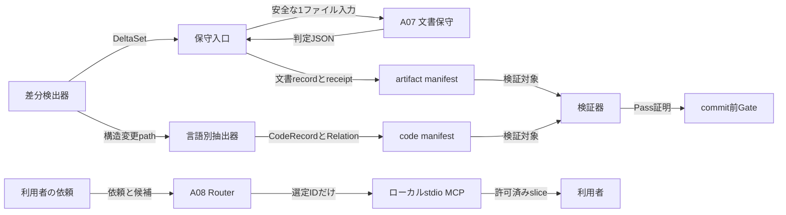
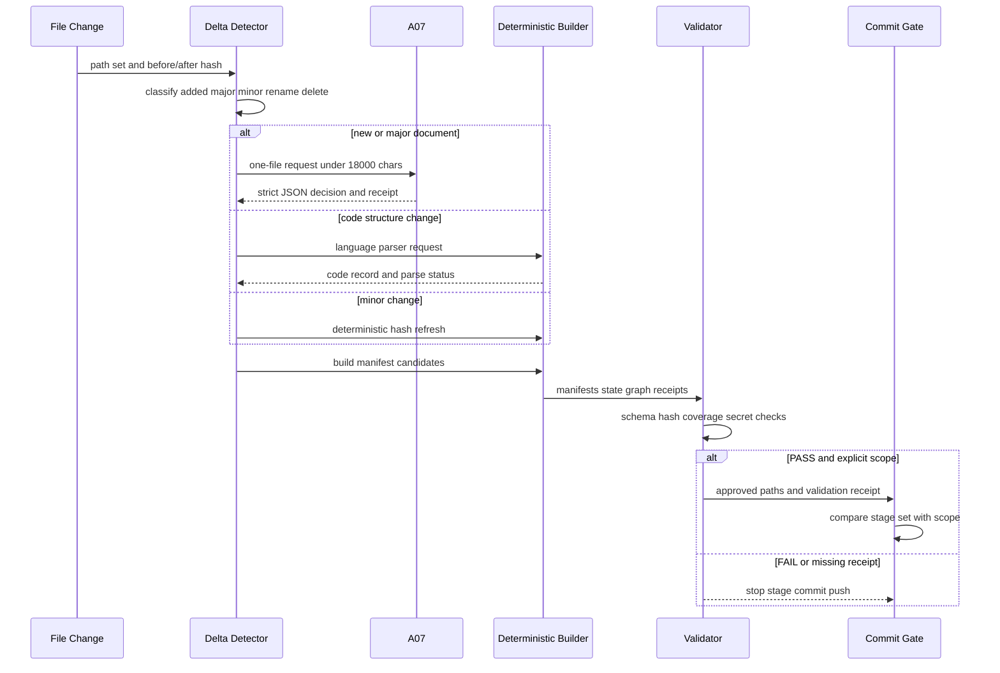

# CTX-01 資料・コード参照基盤 詳細設計候補

- 文書ID: `CTXMAP-D01`
- 状態: `DESIGN_CANDIDATE / CTXMAP-H0承認待ち`
- 対象: `C:/project/strategy_test` のローカル作業ツリーだけ
- 非対象: 実装、依存追加、MCP登録、監視起動、外部通信、AI部品実体変更、Git commit/push
- 入力: `CTXMAP-PLAN-001`、`CTX-00_棚卸し・対象分類.md`、`CTX-00_変更基準線.json`、`CTX-00_Unknown台帳.md`

## 1. 利用者向け概要

この基盤は、文書とコードの「案内カード」をローカルJSONとして持ち、必要なものだけを後から読むための仕組みである。本文全量を集めたり外部サービスへ送ったりしない。既存の `doc/index.html`、REQ/DEC/UNK/ART追跡、正式文書の正本性を置換せず、検索・関係追跡・部分取得を追加する。

`CTX-00` は管理対象682件（文書409、ソース166、設定107）を確認した。ただし初回全量化、parser精度、未追跡物・evidenceを含む網羅性は未確認である。よって本設計は「安全に実装できる契約候補」であり、`CTXMAP-H0` の明示承認前に実装へ渡してはならない。

## 2. 配置と責務

次の図は、実装後にどの部品がどの情報だけを渡すかを示す。実線の矢印は短い受渡し名を付け、本文・認証値は渡さない。



この表は図の受渡しを実装可能な契約へ落とす。受取側は、入力不足や安全境界違反なら先へ進まない。

|送る部品|受け取る部品|渡すデータ・依頼|受け取り側の用途と停止条件|
|---|---|---|---|
|`detect_context_delta`|`run_context_maintenance`|正規化済み相対path、変更種別、before/after hash、構造差分要約からなる`DeltaSet`|対象分類と必要な更新を決める。pathがrepo外、変更種別が曖昧、baselineが不一致なら停止する。|
|保守入口|A07|1ファイルの`A07Request`。安全な本文抜粋は最大18,000文字であり、Secret疑いなら本文を含めない。|新規または大幅変更の文書意味更新を判断する。JSON不正、timeout、Secret疑い、18,000文字超過は`blocked`で停止する。|
|A07|保守入口|`A07Response`とsanitized receipt|レコード更新可否を確認する。`record_add`／`record_update`／`metadata_unchanged`以外、source hash不一致、起動証跡なしは停止する。|
|言語別抽出器|code/relation manifest|`CodeRecord`、確度、抽出状態、明示関係|コード索引を更新する。構造変更なのに`FULL`または`PARTIAL`の結果がない場合は停止する。|
|各manifest|検証器|manifest集合、state、receipt索引、policy|coverage、hash、schema、Secret、削除・rename整合を検査する。1件でも不整合なら非0で停止する。|
|A08|MCP|主資料ID 1〜3件、補助ID 0〜6件、JIT取得範囲|本文を取得する前に必要最小限へ絞る。ID・範囲・予算が不正なら取得を拒否する。|

### 2.1 実装後のディレクトリ候補

```text
context/
  context_policy.json                 # 対象、除外、上限、denylistの正本
  artifact_manifest.schema.json       # CTX-01 schema案を基にした検証schema
  artifact_manifest.json              # 文書・設定のレコード
  code_manifest.json                  # ソースと公開記号のレコード
  relation_graph.json                 # 明示・保守的推定の関係辺
  manifest_state.json                 # hash、解析版、処理状態、tombstone
  receipts/                           # 本文を含まないA07/A08 receipt
  routing_fixtures.json               # router回帰fixture
scripts/context_index/                # 決定的抽出、検証、CLI、stdio server（CTX-03以降）
tests/context_index/                  # 固定fixtureと単体・統合・負例試験（CTX-03以降）
plan/context_index/                   # 計画、設計、review、dispatch証跡
```

`context/` に保存してよいのは構造化metadata、hash、短い要約、見出し、ID、関係、判定結果だけである。本文全量、diff本文、絶対ユーザーパス、認証値、環境変数の値、外部URL本文、raw data、監視ログは保存禁止とする。

## 3. Manifest契約

この節の表は各JSONの役割・必須性・更新責務を示す。厳密なJSON Schemaは `CTX-01_マニフェストschema案.json` を正本候補とする。

|ファイル|保存単位|必須の共通項目|主な固有項目|更新責務|
|---|---|---|---|---|
|`artifact_manifest.json`|文書または設定1件|`artifact_id`、`kind`、`status`、`relative_path`、`source_hash`、`schema_version`、`generator_version`、`first_seen_at`、`updated_at`|title、h1-h3、REQ/DEC/UNK/ART、local links、summary、purpose、triggers、relations、rename/deletion履歴|文書の決定的抽出、A07判定、設定の安全なtop-level key抽出。|
|`code_manifest.json`|ソース1件とその記号群|`code_id`、`artifact_id`、`language`、`extraction_status`、`source_hash`、`schema_version`、`generator_version`|symbols、imports、entry points、line range、parser evidence、limitations|構造変更で決定的に再解析する。未対応は`PARTIAL`または`BLOCKED`であり、完全性を偽らない。|
|`relation_graph.json`|関係辺1本|`relation_id`、`from_id`、`to_id`、`relation_type`、`evidence`、`status`、`schema_version`|source range、confidence、last_verified_hash|ローカルリンク、REQ/DEC/UNK/ART、import、Skill→Agent→Orchestratorの明示参照を再生成する。|
|`manifest_state.json`|artifact/code単位の最新状態|`subject_id`、`subject_type`、`source_hash`、`state`、`last_processed_at`、`generator_version`、`schema_version`|delta kind、A07 receipt参照、major判定根拠、pending理由、tombstone|変更ごとに更新する。未処理・不整合は`pending`／`blocked`であり、Gateは停止する。|
|`receipts/*.json`|A07/A08実行1回|`receipt_id`、`request_id`、`operation`、`occurred_at`、`status`、`schema_version`|A07の対象`subject_id`と`source_hash`、A08の`manifest_snapshot_hash`、dispatch mode、Agent固定model、文字数、拒否理由、出力hash、本文非保存証明|実行入口だけが追記する。receiptがない新規・大幅変更文書はGate不合格である。|

### 3.1 共通不変条件

1. manifestの相対pathは常にPOSIX区切り、repo root相対、先頭`/`なし、`..`なし、NULなしとする。
2. `source_hash` は対象ファイルの元バイト列のSHA-256小文字16進数、hash対象外の正規化は行わない。
3. schema versionは`ctxmap-manifest-v0.1`、generator versionは実装パッケージの固定版文字列である。schema互換性がない更新はmigration receiptなしに読まない。
4. manifest配列は`artifact_id`、`code_id`、`relation_id`の昇順に直列化し、同一入力から同一バイト列になることを要求する。
5. `active`、`deleted`、`partial`、`blocked`、`pending`は状態であり、`partial`と`blocked`を成功・coverage済みに数えない。
6. `summary`、`purpose`、`triggers`は本文でなく短いmetadataである。合計18,000文字制限はA07入力の本文抜粋上限であり、記録データの上限はpolicyで別途小さく固定する。

## 4. Stable ID、rename、削除

### 4.1 ID方針

`artifact_id`はpath hashだけに依存しない。初回登録時に、固定namespace、repository identity、`kind`、初回観測基準commit、初回`source_hash`、初回正規化pathを入力としてUUIDv5を生成し、`art-`接頭辞を付ける。一度発行したIDはpath・title・本文の変更で再計算しない。これにより初回全量化は再現可能で、rename後は同じIDを維持できる。

`code_id`は親`artifact_id`と`qualified_name`、`symbol_kind`、初回宣言signature hashから生成する。関数・classのrenameは新旧コードIDを無理に同一視せず、検出できた場合だけ`predecessor_code_id`を関係辺で結ぶ。あいまいな対応付けは`PARTIAL`にして人の確認を要求する。

### 4.2 rename・削除アルゴリズム

1. Gitのrename候補、before/after hash、正規化path、文書ID、見出し・公開記号を使い候補を作る。
2. old/newが一対一で、同一hashまたはpolicyの高信頼度条件を満たすときだけ旧IDを引き継ぎ、`path_history`へ旧pathと`renamed_at`を追加する。
3. 一対多、多対一、同内容の重複、hash不一致のrename候補は自動採用しない。新規と削除に分け、`rename_ambiguous`をstateへ記録してGateを停止する。
4. 削除はrecordを消さず、`status=deleted`、`deleted_at`、`last_known_path`、`last_source_hash`を保持するtombstoneにする。relation edgeも消さず`status=inactive`へ変え、履歴追跡を保つ。
5. tombstoneと同じpathが再追加されても新IDを発行する。同一性を再利用できるのは明示的なrenameまたは復元として検出・記録された場合だけである。

## 5. 文書・コード抽出の境界

この表は、解析器が言えないことを明示する。`PARTIAL`は「少し読めた」ではなく、明示した情報以外を推測しないという安全状態である。

|対象|決定的に抽出するもの|`FULL`の条件|`PARTIAL`境界と停止条件|
|---|---|---|---|
|Markdown/HTML|title、h1-h3、文書ID、REQ/DEC/UNK/ART、ローカルリンク、行数、hash|UTF-8として読め、見出し・リンクを規則どおり走査できる|壊れたUTF-8、過大ファイル、Secret疑いは本文を保存せず`blocked`。要約・用途・発火条件はA07だけが更新する。|
|Python|標準`ast`によるfunction/async function/class/method/decorator/import/from import/行範囲|構文木生成成功、対象ノード全走査、syntax errorなし|syntax errorは`PARTIAL`。文字列内import、動的import、実行時生成記号、反射呼出しは推測せずlimitationsに記す。|
|JS/TS|既存依存で安全に構文木を得られる場合だけexport/import/宣言/行範囲|利用可能な既存parserがversion固定で試験済み|追加依存なしでは保守的なexport/import/宣言の字句抽出だけを行い`PARTIAL`。型解決、dynamic import、re-exportの完全性は主張しない。|
|PowerShell|`function`、param block、script entry、dot-source/import相当の保守的抽出|既存環境で安全な構文解析が試験済み|AST利用可否が未確定なため初期値は`PARTIAL`。動的呼出し、string実行、profile由来依存は抽出しない。|
|shell/cmd|function定義、shebang、source/dot、静的な外部script参照|固定規則で対象記号が得られる|`eval`、変数展開path、subshell、環境依存sourceは`PARTIAL`。cmdはラベルと`call`のみ保守的に扱う。|
|JSON/TOML/YAML|top-level key名、許可済み相対path参照|値を読まずkey構造だけで検証できる|Secretらしきkey、alias、任意コード実行タグ、解析不能は`blocked`。値・token・URL本文をmanifestへ保存しない。|

`CTXMAP-UNK-01` は、JS/TS、PowerShell、shellの`FULL`に必要な既存parserの実測と、追加依存が必要な場合の名称・用途・ライセンス確認を包含する。実測前に`FULL`を記録してはならない。

## 6. A07/A08 JSON契約

### 6.1 A07: ContextManifestMaintainer

A07は新規文書なら必ず`record_add`、大幅変更文書なら`record_update`または`metadata_unchanged`を返す。小変更は決定的更新だけでよいが、stateにA07不要の閾値根拠を残す。A07は1実行につき1相対pathだけを扱い、ネットワーク、任意path読取、Git stage/commit/push、本文全量保存をしない。

|項目|A07入力|A07出力|
|---|---|---|
|必須|`request_id`、`relative_path`、`kind`、`source_hash`、`delta`、既存recordまたはnull、`safe_excerpt`|`request_id`、`artifact_id`、`action`、`summary`、`purpose`、`triggers`、`headings`、`relations`、`confidence`、`reason`、`source_hash`、`receipt`|
|制限|相対pathのみ、対象1件、`safe_excerpt`はUTF-8かつ18,000文字以下、Secret疑いなら空文字|strict JSON objectだけ。本文、diff、token、絶対path、外部URL本文を含めない。|
|action|N/A|`record_add`、`record_update`、`metadata_unchanged`、`blocked`。新規で`record_add`以外は不合格。|
|fail closed|入力不足、文字数超過、Secret検出、schema不正、Agent未起動、timeout、source hash不一致|`blocked`とmachine-readable reasonを返す。保守入口とGateはcommitを停止する。|

`confidence`は0〜1の数値で、policyの最低値未満なら`blocked`とする。最低値は実装前に`context_policy.json`へ固定し、暗黙のデフォルトを持たせない。

### 6.2 A08: ContextRouter

A08は依頼とmanifest検索結果だけを読む。本文・コード・MCP結果を直接読むこと、検索を再実行すること、ファイル更新はしない。

|項目|契約|
|---|---|
|入力|`request_id`、ユーザー依頼（最大4,000文字）、artifact/codeの安全な候補、relation graphの深さ1近傍、JIT予算。|
|出力|`primary_ids`（1〜3）、`supporting_ids`（0〜6）、選定理由、tool名、ID、headingまたはline範囲、総JIT文字予算、不足情報、receipt。|
|選定不能|候補が不足・曖昧なら空の`primary_ids`と`blocked`または`unknown`理由を返す。もっともらしいIDを捏造しない。|
|禁止|ネットワーク、Secret読取、任意path、本文取得、Git操作、manifest更新。|

## 7. ローカルstdio MCP契約

MCP serverはrepo rootを起動時に一度canonical pathへ固定し、stdioだけを使う。HTTP listen、socket listen、外部MCP、クラウドDBは設けない。すべてのtoolはID先行で解決し、利用者入力のpathを直接開かない。

|tool|入力|成功時の返り値|上限と拒否|
|---|---|---|---|
|`search_context`|`query`、`kinds?`、`limit`（1〜20）|ID、kind、短いsummary、purpose、関連ID、score|queryは4,000文字以下。manifestだけを検索し、本文を返さない。未知kind、超過limit、Secret patternは拒否。|
|`get_artifact`|`artifact_id`、`heading_or_line_range?`、`max_chars`（1〜12,000）|ID、相対path、title、選択範囲、本文slice、truncated|activeなmanaged documentだけ。repo外、境界path、Secret、無効UTF-8、範囲不正、12,000超は拒否する。|
|`get_code_slice`|`code_id`、`symbol_or_line_range?`、`max_chars`（1〜12,000）|ID、相対path、language、symbol、line range、code slice、truncated|`code_manifest`の登録済み記号・範囲だけ。`PARTIAL`の未保証範囲、repo外、Secret、範囲不正は拒否する。|
|`get_related`|`artifact_id`、`relation_types?`、`depth`（固定1）、`limit`（1〜20）|relation ID、相手ID、種別、evidence、status|graphだけを返す。deleted/inactiveを既定で除外し、depth>1、未知relation type、limit超過は拒否する。|

path confinementは、IDからmanifestのPOSIX相対pathを取り、canonicalized candidateが固定repo rootの子であることを確認してから行う。Windows drive、UNC、`../`、NUL、symlinkでrepo外へ出るものはすべて拒否する。Secret denylistはpath名、key名、内容検査の三層とし、検出理由だけを返して検出内容はログへ出さない。

## 8. commit前Gateと誤stage防止

### 8.1 選択肢と決定

|案|長所|短所|判断|
|---|---|---|---|
|現行の`git add -A`|実装が短い|既存未追跡物、Secret、別作業の変更をstageする|不採用。CTX-00でも実リスクを確認済み。|
|Gate後に`git add -- <explicit pathspec>`|対象を明示でき、indexを小さく保てる|path集合と起点snapshotを安全に管理する必要がある|採用候補。Gateと同一のDeltaSetからのみpathspecを作る。|
|Gateは検査だけ、stage/commitは人手|最も安全|自動commit目的を満たさない|H1未承認時の既定運用として採用。H1後の代替ではない。|

`CTXMAP-DEC-08`として、H1後の自動経路は「検証前にstageしない」「watch開始時のGit status snapshotに存在した未追跡・staged変更を対象外にする」「Gateが返したallowlist以外をstageしない」「不整合ならindex/worktreeを変更しない」を必須とする。

### 8.2 実行順序

1. watcherまたは手動CLIは変更eventの`relative_path`と開始時snapshotを記録する。既存未追跡物は`preexisting_untracked`として除外する。
2. GateはDeltaSet、policy、manifest、receiptをread-onlyで検証する。新規・大幅文書はA07 receipt、コード構造変更は再解析結果がなければ非0で終了する。
3. Gate pass後だけ、event由来で検証済みの対象pathと同一transactionで生成された`context/`更新物だけを`git add -- pathspec`でstageする。
4. stage直前にindexが開始時snapshotと異なる場合、またはallowlist外の差分が増えた場合は停止する。既存indexをreset・checkout・復元しない。
5. commit/pushはH1承認済みで、明示的に許可された後続Stepだけが実行する。CTX-01では一切実行しない。

## 9. 運用境界と脅威モデル

この表は、危険な入力や故障が起きたときの停止・証跡・復旧条件を示す。

|脅威|入口|防御とfail-closed|証跡・復旧|
|---|---|---|---|
|prompt injection|文書本文・HTMLコメント・コードコメント|A07/A08は本文を命令ではなくdataとして扱い、許可schema外の指示を実行しない。MCPはID・範囲だけで取得する。|`blocked` receiptに分類だけを残し、人が原文を隔離確認してから再実行する。|
|path traversal / symlink escape|MCP引数、manifest汚染、Windows/UNC path|ID先行、POSIX正規化、canonical root内確認、symlink解決後もroot内、`..`・drive・UNC拒否。|拒否理由コードとrequest IDを残す。path本文をログに残さない。|
|Secret漏えい|`.env`、鍵、設定値、本文・receipt|denylist三層、値をmanifest/receipt/logへ保存しない。検出時は内容非表示で停止。|Secret疑いの件数・path hashだけを監査し、人が安全な環境で分類する。|
|巨大ファイル / resource exhaustion|履歴、evidence、意図的巨大入力|policyのbyte/line/文字数上限、stream先頭のみでは安全判定せず`blocked`、MCP 12,000文字上限。|サイズと拒否codeを記録し、個別採用はH0後に再判断する。|
|無限監視|manifest自身の更新、event storm|H1前は監視を起動しない。H1後は生成path除外、event debounce、同一hash冪等、単一worker、最大retry回数。|pending queueと最後のhashを残し、手動再実行でのみ再開する。|
|自己更新ループ|A07出力が入力文書・policyを再変更|A07/A08はread-only。保守入口だけがmanifestを書き、manifest書換えは入力eventに戻さない。|transaction IDとwrite setを記録し、同一transaction再入を拒否する。|
|auto-commit誤stage|watcher、shell、既存dirty worktree|開始時snapshot、allowlist pathspec、gate pass後stage、preexisting untracked除外、index差異時停止。|Gate reportに候補pathと除外理由だけを記録する。失敗時はstage/commit/pushをしない。|

## 10. 例外、復旧、観測

設計時点では常駐監視・外部監視・通知を導入しない。実装後も必要最小限のローカル監査だけとし、`pending`／`blocked`を黙って再試行しない。手動復旧は、原因を解消後に同じ固定入力で`run_context_maintenance`またはvalidatorを一回実行し、新しいreceiptとsource hashを確認する手順に固定する。

運用上の必須指標は、managed件数、active/deleted/partial/blocked/pending件数、A07/A08拒否件数、最大処理bytes、最大処理時間、Gate pass/fail、preexisting untracked除外件数だけである。本文、ユーザー名、絶対path、Secret値は指標に含めない。

## 11. 追跡表

|ID|設計項目|根拠|成果物・後続確認|
|---|---|---|---|
|`CTXMAP-D01`|CTX-01資料・コード参照基盤詳細設計候補|CTX-01実行用プロンプト|本書、schema案、脅威・テスト設計|
|`CTXMAP-DEC-01`|マニフェストはartifact/code/relation/state/receiptの5層|検索と本文取得、安全な更新責務の分離|CTX-03 schema/validator|
|`CTXMAP-DEC-02`|IDは初回の複合入力で発行し、rename後も保持|path hash単独を避け、履歴を追う|CTX-03/05 rename fixture|
|`CTXMAP-DEC-03`|削除はtombstone、関係辺はinactive|過去のREQ/DEC/UNK/ART追跡を壊さない|CTX-03 validator|
|`CTXMAP-DEC-04`|JS/TS/PowerShell/shellは実測前にPARTIALを既定|未知のparser完全性を偽らない|`CTXMAP-UNK-01`、CTX-05|
|`CTXMAP-DEC-05`|A07/A08は1ファイル・18,000文字・strict JSON・network禁止|入力面積と情報漏えいを最小化|CTX-02/04/06契約試験|
|`CTXMAP-DEC-06`|MCPはstdio、ID先行、最大12,000文字|任意path読取・過大取得を防ぐ|CTX-06 security test|
|`CTXMAP-DEC-07`|新規/大幅文書とコード構造変更はGate fail-closed|未整合マニフェストでcommitさせない|CTX-04/05/07|
|`CTXMAP-DEC-08`|`git add -A`を禁止しallowlist stageへ移行|既存未追跡変更の混入を防ぐ|CTX-07 Git index fixture|
|`CTXMAP-DEC-09`|監視はH1承認後だけ、単一worker・自己event除外|無限監視と無承認の自動化を防ぐ|CTX-07/09/H1|
|`CTXMAP-UNK-01`|言語別の完全parser可否と追加依存|CTX-00で未確定|既存依存の実測。追加依存なら別承認で停止。|
|`CTXMAP-UNK-02`|巨大履歴、evidence、未追跡物の全量対象範囲|CTX-00で未確定|H0前に個別本文を索引化しない。CTX-02/08で再確認。|
|`CTXMAP-H0`|実装開始承認|新規context、AI部品、設定の横断変更|本書のCritical/High解消後、ユーザー明示承認|
|`CTXMAP-H1`|監視・自動保守の有効化承認|自動起動とcommit経路変更|CTX-09受入後、ユーザー明示承認|

## 12. 設計レビュー履歴

- 初回設計: CTX-01、ローカル読取資料に基づく候補。
- 実ランタイム: `multi_agent_v1__spawn_agent`／`multi_agent_v1__wait_agent` は利用できたが、指定OrchestratorとA82の明示起動はwait timeoutで完了せず、A91/A70/A80の再起動はスレッド上限または固定model制約に阻まれた。別起動から設計・レビュー材料の通知は到着したが、完全な指定Agentの受領証跡としては採用していない。詳細は `CTX-01_dispatch_receipt.json` を参照する。
- レビュー状態: A82/A91/A70相当の材料は受領したが、指定JSON定義どおりの独立完了・Orchestrator統合・A80導線確認の閉ループは未実施。rootによる自己レビュー材料と受領材料は `CTX-01_受入・脅威・テスト設計.md` に分離した。独立レビュー完了とは扱わない。
- 受入可否: `CONDITIONAL / H0判断材料`。実装着手可ではない。High指摘をH0承認前に人が判断する。
  5. commit/pushはH1承認済みで、明示的に許可された後続Stepだけが実行する。CTX-01では一切実行しない。

### 8.3 更新シーケンス

この図は、新規文書、大幅変更、コード構造変更、小変更、失敗時の共通順序を示す。A07の意味判定と決定的抽出を混同せず、検証が終わるまでcommitへ進めない。



この順序で、A07未起動、parser PARTIALの構造変更、stale hash、Secret候補、schema破損、scope外差分のいずれかがあれば、既存の正本と作業ツリーを保持したまま停止する。
