# RQU-04 C4章構成・図解仕様・用語辞書

## 0. 文書情報

| 項目 | 内容 |
|---|---|
| ステップID | RQU-04 |
| 基準日 | 2026-08-10 |
| 状態 | `COMPLETED_WITH_VISUAL_CHECK_DEFERRED` |
| 承認状態 | `RQU-H2_PENDING` |
| 文書セット | `RQU-DOCSET-001` |
| 入力 | RQU-01、RQU-02、RQU-03、要件定義書アップデート実行計画書 |
| 主な出力 | C4 Level 1〜4の章構成、図一覧、用語辞書、状態凡例、Mermaid互換性結果 |
| 正式HTML | まだ変更しない。RQU-07以降で候補を作り、RQU-H3後に正式化する |

この文書は、要件定義書を書き始める前の「設計図」である。まだ要件定義書の正本ではない。RQU-H2で章構成、状態の見せ方、Mermaidの使い方が承認されるまで、本文と正式HTMLは差し替えない。

## 1. 実行したAI基盤と判断

### 1.1 使用した部品

| 種類 | 使用部品 | このステップでの役割 |
|---|---|---|
| Orchestrator | `AutoTradeProject_ImplementationDesign_Orchestrator_v0_1` | C4構成、詳細設計との境界、レビュー接続を統制 |
| Agent | `AutoTrade_A20_ArchitectureDomainArchitect_v0_1` | C4 Level 1〜4と責務境界を整理 |
| Agent | `AutoTrade_A80_DocumentIntegrator_v0_1` | 章の並び、用語、状態表現の統一方針を整理 |
| Agent | `AutoTrade_A81_DesignDocSetWriter_v0_1` | 将来のMarkdown/HTML構造と導線を確認 |
| Agent | `AutoTrade_A82_ImplementationDetailDesigner_v0_1` | Level 3/4を詳細設計の複製にしない境界を確認 |
| Agent | `AutoTrade_A91_ImplementationDetailReviewer_v0_1` | 概念図から実装、入出力、状態、例外、テストへ追跡できるか確認 |
| Skill | `autotrade_skill_architecture_writer_v0_1` | 全体構成と依存方向を整理 |
| Skill | `autotrade_skill_domain_modeling_v0_1` | 概念データ、状態、IDの関係を整理 |
| Skill | `autotrade_skill_implementation_detail_design_v0_1` | 詳細設計品質ループの観点を要件定義へ適用 |
| Skill | `autotrade_skill_implementation_detail_review_v0_1` | 実装可能性と要件・詳細設計の境界をレビュー |
| Skill | `autotrade_skill_html_doc_writer_v0_1` | 単体で読めるHTMLとMermaid資産の前提を確認 |
| Skill | `autotrade_skill_design_doc_set_writer_v0_1` | 文書ID、導線、履歴、相互参照の前提を確認 |

### 1.2 AI部品の変更判定

RQU-02で、既存の汎用Orchestrator、Agent、Skillの組み合わせで本作業を実行できると判定した。したがって、RQU-02A、RQU-H1は実行しない。新しいC4専用Writer、Mermaid専用Skill、要件専用Agent、要件専用Orchestratorは作成しない。`default_orchestrator`も変更しない。

中学生向けの読みやすさは、後続の本文レビューで既存の `student-review-agent` / `student-reviewer` を補助的に使う。これは説明文の読みやすさを確認するためであり、正式な要求、数値、ID、状態、コード名を消すためではない。

## 2. 文書全体の構成案

### 2.1 読者が最初に見る順番

1. 30秒で分かる要約
2. 今できること、まだしてはいけないこと
3. 状態の読み方と色・記号の凡例
4. C4 Level 1の全体図
5. 専門用語ミニ辞典
6. C4 Level 2〜4
7. 機能、品質、安全、移行、Unknown、追跡表、変更履歴

最初に「何ができて、どこから先は人の承認が必要か」を示す。これにより、固定範囲のBacktest検証をLive運用の許可と誤解しないようにする。

### 2.2 章の流れ

```mermaid
flowchart LR
  subgraph START["最初に読む"]
    S1["30秒要約"]
    S2["できること / してはいけないこと"]
    S3["状態と凡例"]
  end
  subgraph C4["C4の4階層"]
    L1["Level 1\n街の中の建物"]
    L2["Level 2\n建物の部屋"]
    L3["Level 3\n部屋の専門スタッフ"]
    L4["Level 4\nデータと状態のマニュアル"]
  end
  subgraph CROSS["横断して確認"]
    X1["機能・品質・安全"]
    X2["移行条件・Gate・Unknown"]
    X3["要求追跡・用語・履歴"]
  end
  S1 --> S2 --> S3 --> L1 --> L2 --> L3 --> L4 --> X1 --> X2 --> X3
  classDef start fill:#fef3c7,stroke:#b45309,color:#78350f,stroke-width:2px;
  classDef c4 fill:#dbeafe,stroke:#1d4ed8,color:#1e3a8a;
  classDef cross fill:#dcfce7,stroke:#15803d,color:#14532d;
  class S1,S2,S3 start;
  class L1,L2,L3,L4 c4;
  class X1,X2,X3 cross;
```

**この図で見るポイント**

- 最初に「できること」と「禁止境界」を確認する。
- Level 1からLevel 4へ進むほど、全体から細部へ近づく。
- 最後まで読んでも、Unknownや未承認の外部接続をPASSとは扱わない。

## 3. C4 Level 1: System Context

### 3.1 何を説明する階層か

中学生向けには、「街の中のどんな建物か」を説明する。誰がこの建物を使い、外から何を受け取り、何を返し、どの境界で止まるのかを一枚で分かるようにする。

正式には、自動トレードシステムを中心に、利用者、運用者、承認者、市場データ、取引エンジン候補、将来のBroker、通知、Secret、Cloudとの関係を示す。ただし、将来のBroker、Paper、Live、Secret、Cloudは、関係を描いても「接続済み」や「実行許可」とは書かない。

### 3.2 必須図: Context Diagram

| 図ID | 図 | 主な問い | 記法 | 状態 |
|---|---|---|---|---|
| `RQU-C4-L1-01` | 全体の文脈図 | 誰が何を依頼し、何が返り、どこで止まるか | `flowchart LR` | 必須 |

図には次の要素を入れる。

- 利用者・運用者: 設定、入力、実行依頼、結果確認を行う。
- 承認者: Human Gateを判断する。AIやコードが代わりに承認しない。
- 自動トレードシステム: Market Data、Strategy、Backtestを内部に持つ。
- 市場データ提供元: 現在の固定入力または将来の外部データ境界として描く。
- 取引エンジン候補: LEANはPoC候補であり、最終採用済みとは書かない。
- Broker、Paper、Live、Secret、Cloud、通知先: 「将来境界」「未承認」と明記する。
- 出口: Backtest結果、停止理由、Manifest、hash、ログ、証跡。

### 3.3 Level 1で対応する要求と証拠

| 要素 | 要求ID | 状態 | 根拠 |
|---|---|---|---|
| 利用目的・利用者 | `REQ-CTX-*` | 要件として採用 | RQU-03、既存要件定義書 |
| 対象市場・市場数 | `REQ-CTX-003`, `REQ-CTX-004` | 一部未確定・範囲限定 | `UNK-P3-01`、P3-AC-07 |
| Engine候補 | `REQ-EXE-001` | LEAN PoC候補、最終未決定 | P3-D10、P3-D14 |
| Broker接続 | `REQ-EXE-003` | `NOT_AUTHORIZED` | P3-D14、`UNK-P3-01/05/07` |
| 段階移行 | `REQ-GATE-001`, `REQ-GATE-002` | 将来計画・未承認 | P3-D14、H3-4承認範囲 |

## 4. C4 Level 2: Container

### 4.1 何を説明する階層か

中学生向けには、「建物の中にある部屋の役割分担」を説明する。各部屋が何を受け取り、何を渡し、失敗したらどう止めるかを書く。ここでいうContainerは、必ずしも別のサーバーや別プロセスという意味ではない。責務を分けて考えるための箱である。

### 4.2 必須図: Container Diagram

| 図ID | 図 | 主な問い | 記法 | 必須要素 |
|---|---|---|---|---|
| `RQU-C4-L2-01` | コンテナ配置図 | どの部屋がどの順番で協力するか | `flowchart LR` | `subgraph`、`classDef`、実装済み/将来/禁止の凡例 |
| `RQU-C4-L2-02` | Backtest操作シーケンス | 入力から結果・停止理由まで何が起きるか | `sequenceDiagram` | `box`、入力、Gate、Replay、Result、証跡 |
| `RQU-C4-L2-03` | 将来Paper境界シーケンス | Paperへ進む前に誰が何を承認するか | `sequenceDiagram` | Human Gate、未承認境界、停止条件 |

### 4.3 Containerの役割

| Container | 中学生向けの説明 | 受け取るもの | 渡すもの | 失敗時 |
|---|---|---|---|---|
| 設定・実行入口 | 作業を始める受付 | 設定、Run ID、実行依頼 | 実行計画、入力参照 | 必須項目がなければ開始しない |
| Market Data | 市場データを整理する部屋 | raw/DBN、Catalog、Manifest | 正規化データ、品質結果、hash | 品質不合格・改変・欠損で停止 |
| Strategy | ルールを判断する担当 | ClosedBar、StrategyConfig、状態 | SignalEvent、TargetPosition、OrderIntent候補 | 未来データ、未確定足、順序異常で停止 |
| Backtest / Experiment | 過去の市場を同じ順序で再生する部屋 | Manifest、ReplayInput、Strategy出力 | Result、停止理由、Snapshot | Gate不合格、時間逆行、再現不能で停止 |
| Engine Adapter | エンジンの言葉をCoreの言葉へ変換するプラグ | Core契約、エンジン結果 | 型付き結果、EngineIdentity | SDK漏れ、未許可エンジン、identity不整合で停止 |
| Evidence / Result Store | 証拠をしまう棚 | Manifest、hash、ログ、結果 | 再確認できる証跡 | 保存不整合なら結果を採用しない |
| Risk / OMS / Broker Adapter | 将来の安全担当・外部接続口 | TargetPosition、承認、Risk判断 | 注文意図・外部注文 | 現時点は未承認。接続・Paper・Liveへ進めない |
| Monitoring / Secret / Cloud | 将来の監視・秘密情報・実行環境 | 将来の運用設定 | 通知、Heartbeat、実行状態 | 現時点は未実装・未承認 |

### 4.4 通信の書き方

すべての矢印は、次の3点を文章でも図でも分かるようにする。

1. 何を送るか。例: `ExperimentManifest`、`ClosedBar`、`TargetPosition`。
2. 何を受け取るか。例: `DataGateDecision`、`Result`、`StopReason`。
3. 失敗したらどうなるか。例: `STOPPED`へ遷移し、外部注文を出さない。

## 5. C4 Level 3: Component

### 5.1 何を説明する階層か

中学生向けには、「一つの部屋の中にいる専門スタッフの連携」を説明する。Level 3では、すべてのクラスを列挙しない。要件を理解するために必要な担当と、担当同士の入力・出力・停止条件だけを描く。

### 5.2 必須図の一覧

| 図ID | 対象 | 主な問い | 記法 |
|---|---|---|---|
| `RQU-C4-L3-01` | Market Data | データを見つけ、品質を確認し、正規化する順番は何か | `flowchart TD` |
| `RQU-C4-L3-02` | Strategy | ClosedBarからTurtle判断、状態更新、TargetPositionまでどう進むか | `flowchart TD` |
| `RQU-C4-L3-03` | Backtest | Manifest、Replay、Calendar、Fill、Resultがどう連携するか | `flowchart LR` |
| `RQU-C4-L3-04` | Engine Adapter境界 | Coreと外部エンジンの依存方向をどう閉じ込めるか | `flowchart LR` |
| `RQU-C4-L3-05` | Data Gate停止 | 入力不整合がどこで検知され、なぜ先へ進まないか | `flowchart TD` |
| `RQU-C4-L3-06` | M30生成 | 実M1連続30本とprovenanceをどう確認するか | `flowchart TD` |
| `RQU-C4-L3-07` | Backtest再現 | 同じ入力・設定・版で同じReplayを再生できるか | `flowchart TD` |
| `RQU-C4-L3-08` | 注文意図の安全境界 | Strategyの出力がRisk/OMS/Brokerへ勝手に直結しないか | `flowchart LR` |

### 5.3 Level 3で必ず説明する契約

- Strategyは口座全体のRisk、Account、OMSを担当しない。
- `TargetPosition`は「どの状態を目指すか」を表し、外部Brokerへの注文そのものではない。
- `OrderIntent`は将来の注文意図であり、Broker接続・Paper・Liveの許可を意味しない。
- M30は実M1を連続30本集め、provenanceが確認できる場合だけ作る。不足時は停止する。
- ClosedBarだけを使い、未来の値を参照するlook-aheadを拒否する。
- Manifest、hash、Replay、Snapshot/restoreで、入力と途中状態を追跡できるようにする。
- Engine Adapterの外側からSDK固有型をCoreへ漏らさない。

## 6. C4 Level 4: Code / Detail

### 6.1 何を説明する階層か

中学生向けには、「スタッフが見るマニュアルと整理用ファイルの項目」を説明する。要件定義書では、実装クラスの全メソッドや全フィールドを複製しない。概念データ、状態、必須の関係、既存詳細設計へのリンクに絞る。

### 6.2 必須図の一覧

| 図ID | 図 | 主な問い | 記法 | 詳細設計への接続 |
|---|---|---|---|---|
| `RQU-C4-L4-01` | 概念データ関係 | 市場データ、Experiment、Manifest、Result、Gate、Unknownはどうつながるか | `classDiagram` | P3-D04/P3-D05 |
| `RQU-C4-L4-02` | Data Gate状態 | READYからCOMMITTED/STOPPEDへどう変わるか | `stateDiagram-v2` | Backtest詳細設計、Data Gate実装 |
| `RQU-C4-L4-03` | Experiment状態 | 計画、実行、完了、停止、復旧をどう区別するか | `stateDiagram-v2` | `runner.py`、Snapshot/restore |
| `RQU-C4-L4-04` | 注文意図状態 | Strategy出力から安全な外部接続境界までをどう止めるか | `stateDiagram-v2` | Strategy契約、Risk/OMS境界 |
| `RQU-C4-L4-05` | 要求と実装名の対応 | 概念名と実装名をどう追跡するか | `classDiagram`または表 | RQU-03、P3詳細設計 |

### 6.3 概念データの最小範囲

| 概念 | 役割 | 状態・関係で伝えること |
|---|---|---|
| `MarketEvent` | 市場の出来事 | 時刻、銘柄、時間足、価格の入力 |
| `ClosedBar` | 確定した足 | 未確定足や未来値を入力しない |
| `SignalEvent` | ルールが出した判断の記録 | どの入力・ルール・時刻から出たか |
| `TargetPosition` | 目指す保有状態 | Broker注文とは別の概念 |
| `OrderIntent` | 将来の注文意図 | Risk/OMSと承認を通過しなければ外部注文にならない |
| `ExperimentPlan` | 実験の計画 | 対象期間、銘柄、設定、実行モード |
| `ExperimentManifest` | 入力と設定の封印付きリスト | version、hash、source、設定の整合 |
| `DataGateDecision` | 入力を通してよいかの判断 | `READY`、`COMMITTED`、`STOPPED`など |
| `BacktestSnapshot` | 途中状態の保存 | 同じ位置から復旧できるか |
| `Result` | 実験結果 | 計算結果と停止理由を証跡と結び付ける |
| `HumanGate` | 人による承認 | 未承認の段階を越えない |
| `Unknown` | 証拠が足りない項目 | 未解消であり、PASSではない |

## 7. 横断章の配置

| 横断章 | 主に扱う要求ID | 書く内容 |
|---|---|---|
| 機能要件 | `REQ-CTX-*`, `REQ-DATA-*`, `REQ-STR-*`, `REQ-BT-*` | 何をするか、何を入力し、何を返すか |
| 非機能要件 | `REQ-QA-*`, `REQ-OPS-*` | 再現性、監査性、性能、保守性、証跡 |
| 安全・権限 | `REQ-RISK-*`, `REQ-GATE-*` | Fail-Closed、手動停止、Human Gate、Secret境界 |
| 品質Gate | `REQ-QA-*` | 固定入力で何を確認したか、証拠はどこか |
| 移行ロードマップ | `REQ-EXE-*`, `REQ-OPS-*`, `REQ-GATE-*` | Backtest→Shadow→Paper→Liveの条件と未承認境界 |
| 現在状態 | 全REQ | `IMPLEMENTED`、`VERIFIED_FIXED_SCOPE`、`PLANNED`などの意味 |
| Unknown台帳 | `REQ-GATE-*`、`UNK-P3-*` | 未解消理由、再開条件、期限、証拠先 |
| 追跡表 | 全REQ、旧Q/OD、P3-AC | 要件、実装、テスト、証拠、Gateを番号で結ぶ |
| 用語集 | 全章 | 例え、正式名称、システム内の意味 |
| 変更履歴 | `ART-*` | Markdown、HTML、索引、レビューの版を記録 |

## 8. 用語辞書

専門用語は消さない。初出では「身近な例え → 正式名称 → このシステムでの意味」の順番で説明する。

| 正式名称 | 身近な例え | このシステムでの意味 |
|---|---|---|
| Database / DB | 大きな本棚 | 市場データ、設定、結果、証跡を決めた場所に保存する仕組み |
| API | 部屋へ注文を運ぶウェイター | 別の部品へ決めた形式で依頼し、返事を受け取る入口 |
| Adapter | 形の違う差し込み口をつなぐ変換プラグ | 外部データやEngineの違いをCoreの契約へ変換する境界 |
| Core | 建物の中央の作業室 | 外部サービスから独立して、固定契約で判断する中心部分 |
| Market Data | 観測所から届く天気記録 | 市場の時刻、価格、出来高などの入力 |
| Catalog | 本棚の場所を探す案内板 | どのデータがどこにあり、どの版かを見つける情報 |
| Manifest | 封印付きの持ち物リスト | 入力、設定、実行版、source、hashをまとめた実験の身分証 |
| hash | デジタルの指紋 | ファイルが途中で変わっていないかを確認する値 |
| Replay | 録画を同じ順番で再生すること | 同じ市場データを同じ順番でBacktestへ流す処理 |
| Snapshot | ゲームのセーブデータ | 途中の状態を保存し、同じ条件から再開する情報 |
| Data Gate | 入場口の手荷物検査 | 入力の品質、順序、版、hashなどを確認し、通すか止める仕組み |
| Fail-Closed | 分からないときに閉まる安全ブレーキ | 不整合や不明点があれば次へ進まず停止する考え方 |
| ClosedBar | 結果が確定した記録用紙 | まだ完成していない価格の足をStrategy判断に使わない契約 |
| look-ahead | 答えを先に見てしまうズル | 未来の市場データを過去の判断に混ぜる誤り。検知したら停止 |
| provenance | その品物の産地証明 | M30が実M1連続30本から作られたことなど、入力の由来 |
| Strategy | ルールで判断する選手 | 市場入力と設定からSignalEventやTargetPositionを作る部品 |
| Turtle | 先に決めたルールで走る選手 | System 1/2、Stop、Exit、追加などの比較対象ルール |
| TargetPosition | 目標を書いたメモ | 目指す保有状態。外部Brokerへの注文そのものではない |
| OrderIntent | 注文の下書き | 将来の注文意図。Risk/OMSとHuman Gateを越えるまでは外部注文ではない |
| Engine Adapter | 翻訳係 | LEANなど外部Engineの結果をCoreの型へ変換する部品 |
| Experiment | 条件を固定した実験 | 期間、銘柄、設定、入力版、実行モードを決めたBacktest単位 |
| Backtest | 過去映像での練習 | 過去データを再生して、ルールと実行契約を検証するモード |
| Paper | お金を使わない模擬取引 | 将来候補。人の承認と別の証拠が必要で、現在は未承認 |
| Live | 実際のお金を使う取引 | 将来候補。現在の文書更新やBacktest合格だけでは許可されない |
| Human Gate | 人が鍵を持つ安全ゲート | 人が内容と証拠を確認し、次の段階へ進むことを承認する場所 |
| Blocked | 道路が封鎖されている状態 | 条件不足のため作業を進めてはいけない状態 |
| Unknown | まだ答えが決まっていない箱 | 証拠不足で、正しいとも間違いとも決めていない状態。PASSではない |
| Evidence | 実験の証拠ファイル | 入力、ログ、hash、テスト結果、停止理由を後から確認できる記録 |

## 9. 状態・色・線の凡例

色だけを見て判断しない。図中に状態名と説明ラベルを必ず書き、線種も組み合わせる。

| 状態ラベル | 意味 | 色の目安 | 線・記号 |
|---|---|---|---|
| `[実装済み]` | 現行コードまたは正式設計に責務がある | 青 `#dbeafe` | 実線 |
| `[固定範囲で確認済み]` | 固定入力・固定契約の証拠がある | 緑 `#dcfce7` | 実線＋証拠ID |
| `[承認済み延期/Unknown]` | 延期は認められたが、未解消・未PASS | 黄 `#fef3c7` | 破線＋`UNK-*` |
| `[将来計画]` | 将来の候補または移行条件 | 紫 `#f3e8ff` | 破線 |
| `[未承認/禁止境界]` | 人の承認なしには接続・実行してはいけない | 赤 `#fee2e2` | 太線、停止矢印、`NOT_AUTHORIZED` |
| `[証拠・成果物]` | 結果やログを保存する場所 | 白地または薄緑 | `ART-*`、リンク |

### 9.1 Mermaidでの共通スタイル

`flowchart`では `subgraph` と `classDef` を使う。`sequenceDiagram`では `box rgb(...)`、必要な箇所では `rect rgb(...)` と `Note`を使う。`classDiagram`と`stateDiagram-v2`はRQU-04のローカル検証で通った書き方を使う。色分けが効かない図では、ラベル、凡例、破線、停止矢印を必ず残す。

## 10. Mermaid互換性の最小描画試験

### 10.1 試験対象

| 項目 | 結果 |
|---|---|
| ローカル資産 | `doc/assets/mermaid.min.js`、`doc/assets/mermaid-init.js` |
| Nodeパッケージ | `mermaid` 11.16.0 |
| 試験HTML | `plan/requirements_update/evidence/mermaid/RQU-04_mermaid_probe.html` |
| 構文・実行確認 | `plan/requirements_update/evidence/mermaid/RQU-04_mermaid_parse_check.mjs` |
| 試験方法 | Mermaid 11.16.0をJSDOM上で初期化し、各図をparse後にrender |
| 外部CDN | 使用していない |
| 画面幅・実ブラウザ確認 | RQU-08B/RQU-08Cへ引き渡し。ローカルfile URLはアプリBrowserのURLポリシーで開けなかったため、未確認 |

### 10.2 結果

| Probe | 図種 | 必須記法 | parse | render |
|---|---|---|---|---|
| 1 | `flowchart` | `subgraph`、`classDef`、`class` | PASS | PASS |
| 2 | `sequenceDiagram` | `box rgb(...)` | PASS | PASS |
| 3 | `classDiagram` | `classDef`、個別の`class`割当 | PASS | PASS |
| 4 | `stateDiagram-v2` | `classDef`、`class` | PASS | PASS |

実行結果の原文は `plan/requirements_update/evidence/mermaid/RQU-04_mermaid_parse_render_result.txt` に保存する。

### 10.3 検証で確定した書き方

- `flowchart`のグループ化は `subgraph`、色は `classDef`と`class`を使う。
- `sequenceDiagram`の利用者・システムのまとまりは `box rgb(...)`を使う。
- `classDiagram`は、複数クラスを一行でまとめて色付けせず、`class MarketEvent data`のように個別行で割り当てる。
- `stateDiagram-v2`の状態色は`classDef`と`class`で表現できる。ただし、色が読めない環境でも状態名と停止理由だけで意味が分かるようにする。
- 最終HTMLでは外部CDNを使わず、既存のローカル資産を参照する。

### 10.4 残る確認事項

RQU-04では構文とJSDOM上のSVG生成まで確認した。実ブラウザでの文字重なり、横切れ、縦切れ、画面幅変更時の可読性はまだ確認していない。これは未確認のままPASSにせず、`RQU-UNK-01`を「構文・SVG生成は確認済み、実ブラウザ表示は未確認」としてRQU-08B/RQU-08Cへ引き渡す。

## 11. 要求・判断・証拠への追跡

| RQU-04の決定 | 対応ID | 反映先 | 状態 |
|---|---|---|---|
| C4 Level 1〜4を主構造にする | `DEC-RQU-003` | RQU-05、RQU-06 | RQU-H2承認待ち |
| 図種ごとに有効なMermaid記法を使う | `DEC-RQU-004` | RQU-07、RQU-08B/C | 構文・SVG生成確認済み、実ブラウザ確認待ち |
| Level 4を概念データ・状態に限定する | `DEC-RQU-006` | RQU-06、RQU-06R | RQU-H2承認待ち |
| 固定範囲の確認と将来運用を分離する | `DEC-RQU-005` | 全Level、横断章 | 採用 |
| Level 1 | `REQ-CTX-*`, `REQ-GATE-*` | Context図、段階移行、禁止境界 | 追跡済み |
| Level 2 | `REQ-DATA-*`, `REQ-EXE-*` | Container、通信、Adapter | 追跡済み |
| Level 3 | `REQ-STR-*`, `REQ-BT-*`, `REQ-RISK-*` | Component、処理フロー、安全境界 | 追跡済み |
| Level 4 | `REQ-DATA-*`, `REQ-BT-*`, `REQ-GATE-*` | 概念データ、状態、Unknown | 追跡済み |
| 横断章 | `REQ-OPS-*`, `REQ-QA-*`, `REQ-GATE-*` | 品質、運用、安全、移行、追跡 | 追跡済み |

## 12. RQU-04判定と次のHuman Gate

### 12.1 判定

RQU-04の章構成、図一覧、用語辞書、状態凡例、Mermaid最小試験を作成した。使用予定の4図種は、ローカルMermaid 11.16.0相当の環境で構文解析とSVG生成に成功した。AI部品の変更は不要である。

**RQU-04判定:** `COMPLETED_WITH_VISUAL_CHECK_DEFERRED`

### 12.2 RQU-H2で承認を求める項目

次の3点をユーザーに確認してもらう。

1. 要件定義書をC4 Level 1〜4の順番で組み替えること。
2. Level 4を概念データ・状態・追跡に限定し、既存詳細設計書を重複させないこと。
3. 実装済み、固定範囲で確認済み、承認済み延期/Unknown、将来計画、未承認/禁止境界を、色・ラベル・線種で分けること。

RQU-H2承認後に、RQU-05でLevel 1・2本文、RQU-06でLevel 3・4と横断章本文のドラフトを作成する。RQU-H2承認前は、要件定義書本文、正式な要件定義書HTML、`doc/index.html`を差し替えない。統合台帳は、プロジェクト共通ルールに従い、RQU-H0の承認済み、RQU-H2の承認待ち、RQU-UNK-01の未確認範囲を現在状態として登録する。
