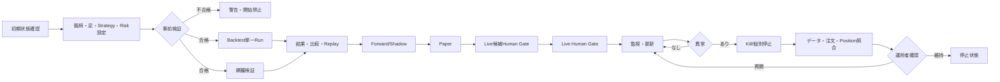

# RQU-UI-05 ユースケース・画面・状態・受入仕様記録

## 0. 文書情報

| 項目 | 内容 |
|---|---|
| 文書ID | `RQUUI-ART-UI05` |
| Step | `RQU-UI-05` |
| Phase | `REQUIREMENTS_UI_UPDATE_2026_08_11` |
| 計画 | `RQU-UI-PLAN-001 v0.1` |
| 作成日 | 2026-08-11 |
| 状態 | `COMPLETED_WITH_OPEN_UNKNOWN`（共通仕様確定、実値・外部接続は後続Gate） |
| 入力 | RQU-UI-01追跡表、本計画§6、RQU-11〜RQU-19A、RQU-UI-03/04記録 |
| 編集範囲 | `plan/requirements_update/` の共通仕様・追跡・受入記録のみ。正式要件HTML、要件Markdown、UI本体は未変更 |
| 使用方針 | 単一運用者・認証不要。ただしHuman Gate、Risk未入力停止、Kill Switch、照合後手動再開を安全境界として扱う |

この記録は、要件本文とUIモックが別々に作られても意味がずれないように、先に「できること」「開始条件」「操作」「結果」「例外・停止・復旧」「保存」「画面」を固定する文書である。既存の要求ID、回答Q、画面候補、E2E候補の詳細な根拠は、`RQU-UI_要件UIテスト追跡マトリクス_2026-08-11.md`を正本とし、本記録はその操作意味を補足する。

## 1. Findings first

| Finding ID | 重大度 | 対象 | 判定 | 対応 |
|---|---|---|---|---|
| `RQU-UI-05-F-001` | High | 全UC・画面・状態 | 67UC、21画面、10状態のID割当は完了。正式要件IDへの昇格は未実施 | RQU-UI-06でcandidate本文へ反映。正式版昇格はRQU-UI-H3後 |
| `RQU-UI-05-F-002` | High | Q-243実行可能性・性能 | 画面上の項目・停止境界は確定したが、実PC負荷、実データ、Broker、Live数値は未実証 | `RQU-19-LATER-*`とQ-243後続Gateに保持。UnknownをPassにしない |
| `RQU-UI-05-F-003` | Medium | Q-277撤回 | Q-277の旧「先にQ-243を閉じる」方針を現在方針へ混入させない必要がある | RQU-19/RQU-19Aを優先し、旧回答は`HISTORY-REVIEW`としてのみ記録 |
| `RQU-UI-05-F-004` | Medium | 同一条件Run・履歴・削除 | 「履歴管理不要」と内部Run保存、非表示、削除、再実行は別概念 | UIでは最新結果、内部保存、通常一覧から隠す、削除、監査記録を別操作にする |
| `RQU-UI-05-F-005` | Medium | M1と取引時間足 | M1は内部入力であり、運用者が選ぶ取引時間足ではない | UIの選択肢はD1/H4/H1/M30/M15。M1は説明欄に限定 |
| `RQU-UI-05-F-006` | Low | UI専用AI部品の初回実行・shadcn registry・chunk警告 | RQU-UI-04からのOpen/UnknownはH2承認で自動解消しない | RQU-UI-07以降で実証し、受入表では未実行をPassにしない |

Critical/Highの新規未解決不整合は検出していない。ただし、上表のHighは後続Stepで証拠を得るまで「閉じた」とみなさない。

## 2. 情報設計の固定値

### 2.1 ナビゲーション10分類

| NAV-ID | 分類 | 目的 | 配下の画面 |
|---|---|---|---|
| `NAV-01` | ホーム | 現在状態、禁止事項、全体警告を見る | `SCREEN-01`,`02`,`17` |
| `NAV-02` | Backtest設定 | 1つの条件でBacktestを設定する | `SCREEN-08` |
| `NAV-03` | 網羅検証設定 | 下限・上限・ステップで組合せ検証を設定する | `SCREEN-09`＋`VIEW-01` |
| `NAV-04` | 結果・比較 | 結果、取引、Signal、複数Runを比較する | `SCREEN-10`,`11`,`12` |
| `NAV-05` | 運用単位 | 銘柄×時間足×売買ルールを作成・同時運用する | `SCREEN-03`,`04` |
| `NAV-06` | 銘柄・データ | Asset Class、初期候補、データ品質を確認する | `SCREEN-05`＋`VIEW-02` |
| `NAV-07` | Risk・注文 | 残高、Risk、注文、約定、Positionを確認する | `SCREEN-15`,`16` |
| `NAV-08` | 運用・昇格 | Forward、Shadow、Paper、Live候補、LiveとGateを見る | `SCREEN-13`,`14`,`18` |
| `NAV-09` | ログ・操作記録 | Run、設定版、操作、承認、証跡を検索する | `SCREEN-19`＋`VIEW-03` |
| `NAV-10` | 設定・接続 | 接続状態、Secretの存在だけ、通知、用語を見る | `SCREEN-20`,`21` |

### 2.2 取引対象の固定表

| 種別 | 今回の表示方針 | 後続Gate |
|---|---|---|
| Asset Class | 先物・株式・FX・暗号資産を選択可能な構造にする | 実シンボル、取引所、契約、提供元は`RQU-19-LATER-03〜05` |
| 初期論理候補 | `MCL`、`M6A`、`MZC`、`MZS`、`MZW`の5件を候補として表示する | 実シンボル・限月・ロール・単位の確認が完了するまで開始不可 |
| 取引時間足 | 日足（D1）、4時間足（H4）、1時間足（H1）、30分足（M30）、15分足（M15） | 実データ期間、本数、欠損は`RQU-19-LATER-01` |
| 内部入力 | M1等の内部データは表示上「内部処理用」とする | 取引対象の選択肢にはしない |
| 売買ルール | Turtle System 1 / System 2を初期表示し、戦略×時間足を自由に組合せる | 原典・現代版・具体値の採用は戦略設計の後続判断 |

### 2.3 運用単位のキーと重複制約

1運用単位は「銘柄 × 時間足 × 売買ルール × 口座 × 運用モード」を持つ独立インスタンスである。銘柄と時間足の組合せが同じ単位は、売買ルールが違っても同時運用不可とする。例えば、`WTI×D1×ルール1`と`WTI×H4×ルール1`は同時運用できるが、`WTI×H4×ルール1`と`WTI×H4×ルール2`は同時運用できない。固定の件数上限は置かず、初期目安3〜5、負荷時は警告・待機・停止へ遷移する。

## 3. 21画面カタログ

各行は、表示項目、入力欄、Button、Dialog、遷移、状態、PC/スマホ差、要求・E2Eの対応を一つの画面契約として定義する。`REQ`の詳細な既存要求領域と回答Qは追跡マトリクスの同一UC行を参照する。

| SCREEN-ID | 画面名／NAV | 表示・入力 | Button／Dialog／遷移 | 正常・異常状態 | PC／スマホ差 | REQ・E2E |
|---|---|---|---|---|---|---|
| `SCREEN-01` | システム状態・禁止事項／`NAV-01` | 起動状態、認証不要、未承認、外部接続禁止、データ時刻 | `状態を更新`、`禁止事項を確認`。詳細Dialog→`02`,`17` | `NORMAL`,`WARNING`,`STOPPED`,`UNAPPROVED`。未承認時は実行Buttonを無効化し理由を表示 | PCは状態カード横並び、スマホは縦積み。禁止事項は常時先頭 | `REQ-CTX/GATE/OPS`、`E2E-UI-001/004/070` |
| `SCREEN-02` | ホーム／全体ダッシュボード／`NAV-01` | 全運用単位、最新データ時刻、Signal、Position、警告、最新Backtest、総残高 | `手動更新`、自動更新Switch、間隔[s]、`Kill Switch`確認Dialog、カード→各詳細 | `NORMAL`,`LOADING`,`EMPTY`,`WARNING`,`STOPPED`,`UNAPPROVED`。Kill後は全停止表示 | PCは一覧表＋KPI、スマホはカード化しKillを画面下固定 | `REQ-OPS/EXE`、`E2E-UI-006/013/026/055/056/074` |
| `SCREEN-03` | 運用単位一覧／`NAV-05` | 単位ID、銘柄、時間足、ルール、モード、状態、最終更新、警告 | `新規作成`→`04`、`一時停止`、`再開`、`終了`、削除確認Dialog、行→`15/16/18` | `NORMAL`,`EMPTY`,`WARNING`,`STOPPED`,`RECOVERY`。重複単位は開始不可理由を行内表示 | PCは表、スマホは1単位カード＋三点メニュー。停止はカード上部 | `REQ-EXE/RISK/GATE`、`E2E-UI-006/026/027/073` |
| `SCREEN-04` | 運用単位作成・編集／`NAV-05` | Asset、銘柄、時間足、Strategy、口座、Risk、モード、承認状態 | `保存`、`事前検証`、`取消`。重複・未入力・未承認Dialog→`03`,`15`,`18` | `REQUIRED`,`WARNING`,`UNAPPROVED`。Risk未入力は全モード開始不可 | PCは2列フォーム、スマホはステップ式。危険確認は全幅Dialog | `REQ-EXE/STR/GATE`、`E2E-UI-025` |
| `SCREEN-05` | 市場データ・品質／`NAV-06` | Asset、5候補、時間足、期間、最終時刻、欠損、重複、時刻逆行、Catalog/Calendar/Roll版 | `取得`、`インポート`、`再取得`、`再処理`、手動更新、自動更新。開始禁止Dialog→`17` | `EMPTY`,`REQUIRED`,`LOADING`,`WARNING`,`FAILED`,`STOPPED`,`UNAPPROVED` | PCは品質列、スマホは品質カードと詳細折畳み。欠損警告を最上位 | `REQ-DATA/QA`、`E2E-UI-003/010〜017` |
| `SCREEN-06` | Strategy一覧／`NAV-05` | System 1/2、版、hash、Long/Short、状態、利用単位数 | `新規`、`複製`、`比較`、`有効化/無効化`、`削除`確認→`07`,`19` | `NORMAL`,`EMPTY`,`WARNING`,`UNAPPROVED`,`STOPPED` | PCは版比較表、スマホはStrategyカード。無効化理由を文字表示 | `REQ-STR/OPS`、`E2E-UI-005/020/022/024` |
| `SCREEN-07` | Strategy設定／`NAV-05` | variant、Entry/Stop/Exit、Long/Short、追加、版名、差分、Risk参照 | `検証`、`保存して新版`、`差分`、`ロールバック`、`取消`。稼働中変更確認Dialog→`18/19` | `NORMAL`,`REQUIRED`,`WARNING`,`FAILED`,`HUMAN-GATE` | PCは設定と差分を左右比較、スマホはTabs。保存は新版作成のみ | `REQ-STR/QA/OPS`、`E2E-UI-021〜024/028/082/085` |
| `SCREEN-08` | Backtest条件設定／`NAV-02` | 単一Run/網羅検証Tabs、銘柄、時間足、Strategy、期間、Risk、コスト、設定ファイル | `設定ファイル読込`、`事前検証`、`開始`、`取消`。Risk未入力・品質不合格Dialog→`09` | `NORMAL`,`REQUIRED`,`WARNING`,`FAILED`,`UNAPPROVED` | PCは条件と検証結果を2列、スマホはTab。開始Buttonは条件未充足時disabled＋理由 | `REQ-BT/DATA/RISK`、`E2E-UI-030〜032/039` |
| `SCREEN-09` | Backtest実行一覧・進捗／`NAV-03` | Run ID、単一/網羅、待ち行列、進捗、経過、残り見積、成功/一部失敗/失敗 | `停止`、`取消`、`再実行`、`結果`、`CSV出力`。停止・再実行確認Dialog→`10/12/19` | `LOADING`,`NORMAL`,`WARNING`,`STOPPED`,`FAILED`,`RECOVERY` | PCは進捗表、スマホはRunカード。重要操作はカード内確認 | `REQ-BT/OPS`、`E2E-UI-033〜035/040` |
| `SCREEN-10` | Backtest結果サマリー／`NAV-04` | 5指標（総損益、最大の落ち込み、取引回数、勝率、総残高）、対象、期間、設定版 | `チャート`→`11`、`比較`→`12`、`再Run`、`CSV出力`、`非表示`、削除確認→`19` | `NORMAL`,`EMPTY`,`LOADING`,`FAILED`,`UNAPPROVED` | PCはKPIと表、スマホはKPI横スクロール＋詳細 | `REQ-BT/QA/OPS`、`E2E-UI-036〜041/084/086` |
| `SCREEN-11` | チャート・取引・Signal詳細／`NAV-04` | 資産曲線、取引、Signal、想定/実績差分、銘柄・時間足・Strategy絞込 | `フィルタ`、`取引詳細`、`Signal詳細`、`戻る`。差分警告Dialog→`16/17` | `NORMAL`,`EMPTY`,`WARNING`,`UNAPPROVED`,`STOPPED` | PCはチャート＋表、スマホはチャート縦積み＋詳細Drawer | `REQ-BT/STR/RISK`、`E2E-UI-036/037/057/059/066` |
| `SCREEN-12` | Run比較／`NAV-04` | 複数Runの5指標、条件差、設定hash、未承認表示 | `比較対象追加`、`並替`、`レポート`、`再Run`。最良自動選択はしない | `NORMAL`,`EMPTY`,`UNAPPROVED`。データなしは比較開始不可理由 | PCは比較表、スマホは比較カードを横スワイプ | `REQ-BT/QA`、`E2E-UI-038/041/084` |
| `SCREEN-13` | Forward／Shadowダッシュボード／`NAV-08` | モード、単位、最新データ、Heartbeat、次回判断、仮想Signal、停止理由 | `開始`、`停止`、`再開`、`照合`。Human Gate Dialog→`18` | `REQUIRED`,`NORMAL`,`STOPPED`,`RECOVERY`,`HUMAN-GATE`,`UNAPPROVED` | PCはモード別列、スマホは単位カード。停止・Gateを上部固定 | `REQ-EXE/GATE/OPS`、`E2E-UI-050/051/055/056` |
| `SCREEN-14` | Paper／Liveダッシュボード／`NAV-08` | Paper/Live候補/Live、注文種別、接続状態、承認状態、現在状態 | `開始`、`停止`、`再開`、`自動承認Switch`、`Live移行`。実注文を送らない確認Dialog | `REQUIRED`,`NORMAL`,`WARNING`,`STOPPED`,`HUMAN-GATE`,`UNAPPROVED`。Live自動承認は再起動後OFF | PCはモード列、スマホは安全状態を最上位。Live操作は二段確認 | `REQ-EXE/GATE`、`E2E-UI-004/052〜055/057` |
| `SCREEN-15` | Portfolio・Account・Risk／`NAV-07` | 総残高、残高、証拠金、余力、1N、最大DD、損失上限、単位別配分 | `Risk設定`、`更新`、`注文判定`。Risk未入力Dialog→`04/16/18` | `NORMAL`,`EMPTY`,`REQUIRED`,`WARNING`,`UNAPPROVED`,`STOPPED` | PCはKPI＋表、スマホはRiskを最上位カード。値の範囲検査なしを明記 | `REQ-RISK/EXE`、`E2E-UI-060〜065/077` |
| `SCREEN-16` | 注文・約定・Position／`NAV-07` | 仮想/模擬/実注文区分、注文、約定、部分約定、拒否、取消、Position | `確認`、`取消`、`訂正`、`照合`。確認/取消モードと自動承認モードを選ぶDialog→`18` | `NORMAL`,`WARNING`,`FAILED`,`STOPPED`,`RECOVERY`,`HUMAN-GATE` | PCは注文表、スマホは注文カード＋取消を固定。実Broker値は未承認表示 | `REQ-EXE/RISK/GATE`、`E2E-UI-057〜059/064/065/077` |
| `SCREEN-17` | 警告・障害・通知／`NAV-01` | 重要度、対象、発生時刻、影響、再試行回数、次操作、対応済み | `対応済み`、`再試行`、`停止`、`復旧照合`。全体停止Dialog→`18` | `WARNING`,`FAILED`,`STOPPED`,`RECOVERY`,`NORMAL` | PCは時系列表、スマホは重要度順カード。色以外に文字・アイコンを付ける | `REQ-OPS/DATA/GATE`、`E2E-UI-015/016/035/071〜077` |
| `SCREEN-18` | Human Gate・移行確認／`NAV-08` | 対象モード、確認項目、Risk、データ品質、接続、Kill状態、端末、時刻 | `確認して進む`、`取消`、`Live自動承認ON/OFF`、`Kill解除`。全操作に確認Dialog・記録 | `HUMAN-GATE`,`UNAPPROVED`,`WARNING`,`STOPPED`,`RECOVERY`,`NORMAL` | PCは確認項目と結果を左右、スマホは一問一画面。認証画面は作らない | `REQ-GATE/RISK/OPS`、`E2E-UI-027/050〜054/064/074〜077/083/085` |
| `SCREEN-19` | 監査ログ・証跡／`NAV-09` | 設定版、Run、hash、操作、承認、停止、削除、保存先、出力状態 | `検索`、`詳細`、`CSV出力`、`非表示`、`削除`確認。削除は記録後に実行 | `NORMAL`,`EMPTY`,`WARNING`,`HUMAN-GATE` | PCは絞込表、スマホはイベントカード。重要操作は全項目表示 | `REQ-OPS/QA/GATE`、`E2E-UI-017/022/028/040/080〜086` |
| `SCREEN-20` | 接続先・Secret・通知設定／`NAV-10` | Provider/Broker/Cloud名、接続状態、Secretは存在/未設定だけ、通知、自動更新間隔 | `保存`、`接続確認`、`Secret設定`、`通知テスト`。外部接続禁止・未承認Dialog→`01/05/17` | `EMPTY`,`REQUIRED`,`WARNING`,`UNAPPROVED`,`NORMAL` | PCは設定表、スマホはセクション縦積み。Secret値は表示しない | `REQ-DATA/EXE/OPS`、`E2E-UI-002〜004/012/013` |
| `SCREEN-21` | ヘルプ・用語説明／`NAV-10` | 5時間足、Asset、Strategy、Run、Human Gate、未承認、Riskの平易な説明 | `検索`、`関連画面へ`。用語→該当SCREENへ遷移 | `NORMAL`,`EMPTY`。用語なしは検索結果なし理由 | PCは目次＋本文、スマホは折畳み目次。専門用語に説明を必須化 | `REQ-CTX/OPS`、`E2E-UI-002/005/021` |

### 3.1 画面×状態の判定

次表は全210セルを判定する。`○`は画面で意味のある状態として確認し、`N/A(理由)`はその画面では発生させない理由を固定したもの。理由のない空欄は存在しない。

| SCREEN-ID | NORMAL | LOADING | EMPTY | REQUIRED | WARNING | STOPPED | FAILED | RECOVERY | HUMAN-GATE | UNAPPROVED |
|---|---|---|---|---|---|---|---|---|---|---|
| `SCREEN-01` | ○ | N/A(静的状態) | N/A(一覧なし) | N/A(入力画面でない) | ○ | ○ | N/A(障害詳細は17) | N/A(復旧操作は18) | N/A(Gate操作は18) | ○ |
| `SCREEN-02` | ○ | ○ | ○ | N/A(入力は04/08) | ○ | ○ | N/A(障害詳細は17) | ○ | N/A(Gate詳細は18) | ○ |
| `SCREEN-03` | ○ | N/A(一覧取得を更新扱い) | ○ | N/A(作成画面は04) | ○ | ○ | N/A(障害詳細は17) | ○ | N/A(移行確認は18) | N/A(未承認は行バッジのみ) |
| `SCREEN-04` | N/A(保存前後で03) | N/A(検証中はButton進捗) | N/A(入力フォーム) | ○ | ○ | N/A(停止操作は03/17) | ○ | N/A(復旧は18) | ○ | ○ |
| `SCREEN-05` | ○ | ○ | ○ | ○ | ○ | ○ | ○ | N/A(復旧は17/18) | N/A(Gateは18) | ○ |
| `SCREEN-06` | ○ | N/A(一覧更新扱い) | ○ | N/A(設定は07) | ○ | ○ | N/A(検証失敗は07) | N/A(ロールバックは07) | N/A(Gateは18) | ○ |
| `SCREEN-07` | ○ | N/A(保存処理中表示) | N/A(設定フォーム) | ○ | ○ | N/A(停止は03/17) | ○ | ○ | ○ | N/A(未承認は18へ誘導) |
| `SCREEN-08` | ○ | N/A(開始後は09) | N/A(入力フォーム) | ○ | ○ | N/A(停止は09) | ○ | N/A(復旧は09/18) | N/A(Gateは18) | ○ |
| `SCREEN-09` | ○ | ○ | ○ | N/A(入力は08) | ○ | ○ | ○ | ○ | N/A(Gateは18) | N/A(未承認は08/18) |
| `SCREEN-10` | ○ | ○ | ○ | N/A(結果画面) | N/A(結果警告は17) | N/A(停止理由は09) | ○ | N/A(復旧は09) | N/A(Gateは18) | ○ |
| `SCREEN-11` | ○ | N/A(詳細読込は10扱い) | ○ | N/A(入力はフィルタ任意) | ○ | ○ | N/A(失敗理由は17) | N/A(復旧は18) | N/A(Gateは18) | ○ |
| `SCREEN-12` | ○ | N/A(比較読込は表内) | ○ | N/A(比較条件は選択) | N/A(警告は17) | N/A(停止は09) | N/A(出力失敗は17) | N/A(復旧は18) | N/A(Gateは18) | ○ |
| `SCREEN-13` | ○ | ○ | ○ | ○ | ○ | ○ | ○ | ○ | ○ | ○ |
| `SCREEN-14` | ○ | ○ | ○ | ○ | ○ | ○ | ○ | ○ | ○ | ○ |
| `SCREEN-15` | ○ | ○ | ○ | ○ | ○ | ○ | ○ | ○ | N/A(Gate操作は18) | ○ |
| `SCREEN-16` | ○ | ○ | ○ | N/A(注文入力は確認Dialog) | ○ | ○ | ○ | ○ | ○ | ○ |
| `SCREEN-17` | ○ | ○ | ○ | N/A(入力は各原因画面) | ○ | ○ | ○ | ○ | N/A(Gate操作は18) | N/A(未承認は原因画面) |
| `SCREEN-18` | ○ | N/A(確認は同期Dialog) | N/A(項目なしは対象なし) | N/A(未確認はUNAPPROVED) | ○ | ○ | N/A(失敗詳細は17) | ○ | ○ | ○ |
| `SCREEN-19` | ○ | ○ | ○ | N/A(検索条件は任意) | ○ | N/A(停止は17/18) | ○ | N/A(復旧は18) | ○ | ○ |
| `SCREEN-20` | ○ | ○ | ○ | ○ | ○ | N/A(停止は17) | ○ | N/A(復旧は18) | N/A(Gateは18) | ○ |
| `SCREEN-21` | ○ | N/A(静的説明) | ○ | N/A(入力必須なし) | N/A(警告は各機能) | N/A(停止は17) | N/A(障害詳細は17) | N/A(復旧は18) | N/A(Gate説明はリンク) | N/A(未承認説明は01/18) |

## 4. 共通UI状態仕様

| UISTATE-ID | 意味 | 画面表示 | 操作可能 | 次の状態・復旧 | 保存・証拠 |
|---|---|---|---|---|---|
| `UISTATE-NORMAL` | 通常 | 状態名、最終更新、対象、次の操作を文字で表示 | 通常操作、更新、詳細、設定 | 操作結果に応じて各状態へ | 操作・更新時刻 |
| `UISTATE-LOADING` | 読込中／処理中 | 進捗、開始時刻、経過、残り見積、取消可否 | 取消、画面移動、更新は制御 | 完了→NORMAL、失敗→FAILED、停止→STOPPED | Run/処理ID、進捗 |
| `UISTATE-EMPTY` | データなし | 件数0、理由、作成・取得への導線 | 作成、取得、条件変更 | 入力→REQUIRED、取得→LOADING | 空理由、検索条件 |
| `UISTATE-REQUIRED` | 必須不足 | 未入力欄、開始不可理由、入力例 | 入力、保存前検証、取消 | 入力完了→NORMAL、取消→元画面 | 未入力項目、時刻 |
| `UISTATE-WARNING` | 注意／制限 | 影響、危険度、対象、推奨対応、色以外の文字・アイコン | 詳細、確認、停止、取消 | 確認→NORMAL、停止→STOPPED | 警告ID、確認者、時刻 |
| `UISTATE-STOPPED` | 停止済み | 停止理由、影響、未実行操作、再開条件 | 照合、復旧確認、手動再開（条件充足時） | 照合→RECOVERY、手動再開→NORMAL | 停止理由、停止者、時刻 |
| `UISTATE-FAILED` | 失敗 | 失敗理由、対象、再試行可否、証跡 | 再試行、取消、詳細、停止 | 再試行→LOADING、停止→STOPPED | エラーID、原因、ログ |
| `UISTATE-RECOVERY` | 復旧確認中 | Snapshot、データ・注文・Positionの照合進捗 | 照合、詳細、停止。自動再開不可 | 照合完了→HUMAN-GATE/NORMAL、差異→STOPPED | 照合結果、差異、時刻 |
| `UISTATE-HUMAN-GATE` | 運用者確認待ち | 確認項目、対象、Risk、実行範囲、取消 | 確認して進む、取消。認証入力はない | 確認→NORMAL/次モード、取消→UNAPPROVED | Gate ID、対象、端末、時刻、確認内容 |
| `UISTATE-UNAPPROVED` | 未承認／未実証 | 未承認項目、開始禁止、必要な証拠、次Gate | 詳細、設定、Gate確認への導線。実行不可 | 証拠登録→HUMAN-GATE、取消→同状態 | 未承認理由、Gate ID、時刻 |

## 5. ユースケース操作契約（67件）

`REQ`と回答Qの根拠は追跡マトリクスにある。ここでは各UCについて、開始前に何を確認し、どのように操作し、何を保存するかを定義する。各行の`UC-DETAIL-*`はRQU-UI-06本文とRQU-UI-11 E2E旅程の参照IDである。

| UC-ID / Detail-ID | 目的・開始条件・事前確認 | 操作手順→期待結果 | 例外・取消・停止・復旧 | 保存・画面・状態・E2E |
|---|---|---|---|---|
| `ADD-UC-001` / `UC-DETAIL-001` | 起動時に運用者が現在状態を確認。認証なしで開けること、禁止事項と未承認項目を読む | `01`を開き状態・禁止事項を確認→`02`または警告詳細へ進む | 状態取得失敗は`17`へ。未承認なら実行へ進めず取消可能 | 表示確認を保存。`01,02,17`／`NORMAL,WARNING,STOPPED,UNAPPROVED`／`E2E-UI-001` |
| `ADD-UC-002` / `UC-DETAIL-002` | 初回または設定変更時。未入力項目・現在版・自動更新設定を確認 | `20`で値を入力→検証→保存→更新時刻表示 | 必須不足は保存不可。外部値は未承認のまま停止 | 設定版・操作記録。`20,21`／`NORMAL,REQUIRED,WARNING`／`E2E-UI-002` |
| `ADD-UC-003` / `UC-DETAIL-003` | データ提供元を設定する前に対象Asset・Secret未設定を確認 | `20`で提供元名と接続状態（値でなく状態）を設定→`05`で確認 | 契約・Secretが未承認なら取得開始不可。取消は変更を破棄 | 提供元設定と未承認理由。`05,20`／`EMPTY,REQUIRED,WARNING,UNAPPROVED`／`E2E-UI-003` |
| `ADD-UC-004` / `UC-DETAIL-004` | Broker、Paper、通知、Cloudの状態を接続せず確認 | `01/14/20`で各状態カードを読む→未接続の理由を開く | 実接続Buttonはモックでは送信しない。未承認は状態表示のみ | 状態スナップショット。`01,14,20`／`NORMAL,EMPTY,WARNING,UNAPPROVED`／`E2E-UI-004` |
| `ADD-UC-005` / `UC-DETAIL-005` | Strategy一覧・設定版を選ぶ前に版と有効状態を確認 | `06`でSystem 1/2を選択→`07`で詳細を見る | 空一覧は作成へ。未承認版は運用単位に割当不可 | 版・hash・閲覧記録。`06,07`／`NORMAL,EMPTY,UNAPPROVED`／`E2E-UI-005` |
| `ADD-UC-006` / `UC-DETAIL-006` | 全運用単位を一覧で確認。重複・停止・更新遅延を確認 | `03`または`02`で一覧を開き、単位を絞込→詳細へ | 一覧取得失敗は`17`。空なら作成導線を表示 | 一覧条件・最終更新。`02,03`／`NORMAL,EMPTY,WARNING,STOPPED`／`E2E-UI-006` |
| `ADD-UC-010` / `UC-DETAIL-010` | Asset Classと5初期候補を登録・選択。論理候補と実シンボルを区別 | `05`でAsset→候補→市場を選択→対応/未確認バッジを確認 | 実シンボル未確認・候補不一致は保存はできても開始不可 | 候補・状態・選択時刻。`05,VIEW-02`／`EMPTY,REQUIRED,UNAPPROVED,WARNING`／`E2E-UI-010` |
| `ADD-UC-011` / `UC-DETAIL-011` | D1/H4/H1/M30/M15と期間を指定 | `05/08`で時間足と期間を入力→事前検証 | M1は選択不可（内部専用）。期間未確定は開始不可 | 条件版。`05,08`／`NORMAL,REQUIRED,WARNING,UNAPPROVED`／`E2E-UI-011` |
| `ADD-UC-012` / `UC-DETAIL-012` | 承認済み範囲でデータ取得・インポートを開始 | `05`で取得元・候補・足を確認→取得/インポート→進捗 | 外部取得未承認、通信失敗、停止要求は`FAILED/STOPPED`。取消は途中結果を未完了保存 | Job、進捗、結果。`05,20`／`NORMAL,LOADING,FAILED,STOPPED,UNAPPROVED`／`E2E-UI-012` |
| `ADD-UC-013` / `UC-DETAIL-013` | 更新状況と最終更新を確認 | `02/05`で手動更新または自動更新Switch・間隔[s]を設定→時刻を確認 | 更新失敗は警告、再試行回数を表示。自動更新OFFでも手動可能 | 更新設定・時刻。`02,05`／`NORMAL,LOADING,EMPTY,WARNING`／`E2E-UI-013` |
| `ADD-UC-014` / `UC-DETAIL-014` | データ品質検査の合否と開始可否を確認 | `05`で品質欄を開き、検証済み/未検証を確認→Backtestへ | 未検証は開始不可。再検査・取消・停止を表示 | 品質結果・hash。`05,08`／`NORMAL,WARNING,STOPPED,UNAPPROVED`／`E2E-UI-014` |
| `ADD-UC-015` / `UC-DETAIL-015` | 欠損・重複・時刻逆行を発見 | `05`で品質詳細→該当行→影響を確認 | 不正時はSignal・新規注文を停止。再取得または停止、復旧は照合後 | 異常行・停止理由。`05,17`／`WARNING,STOPPED,FAILED`／`E2E-UI-015` |
| `ADD-UC-016` / `UC-DETAIL-016` | データ再取得・再処理を実行 | `05`で対象を選択→再取得/再処理→進捗→品質再確認 | 費用・実データ未承認は開始不可。取消は未完了として残す | Job・品質再判定。`05,17`／`NORMAL,LOADING,FAILED,STOPPED`／`E2E-UI-016` |
| `ADD-UC-017` / `UC-DETAIL-017` | Catalog、Calendar、Roll、version、hash、provenanceを確認 | `05/19`で各証跡を開き、未確定項目を確認 | Calendar/Roll未確定は警告・開始不可。外部更新は後続Gate | 証跡リンク・未承認理由。`05,19`／`NORMAL,WARNING,STOPPED,UNAPPROVED`／`E2E-UI-017` |
| `ADD-UC-020` / `UC-DETAIL-020` | Strategyを作成 | `06`→新規→System 1/2選択→`07`へ→保存して新版 | 未入力は保存不可。取消は下書きを破棄 | Strategy ID・版。`06,07`／`NORMAL,EMPTY,REQUIRED`／`E2E-UI-020` |
| `ADD-UC-021` / `UC-DETAIL-021` | Turtle variant、Long/Short、Stop/Exit、追加条件を設定 | `07`で項目入力→プレビュー→検証→新版保存 | 具体値未承認は構造のみ保存。入力取消・検証失敗を表示 | 設定値・差分・hash。`07`／`NORMAL,REQUIRED,WARNING`／`E2E-UI-021` |
| `ADD-UC-022` / `UC-DETAIL-022` | Strategyを複製・比較・版管理 | `06`で対象選択→複製/比較→`07/19`で版と差分確認 | 削除は確認Dialog。稼働中版は直接削除不可 | 版・hash・操作記録。`06,07,VIEW-03`／`NORMAL,EMPTY,WARNING`／`E2E-UI-022` |
| `ADD-UC-023` / `UC-DETAIL-023` | Strategy設定の入力を検証 | `07`で検証→未入力・型違いを確認→通過ならBacktestへ | 未入力・型違い・範囲外は開始不可。Riskは未入力のみ停止し値検査しない | 検証結果・項目。`07,08`／`NORMAL,REQUIRED,WARNING,FAILED`／`E2E-UI-023` |
| `ADD-UC-024` / `UC-DETAIL-024` | Strategyを有効化・無効化 | `06`で切替→影響単位・確認Dialog→保存 | 稼働中設定の直接変更は禁止。無効化後は新規開始不可 | 切替者・時刻・理由。`06,07`／`NORMAL,WARNING,STOPPED,UNAPPROVED`／`E2E-UI-024` |
| `ADD-UC-025` / `UC-DETAIL-025` | 銘柄×足×Strategy×口座×モードを単位へ割当 | `04`で項目選択→重複・Risk・承認を事前検証→保存 | 重複、実シンボル未確認、Risk未入力は開始不可。取消可能 | 単位定義・検証結果。`04`／`REQUIRED,WARNING,UNAPPROVED`／`E2E-UI-025` |
| `ADD-UC-026` / `UC-DETAIL-026` | 複数単位を同時開始 | `03`で複数選択→負荷目安・重複・承認を確認→開始 | 固定上限なし。ただし負荷警告は待機/停止。部分失敗は単位ごとに残す | 一括操作・各単位結果。`02,03,04`／`NORMAL,WARNING,STOPPED,REQUIRED`／`E2E-UI-026` |
| `ADD-UC-027` / `UC-DETAIL-027` | 単位を一時停止・再開・終了 | `03`で対象→確認Dialog→停止/再開/終了 | 停止後は照合完了まで再開不可。取消は元状態に戻す | 停止理由・照合・再開者。`03,17,18`／`NORMAL,STOPPED,RECOVERY,HUMAN-GATE`／`E2E-UI-027` |
| `ADD-UC-028` / `UC-DETAIL-028` | 設定差分を確認 | `07/19`で旧版と新版を選択→差分を読む | 差分なし・版欠落は理由表示。保存は新版操作へ戻す | 差分・hash。`07,19`／`NORMAL,EMPTY,WARNING`／`E2E-UI-028` |
| `ADD-UC-030` / `UC-DETAIL-030` | Backtest条件を入力 | `08`で単一Runまたは網羅検証Tabを選択→条件入力 | 必須不足は開始不可。設定ファイル読込エラーは入力へ戻る | 条件セット・版。`08`／`NORMAL,REQUIRED,WARNING`／`E2E-UI-030` |
| `ADD-UC-031` / `UC-DETAIL-031` | 入力・Manifest・データ品質を事前検証 | `08`で検証→項目ごとの結果を確認 | 不整合は開始不可。取消は条件を保持して戻る | 検証結果・Manifest hash。`08,17`／`NORMAL,REQUIRED,WARNING,FAILED,STOPPED`／`E2E-UI-031` |
| `ADD-UC-032` / `UC-DETAIL-032` | Backtestを開始 | `08`で検証済み・Risk入力済み・候補承認状態を確認→開始確認→`09` | 条件不備・実シンボル未確認・Risk未入力は開始不可 | Run ID・開始条件。`08,09`／`REQUIRED,WARNING,LOADING`／`E2E-UI-032` |
| `ADD-UC-033` / `UC-DETAIL-033` | Queue、進捗、実行状態を確認 | `09`でRunを選択→進捗・待機理由・資源警告を確認 | 実時間運用を優先しBacktestは待機。停止/取消を選べる | Queue・進捗時刻。`09,02`／`LOADING,NORMAL,WARNING,STOPPED`／`E2E-UI-033` |
| `ADD-UC-034` / `UC-DETAIL-034` | Backtestを取消・停止・同一条件再実行 | `09`で対象→停止または取消Dialog→必要なら再実行 | 取消と停止を別記録。同一条件Runは許可し最新表示を更新 | Run履歴・操作理由。`09,VIEW-03`／`LOADING,STOPPED,FAILED,RECOVERY`／`E2E-UI-034` |
| `ADD-UC-035` / `UC-DETAIL-035` | 完了・停止・失敗理由を確認 | `09/10/17`でRun状態→理由→次操作を確認 | 理由不明は受入不合格。停止後は復旧または再Runへ | 状態遷移・エラー。`09,10,17`／`NORMAL,STOPPED,FAILED,WARNING`／`E2E-UI-035` |
| `ADD-UC-036` / `UC-DETAIL-036` | 単一Runの5指標・取引・Signalを確認 | `10`で結果→5指標→`11`で詳細 | 結果なしは空状態。未承認データ結果は未承認表示 | 結果・Manifest。`10,11`／`NORMAL,EMPTY,UNAPPROVED`／`E2E-UI-036` |
| `ADD-UC-037` / `UC-DETAIL-037` | 銘柄・足・Strategy別に絞込 | `10/11`で3条件を選択→表・チャートが連動 | 該当なしは空状態。絞込条件を戻して解除 | 絞込条件・表示時刻。`10,11`／`NORMAL,EMPTY`／`E2E-UI-037` |
| `ADD-UC-038` / `UC-DETAIL-038` | 複数Runを比較 | `12`でRunを追加→5指標・条件差を比較 | 自動で最良を選ばない。未承認Runは明示表示 | 比較対象・出力記録。`12,VIEW-03`／`NORMAL,EMPTY,UNAPPROVED`／`E2E-UI-038` |
| `ADD-UC-039` / `UC-DETAIL-039` | Holdout、Walk-forward、感度分析を実行 | `08`で分析方式→分割・パラメータ条件→検証→`09/10` | 条件不足・データ不足は開始不可/失敗。実データ値は後続Gate | 分析条件・結果。`08,09,10`／`REQUIRED,LOADING,FAILED,UNAPPROVED`／`E2E-UI-039` |
| `ADD-UC-040` / `UC-DETAIL-040` | Result、Manifest、hash、ログを保存・出力 | `10/19`で保存内容確認→CSV出力→進捗→完了 | 全件出力は非同期。失敗は再試行・取消、外部送信なし | ファイルID・hash・出力状態。`10,19,VIEW-03`／`NORMAL,LOADING,FAILED`／`E2E-UI-040` |
| `ADD-UC-041` / `UC-DETAIL-041` | 同一条件Replayで一致を確認 | `10/12`で条件hash一致を確認→再Run→指標比較 | 同一条件Runは許可。差異時はFAILED/警告とし自動上書きしない | 両Run・比較・差異。`10,12,VIEW-03`／`NORMAL,FAILED,UNAPPROVED`／`E2E-UI-041` |
| `ADD-UC-050` / `UC-DETAIL-050` | Forward Testを開始 | `13/18`で対象単位、データ品質、Gate項目を確認→確認して開始 | 外部データ・実運用未承認は開始不可。取消はGate記録 | Gate・開始条件・状態。`13,18`／`REQUIRED,HUMAN-GATE,UNAPPROVED`／`E2E-UI-050` |
| `ADD-UC-051` / `UC-DETAIL-051` | Shadowを開始・停止・再開 | `13`で開始→Signalのみ確認→停止→照合→手動再開 | 停止後自動再開なし。差異はSTOPPED | 状態・照合・操作者。`13,17,18`／`NORMAL,STOPPED,RECOVERY,HUMAN-GATE`／`E2E-UI-051` |
| `ADD-UC-052` / `UC-DETAIL-052` | Paperを開始・停止・再開 | `14/18`でPaper承認・模擬注文条件を確認→開始 | 模擬注文でも外部接続なし。停止後照合・手動再開 | Paper状態・注文記録。`14,18`／`REQUIRED,NORMAL,STOPPED,HUMAN-GATE,UNAPPROVED`／`E2E-UI-052` |
| `ADD-UC-053` / `UC-DETAIL-053` | 少額Live移行条件を確認 | `18`で実データ、Risk、実機、接続、停止・照合の確認項目を読む | 具体値未確定はGate待ち。確認取消で実行不可を維持 | Gate記録・未確定項目。`18,14`／`HUMAN-GATE,UNAPPROVED,WARNING`／`E2E-UI-053` |
| `ADD-UC-054` / `UC-DETAIL-054` | 本番Live移行条件を確認 | `18/14`で条件・自動承認・Kill Switchを確認 | 未承認のLive開始は不可。実注文送信はモックでもしない | Gate・安全確認。`18,14`／`HUMAN-GATE,UNAPPROVED,WARNING,STOPPED`／`E2E-UI-054` |
| `ADD-UC-055` / `UC-DETAIL-055` | 稼働中全インスタンスの現在状態を確認 | `02/13/14`で全単位の時刻・Signal・Position・警告を確認 | 更新失敗はLOADING/警告。停止単位は理由と再開条件を表示 | スナップショット・更新時刻。`02,13,14`／`NORMAL,LOADING,WARNING,STOPPED,UNAPPROVED`／`E2E-UI-055` |
| `ADD-UC-056` / `UC-DETAIL-056` | 最新データ、Heartbeat、次回判断時刻を確認 | `02/13/14`で時刻を確認→手動更新または自動更新設定 | 再試行は10/30/60秒後に停止。復旧は照合へ | Heartbeat・再試行履歴。`02,13,14,17`／`NORMAL,WARNING,STOPPED,RECOVERY`／`E2E-UI-056` |
| `ADD-UC-057` / `UC-DETAIL-057` | Signal、仮想注文、実注文を区別 | `11/16/14`で区分Badgeと詳細を確認 | 実注文は未承認/停止表示。区分不明は受入不合格 | Signal・注文区分・時刻。`11,16,14`／`NORMAL,WARNING,UNAPPROVED,STOPPED`／`E2E-UI-057` |
| `ADD-UC-058` / `UC-DETAIL-058` | 約定・部分約定・拒否・取消を確認 | `16`で注文を選択→結果・残数量・理由を確認 | 不整合はFAILED/STOPPED。取消は確認Dialog | 注文状態・Broker照合待ち。`16,17`／`NORMAL,WARNING,FAILED,STOPPED,RECOVERY`／`E2E-UI-058` |
| `ADD-UC-059` / `UC-DETAIL-059` | Strategy想定と実績の差分を確認 | `11/16/19`で想定・実績・差分理由を比較 | 差分を隠さず警告。未承認実績はUNAPPROVED | 差分・証跡・操作記録。`11,16,19`／`NORMAL,WARNING,RECOVERY,UNAPPROVED`／`E2E-UI-059` |
| `ADD-UC-060` / `UC-DETAIL-060` | 残高・証拠金・余力を確認 | `15`で総残高を含むKPI・時刻を確認 | 実口座値未承認ならダミー/未承認表示。空はEMPTY | スナップショット・データ源。`15`／`NORMAL,EMPTY,WARNING,UNAPPROVED`／`E2E-UI-060` |
| `ADD-UC-061` / `UC-DETAIL-061` | 全体・銘柄別・Strategy別Positionを確認 | `15/16/02`でフィルタ→Position・足・Strategyを表示 | 差異・更新遅延はWARNING/RECOVERY | Position表示・時刻。`15,16,02`／`NORMAL,EMPTY,WARNING,RECOVERY`／`E2E-UI-061` |
| `ADD-UC-062` / `UC-DETAIL-062` | 1N Risk、最大DD、損失上限を確認 | `15`で項目と設定状態を確認→未入力を修正 | 具体値未確定は未承認。Risk未入力は開始不可、範囲検査はしない | Risk項目・未入力理由。`15`／`NORMAL,REQUIRED,WARNING,UNAPPROVED`／`E2E-UI-062` |
| `ADD-UC-063` / `UC-DETAIL-063` | 新規注文のRisk判定を確認 | `15/16`で対象単位・Risk入力・Positionを確認→判定表示 | Risk未入力は新規注文不可。不整合はSTOPPED | 判定理由・Risk値・時刻。`15,16,17`／`NORMAL,WARNING,STOPPED,REQUIRED`／`E2E-UI-063` |
| `ADD-UC-064` / `UC-DETAIL-064` | 注文を確認・取消・訂正 | `16`で確認/取消モードを選択→Dialog→操作 | 自動承認モードでもLive自動承認の条件を表示。取消失敗はRECOVERY | 注文操作・承認モード・時刻。`16,17,18`／`NORMAL,WARNING,STOPPED,RECOVERY,HUMAN-GATE`／`E2E-UI-064` |
| `ADD-UC-065` / `UC-DETAIL-065` | Broker口座と内部状態を照合 | `15/16/18`で照合対象・時刻を確認→照合 | 実Broker未承認は未承認表示。差異はSTOPPED、手動再開不可 | 照合結果・差異・Gate。`15,16,17,18`／`NORMAL,WARNING,RECOVERY,STOPPED,UNAPPROVED`／`E2E-UI-065` |
| `ADD-UC-066` / `UC-DETAIL-066` | 反対Signal、重複注文、Position競合を処理 | `11/16`で競合理由→Exit優先・次確定足Entryの方針を確認 | 競合時は新規注文停止。取消・照合・手動判断へ | 競合ID・判断・停止記録。`11,16,17`／`WARNING,STOPPED,RECOVERY,HUMAN-GATE`／`E2E-UI-066` |
| `ADD-UC-070` / `UC-DETAIL-070` | 全体稼働状況を確認 | `02/01`で全単位、モード、警告、最新時刻を読む | 取得不能はLOADING/警告。全体停止はKill確認へ | 全体Snapshot。`02,01`／`NORMAL,LOADING,WARNING,STOPPED`／`E2E-UI-070` |
| `ADD-UC-071` / `UC-DETAIL-071` | データ遅延・接続断・Heartbeat異常を確認 | `17/02/05`で異常→影響範囲→再試行状況を確認 | 10/30/60秒後に停止。復旧後は照合へ、自動再開不可 | 警告・再試行・停止。`17,02,05`／`WARNING,STOPPED,FAILED,RECOVERY`／`E2E-UI-071` |
| `ADD-UC-072` / `UC-DETAIL-072` | 通知を確認し対応済みにする | `17`で通知詳細→対応済み→`19`に記録 | 外部Push未承認でも画面内通知は確認可能。誤対応は記録訂正へ | 通知ID・対応者・時刻。`17,19`／`NORMAL,WARNING,STOPPED`／`E2E-UI-072` |
| `ADD-UC-073` / `UC-DETAIL-073` | 個別単位を停止 | `03/17`で対象→影響・注文状態→停止確認 | 停止理由必須。再開は照合とHuman Gate後 | 停止理由・対象・確認。`03,17`／`NORMAL,WARNING,STOPPED`／`E2E-UI-073` |
| `ADD-UC-074` / `UC-DETAIL-074` | 全体Kill Switchを実行 | `02/17/18`で影響範囲→二段確認→全体停止 | 取消可能なのは確認前のみ。解除は照合・運用者確認まで不可 | Kill ID・範囲・時刻。`02,17,18`／`WARNING,STOPPED,HUMAN-GATE`／`E2E-UI-074` |
| `ADD-UC-075` / `UC-DETAIL-075` | 停止理由・再開条件を確認 | `17/18`で理由、影響、未実行、条件を読む | 条件未充足はSTOPPED維持。理由不明は受入不合格 | 停止・条件・表示時刻。`17,18`／`STOPPED,RECOVERY,HUMAN-GATE`／`E2E-UI-075` |
| `ADD-UC-076` / `UC-DETAIL-076` | 再起動後Snapshotから復旧 | `17/18/19`でSnapshot版・対象を確認→復旧確認 | 再起動直後は停止。Snapshot不一致はUNAPPROVED/STOPPED | Snapshot・復旧結果。`17,18,19`／`RECOVERY,STOPPED,UNAPPROVED`／`E2E-UI-076` |
| `ADD-UC-077` / `UC-DETAIL-077` | 復旧後にデータ・注文・Positionを照合 | `15/16/17/18`で三対象の照合→差異一覧→手動再開 | 差異があれば停止継続。照合完了前の自動再開不可 | 照合表・再開確認。`15,16,17,18`／`RECOVERY,WARNING,STOPPED,HUMAN-GATE`／`E2E-UI-077` |
| `ADD-UC-080` / `UC-DETAIL-080` | Result、Run、Manifest、hashを検索 | `19/VIEW-03`で検索条件→詳細→関連結果 | 0件はEMPTY。hash不一致は警告・Run利用不可 | 検索条件・閲覧記録。`19,VIEW-03`／`NORMAL,EMPTY`／`E2E-UI-080` |
| `ADD-UC-081` / `UC-DETAIL-081` | 操作履歴を確認 | `19`で期間・対象・操作種別を絞込→詳細 | 0件はEMPTY。記録欠落は警告 | 操作ID・時刻・対象。`19`／`NORMAL,EMPTY,WARNING`／`E2E-UI-081` |
| `ADD-UC-082` / `UC-DETAIL-082` | 設定変更履歴を確認 | `07/19`で版・差分・hash・変更者（単一運用者）を確認 | 旧版なしはEMPTY。稼働中直接変更は不可 | 版・差分・操作記録。`07,19,VIEW-03`／`NORMAL,EMPTY`／`E2E-UI-082` |
| `ADD-UC-083` / `UC-DETAIL-083` | Human Gate確認記録を確認 | `18/19`でGate ID、対象、端末、時刻、Risk、内容を確認 | 未承認はUNAPPROVED。認証情報は求めない | Gate記録・監査。`18,19`／`HUMAN-GATE,UNAPPROVED,NORMAL`／`E2E-UI-083` |
| `ADD-UC-084` / `UC-DETAIL-084` | レポートを出力 | `10/12/19`で対象・形式→出力開始→進捗→保存 | 失敗はFAILED、取消可能。外部送信なし | 出力Job・ファイルhash。`10,12,19,VIEW-03`／`NORMAL,LOADING,FAILED`／`E2E-UI-084` |
| `ADD-UC-085` / `UC-DETAIL-085` | Strategy設定をロールバック | `07/18/19`で旧版・影響単位・差分を確認→新版として適用 | 稼働中直接変更不可。Gate取消で現行維持 | 旧版・新版・確認記録。`07,18,19`／`NORMAL,WARNING,HUMAN-GATE,RECOVERY`／`E2E-UI-085` |
| `ADD-UC-086` / `UC-DETAIL-086` | 古いRun・データ・ログをアーカイブ | `19/VIEW-03`で対象→通常一覧から隠す→必要時削除Dialog | 非表示と削除を分離。削除は確認・記録、バックアップ実体は後続Gate | アーカイブ・削除・監査。`19,VIEW-03,20`／`NORMAL,EMPTY,WARNING,HUMAN-GATE`／`E2E-UI-086` |

### 5.1 ユースケース網羅判定

| 判定 | 結果 |
|---|---|
| UC-ID件数 | 67件（RQU-11の欠番は領域区切りであり、存在しないUCを追加していない） |
| 目的・開始条件・事前確認 | 67/67行に記載 |
| 手順・結果 | 67/67行に記載 |
| 例外・取消・停止・復旧 | 67/67行に記載 |
| 保存・画面・状態・E2E | 67/67行に記載。要求ID・回答Qは追跡マトリクスで参照可能 |
| Unknown | 実データ・実Broker・実数値・負荷・復旧実測は後続Gate。Passへ変換していない |

## 6. 操作フローとモード遷移

### 6.1 基本フロー

### 6.2 Backtest単一Runと網羅検証の分離

| 観点 | 単一Run | 網羅検証 |
|---|---|---|
| 設定 | 1つのパラメータセット | 各パラメータの下限・上限・ステップを設定ファイルまたは画面で指定 |
| 開始前確認 | 入力、Manifest、品質、Risk未入力、候補承認 | 上記に加え組合せ数、上限警告、見積時間、資源負荷 |
| 進捗 | 1 Runの経過・残り見積 | 組合せ単位、完了/一部失敗/失敗、待ち行列 |
| 結果 | 総損益、最大の落ち込み、取引回数、勝率、総残高、詳細 | 全組合せを表形式で同じ5指標、検索・絞込・並替・比較 |
| 操作 | 取消、停止、再Run、Replay、CSV | 取消、停止、部分再実行、CSV非同期。最良設定の自動選択なし |
| 保存 | 設定版、Run、Manifest、hash、ログ | 範囲・step・組合せ数、各結果、失敗理由、hash |

### 6.3 実行モード状態遷移

| モード | 開始条件 | 成功後 | 停止・取消 | Human Gate |
|---|---|---|---|---|
| `RUNMODE-BACKTEST` | データ品質・Risk入力・設定検証 | 結果確認 | 取消/停止→理由保存、再Run可 | UI確認のみ（実接続なし） |
| `RUNMODE-FORWARD` | Backtest結果・対象・データ確認 | `SHADOW`候補 | 停止→照合 | 開始前確認 |
| `RUNMODE-SHADOW` | Forward確認 | `PAPER`候補 | 停止→照合→手動再開 | 開始・再開 |
| `RUNMODE-PAPER` | Paper承認・模擬注文条件 | `LIVE-CANDIDATE`候補 | 停止→注文/Position照合 | 開始・再開 |
| `RUNMODE-LIVE-CANDIDATE` | 実シンボル・契約・Risk・実機証拠 | Live申請 | 停止→Live不可 | 移行確認 |
| `RUNMODE-LIVE` | 最終Gate、Kill Switch、停止復旧確認 | 監視継続 | Kill/異常→STOPPED | 毎回の危険操作、Live自動承認条件 |

Live自動承認は「認証を省く」意味ではない。運用者が設定画面で有効化した場合だけ、確認・取消モードからスキップ（自動承認）モードへ切り替える。切替・対象・設定版・Risk・端末・時刻を記録し、再起動後はOFFへ戻す。UIモックでは実注文を送らず、状態遷移だけを確認する。

### 6.4 危険操作Dialogと記録項目

| Dialog-ID | 対象操作 | 確認文 | 取消時 | 記録項目 |
|---|---|---|---|---|
| `DIALOG-KILL-ALL` | 全体Kill Switch | 全運用単位の新規Signal/注文を停止する | 現在状態を維持 | 対象範囲、理由、端末、時刻、実行結果 |
| `DIALOG-STOP-UNIT` | 個別停止 | 選択単位だけを停止し再開に照合が必要 | 単位を維持 | 単位ID、理由、時刻 |
| `DIALOG-RESUME` | 停止後再開 | データ・注文・Position照合済みか確認 | STOPPED維持 | 照合ID、確認内容、時刻 |
| `DIALOG-LIVE-GATE` | Live候補/Live移行 | 未承認項目、Risk、Kill状態、実行範囲を確認 | UNAPPROVED維持 | Gate ID、対象、設定版、Risk、端末、時刻 |
| `DIALOG-AUTO-APPROVE` | Live自動承認切替 | 確認を省略して自動承認する危険を表示 | OFF維持 | ON/OFF、対象、理由、時刻、再起動OFF |
| `DIALOG-CANCEL-RUN` | Run取消 | 途中結果を未完了として保存する | 実行継続 | Run ID、理由、進捗、時刻 |
| `DIALOG-STOP-RUN` | Run停止 | 停止後は再開条件確認が必要 | 実行継続 | Run ID、停止理由、時刻 |
| `DIALOG-DELETE` | Run/ログ/設定削除 | 通常一覧から隠す操作とは別で、復元不可の可能性を表示 | 対象維持 | 対象ID、確認文、実行者、時刻 |
| `DIALOG-REPLAY` | 同一条件再Run | 過去Runと同一条件で実行し最新表示を更新する | 再Runしない | 条件hash、元Run、時刻 |
| `DIALOG-CONNECTION` | 接続確認 | 実外部へ送信するか、未承認かを表示 | 接続確認しない | 対象、結果、承認状態、時刻 |

## 7. Q-243の今回確認と後続実証への割当

| Q-243領域 | 今回の文書・UIで閉じること | 後続Gateへ残すこと | 停止条件・証拠 |
|---|---|---|---|
| 安全境界 | 認証不要とHuman Gateを分離、Risk未入力は開始不可、新規注文停止、Kill、停止後照合、Secret/実注文なし | 実Broker、実注文、実機、Live数値 | `RQU-19-LATER-04〜07`。承認と実機証拠がない限り開始不可 |
| 初期候補 | 5候補、4資産種類のUI構造、対応可能/データ確認済み/Paper・Live承認状態を分ける | 実シンボル、取引所、限月、ロール、単位、提供元 | `RQU-19-LATER-03〜05`。確認表が揃うまで開始不可 |
| 実行可能性 | FastAPI/React+TS/SQLite WAL/Worker/SSE/PlaywrightをUI境界の候補として表示し、実接続なしでモック操作 | 最終Engine、Frontend本実装、負荷、復旧 | RQU-UI-07〜13と後続PoC。UnknownをPassにしない |
| 性能基準 | 初回一覧3秒、追加2秒、CSV非同期、実時間優先、初期3〜5目安、負荷時警告・待機・停止を受入対象にする | 実PC容量、20〜40単位負荷、遅延、復旧、Broker照合 | `RQU-19-LATER-07/12/13`。実測証拠がない限り性能Passにしない |

## 8. RQU-UI-05完了判定

| 完了条件 | 結果 | 証拠 |
|---|---|---|
| 全UC-ID→REQ-ID→SCREEN-ID→UISTATE-ID→E2E-ID | `PASS_WITH_TRACE_LINK` | 本記録§5、追跡マトリクス§2・§9、受入表 |
| 21画面、10NAV | `PASS` | 本記録§2・§3 |
| 21画面×10状態の未判定セル | `PASS` | 本記録§3.1。非該当理由を全セルへ記載 |
| 単一Runと網羅検証の分離 | `PASS` | 本記録§6.2 |
| 実行モードとHuman Gate | `PASS_WITH_OPEN_UNKNOWN` | 本記録§6.3、実外部接続は後続Gate |
| 危険操作・削除・再Run・停止後照合 | `PASS` | 本記録§6.4 |
| Q-243 4領域 | `PASS_WITH_OPEN_UNKNOWN` | 本記録§7。実証は後続Gate |
| 受入表の重要度・期待値・証拠種別 | `PASS` | `RQU-UI_UIモック受入確認表_2026-08-11.md` |
| UnknownのPass化 | `PASS` | F-002、F-006、LATER-GATEはOPENのまま |

## 9. 変更履歴

| 版 | 日付 | 内容 |
|---|---|---|
| `v0.1` | 2026-08-11 | RQU-UI-05として21画面、10NAV、10状態、67UC操作契約、モード遷移、危険Dialog、Q-243割当を固定した。正式要件HTML・UI本体は変更していない。 |
