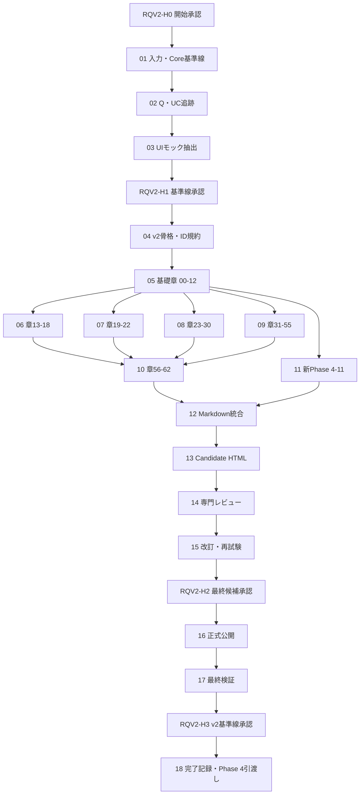

# 自動トレードシステム 要件定義書v2 ゼロベース再作成 実行計画書

## 0. 文書情報

| 項目 | 内容 |
|---|---|
| 計画ID | `RQV2-PLAN-001` |
| Phase ID | `REQUIREMENTS_V2_REBUILD_2026_08_11` |
| 文書版 | `v0.1` |
| 状態 | `DRAFT / WAITING_RQV2-H0` |
| 作成日 | 2026-08-11 |
| 目的 | `RQU-20`を構成正本とし、Q-01〜Q-305、67ユースケース、既存UIモック、Phase 1〜3の実装・検証済みCoreを追跡可能な一冊へ統合する |
| 最終成果物 | `doc/requirements/01_自動トレードシステム要件定義書_v2.html` |
| 文書セットID | `AT-REQ-V2-SET-001` |
| 要件定義書ID | `AT-REQ-002` |
| 計画策定・実行統制Orchestrator | `AutoTradePhasePlanning_Orchestrator_v0_1` |
| 要件本文・正式HTML Orchestrator | `AutoTradeProject_DesignDocSet_Orchestrator_v0_1` |
| UI検証Orchestrator | `AutoTradeProject_UiMock_Orchestrator_v0_1` |
| 主要入力 | `RQU-20`、Q-01〜Q-305回答・追跡資料、Phase 1〜3正式HTML・実装・試験証跡、統合台帳、既存UIモック |
| 旧要件定義書の扱い | 要件本文・章立て・要求粒度を継承しない。欠落比較と履歴参照だけに使い、v2の正本入力にはしない |
| 実装変更 | 本計画では行わない。Phase 1〜3のPython Coreは凍結して再利用する |

> この文書は要件定義書v2そのものではなく、要件定義書v2を段階的に作成、レビュー、正式化するための実行計画である。

---

## 1. 結論

要件定義書v2は、既存HTMLへ章を足す方法では作らない。`RQU-20`の全63章を新しい骨格とし、次の五つを別々に抽出してから統合する。

1. Q-01〜Q-305から確定した利用者要求、補足、撤回履歴、後続Gate。
2. RQU-11の67ユースケースから、利用者ができること、操作、例外、停止、復旧、保存証拠。
3. 既存UIモックの21画面、10共通状態、Dialog、PC・スマートフォンでの操作像。
4. Phase 1〜3で実装・検証済みのPython Coreについて、実装済み範囲と未実証範囲を分けた再利用契約。
5. 将来機能を安全な依存順で実現する、新しいPhase 4〜11ロードマップ。

全18 Stepで少しずつ作る。最初の3 Stepでは入力、追跡、Core凍結境界、UI導線を固定する。次の8 Stepでは章群別のMarkdown断片を独立作成する。その後に統合、HTML化、専門レビュー、改訂、正式公開、最終検証を行う。各Stepは前工程の成果物を入力にし、推測でUnknownを埋めない。

---

## 2. この計画で達成する状態

### 2.1 利用者にとっての完成状態

- 本システムで何ができるかを、機能、モード、画面、運用単位ごとに漏れなく理解できる。
- 初回起動から、データ準備、戦略設定、単一Backtest、パラメータ網羅検証、結果比較、Forward／Shadow、Paper、Live候補、停止、復旧、履歴確認までの操作が分かる。
- 日足、4時間足、1時間足、30分足、15分足と、複数銘柄・複数戦略・複数運用単位の関係が分かる。
- 実装済み、利用可能、未実証、後続Gate待ち、将来構想を誤認しない。
- UIモックの該当画面を要件定義書から直接開き、固定ダミーデータで操作像を確認できる。

### 2.2 実装・テストにとっての完成状態

- 各原子要求に要求ID、根拠Q、UC-ID、画面ID、状態、受入条件、テスト候補、実装状態がある。
- Phase 1〜3 Coreの再利用範囲は、コード、契約、試験証拠へ追跡できる。
- Phase 4以降の未実装機能を、既存Coreが実装済みであるかのように記載しない。
- 異常、通信断、再起動、注文拒否、部分約定、取消、照合差異、Kill Switchを正常系と同じ粒度で定義する。
- Unknownには、決定時期、開始条件、停止条件、必要証拠、反映先がある。
- v2正式化時点でCritical／Highの未解決Findingが0件、ID重複0件、内部リンク切れ0件である。

---

## 3. 対象範囲と非対象

### 3.1 本計画で行うこと

- 要件定義書v2の入力台帳、Core再利用基準線、Q回答分類、追跡マトリクスを作る。
- `RQU-20`の0〜62章をすべて収容した新規Markdown原稿を作る。
- 既存UIモック21画面の深いリンク、主要操作、画面状態、要件との対応を記載する。
- Phase 1〜3のPython Coreを変更せず、実装・検証済み能力として適切な証拠付きで記載する。
- 旧Phase 4〜8計画を履歴として残し、新Phase 4〜11へ再編する。
- 要件定義書v2を単体で閲覧可能なHTMLへ変換し、`doc/index.html`とUIモックから導線を設ける。
- 静的検査、Mermaid描画、PC・Android相当表示、Playwright、リンク、追跡、専門レビューを実施する。
- 実行ログ、レビュー記録、Unknown、Human Gateを正本へ同期する。

### 3.2 本計画で行わないこと

- `src/autotrade/market_data/`、`src/autotrade/strategy/`、`src/autotrade/backtest/`の変更。
- 既存テスト、fixture、Phase 1〜3の証拠の改変または再生成による見かけ上の合格化。
- Production UI、API、DB、Queue、Worker、OMS、Risk、Broker Adapterの実装。
- 外部データ取得、Broker接続、Secret投入、Paper注文、Live注文、実資金利用。
- Cloud、VM、公開サーバー、監視SaaSへの配備。
- 未決定値を推奨値だけで確定すること。
- 旧要件定義書や旧Phase計画の削除・上書き。

### 3.3 Core凍結規則

本計画の開始時と終了時に、次の対象のGit差分とhashを確認する。

- `src/autotrade/market_data/`
- `src/autotrade/strategy/`
- `src/autotrade/backtest/`
- それらに対応する既存テスト、fixture、`tests/evidence/phase1/`〜`phase3/`

要件整理中にCore変更が必要と判明しても変更しない。要求ID、変更候補、理由、影響、必要な詳細設計、Human GateをUnknownとして登録し、新Phaseの実行計画へ渡す。

---

## 4. 入力資料と優先順位

### 4.1 正本入力

| 優先 | 入力 | 用途 | 採用規則 |
|---:|---|---|---|
| 1 | 本セッションのQ-01〜Q-305回答を統合した回答・決定資料 | 利用者の明示意思、補足、撤回 | 最新の明示回答を採用し、古い回答は`HISTORY`で残す |
| 2 | `plan/requirements_update/RQU-20_要件定義書ゼロベース完全再構成案_2026-08-11.md` | v2の章構成、必須記載事項、完成条件 | 0〜62章を省略しない |
| 3 | `doc/00_全Phase残課題Blocked統合台帳.html` | Unknown、Blocked、Human Gate、再開条件 | UnknownをPassへ昇格させない |
| 4 | Phase 1〜3の正式HTML、承認書、コード、固定試験、証拠 | 実装済みCoreの事実 | 証拠で確認できる範囲だけ`IMPLEMENTED_VERIFIED`とする |
| 5 | `doc/ui_mock/01_自動トレードシステム_UIモック.html`と`ui/mock/` | 21画面、操作像、固定状態、E2E参照 | 要件を補う操作参照。実装済みの証明には使わない |
| 6 | RQU-11、RQU-UI追跡表、受入確認表、実行ログ | 67 UC、画面、状態、テストの既存整理 | v2追跡表へ再採番・再検証する |
| 7 | 現行技術方針、AI基盤、Phase計画 | 制約、将来計画、実行方法 | v2の要求と設計候補を分離して記載する |

### 4.2 参考・履歴入力

- `doc/requirements/01_自動トレードシステム要件定義書.html`は漏れ比較と履歴リンクだけに使う。
- `plan/Phase分割と設計書整備方針_v0.1_2026-08-02.md`の旧Phase 4〜8は、旧計画から新計画への対応表を作るためだけに使う。
- 旧文書と最新回答が衝突した場合、旧文書から値を復活させない。
- 外部Web情報は本計画では新規調査しない。外部仕様が必要になった項目は、公式一次情報を使う後続Gateとして登録する。

### 4.3 入力欠落時の扱い

入力の存在、版、日付、状態、hash、採用範囲をStep 01で一覧化する。必須入力が欠けた場合は推測で進めず、`BLOCKED_INPUT_MISSING`として停止する。

---

## 5. Core再利用の基準線

### 5.1 状態語

| 状態 | 意味 | v2での書き方 |
|---|---|---|
| `IMPLEMENTED_VERIFIED` | Phase 1〜3のコードと固定証拠が一致する | 実装済み範囲、試験範囲、証拠リンクを併記する |
| `IMPLEMENTED_UNVERIFIED` | コードはあるが、対象条件の検証証拠が不足する | 利用可能と断定せず、必要な再検証を記載する |
| `NOT_IMPLEMENTED` | 要求はあるが本実装がない | 将来Phase、依存、受入Gateを示す |
| `LATER_GATE` | 外部接続、実データ、性能、実運用承認が必要 | Gate ID、開始条件、停止条件、証拠先を示す |
| `OUT_OF_SCOPE` | v2の製品境界外 | 非目的と理由を示す |

### 5.2 再利用対象

Step 01で最低限、次を能力単位へ分解して証拠を付ける。

- Market Dataの取得契約、Catalog解決、Raw／Normalized保存、品質判定、MarketEvent生成。
- 日足、4時間足、1時間足、30分足、15分足の時間足集約契約とprovenance。
- Strategy契約、Turtleルール、指標、Signal／Target Position境界、snapshot。
- Backtest Manifest／Plan、時刻順Replay、Calendar Port、Fill／Cost／Roll／Gap境界、結果保存、再現hash。
- 固定fixture、Golden、synthetic市場、オフライン隔離、Phase 3完了承認の証拠。

`UNK-P3-01`、`UNK-P3-05`、`UNK-P3-07`は、Phase 3の合格範囲と併記し、長期実データ、実測Cost／Slippage／Gap、公式Calendar継続追随を未解消のまま維持する。

---

## 6. UIモックの参照契約

### 6.1 共通規則

- v2 HTMLからのリンクは`../ui_mock/01_自動トレードシステム_UIモック.html#SCREEN-XX`を使う。
- 本計画書からのリンクは`../../doc/ui_mock/01_自動トレードシステム_UIモック.html#SCREEN-XX`を使う。
- 画面モックは固定ダミーデータによる使用イメージであり、Production UIやBackend実装の証明ではない。
- 各画面には、対応するUC、要求ID、表示状態、主要操作、危険操作、保存証拠、E2E候補を対応付ける。
- 既存モックにない要求を、モックに合わせて削除しない。差異は`UI-GAP`として後続UI改訂候補へ記録する。

### 6.2 21画面の直接リンク

| Screen ID | 画面 | 本計画から開く |
|---|---|---|
| `SCREEN-01` | システム状態・禁止事項 | [UIモック](../../doc/ui_mock/01_自動トレードシステム_UIモック.html#SCREEN-01) |
| `SCREEN-02` | ホームDashboard | [UIモック](../../doc/ui_mock/01_自動トレードシステム_UIモック.html#SCREEN-02) |
| `SCREEN-03` | 運用単位一覧 | [UIモック](../../doc/ui_mock/01_自動トレードシステム_UIモック.html#SCREEN-03) |
| `SCREEN-04` | 運用単位作成・編集 | [UIモック](../../doc/ui_mock/01_自動トレードシステム_UIモック.html#SCREEN-04) |
| `SCREEN-05` | 市場データ・品質 | [UIモック](../../doc/ui_mock/01_自動トレードシステム_UIモック.html#SCREEN-05) |
| `SCREEN-06` | 戦略一覧 | [UIモック](../../doc/ui_mock/01_自動トレードシステム_UIモック.html#SCREEN-06) |
| `SCREEN-07` | 戦略設定 | [UIモック](../../doc/ui_mock/01_自動トレードシステム_UIモック.html#SCREEN-07) |
| `SCREEN-08` | Backtest設定 | [UIモック](../../doc/ui_mock/01_自動トレードシステム_UIモック.html#SCREEN-08) |
| `SCREEN-09` | Run・進捗 | [UIモック](../../doc/ui_mock/01_自動トレードシステム_UIモック.html#SCREEN-09) |
| `SCREEN-10` | 結果概要 | [UIモック](../../doc/ui_mock/01_自動トレードシステム_UIモック.html#SCREEN-10) |
| `SCREEN-11` | Chart・取引・Signal | [UIモック](../../doc/ui_mock/01_自動トレードシステム_UIモック.html#SCREEN-11) |
| `SCREEN-12` | Run比較 | [UIモック](../../doc/ui_mock/01_自動トレードシステム_UIモック.html#SCREEN-12) |
| `SCREEN-13` | Forward・Shadow | [UIモック](../../doc/ui_mock/01_自動トレードシステム_UIモック.html#SCREEN-13) |
| `SCREEN-14` | Paper・Live | [UIモック](../../doc/ui_mock/01_自動トレードシステム_UIモック.html#SCREEN-14) |
| `SCREEN-15` | Portfolio・Account・Risk | [UIモック](../../doc/ui_mock/01_自動トレードシステム_UIモック.html#SCREEN-15) |
| `SCREEN-16` | 注文・約定・Position | [UIモック](../../doc/ui_mock/01_自動トレードシステム_UIモック.html#SCREEN-16) |
| `SCREEN-17` | Alert・Incident | [UIモック](../../doc/ui_mock/01_自動トレードシステム_UIモック.html#SCREEN-17) |
| `SCREEN-18` | Human Gate・昇格 | [UIモック](../../doc/ui_mock/01_自動トレードシステム_UIモック.html#SCREEN-18) |
| `SCREEN-19` | 監査・Evidence | [UIモック](../../doc/ui_mock/01_自動トレードシステム_UIモック.html#SCREEN-19) |
| `SCREEN-20` | 接続・Secret・通知 | [UIモック](../../doc/ui_mock/01_自動トレードシステム_UIモック.html#SCREEN-20) |
| `SCREEN-21` | Help・用語 | [UIモック](../../doc/ui_mock/01_自動トレードシステム_UIモック.html#SCREEN-21) |

---

## 7. 成果物と保存先

### 7.1 最終成果物

| 種別 | 保存先 | 正本性 |
|---|---|---|
| 正式HTML | `doc/requirements/01_自動トレードシステム要件定義書_v2.html` | 運用者が読む正式成果物 |
| 執筆用Markdown | `plan/requirements_update/01_自動トレードシステム要件定義書_v2.md` | HTML生成元・変更追跡用 |
| v2追跡マトリクス | `plan/requirements_update/RQV2_要件UIテスト追跡マトリクス_2026-08-11.md` | Q、UC、要求、画面、状態、テスト、実装状態の正本 |
| Core再利用基準線 | `plan/requirements_update/RQV2_既存Core再利用基準線_2026-08-11.md` | Phase 1〜3の実装・証拠境界 |
| Phase再編表 | `plan/requirements_update/RQV2_Phase4以降再編ロードマップ_2026-08-11.md` | 新Phase 4〜11と旧計画対応の正本 |
| レビュー記録 | `plan/requirements_update/RQV2_専門レビュー記録_2026-08-11.md` | Findings firstの受入・却下・再検証 |
| 最終受入記録 | `plan/requirements_update/RQV2_最終受入確認_2026-08-11.md` | 機械・内容Gateの証拠索引 |
| 実行ログ | `plan/requirements_update/RQV2_実行ログ_2026-08-11.md` | Step、入力、出力、停止、Gate、変更履歴 |

### 7.2 中間成果物

章群別の編集競合を避けるため、`plan/requirements_update/drafts/v2/`へ次の断片を作る。

- `00_入力台帳と執筆規約.md`
- `01_基礎要件_章00-12.md`
- `02_データ戦略運用単位_章13-18.md`
- `03_Backtest検証結果_章19-22.md`
- `04_運用モードRisk注文_章23-30.md`
- `05_運用UI非機能品質_章31-55.md`
- `06_追跡付録_章56-62.md`
- `01_自動トレードシステム要件定義書_v2_candidate.md`
- `01_自動トレードシステム要件定義書_v2_candidate.html`

### 7.3 正本化規則

- 断片は作業用であり、正式HTMLと同格にしない。
- 正式HTMLの内容変更は執筆用Markdownへ先に反映し、再生成する。
- 旧要件HTMLは履歴として残す。v2公開時に削除、名称変更、上書きをしない。
- UIモックは独立した正式成果物として維持し、v2との相互リンクだけを同期する。
- Playwrightのスクリーンショット、動画、traceはGit管理外の一時証拠とし、ファイルそのものをstageしない。管理下へ残すのは結果要約、コマンド、viewport、hash、Pass／Failだけとする。

---

## 8. 使用するAI実行基盤

### 8.1 Orchestrator

| 用途 | Orchestrator | model |
|---|---|---|
| 要件章、追跡、HTML、レビューの統合 | `AutoTradeProject_DesignDocSet_Orchestrator_v0_1` | `gpt-5.6-terra` |
| Phase 4以降の再編 | `AutoTradePhasePlanning_Orchestrator_v0_1` | `gpt-5.6-terra` |
| UIリンク・Visual・a11y・Playwright確認 | `AutoTradeProject_UiMock_Orchestrator_v0_1` | `gpt-5.6-terra` |

### 8.2 Agents

| Agent | 主責務 | JSON固定model |
|---|---|---|
| `AutoTrade_A05_PhaseExecutionPlanner_v0_1` | 新Phaseロードマップ、依存、Gate | `gpt-5.6-luna` |
| `AutoTrade_A10_RequirementsCurator_v0_1` | Q回答、UC、原子要求、Unknown | `gpt-5.6-luna` |
| `AutoTrade_A20_ArchitectureDomainArchitect_v0_1` | 境界、識別子、状態、依存 | `gpt-5.6-luna` |
| `AutoTrade_A30_StrategyQaArchitect_v0_1` | 戦略、時間足、Backtest、検証 | `gpt-5.6-luna` |
| `AutoTrade_A40_ExecutionEnginePocArchitect_v0_1` | 既存Core、実行モデル、Engine境界 | `gpt-5.6-luna` |
| `AutoTrade_A50_AdapterArchitect_v0_1` | Market Data／Broker／Provider境界 | `gpt-5.6-luna` |
| `AutoTrade_A60_RiskAccountArchitect_v0_1` | Portfolio、Account、Risk、OMS | `gpt-5.6-luna` |
| `AutoTrade_A70_OpsSecurityArchitect_v0_1` | 運用、停止、復旧、Security | `gpt-5.6-luna` |
| `AutoTrade_A81_DesignDocSetWriter_v0_1` | Markdown／HTML文書セット統合 | `gpt-5.6-luna` |
| `AutoTrade_A90_DesignReviewer_v0_1` | Findings first、追跡、衝突レビュー | `gpt-5.6-luna` |
| `AutoTrade_A130_VerificationEngineer_v0_1` | 機械検査、証拠、再現性 | `gpt-5.6-luna` |
| `AutoTrade_A160_TradingSecurityReviewer_v0_1` | 取引安全、Secret、Live境界 | `gpt-5.6-luna` |
| `AutoTrade_A170_UiMockEngineer_v0_1` | UIモック参照、画面差異 | `gpt-5.6-terra` |
| `AutoTrade_A171_UiVisualQaReviewer_v0_1` | PC／スマートフォン、Visual、a11y | `gpt-5.6-terra` |

### 8.3 Skills

- `autotrade_skill_phase_execution_planning_v0_1`
- `autotrade_skill_orchestration_v0_1`
- `autotrade_skill_source_reader_v0_1`
- `autotrade_skill_traceability_v0_1`
- `autotrade_skill_domain_modeling_v0_1`
- `autotrade_skill_execution_model_v0_1`
- `autotrade_skill_golden_test_v0_1`
- `autotrade_skill_strategy_interface_v0_1`
- `autotrade_skill_turtle_strategy_rules_v0_1`
- `autotrade_skill_adapter_boundary_v0_1`
- `autotrade_skill_risk_account_design_v0_1`
- `autotrade_skill_ops_security_v0_1`
- `autotrade_skill_test_strategy_v0_1`
- `autotrade_skill_html_doc_writer_v0_1`
- `autotrade_skill_design_doc_set_writer_v0_1`
- `autotrade_skill_design_review_v0_1`
- `autotrade_skill_red_team_review_v0_1`
- `autotrade_skill_revision_integration_v0_1`
- `autotrade_skill_ui_mock_generation_v0_1`
- `autotrade_skill_ui_visual_validation_v0_1`
- `autotrade_skill_ui_accessibility_validation_v0_1`

Phase 1専用のAgent、Skill、Orchestratorは凍結済み証跡であり、今回の実行主体に使わない。新規AI部品は原則不要とする。ここに指定した実体JSONまたはSkillが存在しない、指定modelが利用できない場合は、代替せず停止する。

---

## 9. 実行DAGと並列条件



### 9.1 並列実行できる範囲

- Step 06、07、08、09、11は、Step 05完了後に別の断片ファイルを所有する場合だけ並列実行できる。
- 並列Agentは互いに同じファイルを編集しない。他者の変更を戻さず、最新内容へ適応する。
- Step 10はStep 06〜09の全完了後、Step 12はStep 10と11の完了後に開始する。
- Step 12以降は統合作業のため直列実行する。

### 9.2 本計画を順番に実行する場合

ユーザーが「1つずつ順番に実行」を指示した場合は、Step 01から番号順に実行し、Gateで必ず停止する。並列可能という記載は自動発火の許可ではない。

---

## 10. Human Gate

| Gate | 承認対象 | 承認前に実行できる範囲 | 承認後に進める範囲 | 承認しない場合 |
|---|---|---|---|---|
| `RQV2-H0` | `RQV2-PLAN-001 v0.1`の開始 | 本計画作成、台帳への未承認Gate登録 | Step 01〜03 | `WAITING_RQV2-H0`で停止 |
| `RQV2-H1` | 入力優先順位、Q分類、Core凍結境界、UI対応、Phase再編原則 | Step 01〜03の読み取り・基準線作成 | Step 04〜15 | `WAITING_RQV2-H1`で停止 |
| `RQV2-H2` | レビュー反映済みcandidateと残存Unknown | Step 04〜15の作業用候補 | Step 16〜17の正式公開・最終検証 | candidateを正式化せず停止 |
| `RQV2-H3` | 正式v2、追跡、最終検証、新Phase 4〜11基準線 | Step 16〜17 | Step 18の完了記録とPhase 4計画への引渡し | 正式HTMLは候補扱い、旧ロードマップを現行のまま維持 |

これらのGateは、外部取得、Broker接続、Secret、Paper注文、Live注文、実資金、Cloud公開を一切承認しない。各外部・実運用行為は新Phase側の別Gateで判断する。

---

## 11. 共通Runbookパラメータ

| 変数 | 固定値 |
|---|---|
| `PLAN_ID` | `RQV2-PLAN-001` |
| `PLAN_VERSION` | `v0.1` |
| `PHASE_ID` | `REQUIREMENTS_V2_REBUILD_2026_08_11` |
| `DOCUMENT_SET_ID` | `AT-REQ-V2-SET-001` |
| `REQUIREMENTS_ID` | `AT-REQ-002` |
| `FINAL_HTML` | `doc/requirements/01_自動トレードシステム要件定義書_v2.html` |
| `AUTHORING_MD` | `plan/requirements_update/01_自動トレードシステム要件定義書_v2.md` |
| `DRAFT_DIR` | `plan/requirements_update/drafts/v2/` |
| `TRACE_MATRIX` | `plan/requirements_update/RQV2_要件UIテスト追跡マトリクス_2026-08-11.md` |
| `CORE_BASELINE` | `plan/requirements_update/RQV2_既存Core再利用基準線_2026-08-11.md` |
| `ROADMAP` | `plan/requirements_update/RQV2_Phase4以降再編ロードマップ_2026-08-11.md` |
| `REVIEW_LOG` | `plan/requirements_update/RQV2_専門レビュー記録_2026-08-11.md` |
| `ACCEPTANCE` | `plan/requirements_update/RQV2_最終受入確認_2026-08-11.md` |
| `EXECUTION_LOG` | `plan/requirements_update/RQV2_実行ログ_2026-08-11.md` |
| `UI_MOCK` | `doc/ui_mock/01_自動トレードシステム_UIモック.html` |
| `LEDGER` | `doc/00_全Phase残課題Blocked統合台帳.html` |

---

## 12. 共通品質Gate

### 12.1 内容Gate

- RQU-20の0〜62章が、執筆用Markdownと正式HTMLで各1回、同じ順序で存在する。
- Q-01〜Q-305が全件、`CONFIRMED / HISTORY / LATER_GATE / UNKNOWN / BLOCKED`のいずれかへ分類される。
- RQU-11の67 UCが全件、要求、画面、状態、受入条件、テスト候補へ接続される。
- 21画面と10共通状態が全件追跡される。
- 日足、4時間足、1時間足、30分足、15分足が、生成、締め、判断、欠損、同時運用まで記載される。
- 初期候補`MCL / M6A / MZC / MZS / MZW`と、先物・株式・FX・暗号資産の能力状態を混同しない。
- 単一Backtestとパラメータ網羅検証を別ユースケース・別入力・別結果として記載する。
- Forward／Shadow、Paper、Live候補、小規模Live、通常Liveの境界と昇格条件を分離する。
- 単一運用者・無ログイン方針と、端末登録、通信保護、Human Gate、危険操作確認を分離する。
- 実装済み、UIモック済み、設計候補、未実装、未実証、未承認を同じ状態語にしない。

### 12.2 機械Gate

- UTF-8、HTML構文、Markdownリンク、重複ID、要求ID形式、見出し順を検査する。
- 全ローカルリンク、21個の`#SCREEN-XX`リンク、`doc/index.html`導線を検査する。
- Mermaidブロック数と描画後SVG数を一致させ、Android相当viewportでもソース文字列のまま表示されないことを確認する。
- Playwrightで主要章ナビゲーション、UIモック深いリンク、戻る導線、PC／スマートフォンviewportを確認する。
- スクリーンショットはGit管理外に置き、`git status --ignored`とstage対象を確認する。
- Core凍結対象の開始hashと終了hash・diffを比較し、変更0件を確認する。
- Secretらしい文字列、外部URLへの意図しない通信、Broker送信処理を含まないことを確認する。

### 12.3 レビューGate

- Findings firstでCritical、High、Medium、Lowを記録する。
- Critical／Highは0件になるまで正式化しない。
- Medium／Lowは、受入、修正、後続Gate、却下理由のいずれかを記録する。
- 撤回済み方針の復活、同概念の別名、要件とPhase設計の衝突を必ず検索する。
- UnknownをPassとして閉じていないことを独立レビューする。

---

## 13. 新しいPhase 4以降の開発ロードマップ

旧Phase 4〜8は履歴として保存し、`RQV2-H3`承認後に次のPhase 4〜11を現行基準線とする。各Phaseは開始前に別途、Phase実行計画書とHuman Gateを必要とする。

| 新Phase | 名称 | 主成果 | 依存・安全境界 | 主な完了条件 |
|---:|---|---|---|---|
| 4 | Product/Application基盤とBacktest製品化 | FastAPI候補、型付き設定、SQLite WAL／Migration候補、ローカルJob Queue／Worker、React UI接続、単一Backtest、網羅検証、結果閲覧 | Phase 1〜3 CoreをAdapter越しに再利用。外部Broker、Secret、実注文なし | UIからCoreを再現可能に実行し、Run／結果／Evidenceを永続化。Core無改変または承認済み変更のみ |
| 5 | 市場データ運用化と実証 | 初期5銘柄の識別、4資産種能力表、長期データ、品質、正式Calendar、実測Cost／Slippage／Gap | 外部データ取得は別Gate。`UNK-P3-01/05/07`を証拠で閉じるまで利益・Live適合を主張しない | provenance、hash、品質、期間分割、感度、Calendar更新監視の受入証拠 |
| 6 | 複数運用単位・Portfolio／Risk／OMS・Forward／Shadow | 20〜40候補の資源制御、資金配分、Risk上限、OrderIntent、照合前状態、停止・復旧、ローカル模擬実行 | Broker送信前にRisk／OMS／Kill Switchを完成。外部注文なし | 複数運用単位、競合、異常、restart、idempotencyを固定simulationで合格 |
| 7 | Broker AdapterとPaper Trading | Broker境界、口座同期、注文状態、部分約定、拒否、取消、照合、Paper運用 | 接続・Secret・Paperはそれぞれ明示Gate。Live注文は禁止 | 対象BrokerのPaper環境で注文ライフサイクル、再接続、照合、停止が証拠付き合格 |
| 8 | 運用堅牢化・長期Paper | Dashboard、通知、Incident、Backup／Restore、スマートフォンHTTPS中継・端末ペアリング、負荷・Soak | 自PC安定稼働を先に実証。Cloudは将来候補 | 長期連続運転、20〜40運用単位、障害復旧、バックアップ復元、端末境界を実機確認 |
| 9 | Live候補・小規模Live準備 | Engine最終選定、実銘柄／契約、Risk実値、費用、法務、運用Runbook、最終昇格証拠 | 実資金はまだ使わない。Human Gateで候補可否を判定 | 未解決Critical／High 0、実値確定、Kill Switch訓練、損失上限・停止条件の承認 |
| 10 | 小規模Live | 明示された小額・少数単位での実運用、照合、日次確認 | 別の実資金Human Gate。自動承認モードもHuman Gate設定そのものとして明示 | 損失・異常・照合・停止基準内で限定期間を完了し、拡大可否を判定 |
| 11 | 通常Live・継続運用 | 対象拡大、継続監視、更新、再検証、将来Cloud／VM移行判断 | 段階拡大。各対象・Risk変更・外部環境変更は再承認 | SLO、監査、復旧、変更管理、定期再検証を継続運用できる |

### 13.1 旧計画からの変更理由

- 旧計画はBroker／PaperをPortfolio／Riskより先に置いていた。新計画は、注文送信前に資金配分、Risk、OMS、Kill Switch、復旧を完成させる。
- UI、API、永続化、Job Queue、Backtest製品化を独立したPhase 4へ置き、既存Coreを利用者が操作できる製品境界に接続する。
- Phase 3の残存Unknownを新Phase 5へ明示し、固定syntheticの合格と実市場の適合を分ける。
- Paper接続直後にLiveへ進まず、長期Paper、負荷、Backup、スマートフォン安全境界を独立Phase 8で実証する。
- Liveを「候補準備」「小規模」「通常」の3段階へ分け、各段階を別Gateにする。

### 13.2 v2要件定義書に書く範囲

v2には各Phaseの目的、機能範囲、依存、開始条件、完了条件、禁止事項、Human Gate、Unknown解消先を書く。ただし具体的なモジュール設計、API Schema、DB DDL、Broker固有実装は、各Phaseの実行計画・詳細設計へ委ねる。

---

## 14. Step別の直接実行プロンプト

以下のプロンプトは、各Step開始時にそのままAIエージェントへ渡せる。全Step共通で、Windows側`C:\\project\\strategy_test`を正本とし、他者の変更を戻さず、Core凍結対象を編集しない。

### RQV2-01 入力台帳・既存Core再利用基準線

**目的:** v2が参照する全入力と、Phase 1〜3 Coreの実装・検証境界を固定する。

**依存:** `RQV2-H0`承認。

**主な出力:** `RQV2_既存Core再利用基準線_2026-08-11.md`、入力台帳、実行ログ初版。

```text
あなたは自動トレードシステム要件定義書v2の入力整理担当です。

Step ID: RQV2-01
Phase ID: REQUIREMENTS_V2_REBUILD_2026_08_11
Plan: RQV2-PLAN-001 v0.1
Plan file: plan/requirements_update/RQV2-PLAN-001_自動トレードシステム要件定義書v2再作成実行計画_2026-08-11.md
Runbook: output_root=plan/requirements_update/、log_root=plan/requirements_update/、document_set_id=AT-REQ-V2-SET-001、detail_boundary=要件文書・追跡・検証記録のみ、human_gate_policy=本計画10章。画像等の一時artifactは$env:TEMP配下へ置きGit管理しない。
Orchestrator: AutoTradeProject_DesignDocSet_Orchestrator_v0_1
Agents: AutoTrade_A10_RequirementsCurator_v0_1、AutoTrade_A40_ExecutionEnginePocArchitect_v0_1、AutoTrade_A130_VerificationEngineer_v0_1、AutoTrade_A90_DesignReviewer_v0_1
Model: Orchestrator=gpt-5.6-terra。各Agentは実体JSONに固定されたmodelを使う。利用不能なら代替せず停止する。
Skills: autotrade_skill_source_reader_v0_1、autotrade_skill_traceability_v0_1、autotrade_skill_execution_model_v0_1、autotrade_skill_design_review_v0_1
発火制御: 統合台帳にRQV2-H0の承認記録がある場合だけ開始する。

入力:
- plan/requirements_update/RQU-20_要件定義書ゼロベース完全再構成案_2026-08-11.md
- Q-01〜Q-305の回答、RQU-11、RQU-UIの追跡・受入・実行ログ
- doc/00_全Phase残課題Blocked統合台帳.html
- doc/phase1/〜doc/phase3/の正式HTMLと完了承認書
- src/autotrade/market_data/、src/autotrade/strategy/、src/autotrade/backtest/
- 対応する既存tests、fixture、tests/evidence/phase1〜phase3

実施:
1. 入力のパス、文書ID、版、日付、状態、hash、採用範囲、欠落を一覧化する。
2. Phase 1〜3 Coreを能力単位へ分解し、IMPLEMENTED_VERIFIED、IMPLEMENTED_UNVERIFIED、NOT_IMPLEMENTED、LATER_GATE、OUT_OF_SCOPEへ分類する。
3. IMPLEMENTED_VERIFIEDにはコード、契約、テスト、承認証拠のリンクを付ける。
4. UNK-P3-01、UNK-P3-05、UNK-P3-07を未解消のまま記載し、Phase 3の固定契約PASSと混同しない。
5. Core凍結対象の開始HEAD、git status、対象ファイル一覧、hashを記録する。コード、テスト、fixture、既存証拠は変更しない。
6. 欠落、衝突、証拠不足はUnknownまたはBlockedとし、推測で実装済みにしない。
7. 変更と停止事項をRQV2_実行ログ_2026-08-11.mdへ記録する。

レビュー:
- Findings firstで、証拠なしの実装済み判定、固定fixture結果の一般化、Broker/Paper/Liveの混入、Core変更を確認する。

完了条件:
- 必須入力欠落0件、または欠落をBLOCKEDとして停止している。
- 全Core能力に状態と証拠先がある。
- Core凍結対象の編集0件。
```

**停止条件:** 必須入力欠落、証拠とコードの重大不一致、Core差分発生、指定AI部品利用不能。

---

### RQV2-02 Q-01〜Q-305・67 UCの完全追跡

**目的:** ヒアリング結果を原子要求へ変換し、撤回履歴や後続決定と混ざらない追跡骨格を作る。

**依存:** RQV2-01完了。

**主な出力:** `RQV2_要件UIテスト追跡マトリクス_2026-08-11.md`初版。

```text
あなたは自動トレードシステムの要求追跡担当です。

Step ID: RQV2-02
Phase ID: REQUIREMENTS_V2_REBUILD_2026_08_11
Plan: RQV2-PLAN-001 v0.1
Plan file: plan/requirements_update/RQV2-PLAN-001_自動トレードシステム要件定義書v2再作成実行計画_2026-08-11.md
Runbook: output_root=plan/requirements_update/、log_root=plan/requirements_update/、document_set_id=AT-REQ-V2-SET-001、detail_boundary=要件文書・追跡・検証記録のみ、human_gate_policy=本計画10章。画像等の一時artifactは$env:TEMP配下へ置きGit管理しない。
Orchestrator: AutoTradeProject_DesignDocSet_Orchestrator_v0_1
Agents: AutoTrade_A10_RequirementsCurator_v0_1、AutoTrade_A90_DesignReviewer_v0_1
Model: Orchestrator=gpt-5.6-terra。各Agentは実体JSONに固定されたmodelを使う。利用不能なら代替せず停止する。
Skills: autotrade_skill_source_reader_v0_1、autotrade_skill_traceability_v0_1、autotrade_skill_design_review_v0_1
発火制御: RQV2-01の完了記録が実行ログにある場合だけ開始する。

入力:
- RQV2-01の入力台帳とCore再利用基準線
- Q-01〜Q-305の全回答・補足・後続訂正
- RQU-11の67ユースケース
- RQU-20の必須収容事項
- 既存RQU-UI追跡マトリクス、受入確認表、実行ログ
- 統合台帳

実施:
1. Q-01〜Q-305を1件ずつ、CONFIRMED、HISTORY、LATER_GATE、UNKNOWN、BLOCKEDへ分類する。
2. 同一Qから複数要求が生じる場合は原子要求へ分割し、REQ-FUNC、REQ-UI、REQ-DATA、REQ-RISK、REQ-OPS、REQ-SEC、REQ-NFR等の仮IDを付ける。
3. Q-277撤回、RQU-19/RQU-19A優先、初期候補MCL/M6A/MZC/MZS/MZW、単一運用者・無ログインを明記する。
4. RQU-11の67 UCへ重複しないUC-IDを付け、目的、開始条件、主要手順、結果、例外、取消、停止、復旧、保存証拠の記載先を作る。
5. 各行へ根拠Q、RQU-20章、要求ID、Screen ID、画面状態、受入条件、Test ID候補、Core状態、実現Phase、Unknown/Gateを持たせる。
6. 同義語と別名を正規化し、旧語はaliasまたはHISTORYにする。
7. 推測で値を確定せず、後から決める値には決定時期、開始条件、停止条件、証拠先、反映先を付ける。

レビュー:
- 回答の取りこぼし、撤回済み方針の復活、補足の脱落、同じ概念の別名、Phase設計との衝突をFindings firstで確認する。

完了条件:
- Q-01〜Q-305が305件すべて分類される。
- 67 UCがすべて1行以上の追跡先を持つ。
- ID重複0件、根拠なし要求0件、UnknownのPass化0件。
```

**停止条件:** Q原文または最新回答を一意に確認できない、撤回関係を解消できない、ID重複を解消できない。

---

### RQV2-03 UIモック21画面・操作・状態の抽出

**目的:** 既存UIモックを最大限参照し、要求本文から各使用イメージへ直接到達できるようにする。

**依存:** RQV2-02完了。

**主な出力:** 追跡マトリクスの画面・状態・操作列、`UI-GAP`一覧、実行ログ。

```text
あなたは自動トレードシステムのUI要件抽出担当です。

Step ID: RQV2-03
Phase ID: REQUIREMENTS_V2_REBUILD_2026_08_11
Plan: RQV2-PLAN-001 v0.1
Plan file: plan/requirements_update/RQV2-PLAN-001_自動トレードシステム要件定義書v2再作成実行計画_2026-08-11.md
Runbook: output_root=plan/requirements_update/、log_root=plan/requirements_update/、evidence_root=plan/requirements_update/、artifact_index=RQV2実行ログ、traceability_matrix=RQV2追跡マトリクス、seed_policy=既存固定ダミーデータ、viewport_policy=desktop/mobile、unknown_policy=UnknownをPassにしない。画像等は$env:TEMP配下へ置きGit管理しない。
Orchestrator: AutoTradeProject_UiMock_Orchestrator_v0_1
Agents: AutoTrade_A10_RequirementsCurator_v0_1、AutoTrade_A170_UiMockEngineer_v0_1、AutoTrade_A171_UiVisualQaReviewer_v0_1、AutoTrade_A90_DesignReviewer_v0_1
Model: Orchestrator=gpt-5.6-terra。各Agentは実体JSONに固定されたmodelを使う。利用不能なら代替せず停止する。
Skills: autotrade_skill_ui_mock_generation_v0_1、autotrade_skill_ui_visual_validation_v0_1、autotrade_skill_ui_accessibility_validation_v0_1、autotrade_skill_traceability_v0_1、autotrade_skill_design_review_v0_1
発火制御: RQV2-02完了時だけ開始する。このStepではUIモックを編集しない。

入力:
- doc/ui_mock/01_自動トレードシステム_UIモック.html
- ui/mock/src/、ui/mock/tests/、既存UI証跡
- RQV2追跡マトリクス
- RQU-20のUI・状態・Dialog・PC/スマートフォン章

実施:
1. SCREEN-01〜21の名称、hash URL、目的、表示情報、主要操作、遷移先、危険操作、Dialog、空・読込・失敗・停止等の状態を抽出する。
2. 各画面をUC、要求、受入条件、E2E候補へ対応させる。
3. v2 HTMLから使う相対リンクを ../ui_mock/01_自動トレードシステム_UIモック.html#SCREEN-XX として固定する。
4. UIモックに要求がない、または要求に対応画面がない差異をUI-GAPとして記録する。要求を削除したり、モックの挙動から未決定仕様を推測しない。
5. 固定ダミーデータ、モック、Production実装の三者を明確に区別する。
6. PCとAndroid相当viewportでhash routeが開くことを既存ローカル環境で読み取り確認する。外部取得や新規依存導入はしない。
7. スクリーンショットを撮る場合はGit管理外へ保存し、stageしない。

レビュー:
- 21画面、10共通状態、主要Dialog、PC/スマートフォン差、a11y、危険操作の欠落を確認する。

完了条件:
- SCREEN-01〜21がすべて追跡表にある。
- 全URLがローカルで解決する。
- UI-GAPが未記録のまま要求を落としていない。
- UIモック本体とCoreの変更0件。
```

**停止条件:** 画面ID欠落、hash route不整合、追跡不能な重大UI差異。

> RQV2-03完了後は`RQV2-H1`で停止する。H1が承認されるまで要件本文を執筆しない。

---

### RQV2-04 v2骨格・ID体系・執筆規約の固定

**目的:** 全63章の空の骨格と、原子要求をぶれなく書くテンプレートを作る。

**依存:** `RQV2-H1`承認。

**主な出力:** `drafts/v2/00_入力台帳と執筆規約.md`、全断片の見出し骨格。

```text
あなたは要件定義書v2の文書構造担当です。

Step ID: RQV2-04
Phase ID: REQUIREMENTS_V2_REBUILD_2026_08_11
Plan: RQV2-PLAN-001 v0.1
Plan file: plan/requirements_update/RQV2-PLAN-001_自動トレードシステム要件定義書v2再作成実行計画_2026-08-11.md
Runbook: output_root=plan/requirements_update/drafts/v2/、log_root=plan/requirements_update/、document_set_id=AT-REQ-V2-SET-001、detail_boundary=要件文書・追跡・検証記録のみ、human_gate_policy=本計画10章。画像等の一時artifactは$env:TEMP配下へ置きGit管理しない。
Orchestrator: AutoTradeProject_DesignDocSet_Orchestrator_v0_1
Agents: AutoTrade_A10_RequirementsCurator_v0_1、AutoTrade_A81_DesignDocSetWriter_v0_1、AutoTrade_A90_DesignReviewer_v0_1
Model: Orchestrator=gpt-5.6-terra。各Agentは実体JSONに固定されたmodelを使う。利用不能なら代替せず停止する。
Skills: autotrade_skill_design_doc_set_writer_v0_1、autotrade_skill_traceability_v0_1、autotrade_skill_html_doc_writer_v0_1、autotrade_skill_design_review_v0_1
発火制御: 統合台帳にRQV2-H1承認がある場合だけ開始する。

入力:
- RQU-20全文
- RQV2-01〜03成果物
- RQV2-H1の承認範囲

実施:
1. RQU-20の0〜62章を同じ順序で6断片へ配置し、省略のない見出し骨格を作る。
2. 要求ID、UC-ID、Screen ID、State ID、Dialog ID、Error ID、Test ID、Gate ID、Unknown ID、Evidence IDの命名規則を固定する。
3. 原子要求の必須欄を、shall文、根拠、理由、前提、入力、処理、出力、例外、停止、復旧、保存、受入条件、実装状態、実現Phaseとして固定する。
4. CONFIRMED、HISTORY、LATER_GATE、UNKNOWN、BLOCKED、IMPLEMENTED_VERIFIED等の状態語を用語集へ置く。
5. HTML内の章anchor、要求anchor、画面リンク、証拠リンクの規則を固定する。
6. 同じ要求を複数章へ複製せず、正本節と参照節を分ける。
7. 断片ごとの編集所有権と統合順序を記載する。

レビュー:
- 63章の欠落・重複、ID衝突、二重正本、曖昧なshall文テンプレートを確認する。

完了条件:
- 0〜62章が各1回存在する。
- ID規則と原子要求テンプレートが確定する。
- 本文の推測記入を開始していない。
```

**停止条件:** RQU-20章の欠落、既存IDとの衝突、H1承認範囲外の方針変更。

---

### RQV2-05 基礎要件 章00〜12

**目的:** 読者が製品の目的、境界、利用者、能力、用語、ユースケースの読み方を理解できる土台を作る。

**依存:** RQV2-04完了。

**主な出力:** `drafts/v2/01_基礎要件_章00-12.md`。

```text
あなたは要件定義書v2の基礎要件執筆担当です。

Step ID: RQV2-05
Phase ID: REQUIREMENTS_V2_REBUILD_2026_08_11
Plan: RQV2-PLAN-001 v0.1
Plan file: plan/requirements_update/RQV2-PLAN-001_自動トレードシステム要件定義書v2再作成実行計画_2026-08-11.md
Runbook: output_root=plan/requirements_update/drafts/v2/、log_root=plan/requirements_update/、document_set_id=AT-REQ-V2-SET-001、detail_boundary=要件文書・追跡・検証記録のみ、human_gate_policy=本計画10章。画像等の一時artifactは$env:TEMP配下へ置きGit管理しない。
Orchestrator: AutoTradeProject_DesignDocSet_Orchestrator_v0_1
Agents: AutoTrade_A10_RequirementsCurator_v0_1、AutoTrade_A20_ArchitectureDomainArchitect_v0_1、AutoTrade_A81_DesignDocSetWriter_v0_1、AutoTrade_A90_DesignReviewer_v0_1
Model: Orchestrator=gpt-5.6-terra。各Agentは実体JSONに固定されたmodelを使う。利用不能なら代替せず停止する。
Skills: autotrade_skill_source_reader_v0_1、autotrade_skill_domain_modeling_v0_1、autotrade_skill_traceability_v0_1、autotrade_skill_design_doc_set_writer_v0_1、autotrade_skill_design_review_v0_1
発火制御: RQV2-04の骨格・ID規約が完了している場合だけ開始する。

担当範囲:
- RQU-20章00〜12のみ。ほかの断片を編集しない。

実施:
1. 文書情報、Findings、完成条件、入力優先順位、要求記法、読者導線を記載する。
2. システムの目的、成功条件、非目的を利用者の言葉で記載する。
3. 利用者を唯一の運用者である本人として定義し、ログイン不要とする。一方、端末登録、通信保護、Human Gate、危険操作確認は別概念として残す。
4. 外部主体、システム境界、責務、依存方向、時刻、単位、識別子を定義する。
5. 全能力地図と、初回起動から停止・復旧までのエンドツーエンド利用シナリオを作る。
6. 67 UCの正本テンプレートと索引を置き、追跡マトリクスへリンクする。
7. 起動、初期設定、通常終了、強制停止、再起動後の確認を記載する。
8. 重要な境界と利用シナリオをMermaidで示し、図と同じ内容を文章でも説明する。

レビュー:
- 認証不要と無防備な遠隔公開の混同、外部Actorの脱落、専門用語だけの説明、非目的不足を確認する。

完了条件:
- 章00〜12がすべて本文を持つ。
- すべてのshall要求が追跡表へ接続される。
- 未実装機能を実装済みと記載していない。
```

**停止条件:** 利用者定義の矛盾、境界未確定、根拠QまたはGateを特定できない必須要求。

---

### RQV2-06 資産・時間足・データ・戦略・運用単位 章13〜18

**目的:** 何を、どの時間足・戦略・運用単位で、どのように同時実行できるかを完全に定義する。

**依存:** RQV2-05完了。

**主な出力:** `drafts/v2/02_データ戦略運用単位_章13-18.md`。

```text
あなたは要件定義書v2の市場データ・戦略・運用単位担当です。

Step ID: RQV2-06
Phase ID: REQUIREMENTS_V2_REBUILD_2026_08_11
Plan: RQV2-PLAN-001 v0.1
Plan file: plan/requirements_update/RQV2-PLAN-001_自動トレードシステム要件定義書v2再作成実行計画_2026-08-11.md
Runbook: output_root=plan/requirements_update/drafts/v2/、log_root=plan/requirements_update/、document_set_id=AT-REQ-V2-SET-001、detail_boundary=要件文書・追跡・検証記録のみ、human_gate_policy=本計画10章。画像等の一時artifactは$env:TEMP配下へ置きGit管理しない。
Orchestrator: AutoTradeProject_DesignDocSet_Orchestrator_v0_1
Agents: AutoTrade_A10_RequirementsCurator_v0_1、AutoTrade_A20_ArchitectureDomainArchitect_v0_1、AutoTrade_A30_StrategyQaArchitect_v0_1、AutoTrade_A50_AdapterArchitect_v0_1、AutoTrade_A81_DesignDocSetWriter_v0_1、AutoTrade_A90_DesignReviewer_v0_1
Model: Orchestrator=gpt-5.6-terra。各Agentは実体JSONに固定されたmodelを使う。利用不能なら代替せず停止する。
Skills: autotrade_skill_domain_modeling_v0_1、autotrade_skill_strategy_interface_v0_1、autotrade_skill_turtle_strategy_rules_v0_1、autotrade_skill_adapter_boundary_v0_1、autotrade_skill_traceability_v0_1、autotrade_skill_design_review_v0_1
発火制御: RQV2-05完了後に開始する。担当断片以外を編集しない。

担当範囲:
- RQU-20章13〜18。

実施:
1. 先物・株式・FX・暗号資産の対応能力を、対応可能、データ確認、接続確認、モード承認、実証済みへ分離する。
2. 初期候補MCL/M6A/MZC/MZS/MZWを開始候補として記載し、将来のBacktest/Forward/Paper結果で変更可能とする。
3. 日足、4時間足、1時間足、30分足、15分足について、生成元、締め時刻、判断時刻、欠損、休日、短縮日、DST、遅延、再生成を定義する。
4. データ取得、Raw、Normalized、品質、Catalog、Manifest、provenance、hash、版、再現性を定義し、既存Core証拠へ接続する。
5. 売買ルールを戦略バリエーション×時間足として扱えること、Turtle固有設定と汎用Strategy Interfaceを分ける。
6. 運用単位を銘柄×時間足×戦略設定版×モード等で定義する。同一銘柄×同一時間足の重複同時運用禁止と、異なる組合せの独立同時稼働を明記する。
7. Run、Job、Queue、優先度、同時実行、待機、取消、再開、失敗、資源上限を定義する。
8. 既存Core状態と将来Phaseを要求ごとに示す。

レビュー:
- 30分足だけの記載、4資産対応と実証済みの混同、運用単位の重複規則矛盾、Strategyと時間足の固定結合を確認する。

完了条件:
- 5時間足、4資産種類、初期5銘柄、同時運用規則を漏れなく記載する。
- 章13〜18の全要求がQ、UC、Core状態、Phaseへ追跡される。
```

**停止条件:** 銘柄識別、時間足締め、重複キーを一意に定義できない、既存Core証拠と矛盾する。

---

### RQV2-07 Backtest・網羅検証・結果・Holdout 章19〜22

**目的:** 単一設定と全組合せ検証を分離し、入力から進捗、結果、比較、再現、停止・再開まで定義する。

**依存:** RQV2-05完了。RQV2-06と別断片で並列可。

**主な出力:** `drafts/v2/03_Backtest検証結果_章19-22.md`。

```text
あなたは要件定義書v2のBacktest・検証要件担当です。

Step ID: RQV2-07
Phase ID: REQUIREMENTS_V2_REBUILD_2026_08_11
Plan: RQV2-PLAN-001 v0.1
Plan file: plan/requirements_update/RQV2-PLAN-001_自動トレードシステム要件定義書v2再作成実行計画_2026-08-11.md
Runbook: output_root=plan/requirements_update/drafts/v2/、log_root=plan/requirements_update/、document_set_id=AT-REQ-V2-SET-001、detail_boundary=要件文書・追跡・検証記録のみ、human_gate_policy=本計画10章。画像等の一時artifactは$env:TEMP配下へ置きGit管理しない。
Orchestrator: AutoTradeProject_DesignDocSet_Orchestrator_v0_1
Agents: AutoTrade_A10_RequirementsCurator_v0_1、AutoTrade_A30_StrategyQaArchitect_v0_1、AutoTrade_A40_ExecutionEnginePocArchitect_v0_1、AutoTrade_A81_DesignDocSetWriter_v0_1、AutoTrade_A90_DesignReviewer_v0_1
Model: Orchestrator=gpt-5.6-terra。各Agentは実体JSONに固定されたmodelを使う。利用不能なら代替せず停止する。
Skills: autotrade_skill_execution_model_v0_1、autotrade_skill_golden_test_v0_1、autotrade_skill_test_strategy_v0_1、autotrade_skill_traceability_v0_1、autotrade_skill_design_review_v0_1
発火制御: RQV2-05完了後に開始する。担当断片以外を編集しない。

担当範囲:
- RQU-20章19〜22。

実施:
1. 単一設定Backtestの画面入力、設定ファイル入力、Manifest、事前検査、開始、進捗、取消、失敗、再開、結果、Evidenceを定義する。
2. 網羅検証では各パラメータの下限、上限、変更単位、上限包含、型、無効組合せ、全組合せ数、実行上限、Queue、部分失敗、再開を定義する。
3. 1パラメータセットの結果として総損益、最大の落ち込み、取引回数、勝率、総残高を含め、Chart、取引、Signal、設定、証拠を定義する。
4. 網羅検証では全パラメータ組合せ×総損益・最大の落ち込み・取引回数・勝率・総残高の表、並べ替え、絞込み、出力、詳細遷移を定義する。
5. 同じ条件の再Runを許可し、過去結果と照合して警告・停止しない。最新の同条件結果を通常表示上上書きする一方、内部の設定版・Run・操作記録の保持とUI削除規則を矛盾なく定義する。
6. 学習期間、Holdout、Walk-forward、比較可能性、バイアス、再利用禁止条件を定義する。
7. 既存Coreの実装済み範囲と、UI／Job Queue／大量組合せ／長期データの未実装・未実証を分ける。
8. SCREEN-08〜12へ深いリンクを付ける。

レビュー:
- 単一と網羅検証の混在、上限包含の曖昧さ、結果指標不足、同条件Runの保存・上書き矛盾、Holdoutの後知恵を確認する。

完了条件:
- 単一Backtestと網羅検証が別UC・別受入条件を持つ。
- 5指標が両モードの適切な形式で定義される。
- 取消、失敗、再開、再現、Evidenceが記載される。
```

**停止条件:** 同条件Runの保持と表示上書きの意味を一貫して定義できない、既存Core能力を超える断定が残る。

---

### RQV2-08 Forward／Paper／Live・Portfolio／Risk／OMS／Broker 章23〜30

**目的:** 実行モードの境界と、資金・Risk・注文・Broker接続の安全な状態遷移を定義する。

**依存:** RQV2-05完了。RQV2-06、07、09、11と別断片で並列可。

**主な出力:** `drafts/v2/04_運用モードRisk注文_章23-30.md`。

```text
あなたは要件定義書v2の運用モード・Risk・注文要件担当です。

Step ID: RQV2-08
Phase ID: REQUIREMENTS_V2_REBUILD_2026_08_11
Plan: RQV2-PLAN-001 v0.1
Plan file: plan/requirements_update/RQV2-PLAN-001_自動トレードシステム要件定義書v2再作成実行計画_2026-08-11.md
Runbook: output_root=plan/requirements_update/drafts/v2/、log_root=plan/requirements_update/、document_set_id=AT-REQ-V2-SET-001、detail_boundary=要件文書・追跡・検証記録のみ、human_gate_policy=本計画10章。画像等の一時artifactは$env:TEMP配下へ置きGit管理しない。
Orchestrator: AutoTradeProject_DesignDocSet_Orchestrator_v0_1
Agents: AutoTrade_A10_RequirementsCurator_v0_1、AutoTrade_A20_ArchitectureDomainArchitect_v0_1、AutoTrade_A50_AdapterArchitect_v0_1、AutoTrade_A60_RiskAccountArchitect_v0_1、AutoTrade_A70_OpsSecurityArchitect_v0_1、AutoTrade_A81_DesignDocSetWriter_v0_1、AutoTrade_A90_DesignReviewer_v0_1
Model: Orchestrator=gpt-5.6-terra。各Agentは実体JSONに固定されたmodelを使う。利用不能なら代替せず停止する。
Skills: autotrade_skill_execution_model_v0_1、autotrade_skill_risk_account_design_v0_1、autotrade_skill_adapter_boundary_v0_1、autotrade_skill_ops_security_v0_1、autotrade_skill_traceability_v0_1、autotrade_skill_design_review_v0_1
発火制御: RQV2-05完了後に開始する。担当断片以外を編集しない。

担当範囲:
- RQU-20章23〜30。

実施:
1. Backtest、Forward、Shadow、Paper、Live候補、小規模Live、通常Liveを、入力、Clock、注文送信先、資金、承認、結果、停止、実装状態で比較する。
2. モード昇格を自動判定、証拠表示、運用者の最終判断へ分離する。合格表示があっても運用者の一存で候補を進められる要求は、安全上限と明示確認を超えない範囲として定義する。
3. Liveの「確認と取消だけできるモード」と「自動承認するモード」を設定可能にし、自動承認設定自体を運用者によるHuman Gateとして監査記録へ残す。
4. Portfolio、Account、資金配分、総残高、Risk値、損失上限、Exposure、相関、同時保有、注文数量を定義する。Risk値と上限は設定画面から変更可能とする。
5. Signal、Target Position、OrderIntent、Order、Fill、Positionの責務とID、冪等性、順序、取消、部分約定、拒否、期限切れを定義する。
6. Broker Adapter、口座同期、照合差異、通信断、再接続、重複送信防止、停止、復旧を定義する。
7. 未承認のBroker、Paper、Live、Secretを利用可能と書かず、新PhaseとGateへ接続する。
8. SCREEN-13〜16、18、20へ深いリンクを付ける。

レビュー:
- Live自動承認と認証の混同、Riskより先の注文送信、状態遷移の抜け、照合差異時の継続、候補と実運用の混同を確認する。

完了条件:
- 全モードの境界と昇格・降格・停止が一意に読める。
- Portfolio／Risk／OMS／Brokerの責務と依存順が一意である。
- 外部接続・実注文を未承認のまま実装済みとしない。
```

**停止条件:** Risk上限を迂回できる要求、重複注文の恐れ、Human Gateなしの実資金移行、Phase 3境界との衝突。

---

### RQV2-09 監視・保存・UI・Security・非機能・品質 章31〜55

**目的:** 日常運用、異常復旧、データライフサイクル、全UI、端末、性能、品質を横断要求として定義する。

**依存:** RQV2-05完了。別断片で並列可。

**主な出力:** `drafts/v2/05_運用UI非機能品質_章31-55.md`。

```text
あなたは要件定義書v2の運用・UI・非機能要件担当です。

Step ID: RQV2-09
Phase ID: REQUIREMENTS_V2_REBUILD_2026_08_11
Plan: RQV2-PLAN-001 v0.1
Plan file: plan/requirements_update/RQV2-PLAN-001_自動トレードシステム要件定義書v2再作成実行計画_2026-08-11.md
Runbook: output_root=plan/requirements_update/drafts/v2/、log_root=plan/requirements_update/、document_set_id=AT-REQ-V2-SET-001、detail_boundary=要件文書・追跡・検証記録のみ、human_gate_policy=本計画10章。画像等の一時artifactは$env:TEMP配下へ置きGit管理しない。
Orchestrator: AutoTradeProject_DesignDocSet_Orchestrator_v0_1
Agents: AutoTrade_A10_RequirementsCurator_v0_1、AutoTrade_A20_ArchitectureDomainArchitect_v0_1、AutoTrade_A70_OpsSecurityArchitect_v0_1、AutoTrade_A81_DesignDocSetWriter_v0_1、AutoTrade_A90_DesignReviewer_v0_1、AutoTrade_A160_TradingSecurityReviewer_v0_1、AutoTrade_A171_UiVisualQaReviewer_v0_1
Model: Orchestrator=gpt-5.6-terra。各Agentは実体JSONに固定されたmodelを使う。利用不能なら代替せず停止する。
Skills: autotrade_skill_ops_security_v0_1、autotrade_skill_test_strategy_v0_1、autotrade_skill_ui_visual_validation_v0_1、autotrade_skill_ui_accessibility_validation_v0_1、autotrade_skill_traceability_v0_1、autotrade_skill_red_team_review_v0_1
発火制御: RQV2-05完了後に開始する。担当断片以外を編集しない。

担当範囲:
- RQU-20章31〜55。

実施:
1. Dashboard、全運用単位の現在状態、手動更新、自動更新スイッチ、自動更新間隔[s]、通知、Alert、Incidentを定義する。
2. Kill Switch、単位停止、全停止、停止理由、再開、restart、復旧、照合、障害時の安全側動作を定義する。
3. 設定版、Run、操作記録、結果、監査、通常一覧非表示、論理削除、物理削除、UI削除導線、保持、検索、Exportをデータ種別ごとに定義する。
4. Backup対象をDB、設定、結果、監査、必要Manifest等に分け、対象外、頻度、保存先、暗号化、復元試験、RPO/RTOの決定Gateを記載する。
5. 21画面、10共通状態、主要Dialog、PC/Android、Keyboard、focus、名前・役割、contrast、大量表、virtualization、更新UXを定義する。
6. Provider／Broker／Engine Adapter、API、Event、SSE、同時更新、Version、Error contractを定義する。
7. Python Core再利用を設計制約とし、FastAPI、React、SQLite WAL/Alembic、ローカルQueue等は現時点の候補と選定・差替え条件に分ける。
8. 単一運用者・ログイン不要、自PCと自分のスマートフォンだけの接続、楽天モバイル側PCとIIJ mio側スマートフォンという現状を記載し、HTTPS中継、端末ペアリング、公開範囲は後続実証とする。
9. Secret、権限、通信、ログmask、依存更新、性能、容量、可用性、整合性、運用、保守、Error catalog、Test、法務、費用、将来Cloud/VMを定義する。
10. 固定値がない性能・RPO/RTO等は構造と測定方法を決め、UnknownをPassにしない。

レビュー:
- Backup対象の曖昧さ、削除と監査保持の衝突、認証不要と端末制限の混同、スマートフォン経路の未実証、固定値なし性能の合格扱いを確認する。

完了条件:
- 章31〜55が全て本文を持つ。
- UI 21画面×10状態が追跡される。
- Security、停止、復旧、保存、性能の後続Gateが明示される。
```

**停止条件:** 遠隔接続を無保護で許可する記述、Secret平文保存、削除と監査要件の解消不能な矛盾、根拠なし性能値。

---

### RQV2-10 追跡・UC・Q・表図・品質付録 章56〜62

**目的:** 要件定義書の完全性を一冊の中で検査できる付録と索引を作る。

**依存:** RQV2-06〜09完了。

**主な出力:** `drafts/v2/06_追跡付録_章56-62.md`、追跡マトリクス更新。

```text
あなたは要件定義書v2の追跡・付録担当です。

Step ID: RQV2-10
Phase ID: REQUIREMENTS_V2_REBUILD_2026_08_11
Plan: RQV2-PLAN-001 v0.1
Plan file: plan/requirements_update/RQV2-PLAN-001_自動トレードシステム要件定義書v2再作成実行計画_2026-08-11.md
Runbook: output_root=plan/requirements_update/drafts/v2/、log_root=plan/requirements_update/、document_set_id=AT-REQ-V2-SET-001、detail_boundary=要件文書・追跡・検証記録のみ、human_gate_policy=本計画10章。画像等の一時artifactは$env:TEMP配下へ置きGit管理しない。
Orchestrator: AutoTradeProject_DesignDocSet_Orchestrator_v0_1
Agents: AutoTrade_A10_RequirementsCurator_v0_1、AutoTrade_A81_DesignDocSetWriter_v0_1、AutoTrade_A90_DesignReviewer_v0_1
Model: Orchestrator=gpt-5.6-terra。各Agentは実体JSONに固定されたmodelを使う。利用不能なら代替せず停止する。
Skills: autotrade_skill_traceability_v0_1、autotrade_skill_design_doc_set_writer_v0_1、autotrade_skill_design_review_v0_1
発火制御: RQV2-06〜09の断片が完了している場合だけ開始する。

担当範囲:
- RQU-20章56〜62。

実施:
1. 要求、Q、UC、画面、状態、Dialog、Error、Test、Core証拠、実現Phase、Unknown、Gate、変更履歴の追跡規則を記載する。
2. 67 UCを要約し、各UCの正本節、要求、Screen、Testへリンクする。
3. Q-01〜Q-305を全件一覧化し、分類、要求先、履歴、後続Gateを示す。
4. RQU-20が要求する表、Mermaid図、状態図、シーケンス、付録をチェックリスト化し、配置先を示す。
5. 執筆、機械検査、専門レビュー、Human Gate、正式化の品質Gateを記載する。
6. この文書の読み方、変更方法、旧文書との関係、版履歴を記載する。
7. 断片06〜09の新規要求を追跡マトリクスへ反映し、孤立要求・孤立UC・孤立Screenを0件にする。

レビュー:
- 件数だけ合って内容が空の行、循環参照、重複ID、リンク切れ、HISTORYの現行混入を確認する。

完了条件:
- 章56〜62が完成する。
- Q 305件、UC 67件、Screen 21件が全件追跡される。
- 孤立要求0件、重複ID0件。
```

**停止条件:** 件数不一致、追跡不能な要求、撤回履歴と現行方針の未解決衝突。

---

### RQV2-11 Phase 4以降のゼロベース再編

**目的:** 既存Coreを生かしつつ、外部注文より先に製品基盤、Risk、OMS、安全停止を作る新Phase 4〜11を詳細化する。

**依存:** RQV2-05完了。RQV2-06〜09と別成果物で並列可。

**主な出力:** `RQV2_Phase4以降再編ロードマップ_2026-08-11.md`。

```text
あなたは自動トレードシステムのPhase再編担当です。

Step ID: RQV2-11
Phase ID: REQUIREMENTS_V2_REBUILD_2026_08_11
Plan: RQV2-PLAN-001 v0.1
Plan file: plan/requirements_update/RQV2-PLAN-001_自動トレードシステム要件定義書v2再作成実行計画_2026-08-11.md
Runbook: output_root=plan/requirements_update/、log_root=plan/requirements_update/、detail_boundary=Phase目的・依存・Gate・成果物まで。実装詳細と本実装は対象外、human_gate_policy=本計画10章。
Orchestrator: AutoTradePhasePlanning_Orchestrator_v0_1
Agents: AutoTrade_A05_PhaseExecutionPlanner_v0_1、AutoTrade_A10_RequirementsCurator_v0_1、AutoTrade_A90_DesignReviewer_v0_1
Model: Orchestrator=gpt-5.6-terra。各Agentは実体JSONに固定されたmodelを使う。利用不能なら代替せず停止する。
Skills: autotrade_skill_phase_execution_planning_v0_1、autotrade_skill_source_reader_v0_1、autotrade_skill_traceability_v0_1、autotrade_skill_orchestration_v0_1、autotrade_skill_design_review_v0_1、autotrade_skill_red_team_review_v0_1
発火制御: RQV2-05完了後に開始する。旧計画を削除・上書きしない。

入力:
- RQV2-01 Core再利用基準線
- RQV2追跡マトリクス
- Phase 1〜3完了承認書と残存Unknown
- plan/Phase分割と設計書整備方針_v0.1_2026-08-02.md
- 本計画13章の新Phase 4〜11案

実施:
1. 新Phase 4〜11ごとに、目的、利用者能力、対象要求、再利用Core、主要成果物、依存、非対象、開始条件、完了条件、品質Gate、Human Gate、Unknown解消先を記載する。
2. Phase 4をProduct/Application基盤とBacktest製品化、Phase 5を市場データ運用化と実証、Phase 6を複数運用単位・Portfolio/Risk/OMS・Forward/Shadowとする。
3. Phase 7をBroker Adapter/Paper、Phase 8を運用堅牢化・長期Paper、Phase 9をLive候補・小規模Live準備、Phase 10を小規模Live、Phase 11を通常Live・継続運用とする。
4. UNK-P3-01/05/07の解消先をPhase 5へ置き、未解消のままPassにしない。
5. 旧Phase 4〜8から新Phaseへの対応、変更理由、廃止ではなく履歴となる時点を記載する。
6. Python Coreを原則無改変で再利用し、変更が必要なら別の詳細設計・RED試験・Human Gateが必要とする。
7. 各Phase開始前に個別実行計画が必要であることを明記する。
8. 外部データ、Secret、Broker/Paper、実資金、Cloudを、それぞれ独立Gateへ分ける。

レビュー:
- Risk/OMSより先のBroker注文、Phase間循環、巨大Phase、未解消Unknownの消失、旧計画の無断削除を確認する。

完了条件:
- 新Phase 4〜11の依存がDAGとして成立する。
- 全LATER_GATE要求に実現Phaseまたは決定Phaseがある。
- 旧・新対応表と移行条件がある。
```

**停止条件:** 安全依存が逆転する、Phase 1〜3 Coreを無証拠で作り直す、外部・実資金Gateを統合する。

---

### RQV2-12 全章Markdown candidate統合

**目的:** 章群別断片と新ロードマップを一冊の候補へ統合し、内容の二重正本をなくす。

**依存:** RQV2-10、RQV2-11完了。

**主な出力:** `drafts/v2/01_自動トレードシステム要件定義書_v2_candidate.md`。

```text
あなたは要件定義書v2の統合編集担当です。

Step ID: RQV2-12
Phase ID: REQUIREMENTS_V2_REBUILD_2026_08_11
Plan: RQV2-PLAN-001 v0.1
Plan file: plan/requirements_update/RQV2-PLAN-001_自動トレードシステム要件定義書v2再作成実行計画_2026-08-11.md
Runbook: output_root=plan/requirements_update/drafts/v2/、log_root=plan/requirements_update/、document_set_id=AT-REQ-V2-SET-001、detail_boundary=要件文書・追跡・検証記録のみ、human_gate_policy=本計画10章。画像等の一時artifactは$env:TEMP配下へ置きGit管理しない。
Orchestrator: AutoTradeProject_DesignDocSet_Orchestrator_v0_1
Agents: AutoTrade_A10_RequirementsCurator_v0_1、AutoTrade_A81_DesignDocSetWriter_v0_1、AutoTrade_A90_DesignReviewer_v0_1
Model: Orchestrator=gpt-5.6-terra。各Agentは実体JSONに固定されたmodelを使う。利用不能なら代替せず停止する。
Skills: autotrade_skill_design_doc_set_writer_v0_1、autotrade_skill_traceability_v0_1、autotrade_skill_revision_integration_v0_1、autotrade_skill_design_review_v0_1
発火制御: RQV2-10とRQV2-11が完了した場合だけ開始する。

入力:
- drafts/v2/00〜06の全断片
- RQV2 Phase 4以降再編ロードマップ
- RQV2追跡マトリクス
- Core再利用基準線

実施:
1. 章00〜62を正しい順序でcandidate Markdownへ統合する。
2. 同義語、ID、状態、時刻、単位、モード名を用語正本へ統一する。
3. 重複する要求本文は正本節1箇所へ寄せ、ほかはリンク参照にする。
4. UIモック21画面の深いリンク、Core証拠、新Phaseロードマップ、Unknown/Gateを適切な章へ挿入する。
5. Mermaid図のID、説明文、代替となる表・文章を揃える。
6. 章間参照、脚注、付録、変更履歴を整合させる。
7. 統合で意味を変えた箇所を実行ログへ記録し、根拠なしの補完をしない。

レビュー:
- 63章の欠落・重複、内容の食い違い、同じ概念の別名、旧Phase計画の復活、要求と追跡表の差を確認する。

完了条件:
- candidate Markdownが単体で通読できる。
- 章00〜62が各1回存在する。
- 未解決のCritical/High統合Findingがない。
```

**停止条件:** 意味が衝突する断片、根拠不明の統合判断、追跡表と本文の解消不能な不一致。

---

### RQV2-13 Candidate HTML生成・静的検査

**目的:** Markdown candidateを、単体閲覧、Mermaid、リンク、PC／スマートフォン表示に対応する候補HTMLへ変換する。

**依存:** RQV2-12完了。

**主な出力:** `drafts/v2/01_自動トレードシステム要件定義書_v2_candidate.html`、静的検査記録。

```text
あなたは要件定義書v2 candidateのHTML作成担当です。

Step ID: RQV2-13
Phase ID: REQUIREMENTS_V2_REBUILD_2026_08_11
Plan: RQV2-PLAN-001 v0.1
Plan file: plan/requirements_update/RQV2-PLAN-001_自動トレードシステム要件定義書v2再作成実行計画_2026-08-11.md
Runbook: output_root=plan/requirements_update/drafts/v2/、log_root=plan/requirements_update/、document_set_id=AT-REQ-V2-SET-001、detail_boundary=candidate HTMLとローカル検証まで、human_gate_policy=本計画10章。画像等の一時artifactは$env:TEMP配下へ置きGit管理しない。
Orchestrator: AutoTradeProject_DesignDocSet_Orchestrator_v0_1
Agents: AutoTrade_A81_DesignDocSetWriter_v0_1、AutoTrade_A90_DesignReviewer_v0_1、AutoTrade_A130_VerificationEngineer_v0_1
Model: Orchestrator=gpt-5.6-terra。各Agentは実体JSONに固定されたmodelを使う。利用不能なら代替せず停止する。
Skills: autotrade_skill_html_doc_writer_v0_1、autotrade_skill_design_doc_set_writer_v0_1、autotrade_skill_traceability_v0_1、autotrade_skill_design_review_v0_1
発火制御: RQV2-12のcandidate Markdownが完成した場合だけ開始する。

実施:
1. candidate MarkdownからUTF-8の単体閲覧可能HTMLを作る。元Markdownと意味を変えない。
2. 文書情報、状態、目次、章anchor、要求anchor、用語、表、注意、Unknown、変更履歴を読みやすく表示する。
3. MermaidをPCとAndroidブラウザで確実に描画できる既存共通assetへ接続し、JavaScript無効時も説明文で意味が分かるようにする。
4. SCREEN-01〜21への相対hash linkを全件設置する。
5. Phase 1〜3証拠、統合台帳、追跡表、ロードマップへのローカルリンクを設置する。
6. HTML構文、重複id、リンク、見出し順、表、Mermaid parseをローカル検査する。
7. 外部CDN、外部通信、Secret、Broker接続を追加しない。
8. このStepではdoc/requirementsの正式ファイル、doc/index.html、UIモックを変更しない。

レビュー:
- MarkdownとHTMLの章数・要求数・Unknown数を比較し、生成時の脱落を確認する。

完了条件:
- candidate HTMLがローカルで単体閲覧できる。
- 章数、要求数、リンク、Mermaid parseの検査がPassする。
- 正式成果物はまだ変更していない。
```

**停止条件:** HTML生成で意味が変わる、Mermaid parse失敗、リンク切れ、外部依存が必要になる。

---

### RQV2-14 多領域Findings-firstレビュー

**目的:** 要件定義書candidateを、機能完全性、Core整合、安全、UI、実現順の各専門領域から独立監査する。

**依存:** RQV2-13完了。

**主な出力:** `RQV2_専門レビュー記録_2026-08-11.md`初版。

```text
あなたは自動トレードシステム要件定義書v2の独立レビュー統括です。

Step ID: RQV2-14
Phase ID: REQUIREMENTS_V2_REBUILD_2026_08_11
Plan: RQV2-PLAN-001 v0.1
Plan file: plan/requirements_update/RQV2-PLAN-001_自動トレードシステム要件定義書v2再作成実行計画_2026-08-11.md
Runbook: output_root=plan/requirements_update/、log_root=plan/requirements_update/、document_set_id=AT-REQ-V2-SET-001、detail_boundary=レビュー記録のみ・本文直接編集禁止、human_gate_policy=本計画10章。画像等の一時artifactは$env:TEMP配下へ置きGit管理しない。
Orchestrator: AutoTradeProject_DesignDocSet_Orchestrator_v0_1
Agents: AutoTrade_A20_ArchitectureDomainArchitect_v0_1、AutoTrade_A30_StrategyQaArchitect_v0_1、AutoTrade_A40_ExecutionEnginePocArchitect_v0_1、AutoTrade_A50_AdapterArchitect_v0_1、AutoTrade_A60_RiskAccountArchitect_v0_1、AutoTrade_A70_OpsSecurityArchitect_v0_1、AutoTrade_A90_DesignReviewer_v0_1、AutoTrade_A160_TradingSecurityReviewer_v0_1、AutoTrade_A171_UiVisualQaReviewer_v0_1
Model: Orchestrator=gpt-5.6-terra。各Agentは実体JSONに固定されたmodelを使う。利用不能なら代替せず停止する。
Skills: autotrade_skill_design_review_v0_1、autotrade_skill_red_team_review_v0_1、autotrade_skill_traceability_v0_1、autotrade_skill_test_strategy_v0_1、autotrade_skill_ui_visual_validation_v0_1、autotrade_skill_ui_accessibility_validation_v0_1
発火制御: RQV2-13のcandidate HTMLと静的検査記録が揃った場合だけ開始する。レビュー担当は本文を直接編集しない。

レビュー観点:
1. Findings firstで、重大度、ファイル、章／ID、再現手順、影響、修正案、受入条件を記録する。
2. Q-01〜Q-305、67 UC、21 Screen、10状態、5時間足、4資産種類、初期5銘柄の完全性を確認する。
3. Phase 1〜3 Coreの実装状態と、v2の実装済み表現が一致するか確認する。
4. Turtle戦略、Backtest、Holdout、Bias、Cost、Calendar、Replayの意味を確認する。
5. 運用単位、Portfolio、Risk、OMS、Broker、Paper、Liveの責務・依存・安全境界を確認する。
6. 異常、取消、停止、復旧、再起動、部分約定、拒否、照合差異、Kill Switchを確認する。
7. 単一運用者・ログイン不要と、端末・通信・Secret・Human Gateを確認する。
8. UIモックとの操作・画面・状態・Dialog・PC/Android・a11y対応を確認する。
9. 新Phase 4〜11の依存順、旧計画との関係、Unknown解消先を確認する。
10. 撤回済み方針、別名、二重正本、根拠なし数値、UnknownのPass化を検索する。

完了条件:
- 全FindingがCritical/High/Medium/Lowで記録される。
- 取りこぼし検査の件数と証拠がある。
- レビュー担当がcandidateを直接改変していない。
```

**停止条件:** Critical／High Findingの記録先がない、入力不足でレビュー不能、レビュー中の本文直接変更。

---

### RQV2-15 改訂統合・再試験・最終候補

**目的:** 受け入れたFindingを根拠付きで直し、正式化可能な最終候補を作る。

**依存:** RQV2-14完了。

**主な出力:** 改訂済みcandidate Markdown／HTML、レビュー記録更新、最終候補検査記録。

```text
あなたは要件定義書v2の改訂統合担当です。

Step ID: RQV2-15
Phase ID: REQUIREMENTS_V2_REBUILD_2026_08_11
Plan: RQV2-PLAN-001 v0.1
Plan file: plan/requirements_update/RQV2-PLAN-001_自動トレードシステム要件定義書v2再作成実行計画_2026-08-11.md
Runbook: output_root=plan/requirements_update/drafts/v2/、log_root=plan/requirements_update/、document_set_id=AT-REQ-V2-SET-001、detail_boundary=最終candidateと再検証まで、human_gate_policy=本計画10章。画像等の一時artifactは$env:TEMP配下へ置きGit管理しない。
Orchestrator: AutoTradeProject_DesignDocSet_Orchestrator_v0_1
Agents: AutoTrade_A10_RequirementsCurator_v0_1、AutoTrade_A81_DesignDocSetWriter_v0_1、AutoTrade_A90_DesignReviewer_v0_1、AutoTrade_A130_VerificationEngineer_v0_1
Model: Orchestrator=gpt-5.6-terra。各Agentは実体JSONに固定されたmodelを使う。利用不能なら代替せず停止する。
Skills: autotrade_skill_revision_integration_v0_1、autotrade_skill_traceability_v0_1、autotrade_skill_html_doc_writer_v0_1、autotrade_skill_design_review_v0_1
発火制御: RQV2-14レビュー記録が完成した場合だけ開始する。

実施:
1. 全Findingを受入、修正済み、後続Gate、却下へ分類し、理由と証拠を残す。
2. Critical／Highをすべて修正する。値を決められない指摘はUnknown/Gateへ変換するが、危険な要求を先送りして合格にしない。
3. candidate Markdown、追跡マトリクス、Core基準線、Phaseロードマップを同時に整合させる。
4. HTMLを再生成し、章数、Q、UC、Screen、状態、ID、リンク、Mermaid、用語、Unknownを再検査する。
5. 修正対象領域の専門Agentへ差分再レビューを依頼し、Findingの閉鎖証拠を記録する。
6. Core凍結対象とUIモック本体を変更しない。
7. 最終候補の版、hash、生成元、残存Medium/Low、Unknown、Gateを固定する。

レビュー:
- 修正による新たな矛盾、要求脱落、追跡切れ、古い方針の復活をFindings firstで再確認する。

完了条件:
- Critical／High未解決0件。
- Q 305、UC 67、Screen 21、状態10、ID重複0、リンク切れ0。
- 最終候補のhashと残存事項が記録される。
```

**停止条件:** Critical／Highが残る、追跡件数不足、UnknownをPassにしないと閉じられない、Core差分発生。

> RQV2-15完了後は`RQV2-H2`で停止する。H2が承認されるまで正式ファイルへ公開しない。

---

### RQV2-16 正式v2公開・索引・UI相互リンク同期

**目的:** 承認された最終候補を正式HTMLと執筆用Markdownへ昇格し、利用者の入口を整える。

**依存:** `RQV2-H2`承認。

**主な出力:** 正式v2 HTML、執筆用Markdown、`doc/index.html`導線、UIモックv2戻りリンク。

```text
あなたは要件定義書v2の正式公開担当です。

Step ID: RQV2-16
Phase ID: REQUIREMENTS_V2_REBUILD_2026_08_11
Plan: RQV2-PLAN-001 v0.1
Plan file: plan/requirements_update/RQV2-PLAN-001_自動トレードシステム要件定義書v2再作成実行計画_2026-08-11.md
Runbook: output_root=doc/requirements/、log_root=plan/requirements_update/、document_set_id=AT-REQ-V2-SET-001、detail_boundary=承認済み文書の正式公開と導線同期のみ、human_gate_policy=本計画10章。画像等の一時artifactは$env:TEMP配下へ置きGit管理しない。
Orchestrator: AutoTradeProject_DesignDocSet_Orchestrator_v0_1
Agents: AutoTrade_A81_DesignDocSetWriter_v0_1、AutoTrade_A90_DesignReviewer_v0_1、AutoTrade_A170_UiMockEngineer_v0_1
Model: Orchestrator=gpt-5.6-terra。各Agentは実体JSONに固定されたmodelを使う。利用不能なら代替せず停止する。
Skills: autotrade_skill_design_doc_set_writer_v0_1、autotrade_skill_html_doc_writer_v0_1、autotrade_skill_traceability_v0_1、autotrade_skill_ui_mock_generation_v0_1、autotrade_skill_design_review_v0_1
発火制御: 統合台帳にRQV2-H2承認と承認対象candidateのhashがある場合だけ開始する。

実施:
1. 承認済みcandidate Markdownをplan/requirements_update/01_自動トレードシステム要件定義書_v2.mdへ昇格する。
2. 承認済みcandidate HTMLをdoc/requirements/01_自動トレードシステム要件定義書_v2.htmlへ正式公開する。
3. 文書ID AT-REQ-002、版、状態、日付、生成元hash、承認Gate、旧文書との関係を同期する。
4. doc/index.htmlにv2を現行要件定義書として追加し、旧要件定義書を履歴として残す。
5. UIモックの要件定義書への戻り導線へv2を追加する。既存21画面の挙動、ダミーデータ、hash routeは変更しない。
6. v2からSCREEN-01〜21、UIからv2、索引からv2の相互リンクを確認する。
7. 旧要件HTML、旧Phase計画、Core、既存証拠を削除・上書きしない。
8. 公開差分、hash、変更ファイルを実行ログへ記録する。

レビュー:
- 承認candidateとの差分、版・状態の不一致、旧文書の誤った現行表示、UI挙動変更を確認する。

完了条件:
- 正式v2 HTML、執筆用Markdown、索引、UI戻りリンクが同期する。
- 承認candidateとの意味差分0件。
- 旧成果物とCoreが保持される。
```

**停止条件:** 承認hash不一致、旧文書上書き、UI機能差分、正式版のリンク切れ。

---

### RQV2-17 最終受入検証

**目的:** 正式公開後の実ファイルを、追跡、ブラウザ、表示、安全、Core凍結の全観点で検証する。

**依存:** RQV2-16完了。

**主な出力:** `RQV2_最終受入確認_2026-08-11.md`。

```text
あなたは要件定義書v2の最終検証担当です。

Step ID: RQV2-17
Phase ID: REQUIREMENTS_V2_REBUILD_2026_08_11
Plan: RQV2-PLAN-001 v0.1
Plan file: plan/requirements_update/RQV2-PLAN-001_自動トレードシステム要件定義書v2再作成実行計画_2026-08-11.md
Runbook: output_root=plan/requirements_update/、log_root=plan/requirements_update/、evidence_root=plan/requirements_update/、artifact_index=RQV2最終受入確認、traceability_matrix=RQV2追跡マトリクス、seed_policy=既存固定ダミーデータ、viewport_policy=desktop/mobile、unknown_policy=UnknownをPassにしない。画像・動画・traceは$env:TEMP配下へ置きGit管理しない。
Orchestrator: AutoTradeProject_UiMock_Orchestrator_v0_1
Agents: AutoTrade_A10_RequirementsCurator_v0_1、AutoTrade_A171_UiVisualQaReviewer_v0_1、AutoTrade_A90_DesignReviewer_v0_1
Model: Orchestrator=gpt-5.6-terra。各Agentは実体JSONに固定されたmodelを使う。利用不能なら代替せず停止する。
Skills: autotrade_skill_traceability_v0_1、autotrade_skill_test_strategy_v0_1、autotrade_skill_ui_visual_validation_v0_1、autotrade_skill_ui_accessibility_validation_v0_1、autotrade_skill_design_review_v0_1
発火制御: RQV2-16の正式公開記録がある場合だけ開始する。

検証:
1. 正式HTMLと執筆用MarkdownにRQU-20章00〜62が各1回存在することを確認する。
2. Q-01〜Q-305、67 UC、21 Screen、10状態、5時間足、4資産種類、初期5銘柄の件数と内容を確認する。
3. 要求ID、UC-ID、Screen ID、State ID、Test ID、Gate ID、Unknown IDの重複・孤立・参照切れを確認する。
4. 全ローカルリンクとSCREEN-01〜21のhash linkを確認する。
5. PlaywrightでPCとAndroid相当viewportを開き、目次、章anchor、表、Mermaid、UI深いリンク、戻り導線を検証する。
6. 全mermaid要素がSVGへ変換され、ソース文字列が図の代わりに表示されていないことを確認する。
7. Keyboard、focus、名前・役割、見出し、contrastの主要a11y確認を行う。
8. 外部通信0、Secret混入0、Broker送信0、Core凍結対象の開始時との差分0を確認する。
9. Playwrightスクリーンショット、動画、traceがGit管理対象またはstage対象になっていないことを確認する。
10. 結果を期待値、実績、証拠、Pass/Fail/Unknownで最終受入確認へ記録する。UnknownをPassにしない。

完了条件:
- 機械Gateが全てPassし、Critical／High 0件。
- Core差分0件、外部通信0件、Secret0件。
- スクリーンショット類のgit管理0件。
- 残存Unknownと後続Gateが正しく記録される。
```

**停止条件:** Mermaid未描画、重大リンク切れ、追跡不足、Core差分、外部通信、Secret、スクリーンショットのstage、Critical／High Finding。

> RQV2-17完了後は`RQV2-H3`で停止する。H3はv2と新Phaseロードマップの基準線承認であり、Phase 4実装開始そのものではない。

---

### RQV2-18 完了記録・台帳同期・Phase 4計画への引渡し

**目的:** v2の承認状態と新ロードマップを唯一の正本群へ記録し、次に作るPhase 4実行計画の入力を固定する。

**依存:** `RQV2-H3`承認。

**主な出力:** 完了済み実行ログ、統合台帳更新、Phase 4計画入力一覧。

```text
あなたは要件定義書v2再作成Phaseの完了統合担当です。

Step ID: RQV2-18
Phase ID: REQUIREMENTS_V2_REBUILD_2026_08_11
Plan: RQV2-PLAN-001 v0.1
Plan file: plan/requirements_update/RQV2-PLAN-001_自動トレードシステム要件定義書v2再作成実行計画_2026-08-11.md
Runbook: output_root=plan/requirements_update/、log_root=plan/requirements_update/、document_set_id=AT-REQ-V2-SET-001、detail_boundary=完了記録・台帳同期・次Phase入力固定まで、human_gate_policy=本計画10章。Phase 4計画・実装は開始しない。
Orchestrator: AutoTradeProject_DesignDocSet_Orchestrator_v0_1
Agents: AutoTrade_A10_RequirementsCurator_v0_1、AutoTrade_A81_DesignDocSetWriter_v0_1、AutoTrade_A90_DesignReviewer_v0_1
Model: Orchestrator=gpt-5.6-terra。各Agentは実体JSONに固定されたmodelを使う。利用不能なら代替せず停止する。
Skills: autotrade_skill_phase_execution_planning_v0_1、autotrade_skill_traceability_v0_1、autotrade_skill_design_doc_set_writer_v0_1、autotrade_skill_design_review_v0_1
発火制御: 統合台帳にRQV2-H3の明示承認がある場合だけ開始する。

実施:
1. RQV2-H3の承認対象、日時、文書版、hash、残存Unknownを実行ログと統合台帳へ記録する。
2. RQV2-01〜18の入力、出力、検査、Finding、Gate、変更ファイルを完了表へまとめる。
3. v2を現行要件定義の基準線、新Phase 4〜11を現行ロードマップとして索引・台帳へ反映する。
4. 旧要件定義書と旧Phase 4〜8計画をHISTORY/SUPERSEDEDとして残し、削除しない。
5. Phase 4実行計画の必須入力、開始条件、非対象、Human Gate候補を一覧化する。Phase 4の計画・実装はこのStepで開始しない。
6. UNK-P3-01/05/07とv2で生じたUnknownを新Phaseへ引き渡し、状態・期限・証拠先を整合させる。
7. 統合台帳全体を検索し、関連Human Gate、Blocked、Unknown、最新状態、履歴、件数表示の矛盾を直す。
8. Core凍結対象の最終差分0と、Playwright artifactのgit管理0を再確認する。

レビュー:
- 承認前の完了扱い、Unknown消失、旧計画の現行表示、台帳内の状態矛盾を確認する。

完了条件:
- Phase状態がCOMPLETE_WITH_RECORDED_UNKNOWNまたは全Unknown解消時のCOMPLETEとして一意に記録される。
- 新Phase 4の計画作成に必要な入力が揃う。
- 本StepがPhase 4実装を開始していない。
```

**停止条件:** H3承認記録なし、承認対象hash不一致、台帳矛盾、Unknownの追跡切れ。

---

## 15. Stepと成果物の対応

| Step | 主な章・対象 | 主成果物 | 主な確認 |
|---|---|---|---|
| 01 | 入力、Core | Core再利用基準線 | 実装・証拠・Unknown |
| 02 | Q、UC | 追跡マトリクス | 305 Q、67 UC |
| 03 | UI | Screen／State／UI-GAP | 21 Screen、10 State |
| 04 | 全体骨格 | 執筆規約 | 63章、ID |
| 05 | 00〜12 | 基礎要件断片 | 目的、利用者、境界、UC |
| 06 | 13〜18 | データ・戦略・単位断片 | 4資産、5銘柄、5時間足 |
| 07 | 19〜22 | Backtest断片 | 単一、網羅、結果、Holdout |
| 08 | 23〜30 | モード・Risk・注文断片 | Forward、Paper、Live、OMS |
| 09 | 31〜55 | 運用・UI・非機能断片 | 監視、保存、21画面、Security |
| 10 | 56〜62 | 追跡付録 | Q／UC／表図／品質 |
| 11 | Phase 4〜11 | 再編ロードマップ | 依存、Gate、旧新対応 |
| 12 | 全章 | candidate Markdown | 統合整合 |
| 13 | 全章 | candidate HTML | HTML、Mermaid、リンク |
| 14 | 全領域 | 専門レビュー | Findings first |
| 15 | 全領域 | 最終候補 | Critical/High 0 |
| 16 | 正式化 | v2 HTML・索引・相互リンク | candidate一致 |
| 17 | 最終検証 | 最終受入確認 | Browser、追跡、Core凍結 |
| 18 | 完了 | 台帳・実行ログ・引渡し | H3、Unknown、Phase 4入力 |

---

## 16. 未決定事項の管理

### 16.1 今回閉じるもの

- 文書章構成、要求ID体系、用語、利用者、システム境界。
- Q-01〜Q-305と67 UCの現行・履歴・後続Gate分類。
- UI 21画面、10状態、主要Dialogと要求の対応。
- Phase 1〜3 Coreの再利用状態と証拠境界。
- 新Phase 4〜11の順序、目的、依存、Gate、旧計画との関係。
- 要件定義書v2の正式版、相互リンク、変更・追跡規則。

### 16.2 後続Gateへ残してよいもの

- 長期実データ、市場数、長期Holdout、Walk-forwardの実証条件。
- 市場別Cost、Slippage、Gap、正式取引所Calendarの実値・継続追随。
- 20〜40運用単位の実機性能上限、自動更新間隔の許容範囲、Queue制御値。
- Backup対象別RPO/RTO、保存先、復元時間の実測値。
- 自PCからスマートフォンへ安全に接続する実方式と、楽天モバイル／IIJ mio回線での実証。
- Broker、Paper、Live、Secret、実資金、Cloud／VMの具体値と利用承認。
- 各銘柄の実契約、取引単位、Tick、Margin、費用、Risk値、損失上限。

### 16.3 Unknownの必須欄

全Unknownに以下を持たせる。

- `Unknown ID`
- 未決定内容と、今決めない理由
- 影響する要求・UC・Screen・Phase
- 決定期限または決定Phase
- 開始条件
- 未決定時の停止条件
- 必要な検証・証拠
- 決定権者
- 反映先
- 現在状態

---

## 17. 全体停止条件

次のいずれかに該当した場合、当該Stepを完了扱いにせず停止する。

- 指定Orchestrator、Agent、Skill、固定modelが利用できず、代替が必要になる。
- 前提Human Gateの承認記録が統合台帳にない。
- Q、UC、Screen、章、IDの件数または根拠が不足する。
- 撤回済み回答と現行方針のどちらを採用するか一意に判断できない。
- Phase 1〜3 Core、既存テスト、fixture、証拠に意図しない差分が生じる。
- 外部取得、外部通信、Broker、Paper、Live、Secret、Cloud、実資金が必要になる。
- Critical／High Findingが残る。
- UnknownをPass扱いにしなければ工程を進められない。
- Mermaid、リンク、正式版、UIモック、追跡表の間に重大な不整合がある。
- Playwrightのスクリーンショット、動画、traceがGit管理またはstage対象になる。
- ユーザーの未コミット変更と編集対象が衝突し、安全に分離できない。

---

## 18. 計画全体の完了条件

本計画は次をすべて満たした場合だけ完了とする。

1. `doc/requirements/01_自動トレードシステム要件定義書_v2.html`が正式公開され、単体で読める。
2. RQU-20の0〜62章が全て本文を持つ。
3. Q-01〜Q-305、67 UC、21 Screen、10状態が全件追跡される。
4. 利用者が何をでき、どう操作し、失敗時にどう停止・復旧するかを全機能で理解できる。
5. Phase 1〜3 Coreの再利用範囲と未実証範囲が証拠付きで分かる。
6. 新Phase 4〜11が安全な依存順で定義され、旧Phase計画との関係が分かる。
7. UIモック21画面へ要件定義書から直接移動でき、UIからv2へ戻れる。
8. Critical／High Finding 0、ID重複0、孤立要求0、リンク切れ0、Mermaid未描画0である。
9. UnknownをPass扱いしていない。
10. Core凍結対象の変更0、外部通信0、Secret0、実注文0である。
11. Playwrightスクリーンショット等がGit管理下にない。
12. `RQV2-H3`承認、実行ログ、最終受入、統合台帳、索引が同期している。

---

## 19. 実行開始時の承認文

本計画を開始する場合、運用者は次のように明示する。

```text
RQV2-H0として、RQV2-PLAN-001 v0.1の実行開始を承認します。
まずRQV2-01〜RQV2-03まで進め、要件本文の執筆前にRQV2-H1で停止してください。
```

この承認は、要件定義書v2の入力整理、Core再利用基準線、追跡表、UI参照整理だけを許可する。外部取得、Python Core変更、Production実装、Broker、Paper、Live、Secret、Cloud、実資金を許可しない。

---

## 20. 変更履歴

| 日付 | 版 | 内容 |
|---|---|---|
| 2026-08-11 | v0.1 | RQU-20を構成正本とし、Phase 1〜3 Coreを凍結再利用、既存UIモック21画面を深いリンクで参照、新Phase 4〜11を再編する18 Stepの実行計画を新規作成した。RQV2-H0〜H3を設け、H0承認前で停止した。 |
