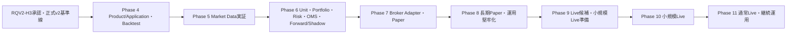

# RQV2 Phase 4以降ゼロベース再編ロードマップ

| 項目 | 内容 |
|---|---|
| 成果物ID | `RQV2-ART-11-ROADMAP-001` |
| Step ID | `RQV2-11` |
| Phase ID | `REQUIREMENTS_V2_REBUILD_2026_08_11` |
| Plan | `RQV2-PLAN-001 v0.1` |
| 作成日 | 2026-08-11 |
| 状態 | `DRAFT_ROADMAP`（RQV2-H2／H3前の候補。実装開始許可ではない） |
| 正本入力 | RQV2-01 Core再利用基準線、RQV2-02追跡Matrix、RQV2-05〜10断片、Phase 1〜3完了承認・残存Unknown、旧Phase計画、RQV2-PLAN-001 §13 |
| 編集範囲 | Phase 4〜11の目的、依存、成果物、Gate、Unknown、旧新対応。実装詳細・本実装・外部接続は対象外。 |
| 安全境界 | Broker、Paper、Secret、実注文、実資金、Cloud、外部取得は、各Phaseの独立Human Gateが承認するまで行わない。 |

> このロードマップはPhaseを開始する承認書ではない。RQV2-H3承認後も、各Phaseの開始前に別の実行計画書、詳細設計、機械品質Gate、Human Gateを作成する。Phase 1〜3の固定Coreは、根拠範囲を越えて実市場・利益性・Broker・Paper・Liveへ一般化しない。

## 1. 再編の目的と原則

### 1.1 目的

旧Phase 4〜8の機能順を、実注文より先にProduct／Application基盤、Data、Portfolio／Risk／OMS、安全停止、Paper、長期運用を完成させる依存順へ再編する。新Phase 4〜11は、RQV2-05〜10のREQ・UC・Screen・State・Gate・Unknownに接続し、各Phaseで「利用者ができること」「安全に止まること」「Evidenceを残すこと」「次Phaseへ渡せること」を判定する。

### 1.2 共通原則

1. Python Coreは原則無改変で再利用する。変更が必要な場合は、別の詳細設計、RED試験、影響レビュー、Human Gateを要する。
2. Broker注文より先にPortfolio／Risk／OMS／Kill Switch／照合／復旧を完成させる。
3. Backtest／Forward／Shadow／Paper／Live候補／小規模Live／通常Liveを別Mode・別Gateとして扱う。
4. `CONFIRMED`は回答方針の採用を意味し、実装済み・実証済み・利益性を意味しない。
5. `LATER_GATE`、`UNKNOWN`、`BLOCKED`、`HISTORY`をPassへ変換しない。Q-277の撤回、Q-243のGate、`RQV2-BLK-001`の物理欠落をCurrentへ混入させない。
6. 各Phase開始前に、そのPhase専用の複数Step実行計画書を作成し、成果物、依存、Human Gate、停止条件、証跡配置を確定する。
7. 全外部I/O、Secret、実資金、実注文、Cloud公開は、必要なPhaseで独立したHuman Gateを置く。

## 2. 依存DAGと発火制御

### 2.1 Phase依存DAG

### 2.2 発火制御

| 制御点 | 発火条件 | 発火しない条件 |
|---|---|---|
| Roadmap確定 | RQV2-10／11の内容・依存・Unknown・旧新対応をレビュー済み | RQV2-H2未承認でも候補として記録するが、実Phaseは開始しない |
| Phase 4 | RQV2-H3承認、Phase 4実行計画、詳細設計、Core再利用確認、開始Human Gate | H3未承認、Core差分不明、Critical／High未解消、入力範囲不明 |
| Phase 5 | Phase 4のData接続点・保存・Evidenceが完了、外部Data Gate承認 | Provider／費用／Secret／対象範囲不明、UNK-P3-01／05／07未評価 |
| Phase 6 | Data品質・Calendar・Cost実証の対象範囲が固定、Risk／OMS詳細設計とREDが完了 | Risk未定義、Order前判定なし、Kill／照合／復旧未設計 |
| Phase 7 | Phase 6のsimulation合格、Broker Adapter詳細設計、Paper／Secret／接続Gate承認 | 実注文、実資金、Live、照合・部分約定・再接続未検証 |
| Phase 8 | Paperの限定Gate、Phase 7の注文Lifecycle証拠、運用Runbook | 長期・負荷・Backup／Restore・端末境界未検証 |
| Phase 9 | 長期Paper、実値、法務・費用・Risk・Kill訓練、候補Gate | 実資金、実注文、自動承認、未解決Critical／High |
| Phase 10 | 小規模Liveの別Human Gate、対象・金額・期間・停止条件の承認 | Phase 9未完、照合・日次監視・損失停止不明 |
| Phase 11 | 小規模Liveの評価、通常Liveの別Human Gate、段階拡大条件 | 変更・Risk・SLO・監査・復旧・再承認が不十分 |

Phase内の詳細なStep順は、そのPhaseの実行計画書で定める。ここではPhase間のDAGだけを正本とし、Phaseを跨ぐ循環依存を許可しない。

## 3. Phase 4：Product/Application基盤とBacktest製品化

### 3.1 目的・利用者能力・対象要求

利用者が、固定・再現可能なData／Strategy／Config／Riskを画面または型付き入力から指定し、単一Backtest、Sweep、Result、Chart、取引明細、Evidenceを操作できる製品境界を作る。主対象はF01の基礎・起動／停止、F02のData／Strategy／Unit／Run、F03のBacktest／Sweep／Holdout、F05のAPI／UI／保存／Test要求である。

利用者能力は、設定Version作成、事前検査、Run／Job／Queue確認、Cancel／Stop、checkpointからの再開、5指標確認、全件表・CSV Job、同条件Run履歴、Holdout境界確認とする。外部Dataの継続取得、Broker、Paper、Live、実資金、Secret、Cloudは対象外とする。

### 3.2 再利用Core・成果物

| 区分 | 内容 |
|---|---|
| 再利用 | Replay、Fill、Cost、Roll、Gap、Calendar、Holdout、Turtle Strategy、Manifest、固定fixture、既存Core APIの必要最小範囲 |
| 未一般化 | 実市場長期性能、Provider契約、実Cost／Slippage、Paper／Live、UI／API／Worker統合 |
| 主成果物 | Phase 4実行計画、詳細設計、型付きRunモデル、API／UI境界、Persistence設計、Backtest／Sweep実装、Test／Evidence、Runbook |
| 保存先 | Phase 4正式HTMLは`doc/phase4/`、計画・ログは`plan/`、証跡は`tests/evidence/phase4/<RunId>/` |

### 3.3 依存・非対象・開始条件

- 依存：RQV2-H3承認、v2正式基準線、RQV2-01 Core再利用範囲、F01〜F06のREQ・Traceability。
- 非対象：外部Data取得、Broker接続、Secret、Paper注文、Live注文、実資金、Cloud、Core本体の無承認変更。
- 開始条件：Phase 4実行計画、詳細設計、REDテスト、Core差分0または承認済みChange、Human Gate。
- 停止条件：入力Manifest不一致、Risk欠落、未来参照、保存不一致、Idempotency不明、Critical／High、外部I/O混入。

### 3.4 完了条件・Gate・Unknown解消先

- 完了：単一／Sweepの入力・状態・結果・Evidenceが再現でき、UI・API・Worker・Persistenceの境界が機械検証される。
- Quality Gate：REQ／UC／Test追跡、Golden／Replay、API／File契約、UI主要状態、Critical／High 0、`git diff --check`、証跡hash。
- Human Gate：Phase 4成果物、Core無改変範囲、Backtest製品化範囲、次PhaseData境界を承認する。外部Data・実注文は承認しない。
- Unknown解消先：UI／Worker性能はP4で測定設計、`UNK-P3-01/05/07`と実DataはP5、実Broker／PaperはP7以降へ残す。

## 4. Phase 5：市場データ運用化と実証

### 4.1 目的・利用者能力・対象要求

初期5候補（MCL、M6A、MZC、MZS、MZW）の論理IDから実Symbol、取引所、限月、Roll、単位、Provider／Broker対応を確定し、4資産種類、D1／H4／H1／M30／M15、Data Quality、正式Calendar、実測Cost／Slippage／Gap、長期期間、Holdout／Walk-forwardをEvidence付きで検証する。主対象はF02 §13〜15、F03 §22、F05 §43／47／55、`UNK-P3-01`、`UNK-P3-05`、`UNK-P3-07`である。

利用者能力は、Catalog確認、Data取得要求、Raw／Normalized／Quality／Manifest比較、欠損・重複・時刻逆行の停止、Calendar更新確認、期間・費用・Gap仮定の表示とする。Data契約、費用、Secret、外部接続は別Gateで承認する。

### 4.2 再利用Core・成果物

| 区分 | 内容 |
|---|---|
| 再利用 | DBN decoder、Raw／Normalized store、Catalog／Manifest、Quality、固定Timeframe／M30 provenance、Replay入力契約 |
| 実証対象 | 初期5候補、4資産構造、実Data期間・本数・欠落、正式Calendar、Cost／Slippage／Gap、長期Holdout |
| 主成果物 | Data source／費用／Secret Gate記録、Catalog、Quality report、Provenance／hash、Calendar監視、Cost／Gap report、期間分割Evidence |
| 保存先 | Phase 5正式HTMLは`doc/phase5/`、外部Data証跡は`tests/evidence/phase5/<RunId>/`、Unknown更新は統合台帳 |

### 4.3 依存・非対象・開始条件

- 依存：P4の型付きData／Manifest／保存／品質接続点、Data Provider契約、Human Gate。
- 非対象：利益性の採用、Broker注文、Paper／Live、実資金、未承認Secretの投入、20〜40 Unitの連続運用。
- 開始条件：対象Symbol・期間・Data source・費用・Secret範囲・取得方法・停止条件・Evidence配置がGateで承認される。
- 停止条件：entitlement不明、費用上限不明、Data欠損を埋める推測、Calendar未確認、未来Data、外部送信範囲不明。

### 4.4 完了条件・Gate・Unknown解消先

- 完了：対象ごとのProvenance、hash、Quality、Calendar、Cost／Slippage／Gap、期間分割、欠落・停止・再生成の証拠がある。
- Quality Gate：Data contract、再現、Look-ahead／Survivorship防止、固定・実測値分離、外部通信・Secret監査、未確認範囲0ではなく明示。
- Human Gate：Data契約、費用、保存・再配布、対象範囲、外部接続方式を承認する。利益性・Live適合は承認しない。
- Unknown解消先：`UNK-P3-01/05/07`をP5のEvidenceで解消または未解消のままP6以降へ再分類する。未解消をPassにしない。

## 5. Phase 6：複数運用単位・Portfolio／Risk／OMS・Forward／Shadow

### 5.1 目的・利用者能力・対象要求

複数Unitを同時に管理し、Portfolio／Account／資金配分、Risk設定・判定、Signal→Target Position→OrderIntent→Order→Fill→Position、Idempotency、競合、部分約定モデル、照合前停止、Kill、再起動・復旧を外部Orderなしで実装・固定Simulationする。主対象はF02 §17〜18、F04 §23〜30、F05 §31〜34／44／48である。

利用者能力は、Unit作成・開始・停止、Risk Version、Portfolio集約、Risk拒否、仮想Forward／Shadow、OrderIntentの確認、Partial／Reject／Expireの表示、Incident、Snapshot照合、手動再開とする。

### 5.2 再利用Core・成果物

| 区分 | 内容 |
|---|---|
| 再利用 | Unit Key、Run／Job／Queue、Signal／Strategy、固定Replay／Fill、既存停止・Snapshot契約、固定Evidence |
| 新規境界 | Portfolio／Account、Risk、OMS、Order状態、Idempotency、競合、Resource制御、Forward／Shadow仮想実行 |
| 主成果物 | Portfolio／Risk／OMS詳細設計、State／Event schema、Simulation、Failure injection、Restart／Reconcile report、UI／API接続、Runbook |
| 保存先 | Phase 6正式HTMLは`doc/phase6/`、固定Simulation証跡は`tests/evidence/phase6/<RunId>/` |

### 5.3 依存・非対象・開始条件

- 依存：P4製品基盤、P5 Data品質・Manifest・Calendarの対象範囲、Risk・OMS詳細設計、REDテスト。
- 非対象：Brokerへの外部送信、Secret、Paper注文、実Account、実資金、Live、Cloud。
- 開始条件：Risk必須、Order前Risk、Idempotency、Kill、照合、Fail-closed、既存Position非自動処分、Simulation fixtureが固定される。
- 停止条件：Risk bypass、Order前判定なし、Duplicate、Unknown Fill、差分無視、自動Resume、Mode混同。

### 5.4 完了条件・Gate・Unknown解消先

- 完了：20〜40候補の構造的負荷制御、複数Unit、競合、Restart、Idempotency、Risk限度、仮想Forward／Shadow、照合・復旧が固定条件で合格する。
- Quality Gate：Unit／Portfolio／Risk／OMS契約、状態遷移、Failure injection、Contract／Integration／Recovery、Critical／High 0。
- Human Gate：Portfolio／Risk／OMSの責務・限度・Simulation範囲を承認する。外部Order権限は承認しない。
- Unknown解消先：実Risk値・1N・Kill待ち・初回Order上限はP9、Broker照合・PaperはP7、長期・負荷実機はP8。

## 6. Phase 7：Broker AdapterとPaper Trading

### 6.1 目的・利用者能力・対象要求

Broker固有依存をAdapterへ閉じ込め、Account同期、Order／Fill／Position同期、注文Lifecycle、部分約定、Reject、Cancel、Expire、再接続、照合、重複防止、Paper仮想Ledgerを、明示的に承認されたPaper環境で検証する。主対象はF04 §30、F05 §43〜46／48／51、F06 Gateである。

利用者能力は、Paper開始Review、Connection状態、仮想／外部の区別、Order・Fill・Position、差異一覧、停止、照合、手動再開、Paper結果のCandidate化とする。Live注文・実資金は対象外とする。

### 6.2 再利用Core・成果物

| 区分 | 内容 |
|---|---|
| 再利用 | P6のOMS／Risk／Kill／Reconcile、Adapter共通契約、固定Fixture、Paper状態モデル |
| Gate対象 | Broker採否、Secret管理、Sandbox／Paper契約、費用、Rate Limit、実外部I/O、Account同期 |
| 主成果物 | Broker Adapter詳細設計、Contract／Sandbox Test、Paper Runbook、注文Lifecycle・差異・再接続・停止Evidence |
| 保存先 | Phase 7正式HTMLは`doc/phase7/`、接続・Paper証跡は`tests/evidence/phase7/<RunId>/`。Secret値は保存しない |

### 6.3 依存・非対象・開始条件

- 依存：P6のRisk／OMS／Kill／Reconcile固定Simulation合格、対象Broker候補、Paper／Secret／外部I/O各Human Gate。
- 非対象：Live注文、実資金、通常Live、未承認Broker、実Accountの無制限利用、Cloud。
- 開始条件：Adapter契約、Secret参照・Mask、Sandbox範囲、注文上限、費用、停止・照合・再接続、Evidence配置が承認される。
- 停止条件：未知応答成功扱い、Secret平文、照合前Resume、Duplicate、Broker差異無視、PaperからLiveへの自動昇格。

### 6.4 完了条件・Gate・Unknown解消先

- 完了：承認範囲内PaperでOrder Lifecycle、Partial／Reject／Cancel、再接続、Account／Order／Fill／Position照合、停止・復旧がEvidence付きで合格する。
- Quality Gate：Adapter Contract、Sandbox／Paper、Security、Secret Mask、Idempotency、Recovery、Audit、外部通信範囲。
- Human Gate：Broker採用、Secret保管、Paper環境、費用、接続、注文上限、停止・再開を承認する。Liveは別Gate。
- Unknown解消先：P8で長期Paper・負荷・Backup・端末、P9でEngine・実値・Live候補、P10で実資金。

## 7. Phase 8：運用堅牢化・長期Paper

### 7.1 目的・利用者能力・対象要求

Dashboard、通知、Incident、Kill、Backup／Restore、長期Paper、20〜40 Unit、Soak、容量、復旧、スマートフォンHTTPS中継、端末Pairing／失効、PC／スマホVisual・a11y、運用Checklistを実機条件で検証する。主対象はF05 §31〜55とP7のPaper証拠である。

利用者能力は、日次・週次・月次確認、遅延・Health・容量、Alert確認・解消、停止・復旧、Backup／Restore、端末失効、Paper長期Report、再試行・再開とする。

### 7.2 再利用Core・成果物

| 区分 | 内容 |
|---|---|
| 再利用 | P7 Paper、P6 Safety／OMS、F05 UI／Ops／Security要求、固定Test・Evidence形式 |
| 実証対象 | 長期連続、20〜40 Unit、実PC容量、CSV／UI性能、Backup／Restore、端末・中継、障害復旧 |
| 主成果物 | Operations Runbook、Soak／Load report、Backup／Restore証跡、Device／Relay Gate、SLO候補、Incident catalog |
| 保存先 | Phase 8正式HTMLは`doc/phase8/`、長期・隔離証跡は`tests/evidence/phase8/<RunId>/` |

### 7.3 依存・非対象・開始条件

- 依存：P7のPaper契約・Lifecycle・停止・照合、P5のData期間・Quality、P4の性能計測枠。
- 非対象：実資金Live、通常Live、無制限Remote公開、Cloud移行、外部Pushの本採用。
- 開始条件：Soak範囲、PC・Network・Browser、端末、Backup対象・保存先、RPO／RTO測定、Stop／Recovery Runbookが承認される。
- 停止条件：長期中の自動Resume、容量不足で既存Audit破壊、端末未登録、Backup復元不一致、Critical／High。

### 7.4 完了条件・Gate・Unknown解消先

- 完了：長期Paper、20〜40 Unit、障害復旧、Backup／Restore、容量制御、端末境界、PC／スマホ主要操作、品質GateがEvidence付きで合格する。
- Quality Gate：Soak、Load、Recovery、Security、Backup、Visual／A11y、容量、Audit、Runbook drill。
- Human Gate：Paper継続、端末・中継、Backup／Restore、SLO候補、Live候補へ進む条件を承認する。実資金は承認しない。
- Unknown解消先：実PC・20〜40 Unit・RPO／RTO・中継実到達・Backup実装を解消またはP9のCandidate Gateへ明示継承する。

## 8. Phase 9：Live候補・小規模Live準備

### 8.1 目的・利用者能力・対象要求

Live候補を、実注文前のCandidateとして評価し、最終Engine、実Symbol／契約、Risk実値、1N、限度、費用、法務、運用Runbook、Kill訓練、停止・照合・日次確認、Auto-approval設定を実資金なしで確定する。主対象はF04 §26／28〜30、F05 §46／49／53〜55、P5〜P8のEvidenceである。

利用者能力は、Candidate作成・差分表示・未達一覧、開始Review、Confirm／Cancel設定、Kill drill、損失・Exposure限度、実値・契約・費用の確認と、Small Live開始要求の作成（実行なし）とする。

### 8.2 再利用Core・成果物

| 区分 | 内容 |
|---|---|
| 再利用 | P6 Risk／OMS、P7 Adapter／Paper、P8 Ops／Backup／Device、RQV2 Traceability／Gate |
| 未採用 | Candidate評価をLive承認としない。実資金・実注文・Cloudは別Gate |
| 主成果物 | Engine選定記録、実契約・Risk台帳、Live候補Checklist、Kill drill、運用Runbook、法務・費用・限度Evidence |
| 保存先 | Phase 9正式HTMLは`doc/phase9/`、Candidate／Drill証跡は`tests/evidence/phase9/<RunId>/` |

### 8.3 依存・非対象・開始条件

- 依存：P8の長期Paper・運用・復旧・端末・Backup、P5の実Data／Calendar／Cost、P7のAdapter／Paper。
- 非対象：実資金、実注文、Live Auto-approvalの実運用、対象拡大、通常Live。
- 開始条件：Candidate対象、Engine、実Symbol／契約、Risk実値、費用、法務、Kill／損失上限、停止・照合・再開条件がEvidence付きで確認される。
- 停止条件：未解決Critical／High、実値不明、実Account接続、Secret・実Order、Candidateからの自動昇格。

### 8.4 完了条件・Gate・Unknown解消先

- 完了：未解決Critical／High 0、Candidate全差分、実値、Kill訓練、限度・費用・法務、開始・停止・復旧条件が承認可能なEvidenceになる。
- Quality Gate：Candidate／Risk／Engine／Legal／Security／Kill／Reconcile／Audit／Runbook。
- Human Gate：Small Liveの対象・資金・期間・Order上限・Auto-approval設定・停止条件を別途承認する。承認前に実注文しない。
- Unknown解消先：未解消は統合台帳へ戻し、P10の開始条件を満たさない理由として残す。

## 9. Phase 10：小規模Live

### 9.1 目的・利用者能力・対象要求

明示された少額・少数Unit・限定期間・限定Symbol／Account Scopeで、初めて実資金・実注文を扱う。対象はP9の承認範囲だけとし、日次資金・Risk・Order・Fill・Position照合、停止、損失・Exposure限度、通信・Broker差異、Auto-approval、Incident、Auditを運用する。

### 9.2 再利用Core・成果物

| 区分 | 内容 |
|---|---|
| 再利用 | P6 Risk／OMS、P7 Adapter／Paper、P8 Runbook／Backup／Device、P9 Candidate／Kill drill |
| 実資金範囲 | Human Gateで明示されたAccount／Instrument／Unit／期間／限度だけ |
| 主成果物 | Small Live実行計画、開始・日次・停止・照合Runbook、実運用Evidence、Incident／損失報告、拡大判定 |
| 保存先 | Phase 10正式HTMLは`doc/phase10/`、実運用証跡は`tests/evidence/phase10/<RunId>/`。Secret値は保存しない |

### 9.3 依存・非対象・開始条件

- 依存：P9完了、Small Live別Human Gate、実Account・Secret・Broker・費用・法務・Kill・照合の承認。
- 非対象：通常Live、対象拡大、未承認Auto-approval、別Broker／Engine／Risk、Cloud移行。
- 開始条件：資金・数量・期間・対象・損失／Exposure／Order上限、停止・照合・手動介入、証跡・責任者が署名される。
- 停止条件：損失・Risk・通信・照合・Secret・Order Unknown、Limit超過、手動介入不能、日次確認欠落。

### 9.4 完了条件・Gate・Unknown解消先

- 完了：限定期間内で、損失・異常・照合・停止基準を守り、全Order／Fill／Position／資金／Audit／Incidentを再現可能に保存する。
- Quality Gate：実運用監視、Risk／OMS、Broker Reconcile、Kill、Backup、日次確認、Incident、Secret／Access監査。
- Human Gate：通常Liveへの拡大可否を承認する。Passしない場合は停止・降格・Paperへ戻す。
- Unknown解消先：Limit・SLO・復旧・Broker差異・運用負荷の未解消はP11開始条件へ持ち越さず、台帳で明示する。

## 10. Phase 11：通常Live・継続運用

### 10.1 目的・利用者能力・対象要求

小規模Liveで承認された範囲を基に、対象・Unit・資金・Riskを段階的に拡大し、継続監視、更新、再検証、Audit、Backup、Incident、復旧、変更・再承認、将来Cloud／VM移行判断を行う。通常Liveは一度の承認で無制限に拡大せず、変更単位ごとにScopeとRiskを再承認する。

### 10.2 再利用Core・成果物

| 区分 | 内容 |
|---|---|
| 再利用 | P4〜P10の全Evidence、Core契約、Data／Strategy／Risk／OMS／Adapter、Ops／Security／Quality |
| 主成果物 | 通常Live実行計画、SLO／SLA候補、定期再検証、変更・Migration、継続監視、拡大／降格Runbook、Cloud／VM判断 |
| 保存先 | Phase 11正式HTMLは`doc/phase11/`、継続運用証跡は`tests/evidence/phase11/<RunId>/` |

### 10.3 依存・非対象・開始条件

- 依存：P10の限定Live完了、通常Live別Human Gate、対象・Risk・資金・監視・復旧・監査の再承認。
- 非対象：承認範囲外の自動拡大、無制限Auto-approval、未検証Cloud／VM、別環境への暗黙移行。
- 開始条件：拡大対象、Risk・Limit、SLO、日次・月次再検証、Backup／Restore、Incident、変更・降格・Killが確定する。
- 停止条件：SLO逸脱、Risk／Limit超過、照合差異、監査欠落、変更Version不一致、復旧不能、承認期限切れ。

### 10.4 完了条件・Gate・Unknown解消先

- 完了：段階拡大、継続監視、定期再検証、Audit、Backup、復旧、変更管理、再承認、降格が継続可能である。
- Quality Gate：SLO、監査、復旧、Security、Data／Strategy再検証、Risk、Broker Reconcile、Backup、変更・Rollback。
- Human Gate：通常Live継続、Scope拡大、Risk変更、Cloud／VM移行を各々承認する。承認なしの変更は停止する。
- Unknown解消先：未解消事項は通常運用へ暗黙に残さず、Phase 11の運用台帳・次期計画・別Gateへ期限・責任者・証拠先付きで移す。

## 11. 旧Phase 4〜8との対応と変更理由

### 11.1 旧新対応表

| 旧計画の対象 | 新Phase | 変更理由・扱い |
|---|---|---|
| 旧Phase 2 Market Data | 新P5 | Product基盤をP4で先に作り、実Data・Calendar・Cost・QualityをP5で実証する。旧計画は履歴として保持。 |
| 旧Phase 3 Strategy／Backtest | 新P4 | 既存Coreの固定契約を再利用し、UI／API／Worker／Persistenceへ製品化する。Strategy固有実装はCore凍結。 |
| 旧Phase 4 Broker／Paper | 新P7 | Broker／Paperより先にP6でRisk／OMS／Kill／Reconcileを完成させる。外部接続・Secretは独立Gate。 |
| 旧Phase 5 Portfolio／Risk／Account | 新P6 | Broker注文前の責務境界・Risk・OMS・複数Unitを先に置く。固定Simulationで実証する。 |
| 旧Phase 6 Forward Test | 新P6／P8 | Forward／Shadowの意味・OMSはP6、長期Paper・監視・SoakはP8へ分ける。 |
| 旧Phase 7 Live移行準備 | 新P9 | Live候補・Engine・Risk実値・Kill訓練・法務・費用を実資金なしで確定する。 |
| 旧Phase 8 Live運用 | 新P10／P11 | 小規模Liveと通常Liveを別Human Gate・別Evidence・段階拡大へ分割する。 |

### 11.2 変更理由

1. 旧順序のBroker／Paper先行を改め、Risk／OMS／Kill／照合をBroker注文より先に置いた。
2. UI、API、Persistence、Job Queue、BacktestをP4へまとめ、利用者が操作できる製品境界を先に作った。
3. Phase 3の固定synthetic／PoC合格と、実市場・長期・Cost・Calendar・Paper／Live実証をP5以降へ分離した。
4. Paper直後にLiveへ進まず、長期Paper、負荷、Backup／Restore、端末・中継をP8で実証する。
5. LiveをCandidate、Small、Normalの3段階にし、各Scope・Risk・実資金・Auto-approvalを別Gateへした。
6. 旧計画は削除・上書きせず、旧文書の状態・時点・変更理由を`HISTORY／SUPERSEDED`として参照可能にする。

## 12. LATER_GATE／Unknownの解消先一覧

| ID・分類 | 現在状態 | 解消・決定Phase | 必要Evidence・停止条件 |
|---|---|---|---|
| `UNK-P3-01` 長期Data・市場数・Holdout | 未解消・未PASS | P5（必要ならP8へ実運用継承） | 期間・本数・欠落・Manifest・品質・長期Evidence。不足時は開始停止。 |
| `UNK-P3-05` Cost／Slippage／Gap | 未解消・未PASS | P5 | 市場別実測・保守値・Gap規則・感度・根拠。不明時は結果・Live適合を承認しない。 |
| `UNK-P3-07` 正式Calendar | 未解消・未PASS | P5 | 公式Provider・版・短縮日・臨時休場・更新監視。未確認Dataは停止。 |
| Q-243 Gate | UNKNOWN／後続4領域 | P5〜P8 | 安全境界、初期候補、実行可能性、性能の構造と実証を分離。 |
| 実Risk／1N／Kill待ち／初回Order上限 | LATER_GATE | P9 | Risk値、Limit、Kill drill、停止・解除・初回Order承認。 |
| Provider／Broker／Secret／Paper | LATER_GATE／NOT_IMPLEMENTED | P7 | Adapter、契約、Secret、Sandbox／Paper、Reconcile、外部I/O承認。 |
| 端末・HTTPS中継・実到達 | LATER_GATE | P8 | Pairing、失効、証明書、Direct Port禁止、PC／スマホ到達・障害復旧。 |
| 性能・容量・20〜40 Unit・RPO／RTO | UNKNOWN／LATER_GATE | P4／P8 | 固定条件、実PC、長時間、Soak、Backup／Restore、実測。未実測Pass禁止。 |
| Engine最終選定・法務・費用 | LATER_GATE | P7／P9 | 比較、License、費用、Paper／PoC、実契約、Candidate Gate。 |
| 実資金・Small Live | UNAPPROVED | P10 | 別Human Gate、対象・資金・期間・Limit・日次確認・Kill。 |
| 通常Live・継続運用・Cloud／VM | UNAPPROVED／FUTURE | P11または別計画 | 小規模実績、SLO、再承認、変更・Rollback、将来移行Gate。 |
| `RQV2-BLK-001` | `PASS_WITH_OPERATOR_OVERRIDE` | 解消ではなく継承 | `tests/evidence/phase1/`欠落と機械証拠不足を保持。運用者判定を実証Passへ変換しない。 |

## 13. 共通Phase成果物・実行計画ルール

各Phaseの開始前に、`AutoTradePhasePlanning_Orchestrator_v0_1`またはその時点で明示された指定Orchestratorを使い、Phase実行計画書を`plan/`へ作成する。計画書は最低限、Phase目的、入力、再利用Core、複数Step、各Stepの直接実行プロンプト、Agent／Skill／Model完全名、発火制御、成果物配置、並列可否、Quality Gate、Human Gate、Unknown解消先、停止条件、`doc/index.html`導線を含む。

正式HTML成果物は`doc/phaseX/`へ置き、`doc/index.html`から到達可能にする。実行計画・ログは`plan/`、機械証跡は`tests/evidence/{phase_id}/{run_id}/`へ置く。Snapshot、Manifest、環境、対象Scope、Fixture hash、Git差分、判定、Reviewを証拠へ記録する。外部接続・Secret・実注文を行うStepは、Human Gate承認のない状態で発火させない。

## 14. RQV2-11レビュー記録

| 観点 | 確認結果 |
|---|---|
| DAG | H3→P4→P5→P6→P7→P8→P9→P10→P11。Phase間循環なし。 |
| Risk／OMS順序 | P6をBroker／PaperのP7より前に置き、Order前Risk、Kill、照合、復旧を固定した。 |
| 巨大Phase | Product／Data／Risk／Broker／Ops／Candidate／Small／Normalを8Phaseへ分割した。 |
| Unknown | UNK-P3-01／05／07、Q-243、性能、Risk、Broker、Network、Backup、法務を解消先・証拠・停止条件付きで残した。 |
| 旧計画 | 旧Phase 2〜8を削除せず、旧新対応・変更理由・HISTORY境界を記載した。 |
| Gate | 各Phase開始・完了・Human Gate・外部I/O・実資金・Cloudを分離した。 |
| Core | Python Coreの固定契約を再利用し、変更は別詳細設計・RED・Gateへ送った。 |
| HTML／計画 | 各Phaseの正式HTML・`doc/index.html`、計画・ログ・Evidence配置を共通ルールへ記載した。 |

### 14.1 Findings first

| Finding ID | 重大度 | 指摘 | 対応 |
|---|---|---|---|
| `RQV2-11-F-001` | Critical | Broker／PaperをPortfolio／Risk／OMSより先に置くと、Risk bypassや照合不能のまま外部副作用へ進む。 | P6をP7より前に固定し、P7開始条件へP6のRisk／OMS／Kill／Reconcile証拠を要求した。 |
| `RQV2-11-F-002` | High | Phaseを大きくまとめると、Data実証・長期運用・Live候補・実資金のGateが混ざる。 | P4〜P11へProduct、Data、Risk／OMS、Broker／Paper、堅牢化、Candidate、Small、Normalを分割した。 |
| `RQV2-11-F-003` | High | UNK-P3-01／05／07やQ-243をロードマップから省くと、固定Coreの合格を実市場の合格へ一般化する。 | P5の明示解消先、未解消時の継承、証拠、停止条件を記載した。 |
| `RQV2-11-F-004` | High | 旧Phase計画を削除・上書きすると、変更理由と過去の承認範囲が失われる。 | 旧計画は履歴として保持し、旧新対応表とSUPERSEDED時点を記録した。 |
| `RQV2-11-F-005` | Medium | RQV2-H3承認前にPhase 4実装へ進むと、v2 candidateと実装基準線が混ざる。 | H3→P4の発火制御、別Phase計画、別Human Gateを明記した。 |

**RQV2-11判定: `COMPLETE_WITH_PHASE4_TO_PHASE11_DAG_AND_GATE_MAP`。** 新Phase 4〜11の目的、利用者能力、REQ範囲、Core再利用、成果物、依存、非対象、開始／完了条件、品質Gate、Human Gate、Unknown解消先、旧新対応、変更理由を記載した。これは実装開始承認ではなく、RQV2-H2／H3および各Phase別Gateを前提とする候補ロードマップである。

## 15. 変更履歴

| 日付 | 版 | 内容 |
|---|---|---|
| 2026-08-11 | v0.1 | RQV2-11で旧Phase 4〜8を履歴として保持し、新Phase 4〜11をProduct、Data、Risk／OMS、Broker／Paper、堅牢化、Candidate、Small、NormalのDAGへ再編した。Unknown、Gate、旧新対応、各Phase開始前の別計画ルールを記載した。 |
