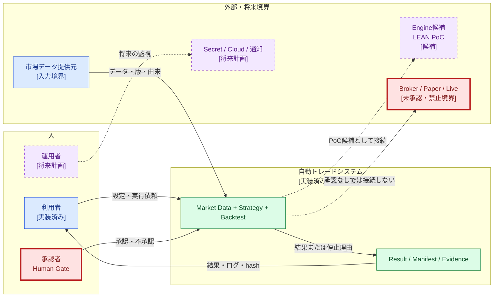
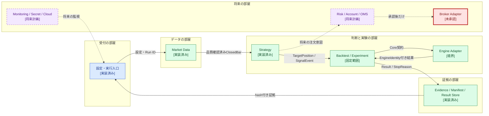
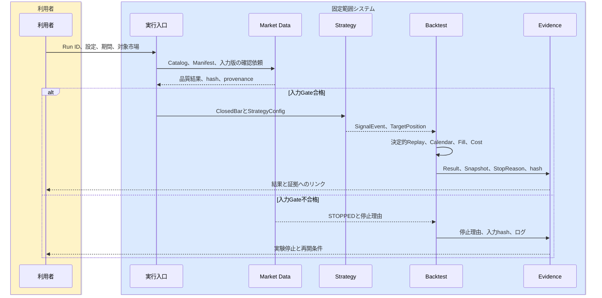
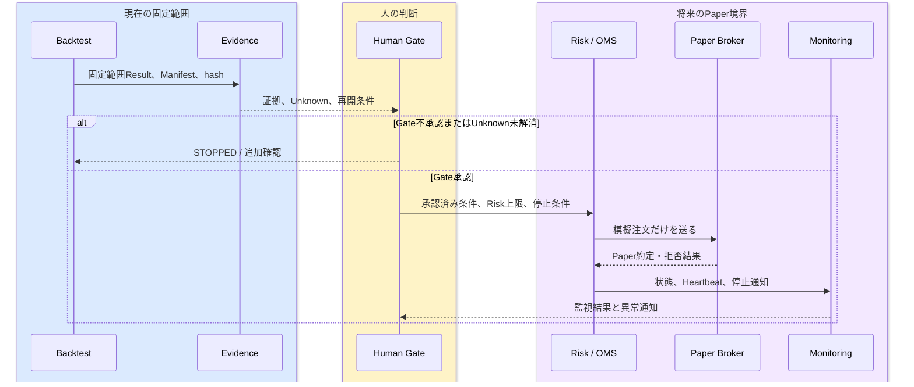

# RQU-05 C4 Level 1・2章別原稿

## 0. 文書情報

| 項目 | 内容 |
|---|---|
| ステップID | RQU-05 |
| 文書ID | `AT-REQ-001` |
| 版 | `candidate-0.1` |
| 基準日 | 2026-08-10 |
| 状態 | 編集用ドラフト。正式正本ではない |
| 入力 | RQU-03要件追跡マトリクス、RQU-04 C4構成・用語・Mermaid仕様 |
| 正式化条件 | RQU-09B完了後のRQU-H3承認 |

この原稿では、システムを「建物」にたとえる。最初に街の中での位置を説明し、次に建物の中の部屋を説明する。たとえの後に、必ず正式なシステムの意味を書く。

## 1. 30秒で分かる要約

このシステムは、過去の市場データを使って、決めた売買ルールを公平に試すための仕組みである。まずデータの身元と品質を確認し、次に確定した足だけをStrategyへ渡し、最後にBacktestの結果と証拠を保存する。[REQ-CTX-003][REQ-DATA-001][REQ-STR-001][REQ-BT-001]

現在確認できているのは、固定した入力・固定したルール・固定した契約の範囲である。これは利益の保証でも、本番取引の許可でもない。長期データ、実際の手数料、正式Calendar、Broker、Paper、Live、Secret、Cloudは別のHuman Gateで確認する。[REQ-GATE-001][REQ-GATE-002][REQ-GATE-003][REQ-GATE-004]

## 2. 状態の読み方

| 表示 | 意味 | 現在の扱い |
|---|---|---|
| `[実装済み]` | 現在のコードまたは正式設計に責務がある | 青、実線 |
| `[固定範囲で確認済み]` | 固定入力・固定契約の証拠がある | 緑、証拠ID付き |
| `[承認済み延期/Unknown]` | 延期は承認済みだが、問題は未解消 | 黄、破線、`UNK-*`付き |
| `[将来計画]` | いつか作る候補または移行条件 | 紫、破線 |
| `[未承認/禁止境界]` | 人の承認なしには接続・実行してはいけない | 赤、太線、停止矢印 |

色だけでは判断しない。図の中に状態名、理由、要求ID、証拠IDを書く。[REQ-QA-001][REQ-GATE-001]

## 3. C4 Level 1: System Context

### 3.1 建物で考える

Level 1は、「この建物は街のどこにあり、誰が使うか」を説明する。利用者は実験の条件を入力し、システムは過去データを再生して、結果または停止理由を返す。人の承認が必要な門を、プログラムが勝手に開けてはいけない。[REQ-CTX-003][REQ-GATE-001]

正式には、自動トレードシステムと外部の利用者・運用者・承認者・市場データ提供元・Engine候補・将来のBrokerなどの関係を示す。LEANはローカルPoCの主候補であり、最終Engineの採用決定ではない。[REQ-EXE-001][REQ-EXE-003]

### 3.2 Context Diagram

**この図で見るポイント**

- 青・緑は、現在の固定範囲で扱う入口・処理・証拠である。
- 紫の破線は将来候補であり、今すぐ使えるという意味ではない。
- 赤は人の承認なしに越えられない境界である。[REQ-GATE-001][REQ-GATE-002]

### 3.3 Level 1の登場人物と境界

| 登場人物・外部 | できること | できないこと・停止条件 | 要求・状態 |
|---|---|---|---|
| 利用者 | 条件を入力し、Backtestの結果と証拠を見る | 証拠なしに結果を本番利用へ進めない | `REQ-CTX-003`、`REQ-QA-001` |
| 運用者 | 将来、実行状態・停止・復旧を確認する | 現在はCloud、通知、Live運用を開始しない | `REQ-OPS-001`、`REQ-OPS-005`、`PLANNED` |
| 承認者 | Human Gateを承認・不承認する | AIやコードの自動判断で代替しない | `REQ-GATE-001`、`REQ-GATE-002` |
| 市場データ提供元 | 市場データを提供する外部境界 | 取得可否、長期期間、品質、費用が未確認なら採用しない | `REQ-DATA-001`、`UNK-P3-01/05/07` |
| Engine候補 | PoCでBacktestを実行する候補 | LEANを最終採用済みとは書かない | `REQ-EXE-001`、`PLANNED` |
| Broker / Paper / Live | 将来、外部注文・模擬注文へつながる境界 | 現在は接続、実注文、Paper実行を行わない | `REQ-EXE-003`、`REQ-GATE-003`、`NOT_AUTHORIZED` |
| Secret / Cloud / 通知 | 将来の運用基盤 | Secretを投入せず、Cloudを実行環境と呼ばない | `REQ-OPS-001`、`REQ-OPS-006`、`REQ-OPS-007` |

### 3.4 情報の入口と出口

| 矢印 | 送るもの | 受け取るもの | 失敗したら | 追跡 |
|---|---|---|---|---|
| 利用者→システム | Run ID、期間、対象市場、設定、実行依頼 | 受付結果、入力不足の理由 | 必須項目不足なら開始しない | `REQ-CTX-003`、`REQ-BT-002` |
| データ→Market Data | raw/DBN、Catalog、版、由来 | 正規化データ、品質判定、Manifest | 欠損・順序異常・hash不一致なら停止 | `REQ-DATA-001`〜`REQ-DATA-007` |
| システム→利用者 | Result、停止理由、Manifest、hash、ログ | 後から確認できる証拠 | 証拠保存に失敗した結果は採用しない | `REQ-BT-002`、`REQ-QA-001` |
| 承認者→境界 | Human Gateの承認または不承認 | 次段階へ進めるかの状態 | 不承認・未承認なら停止 | `REQ-GATE-001`〜`REQ-GATE-004` |
| Core↔Engine候補 | Core契約、Engine結果、EngineIdentity | 型付き結果 | SDK型漏れ・identity不整合なら停止 | `REQ-EXE-001`、`REQ-EXE-002` |

## 4. 現在できること、まだしてはいけないこと

### 4.1 現在できること

- 固定入力をManifestとhashで識別し、品質Gateを通してBacktestへ渡す。[REQ-DATA-001][REQ-BT-002]
- ClosedBarと決定的Replayを使い、同じ入力を同じ順番で再生する。[REQ-STR-009][REQ-BT-001]
- Turtleの比較ルールからTargetPositionを作り、結果と停止理由を保存する。[REQ-STR-001][REQ-STR-004][REQ-STR-005]
- 固定範囲のGolden、Bias、Snapshot/restore、look-ahead拒否を検証する。[REQ-QA-001][REQ-QA-002][REQ-QA-003][REQ-QA-004]

### 4.2 まだしてはいけないこと

- LEANを最終Engineとして採用済みと断定しない。[REQ-EXE-001]
- Brokerへ接続しない。PaperやLiveを開始しない。[REQ-EXE-003][REQ-GATE-003]
- Secret、Cloud、実注文、利益性、頑健性を、固定BacktestのPASSだけで採用しない。[REQ-OPS-006][REQ-GATE-004]
- `UNK-P3-01`、`UNK-P3-05`、`UNK-P3-07`を解消済み・PASSと書かない。[REQ-GATE-003]

## 5. C4 Level 2: Container

### 5.1 部屋の役割で考える

Level 2は、建物の中の部屋を説明する。各Containerは役割を持ち、決めた形式の情報だけを受け渡す。部屋の中の詳しい担当者はLevel 3で説明する。[REQ-CTX-003][REQ-EXE-002]

### 5.2 Container Diagram

**この図で見るポイント**

- Market Dataは、データをそのままStrategyへ渡さず、品質を確認する。[REQ-DATA-002][REQ-DATA-003]
- Strategyの出力は目標状態であり、Broker注文ではない。[REQ-STR-009][REQ-RISK-006]
- Risk・OMS・Brokerは将来境界であり、承認なしには矢印を実線にしない。[REQ-GATE-001][REQ-EXE-003]

### 5.3 Containerの通信契約

| 送信元 | 送るもの | 受信先 | 受け取るもの | 失敗時の停止 | 要求ID |
|---|---|---|---|---|---|
| 設定・実行入口 | `ExperimentPlan`、設定版、Run ID | Market Data / Backtest | 受付結果 | 設定版が不明なら開始しない | `REQ-BT-002`、`REQ-OPS-002` |
| Market Data | `MarketEvent`、`ClosedBar`、provenance | Strategy | 品質確認済みの入力 | future、重複、時間逆行、M30来歴不足で停止 | `REQ-DATA-003`、`REQ-STR-009` |
| Strategy | `SignalEvent`、`TargetPosition`、将来の`OrderIntent` | Backtest / 将来Risk | ルール判断の結果 | ルール設定不整合・未確定足で停止 | `REQ-STR-001`〜`REQ-STR-009` |
| Backtest | `ExperimentManifest`、Replay、Calendar、Fill設定 | Engine Adapter | 実験結果、停止理由 | Manifest、Calendar、Data Gate不合格で停止 | `REQ-BT-001`〜`REQ-BT-005` |
| Engine Adapter | Core型、EngineIdentity | Backtest | 型付きEngine結果 | SDK漏れ、未許可Engine、版違いで停止 | `REQ-EXE-001`、`REQ-EXE-002` |
| Backtest | Result、Snapshot、ログ、hash | Evidence Store | 保存済み証拠 | 保存不整合なら結果を採用しない | `REQ-BT-002`、`REQ-QA-003` |
| Strategy | TargetPosition / OrderIntent候補 | Risk / OMS | 将来のRisk判定入力 | 現在は未承認のため外部注文へ進めない | `REQ-RISK-006`、`REQ-EXE-003` |

## 6. Backtest実行シーケンス

過去データを再生する時は、受付、入力確認、Strategy、実験、証拠保存の順番を守る。途中で分からないことが出たら、安全のため停止し、理由を保存する。[REQ-BT-001][REQ-BT-002][REQ-GATE-001]

**この図で見るポイント**

- 入力Gateが合格する前にStrategyや外部Engineを動かさない。
- `TargetPosition`は結果の一部であり、外部注文ではない。
- 結果だけでなく、停止理由と証拠も利用者へ返す。[REQ-QA-001][REQ-RISK-007]

## 7. 将来Paperへ進む時の境界

Paperは、実際のお金を使わない模擬取引である。しかし、Backtestが合格しただけでPaperへ進めるわけではない。実データ、Risk、OMS、Broker Adapter、Secret、監視、運用日数などを別に確認し、人が承認する。[REQ-GATE-001][REQ-GATE-003][REQ-GATE-004]

このシーケンスは将来設計であり、現在の実装・接続・運用実績を表さない。未承認の矢印は破線または「未承認」と表示し、実線に変える条件をHuman Gateとして記録する。[REQ-OPS-001][REQ-OPS-005][REQ-OPS-006]

## 8. Level 1・2の要求追跡

| 要求ID | 要件定義書での説明 | 実装・設計の根拠 | テスト・証拠 | 現在状態 |
|---|---|---|---|---|
| `REQ-CTX-003` | 対象市場は取得可否・長期データ・運用条件を確認して決める | Phase 0資料、P3-D14 | `UNK-P3-01` | `UNDECIDED` |
| `REQ-CTX-004` | 初期3〜5市場は固定範囲、20〜40市場は将来候補 | P3-AC-07、P3-D09 | synthetic 5市場 | `VERIFIED_FIXED_SCOPE` / 拡大はUnknown |
| `REQ-DATA-001` | 入力データをCatalog、版、由来とともに扱う | `manifest.py`、`catalog_resolver.py` | Market Data tests | `IMPLEMENTED` |
| `REQ-DATA-003` | 時間足とM30 provenanceを固定する | `quality.py`、`service.py`、`runner.py` | M30固定Run | `VERIFIED_FIXED_SCOPE` |
| `REQ-DATA-004` | Calendarの固定ケースを守り、未来のCalendarを受け入れない | `calendar_port.py` | Calendar tests | `VERIFIED_FIXED_SCOPE` / 継続追随は`UNK-P3-07` |
| `REQ-DATA-007` | Roll、cost、slippage、Gapは実値確認まで採用値と呼ばない | `roll_model.py`、`fill_model.py` | P3-D09 | `APPROVED_DEFERRED_UNKNOWN` |
| `REQ-STR-001` | Strategy variantとTurtleルールを分けて扱う | `turtle_rules.py`、P3-D04 | Golden tests | `VERIFIED_FIXED_SCOPE` |
| `REQ-STR-009` | ClosedBar、TargetPosition、SnapshotをStrategy契約にする | `contracts.py`、`service.py` | Strategy 116件 | `VERIFIED_FIXED_SCOPE` |
| `REQ-BT-001` | 同じ入力を同じ順序でReplayする | `replay_order.py`、`runner.py` | Backtest tests | `VERIFIED_FIXED_SCOPE` |
| `REQ-BT-002` | Manifest、hash、Result、Evidenceを結び付ける | `experiment_manifest.py`、`manifest.py` | Manifest/replay evidence | `VERIFIED_FIXED_SCOPE` |
| `REQ-EXE-001` | Engine候補をPoCで比較し、最終採用を別Gateにする | `engine_adapter.py`、P3-D10 | LEAN PoC | `PLANNED` / 最終未決定 |
| `REQ-EXE-003` | Brokerは候補であり、Paper・Liveは別承認とする | P3-D14 | まだ外部接続なし | `NOT_AUTHORIZED` |
| `REQ-OPS-001` | Shadow/Paper/LiveのCloud実行は将来要件 | P3-D14 | なし | `PLANNED` / `NOT_AUTHORIZED` |
| `REQ-QA-001` | 固定入力・共通Core・証拠で検証する | P3-D06/P3-D09/P3-D14 | RUN-P3-INT-001 | `VERIFIED_FIXED_SCOPE` |
| `REQ-GATE-001` | Backtest→Shadow→Paper→Liveの順にGateを通る | P3-D14 | H3-4 | `PLANNED` / 次段階未承認 |

## 9. RQU-05完了判定

- [x] 中学生向けの建物・部屋の例えをLevel 1・2の冒頭に置いた。
- [x] Context図、Container図、Backtestシーケンス、将来Paper境界シーケンスを作成した。
- [x] 通信表に送信、受信、失敗時の停止を記載した。
- [x] 実装済み、固定範囲、将来、未承認を色・ラベル・線種で区別した。
- [x] LEANを最終決定済みと書いていない。
- [x] Broker、Paper、Live、Secret、Cloud、利益採用の未承認境界を明示した。
- [x] 要求文と追跡表にREQ ID、実装、証拠、Unknownを付けた。

**RQU-05判定:** `COMPLETED_FOR_RQU-06_INPUT`
