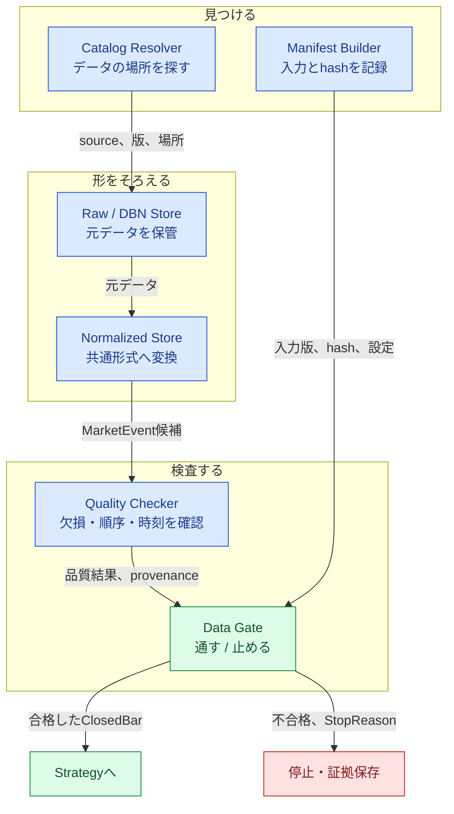
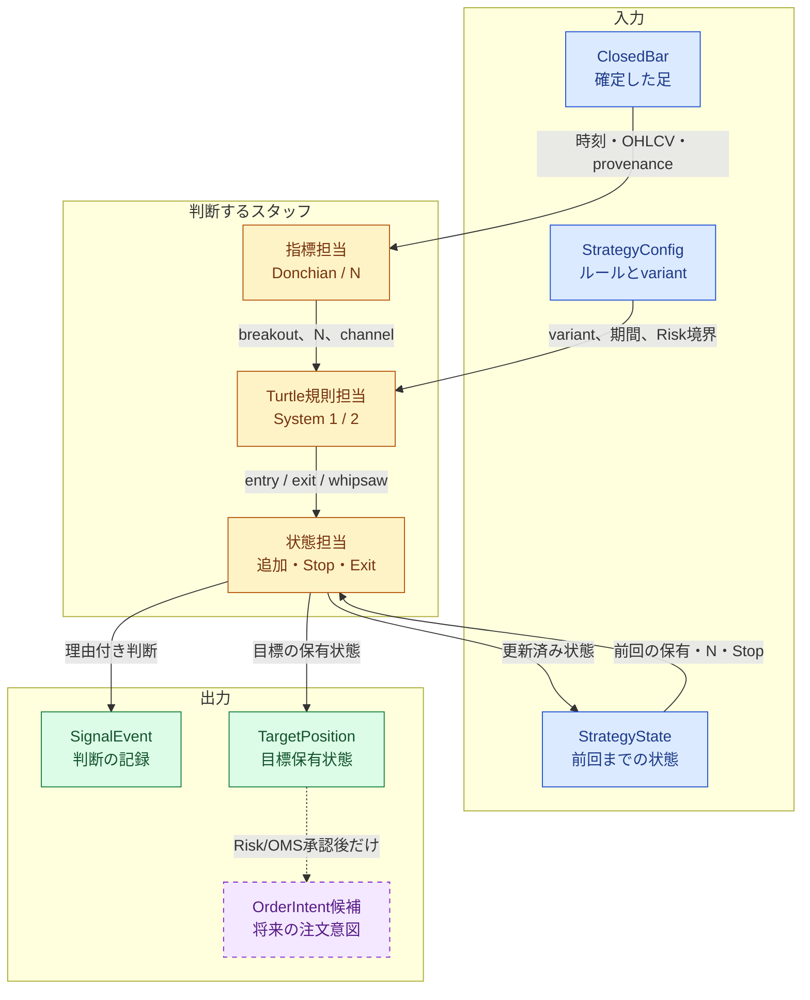
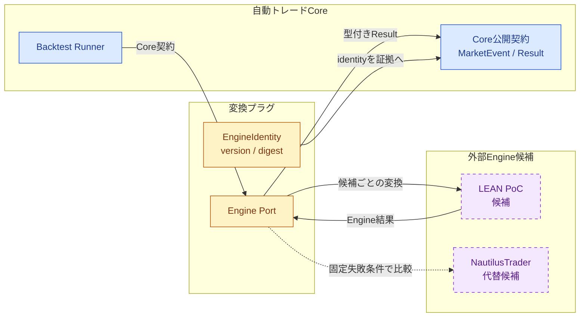
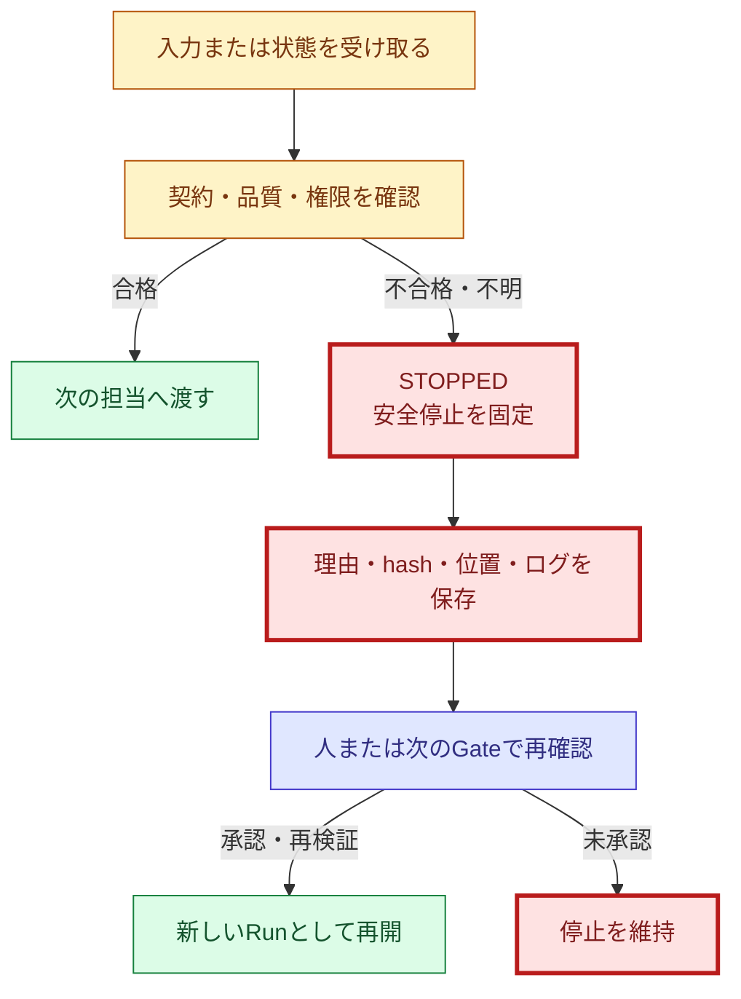
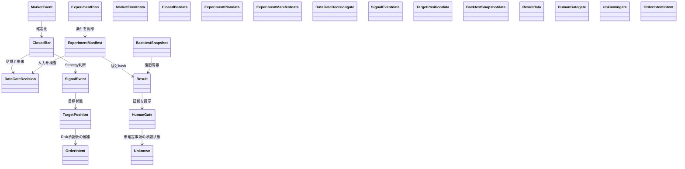
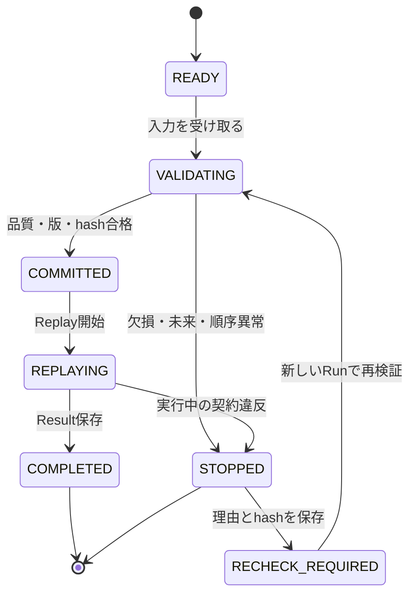
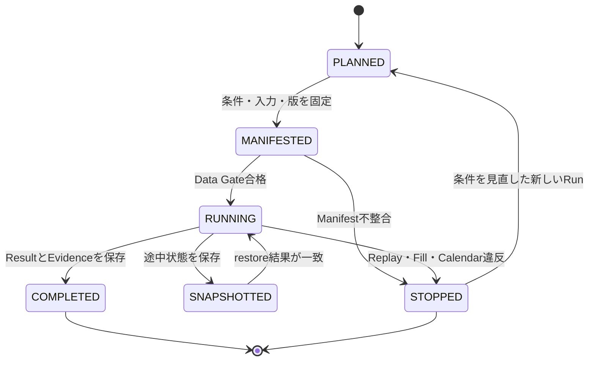
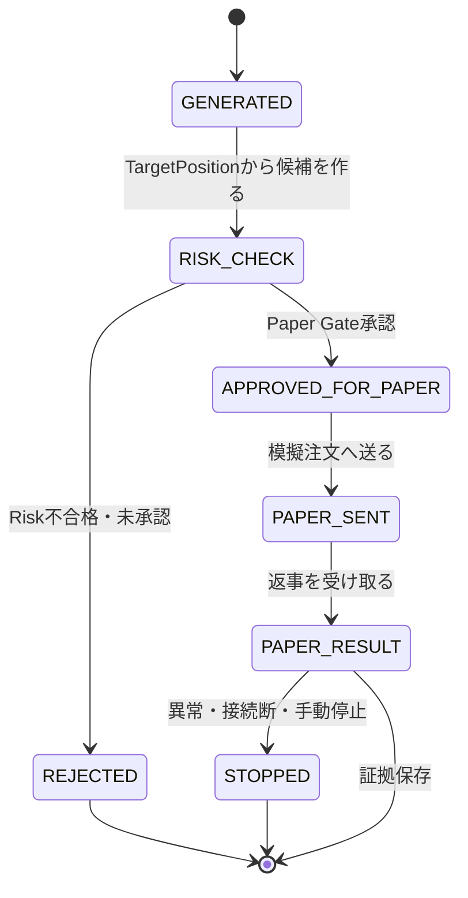
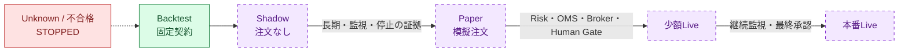

# RQU-06 C4 Level 3・4および横断章原稿

## 0. 文書情報

| 項目 | 内容 |
|---|---|
| ステップID | RQU-06 |
| 文書ID | `AT-REQ-001` |
| 版 | `candidate-0.1` |
| 基準日 | 2026-08-10 |
| 状態 | 編集用ドラフト。正式正本ではない |
| 入力 | RQU-03要件追跡マトリクス、RQU-04 C4仕様、RQU-05 Level 1・2原稿 |
| 詳細化の境界 | 要件に必要な概念、責務、入出力、状態、停止条件、証拠まで。全クラスの実装詳細は既存詳細設計へリンク |

この原稿では、「部屋の中の専門スタッフ」と「スタッフが見るマニュアル」を説明する。Level 3は担当同士の仕事の流れ、Level 4はデータと状態の関係に絞る。[REQ-CTX-003][REQ-EXE-002]

## 1. C4 Level 3: Component

### 1.1 Market Dataの専門スタッフ

Market Dataの部屋には、データを見つける担当、形をそろえる担当、品質を確認する担当、保存する担当がいる。品質が悪いデータを後ろの部屋へ渡さない。[REQ-DATA-001][REQ-DATA-002][REQ-DATA-003]

**主要フロー**

1. Catalogから入力の場所、期間、銘柄、版を確認する。[REQ-DATA-001]
2. Rawを保存し、Normalized形式へ変換する。[REQ-DATA-002]
3. 時刻、順序、欠損、時間足、provenanceを確認する。[REQ-DATA-003][REQ-DATA-004]
4. Manifestとhashを照合し、合格した入力だけをStrategyへ渡す。[REQ-BT-002]
5. 不合格なら `STOPPED` と理由を保存し、後ろの処理を開始しない。[REQ-GATE-001][REQ-RISK-007]

### 1.2 Strategyの専門スタッフ

Strategyは、確定した足を受け取り、Turtleルールと設定を使って判断する。Strategyは口座全体のRiskや、実際の注文枚数を決めない。[REQ-STR-001][REQ-RISK-006]

**必須契約**

- 未確定の足、未来の値、時間が逆戻りした入力、重複入力を拒否する。[REQ-STR-009]
- M30は実M1連続30本から作り、provenanceが不足する場合は停止する。[REQ-DATA-003]
- System 1 / System 2、Long / Short、Stop、Exit、追加方式は設定とvariantとして区別する。[REQ-STR-001][REQ-STR-002][REQ-STR-004][REQ-STR-005][REQ-STR-006][REQ-STR-007]
- `TargetPosition`は「目指す保有状態」であり、Brokerへ送る注文ではない。[REQ-RISK-006]
- `OrderIntent`候補は将来のRisk/OMS入力であり、現在の外部注文を意味しない。[REQ-EXE-003]

### 1.3 Backtest / Experimentの専門スタッフ

Backtestは、過去のデータを決めた順番で再生する。入力・設定・版をManifestに封じ、Replay、Calendar、Cost、Fill、Snapshot、Resultを同じ実験IDで結び付ける。[REQ-BT-001][REQ-BT-002][REQ-BT-003]

```mermaid
flowchart LR
  subgraph PLAN["実験の受付"]
    EXP["ExperimentPlan\n期間・市場・設定"]
    MAN["ExperimentManifest\nversion / hash"]
  end
  subgraph REPLAY["過去を再生"]
    ORDER["Replay Order\n時刻順・重複拒否"]
    CAL["Calendar\n取引可能時間"]
    AGG["Timeframe Aggregator\nM1→M30"]
  end
  subgraph EXEC["仮想約定"]
    STRAT["Strategy Core"]
    FILL["Fill / Cost / Roll"]
    SNAP["Snapshot / Restore"]
  end
  subgraph RESULT["記録"]
    RES["Result"]
    AUDIT["Evidence / Audit"]
  end
  EXP -->|"実験条件"| MAN
  MAN -->|"入力版・hash"| ORDER
  ORDER -->|"時間順Event"| CAL
  CAL -->|"取引時間"| AGG
  AGG -->|"provenance付き足"| STRAT
  STRAT -->|"TargetPosition"| FILL
  FILL -->|"仮想約定・費用"| RES
  STRAT -->|"状態"| SNAP
  SNAP -->|"再開位置"| ORDER
  RES -->|"結果・停止理由"| AUDIT
  MAN -->|"Manifest同値性"| AUDIT
  classDef plan fill:#fef3c7,stroke:#b45309,color:#78350f;
  classDef replay fill:#dbeafe,stroke:#1d4ed8,color:#1e3a8a;
  classDef exec fill:#dcfce7,stroke:#15803d,color:#14532d;
  classDef audit fill:#e0e7ff,stroke:#4338ca,color:#312e81;
  class EXP,MAN plan;
  class ORDER,CAL,AGG replay;
  class STRAT,FILL,SNAP exec;
  class RES,AUDIT audit;
```

**Backtestの停止条件**

| 検査 | 停止理由 | 要求ID |
|---|---|---|
| Manifest | 入力版、設定版、hash、sourceが一致しない | `REQ-BT-002` |
| Replay順序 | Eventの重複、時間逆行、未来入力 | `REQ-BT-001` |
| Calendar | 未確認の営業日・休場日・Rollを採用しようとした | `REQ-DATA-004`、`REQ-DATA-007` |
| M30 | 実M1連続30本またはprovenanceが不足する | `REQ-DATA-003` |
| Fill / Cost | Gap、Stop、次bar、intrabar ambiguityが契約外 | `REQ-BT-005` |
| Snapshot | restore後の状態・Manifest・位置が一致しない | `REQ-BT-003` |

### 1.4 Engine Adapterの境界

外部Engineは、建物の外から来る翻訳係である。Coreは外部SDK固有の型を直接知らず、Adapterが型付き契約へ変換する。[REQ-EXE-001][REQ-EXE-002]

最終Engineは、PoCの結果だけで決めない。Paper環境の証拠、再現性、外部仕様、運用境界を別に確認する。[REQ-EXE-001][REQ-GATE-003]

### 1.5 安全停止の共通フロー

安全停止は、分からない時に進まないブレーキである。停止しても、理由、入力hash、現在位置、再開条件を証拠に残す。[REQ-RISK-007][REQ-QA-003]

## 2. C4 Level 4: Code / Detail

### 2.1 概念データ関係

Level 4は、実装クラスの全フィールドを読む章ではない。要件を理解し、既存詳細設計・コード・テストへたどれる最小のデータ関係を示す。[REQ-QA-001][REQ-QA-003]

**概念と実装名の対応**

| 要件上の概念 | 現在の主な実装名 | 詳細設計・テスト | 状態 |
|---|---|---|---|
| `MarketEvent` / `ClosedBar` | `strategy.contracts`、Market Dataの正規化型 | P3-D04、P3-D05 | `IMPLEMENTED` |
| `SignalEvent` | `strategy.contracts.SignalEvent` | Strategy詳細設計、Golden | `IMPLEMENTED` |
| `TargetPosition` | `strategy.contracts.TargetPosition` | P3-D04、Strategy tests | `IMPLEMENTED` |
| `OrderIntent` | 現在は外部注文ではない契約上の概念 | Risk/OMS境界の将来設計 | `PLANNED` |
| `ExperimentManifest` | `backtest.contracts.ExperimentManifest`、`experiment_manifest.py` | P3-D05、Manifest tests | `IMPLEMENTED` |
| `DataGateDecision` | `backtest.contracts.DataGateDecision`、`runner.py` | P3-D05、Data Gate tests | `IMPLEMENTED` |
| `BacktestSnapshot` | `backtest.contracts.BacktestSnapshot`、`snapshot.py` | P3-D05、restore tests | `IMPLEMENTED` |
| `Result` | `backtest.contracts`のResult DTO | P3-D05、Replay evidence | `IMPLEMENTED` |
| `HumanGate` | 統合台帳、Phase承認記録、Run承認記録 | P3-D14、RQU台帳 | `GOVERNANCE` |
| `Unknown` | 統合台帳、RQU-03追跡表 | `UNK-P3-01/05/07` | `APPROVED_DEFERRED_UNKNOWN` |

### 2.2 Data Gate状態

`STOPPED`から勝手に`COMMITTED`へ戻さない。入力・設定・証拠を新しいRunで再確認する。[REQ-DATA-003][REQ-BT-002][REQ-RISK-007]

### 2.3 Experiment状態

### 2.4 注文意図の状態

この状態図の`APPROVED_FOR_PAPER`以降は将来のPaper境界である。現在のBacktest結果から直接遷移できない。[REQ-EXE-003][REQ-GATE-003]

## 3. 重要な品質・安全要件

### 3.1 再現性

- Manifestは入力、設定、版、source、hashをまとめ、結果と同じExperiment IDへ結び付ける。[REQ-BT-002]
- Replayは時刻順を固定し、重複・時間逆行・未来入力を停止する。[REQ-BT-001]
- Snapshot/restore後は、位置、StrategyState、Manifest、設定版が一致することを確認する。[REQ-BT-003]
- Resultは数値だけでなく、停止理由、入力hash、EngineIdentity、証拠へのリンクを持つ。[REQ-QA-003]

### 3.2 look-aheadとClosedBar

過去のテストで未来の答えを先に見たら、成績は正しく見えても公平ではない。そのため、Strategyは確定した足だけを受け取り、未来時刻の入力、未確定足、順序逆転を拒否する。[REQ-STR-009][REQ-BT-001]

### 3.3 M30の由来

M30は、実M1を連続30本集めて作る。M15を2本つなぐだけの近道は使わない。M1の範囲、時刻、銘柄、入力hashが確認できないM30は、StrategyやBacktestへ渡さず停止する。[REQ-DATA-003][REQ-QA-002]

### 3.4 Fail-Closedと手動停止

分からない、壊れている、承認されていない場合は、進めずに止める。停止は一時的な表示ではなく、`STOPPED`、理由、hash、Run ID、再開条件を証拠に残す。外部注文が将来存在しても、安全停止は新規注文を止める側へ働く。[REQ-RISK-007][REQ-OPS-003][REQ-OPS-004]

## 4. 非機能要件と運用境界

| 分類 | 要件 | 現在の状態 | 要求ID |
|---|---|---|---|
| 再現性 | 同じ入力・設定・版で同じReplay結果を作る | 固定範囲で確認済み | `REQ-BT-001`〜`REQ-BT-003` |
| 監査性 | Result、Manifest、hash、ログを後から追跡する | 実装済み | `REQ-QA-001`、`REQ-QA-003` |
| 品質 | Golden、Bias、固定Gate、レビューを組み合わせる | 固定範囲で確認済み | `REQ-QA-002`〜`REQ-QA-004` |
| 環境分離 | Offline、host isolation、固定入力を確認する | 固定範囲で確認済み | `REQ-OPS-007` |
| Secret | Secretをログ、Manifest、Resultへ出力しない | 外部運用は未承認 | `REQ-OPS-006`、`NOT_AUTHORIZED` |
| 通知 | 新規注文、停止、接続断、Heartbeatを監視する | 将来計画 | `REQ-OPS-003`〜`REQ-OPS-005` |
| 復旧 | Snapshot/restoreと手動停止後の再開条件を持つ | Core固定範囲で確認済み | `REQ-BT-003`、`REQ-RISK-007` |

## 5. BacktestからLiveまでの移行条件

段階は `Backtest → Shadow → Paper → 少額Live → 本番Live` の順である。前の段階の証拠がないまま次へ進めない。[REQ-GATE-001][REQ-GATE-002]

| 段階 | 確認すること | 次へ進む条件 | 現在 |
|---|---|---|---|
| Backtest | 固定入力、ルール、Replay、証拠 | 固定契約GateとレビューがPASS | 固定範囲で確認済み |
| Shadow | 実データを読むが注文しない | 長期データ、監視、停止、復旧の証拠 | 未承認 |
| Paper | 模擬注文、Risk、OMS、Broker Adapter | Paper最低運用日数、異常系、再現性、人の承認 | 未承認 |
| 少額Live | 実注文を小さく開始 | 資金、証拠金、Risk値、停止、通知、Human Gate | 未承認 |
| 本番Live | 実運用 | すべての採用判断と継続監視 | 未承認 |

利益性、最大DD、1Nリスク、volatility、銘柄別最適化は目標または比較基準であり、達成保証や投資助言ではない。[REQ-RISK-001][REQ-RISK-002][REQ-RISK-003][REQ-RISK-005]

## 6. Q1〜Q30の現在状態

旧IDは消さない。現在の要求ID、実装・証拠、将来・未確定を分けて示す。[REQ-QA-001]

| 旧ID | 現行REQ | 現在の扱い | 状態 |
|---|---|---|---|
| Q1 | `REQ-STR-001` | 原典版と現代版をvariantとして比較 | 固定範囲検証あり |
| Q2 | `REQ-CTX-003` | 対象アセットは取得可否・長期データ確認後に決定 | 未確定 |
| Q3 | `REQ-CTX-004` | 初期3〜5市場、20〜40市場は将来候補 | 固定範囲限定 |
| Q4 | `REQ-STR-002` | Long / Short両方向 | 固定範囲確認済み |
| Q5 | `REQ-GATE-004` | 初期Live資金の制約は構想上の目標 | Live許可ではない |
| Q6 | `REQ-OPS-004` | 月額費用は目標、実績ではない | 未確定 |
| Q7 | `REQ-EXE-003` | IBKRは候補、接続・Paper・Liveは別Gate | 未承認 |
| Q8 | `REQ-RISK-001` | 最大DD15%は評価基準、保証ではない | 将来評価 |
| Q9 | `REQ-RISK-002` | 1Nリスク1%は原典比較基準 | 未確定 |
| Q10 | `REQ-RISK-003` | 年率10% volatilityは参考基準 | 未決定 |
| Q11 | `REQ-STR-003` | Strategy比較を段階的に拡大 | 固定範囲 |
| Q12 | `REQ-STR-004` | System 1勝ちブレイクを比較 | 固定範囲確認済み |
| Q13 | `REQ-STR-005` | intraday近似とclose-confirmedを分離 | 固定範囲確認済み |
| Q14 | `REQ-STR-006` | ピラミッディングをvariant比較 | 一部固定 |
| Q15 | `REQ-STR-007` | 2N Stop、Whipsaw、volatility縮小 | 実市場未確定 |
| Q16 | `REQ-RISK-005` | Unitリスクは契約・DD・Paper後に決定 | 未確定 |
| Q17 | `REQ-RISK-006` | StrategyとRisk/Account/OMSを分離 | 固定境界実装済み |
| Q18 | `REQ-STR-008` | 4/6/10/12 Unitを比較基準 | 基準として保持 |
| Q19 | `REQ-DATA-007` | Rollと連続Signalは正式Calendar後に決定 | `UNK-P3-05/07` |
| Q20 | `REQ-DATA-008` | 1分足を正本、上位足を決定生成 | 固定範囲確認済み |
| Q21 | `REQ-EXE-001` | EngineはPoC比較、最終決定は別Gate | LEAN候補 |
| Q22 | `REQ-OPS-001` | Shadow/Paper/Live Cloudは将来要件 | 未承認 |
| Q23 | `REQ-OPS-002` | Strategy設定と共通設定を分離、版/hash追跡 | 固定範囲実装済み |
| Q24 | `REQ-GATE-001` | Shadow→Paper→少額Live→本番Live | 将来Gate |
| Q25 | `REQ-OPS-003` | 新規注文、接続断、停止、Heartbeatを監視 | 将来計画 |
| Q26 | `REQ-RISK-007` | 異常時は新規注文を止め、手動停止・復旧条件を持つ | Core固定範囲確認済み |
| Q27 | `REQ-OPS-005` | Push通知とHeartbeat | 未確定・将来 |
| Q28 | `REQ-OPS-006` | Secret Manager、最小権限、Secret非出力 | 未承認 |
| Q29 | `REQ-QA-001` | Broker内蔵Backtestに依存せず共通Coreと証拠で検証 | 固定範囲確認済み |
| Q30 | `REQ-GATE-002` | 本番前に最終ChecklistとHuman Gate | 未承認 |

## 7. OD-01〜OD-08の現在状態

| 旧ID | 現行REQ | 決めること | 現在状態 | 決める時期 |
|---|---|---|---|---|
| OD-01 | `REQ-CTX-003` | 対象アセットと初期市場 | `UNDECIDED` | 長期データ・取得可否確認後 |
| OD-02 | `REQ-EXE-001` | 最終Engine | LEAN主PoC候補、最終未決定 | Paper証拠後 |
| OD-03 | `REQ-DATA-007` | Roll / continuous signal | `UNDECIDED` | 正式Calendar・市場別データ後 |
| OD-04 | `REQ-RISK-002` | Liveの1Nリスク | `UNDECIDED` | Paper前 |
| OD-05 | `REQ-RISK-003` | volatility強制制御 | `UNDECIDED` | Risk設計時 |
| OD-06 | `REQ-OPS-001` | 東京CloudのOS/VM | 未承認 | Shadow前 |
| OD-07 | `REQ-OPS-005` | Push通知サービス | `UNDECIDED` | Shadow前 |
| OD-08 | `REQ-GATE-003` | Paper/Live最低運用日数 | `UNDECIDED` | 移行判定前 |

## 8. テスト・証拠・レビューの読み方

テストに合格した範囲を明示し、長期の利益性や本番安全性へ一般化しない。[REQ-QA-001][REQ-QA-004]

| 証拠 | 分かること | 分からないこと |
|---|---|---|
| Strategy Golden | Turtleルール、variant、Signal、TargetPositionの固定入力結果 | 実市場の利益、本番注文 |
| Backtest Replay | 時刻順、Manifest、hash、Fill、Snapshot/restoreの契約 | 長期市場の頑健性、実費用 |
| Bias / Holdout | 固定範囲のBias・Holdout契約 | 市場数拡大、未来の利益 |
| WSL隔離Gate | 固定Runのhost isolation、4 Gate、fixture/hash | Broker、Cloud、Paper、Live |
| 専門レビュー | 要件・設計・コード・証拠の追跡と安全境界 | Unknownの解消そのもの |

## 9. 残存Unknownと再開条件

| Unknown | 内容 | 再開条件 | 現在の扱い |
|---|---|---|---|
| `UNK-P3-01` | 長期データ、市場数、長期holdout | 市場・期間・Catalog・品質・split・hashを固定した別Run | `APPROVED_DEFERRED_UNKNOWN` |
| `UNK-P3-05` | 市場別cost、slippage、Gap | 市場別の実値、Gap規則、感度分析、fixture | `APPROVED_DEFERRED_UNKNOWN` |
| `UNK-P3-07` | 正式Calendarの継続追随 | 公式版、更新監視、欠損時停止、fixture | `APPROVED_DEFERRED_UNKNOWN` |
| `RQU-UNK-01` | 実ブラウザでのMermaid画面幅・文字レイアウト | RQU-08B/Cの候補HTML表示確認 | 部分解消、未PASS |

Unknownは「まだ証拠が足りない」状態であり、PASSではない。要件定義書を読みやすくしても、Unknownの状態は変わらない。[REQ-GATE-003]

## 10. Phaseロードマップ

現在のPhase 3完了判定は `COMPLETE_WITH_APPROVED_UNKNOWN` であり、Phase 4は計画・境界設計・隔離検証準備までである。Broker接続、Paper、Live、Secret、Cloud、利益採用は別承認が必要である。[REQ-GATE-001][REQ-GATE-003][REQ-GATE-004]

## 11. RQU-06完了判定

- [x] Market Data、Strategy、Backtest、Engine Adapter、安全停止のコンポーネント図と主要フローを作成した。
- [x] MarketEvent、OrderIntent、TargetPosition、Experiment、Manifest、Snapshot、Result、Gate、Unknownの概念関係図を作成した。
- [x] Data Gate、Experiment、注文意図の状態遷移を作成した。
- [x] M30の実M1連続30本、provenance不足時停止を説明した。
- [x] Manifest/hash、決定的Replay、Snapshot/restore、ClosedBar、look-ahead拒否を説明した。
- [x] 実装クラスの全詳細を複製せず、既存詳細設計への追跡境界を置いた。
- [x] Q1〜Q30、OD-01〜08を現在・履歴・将来・未確定に分けた。
- [x] `UNK-P3-01/05/07`を`APPROVED_DEFERRED_UNKNOWN`として残した。
- [x] 投資助言、利益保証、銘柄別最適化を追加していない。

**RQU-06判定:** `COMPLETED_FOR_RQU-06R_INPUT`
