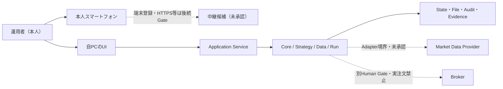

# 自動トレードシステム要件定義書v2 断片F01：基礎要件（章00〜12）

| 項目 | 内容 |
|---|---|
| Document set ID | `AT-REQ-V2-SET-001` |
| Fragment | `F01` |
| Step | `RQV2-05` |
| 状態 | `DRAFT_BODY`（章00〜12の要求本文candidate） |
| 作成日 | 2026-08-11 |
| 編集所有権 | F01のみ。章13〜62は各担当断片の正本とする。 |
| 正本入力 | `RQU-20`章00〜12、RQV2-01〜03成果物、RQV2-04執筆規約 |
| 参照入力 | `RQU-11`、RQU-12A/B、RQU-13A〜19A、RQV2要件UIテスト追跡マトリクス、統合台帳 |
| 安全境界 | 外部取得、Broker接続、Secret、Paper注文、Live注文、実資金、Cloud公開、Core/UI本体変更は行わない。 |

> 本断片は要件candidateであり、実装済み・実運用済み・利益性を主張しない。`CONFIRMED`は方針または入力の確定状態、`NOT_IMPLEMENTED`は本v2要求の実装状態を示す。

## 00. 文書情報

### 00.1 文書の位置付け

本書は、RQU-20が指定した新要件定義書の基礎部分を記載する作業用Markdownである。RQU-20は「実際の要求本文」ではなく、何をどの粒度で書くかを指定する構成正本であるため、本断片ではRQV2-02の追跡表、RQV2-03のUI抽出、既存Core基準線を根拠として、読者が同じ境界を読める形へ変換する。正式HTML、`doc/index.html`、実装コードはRQV2-13以降の対象である。

### 00.2 文書状態と根拠の読み方

| 表示 | 本断片での意味 |
|---|---|
| `CONFIRMED` | 回答・撤回訂正・承認記録で現行方針として採用した。 |
| `HISTORY` | 過去の回答または構成上の履歴。現行要求の根拠に単独使用しない。 |
| `LATER_GATE` | 形は要求に含めるが、具体値・接続・実行許可は後続Gateで決める。 |
| `UNKNOWN` | 根拠または実証が不足しており、決めずに台帳へ残す。 |
| `NOT_IMPLEMENTED` | v2要求に対する実装状態。既存Coreの固定契約PASSへ一般化しない。 |
| `PASS_WITH_OPERATOR_OVERRIDE` | 運用者が継続を許可した判定であり、欠落証拠を機械PASSへ変換しない。 |

### 00.3 参照先

- 構成正本: [RQU-20](../../RQU-20_要件定義書ゼロベース完全再構成案_2026-08-11.md)
- 入力台帳: [RQV2-01](../../RQV2_入力台帳_2026-08-11.md)
- Core基準線: [RQV2-01 Core](../../RQV2_既存Core再利用基準線_2026-08-11.md)
- Q・UC・UI追跡: [RQV2-02](../../RQV2_要件UIテスト追跡マトリクス_2026-08-11.md)
- UI抽出: [RQV2-03](../../RQV2_03_UIモック抽出記録_2026-08-11.md)
- 統合状態: [統合台帳](../../../doc/00_全Phase残課題Blocked統合台帳.html)

## 01. Findings first：現状を捨てて再構成する際の主要課題

要件本文を読み始める前に、RQU-20の主要Findingと本断片での扱いを示す。未解決Findingを本文の完成宣言で消去しない。

| Finding ID | 重大度 | 問題 | 本断片での対応 | 状態 |
|---|---:|---|---|---|
| `RQU-20-F-001` | Critical | 回答が原子要求へ変換されておらず、実装対象を判定できない。 | `REQ-V2-*`、Q、UC、受入条件を同じ要求ブロックへ置く。 | `OPEN_FOR_REVIEW` |
| `RQU-20-F-002` | Critical | 目的と操作が開始から停止・復旧まで通読できない。 | 章02・10・12とE2Eシナリオを接続する。 | `OPEN_FOR_REVIEW` |
| `RQU-20-F-003` | Critical | Backtest、Shadow、Paper、Liveの意味が混在する。 | 本断片は段階境界だけを定義し、詳細は章23以降へ参照する。 | `LATER_GATE` |
| `RQU-20-F-004` | High | 利用者、Strategy、運用単位、時間足、口座の関係が一意でない。 | 章07〜09で責務とIDを固定し、詳細モデルはF02へ渡す。 | `OPEN_FOR_REVIEW` |
| `RQU-20-F-005` | High | 通信断、入力不正、再起動、復旧時の動作が不足する。 | 章10・12で停止・復旧の共通シナリオを定義する。 | `OPEN_FOR_REVIEW` |
| `RQU-20-F-006` | High | ログイン不要と遠隔公開・安全確認が混同される。 | 単一運用者、端末・通信境界、Human Gateを別要求として記載する。 | `OPEN_FOR_REVIEW` |
| `RQV2-01-F-001` | High | `tests/evidence/phase1/`が物理的に存在しない。 | `RQV2-BLK-001`の運用者上書きと欠落事実を保持する。 | `PASS_WITH_OPERATOR_OVERRIDE` |
| `RQV2-03-UI-GAP` | Medium | 既存UIモックに18件の要件差分がある。 | UI本体を変更せず、章37以降の後続断片へ参照する。 | `RECORDED` |

## 02. 新要件定義書の完成条件

### 02.1 読者別の読了ゴール

| 読者 | この断片を読み終えた時点で判断できること |
|---|---|
| 運用者 | 何が目的で、何が対象外で、どの操作が開始・停止・復旧へつながるか。 |
| UI設計者 | 基本導線、禁止・確認・停止状態、21画面追跡への入口。 |
| 実装者 | 要求の入力、出力、境界、状態、保存、例外、実装状態の記法。 |
| テスト担当 | Q、UC、Screen、State、Test、Evidenceへ戻れる受入条件。 |
| 保守担当 | 現行方針、履歴、後続Gate、Unknown、変更管理の境界。 |

### 02.2 F01の完了条件

- 章00〜12に本文があり、各章がRQU-20の同名章へ戻れる。
- `REQ-V2-*`のshall文が根拠QまたはRQU-20・承認記録へ接続される。
- 67 UCの正本テンプレートと索引があり、詳細追跡表へのリンクがある。
- 単一運用者とログイン不要を、端末登録・通信保護・Human Gate・危険操作確認から分離する。
- E2E図と文章が同じ開始・確認・実行・停止・復旧の順序を示す。
- 未実装・未実証・後続Gateを実装済みと記載しない。

### 02.3 本断片の非目的

本断片では、具体的なProvider／Broker、Secret値、実資金額、実注文、最終性能値、Cloud公開方式、スマートフォンからの安全な外部到達方式を確定しない。これらは形・停止条件・決定時期を追跡し、根拠が得られる後続Gateへ送る。

### REQ-V2-0001 文書の完成条件を追跡可能にする

- Shall: 本要件定義書は、各要求に根拠、受入条件、実装状態、実現Phaseを付け、Q・UC・Screen・State・Test・Evidenceへ追跡できなければならない。
- Source: RQU-20 §2、RQU-20 §4、RQV2-04、RQV2-02 §4
- Reason: 要求の意味と実装・検証範囲を分離して確認するため。
- Assumptions: Q・UC・UIの入力IDはRQV2-02で一意に確認済み。正式IDはRQV2-04規約へ写像する。
- Inputs: `REQ-V2-*`、Q-ID、UC-ID、Screen ID、State ID、Test ID、Evidence ID。
- Processing: 正本要求を1件ずつ採番し、参照節では同じshall文を複製しない。
- Outputs: 要求ブロック、追跡リンク、未対応一覧。
- Exceptions: 根拠不明、ID衝突、証拠不存在は未確定または停止として記録する。
- Stop: Critical/Highの根拠欠落、ID重複、UnknownのPass化を検出した場合。
- Recovery: 根拠資料または運用者判定を追記し、レビュー後に再開する。
- Persistence: 要求本文、根拠、状態、変更履歴、レビューFindingを保存する。
- Acceptance: F06の追跡表で要求から根拠・成果物・テストを往復できること。
- Implementation status: `NOT_IMPLEMENTED`
- Target phase: v2正式化後のPhase 4以降

## 03. 入力資料、優先順位、撤回管理

### 03.1 入力の正本

現行回答はRQU-12A/B、RQU-13A、RQU-14A、RQU-15A、RQU-16A、RQU-17A、RQU-18A、RQU-19AをQ範囲単位で参照する。構成・必須記載事項はRQU-20、UI・画面状態・既存対応はRQU-UI資料とRQV2-03、現在の停止条件とHuman Gateは統合台帳を参照する。旧HTMLは現行要求の構成正本ではなく、差分・履歴の確認に限る。

### 03.2 優先順位

明示的な撤回・訂正・後続補足がある場合は、それを現行として採用する。Q-277は撤回履歴として扱う。初期候補は`MCL / M6A / MZC / MZS / MZW`の5件を現行入力とし、過去の件数混同やP2データ変換用レコードを候補選定と混同しない。Q-243、安全境界、実行可能性、性能は、文書停止の理由ではなく後続Gateと実証条件として残す。

### REQ-V2-0002 現行入力の優先順位を固定する

- Shall: システム要件の執筆者は、同じ論点に複数記録がある場合、明示的な訂正・撤回・後続補足を先行記録へ優先して採用しなければならない。
- Source: RQU-20 §3.2、RQU-19、RQU-19A、RQV2-01入力台帳
- Reason: 撤回済み方針や古い未決定事項が現行要求へ復活することを防ぐため。
- Assumptions: 後続回答が現行状態を明示しない場合は勝手に解決しない。
- Inputs: Q-ID、回答版、撤回記録、承認記録、統合台帳。
- Processing: 現行・履歴・後続Gate・Unknownを分類し、採用理由を記録する。
- Outputs: 現行要求のSource列、HISTORY行、LATER_GATE／UNKNOWN行。
- Exceptions: 記録間で解消不能な衝突がある場合はFindingとする。
- Stop: 必須要求の根拠が衝突し、現行採用範囲を決められない場合。
- Recovery: 運用者の訂正、追加回答、またはGate判定を受領する。
- Persistence: 採用版、撤回版、理由、確認日、参照リンクを保持する。
- Acceptance: Q表でQ-277、初期5候補、Q-243の扱いを履歴・現行・後続へ区別できること。
- Implementation status: `NOT_IMPLEMENTED`
- Target phase: v2正式化前の文書品質Gate

### REQ-V2-0003 Q回答を一行単位で追跡する

- Shall: Q-01〜Q-305およびQ-22A/B/Cは、分類、要求ID、UC、Screen／State、Test、Gate／Evidenceを持つ一行単位の追跡対象でなければならない。
- Source: RQU-20 §3.3、RQV2-02 §4
- Reason: 回答の補足・例外・後続条件を要求の一部として失わないため。
- Assumptions: RQV2-02でQ行308件、欠落0、重複0を確認済み。
- Inputs: Q-ID、回答本文、分類、RQU-20章、既存UI追跡、Core状態。
- Processing: Qを原子要求へ分解し、枝番と履歴を保持する。
- Outputs: F06の完全追跡行、章・要求・UC・テストリンク。
- Exceptions: 回答が質問形式、未回答、撤回、履歴のみの場合は状態をそのまま記録する。
- Stop: 根拠のないREQを作成する場合。
- Recovery: 原資料または追加回答を受領して行を再分類する。
- Persistence: Q行、採用理由、状態、決定時期、証拠先を保存する。
- Acceptance: F06でQ行から本断片のREQとRQU-20章へ戻れること。
- Implementation status: `NOT_IMPLEMENTED`
- Target phase: v2正式化前の追跡Gate

## 04. 要求の書き方とID体系

### 04.1 原子要求の書き方

shall文は主体、条件、対象、観測可能な動作を持つ。一文に複数の独立判定を詰め込まず、入力、正常処理、例外、停止、復旧、保存、受入を別欄に置く。数値が未決定の場合は推測値を入れず、入力欄・単位・決定時期・未入力時の停止を要求化する。

### 04.2 IDと状態

正本IDはRQV2-04で固定した`REQ-V2-0001`形式を使う。RQV2-02の`REQ-RQV2-Q-*`は入力別名、RQU-11の`ADD-UC-*`は既存UC別名として保持し、意味を変更しない。画面は`SCREEN-01`〜`SCREEN-21`、共通状態は`STATE-V2-*`、Human Gateは`GATE-V2-*`、未確定事項は`UNK-V2-*`とする。

### REQ-V2-0004 原子要求の必須欄を欠かさない

- Shall: 本断片の正本要求は、shall文、根拠、理由、前提、入力、処理、出力、例外、停止、復旧、保存、受入条件、実装状態、実現Phaseを持たなければならない。
- Source: RQU-20 §4、RQV2-04 §5
- Reason: 実装者・テスト担当が判断なく境界と受入範囲を理解するため。
- Assumptions: 未確定欄は`UNKNOWN`または`LATER_GATE`を付け、空欄で隠さない。
- Inputs: 要求候補、根拠Q、UC、設計判断、Gate、証拠。
- Processing: 1要求1動作へ分解し、正本節に採番する。
- Outputs: 要求ブロックと参照リンク。
- Exceptions: 曖昧なshall、複数動作、根拠なしはレビューFindingとする。
- Stop: 必須欄の欠落または状態語の矛盾を検出した場合。
- Recovery: 追加根拠または分割案を記録し再レビューする。
- Persistence: 要求ID、版、変更差分、レビュー履歴を保存する。
- Acceptance: 必須欄の機械検索とA90のFindings-firstレビューがPASSすること。
- Implementation status: `NOT_IMPLEMENTED`
- Target phase: v2執筆・レビューGate

### REQ-V2-0005 要求と参照節を分離する

- Shall: 同じ要求のshall文は一つの正本節だけに置き、別章では要求IDと目的を参照しなければならない。
- Source: RQU-20 §4.1、RQV2-04 §8
- Reason: 複数章の重複記述が異なる状態・停止条件へ分岐することを防ぐため。
- Assumptions: 機能説明、画面説明、テスト手順は正本要求を参照する。
- Inputs: 要求ID、章anchor、Screen／UC／Testリンク。
- Processing: 正本節を選び、参照節のshall複製を除去する。
- Outputs: 一意な要求anchorと参照リンク。
- Exceptions: 複数領域が同じ要求を必要とする場合は共有正本を作る。
- Stop: 同一IDに異なるshall文がある場合。
- Recovery: A90レビューで正本節を決め、重複を参照へ置換する。
- Persistence: 正本章、参照章、変更履歴を保存する。
- Acceptance: ID単位の重複検索で正本shallが一件だけであること。
- Implementation status: `NOT_IMPLEMENTED`
- Target phase: RQV2-12統合・RQV2-13静的検査

## 05. 文書全体の読み方・利用者向け導線

読者は、最初に目的・非目的・安全境界を読み、次に機能地図、初回起動シナリオ、ユースケース索引、各専門章へ進む。要求IDからUC、画面、状態、テスト、証拠へ移動できるようにする。金融上の収益や勝率の保証ではなく、システム動作、再現性、停止・復旧、安全境界を定義する文書であることを冒頭で明示する。

### REQ-V2-0006 読者導線を要求・画面・証拠へ接続する

- Shall: 文書は、目的・非目的・機能地図・UC索引・章・画面・テスト・証拠をIDリンクで辿れる導線を提供しなければならない。
- Source: RQU-20 §5、RQV2-02、RQV2-03、RQV2-04 §7
- Reason: 読者が複数資料を推測でつなぎ合わせず、同じ要求の意味と検証範囲を確認するため。
- Assumptions: 正式HTMLのリンク検査はRQV2-13で行う。
- Inputs: 要求ID、UC、Screen、State、Test、Evidence、章anchor。
- Processing: canonical linkを作成し、相対パスとIDを検査する。
- Outputs: 目次、機能地図、相互リンク、参照表。
- Exceptions: 作業用Markdown段階で正式HTMLが未生成の場合は、将来リンク先を明示する。
- Stop: 孤立した正式HTMLまたは参照切れを検出した場合。
- Recovery: リンク先を正本へ戻し、RQV2-13で再検査する。
- Persistence: anchor対応表と検査結果を保存する。
- Acceptance: 要求→UC→Screen／State→Test／Evidenceの経路が一つ以上あること。
- Implementation status: `NOT_IMPLEMENTED`
- Target phase: RQV2-13以降

## 06. システムの目的、成功条件、非目的

### 06.1 目的

本システムは、市場データを準備し、Strategyを設定し、複数の銘柄・時間足・Strategyの組合せを検証・監視し、BacktestからForward、Shadow、Paper、Live候補、Liveへ段階的に進めるための操作・記録基盤を目指す。目的は、入力・設定版・データ版・Run・Signal・注文・Position・結果・操作・承認を再現可能に残し、異常時に新規処理を止めて人が確認できるようにすることである。

### 06.2 成功条件

成功条件は、機能が存在すること、操作が理解できること、安全停止が働くこと、同じ入力を再現できること、証拠を追跡できることを分けて評価する。固定fixtureのCore契約PASSは、実データ・実Broker・実利益・Paper・Liveの承認を意味しない。

### 06.3 非目的

収益・勝率・損失回避を保証しない。システムが最良設定を自動採用しない。複数ユーザ・アプリ内ログイン・RBAC・MFA・税務・会計・投資助言・法務判断の自動化は本断片の対象外とする。外部Push、Cloud／VM常時稼働、Broker、Secret、実注文は構造とGateを後続で定義するが、H1承認や本断片の作成によって許可しない。

### REQ-V2-0007 システムの目的と非目的を分離表示する

- Shall: 文書は、検証・監視・段階的運用・再現性・停止復旧を目的として記載し、収益・勝率・損失回避・投資助言を保証する目的として記載してはならない。
- Source: RQU-20 §6、RQU-11 §3、RQV2-01 Core基準線
- Reason: 技術的な動作確認を金融上の成果や運用承認と誤認させないため。
- Assumptions: 実資金・Paper・Liveの可否は別Gateで決まる。
- Inputs: 目的、成功条件、非目的、Core証拠範囲、Human Gate。
- Processing: capability、verified、approved、unknownを別状態へ分類する。
- Outputs: 目的表、非目的表、状態ラベル、免責境界。
- Exceptions: 回答が収益目的を含む場合は技術動作へ分解し、保証表現を除く。
- Stop: 実装・証拠から利益性や本番利用を推定する場合。
- Recovery: 根拠と対象範囲を再確認し、UnknownまたはGateへ戻す。
- Persistence: 状態、根拠、承認範囲、免責を保存する。
- Acceptance: 文書レビューで目的と金融成果の混同がないこと。
- Implementation status: `NOT_IMPLEMENTED`
- Target phase: v2正式化Gate

## 07. 利用者、外部主体、権限、安全確認

### 07.1 利用者モデル

利用者は開発者本人である単一の運用者とする。設定者、分析者、監視者、承認者、復旧担当を別ユーザへ分けない。アプリ内のユーザー登録、ログイン、ログアウト、パスワード、RBAC、MFA、複数人承認は本範囲で設けない。これは安全対策が不要という意味ではなく、OS・端末・Secret保管場所へのアクセス保護、端末登録、通信保護、危険操作確認、Human Gateを別の境界として残す。

### 07.2 外部主体

外部主体は、Market Data Provider、Broker、取引エンジン、時刻源、Calendar提供元、中継サービス、OS、ファイルシステムである。各主体との接続は、入力・出力・失敗影響・Secret・費用・承認・停止範囲を表で管理する。実接続は未実施であり、Provider／Broker名や接続方式を確定したこととは扱わない。

### 07.3 Human Gateと危険操作

Human Gateは本人認証ではなく、運用者が対象、設定、Risk、影響、停止方法を読んで進む意思決定である。Paper開始、Live昇格、Live自動承認ON、Kill解除、復旧後再開、削除、端末失効は、操作記録と対象範囲を伴う。Kill Switchは確認待ちで遅延させず実行できる境界を持つ。

### REQ-V2-0008 単一運用者とログイン不要を定義する

- Shall: 本システムは、開発者本人である単一の運用者を利用者とし、アプリ内ログイン・ユーザー登録・RBAC・MFAを必須機能として要求してはならない。
- Source: RQU-11 §1.1〜1.2、RQU-12A、RQU-15A §3.2、Q-207
- Reason: 現行方針の利用者モデルを複数ユーザ設計へ拡張せず、責務を明確にするため。
- Assumptions: OS、端末、リポジトリ、Secret保管場所のアクセス保護はシステム外の環境管理である。
- Inputs: ローカル環境、運用者操作、端末状態。
- Processing: アプリ内のユーザー識別を行わず、操作対象と時刻を記録する。
- Outputs: 画面、操作記録、Human Gate記録。
- Exceptions: 端末限定や遠隔利用を行う場合、認証不要の意味と到達範囲を別評価する。
- Stop: 認証不要を理由に無防備な公開、Secret露出、外部操作を許可しようとした場合。
- Recovery: 端末・通信境界を閉じ、別Human Gateで方式を決定する。
- Persistence: ユーザーアカウントではなく、操作時刻、対象、端末境界、承認記録を保存する。
- Acceptance: 文書・UI・テストでログイン機能と安全確認を混同していないこと。
- Implementation status: `NOT_IMPLEMENTED`
- Target phase: v2正式化後のPhase 4以降

### REQ-V2-0009 危険操作の確認と認証を分離する

- Shall: 本システムは、ログインを要求しない操作モデルでも、Paper／Live開始、危険な設定変更、Kill解除、復旧後再開に対象・影響・確認・取消・保存を示す安全確認を要求しなければならない。
- Source: RQU-11 §1.3、RQU-20 §7.3、Q-75、Q-127、Q-207〜Q-209、Q-248、Q-290、Q-293
- Reason: 本人認証と誤操作防止・外部影響の確認は目的が異なるため。
- Assumptions: 自動承認ONそのものを運用者のHuman Gateとして扱うが、実Broker接続・Secret・実注文の別Gateを省略しない。
- Inputs: 操作、対象運用単位、設定版、Risk、現在状態、確認文言。
- Processing: 対象と影響を表示し、確認後だけ状態遷移を許可し、記録する。
- Outputs: Dialog、状態遷移、監査イベント、通知。
- Exceptions: 対象不明、Risk未入力、状態不整合、復旧未完了は開始を拒否する。
- Stop: 安全確認を回避する操作、無承認の外部注文、停止中の自動再開を検出した場合。
- Recovery: STOPPED／UNAPPROVEDへ戻し、運用者確認後に再試行する。
- Persistence: Gate ID、対象、設定・Risk、確認時刻、結果、解除時刻を保存する。
- Acceptance: `DIALOG-V2-*`、`GATE-V2-*`、`TEST-V2-SEC-*`で確認・取消・記録を検証する。
- Implementation status: `NOT_IMPLEMENTED`
- Target phase: Phase 4以降の安全境界設計・実証Gate

### REQ-V2-0010 外部主体と失敗影響を列挙する

- Shall: 文書は、外部主体ごとに受信データ、送信データ、Secret、費用、失敗影響、停止範囲、再開条件、後続承認を記載しなければならない。
- Source: RQU-20 §7.2〜8.2、RQV2-01 Core基準線、RQV2-03 UI-GAP
- Reason: 外部依存をCoreの確定能力やローカル検証結果へ混入させないため。
- Assumptions: H1承認は外部接続・実注文を承認しない。
- Inputs: Provider、Broker、時刻源、Calendar、中継、OS、ファイルシステムの境界情報。
- Processing: Adapter境界で入出力と失敗を分類し、Coreと外部依存を分離する。
- Outputs: 外部主体表、境界図、停止・復旧条件、Unknown／Gate。
- Exceptions: 仕様未確認、接続未実証、費用未決定は`UNKNOWN`または`LATER_GATE`とする。
- Stop: 外部仕様を推測して接続済みと記載する場合。
- Recovery: 公式仕様・隔離実証・Human Gateを受領して更新する。
- Persistence: 境界、確認日、証拠、採否、変更履歴を保存する。
- Acceptance: Provider／Brokerの具体的な接続成功を主張せず、失敗時のfail-closedが読めること。
- Implementation status: `NOT_IMPLEMENTED`
- Target phase: Phase 4以降のAdapter・外部境界Gate

## 08. システム境界・全体構成・責務

### 08.1 概念境界

```
運用者 → UI / Application Service → Run・Job・Queue・Worker → Core
                                  ↘ State Store / File Store / Audit
Core → Strategy Plugin / Market Data / Timeframe・Calendar / Backtest / Mode Coordinator
外部主体 ↔ Adapter境界（Provider / Broker / Time / Relay）
```

UIは入力・表示・確認・停止操作を担当し、Application Serviceは要求を受けて検査・状態遷移・Job化を行う。CoreはProviderやBroker固有の形式を正本にせず、Adapterを介して標準モデルへ変換する。State Store／File Store／Auditは設定、Run、結果、操作、Gate、Evidenceの来歴を保持する。詳細なモジュール設計は後続Phaseの実装詳細設計へ渡す。

### 08.2 責務と依存方向

| 責務 | 入力 | 出力 | 外部依存 | 失敗時の基本境界 |
|---|---|---|---|---|
| UI / Web Client | 運用者操作、表示状態 | Command、画面表示、確認Dialog | Browser、端末 | 入力を送らず警告表示 |
| Application Service | Command、設定、状態 | 検査結果、Job、状態遷移 | State Store | 開始拒否または停止 |
| Run / Job / Queue | 実行要求、優先度 | 進捗、結果、失敗 | Worker、資源 | Job単位または全体停止 |
| Strategy Plugin | 正規化データ、設定版 | Signal、説明 | Strategy実装 | Signalを無効化し記録 |
| Market Data / Time | Raw・normalized・Calendar | 時系列、品質結果 | Provider Adapter | 欠損・時刻異常で開始停止 |
| Backtest / Mode Coordinator | Manifest、設定、状態 | Result、Position、証拠 | 時刻・注文Adapter | 対象Modeの停止 |
| Risk / Portfolio / OMS | Signal、残高、Risk | Target、OrderIntent、Order | Account・Broker Adapter | 新規注文停止、照合待ち |
| Audit / Evidence | 操作、状態、結果 | 記録、hash、レポート | File／DB | 証跡欠落を完了不可 |

### REQ-V2-0011 Coreと外部Adapterの責務を分離する

- Shall: システムは、Provider・Broker・中継サービス固有の形式をAdapter境界で変換し、Coreの正本モデルへ外部IDや外部仕様を直接漏らしてはならない。
- Source: RQU-20 §8、RQV2-01 Core再利用基準線、RQV2-04 ID規約
- Reason: 外部依存の差替え、Replay、監査、固定fixture検証を可能にするため。
- Assumptions: Broker・Providerの接続は未承認・未実証であり、Adapterの存在だけで接続可能とはしない。
- Inputs: 正規化入力、外部応答、外部ID、時刻、エラー。
- Processing: Adapterで変換・検証し、外部IDと内部IDの対応を記録する。
- Outputs: Coreの標準Entity、状態、警告、停止理由。
- Exceptions: 形式不一致、重複、通信断、未対応状態は拒否または停止する。
- Stop: 外部IDを内部正本として上書きする場合、変換不明の場合。
- Recovery: Adapter変換と照合を再実行し、運用者確認後に再開する。
- Persistence: 変換版、provenance、外部ID対応、エラー、証拠を保存する。
- Acceptance: Coreソースを変更せず、Adapter境界の入出力と停止を追跡できること。
- Implementation status: `NOT_IMPLEMENTED`
- Target phase: Phase 4以降のAdapter設計・PoC

### REQ-V2-0012 外部依存失敗時に安全側へ遷移する

- Shall: Provider、時刻源、状態Store、Brokerまたは中継の必須依存が不明・断・不整合になった場合、システムは新規の危険な処理を開始せず、理由と復旧条件を表示しなければならない。
- Source: RQU-20 §8、RQU-11 §1.3、Q-63、Q-65、Q-133、Q-239
- Reason: 通信断や状態差異を正常稼働として継続しないため。
- Assumptions: 再接続回数・待機時間など具体値は後続Gateで決める。
- Inputs: Heartbeat、接続状態、品質結果、状態差分、再接続設定。
- Processing: 依存ごとに影響範囲を判定し、STOPPED／RECOVERY／UNAPPROVEDへ遷移する。
- Outputs: 停止理由、警告、Incident、再開可能条件。
- Exceptions: 表示専用更新の失敗と注文・状態同期の失敗を同一扱いにしない。
- Stop: 必須依存の状態が確認できない場合。
- Recovery: 再接続、データ・注文・Position照合、運用者確認の順に再開する。
- Persistence: 接続イベント、状態差分、停止・再開、照合結果を保存する。
- Acceptance: 断・復旧・再起動を含む異常シナリオがTest／Evidenceへ接続すること。
- Implementation status: `NOT_IMPLEMENTED`
- Target phase: Phase 4以降のOps／Adapter／Run実証

## 09. 用語、識別子、時刻、単位

### 09.1 用語

「対応可能」「設定済み」「データ確認済み」「接続確認済み」「検証済み」「承認済み」は別状態とする。Backtest、Holdout、Walk-forward、Forward、Shadow、Paper、Live候補、Liveは、資金・外部注文・入力データ・停止条件・昇格条件の違いを持つ。Runは利用者が意味を確認できる一回の実行、Jobは実行可能な処理単位、Queueは待ち順序を管理する単位として後続章へ渡す。

### 09.2 識別子

内部IDは一度生成したら意味を再利用しない。表示名を変えても内部ID、作成版、親ID、来歴を維持する。外部IDは対応表の属性であり、内部の正本IDにしない。F02以降で、Instrument、Timeframe、Strategy、Strategy Version、Operation Unit、Run、Job、Manifest、Result、Signal、OrderIntent、Order、Fill、Positionを詳細化する。

### 09.3 時刻・単位

内部保存の基準時刻と、画面表示のJST・市場現地時刻・UTCを区別する。足の開始、終了、確定、判断、注文、約定、保存の時刻を別属性にする。価格・数量・金額・割合・時間・件数は単位、丸め、小数桁、欠損表現を一緒に管理する。夏時間、休日、短縮取引、日跨ぎ、同時刻イベント順序はF02の時間足詳細へ渡す。

### REQ-V2-0013 内部IDと外部IDを分離する

- Shall: システムは、内部のEntity・Event・Run・Order・Evidence IDを正本とし、外部Provider／Broker IDを対応属性として保持しなければならない。
- Source: RQU-20 §9.2、RQV2-04 ID規約、domain modeling Skill
- Reason: 外部システムの再採番・重複・再送で内部来歴が壊れることを防ぐため。
- Assumptions: 外部IDの仕様と寿命はProvider／Brokerごとに後続確認する。
- Inputs: 内部ID、外部ID、生成時刻、親子関係、provenance。
- Processing: 内部IDを一意生成し、外部IDの対応・重複・再送を検査する。
- Outputs: 一意Entity、対応表、重複警告、照合結果。
- Exceptions: 外部ID欠落、再利用、形式違反、複数内部IDへの対応は停止またはUnknown。
- Stop: 外部IDで内部Stateを直接上書きしようとした場合。
- Recovery: 対応関係を照合し、運用者の確認後に正本を確定する。
- Persistence: 内部ID、外部ID、版、対応時刻、監査イベントを保存する。
- Acceptance: 同じ外部IDの再送が二重Entityを作らず、照合へ戻れること。
- Implementation status: `NOT_IMPLEMENTED`
- Target phase: Phase 4以降の共通Domain／Adapter設計

### REQ-V2-0014 時刻と単位の意味を保存する

- Shall: 市場データ、Run、Signal、Order、Fill、Position、画面表示は、時刻の種類・タイムゾーン、単位、丸め、欠損状態を明示して保存しなければならない。
- Source: RQU-20 §9.3、RQU-11 §4、F02への引継ぎ
- Reason: 時間足の確定・判断時刻、価格・数量・金額を別の意味で比較しないため。
- Assumptions: 5時間足、Calendar、DST、Rollの詳細はRQV2-06で確定する。
- Inputs: UTC・JST・市場時刻、価格、数量、金額、割合、件数。
- Processing: 正規化、単位変換、丸め、時刻順序、欠損判定を行う。
- Outputs: 時刻付きEntity、表示値、品質警告、変換来歴。
- Exceptions: タイムゾーン不明、逆行、欠損、単位不明は開始停止またはUnknown。
- Stop: 時刻・単位が不明なままSignalやOrderの判断に使用する場合。
- Recovery: Calendar・単位・来歴を補完し、対象期間を再処理する。
- Persistence: 原値、正規化値、変換ルール、時刻、hashを保存する。
- Acceptance: 同一入力を同一時刻・単位規則でReplayできること。
- Implementation status: `NOT_IMPLEMENTED`
- Target phase: Phase 4以降のData／Timeframe設計

## 10. 機能地図とエンドツーエンド利用シナリオ

### 10.1 全能力地図

機能は、①起動・初期設定、②資産・銘柄・市場・時間足、③市場データ、④Strategy、⑤運用単位、⑥単一Backtest、⑦網羅検証、⑧結果分析・比較・出力、⑨Forward・Shadow、⑩Paper、⑪Live候補・Live・Human Gate、⑫Portfolio・Account・Risk、⑬Signal・注文・Fill・Position・照合、⑭監視・警告・Kill・復旧、⑮履歴・監査・削除・バックアップ、⑯PC・スマートフォンUIへ分ける。各能力の正本要求はF02〜F06の章へリンクする。

### 10.2 初回起動から停止・復旧まで

1. 運用者は自PCの固定された起動手順を実行し、ローカルUIと必要なローカルサービスの状態を確認する。
2. システムは、起動直後に`NORMAL`、`STOPPED`、`UNAPPROVED`、`RECOVERY`、`FAILED`などの現在状態、禁止事項、未承認項目を表示する。
3. 運用者は保存先、時刻・単位、初期候補、データ、Strategy、Account、Riskの未入力・後続Gateを確認する。
4. データ品質とManifestが検査済みになった後、単一Backtestを実行し、Result、ログ、設定版、証拠を確認する。
5. 複数条件、Forward、Shadow、Paper、Live候補へ進む場合は、各モードの開始条件とHuman Gateを確認する。実Broker・実資金・実注文は別Gateなしに開始しない。
6. データ断、処理失敗、Risk超過、注文差異、再起動を検出した場合は新規危険処理を止め、理由・範囲・復旧条件を表示する。
7. 運用者は照合・保存・確認を行い、明示的に再開する。復旧が完了しない場合は停止状態を維持する。

### REQ-V2-0015 起動直後に現在状態と禁止事項を表示する

- Shall: システムは、起動または再起動の直後に、全体状態、未承認項目、停止・復旧状態、禁止される操作、再開に必要な確認を表示しなければならない。
- Source: RQU-20 §10.2、§12、Q-191、Q-187、Q-209、RQV2-03 UI-GAP
- Reason: 起動しただけで自動運用・Live自動承認・注文送信が始まったと誤認させないため。
- Assumptions: 再起動後は運用単位を自動再開せず、Live自動承認はOFFへ戻す方針を採用する。
- Inputs: 起動結果、前回Snapshot、Run／Job、Mode、Gate、接続状態。
- Processing: 復旧要否と再開可否を判定し、初期画面へ状態を投影する。
- Outputs: 状態表示、警告、確認Dialog、再開ボタンの可否。
- Exceptions: DB移行失敗、ポート競合、保存先不足、前回状態不明はFAILED／RECOVERYとする。
- Stop: 前回の未照合注文・Position・状態差異がある場合。
- Recovery: 保存・照合・運用者確認後だけ再開可能とする。
- Persistence: 起動結果、前回状態、表示された警告、確認、再開時刻を保存する。
- Acceptance: 再起動後に自動再開せず、状態と再開条件をテストできること。
- Implementation status: `NOT_IMPLEMENTED`
- Target phase: Phase 4以降のApplication／Ops実証

### REQ-V2-0016 E2Eシナリオを開始から復旧まで保存する

- Shall: システムは、初回起動、設定、データ準備、Backtest、結果確認、停止、復旧、再開の各段階を、Run・操作・状態・証拠の追跡経路として記録しなければならない。
- Source: RQU-20 §10.2、RQU-11 §5、RQV2-02 UC追跡、RQV2-03 UI状態証跡
- Reason: 正常系だけでなく、停止・復旧を含む利用者価値と検証範囲を一つの流れで確認するため。
- Assumptions: 各モード固有の注文・Risk仕様はF03〜F05で詳細化する。
- Inputs: 操作、画面、状態、Run、設定版、データManifest、停止理由、復旧結果。
- Processing: シナリオ段階ごとに状態遷移とEvidenceを関連付ける。
- Outputs: E2E記録、進捗、完了・停止・復旧状態、次操作。
- Exceptions: 必須入力不足、Gate未承認、品質不良、外部断は分岐として保存する。
- Stop: シナリオの必須段階が未達の場合、次モードへの昇格を禁止する。
- Recovery: 失敗段階から再開可能な入口と再検査条件を示す。
- Persistence: E2E ID、操作時刻、状態、ログ、Evidence、Gateを保存する。
- Acceptance: 図と文章が同じ順序を示し、各段階からUC・Screen・Testへ辿れること。
- Implementation status: `NOT_IMPLEMENTED`
- Target phase: v2正式化後のPhase 4以降

### 10.3 境界図



図の実線は本断片で説明するローカル操作・Core・保存の概念経路、点線は後続の境界・実証・承認が必要な候補経路である。スマートフォンからの到達、公開範囲、端末ペアリング、中継方式は未確定であり、図の点線を接続済みと解釈しない。Brokerへ実注文を送る経路は本Stepで許可されない。

### REQ-V2-0017 境界図と文章の意味を一致させる

- Shall: 文書は、運用者、PC／スマートフォン、UI、Application、Core、保存、Provider、Brokerの責務・依存・未承認境界を図と文章の両方で同じ意味に示さなければならない。
- Source: RQU-20 §8、§10、RQU-14A Q-190、RQU-15A Q-211/Q-225、RQV2-03
- Reason: 図だけを見て外部接続済み・遠隔公開済み・Live可能と誤認しないため。
- Assumptions: 端末・通信・外部接続は後続Gateで検証する。
- Inputs: 責務表、依存方向、通信境界、状態、Gate。
- Processing: 実線・点線、許可・未承認、内部・外部を同じ用語で記述する。
- Outputs: Mermaid図、同等の平文説明、境界表。
- Exceptions: 図と文章の不一致、リンク切れ、未承認経路の許可表現はFindingとする。
- Stop: 図または文章が外部注文・無防備な公開を許可する場合。
- Recovery: 境界を再分類し、A90レビューとGateへ戻す。
- Persistence: 図版、入力、レビュー結果、版を保存する。
- Acceptance: 図の全主要ノードが文章・責務表・要求へ接続されること。
- Implementation status: `NOT_IMPLEMENTED`
- Target phase: RQV2-13静的検査、Phase 4以降の外部境界設計

## 11. ユースケース仕様の正本

### 11.1 67 UCの正本テンプレート

各UCは次の順序で記載する。既存`ADD-UC-*`は入力別名として残し、正式candidateでは`UC-V2-001`〜`UC-V2-067`へ写像する。

```text
### UC-V2-001 <名称>
- Legacy ID: ADD-UC-001
- 目的・利用者価値:
- 主体・外部主体:
- 対象資産・銘柄・時間足・Strategy・Mode:
- 開始条件・事前確認・未承認時の禁止:
- 操作手順:
- 画面応答・内部処理・保存:
- 完了条件・結果確認場所:
- 取消可能時点・取消後状態:
- 入力不足・競合・通信断・処理失敗:
- 停止範囲・安全側動作:
- 復旧・再開条件:
- SCREEN / STATE / REQ / TEST / Source Q:
- Evidence / Implementation status / Target phase:
```

### 11.2 UC索引

索引の画面、状態、E2E候補、根拠Qの詳細は[ RQV2-02 §3](../../RQV2_要件UIテスト追跡マトリクス_2026-08-11.md#3-67ユースケースの追跡骨格)へリンクする。以下は67件の正規IDと既存別名・名称の対応であり、同じUCを新規作成するための表ではない。

| 正規UC | 既存別名 | 名称 |
|---|---|---|
| `UC-V2-001` | `ADD-UC-001` | システムの現在状態と禁止事項を確認する |
| `UC-V2-002` | `ADD-UC-002` | 初期設定を確認・変更する |
| `UC-V2-003` | `ADD-UC-003` | データ提供元を設定する |
| `UC-V2-004` | `ADD-UC-004` | Broker、Paper、通知、Cloudの接続状態を確認する |
| `UC-V2-005` | `ADD-UC-005` | Strategy一覧と設定版を確認する |
| `UC-V2-006` | `ADD-UC-006` | 運用単位一覧を確認する |
| `UC-V2-007` | `ADD-UC-010` | Asset Class、銘柄、市場を登録・選択する |
| `UC-V2-008` | `ADD-UC-011` | データ期間と時間足を指定する |
| `UC-V2-009` | `ADD-UC-012` | データを取得・インポートする |
| `UC-V2-010` | `ADD-UC-013` | 取得状況と更新日時を確認する |
| `UC-V2-011` | `ADD-UC-014` | データ品質を確認する |
| `UC-V2-012` | `ADD-UC-015` | 欠損・重複・時刻逆行を確認する |
| `UC-V2-013` | `ADD-UC-016` | データを再取得・再処理する |
| `UC-V2-014` | `ADD-UC-017` | Catalog、Calendar、Roll、version、hash、provenanceを確認する |
| `UC-V2-015` | `ADD-UC-020` | Strategyを作成する |
| `UC-V2-016` | `ADD-UC-021` | Turtle variant、Long／Short、Stop、Exit、追加を設定する |
| `UC-V2-017` | `ADD-UC-022` | Strategyを複製・比較・版管理する |
| `UC-V2-018` | `ADD-UC-023` | Strategy設定を検証する |
| `UC-V2-019` | `ADD-UC-024` | Strategyを有効化・無効化する |
| `UC-V2-020` | `ADD-UC-025` | 銘柄・時間足・Strategy・口座・運用モードを運用単位へ割り当てる |
| `UC-V2-021` | `ADD-UC-026` | 複数運用単位を同時に開始する |
| `UC-V2-022` | `ADD-UC-027` | 運用単位を一時停止・再開・終了する |
| `UC-V2-023` | `ADD-UC-028` | 変更前後の設定差分を確認する |
| `UC-V2-024` | `ADD-UC-030` | Backtest条件を入力する |
| `UC-V2-025` | `ADD-UC-031` | 入力・Manifest・データ品質の事前検証を行う |
| `UC-V2-026` | `ADD-UC-032` | Backtestを開始する |
| `UC-V2-027` | `ADD-UC-033` | Queue、進捗、実行中状態を確認する |
| `UC-V2-028` | `ADD-UC-034` | Backtestを取消・停止・再実行する |
| `UC-V2-029` | `ADD-UC-035` | 完了、停止、失敗の理由を確認する |
| `UC-V2-030` | `ADD-UC-036` | 損益・Drawdown・取引・Signalを確認する |
| `UC-V2-031` | `ADD-UC-037` | 銘柄別・時間足別・Strategy別に結果を絞り込む |
| `UC-V2-032` | `ADD-UC-038` | 複数Runを比較する |
| `UC-V2-033` | `ADD-UC-039` | Holdout、Walk-forward、感度分析を実行する |
| `UC-V2-034` | `ADD-UC-040` | Result、Manifest、hash、ログを保存・出力する |
| `UC-V2-035` | `ADD-UC-041` | 同一条件を再Replayし、結果一致を確認する |
| `UC-V2-036` | `ADD-UC-050` | Forward Testを開始する |
| `UC-V2-037` | `ADD-UC-051` | Shadowを開始・停止・再開する |
| `UC-V2-038` | `ADD-UC-052` | Paperを開始・停止・再開する |
| `UC-V2-039` | `ADD-UC-053` | 少額Liveへの移行条件を確認する |
| `UC-V2-040` | `ADD-UC-054` | 本番Liveへの移行条件を確認する |
| `UC-V2-041` | `ADD-UC-055` | 稼働中の現在状態を確認する |
| `UC-V2-042` | `ADD-UC-056` | 最新データ、Heartbeat、次回判断時刻を確認する |
| `UC-V2-043` | `ADD-UC-057` | Signal、仮想注文、実注文を確認する |
| `UC-V2-044` | `ADD-UC-058` | 約定、部分約定、拒否、取消を確認する |
| `UC-V2-045` | `ADD-UC-059` | Strategy想定と実績の差分を確認する |
| `UC-V2-046` | `ADD-UC-060` | 残高・証拠金・余力を確認する |
| `UC-V2-047` | `ADD-UC-061` | 全体・銘柄別・Strategy別ポジションを確認する |
| `UC-V2-048` | `ADD-UC-062` | 1Nリスク、最大DD、損失上限を確認する |
| `UC-V2-049` | `ADD-UC-063` | 新規注文のRisk判定を確認する |
| `UC-V2-050` | `ADD-UC-064` | 注文を確認・取消・訂正する |
| `UC-V2-051` | `ADD-UC-065` | Broker口座とシステム内状態を照合する |
| `UC-V2-052` | `ADD-UC-066` | 反対Signal、重複注文、ポジション競合を処理する |
| `UC-V2-053` | `ADD-UC-070` | 全体稼働状況を確認する |
| `UC-V2-054` | `ADD-UC-071` | データ遅延・接続断・Heartbeat異常を確認する |
| `UC-V2-055` | `ADD-UC-072` | 通知を確認し、対応済みにする |
| `UC-V2-056` | `ADD-UC-073` | 個別運用単位を停止する |
| `UC-V2-057` | `ADD-UC-074` | 全体Kill Switchを実行する |
| `UC-V2-058` | `ADD-UC-075` | 停止理由と再開条件を確認する |
| `UC-V2-059` | `ADD-UC-076` | 再起動後にSnapshotから復旧する |
| `UC-V2-060` | `ADD-UC-077` | 復旧後にデータ・注文・ポジションを照合する |
| `UC-V2-061` | `ADD-UC-080` | Result、Run、Manifest、hashを検索する |
| `UC-V2-062` | `ADD-UC-081` | 操作履歴を確認する |
| `UC-V2-063` | `ADD-UC-082` | 設定変更履歴を確認する |
| `UC-V2-064` | `ADD-UC-083` | Human Gateの確認記録を確認する |
| `UC-V2-065` | `ADD-UC-084` | レポートを出力する |
| `UC-V2-066` | `ADD-UC-085` | 設定をロールバックする |
| `UC-V2-067` | `ADD-UC-086` | 古いRun・データ・ログをアーカイブする |

### REQ-V2-0018 67 UCを一意に収容する

- Shall: 要件定義書は、RQU-11／RQV2-02で追跡した67件のUCを、各一回の正規ID・目的・操作・例外・停止・復旧・Screen／State／REQ／Test／Source Qで収容しなければならない。
- Source: RQU-11 §5、RQU-20 §11、RQV2-02 §3
- Reason: 機能の存在を画面一覧だけでなく、利用者が実行する操作単位で確認するため。
- Assumptions: `ADD-UC-*`は既存追跡の別名であり、RQV2-10で全件照合する。
- Inputs: UC 67件、Q、Screen、State、E2E候補、要求、テスト。
- Processing: 正規UC IDを採番し、詳細追跡表へリンクする。
- Outputs: UC索引、個別UC本文、孤立・重複一覧。
- Exceptions: 画面がない自動処理も確認・停止・結果参照の画面／証拠へ接続する。
- Stop: UCの重複、欠落、根拠なし、停止・復旧欄の欠落を検出した場合。
- Recovery: RQV2-02またはRQU-11へ戻り、正規写像を修正する。
- Persistence: UC ID、別名、版、章、参照先、レビュー履歴を保存する。
- Acceptance: `UC-V2-001`〜`UC-V2-067`が一意で、各行が追跡表へ戻れること。
- Implementation status: `NOT_IMPLEMENTED`
- Target phase: RQV2-10追跡付録・RQV2-13静的検査

### REQ-V2-0019 UCの異常・停止・復旧を必須化する

- Shall: 各UCは、入力不足、未承認、競合、通信断、処理失敗、取消、停止範囲、復旧・再開条件、保存記録を記載しなければならない。
- Source: RQU-20 §11.2〜11.3、RQU-20 Findings F-005、RQV2-03 UI-GAP
- Reason: 正常操作だけでは安全停止と再開を実装・検証できないため。
- Assumptions: 詳細な注文・Risk・データ境界は担当断片で補足する。
- Inputs: UC操作、現在State、依存状態、設定、Gate、エラー。
- Processing: 正常・異常・停止・復旧分岐を同じUC IDへ結び付ける。
- Outputs: 操作結果、停止理由、再開条件、Evidence。
- Exceptions: 取消不能・復旧不能は利用者へ明示し、次の安全な出口を示す。
- Stop: 異常分岐または停止条件が未定義の場合、UCを完了としない。
- Recovery: 条件を満たした段階から再試行し、重複処理を防ぐ。
- Persistence: UC実行、操作、State、Error、Stop、Recovery、Gateを保存する。
- Acceptance: 67 UCの各行に異常・停止・復旧の参照があること。
- Implementation status: `NOT_IMPLEMENTED`
- Target phase: RQV2-05〜10の執筆・レビュー後、Phase 4以降

## 12. 起動、初期設定、終了

### 12.1 起動

起動は自PCで一つの手順を実行する。起動前検査は、対象ディレクトリ、設定版、保存先、必要サービス、ポート競合、既存Run／Job、DB移行、依存状態を確認する。ブラウザを開けても、運用単位、Paper、Live、自動承認が開始されたとは扱わない。

### 12.2 初期設定

保存先、言語、JST・市場時刻、通貨、更新間隔、費用上限、資源警告値、Provider／Broker／Paper／通知／中継／Secretの設定状態、初期候補、Asset Class、時間足、Strategy、Account、Riskの欄を用意する。値が未確定のものは空欄またはUnknownとして表示し、閲覧可能・保存可能・開始不可を分ける。UI設定とJSON／YAML設定を同じ型付きモデルへ変換し、優先順位と往復一致を後続設計へ渡す。

### 12.3 正常終了・強制終了・再起動

正常終了は、新規受付停止、実行中Jobの状態保存、未送信注文の扱い、checkpoint、保存、接続終了の順を定義する。強制終了後は、次回起動でRECOVERYへ入り、未照合の注文・Position・状態を確認する。復旧確認なしに運用単位を自動再開しない。Live自動承認は再起動・復元後にOFFへ戻す。

### REQ-V2-0020 起動前検査を完了しない限り運用を開始しない

- Shall: システムは、保存先、設定、必要サービス、ポート、既存Run／Job、状態Store、依存状態を検査し、検査不合格時は運用単位・Paper・Liveを開始してはならない。
- Source: RQU-20 §12.1、RQU-14A Q-187/Q-191、RQV2-03 UI-GAP
- Reason: 起動成功と安全な運用開始を別段階にするため。
- Assumptions: 起動コマンド、Node／Python版、外部接続方式の詳細は後続Phaseで確定する。
- Inputs: 起動要求、設定、保存先、サービス、ポート、前回State。
- Processing: 検査結果を個別に表示し、開始可能条件を算出する。
- Outputs: 起動状態、検査表、開始ボタンの可否、警告。
- Exceptions: ポート競合、移行失敗、容量不足、前回状態不明はFAILED／RECOVERYとする。
- Stop: 必須検査が未完了または不合格の場合。
- Recovery: 不合格原因を解消して再検査し、運用者確認後に開始する。
- Persistence: 起動ID、検査結果、設定版、時刻、警告、確認を保存する。
- Acceptance: 起動後にLive自動承認・運用単位が自動ONにならず、検査結果を確認できること。
- Implementation status: `NOT_IMPLEMENTED`
- Target phase: Phase 4以降のApplication／Ops設計

### REQ-V2-0021 初期設定を未入力・後続Gateと区別する

- Shall: 初期設定画面は、必須入力、任意入力、閲覧のみでよい項目、後続Gateで決める項目、未入力なら開始不可の項目を区別して表示しなければならない。
- Source: RQU-20 §12.2、RQU-11 §4、RQU-19／19A、Q-60、Q-98、Q-126
- Reason: 未確定値を既定値や推測値で埋めて、危険処理を開始することを防ぐため。
- Assumptions: 具体的な保存先・費用・Risk・Broker値は後続で決定する。
- Inputs: 設定項目、型、単位、初期値、入力元、Gate状態。
- Processing: 型検査、範囲検査、依存項目検査、未入力状態を判定する。
- Outputs: 保存可能状態、開始可能状態、Unknown／Gate表示。
- Exceptions: 型不一致、範囲外、依存欠落、版不一致は保存または開始を拒否する。
- Stop: Riskや必須来歴が未入力のまま危険モードを開始しようとした場合。
- Recovery: 正しい値・承認・証拠を入力し、再検査する。
- Persistence: 設定版、入力元、単位、変更者相当の操作記録、Gateを保存する。
- Acceptance: UI設定とファイル設定の優先順位・往復変換が追跡可能で、未入力の開始が拒否されること。
- Implementation status: `NOT_IMPLEMENTED`
- Target phase: Phase 4以降の設定・Risk・UI設計

### REQ-V2-0022 正常終了と強制終了を分ける

- Shall: システムは、正常終了では受付停止・状態保存・checkpoint・接続終了を順序化し、強制終了では次回起動をRECOVERYへ遷移させなければならない。
- Source: RQU-20 §12.3、Q-135、Q-146、RQU-14A
- Reason: 未保存・未照合・未送信の状態を通常終了として扱わないため。
- Assumptions: 保存対象、checkpoint粒度、未送信注文の扱いはF05とF04で詳細化する。
- Inputs: 終了要求、Job、注文状態、Position、保存状態、接続状態。
- Processing: 正常・強制の経路を分岐し、次回起動に必要なRecovery情報を作る。
- Outputs: 終了結果、未完了一覧、RECOVERY状態、再開条件。
- Exceptions: 保存失敗、接続終了失敗、未照合差分は終了完了を拒否または警告する。
- Stop: 未完了状態を失ったまま正常終了と宣言する場合。
- Recovery: 次回起動でSnapshot・ログ・外部状態を照合し、運用者確認後に再開する。
- Persistence: 終了種別、順序、checkpoint、未完了Job、差分、確認を保存する。
- Acceptance: 正常終了・強制終了・再起動後の自動再開禁止をテストできること。
- Implementation status: `NOT_IMPLEMENTED`
- Target phase: Phase 4以降のExecution／Ops実証

### REQ-V2-0023 再起動後にLive自動承認をOFFへ戻す

- Shall: システムは、再起動または復元完了後、Live自動承認をOFFかつ運用単位を停止状態に戻し、運用者の確認なしに自動承認・実注文・再開を行ってはならない。
- Source: RQU-15A Q-207〜Q-209、RQU-13A、RQU-20 §12.1、統合台帳の安全境界
- Reason: 再起動を承認操作と誤認せず、復旧後の状態差異を確認するため。
- Assumptions: Live接続とSecretは別Human Gateであり、本要求の作成では許可しない。
- Inputs: 起動結果、保存されたMode、Auto-approval設定、未照合状態、Gate記録。
- Processing: 再起動時に危険フラグを安全側へ初期化し、復旧確認を要求する。
- Outputs: OFF表示、STOPPED／RECOVERY状態、確認Dialog、再開条件。
- Exceptions: 設定復元に失敗、状態差異、証拠欠落は再開不可とする。
- Stop: 再起動後に自動承認がON、注文が送信、運用単位が再開した場合。
- Recovery: 差異照合、停止解除Gate、運用者確認を順に行う。
- Persistence: 再起動前後の設定、OFF化、確認、対象、時刻、Audit Eventを保存する。
- Acceptance: 再起動・復元・状態差異のテストで、自動承認と実注文が再開しないこと。
- Implementation status: `NOT_IMPLEMENTED`
- Target phase: Phase 4以降の安全停止・Broker境界Gate

### 11.3 横断的操作規則

作成、表示、編集、複製、比較、有効化、無効化、開始、停止、再開、取消、削除、出力の意味を全UCで統一する。保存前検査と開始前検査を分け、稼働中の設定を直接変更せず、新しい設定版・運用単位として扱う。手動更新・自動更新、表示更新・データ取得・計算更新を分離し、危険操作には影響範囲・取消可能性・保存記録を表示する。

### REQ-V2-0024 横断操作の意味を統一する

- Shall: 同じ操作名は、作成、保存、開始、停止、再開、取消、削除、出力の対象・状態遷移・保存結果を全画面・全UCで同じ意味にしなければならない。
- Source: RQU-20 §11.3、RQU-11 §5、RQV2-03 UI抽出記録
- Reason: 画面ごとの異なる操作意味が危険操作や来歴欠落を生まないため。
- Assumptions: 画面固有の追加条件はState／Dialog／Gateへ明示する。
- Inputs: 操作名、対象ID、現在State、権限境界、依存状態。
- Processing: 共通Commandと状態遷移へ変換し、結果を記録する。
- Outputs: 一貫したUI応答、状態、Audit、Evidence。
- Exceptions: 対象Stateが操作を許可しない場合は説明付きで拒否する。
- Stop: 同じ操作名が別の意味で動作する場合。
- Recovery: 共通用語辞書・State表・UI追跡表を修正し、再レビューする。
- Persistence: Command、対象、前後State、結果、エラー、確認を保存する。
- Acceptance: 21画面と67 UCの操作語・状態・Dialogが相互矛盾しないこと。
- Implementation status: `NOT_IMPLEMENTED`
- Target phase: RQV2-09 UI／品質断片、RQV2-13静的検査

### 12.4 F01の章境界と引継ぎ

本断片の本文対象は章00〜12で完了した。資産・時間足・市場データ・Strategy・運用単位・Run／Job／Queueの詳細はF02（章13〜18）の正本へ、Backtest・結果・HoldoutはF03、モード・Risk・OMS・BrokerはF04、監視・UI・Security・非機能・品質はF05、完全追跡と付録はF06へ渡す。参照節は本断片の要求を再定義せず、`REQ-V2-*`へリンクする。

### 12.5 F01レビュー記録

| 観点 | 確認結果 |
|---|---|
| 章00〜12の本文 | 全13章に本文あり |
| 単一運用者・ログイン不要 | 認証と安全確認を分離して記載 |
| 外部主体 | Provider、Broker、時刻、Calendar、中継、OS、Fileを列挙 |
| Mermaidと文章 | 境界図の実線・点線・未承認意味を文章で説明 |
| UC | `UC-V2-001`〜`UC-V2-067`の索引とテンプレートを配置 |
| shall追跡 | `REQ-V2-0001`〜`REQ-V2-0024`をSource／UC／Test／Gateへ接続可能な形で記載 |
| 実装主張 | 新規v2要求は`NOT_IMPLEMENTED`。既存Coreの固定範囲へ一般化していない |
| Unknown／Gate | 具体値・外部接続・実資金・端末到達を残存状態として保持 |

### 12.6 変更履歴

| 日付 | 版 | 内容 |
|---|---|---|
| 2026-08-11 | v0.1 | RQV2-05でRQU-20章00〜12を本文candidate化。目的・境界・単一運用者・外部主体・E2E・67 UC索引・起動／終了／復旧要求を追跡可能な形で記載した。 |
