# 自動トレードシステム要件定義書 v2（統合candidate）

| 項目 | 内容 |
|---|---|
| Document set ID | `AT-REQ-V2-SET-001` |
| 状態 | `CANDIDATE_REVIEWED`（RQV2-15完了、RQV2-H2／H3未承認） |
| 作成日 | 2026-08-11 |
| 対象範囲 | 章00〜62を各1回。要件本文、UC、Q、Screen、State、Test、Core証拠、Phase、Unknown、Gate、変更履歴を一冊へ統合 |
| 安全境界 | 外部取得、Broker接続、Secret、Paper注文、Live注文、実資金、Cloud公開、Core/UI本体変更は、別Human Gateなしに行わない |
| 正本方針 | 本candidateではREQ-V2と章00〜62を正本候補とし、旧文書・旧ID・断片は参照または履歴として扱う。正式HTML化・`doc/index.html`公開はRQV2-H2承認後のRQV2-16以降の対象 |

> 本ファイルはRQV2-15でレビュー指摘を反映した最終candidateであり、正式v2、実装済み、実市場性能、利益性、Broker／Paper／Liveの利用可能性を意味しない。未実装・未実証・UNKNOWN・LATER_GATE・BLOCKED・Human Gate待ちは状態を保持する。RQV2-H2承認前の正式公開・外部接続・実注文・実資金利用を禁止する。

| 編集入力 | candidateでの扱い | 章・責務 |
|---|---|---|
| `00_入力台帳と執筆規約.md` | 状態語、ID規約、正本／参照、リンク、レビュー、Gate、変更管理をこの前書きと全章へ適用 | 統合編集規約。本文の重複章にはしない |
| `01_基礎要件_章00-12.md` | 前書き以降の章本文として統合 | F01、章00〜12 |
| `02_データ戦略運用単位_章13-18.md` | 章順のまま統合 | F02、章13〜18 |
| `03_Backtest検証結果_章19-22.md` | 章順のまま統合 | F03、章19〜22 |
| `04_運用モードRisk注文_章23-30.md` | 章順のまま統合 | F04、章23〜30 |
| `05_運用UI非機能品質_章31-55.md` | UI、Ops、Security、品質、Unknownを章順のまま統合 | F05、章31〜55 |
| `06_追跡付録_章56-62.md` | 追跡、Gate、変更履歴を統合し、RQV2-11ロードマップを章62の統合補足へ収容 | F06、章56〜62 |
| `RQV2_Phase4以降再編ロードマップ_2026-08-11.md` | 独立artifactへのリンクを維持し、内容を章62.5へ統合 | RQV2-11、Phase 4〜11 |

## 読み方と統合ルール

1. まず統合Blocked台帳のCurrent、RQV2-H0〜H3、RQV2-BLK-001を確認する。
2. 次に章00〜62を順に読み、各REQのSource／UC／Test／Gate／Evidenceへ追跡する。
3. UIは章37〜41、52とRQV2-02／03のScreen・State・Evidenceを往復する。UIモックを正式実装、外部接続、実注文の証拠とは扱わない。
4. Core証拠は既存Core再利用基準線の固定範囲に限定し、v2要求、実Data、Provider、Broker、Paper、Liveへ一般化しない。
5. Unknown、LATER_GATE、HISTORY、BLOCKED、PASS_WITH_OPERATOR_OVERRIDEはCurrentの解消済みPassへ変換しない。
6. Phase 4〜11ロードマップは章62.5と独立artifactの両方から参照できるが、RQV2-H3および各Phase別Human Gateの前に実装・外部接続を発火しない。

## 00. 文書情報

### 00.1 文書の位置付け

本書は、RQU-20が指定した新要件定義書の基礎部分を記載する作業用Markdownである。RQU-20は「実際の要求本文」ではなく、何をどの粒度で書くかを指定する構成正本であるため、本断片ではRQV2-02の追跡表、RQV2-03のUI抽出、既存Core基準線を根拠として、読者が同じ境界を読める形へ変換する。正式HTML、`doc/index.html`、実装コードはRQV2-13以降の対象である。

### 00.2 文書状態と根拠の読み方

| 表示 | 本断片での意味 |
|---|---|
| `CONFIRMED` | 回答・撤回訂正・承認記録で現行方針として採用した。 |
| `HISTORY` | 過去の回答または構成上の履歴。現行要求の根拠に単独使用しない。 |
| `LATER_GATE` | 形は要求に含めるが、具体値・接続・実行許可は後続Gateで決める。 |
| `UNKNOWN` | 根拠または実証が不足しており、決めずに台帳へ残す。 |
| `NOT_IMPLEMENTED` | v2要求に対する実装状態。既存Coreの固定契約PASSへ一般化しない。 |
| `PASS_WITH_OPERATOR_OVERRIDE` | 運用者が継続を許可した判定であり、欠落証拠を機械PASSへ変換しない。 |

### 00.3 参照先

- 構成正本: [RQU-20](../../RQU-20_要件定義書ゼロベース完全再構成案_2026-08-11.md)
- 入力台帳: [RQV2-01](../../RQV2_入力台帳_2026-08-11.md)
- Core基準線: [RQV2-01 Core](../../RQV2_既存Core再利用基準線_2026-08-11.md)
- Q・UC・UI追跡: [RQV2-02](../../RQV2_要件UIテスト追跡マトリクス_2026-08-11.md)
- UI抽出: [RQV2-03](../../RQV2_03_UIモック抽出記録_2026-08-11.md)
- 統合状態: [統合台帳](../../../../doc/00_全Phase残課題Blocked統合台帳.html)

## 01. Findings first：現状を捨てて再構成する際の主要課題

要件本文を読み始める前に、RQU-20の主要Findingと本断片での扱いを示す。未解決Findingを本文の完成宣言で消去しない。

| Finding ID | 重大度 | 問題 | 本断片での対応 | 状態 |
|---|---:|---|---|---|
| `RQU-20-F-001` | Critical | 回答が原子要求へ変換されておらず、実装対象を判定できない。 | `REQ-V2-*`、Q、UC、受入条件を同じ要求ブロックへ置く。 | `OPEN_FOR_REVIEW` |
| `RQU-20-F-002` | Critical | 目的と操作が開始から停止・復旧まで通読できない。 | 章02・10・12とE2Eシナリオを接続する。 | `OPEN_FOR_REVIEW` |
| `RQU-20-F-003` | Critical | Backtest、Shadow、Paper、Liveの意味が混在する。 | 本断片は段階境界だけを定義し、詳細は章23以降へ参照する。 | `LATER_GATE` |
| `RQU-20-F-004` | High | 利用者、Strategy、運用単位、時間足、口座の関係が一意でない。 | 章07〜09で責務とIDを固定し、詳細モデルはF02へ渡す。 | `OPEN_FOR_REVIEW` |
| `RQU-20-F-005` | High | 通信断、入力不正、再起動、復旧時の動作が不足する。 | 章10・12で停止・復旧の共通シナリオを定義する。 | `OPEN_FOR_REVIEW` |
| `RQU-20-F-006` | High | ログイン不要と遠隔公開・安全確認が混同される。 | 単一運用者、端末・通信境界、Human Gateを別要求として記載する。 | `OPEN_FOR_REVIEW` |
| `RQV2-01-F-001` | High | `tests/evidence/phase1/`が物理的に存在しない。 | `RQV2-BLK-001`の運用者上書きと欠落事実を保持する。 | `PASS_WITH_OPERATOR_OVERRIDE` |
| `RQV2-03-UI-GAP` | Medium | 既存UIモックに18件の要件差分がある。 | UI本体を変更せず、章37以降の後続断片へ参照する。 | `RECORDED` |

## 02. 新要件定義書の完成条件

### 02.1 読者別の読了ゴール

| 読者 | この断片を読み終えた時点で判断できること |
|---|---|
| 運用者 | 何が目的で、何が対象外で、どの操作が開始・停止・復旧へつながるか。 |
| UI設計者 | 基本導線、禁止・確認・停止状態、21画面追跡への入口。 |
| 実装者 | 要求の入力、出力、境界、状態、保存、例外、実装状態の記法。 |
| テスト担当 | Q、UC、Screen、State、Test、Evidenceへ戻れる受入条件。 |
| 保守担当 | 現行方針、履歴、後続Gate、Unknown、変更管理の境界。 |

### 02.2 F01の完了条件

- 章00〜12に本文があり、各章がRQU-20の同名章へ戻れる。
- `REQ-V2-*`のshall文が根拠QまたはRQU-20・承認記録へ接続される。
- 67 UCの正本テンプレートと索引があり、詳細追跡表へのリンクがある。
- 単一運用者とログイン不要を、端末登録・通信保護・Human Gate・危険操作確認から分離する。
- E2E図と文章が同じ開始・確認・実行・停止・復旧の順序を示す。
- 未実装・未実証・後続Gateを実装済みと記載しない。

### 02.3 本断片の非目的

本断片では、具体的なProvider／Broker、Secret値、実資金額、実注文、最終性能値、Cloud公開方式、スマートフォンからの安全な外部到達方式を確定しない。これらは形・停止条件・決定時期を追跡し、根拠が得られる後続Gateへ送る。

### REQ-V2-0001 文書の完成条件を追跡可能にする

- Shall: 本要件定義書は、各要求に根拠、受入条件、実装状態、実現Phaseを付け、Q・UC・Screen・State・Test・Evidenceへ追跡できなければならない。
- Source: RQU-20 §2、RQU-20 §4、RQV2-04、RQV2-02 §4
- Reason: 要求の意味と実装・検証範囲を分離して確認するため。
- Assumptions: Q・UC・UIの入力IDはRQV2-02で一意に確認済み。正式IDはRQV2-04規約へ写像する。
- Inputs: `REQ-V2-*`、Q-ID、UC-ID、Screen ID、State ID、Test ID、Evidence ID。
- Processing: 正本要求を1件ずつ採番し、参照節では同じshall文を複製しない。
- Outputs: 要求ブロック、追跡リンク、未対応一覧。
- Exceptions: 根拠不明、ID衝突、証拠不存在は未確定または停止として記録する。
- Stop: Critical/Highの根拠欠落、ID重複、UnknownのPass化を検出した場合。
- Recovery: 根拠資料または運用者判定を追記し、レビュー後に再開する。
- Persistence: 要求本文、根拠、状態、変更履歴、レビューFindingを保存する。
- Acceptance: F06の追跡表で要求から根拠・成果物・テストを往復できること。
- Implementation status: `NOT_IMPLEMENTED`
- Target phase: v2正式化後のPhase 4以降

## 03. 入力資料、優先順位、撤回管理

### 03.1 入力の正本

現行回答はRQU-12A/B、RQU-13A、RQU-14A、RQU-15A、RQU-16A、RQU-17A、RQU-18A、RQU-19AをQ範囲単位で参照する。構成・必須記載事項はRQU-20、UI・画面状態・既存対応はRQU-UI資料とRQV2-03、現在の停止条件とHuman Gateは統合台帳を参照する。旧HTMLは現行要求の構成正本ではなく、差分・履歴の確認に限る。

### 03.2 優先順位

明示的な撤回・訂正・後続補足がある場合は、それを現行として採用する。Q-277は撤回履歴として扱う。初期候補は`MCL / M6A / MZC / MZS / MZW`の5件を現行入力とし、過去の件数混同やP2データ変換用レコードを候補選定と混同しない。Q-243、安全境界、実行可能性、性能は、文書停止の理由ではなく後続Gateと実証条件として残す。

### REQ-V2-0002 現行入力の優先順位を固定する

- Shall: システム要件の執筆者は、同じ論点に複数記録がある場合、明示的な訂正・撤回・後続補足を先行記録へ優先して採用しなければならない。
- Source: RQU-20 §3.2、RQU-19、RQU-19A、RQV2-01入力台帳
- Reason: 撤回済み方針や古い未決定事項が現行要求へ復活することを防ぐため。
- Assumptions: 後続回答が現行状態を明示しない場合は勝手に解決しない。
- Inputs: Q-ID、回答版、撤回記録、承認記録、統合台帳。
- Processing: 現行・履歴・後続Gate・Unknownを分類し、採用理由を記録する。
- Outputs: 現行要求のSource列、HISTORY行、LATER_GATE／UNKNOWN行。
- Exceptions: 記録間で解消不能な衝突がある場合はFindingとする。
- Stop: 必須要求の根拠が衝突し、現行採用範囲を決められない場合。
- Recovery: 運用者の訂正、追加回答、またはGate判定を受領する。
- Persistence: 採用版、撤回版、理由、確認日、参照リンクを保持する。
- Acceptance: Q表でQ-277、初期5候補、Q-243の扱いを履歴・現行・後続へ区別できること。
- Implementation status: `NOT_IMPLEMENTED`
- Target phase: v2正式化前の文書品質Gate

### REQ-V2-0003 Q回答を一行単位で追跡する

- Shall: Q-01〜Q-305およびQ-22A/B/Cは、分類、要求ID、UC、Screen／State、Test、Gate／Evidenceを持つ一行単位の追跡対象でなければならない。
- Source: RQU-20 §3.3、RQV2-02 §4
- Reason: 回答の補足・例外・後続条件を要求の一部として失わないため。
- Assumptions: RQV2-02でQ行308件、欠落0、重複0を確認済み。
- Inputs: Q-ID、回答本文、分類、RQU-20章、既存UI追跡、Core状態。
- Processing: Qを原子要求へ分解し、枝番と履歴を保持する。
- Outputs: F06の完全追跡行、章・要求・UC・テストリンク。
- Exceptions: 回答が質問形式、未回答、撤回、履歴のみの場合は状態をそのまま記録する。
- Stop: 根拠のないREQを作成する場合。
- Recovery: 原資料または追加回答を受領して行を再分類する。
- Persistence: Q行、採用理由、状態、決定時期、証拠先を保存する。
- Acceptance: F06でQ行から本断片のREQとRQU-20章へ戻れること。
- Implementation status: `NOT_IMPLEMENTED`
- Target phase: v2正式化前の追跡Gate

## 04. 要求の書き方とID体系

### 04.1 原子要求の書き方

shall文は主体、条件、対象、観測可能な動作を持つ。一文に複数の独立判定を詰め込まず、入力、正常処理、例外、停止、復旧、保存、受入を別欄に置く。数値が未決定の場合は推測値を入れず、入力欄・単位・決定時期・未入力時の停止を要求化する。

### 04.2 IDと状態

正本IDはRQV2-04で固定した`REQ-V2-0001`形式を使う。RQV2-02の`REQ-RQV2-Q-*`は入力別名、RQU-11の`ADD-UC-*`は既存UC別名として保持し、意味を変更しない。画面は`SCREEN-01`〜`SCREEN-21`、Domain／実行状態の総称は`STATE-V2-*`、共通UI状態の正本IDは`UISTATE-NORMAL`〜`UISTATE-UNAPPROVED`、Human Gateは`GATE-V2-*`、未確定事項は`UNK-V2-*`とする。短縮UI状態名は表示ラベルであり、正本IDではない。

### REQ-V2-0004 原子要求の必須欄を欠かさない

- Shall: 本断片の正本要求は、shall文、根拠、理由、前提、入力、処理、出力、例外、停止、復旧、保存、受入条件、実装状態、実現Phaseを持たなければならない。
- Source: RQU-20 §4、RQV2-04 §5
- Reason: 実装者・テスト担当が判断なく境界と受入範囲を理解するため。
- Assumptions: 未確定欄は`UNKNOWN`または`LATER_GATE`を付け、空欄で隠さない。
- Inputs: 要求候補、根拠Q、UC、設計判断、Gate、証拠。
- Processing: 1要求1動作へ分解し、正本節に採番する。
- Outputs: 要求ブロックと参照リンク。
- Exceptions: 曖昧なshall、複数動作、根拠なしはレビューFindingとする。
- Stop: 必須欄の欠落または状態語の矛盾を検出した場合。
- Recovery: 追加根拠または分割案を記録し再レビューする。
- Persistence: 要求ID、版、変更差分、レビュー履歴を保存する。
- Acceptance: 必須欄の機械検索とA90のFindings-firstレビューがPASSすること。
- Implementation status: `NOT_IMPLEMENTED`
- Target phase: v2執筆・レビューGate

### REQ-V2-0005 要求と参照節を分離する

- Shall: 同じ要求のshall文は一つの正本節だけに置き、別章では要求IDと目的を参照しなければならない。
- Source: RQU-20 §4.1、RQV2-04 §8
- Reason: 複数章の重複記述が異なる状態・停止条件へ分岐することを防ぐため。
- Assumptions: 機能説明、画面説明、テスト手順は正本要求を参照する。
- Inputs: 要求ID、章anchor、Screen／UC／Testリンク。
- Processing: 正本節を選び、参照節のshall複製を除去する。
- Outputs: 一意な要求anchorと参照リンク。
- Exceptions: 複数領域が同じ要求を必要とする場合は共有正本を作る。
- Stop: 同一IDに異なるshall文がある場合。
- Recovery: A90レビューで正本節を決め、重複を参照へ置換する。
- Persistence: 正本章、参照章、変更履歴を保存する。
- Acceptance: ID単位の重複検索で正本shallが一件だけであること。
- Implementation status: `NOT_IMPLEMENTED`
- Target phase: RQV2-12統合・RQV2-13静的検査

## 05. 文書全体の読み方・利用者向け導線

読者は、最初に目的・非目的・安全境界を読み、次に機能地図、初回起動シナリオ、ユースケース索引、各専門章へ進む。要求IDからUC、画面、状態、テスト、証拠へ移動できるようにする。金融上の収益や勝率の保証ではなく、システム動作、再現性、停止・復旧、安全境界を定義する文書であることを冒頭で明示する。

### REQ-V2-0006 読者導線を要求・画面・証拠へ接続する

- Shall: 文書は、目的・非目的・機能地図・UC索引・章・画面・テスト・証拠をIDリンクで辿れる導線を提供しなければならない。
- Source: RQU-20 §5、RQV2-02、RQV2-03、RQV2-04 §7
- Reason: 読者が複数資料を推測でつなぎ合わせず、同じ要求の意味と検証範囲を確認するため。
- Assumptions: 正式HTMLのリンク検査はRQV2-13で行う。
- Inputs: 要求ID、UC、Screen、State、Test、Evidence、章anchor。
- Processing: canonical linkを作成し、相対パスとIDを検査する。
- Outputs: 目次、機能地図、相互リンク、参照表。
- Exceptions: 作業用Markdown段階で正式HTMLが未生成の場合は、将来リンク先を明示する。
- Stop: 孤立した正式HTMLまたは参照切れを検出した場合。
- Recovery: リンク先を正本へ戻し、RQV2-13で再検査する。
- Persistence: anchor対応表と検査結果を保存する。
- Acceptance: 要求→UC→Screen／State→Test／Evidenceの経路が一つ以上あること。
- Implementation status: `NOT_IMPLEMENTED`
- Target phase: RQV2-13以降

## 06. システムの目的、成功条件、非目的

### 06.1 目的

本システムは、市場データを準備し、Strategyを設定し、複数の銘柄・時間足・Strategyの組合せを検証・監視し、BacktestからForward、Shadow、Paper、Live候補、Liveへ段階的に進めるための操作・記録基盤を目指す。目的は、入力・設定版・データ版・Run・Signal・注文・Position・結果・操作・承認を再現可能に残し、異常時に新規処理を止めて人が確認できるようにすることである。

### 06.2 成功条件

成功条件は、機能が存在すること、操作が理解できること、安全停止が働くこと、同じ入力を再現できること、証拠を追跡できることを分けて評価する。固定fixtureのCore契約PASSは、実データ・実Broker・実利益・Paper・Liveの承認を意味しない。

### 06.3 非目的

収益・勝率・損失回避を保証しない。システムが最良設定を自動採用しない。複数ユーザ・アプリ内ログイン・RBAC・MFA・税務・会計・投資助言・法務判断の自動化は本断片の対象外とする。外部Push、Cloud／VM常時稼働、Broker、Secret、実注文は構造とGateを後続で定義するが、H1承認や本断片の作成によって許可しない。

### REQ-V2-0007 システムの目的と非目的を分離表示する

- Shall: 文書は、検証・監視・段階的運用・再現性・停止復旧を目的として記載し、収益・勝率・損失回避・投資助言を保証する目的として記載してはならない。
- Source: RQU-20 §6、RQU-11 §3、RQV2-01 Core基準線
- Reason: 技術的な動作確認を金融上の成果や運用承認と誤認させないため。
- Assumptions: 実資金・Paper・Liveの可否は別Gateで決まる。
- Inputs: 目的、成功条件、非目的、Core証拠範囲、Human Gate。
- Processing: capability、verified、approved、unknownを別状態へ分類する。
- Outputs: 目的表、非目的表、状態ラベル、免責境界。
- Exceptions: 回答が収益目的を含む場合は技術動作へ分解し、保証表現を除く。
- Stop: 実装・証拠から利益性や本番利用を推定する場合。
- Recovery: 根拠と対象範囲を再確認し、UnknownまたはGateへ戻す。
- Persistence: 状態、根拠、承認範囲、免責を保存する。
- Acceptance: 文書レビューで目的と金融成果の混同がないこと。
- Implementation status: `NOT_IMPLEMENTED`
- Target phase: v2正式化Gate

## 07. 利用者、外部主体、権限、安全確認

### 07.1 利用者モデル

利用者は開発者本人である単一の運用者とする。設定者、分析者、監視者、承認者、復旧担当を別ユーザへ分けない。アプリ内のユーザー登録、ログイン、ログアウト、パスワード、RBAC、MFA、複数人承認は本範囲で設けない。これは安全対策が不要という意味ではなく、OS・端末・Secret保管場所へのアクセス保護、端末登録、通信保護、危険操作確認、Human Gateを別の境界として残す。

### 07.2 外部主体

外部主体は、Market Data Provider、Broker、取引エンジン、時刻源、Calendar提供元、中継サービス、OS、ファイルシステムである。各主体との接続は、入力・出力・失敗影響・Secret・費用・承認・停止範囲を表で管理する。実接続は未実施であり、Provider／Broker名や接続方式を確定したこととは扱わない。

### 07.3 Human Gateと危険操作

Human Gateは本人認証ではなく、運用者が対象、設定、Risk、影響、停止方法を読んで進む意思決定である。Paper開始、Live昇格、Live自動承認ON、Kill解除、復旧後再開、削除、端末失効は、操作記録と対象範囲を伴う。Kill Switchは確認待ちで遅延させず実行できる境界を持つ。

### REQ-V2-0008 単一運用者とログイン不要を定義する

- Shall: 本システムは、開発者本人である単一の運用者を利用者とし、アプリ内ログイン・ユーザー登録・RBAC・MFAを必須機能として要求してはならない。
- Source: RQU-11 §1.1〜1.2、RQU-12A、RQU-15A §3.2、Q-207
- Reason: 現行方針の利用者モデルを複数ユーザ設計へ拡張せず、責務を明確にするため。
- Assumptions: OS、端末、リポジトリ、Secret保管場所のアクセス保護はシステム外の環境管理である。
- Inputs: ローカル環境、運用者操作、端末状態。
- Processing: アプリ内のユーザー識別を行わず、操作対象と時刻を記録する。
- Outputs: 画面、操作記録、Human Gate記録。
- Exceptions: 端末限定や遠隔利用を行う場合、認証不要の意味と到達範囲を別評価する。
- Stop: 認証不要を理由に無防備な公開、Secret露出、外部操作を許可しようとした場合。
- Recovery: 端末・通信境界を閉じ、別Human Gateで方式を決定する。
- Persistence: ユーザーアカウントではなく、操作時刻、対象、端末境界、承認記録を保存する。
- Acceptance: 文書・UI・テストでログイン機能と安全確認を混同していないこと。
- Implementation status: `NOT_IMPLEMENTED`
- Target phase: v2正式化後のPhase 4以降

### REQ-V2-0009 危険操作の確認と認証を分離する

- Shall: 本システムは、ログインを要求しない操作モデルでも、Paper／Live開始、危険な設定変更、Kill解除、復旧後再開に対象・影響・確認・取消・保存を示す安全確認を要求しなければならない。
- Source: RQU-11 §1.3、RQU-20 §7.3、Q-75、Q-127、Q-207〜Q-209、Q-248、Q-290、Q-293
- Reason: 本人認証と誤操作防止・外部影響の確認は目的が異なるため。
- Assumptions: 自動承認ONそのものを運用者のHuman Gateとして扱うが、実Broker接続・Secret・実注文の別Gateを省略しない。
- Inputs: 操作、対象運用単位、設定版、Risk、現在状態、確認文言。
- Processing: 対象と影響を表示し、確認後だけ状態遷移を許可し、記録する。
- Outputs: Dialog、状態遷移、監査イベント、通知。
- Exceptions: 対象不明、Risk未入力、状態不整合、復旧未完了は開始を拒否する。
- Stop: 安全確認を回避する操作、無承認の外部注文、停止中の自動再開を検出した場合。
- Recovery: STOPPED／UNAPPROVEDへ戻し、運用者確認後に再試行する。
- Persistence: Gate ID、対象、設定・Risk、確認時刻、結果、解除時刻を保存する。
- Acceptance: `DIALOG-V2-*`、`GATE-V2-*`、`TEST-V2-SEC-*`で確認・取消・記録を検証する。
- Implementation status: `NOT_IMPLEMENTED`
- Target phase: Phase 4以降の安全境界設計・実証Gate

### REQ-V2-0010 外部主体と失敗影響を列挙する

- Shall: 文書は、外部主体ごとに受信データ、送信データ、Secret、費用、失敗影響、停止範囲、再開条件、後続承認を記載しなければならない。
- Source: RQU-20 §7.2〜8.2、RQV2-01 Core基準線、RQV2-03 UI-GAP
- Reason: 外部依存をCoreの確定能力やローカル検証結果へ混入させないため。
- Assumptions: H1承認は外部接続・実注文を承認しない。
- Inputs: Provider、Broker、時刻源、Calendar、中継、OS、ファイルシステムの境界情報。
- Processing: Adapter境界で入出力と失敗を分類し、Coreと外部依存を分離する。
- Outputs: 外部主体表、境界図、停止・復旧条件、Unknown／Gate。
- Exceptions: 仕様未確認、接続未実証、費用未決定は`UNKNOWN`または`LATER_GATE`とする。
- Stop: 外部仕様を推測して接続済みと記載する場合。
- Recovery: 公式仕様・隔離実証・Human Gateを受領して更新する。
- Persistence: 境界、確認日、証拠、採否、変更履歴を保存する。
- Acceptance: Provider／Brokerの具体的な接続成功を主張せず、失敗時のfail-closedが読めること。
- Implementation status: `NOT_IMPLEMENTED`
- Target phase: Phase 4以降のAdapter・外部境界Gate

## 08. システム境界・全体構成・責務

### 08.1 概念境界

```
運用者 → UI / Application Service → Run・Job・Queue・Worker → Core
                                  ↘ State Store / File Store / Audit
Core → Strategy Plugin / Market Data / Timeframe・Calendar / Backtest / Mode Coordinator
外部主体 ↔ Adapter境界（Provider / Broker / Time / Relay）
```

UIは入力・表示・確認・停止操作を担当し、Application Serviceは要求を受けて検査・状態遷移・Job化を行う。CoreはProviderやBroker固有の形式を正本にせず、Adapterを介して標準モデルへ変換する。State Store／File Store／Auditは設定、Run、結果、操作、Gate、Evidenceの来歴を保持する。詳細なモジュール設計は後続Phaseの実装詳細設計へ渡す。

### 08.2 責務と依存方向

| 責務 | 入力 | 出力 | 外部依存 | 失敗時の基本境界 |
|---|---|---|---|---|
| UI / Web Client | 運用者操作、表示状態 | Command、画面表示、確認Dialog | Browser、端末 | 入力を送らず警告表示 |
| Application Service | Command、設定、状態 | 検査結果、Job、状態遷移 | State Store | 開始拒否または停止 |
| Run / Job / Queue | 実行要求、優先度 | 進捗、結果、失敗 | Worker、資源 | Job単位または全体停止 |
| Strategy Plugin | 正規化データ、設定版 | Signal、説明 | Strategy実装 | Signalを無効化し記録 |
| Market Data / Time | Raw・normalized・Calendar | 時系列、品質結果 | Provider Adapter | 欠損・時刻異常で開始停止 |
| Backtest / Mode Coordinator | Manifest、設定、状態 | Result、Position、証拠 | 時刻・注文Adapter | 対象Modeの停止 |
| Risk / Portfolio / OMS | Signal、残高、Risk | Target、OrderIntent、Order | Account・Broker Adapter | 新規注文停止、照合待ち |
| Audit / Evidence | 操作、状態、結果 | 記録、hash、レポート | File／DB | 証跡欠落を完了不可 |

### REQ-V2-0011 Coreと外部Adapterの責務を分離する

- Shall: システムは、Provider・Broker・中継サービス固有の形式をAdapter境界で変換し、Coreの正本モデルへ外部IDや外部仕様を直接漏らしてはならない。
- Source: RQU-20 §8、RQV2-01 Core再利用基準線、RQV2-04 ID規約
- Reason: 外部依存の差替え、Replay、監査、固定fixture検証を可能にするため。
- Assumptions: Broker・Providerの接続は未承認・未実証であり、Adapterの存在だけで接続可能とはしない。
- Inputs: 正規化入力、外部応答、外部ID、時刻、エラー。
- Processing: Adapterで変換・検証し、外部IDと内部IDの対応を記録する。
- Outputs: Coreの標準Entity、状態、警告、停止理由。
- Exceptions: 形式不一致、重複、通信断、未対応状態は拒否または停止する。
- Stop: 外部IDを内部正本として上書きする場合、変換不明の場合。
- Recovery: Adapter変換と照合を再実行し、運用者確認後に再開する。
- Persistence: 変換版、provenance、外部ID対応、エラー、証拠を保存する。
- Acceptance: Coreソースを変更せず、Adapter境界の入出力と停止を追跡できること。
- Implementation status: `NOT_IMPLEMENTED`
- Target phase: Phase 4以降のAdapter設計・PoC

### REQ-V2-0012 外部依存失敗時に安全側へ遷移する

- Shall: Provider、時刻源、状態Store、Brokerまたは中継の必須依存が不明・断・不整合になった場合、システムは新規の危険な処理を開始せず、理由と復旧条件を表示しなければならない。
- Source: RQU-20 §8、RQU-11 §1.3、Q-63、Q-65、Q-133、Q-239
- Reason: 通信断や状態差異を正常稼働として継続しないため。
- Assumptions: 再接続回数・待機時間など具体値は後続Gateで決める。
- Inputs: Heartbeat、接続状態、品質結果、状態差分、再接続設定。
- Processing: 依存ごとに影響範囲を判定し、STOPPED／RECOVERY／UNAPPROVEDへ遷移する。
- Outputs: 停止理由、警告、Incident、再開可能条件。
- Exceptions: 表示専用更新の失敗と注文・状態同期の失敗を同一扱いにしない。
- Stop: 必須依存の状態が確認できない場合。
- Recovery: 再接続、データ・注文・Position照合、運用者確認の順に再開する。
- Persistence: 接続イベント、状態差分、停止・再開、照合結果を保存する。
- Acceptance: 断・復旧・再起動を含む異常シナリオがTest／Evidenceへ接続すること。
- Implementation status: `NOT_IMPLEMENTED`
- Target phase: Phase 4以降のOps／Adapter／Run実証

## 09. 用語、識別子、時刻、単位

### 09.1 用語

「対応可能」「設定済み」「データ確認済み」「接続確認済み」「検証済み」「承認済み」は別状態とする。Backtest、Holdout、Walk-forward、Forward、Shadow、Paper、Live候補、Liveは、資金・外部注文・入力データ・停止条件・昇格条件の違いを持つ。Runは利用者が意味を確認できる一回の実行、Jobは実行可能な処理単位、Queueは待ち順序を管理する単位として後続章へ渡す。

### 09.2 識別子

内部IDは一度生成したら意味を再利用しない。表示名を変えても内部ID、作成版、親ID、来歴を維持する。外部IDは対応表の属性であり、内部の正本IDにしない。F02以降で、Instrument、Timeframe、Strategy、Strategy Version、Operation Unit、Run、Job、Manifest、Result、Signal、OrderIntent、Order、Fill、Positionを詳細化する。

### 09.3 時刻・単位

内部保存の基準時刻と、画面表示のJST・市場現地時刻・UTCを区別する。足の開始、終了、確定、判断、注文、約定、保存の時刻を別属性にする。価格・数量・金額・割合・時間・件数は単位、丸め、小数桁、欠損表現を一緒に管理する。夏時間、休日、短縮取引、日跨ぎ、同時刻イベント順序はF02の時間足詳細へ渡す。

### REQ-V2-0013 内部IDと外部IDを分離する

- Shall: システムは、内部のEntity・Event・Run・Order・Evidence IDを正本とし、外部Provider／Broker IDを対応属性として保持しなければならない。
- Source: RQU-20 §9.2、RQV2-04 ID規約、domain modeling Skill
- Reason: 外部システムの再採番・重複・再送で内部来歴が壊れることを防ぐため。
- Assumptions: 外部IDの仕様と寿命はProvider／Brokerごとに後続確認する。
- Inputs: 内部ID、外部ID、生成時刻、親子関係、provenance。
- Processing: 内部IDを一意生成し、外部IDの対応・重複・再送を検査する。
- Outputs: 一意Entity、対応表、重複警告、照合結果。
- Exceptions: 外部ID欠落、再利用、形式違反、複数内部IDへの対応は停止またはUnknown。
- Stop: 外部IDで内部Stateを直接上書きしようとした場合。
- Recovery: 対応関係を照合し、運用者の確認後に正本を確定する。
- Persistence: 内部ID、外部ID、版、対応時刻、監査イベントを保存する。
- Acceptance: 同じ外部IDの再送が二重Entityを作らず、照合へ戻れること。
- Implementation status: `NOT_IMPLEMENTED`
- Target phase: Phase 4以降の共通Domain／Adapter設計

### REQ-V2-0014 時刻と単位の意味を保存する

- Shall: 市場データ、Run、Signal、Order、Fill、Position、画面表示は、時刻の種類・タイムゾーン、単位、丸め、欠損状態を明示して保存しなければならない。
- Source: RQU-20 §9.3、RQU-11 §4、F02への引継ぎ
- Reason: 時間足の確定・判断時刻、価格・数量・金額を別の意味で比較しないため。
- Assumptions: 5時間足、Calendar、DST、Rollの詳細はRQV2-06で確定する。
- Inputs: UTC・JST・市場時刻、価格、数量、金額、割合、件数。
- Processing: 正規化、単位変換、丸め、時刻順序、欠損判定を行う。
- Outputs: 時刻付きEntity、表示値、品質警告、変換来歴。
- Exceptions: タイムゾーン不明、逆行、欠損、単位不明は開始停止またはUnknown。
- Stop: 時刻・単位が不明なままSignalやOrderの判断に使用する場合。
- Recovery: Calendar・単位・来歴を補完し、対象期間を再処理する。
- Persistence: 原値、正規化値、変換ルール、時刻、hashを保存する。
- Acceptance: 同一入力を同一時刻・単位規則でReplayできること。
- Implementation status: `NOT_IMPLEMENTED`
- Target phase: Phase 4以降のData／Timeframe設計

## 10. 機能地図とエンドツーエンド利用シナリオ

### 10.1 全能力地図

機能は、①起動・初期設定、②資産・銘柄・市場・時間足、③市場データ、④Strategy、⑤運用単位、⑥単一Backtest、⑦網羅検証、⑧結果分析・比較・出力、⑨Forward・Shadow、⑩Paper、⑪Live候補・Live・Human Gate、⑫Portfolio・Account・Risk、⑬Signal・注文・Fill・Position・照合、⑭監視・警告・Kill・復旧、⑮履歴・監査・削除・バックアップ、⑯PC・スマートフォンUIへ分ける。各能力の正本要求はF02〜F06の章へリンクする。

### 10.2 初回起動から停止・復旧まで

1. 運用者は自PCの固定された起動手順を実行し、ローカルUIと必要なローカルサービスの状態を確認する。
2. システムは、起動直後に`NORMAL`、`STOPPED`、`UNAPPROVED`、`RECOVERY`、`FAILED`などの現在状態、禁止事項、未承認項目を表示する。
3. 運用者は保存先、時刻・単位、初期候補、データ、Strategy、Account、Riskの未入力・後続Gateを確認する。
4. データ品質とManifestが検査済みになった後、単一Backtestを実行し、Result、ログ、設定版、証拠を確認する。
5. 複数条件、Forward、Shadow、Paper、Live候補へ進む場合は、各モードの開始条件とHuman Gateを確認する。実Broker・実資金・実注文は別Gateなしに開始しない。
6. データ断、処理失敗、Risk超過、注文差異、再起動を検出した場合は新規危険処理を止め、理由・範囲・復旧条件を表示する。
7. 運用者は照合・保存・確認を行い、明示的に再開する。復旧が完了しない場合は停止状態を維持する。

### REQ-V2-0015 起動直後に現在状態と禁止事項を表示する

- Shall: システムは、起動または再起動の直後に、全体状態、未承認項目、停止・復旧状態、禁止される操作、再開に必要な確認を表示しなければならない。
- Source: RQU-20 §10.2、§12、Q-191、Q-187、Q-209、RQV2-03 UI-GAP
- Reason: 起動しただけで自動運用・Live自動承認・注文送信が始まったと誤認させないため。
- Assumptions: 再起動後は運用単位を自動再開せず、Live自動承認はOFFへ戻す方針を採用する。
- Inputs: 起動結果、前回Snapshot、Run／Job、Mode、Gate、接続状態。
- Processing: 復旧要否と再開可否を判定し、初期画面へ状態を投影する。
- Outputs: 状態表示、警告、確認Dialog、再開ボタンの可否。
- Exceptions: DB移行失敗、ポート競合、保存先不足、前回状態不明はFAILED／RECOVERYとする。
- Stop: 前回の未照合注文・Position・状態差異がある場合。
- Recovery: 保存・照合・運用者確認後だけ再開可能とする。
- Persistence: 起動結果、前回状態、表示された警告、確認、再開時刻を保存する。
- Acceptance: 再起動後に自動再開せず、状態と再開条件をテストできること。
- Implementation status: `NOT_IMPLEMENTED`
- Target phase: Phase 4以降のApplication／Ops実証

### REQ-V2-0016 E2Eシナリオを開始から復旧まで保存する

- Shall: システムは、初回起動、設定、データ準備、Backtest、結果確認、停止、復旧、再開の各段階を、Run・操作・状態・証拠の追跡経路として記録しなければならない。
- Source: RQU-20 §10.2、RQU-11 §5、RQV2-02 UC追跡、RQV2-03 UI状態証跡
- Reason: 正常系だけでなく、停止・復旧を含む利用者価値と検証範囲を一つの流れで確認するため。
- Assumptions: 各モード固有の注文・Risk仕様はF03〜F05で詳細化する。
- Inputs: 操作、画面、状態、Run、設定版、データManifest、停止理由、復旧結果。
- Processing: シナリオ段階ごとに状態遷移とEvidenceを関連付ける。
- Outputs: E2E記録、進捗、完了・停止・復旧状態、次操作。
- Exceptions: 必須入力不足、Gate未承認、品質不良、外部断は分岐として保存する。
- Stop: シナリオの必須段階が未達の場合、次モードへの昇格を禁止する。
- Recovery: 失敗段階から再開可能な入口と再検査条件を示す。
- Persistence: E2E ID、操作時刻、状態、ログ、Evidence、Gateを保存する。
- Acceptance: 図と文章が同じ順序を示し、各段階からUC・Screen・Testへ辿れること。
- Implementation status: `NOT_IMPLEMENTED`
- Target phase: v2正式化後のPhase 4以降

### 10.3 境界図

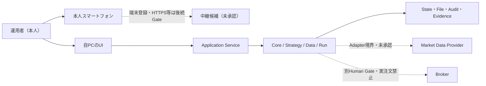

図の実線は本断片で説明するローカル操作・Core・保存の概念経路、点線は後続の境界・実証・承認が必要な候補経路である。スマートフォンからの到達、公開範囲、端末ペアリング、中継方式は未確定であり、図の点線を接続済みと解釈しない。Brokerへ実注文を送る経路は本Stepで許可されない。

### REQ-V2-0017 境界図と文章の意味を一致させる

- Shall: 文書は、運用者、PC／スマートフォン、UI、Application、Core、保存、Provider、Brokerの責務・依存・未承認境界を図と文章の両方で同じ意味に示さなければならない。
- Source: RQU-20 §8、§10、RQU-14A Q-190、RQU-15A Q-211/Q-225、RQV2-03
- Reason: 図だけを見て外部接続済み・遠隔公開済み・Live可能と誤認しないため。
- Assumptions: 端末・通信・外部接続は後続Gateで検証する。
- Inputs: 責務表、依存方向、通信境界、状態、Gate。
- Processing: 実線・点線、許可・未承認、内部・外部を同じ用語で記述する。
- Outputs: Mermaid図、同等の平文説明、境界表。
- Exceptions: 図と文章の不一致、リンク切れ、未承認経路の許可表現はFindingとする。
- Stop: 図または文章が外部注文・無防備な公開を許可する場合。
- Recovery: 境界を再分類し、A90レビューとGateへ戻す。
- Persistence: 図版、入力、レビュー結果、版を保存する。
- Acceptance: 図の全主要ノードが文章・責務表・要求へ接続されること。
- Implementation status: `NOT_IMPLEMENTED`
- Target phase: RQV2-13静的検査、Phase 4以降の外部境界設計

## 11. ユースケース仕様の正本

### 11.1 67 UCの正本テンプレート

各UCは次の順序で記載する。既存`ADD-UC-*`は入力別名として残し、正式candidateでは`UC-V2-001`〜`UC-V2-067`へ写像する。

```text
### UC-V2-001 <名称>
- Legacy ID: ADD-UC-001
- 目的・利用者価値:
- 主体・外部主体:
- 対象資産・銘柄・時間足・Strategy・Mode:
- 開始条件・事前確認・未承認時の禁止:
- 操作手順:
- 画面応答・内部処理・保存:
- 完了条件・結果確認場所:
- 取消可能時点・取消後状態:
- 入力不足・競合・通信断・処理失敗:
- 停止範囲・安全側動作:
- 復旧・再開条件:
- SCREEN / STATE / REQ / TEST / Source Q:
- Evidence / Implementation status / Target phase:
```

### 11.2 UC索引

索引の画面、状態、E2E候補、根拠Qの詳細は[ RQV2-02 §3](../../RQV2_要件UIテスト追跡マトリクス_2026-08-11.md#3-67ユースケースの追跡骨格)へリンクする。以下は67件の正規IDと既存別名・名称の対応であり、同じUCを新規作成するための表ではない。

| 正規UC | 既存別名 | 名称 |
|---|---|---|
| `UC-V2-001` | `ADD-UC-001` | システムの現在状態と禁止事項を確認する |
| `UC-V2-002` | `ADD-UC-002` | 初期設定を確認・変更する |
| `UC-V2-003` | `ADD-UC-003` | データ提供元を設定する |
| `UC-V2-004` | `ADD-UC-004` | Broker、Paper、通知、Cloudの接続状態を確認する |
| `UC-V2-005` | `ADD-UC-005` | Strategy一覧と設定版を確認する |
| `UC-V2-006` | `ADD-UC-006` | 運用単位一覧を確認する |
| `UC-V2-007` | `ADD-UC-010` | Asset Class、銘柄、市場を登録・選択する |
| `UC-V2-008` | `ADD-UC-011` | データ期間と時間足を指定する |
| `UC-V2-009` | `ADD-UC-012` | データを取得・インポートする |
| `UC-V2-010` | `ADD-UC-013` | 取得状況と更新日時を確認する |
| `UC-V2-011` | `ADD-UC-014` | データ品質を確認する |
| `UC-V2-012` | `ADD-UC-015` | 欠損・重複・時刻逆行を確認する |
| `UC-V2-013` | `ADD-UC-016` | データを再取得・再処理する |
| `UC-V2-014` | `ADD-UC-017` | Catalog、Calendar、Roll、version、hash、provenanceを確認する |
| `UC-V2-015` | `ADD-UC-020` | Strategyを作成する |
| `UC-V2-016` | `ADD-UC-021` | Turtle variant、Long／Short、Stop、Exit、追加を設定する |
| `UC-V2-017` | `ADD-UC-022` | Strategyを複製・比較・版管理する |
| `UC-V2-018` | `ADD-UC-023` | Strategy設定を検証する |
| `UC-V2-019` | `ADD-UC-024` | Strategyを有効化・無効化する |
| `UC-V2-020` | `ADD-UC-025` | 銘柄・時間足・Strategy・口座・運用モードを運用単位へ割り当てる |
| `UC-V2-021` | `ADD-UC-026` | 複数運用単位を同時に開始する |
| `UC-V2-022` | `ADD-UC-027` | 運用単位を一時停止・再開・終了する |
| `UC-V2-023` | `ADD-UC-028` | 変更前後の設定差分を確認する |
| `UC-V2-024` | `ADD-UC-030` | Backtest条件を入力する |
| `UC-V2-025` | `ADD-UC-031` | 入力・Manifest・データ品質の事前検証を行う |
| `UC-V2-026` | `ADD-UC-032` | Backtestを開始する |
| `UC-V2-027` | `ADD-UC-033` | Queue、進捗、実行中状態を確認する |
| `UC-V2-028` | `ADD-UC-034` | Backtestを取消・停止・再実行する |
| `UC-V2-029` | `ADD-UC-035` | 完了、停止、失敗の理由を確認する |
| `UC-V2-030` | `ADD-UC-036` | 損益・Drawdown・取引・Signalを確認する |
| `UC-V2-031` | `ADD-UC-037` | 銘柄別・時間足別・Strategy別に結果を絞り込む |
| `UC-V2-032` | `ADD-UC-038` | 複数Runを比較する |
| `UC-V2-033` | `ADD-UC-039` | Holdout、Walk-forward、感度分析を実行する |
| `UC-V2-034` | `ADD-UC-040` | Result、Manifest、hash、ログを保存・出力する |
| `UC-V2-035` | `ADD-UC-041` | 同一条件を再Replayし、結果一致を確認する |
| `UC-V2-036` | `ADD-UC-050` | Forward Testを開始する |
| `UC-V2-037` | `ADD-UC-051` | Shadowを開始・停止・再開する |
| `UC-V2-038` | `ADD-UC-052` | Paperを開始・停止・再開する |
| `UC-V2-039` | `ADD-UC-053` | 少額Liveへの移行条件を確認する |
| `UC-V2-040` | `ADD-UC-054` | 本番Liveへの移行条件を確認する |
| `UC-V2-041` | `ADD-UC-055` | 稼働中の現在状態を確認する |
| `UC-V2-042` | `ADD-UC-056` | 最新データ、Heartbeat、次回判断時刻を確認する |
| `UC-V2-043` | `ADD-UC-057` | Signal、仮想注文、実注文を確認する |
| `UC-V2-044` | `ADD-UC-058` | 約定、部分約定、拒否、取消を確認する |
| `UC-V2-045` | `ADD-UC-059` | Strategy想定と実績の差分を確認する |
| `UC-V2-046` | `ADD-UC-060` | 残高・証拠金・余力を確認する |
| `UC-V2-047` | `ADD-UC-061` | 全体・銘柄別・Strategy別ポジションを確認する |
| `UC-V2-048` | `ADD-UC-062` | 1Nリスク、最大DD、損失上限を確認する |
| `UC-V2-049` | `ADD-UC-063` | 新規注文のRisk判定を確認する |
| `UC-V2-050` | `ADD-UC-064` | 注文を確認・取消・訂正する |
| `UC-V2-051` | `ADD-UC-065` | Broker口座とシステム内状態を照合する |
| `UC-V2-052` | `ADD-UC-066` | 反対Signal、重複注文、ポジション競合を処理する |
| `UC-V2-053` | `ADD-UC-070` | 全体稼働状況を確認する |
| `UC-V2-054` | `ADD-UC-071` | データ遅延・接続断・Heartbeat異常を確認する |
| `UC-V2-055` | `ADD-UC-072` | 通知を確認し、対応済みにする |
| `UC-V2-056` | `ADD-UC-073` | 個別運用単位を停止する |
| `UC-V2-057` | `ADD-UC-074` | 全体Kill Switchを実行する |
| `UC-V2-058` | `ADD-UC-075` | 停止理由と再開条件を確認する |
| `UC-V2-059` | `ADD-UC-076` | 再起動後にSnapshotから復旧する |
| `UC-V2-060` | `ADD-UC-077` | 復旧後にデータ・注文・ポジションを照合する |
| `UC-V2-061` | `ADD-UC-080` | Result、Run、Manifest、hashを検索する |
| `UC-V2-062` | `ADD-UC-081` | 操作履歴を確認する |
| `UC-V2-063` | `ADD-UC-082` | 設定変更履歴を確認する |
| `UC-V2-064` | `ADD-UC-083` | Human Gateの確認記録を確認する |
| `UC-V2-065` | `ADD-UC-084` | レポートを出力する |
| `UC-V2-066` | `ADD-UC-085` | 設定をロールバックする |
| `UC-V2-067` | `ADD-UC-086` | 古いRun・データ・ログをアーカイブする |

### REQ-V2-0018 67 UCを一意に収容する

- Shall: 要件定義書は、RQU-11／RQV2-02で追跡した67件のUCを、各一回の正規ID・目的・操作・例外・停止・復旧・Screen／State／REQ／Test／Source Qで収容しなければならない。
- Source: RQU-11 §5、RQU-20 §11、RQV2-02 §3
- Reason: 機能の存在を画面一覧だけでなく、利用者が実行する操作単位で確認するため。
- Assumptions: `ADD-UC-*`は既存追跡の別名であり、RQV2-10で全件照合する。
- Inputs: UC 67件、Q、Screen、State、E2E候補、要求、テスト。
- Processing: 正規UC IDを採番し、詳細追跡表へリンクする。
- Outputs: UC索引、個別UC本文、孤立・重複一覧。
- Exceptions: 画面がない自動処理も確認・停止・結果参照の画面／証拠へ接続する。
- Stop: UCの重複、欠落、根拠なし、停止・復旧欄の欠落を検出した場合。
- Recovery: RQV2-02またはRQU-11へ戻り、正規写像を修正する。
- Persistence: UC ID、別名、版、章、参照先、レビュー履歴を保存する。
- Acceptance: `UC-V2-001`〜`UC-V2-067`が一意で、各行が追跡表へ戻れること。
- Implementation status: `NOT_IMPLEMENTED`
- Target phase: RQV2-10追跡付録・RQV2-13静的検査

### REQ-V2-0019 UCの異常・停止・復旧を必須化する

- Shall: 各UCは、入力不足、未承認、競合、通信断、処理失敗、取消、停止範囲、復旧・再開条件、保存記録を記載しなければならない。
- Source: RQU-20 §11.2〜11.3、RQU-20 Findings F-005、RQV2-03 UI-GAP
- Reason: 正常操作だけでは安全停止と再開を実装・検証できないため。
- Assumptions: 詳細な注文・Risk・データ境界は担当断片で補足する。
- Inputs: UC操作、現在State、依存状態、設定、Gate、エラー。
- Processing: 正常・異常・停止・復旧分岐を同じUC IDへ結び付ける。
- Outputs: 操作結果、停止理由、再開条件、Evidence。
- Exceptions: 取消不能・復旧不能は利用者へ明示し、次の安全な出口を示す。
- Stop: 異常分岐または停止条件が未定義の場合、UCを完了としない。
- Recovery: 条件を満たした段階から再試行し、重複処理を防ぐ。
- Persistence: UC実行、操作、State、Error、Stop、Recovery、Gateを保存する。
- Acceptance: 67 UCの各行に異常・停止・復旧の参照があること。
- Implementation status: `NOT_IMPLEMENTED`
- Target phase: RQV2-05〜10の執筆・レビュー後、Phase 4以降

## 12. 起動、初期設定、終了

### 12.1 起動

起動は自PCで一つの手順を実行する。起動前検査は、対象ディレクトリ、設定版、保存先、必要サービス、ポート競合、既存Run／Job、DB移行、依存状態を確認する。ブラウザを開けても、運用単位、Paper、Live、自動承認が開始されたとは扱わない。

### 12.2 初期設定

保存先、言語、JST・市場時刻、通貨、更新間隔、費用上限、資源警告値、Provider／Broker／Paper／通知／中継／Secretの設定状態、初期候補、Asset Class、時間足、Strategy、Account、Riskの欄を用意する。値が未確定のものは空欄またはUnknownとして表示し、閲覧可能・保存可能・開始不可を分ける。UI設定とJSON／YAML設定を同じ型付きモデルへ変換し、優先順位と往復一致を後続設計へ渡す。

### 12.3 正常終了・強制終了・再起動

正常終了は、新規受付停止、実行中Jobの状態保存、未送信注文の扱い、checkpoint、保存、接続終了の順を定義する。強制終了後は、次回起動でRECOVERYへ入り、未照合の注文・Position・状態を確認する。復旧確認なしに運用単位を自動再開しない。Live自動承認は再起動・復元後にOFFへ戻す。

### REQ-V2-0020 起動前検査を完了しない限り運用を開始しない

- Shall: システムは、保存先、設定、必要サービス、ポート、既存Run／Job、状態Store、依存状態を検査し、検査不合格時は運用単位・Paper・Liveを開始してはならない。
- Source: RQU-20 §12.1、RQU-14A Q-187/Q-191、RQV2-03 UI-GAP
- Reason: 起動成功と安全な運用開始を別段階にするため。
- Assumptions: 起動コマンド、Node／Python版、外部接続方式の詳細は後続Phaseで確定する。
- Inputs: 起動要求、設定、保存先、サービス、ポート、前回State。
- Processing: 検査結果を個別に表示し、開始可能条件を算出する。
- Outputs: 起動状態、検査表、開始ボタンの可否、警告。
- Exceptions: ポート競合、移行失敗、容量不足、前回状態不明はFAILED／RECOVERYとする。
- Stop: 必須検査が未完了または不合格の場合。
- Recovery: 不合格原因を解消して再検査し、運用者確認後に開始する。
- Persistence: 起動ID、検査結果、設定版、時刻、警告、確認を保存する。
- Acceptance: 起動後にLive自動承認・運用単位が自動ONにならず、検査結果を確認できること。
- Implementation status: `NOT_IMPLEMENTED`
- Target phase: Phase 4以降のApplication／Ops設計

### REQ-V2-0021 初期設定を未入力・後続Gateと区別する

- Shall: 初期設定画面は、必須入力、任意入力、閲覧のみでよい項目、後続Gateで決める項目、未入力なら開始不可の項目を区別して表示しなければならない。
- Source: RQU-20 §12.2、RQU-11 §4、RQU-19／19A、Q-60、Q-98、Q-126
- Reason: 未確定値を既定値や推測値で埋めて、危険処理を開始することを防ぐため。
- Assumptions: 具体的な保存先・費用・Risk・Broker値は後続で決定する。
- Inputs: 設定項目、型、単位、初期値、入力元、Gate状態。
- Processing: 型検査、範囲検査、依存項目検査、未入力状態を判定する。
- Outputs: 保存可能状態、開始可能状態、Unknown／Gate表示。
- Exceptions: 型不一致、範囲外、依存欠落、版不一致は保存または開始を拒否する。
- Stop: Riskや必須来歴が未入力のまま危険モードを開始しようとした場合。
- Recovery: 正しい値・承認・証拠を入力し、再検査する。
- Persistence: 設定版、入力元、単位、変更者相当の操作記録、Gateを保存する。
- Acceptance: UI設定とファイル設定の優先順位・往復変換が追跡可能で、未入力の開始が拒否されること。
- Implementation status: `NOT_IMPLEMENTED`
- Target phase: Phase 4以降の設定・Risk・UI設計

### REQ-V2-0022 正常終了と強制終了を分ける

- Shall: システムは、正常終了では受付停止・状態保存・checkpoint・接続終了を順序化し、強制終了では次回起動をRECOVERYへ遷移させなければならない。
- Source: RQU-20 §12.3、Q-135、Q-146、RQU-14A
- Reason: 未保存・未照合・未送信の状態を通常終了として扱わないため。
- Assumptions: 保存対象、checkpoint粒度、未送信注文の扱いはF05とF04で詳細化する。
- Inputs: 終了要求、Job、注文状態、Position、保存状態、接続状態。
- Processing: 正常・強制の経路を分岐し、次回起動に必要なRecovery情報を作る。
- Outputs: 終了結果、未完了一覧、RECOVERY状態、再開条件。
- Exceptions: 保存失敗、接続終了失敗、未照合差分は終了完了を拒否または警告する。
- Stop: 未完了状態を失ったまま正常終了と宣言する場合。
- Recovery: 次回起動でSnapshot・ログ・外部状態を照合し、運用者確認後に再開する。
- Persistence: 終了種別、順序、checkpoint、未完了Job、差分、確認を保存する。
- Acceptance: 正常終了・強制終了・再起動後の自動再開禁止をテストできること。
- Implementation status: `NOT_IMPLEMENTED`
- Target phase: Phase 4以降のExecution／Ops実証

### REQ-V2-0023 再起動後にLive自動承認をOFFへ戻す

- Shall: システムは、再起動または復元完了後、Live自動承認をOFFかつ運用単位を停止状態に戻し、運用者の確認なしに自動承認・実注文・再開を行ってはならない。
- Source: RQU-15A Q-207〜Q-209、RQU-13A、RQU-20 §12.1、統合台帳の安全境界
- Reason: 再起動を承認操作と誤認せず、復旧後の状態差異を確認するため。
- Assumptions: Live接続とSecretは別Human Gateであり、本要求の作成では許可しない。
- Inputs: 起動結果、保存されたMode、Auto-approval設定、未照合状態、Gate記録。
- Processing: 再起動時に危険フラグを安全側へ初期化し、復旧確認を要求する。
- Outputs: OFF表示、STOPPED／RECOVERY状態、確認Dialog、再開条件。
- Exceptions: 設定復元に失敗、状態差異、証拠欠落は再開不可とする。
- Stop: 再起動後に自動承認がON、注文が送信、運用単位が再開した場合。
- Recovery: 差異照合、停止解除Gate、運用者確認を順に行う。
- Persistence: 再起動前後の設定、OFF化、確認、対象、時刻、Audit Eventを保存する。
- Acceptance: 再起動・復元・状態差異のテストで、自動承認と実注文が再開しないこと。
- Implementation status: `NOT_IMPLEMENTED`
- Target phase: Phase 4以降の安全停止・Broker境界Gate

### 11.3 横断的操作規則

作成、表示、編集、複製、比較、有効化、無効化、開始、停止、再開、取消、削除、出力の意味を全UCで統一する。保存前検査と開始前検査を分け、稼働中の設定を直接変更せず、新しい設定版・運用単位として扱う。手動更新・自動更新、表示更新・データ取得・計算更新を分離し、危険操作には影響範囲・取消可能性・保存記録を表示する。

### REQ-V2-0024 横断操作の意味を統一する

- Shall: 同じ操作名は、作成、保存、開始、停止、再開、取消、削除、出力の対象・状態遷移・保存結果を全画面・全UCで同じ意味にしなければならない。
- Source: RQU-20 §11.3、RQU-11 §5、RQV2-03 UI抽出記録
- Reason: 画面ごとの異なる操作意味が危険操作や来歴欠落を生まないため。
- Assumptions: 画面固有の追加条件はState／Dialog／Gateへ明示する。
- Inputs: 操作名、対象ID、現在State、権限境界、依存状態。
- Processing: 共通Commandと状態遷移へ変換し、結果を記録する。
- Outputs: 一貫したUI応答、状態、Audit、Evidence。
- Exceptions: 対象Stateが操作を許可しない場合は説明付きで拒否する。
- Stop: 同じ操作名が別の意味で動作する場合。
- Recovery: 共通用語辞書・State表・UI追跡表を修正し、再レビューする。
- Persistence: Command、対象、前後State、結果、エラー、確認を保存する。
- Acceptance: 21画面と67 UCの操作語・状態・Dialogが相互矛盾しないこと。
- Implementation status: `NOT_IMPLEMENTED`
- Target phase: RQV2-09 UI／品質断片、RQV2-13静的検査

### 12.4 F01の章境界と引継ぎ

本断片の本文対象は章00〜12で完了した。資産・時間足・市場データ・Strategy・運用単位・Run／Job／Queueの詳細はF02（章13〜18）の正本へ、Backtest・結果・HoldoutはF03、モード・Risk・OMS・BrokerはF04、監視・UI・Security・非機能・品質はF05、完全追跡と付録はF06へ渡す。参照節は本断片の要求を再定義せず、`REQ-V2-*`へリンクする。

### 12.5 F01レビュー記録

| 観点 | 確認結果 |
|---|---|
| 章00〜12の本文 | 全13章に本文あり |
| 単一運用者・ログイン不要 | 認証と安全確認を分離して記載 |
| 外部主体 | Provider、Broker、時刻、Calendar、中継、OS、Fileを列挙 |
| Mermaidと文章 | 境界図の実線・点線・未承認意味を文章で説明 |
| UC | `UC-V2-001`〜`UC-V2-067`の索引とテンプレートを配置 |
| shall追跡 | `REQ-V2-0001`〜`REQ-V2-0024`をSource／UC／Test／Gateへ接続可能な形で記載 |
| 実装主張 | 新規v2要求は`NOT_IMPLEMENTED`。既存Coreの固定範囲へ一般化していない |
| Unknown／Gate | 具体値・外部接続・実資金・端末到達を残存状態として保持 |

### 12.6 変更履歴

| 日付 | 版 | 内容 |
|---|---|---|
| 2026-08-11 | v0.1 | RQV2-05でRQU-20章00〜12を本文candidate化。目的・境界・単一運用者・外部主体・E2E・67 UC索引・起動／終了／復旧要求を追跡可能な形で記載した。 |

## 13. 資産種類、銘柄、市場、取引対象

### 13.1 4資産種類の能力と状態

対象能力は先物、株式、FX、暗号資産の4種類である。各資産種類について、構造上の対応、Provider Catalog存在確認、データ取得・品質確認、Backtest、Forward、Paper接続、Live候補承認、Live承認、現在停止状態を別列で保持する。「対応可能」は構造の受け皿があるという意味であり、実シンボル・契約・データ・Broker・実注文が確認済みという意味ではない。

| 資産種類 | 構造上の対応 | データ／Catalog | Backtest | Forward／Paper | Live候補／Live | 主要差分 |
|---|---|---|---|---|---|---|
| 先物 | `CONFIRMED` | 銘柄・限月・Roll・取引時間の確認が必要 | 固定Core契約は範囲限定 | 外部接続・承認待ち | `LATER_GATE` | 契約単位、価格刻み、証拠金、限月、休場 |
| 株式 | `CONFIRMED`（構造） | 実データ・市場時間・Corporate Action確認待ち | 対象データ未実証 | `LATER_GATE` | `LATER_GATE` | 取引所、銘柄変更、分割・配当、単位 |
| FX | `CONFIRMED`（構造） | Provider・Calendar・24時間表現確認待ち | 対象データ未実証 | `LATER_GATE` | `LATER_GATE` | 通貨ペア、時刻、スプレッド、数量単位 |
| 暗号資産 | `CONFIRMED`（構造） | Provider・24時間市場・手数料確認待ち | 対象データ未実証 | `LATER_GATE` | `LATER_GATE` | 取引所、シンボル、数量精度、常時市場 |

### 13.2 初期候補

初期候補は、運用者の最新訂正に基づき`MCL / M6A / MZC / MZS / MZW`の5件とする。途中の「4銘柄」認識や`MCLN6/MCLQ6/MCLU6`のデータ変換用契約レコードを、候補銘柄の確定値として再利用しない。候補表は論理名、資産種類、実シンボル、取引所、限月・Roll、契約単位、最小数量、価格刻み、Provider、Broker、確認状態を別列で持ち、未確認値を仮値で埋めない。

| 論理候補 | 現在状態 | 必ず別管理する項目 | 開始禁止条件 |
|---|---|---|---|
| `MCL` | `CONFIRMED`（初期候補）／実証未確認 | 資産種類、実シンボル、契約、Roll、Provider、Broker | 契約・データ・品質・モード承認が未確認 |
| `M6A` | 同上 | 同上 | 同上 |
| `MZC` | 同上 | 同上 | 同上 |
| `MZS` | 同上 | 同上 | 同上 |
| `MZW` | 同上 | 同上 | 同上 |

### 13.3 対応状態モデル

銘柄×Modeの状態は、`STRUCTURALLY_SUPPORTED`、`CATALOG_CONFIRMED`、`DATA_AVAILABLE`、`QUALITY_CONFIRMED`、`BACKTEST_VERIFIED`、`FORWARD_VERIFIED`、`PAPER_VERIFIED`、`LIVE_CANDIDATE`、`LIVE_APPROVED`、`STOPPED`、`EXPIRED`を必要に応じて組み合わせる。上位状態を付けても下位の証拠を省略しない。

### 13.4 銘柄操作

登録、編集、複製、無効化、表示順、検索、フィルタを提供する。Provider Catalogから得た値と運用者の上書き値を別保存し、稼働中の論理銘柄ID・実シンボルを直接変更しない。Roll前後の論理銘柄の連続性と、Calendar・契約版・provenanceをRunへ固定する。

### REQ-V2-0025 4資産種類の構造対応と実証状態を分離する

- Shall: システムは先物、株式、FX、暗号資産の構造上の対応状態と、Catalog・データ・品質・Backtest・Forward・Paper・Liveの各確認状態を別属性として保持しなければならない。
- Source: RQU-20 §13.1、RQU-17A Q-246、Q-278、RQV2-01 Core基準線
- Reason: 4資産種類の入口を用意したことを実データ・実注文の検証済みと誤認しないため。
- Assumptions: 外部Provider／Broker、実シンボル、契約条件は後続Gateで確認する。
- Inputs: Asset Class、Instrument、Catalog、Data、Mode、Gate、Evidence。
- Processing: 状態を段階ごとに更新し、根拠Evidenceを結び付ける。
- Outputs: 資産・銘柄状態表、開始可否、未確認理由。
- Exceptions: Catalog欠落、契約不明、データ品質不良、Mode未承認は上位状態へ進めない。
- Stop: `STRUCTURALLY_SUPPORTED`だけでPaper／Liveを開始しようとした場合。
- Recovery: 対応表、データ品質、外部承認、証拠を追加して再評価する。
- Persistence: 状態、版、確認時刻、Source、Evidence、失効理由を保存する。
- Acceptance: 4行×段階状態がUI・追跡表・Run Manifestへ接続すること。
- Implementation status: `NOT_IMPLEMENTED`（固定Core契約は別範囲）
- Target phase: Phase 4以降のAsset／Adapter／Mode Gate
- Traceability: Q-09、Q-246、Q-278、UC-V2-007、UC-V2-011、`IMPLEMENTED_VERIFIED`固定Core／実データは`LATER_GATE`

### REQ-V2-0026 初期5候補を論理名として管理する

- Shall: システムは初期候補`MCL/M6A/MZC/MZS/MZW`を論理銘柄として登録し、実シンボル・契約・取引所・Roll・Provider・Brokerの未確認状態を仮値で補完せずに表示しなければならない。
- Source: RQU-20 §13.2、RQU-15A v0.4、RQU-16A v0.4、RQU-17A Q-245
- Reason: 初期候補の件数混同とデータ変換用契約レコードの混入を防ぐため。
- Assumptions: 5件は開始候補であり、Paper／Live利用許可ではない。
- Inputs: 論理候補、資産種類、対応表、Catalog、契約情報、Gate。
- Processing: 論理IDと実シンボルを分離し、確認済み項目だけを有効化する。
- Outputs: 候補一覧、欠落項目、開始禁止理由、変更履歴。
- Exceptions: 同名・別契約・Roll不明・Provider不一致は別候補または停止として扱う。
- Stop: 未確認の実シンボル・契約でデータ取得または実注文を開始する場合。
- Recovery: 公式／Broker情報と最小データ確認を記録して再評価する。
- Persistence: 候補版、対応表、Catalog、契約、Roll、hash、状態を保存する。
- Acceptance: 5候補が別々に検索・確認でき、未確認項目が画面に残ること。
- Implementation status: `NOT_IMPLEMENTED`
- Target phase: Phase 4以降のData／Adapter Gate
- Traceability: Q-200、Q-227、Q-245、UC-V2-007、UC-V2-014、`RQU-UNK-17-02`

## 14. 時間足、取引時間、意思決定時刻

### 14.1 5時間足の共通契約

対象時間足は`D1 / H4 / H1 / M30 / M15`である。最小データ源、生成式、足境界、確定、判断、注文可能時刻、Calendar、遅延、再生成をManifestへ固定し、時間足ごとに別Stateを持つ。既存CoreのD1/H4/H1/M30/M15は固定closed-bar契約として`IMPLEMENTED_VERIFIED`だが、実取引所Calendarの継続追随、長期実データ、外部Provider品質は未実証である。

| 時間足 | 生成元・境界 | Close／判断 | 初期欠損閾値 | 休日・短縮日・DST | 遅延・再生成 |
|---|---|---|---|---|---|
| `D1` | 正規化入力とCalendarで市場日を確定。境界はManifestで指定。 | 市場日のClose確定後に一度だけ判断。 | 2本 | 休場は欠損扱いにせず、短縮日はCalendarで終端を決め、DSTは市場時刻を優先。 | 遅延閾値は設定化。欠損修復後に同じ版を再生成しない。 |
| `H4` | 正規化入力を市場時間境界へ集約。 | H4 Close確定後。 | 2本 | 同上。日跨ぎとDSTをCalendar版へ保存。 | 遅延・再生成対象を時間足単位で記録。 |
| `H1` | 正規化入力をH1境界へ集約。 | H1 Close確定後。 | 2本 | 同上。 | 遅延時はSignalを止め、修復後に再判定。 |
| `M30` | 固定Core契約と正規化入力の集約規則。 | M30 Close確定後。 | 3本 | 固定M30証拠は実市場Calendarの証明ではない。 | M30 provenance・hash・再生成記録を保持。 |
| `M15` | 正規化入力をM15境界へ集約。 | M15 Close確定後。 | 4本 | 休場・短縮日・DSTをCalendarと区別。 | 最小遅延を設定化し、未来データで補完しない。 |

欠損閾値は初期値であり、Q-251に基づき設定変更可能とする。ただし設定変更は新しい設定版へ保存し、過去Runの解釈を変えない。Calendar上の休場は欠損本数だけで停止させない。未到着が本数閾値を超えた場合は、当該時間足に関係するSignal・新規注文を停止し、停止理由と再開条件を表示する。

### 14.2 マルチタイムフレームと同時確定

同一銘柄で5時間足を同時利用できる。主時間足と参照時間足はStrategy設定版の属性であり、Strategyへ未来時点の値を渡さない。同一Close時刻に複数時間足が確定した場合は、全時間足の更新・品質検査を完了してから一回だけ判断する。時間足ごとのSignal・Position・損益は独立表示し、集約表示には集約規則と根拠を付ける。

### 14.3 Calendar、セッション、Roll

公式Calendar、版、取得元、適用期間、手動例外、変更履歴を保存する。通常取引、休日、臨時休場、短縮日、メンテナンス、24時間市場を別状態にする。先物のRollは論理銘柄の連続性、実シンボル、価格補正、適用順、開始・終了時刻を記録し、Calendar休場をデータ欠損・異常と誤判定しない。

### REQ-V2-0027 5時間足の生成・確定・判断時刻を固定する

- Shall: システムはD1、H4、H1、M30、M15ごとに、生成元、足境界、Close確定、判断時刻、注文可能時刻、Time Zone、Calendar版をManifestへ記録しなければならない。
- Source: RQU-20 §14、Q-07、Q-19、Q-284、RQV2-01 Core基準線
- Reason: 時間足の名称だけでは未来データ混入、重複判断、DST誤判定を防げないため。
- Assumptions: 実市場Calendarの継続追随は`LATER_GATE`である。
- Inputs: Raw／Normalized data、Calendar、Time Zone、時間足設定、Strategy設定。
- Processing: 集約、Close検査、同時刻順序、判断回数、注文可能時刻を決める。
- Outputs: Bar、Close Event、Signal入力、時刻・版・品質情報。
- Exceptions: 時刻不明、逆行、未確定足、Calendar不一致はSignal生成を拒否する。
- Stop: Close未確定または未来データを参照する場合。
- Recovery: 正しいData／Calendar版で対象期間を再生成・再検査する。
- Persistence: 元データ、集約規則、Close、判断、Calendar、hash、版を保存する。
- Acceptance: 5時間足の固定契約と同時Closeの一回判断をGolden／Replayで確認すること。
- Implementation status: `IMPLEMENTED_VERIFIED`（固定契約範囲）／実市場は`LATER_GATE`
- Target phase: Phase 4以降のData実証、固定Coreは再利用
- Traceability: Q-07、Q-19、Q-95、Q-124、Q-284、UC-V2-008、UC-V2-014、`D1/H4/H1/M30/M15`固定証拠

### REQ-V2-0028 欠損・休日・短縮日・DST・遅延を別判定する

- Shall: システムは、Calendar休場、短縮日、DST、入力欠損、データ遅延、再生成を別の原因として判定し、時間足ごとの開始・停止・復旧を決めなければならない。
- Source: RQU-20 §14.3〜15.3、Q-123、Q-136、Q-164、Q-203、RQU-18A Q-264
- Reason: 休場を不正データと誤認したり、欠損を正常市場として継続したりしないため。
- Assumptions: 初期欠損閾値はM15=4、M30=3、H1=2、H4=2、D1=2。
- Inputs: Calendar、Session、Bar、最終成功時刻、遅延、設定版。
- Processing: 原因分類、閾値判定、影響時間足、停止範囲、再生成条件を算出する。
- Outputs: 品質結果、警告、停止Reason、復旧Job、再判定対象。
- Exceptions: Calendar版不明、手動例外の競合、閾値未入力は開始不可。
- Stop: 欠損・遅延が閾値を超えた、または原因が分類できない場合。
- Recovery: Calendar・データ・設定版を固定して再取得・再処理・再検証する。
- Persistence: 欠損箇所、原因、閾値、Calendar、修復、承認、証拠を保存する。
- Acceptance: 5時間足それぞれで原因別停止と休場継続をテストできること。
- Implementation status: `IMPLEMENTED_VERIFIED`（固定契約）／外部継続は`LATER_GATE`
- Target phase: Phase 4以降のData Quality／Calendar Gate
- Traceability: Q-123、Q-133、Q-136、Q-164、Q-203、Q-251、UC-V2-011〜014、`RQU-UNK-18-03`

## 15. 市場データ管理

### 15.1 データの段階と正本

データは次の段階を別Entityとして扱う。

1. `Raw`: 外部取得またはファイル取込時の原値。無断上書きしない。
2. `Normalized`: schema、型、単位、時刻、銘柄を正規化した派生値。
3. `Quality`: 必須列、型、範囲、時刻順、重複、欠損、OHLC関係、未来時刻を検査した結果。
4. `Catalog`: Provider・契約・銘柄・取引所・単位・価格刻み・有効期間のメタデータ。
5. `Calendar`: 取引時間、休日、短縮日、DST、臨時例外の版。
6. `Roll`: 論理銘柄と実シンボル・限月の連続性と補正規則。
7. `Manifest`: Runが参照したData・Strategy・Config・Calendar・Roll・Code・環境・seedの一覧。
8. `Provenance`: 入手元、取得条件、変換者、変換版、時刻、承認、費用の来歴。
9. `Hash／Version`: 入力と派生物を再現するためのhash、版、親版、変更理由。

既存CoreのRaw／Normalized／Catalog／Manifest／品質契約とDBN→NormalizedBar→MarketEvent→Replayは、固定fixture・固定版・証拠範囲で`IMPLEMENTED_VERIFIED`である。外部Provider継続取得、entitlement、長期・多市場品質、実費用は`LATER_GATE`であり、固定証拠から推定しない。

### 15.2 入手・更新・費用

Provider自動取得、保存ファイル取込、手動更新、自動更新を別機能とする。対象銘柄、期間、時間足、dataset、schema、形式、費用見込み、承認範囲を開始前に表示する。自動更新の初期値は30秒、最小5秒、最大3600秒とし、UI再描画周期とデータ取得・計算周期を分ける。費用上限に達した場合は外部取得と新規依存Runを停止し、保存済みデータの閲覧は継続できる。

### 15.3 品質・再処理

品質検査は合否だけでなく、場所、種類、件数、影響時間足、利用可否、修復候補を出力する。不正データ検出時は、Signalと新規注文を影響範囲で停止する。再取得、置換、再処理、手動承認を分け、Rawを上書きせず、派生版と前版を保存する。

### REQ-V2-0029 Raw／Normalized／Qualityを分離保存する

- Shall: システムは、Raw原値、Normalized派生値、Quality検査結果を別の版・hash・provenanceで保存し、派生処理でRawを無断上書きしてはならない。
- Source: RQU-20 §15、RQV2-01 Core基準線、RQU-18A Q-262/Q-263
- Reason: 再現性、監査、品質不良の原因追跡、再処理を可能にするため。
- Assumptions: 固定Coreの保存契約は固定fixture範囲で再利用する。
- Inputs: Raw、schema、単位、時刻、銘柄、変換ルール、Quality設定。
- Processing: 正規化、品質検査、派生版生成、影響範囲判定を行う。
- Outputs: Normalized dataset、Quality report、利用可否、停止Reason。
- Exceptions: 型不正、時刻逆行、重複、OHLC不整合、未来値、欠損は該当範囲を拒否する。
- Stop: Qualityが未完了または不合格のデータでSignal・新規注文を生成する場合。
- Recovery: Rawから再処理し、別版で品質確認する。手動承認は別Gateとして記録する。
- Persistence: Raw／Normalizedのhash、版、変換、Quality、承認、影響Runを保存する。
- Acceptance: 固定入力で同じNormalized・Quality・Replay結果を再現し、Rawが変更されないこと。
- Implementation status: `IMPLEMENTED_VERIFIED`（固定Core範囲）／UI・外部運用は`NOT_IMPLEMENTED`
- Target phase: Phase 4以降のData実証
- Traceability: Q-121、Q-122、Q-123、Q-251、Q-262、UC-V2-009〜014、P2-DBN／P3 Replay証拠

### REQ-V2-0030 Catalog／Calendar／Roll／ManifestをRunへ固定する

- Shall: システムは、Runが利用したCatalog、Calendar、Roll、Normalized dataset、Strategy／Config版、Code版、seed、環境、hashをManifestへ固定しなければならない。
- Source: RQU-20 §13〜15、Q-17、Q-123、Q-174、Q-262、Q-274、RQU-18A Q-264
- Reason: 後日のCatalog・Calendar・データ更新で過去Runの意味が変わらないようにするため。
- Assumptions: Databento等のProviderは初期候補であり、具体的な外部取得承認は未実施。
- Inputs: Catalog、Calendar、Roll、dataset、Strategy、Config、Code、環境、seed。
- Processing: 版・hash・適用順・取得条件をManifestへ書き込む。
- Outputs: Immutable Manifest、Run表示、再現入力、差分。
- Exceptions: 版・hash欠落、適用順不明、Catalogと実データの不一致は開始不可。
- Stop: ManifestなしでBacktest・Forward・Modeを開始する場合。
- Recovery: 入力版を固定し、Manifestを再生成して事前検査する。
- Persistence: Manifest、親版、hash、承認、変更履歴、利用Runを保存する。
- Acceptance: 同じManifestのReplayが同じ入力境界へ戻り、更新後も過去Runを再表示できること。
- Implementation status: `IMPLEMENTED_VERIFIED`（固定Replay範囲）／外部長期データは`LATER_GATE`
- Target phase: Phase 4以降のData／Run Gate
- Traceability: Q-29、Q-31、Q-123、Q-174、Q-250、Q-262、Q-274、UC-V2-014、UC-V2-034

### REQ-V2-0031 外部取得と保存済み取込を分ける

- Shall: システムは、Providerからの自動取得、保存済みファイルの取込、手動更新、自動更新を別操作・別Evidenceとして扱い、対象・期間・費用・承認を開始前に確認しなければならない。
- Source: RQU-20 §15.1〜15.2、Q-11、Q-120〜Q-122、Q-126、Q-252〜Q-253
- Reason: 外部I/Oとローカル再現処理を混同せず、費用・Secret・停止を管理するため。
- Assumptions: 本Stepでは外部取得を実行しない。
- Inputs: 取得／取込操作、銘柄、期間、時間足、dataset、schema、費用上限。
- Processing: 事前検査、承認範囲、取得または取込、Quality、Manifest化を行う。
- Outputs: データ版、取得結果、費用見込み、失敗・取消・再開状態。
- Exceptions: Provider接続失敗、費用超過、部分取得、取消、ファイル形式不正は停止する。
- Stop: 外部取得の承認範囲または費用上限が不明な場合。
- Recovery: 保存済みデータの閲覧へ戻し、対象・期間・費用を確認して再開する。
- Persistence: 取得／取込種別、対象、期間、Provider、費用、hash、操作、承認を保存する。
- Acceptance: 外部取得なしの固定fixture Replayと、取得失敗の停止経路を分離してテストできること。
- Implementation status: `NOT_IMPLEMENTED`／固定取込は`IMPLEMENTED_VERIFIED`
- Target phase: Phase 4以降のData Adapter／費用Gate
- Traceability: Q-11、Q-121、Q-122、Q-126、Q-253、UC-V2-003、UC-V2-009、UC-V2-013

### REQ-V2-0032 品質不良で影響範囲を停止する

- Shall: システムは、欠損、重複、時刻逆行、未来時刻、型・単位・OHLC不整合を検出した場合、影響する時間足・銘柄・RunのSignalと新規危険処理を停止し、理由・件数・復旧条件を表示しなければならない。
- Source: RQU-20 §15.3、Q-14、Q-15、Q-63、Q-122、Q-251、RQV2-01 Core基準線
- Reason: 不正データで判断・注文を継続しないため。
- Assumptions: Calendar休場は欠損と別分類する。
- Inputs: Quality result、Calendar、影響時間足、Run／Unit、Mode。
- Processing: 影響範囲、停止レベル、再処理対象、復旧可能性を判定する。
- Outputs: Quality report、警告、Stop／Recovery状態、再処理Job。
- Exceptions: 影響範囲不明、手動例外競合、Quality処理失敗は広い範囲を安全側へ停止する。
- Stop: Quality未確認・不合格のままSignalまたは新規OrderIntentを作る場合。
- Recovery: Raw／Catalog／Calendarを固定して再処理し、運用者確認後に再開する。
- Persistence: 品質Finding、影響、停止、再処理、承認、Evidenceを保存する。
- Acceptance: 固定Coreの欠損停止契約と、時間足別の影響範囲をテストできること。
- Implementation status: `IMPLEMENTED_VERIFIED`（固定契約）／実データは`LATER_GATE`
- Target phase: Phase 4以降のData Quality／Ops
- Traceability: Q-14、Q-15、Q-63、Q-122、Q-251、UC-V2-011、UC-V2-012、UC-V2-054

## 16. 戦略・売買ルール管理

### 16.1 Generic Strategy Plugin Interface

Strategyは、Backtest、Forward、Shadow、Paper、Liveの共通実行モデルで利用できるPlugin境界とする。入力は正規化された確定Bar、時間足・Calendar情報、Strategy設定版、過去State、現在の仮想Positionなど、出力はSignalまたは説明付きのTarget Intent候補とする。StrategyはBroker接続、Accountの正本、Risk override、Order送信、Live自動承認を担当しない。

### 16.2 Turtle固有ルール

初期戦略はTurtle System 1／System 2である。Entry、Breakout、Long／Short、Exit、Stop、Whipsaw、追加建玉、Pyramiding、N、ATR、主・参照時間足、Cooldown、データ不足時の扱いを固有設定として隔離する。Generic Interfaceは共通出力契約、Turtle Rulesは固有計算・判定・Golden fixtureへ分ける。売買推奨や資産別の過剰最適化は行わない。Look-ahead、survivorship bias、fixtureの隠れ編集を禁止する。

### 16.3 設定版とSignal説明

UI、JSON、YAMLは同じ型付き設定モデルへ変換する。作成、保存、複製、比較、名称変更、有効化、無効化、ロールバック、削除を版付きで記録し、稼働中の設定を直接変更しない。Signalは種別、方向、理由、判定価格、判定時刻、時間足、参照値、Strategy Versionを持つ。反対SignalはExitを先に行い、反対Entryは次の確定足以降とする。競合はRisk／OMSの責務であり、Strategyが勝手に上書きしない。

### REQ-V2-0033 Strategy Pluginを4モード共通にする

- Shall: Strategy PluginはBacktest、Forward、Shadow、Paper、Liveの各Modeで同じ入力・出力契約を使い、Broker接続、Account正本、Risk override、Order送信を担当してはならない。
- Source: RQU-20 §16、RQU-11 §4、Strategy Interface Skill、RQV2-01 Core基準線
- Reason: Strategy固有ロジックと実行・Risk・外部注文責務を分離するため。
- Assumptions: Paper／Liveの実運用は別Gateであり、共通Interfaceの存在だけで実行可とはしない。
- Inputs: 確定Bar、時間足、Calendar、設定版、前回State、Position view。
- Processing: deterministicな状態更新とSignal／説明生成を行う。
- Outputs: Signal、理由、参照値、Strategy State、説明Evidence。
- Exceptions: データ不足、Close未確定、設定版不一致、State不整合はSignalを生成しない。
- Stop: Strategyが外部API、Broker、Account、Risk overrideへ直接アクセスする場合。
- Recovery: 入力・State・設定版を照合し、同じManifestで再計算する。
- Persistence: Strategy Version、入力hash、State、Signal、説明、エラーを保存する。
- Acceptance: 固定Goldenで4Modeの同じSignal意味と、非責務の不在を確認すること。
- Implementation status: `IMPLEMENTED_VERIFIED`（Turtle固定契約）／汎用拡張は`NOT_IMPLEMENTED`
- Target phase: Phase 4以降のStrategy Plugin設計・Golden Gate
- Traceability: Q-20、Q-29、Q-91、UC-V2-015〜019、P3 Strategy固定証拠

### REQ-V2-0034 Turtle固有ルールをGeneric Interfaceから隔離する

- Shall: システムはTurtle System 1／System 2の固有ルール、設定、Golden期待値をGeneric Strategy Pluginの共通責務とは別に保持しなければならない。
- Source: RQU-20 §16.1〜16.2、Turtle Rules Skill、RQV2-01 Core基準線
- Reason: 原典再現性、比較可能性、将来の別Strategy追加を維持するため。
- Assumptions: 資産別の最適化や売買推奨は本要件に含めない。
- Inputs: Turtle variant、Entry／Exit／Stop／N／ATR、主・参照時間足、固定fixture。
- Processing: 固有ルールを共通入力契約へ適用し、Signal理由を出力する。
- Outputs: Variant別Signal、期待値比較、差分、未確定事項。
- Exceptions: Look-ahead、fixture変更、期間不足、パラメータ不整合は実行拒否する。
- Stop: 未来データ参照、検証対象外の資産別最適化、Golden入力の隠れ変更を検出した場合。
- Recovery: 固定入力・版・期待値を復元し、再試験する。
- Persistence: ルール版、fixture hash、期待出力、比較Finding、採否を保存する。
- Acceptance: System 1／2の固定ケースで同じ結果を再現し、Look-ahead検査がPASSすること。
- Implementation status: `IMPLEMENTED_VERIFIED`（固定Golden範囲）
- Target phase: Phase 4以降のStrategy QA、固定Core再利用
- Traceability: Q-23、Q-24、Q-25、Q-91、UC-V2-015〜018、P3 Strategy／Golden証拠

### REQ-V2-0035 Strategyと時間足・設定版を固定する

- Shall: システムは、各SignalとRunに主時間足、参照時間足、Strategy Variant、Strategy Version、Config Version、判断時刻を記録し、稼働中設定を直接変更してはならない。
- Source: RQU-20 §14.2、§16.2〜16.3、Q-21、Q-89、Q-91、Q-92、Q-166、Q-284
- Reason: 同じ名前のStrategyでも時間足・設定版が違う判断を混ぜないため。
- Assumptions: 反対SignalのExit先行規則はStrategy出力とOMS入力の境界で保持する。
- Inputs: Strategy、Version、Config、主／参照Timeframe、Bar、State。
- Processing: Versionを不変参照し、変更は新版・新Unitへ適用する。
- Outputs: Signal説明、差分、Version、適用対象、開始可否。
- Exceptions: Version欠落、時間足不一致、実行中変更要求は拒否する。
- Stop: 変更前後の設定が同じRunまたはUnitへ混在する場合。
- Recovery: 旧Versionで停止・保存し、新Versionを新規検査する。
- Persistence: Version、親Version、差分、hash、Unit、Run、操作記録を保存する。
- Acceptance: 同じManifestでSignal説明が再現し、稼働中変更が既存Runを変更しないこと。
- Implementation status: `IMPLEMENTED_VERIFIED`（固定Strategy契約）／UI・運用単位は`NOT_IMPLEMENTED`
- Target phase: Phase 4以降のStrategy／Unit設計
- Traceability: Q-21、Q-29、Q-89、Q-92、Q-166、Q-284、UC-V2-016〜023、UC-V2-042〜045

## 17. 運用単位・Strategy Instance・同時実行

### 17.1 運用単位キー

運用単位は、少なくとも次の論理キーで一意にする。

`Instrument ID × Timeframe ID × Strategy Version ID × Mode`

Account、Risk設定版、Data Manifest、Execution Policyは追加属性として保持する。ここでいう重複禁止は、同じ論理キーを同じ時点・同じModeで二つ開始することを禁止する意味である。同じ銘柄・同じ時間足でも、異なるStrategy Versionまたは異なるModeを別Unitとして持つことは許可し、相互のPosition・Signal・Result・停止を勝手に合算しない。Portfolio／Riskで全体影響を表示する場合はF04の正本へ参照する。

### 17.2 作成・開始・変更

作成、複製、編集、事前検査、開始、複数選択開始、停止、再開、終了、削除を提供する。開始前にData Quality、Strategy Version、Risk入力済み、Mode承認、重複、資源、接続状態を検査する。稼働中に変更する場合は停止・新版作成・新Unit作成を経由し、既存Runの入力を変えない。

### 17.3 同時実行と資源

実時間運用単位に固定の論理上限は置かず、初期目安3〜5、負荷時の警告・待機・開始拒否・停止を用意する。20〜40単位の実性能は未測定であり、対応可能とは記載しない。実時間運用を優先し、新規BacktestをQueueへ待機させる。CPU、Memory、Disk、Queue、データ遅延をResource Stateとして記録する。

### REQ-V2-0036 運用単位キーと重複を定義する

- Shall: システムは、Instrument ID、Timeframe ID、Strategy Version ID、Modeの組合せを運用単位の一意キーとして扱い、同一キーの同時重複開始を拒否しなければならない。
- Source: RQU-20 §17、RQU-19A Q-281、Q-284、RQV2-02 Q-87〜Q-90
- Reason: 同じ実行を二重に開始せず、異なるStrategy・時間足・Modeを独立して追跡するため。
- Assumptions: Account、Risk、Data Manifest、Execution Policyはキーに関係する属性として版管理する。
- Inputs: Instrument、Timeframe、Strategy Version、Mode、Account、Risk、Data、既存Unit。
- Processing: canonical keyを生成し、既存Unit・State・Modeを照合する。
- Outputs: Unit ID、重複警告、開始可否、独立したResult／State。
- Exceptions: 同一銘柄・時間足でもStrategyが異なる場合は別Unitとし、同じキーの場合だけ重複とする。
- Stop: 同一キーの二重開始、Key不明、稼働中Version変更を検出した場合。
- Recovery: 既存Unitを表示し、停止・新版作成・別Mode選択後に再検査する。
- Persistence: Key、Unit ID、Version、Mode、Account、Risk、開始・停止、重複判定を保存する。
- Acceptance: 同じ銘柄×時間足×Strategy Version×Modeの二重開始を拒否し、異なるStrategyの独立実行を追跡できること。
- Implementation status: `NOT_IMPLEMENTED`
- Target phase: Phase 4以降のOperation Unit／Risk設計
- Traceability: Q-22、Q-87、Q-88、Q-89、Q-90、Q-281、Q-284、UC-V2-006、UC-V2-020〜023

### REQ-V2-0037 Unit変更を新版・新実行単位へ分ける

- Shall: システムは、稼働中のStrategy、Timeframe、Data、Risk、Modeを直接書き換えず、停止・版作成・事前検査・新しい運用単位として適用しなければならない。
- Source: RQU-20 §17.2、Q-92、Q-149、Q-166、Q-281
- Reason: 過去Runと現在Runの入力混在、設定来歴の破壊、再現不能を防ぐため。
- Assumptions: 具体的なRisk判定はF04で定義する。
- Inputs: 変更要求、現行Unit、差分、Version、Gate、状態。
- Processing: 差分表示、旧Unit停止、新版生成、開始前検査を実行する。
- Outputs: 新Unit、差分、適用結果、旧Unitの履歴。
- Exceptions: 稼働中変更、未保存差分、Risk未入力、Mode未承認は拒否する。
- Stop: 旧RunのManifestを変更して新版扱いにする場合。
- Recovery: 旧Unitを停止状態で保持し、変更を破棄または新Versionへ戻す。
- Persistence: 旧新Version、差分、親子Unit、操作、Gate、開始時刻を保存する。
- Acceptance: 旧Runの結果が変わらず、新Unitだけに変更が適用されること。
- Implementation status: `NOT_IMPLEMENTED`
- Target phase: Phase 4以降のUnit／Config／Risk Gate
- Traceability: Q-92、Q-149、Q-166、UC-V2-022、UC-V2-023、UC-V2-066

### REQ-V2-0038 同時実行を資源状態で制御する

- Shall: システムは、実時間Unit、Backtest、Data更新、CSV出力などの同時実行をResource Stateと優先度で制御し、負荷時は警告・待機・開始拒否・停止のいずれかを理由付きで表示しなければならない。
- Source: RQU-20 §17.3、Q-97、Q-102〜Q-104、Q-157、Q-216、Q-240、Q-244、Q-282
- Reason: 固定上限を過剰に決めず、実PCの資源不足で安全性を失わないため。
- Assumptions: 初期目安3〜5は運用表示であり、20〜40の性能合格値ではない。
- Inputs: Unit、Job、CPU、Memory、Disk、Queue、データ遅延、優先度。
- Processing: 実時間優先、待機、停止、再開可能性、飢餓防止を判定する。
- Outputs: Resource State、警告、Queue位置、開始可否、停止理由。
- Exceptions: Resource計測不能、Queue状態不明、優先度競合は安全側へ待機・停止する。
- Stop: 実時間処理を圧迫して新規Backtestを開始する場合、または負荷上限不明の場合。
- Recovery: 負荷低下、Job一時停止／完了、運用者確認後に待機Jobを再開する。
- Persistence: Resource時系列、判定、Queue、優先度、操作、証拠を保存する。
- Acceptance: 実時間優先と負荷時の警告・待機・停止が固定試験で確認できること。
- Implementation status: `NOT_IMPLEMENTED`
- Target phase: Phase 4以降のExecution／Ops性能Gate
- Traceability: Q-97、Q-102、Q-103、Q-104、Q-157、Q-216、Q-240、Q-244、UC-V2-021、UC-V2-027

## 18. 共通Run・Job・Queueモデル

### 18.1 Entityと状態

Runは再現可能な実行の正本記録、JobはQueueで実行される処理単位、Queueは順序・優先度・資源待ちを管理する。Runは親Run・Manifest・結果・Evidenceを持ち、JobはRunの部分処理、checkpoint、再試行、失敗、再開位置を持つ。状態は`Draft → Validating → Queued → Running → Pausing／Paused → Cancelling／Cancelled → Completed／Failed／Stopped／Recovery Required`を基本とし、許可操作と保存を状態ごとに定義する。

### 18.2 Queue、優先度、取消

Forward、Shadow、Paper、Live、Data更新はBacktest・CSV出力より優先する。実時間Unitを待たせるJobを開始せず、同順位は投入時刻と安定したTie-breakで処理する。取消は受付前、待機中、実行中、外部副作用後で意味を分け、外部副作用後は「送信済み取消」ではなく照合・停止へ進む。

### 18.3 失敗・再試行・再開

一時的な失敗は10秒、30秒、60秒の最大3回だけ再試行する。再試行してはいけない入力不正・ID衝突・Manifest不一致・外部副作用不明は即停止する。3回失敗後は`FAILED`または`RECOVERY_REQUIRED`として途中結果と理由を表示する。網羅検証は組合せ単位、通常Runは処理境界単位でcheckpointを保存し、再開位置と重複防止を記録する。

### 18.4 再現性と同条件Run

同一Manifest・同一入力の再実行は許可する。同じ条件を実行しても最新結果表示を置き換えるだけで、内部の全Run、設定版、ログ、結果ファイルを保持する。seed、環境、Code、Data、Calendar、Cost、Roll、設定、実行方法、hashをManifestへ記録する。再現性の一致条件・許容差はF03のBacktest正本へ渡す。

### REQ-V2-0039 RunとJobを分離して再現記録を作る

- Shall: システムは、Runを入力・設定・Manifest・結果・Evidenceを束ねる実行正本とし、JobをQueueで処理する単位として分離しなければならない。
- Source: RQU-20 §18.1〜18.2、Q-186、Q-221、Q-222、RQV2-01 Core基準線
- Reason: 長時間処理、再試行、部分失敗、再開、結果表示を一つの状態へ混在させないため。
- Assumptions: 実装技術はPhase 4の技術確認で選定する。
- Inputs: Run要求、Manifest、Job、Queue、優先度、Resource State。
- Processing: RunとJobの親子関係、状態、checkpoint、結果を更新する。
- Outputs: 進捗、Job状態、Run結果、失敗・再開情報。
- Exceptions: Job失敗でもRun全体の状態と部分結果を別に記録する。
- Stop: JobとRunを同じID・状態で上書きし、再開位置を失う場合。
- Recovery: Job単位またはRun単位のcheckpointから再開し、重複を検査する。
- Persistence: Run／Job ID、親子、状態遷移、入力、Manifest、checkpoint、Evidenceを保存する。
- Acceptance: 単一Run・網羅Job・部分失敗・再開で、過去の入力と結果へ戻れること。
- Implementation status: `IMPLEMENTED_VERIFIED`（固定CoreのRun契約範囲）／UI・Workerは`NOT_IMPLEMENTED`
- Target phase: Phase 4以降のApplication／Worker実装
- Traceability: Q-186、Q-221、Q-222、UC-V2-024〜029、UC-V2-034、P3 Run contract証拠

### REQ-V2-0040 Queue優先度と待機理由を表示する

- Shall: システムは、実時間運用、Data更新、Backtest、CSV出力などのJobに優先度を付け、待機・開始拒否・停止の理由と再開条件を表示しなければならない。
- Source: RQU-20 §18.3、Q-102、Q-103、Q-104、Q-216、Q-240、RQU-17A Q-240
- Reason: 運用中の監視・安全処理を重い検証処理が妨げないようにするため。
- Assumptions: 優先度の最終数値と資源上限は負荷Gateで決める。
- Inputs: Job種別、優先度、投入時刻、Resource State、現在Run。
- Processing: Queue順、Tie-break、飢餓防止、待機・取消・再開を管理する。
- Outputs: Queue一覧、進捗、経過、残り見込み、待機理由。
- Exceptions: Resource計測不能、優先度競合、Queue破損は新規Jobを停止する。
- Stop: 実時間Jobを待たせたまま新規Backtestを先行させる場合。
- Recovery: Queueを再構築し、ManifestとJob状態を照合して再開する。
- Persistence: Queue順、優先度変更、待機Reason、開始・停止・再開を保存する。
- Acceptance: 実時間優先、待機表示、取消、再開が固定テストで確認できること。
- Implementation status: `NOT_IMPLEMENTED`
- Target phase: Phase 4以降のExecution／Ops
- Traceability: Q-102、Q-103、Q-104、Q-216、Q-240、UC-V2-021、UC-V2-027、UC-V2-028

### REQ-V2-0041 失敗を上限付き再試行と停止へ分ける

- Shall: システムは一時的失敗だけを10秒・30秒・60秒の最大3回再試行し、入力不正・Manifest不一致・副作用不明などの再試行不能失敗は即停止して理由と再開条件を表示しなければならない。
- Source: RQU-20 §18.4、Q-114、Q-122、Q-133、Q-163、Q-222、Q-239、RQU-17A Q-239
- Reason: 無制限再試行・二重副作用・失敗の隠蔽を防ぐため。
- Assumptions: 実際の再試行対象はFailure Catalogで確定する。
- Inputs: Error、Job／Run状態、再試行回数、待機設定、外部副作用状態。
- Processing: 再試行可否、待機時刻、回数、停止状態、途中結果を判定する。
- Outputs: Retry表示、FAILED／STOPPED／RECOVERY_REQUIRED、再開条件。
- Exceptions: 3回失敗、外部応答不明、ID重複、Manifest不一致は再試行を止める。
- Stop: 上限を越えた再試行、外部副作用が不明なまま同じ要求を送る場合。
- Recovery: 運用者確認、照合、入力修正、明示的な再実行で再開する。
- Persistence: Error、回数、待機、途中結果、停止、確認、再実行IDを保存する。
- Acceptance: 10／30／60秒の3回、3回後停止、再試行不可ケースをテストできること。
- Implementation status: `NOT_IMPLEMENTED`（固定Coreの一部契約を除く）
- Target phase: Phase 4以降のExecution／Ops Gate
- Traceability: Q-114、Q-122、Q-133、Q-163、Q-222、Q-239、UC-V2-013、UC-V2-028、UC-V2-054

### REQ-V2-0042 Checkpointと再開位置を保存する

- Shall: システムは、長時間Runまたは網羅Jobについて、処理済み範囲、次の再開位置、入力Manifest、途中結果、状態を保存し、再開時に同じ項目を二重処理しないようにしなければならない。
- Source: RQU-20 §18.4〜18.5、Q-109、Q-221、Q-260、RQU-17A Q-260
- Reason: 異常終了後の再開と再現性を両立するため。
- Assumptions: F03で網羅検証の組合せ単位を具体化する。
- Inputs: Job順、組合せ、Manifest、seed、途中結果、終了Reason。
- Processing: 1件処理後または安全な境界でcheckpointを更新し、再開前にhashを照合する。
- Outputs: 再開位置、重複なしの結果、未処理一覧、差分警告。
- Exceptions: checkpoint破損、Manifest不一致、途中結果欠落は再開せずRecoveryへ進む。
- Stop: 再開位置が不明、入力が変更済み、重複処理を防げない場合。
- Recovery: 既知の安全境界へ戻し、明示的な新Runとして再実行する。
- Persistence: checkpoint、入力hash、Job順、途中結果、再開操作、差分を保存する。
- Acceptance: 異常終了後に指定位置から再開し、同じ入力の重複がなく、違う入力は拒否されること。
- Implementation status: `IMPLEMENTED_VERIFIED`（固定Coreのsnapshot／restore範囲）／Workerは`NOT_IMPLEMENTED`
- Target phase: Phase 4以降のWorker／Persistence実証
- Traceability: Q-109、Q-221、Q-260、UC-V2-028、UC-V2-035、P3 snapshot／restore証拠

### REQ-V2-0043 同条件の再実行と最新表示を分離する

- Shall: システムは、同一条件のRun再実行を許可し、画面の最新表示を更新しても、過去のRun、設定版、ログ、結果ファイル、Evidenceを内部で保持しなければならない。
- Source: RQU-20 §18.5、Q-115、Q-147、Q-250、RQU-18A Q-250
- Reason: 再現比較と現在の見やすい表示を両立するため。
- Assumptions: 削除・保存期間・アーカイブはF05／F06で詳細化する。
- Inputs: 同一条件、Manifest、既存Run、表示選択、結果版。
- Processing: 新Runを別IDで作成し、最新ポインタと内部履歴を分けて更新する。
- Outputs: 最新結果、Run履歴、比較対象、重複警告なしの再実行結果。
- Exceptions: Manifest不一致は同条件と扱わず、差分を表示する。
- Stop: 最新表示の更新で過去証拠を物理削除・上書きする場合。
- Recovery: 内部Run・ログ・結果ファイルから表示を再構築する。
- Persistence: Run ID、Manifest、結果版、最新ポインタ、操作、hashを保存する。
- Acceptance: 同条件を複数回実行しても、最新表示と全履歴を別に確認できること。
- Implementation status: `NOT_IMPLEMENTED`
- Target phase: Phase 4以降のResult／Persistence／UI
- Traceability: Q-115、Q-147、Q-250、UC-V2-034、UC-V2-035、UC-V2-061

### 18.6 F02レビュー記録

| 観点 | 確認結果 |
|---|---|
| 4資産種類 | 構造対応とCatalog／Data／Quality／Mode承認／実証を分離 |
| 初期候補 | MCL、M6A、MZC、MZS、MZWの5件。実シンボル等は未確認状態 |
| 時間足 | D1、H4、H1、M30、M15の生成・Close・判断・欠損・Calendar・DST・遅延・再生成を記載 |
| Data | Raw、Normalized、Quality、Catalog、Calendar、Roll、Manifest、Provenance、hash、versionを分離 |
| Strategy | Generic PluginとTurtle System 1／2固有ルール、非責務、Look-ahead禁止を記載 |
| Unit | Instrument×Timeframe×Strategy Version×ModeのKey、同一Key重複禁止、異なる組合せ独立を記載 |
| Run／Job／Queue | 優先度、実時間優先、待機、取消、10／30／60秒最大3回、checkpoint、再開を記載 |
| Core状態 | 固定契約の`IMPLEMENTED_VERIFIED`と外部・実運用の`LATER_GATE／NOT_IMPLEMENTED`を分離 |
| 追跡 | `REQ-V2-0025`〜`REQ-V2-0043`をQ、UC、Core状態、Phaseへ接続 |
| 安全境界 | Provider／Broker実接続、Secret、Paper／Live、Core本体変更は実施0件 |

### 18.7 Findings first

| Finding ID | 重大度 | 指摘 | 対応 |
|---|---|---|---|
| `RQV2-06-F-001` | High | 4資産種類・5候補・5時間足を構造対応だけで実証済みと誤認する危険がある。 | 状態を段階分離し、固定Core範囲と実データ／外部接続を別表示した。 |
| `RQV2-06-F-002` | High | 同じ銘柄・時間足の複数Strategy許可と、同一運用単位重複禁止が衝突しやすい。 | 重複禁止は同一Key（Instrument×Timeframe×Strategy Version×Mode）に限定し、異なるStrategyは独立Unitとした。 |
| `RQV2-06-F-003` | Medium | 5時間足契約は固定Core証拠があるが、実市場Calendar・長期データ・外部Providerは未確認。 | `IMPLEMENTED_VERIFIED`の範囲を固定契約に限定し、継続取得・実証を`LATER_GATE`へ残した。 |
| `RQV2-06-F-004` | Medium | Run／Job／Queueの実装、性能、20〜40単位の負荷は未実証。 | 構造と停止・再開契約だけを要求化し、実装・性能をPhase 4以降へ渡した。 |

### 18.8 変更履歴

| 日付 | 版 | 内容 |
|---|---|---|
| 2026-08-11 | v0.1 | RQV2-06で章13〜18を本文candidate化。4資産種類、初期5候補、5時間足、Data来歴、Strategy境界、運用単位Key、Run／Job／Queue、停止・再開・再現性を記載した。 |

## 19. 単一設定Backtest

### 19.1 入力と事前検査

単一Backtestは、銘柄、期間、時間足、Strategy Variant、Strategy／Config Version、Data Manifest、初期資金、Risk入力、手数料、滑り、Gap、Roll、Calendar、Long／Short、Holdout／Walk-forward条件を一つのRun入力として扱う。UI、JSON、YAMLは同じ型付きモデルへ変換し、入力値・単位・版・差分を開始前に表示する。Riskは全Modeで、存在だけでなく型・単位・必須関係・基本範囲・項目間整合性を開始前に検査し、不明・不正・未確定の値はQueue／Orderへ進めない。Q-247は詳細な政策閾値の未確定を表す後続Gateであり、Risk検査を存在確認だけへ縮小しない。

事前検査は、必須不足、余分項目、型違い、通常パラメータの範囲、期間、Data Quality、未来参照、Calendar、Config Version、Manifest、重複Runの扱いを明示する。入力エラーは全件表示し、該当入力へ戻れる。検査不合格のRunはQueueへ入れず、開始しない。

### 19.2 実行・進捗・取消・失敗

開始前に、銘柄・期間・時間足・設定・Data状態・Risk入力・Manifestを一画面で確認する。開始後は`Validating`、`Queued`、`Running`、`Pausing`、`Paused`、`Cancelling`、`Cancelled`、`Completed`、`Failed`、`Stopped`、`Recovery Required`を表示する。進捗、経過、現在Bar、次の判断時刻、処理済み件数、停止理由、ログ・EvidenceをRunへ紐付ける。

取消と停止は別にする。Queue待機中の取消は実行前に取り消し、実行中の取消は安全なcheckpointで止めて中途結果を参考用として保存する。入力不正、Manifest不一致、未来参照、Data Quality不良は再試行せず失敗とする。再試行可能な一時失敗はF02の10／30／60秒・最大3回規則へ従う。

### 19.3 計算・結果・Evidence

処理順、確定足、Signal時刻、仮想約定、費用、滑り、Gap、Roll、Position更新、損益計算、反対Signalの順序をManifestとResultへ保存する。最低限、総損益、最大の落ち込み、取引回数、勝率、総残高を表示する。Chartは価格、Entry、追加、Stop、Exit、Signal、Position、損益を同一時間軸で参照でき、取引・Signal・設定・Data・ログ・Evidenceへリンクする。

### REQ-V2-0044 単一Backtestの入力を一意に固定する

- Shall: システムは、単一Backtest開始前に銘柄、期間、時間足、Strategy／Config Version、Data Manifest、初期資金、Risk入力、費用、滑り、Gap、Roll、Calendarを一意のRun入力として確定しなければならない。
- Source: RQU-20 §19.1〜19.2、RQV2-06、Q-31、Q-149、Q-262〜Q-263
- Reason: 実行条件の欠落・後変更・再現不能を防ぐため。
- Assumptions: Riskは存在だけでなく型・単位・必須関係・基本範囲・項目間整合性を検査する。Q-247は政策上の詳細閾値を後続Gateへ残すための例外であり、入力有無だけの確認を許可しない。
- Inputs: UI／JSON／YAML設定、Data、Strategy、Config、Manifest、Risk。
- Processing: 型・範囲・版・Quality・期間・未来参照・Calendarを検査する。
- Outputs: 検査結果、固定Run入力、開始可否、エラー位置。
- Exceptions: 必須欠落、余分、型違い、版不一致、Data不良は開始拒否する。
- Stop: Manifestまたは主要条件が不明なままQueueへ投入する場合。
- Recovery: 入力を修正し、全件の事前検査を再実行する。
- Persistence: 入力、差分、Manifest、hash、検査結果、操作を保存する。
- Acceptance: UI／JSON／YAMLの同じ内容が同じ型付きRun入力になり、開始前に全値を確認できること。
- Implementation status: `IMPLEMENTED_VERIFIED`（固定Replay入力範囲）／UI統合は`NOT_IMPLEMENTED`
- Target phase: Phase 4以降のBacktest UI／Run実装
- Traceability: Q-31、Q-114、Q-149、Q-261、Q-262、UC-V2-024、UC-V2-025、SCREEN-08

### REQ-V2-0045 単一Backtestの開始・進捗・停止を記録する

- Shall: システムは、単一Backtestの開始前確認、Queue、進捗、取消、停止、失敗、再実行、完了、EvidenceをRun状態と画面状態へ反映しなければならない。
- Source: RQU-20 §19.3、Q-34、Q-35、Q-104、RQV2-06 Run／Job／Queue
- Reason: 実行中の状態と結果を利用者が確認し、安全に取消・復旧するため。
- Assumptions: 外部副作用のないBacktestでも、長時間処理・資源制御・保存失敗を扱う。
- Inputs: Run、Job、Queue、進捗、停止・取消操作、Resource State。
- Processing: 状態遷移、checkpoint、部分結果、エラー、再試行可否を管理する。
- Outputs: 進捗、現在状態、停止Reason、次操作、Evidenceリンク。
- Exceptions: 保存失敗、資源不足、処理Error、取消競合は状態を分けて記録する。
- Stop: 状態が不明、checkpointが破損、取消後に処理継続を確認できない場合。
- Recovery: 既知のcheckpointから再開または新Runとして再実行する。
- Persistence: Run／Job状態、時刻、進捗、checkpoint、ログ、Evidenceを保存する。
- Acceptance: 正常・取消・停止・失敗・再実行を画面と機械記録で区別できること。
- Implementation status: `IMPLEMENTED_VERIFIED`（固定Run契約）／UI・長時間Workerは`NOT_IMPLEMENTED`
- Target phase: Phase 4以降のExecution／UI／Ops
- Traceability: Q-34、Q-35、Q-104、Q-109、UC-V2-026〜029、SCREEN-09、SCREEN-17

### REQ-V2-0046 単一Backtestの5指標と根拠を表示する

- Shall: システムは、単一Backtestの結果として総損益、最大の落ち込み、取引回数、勝率、総残高を定義済みの単位・期間・丸めで表示し、Chart・取引・Signal・設定・Data・Evidenceへ戻れるようにしなければならない。
- Source: RQU-20 §19.4、Q-38、Q-73、Q-74、Q-82、RQV2-05／06
- Reason: 主要指標だけを見て計算条件や取引明細を誤解しないため。
- Assumptions: 収益性の保証・自動採用は行わない。
- Inputs: Fill、Cost、Position、Price、設定、期間、Data Manifest。
- Processing: 指標を同じRun入力と処理順で計算し、欠損・未完了を表示する。
- Outputs: 5指標、Chart、取引明細、Signal説明、停止・未完了状態。
- Exceptions: 中途結果、失敗Run、欠損期間は完了結果と区別する。
- Stop: 主要入力・処理順・単位が不明な結果を完了として表示する場合。
- Recovery: Manifest・ログ・計算版を照合し、再計算または未完了表示へ戻す。
- Persistence: 指標、単位、丸め、期間、Result Version、hash、Evidenceを保存する。
- Acceptance: 固定fixtureで5指標と許容差を再現し、結果から根拠へ遷移できること。
- Implementation status: `IMPLEMENTED_VERIFIED`（固定synthetic／fixture範囲）
- Target phase: Phase 4以降のResult UI／Replay Gate
- Traceability: Q-38、Q-73、Q-74、UC-V2-030、UC-V2-034、UC-V2-035、SCREEN-10、SCREEN-11

## 20. パラメータ網羅検証

### 20.1 入力範囲と組合せ展開

網羅検証は、複数のパラメータ候補を全組合せへ展開して一つずつ実行する。パラメータごとに固定値、下限、上限、変更単位、型、小数桁、丸め、重複値排除、適用条件を入力する。上限は必ず含め、最後のstep幅が変わる場合も生成値と件数を表示する。条件付きパラメータが無効な組合せは、黙って除外せず、非実行理由を残す。

### 20.2 開始前確認とQueue

開始前に、全組合せ数、実行可能件数、無効件数、見込み時間、見込み容量、Resource State、Queue優先度を表示し、運用者が明示確認するまで開始しない。固定の論理上限は設けないが、実PCの負荷に応じて警告・待機・開始拒否・停止する。網羅検証のJobは単一Backtestと別のRun／Job／Result構造を持つ。

### 20.3 部分失敗・取消・再開

一組合せ処理ごとにcheckpointを保存する。個別失敗を記録して次へ進める条件と、全体を止める条件を分ける。取消・停止・異常終了後は、完了、失敗、取消、未実行、要確認を表へ残し、checkpointとManifestが一致する場合だけ再開する。失敗組合せだけの再試行は、新しいJobまたはRunとして記録する。

### REQ-V2-0047 網羅検証の範囲・型・上限包含を固定する

- Shall: システムは、各パラメータの固定値・下限・上限・変更単位・型・丸め・適用条件を検査し、生成値へ上限を必ず含め、無効組合せを理由付きで残さなければならない。
- Source: RQU-20 §20.1〜20.2、Q-103、Q-105〜Q-108、Q-260
- Reason: 組合せ数・実行範囲・小数丸めの曖昧さで検証結果を再現できなくなることを防ぐため。
- Assumptions: 固定の論理上限は置かず、Resource Stateで開始可否を制御する。
- Inputs: Parameter Schema、固定値、範囲、step、型、条件、丸め規則。
- Processing: 値生成、重複排除、上限包含、条件評価、組合せ数算出を行う。
- Outputs: 値一覧、組合せ一覧、無効理由、件数、見込み時間・容量。
- Exceptions: 下限>上限、step不正、型不一致、丸め衝突、条件矛盾は開始拒否する。
- Stop: 組合せ定義が不明、上限が欠落、無効組合せを隠す場合。
- Recovery: Schemaを修正し、全組合せを再展開して確認する。
- Persistence: Schema版、生成値、丸め、組合せhash、無効理由、確認を保存する。
- Acceptance: 上限包含、最後のstep幅、重複値除去、無効行表示を固定ケースで確認すること。
- Implementation status: `NOT_IMPLEMENTED`
- Target phase: Phase 4以降のSweep／Validation
- Traceability: Q-103、Q-105〜Q-108、Q-260、UC-V2-024、UC-V2-025、UC-V2-033、SCREEN-08、SCREEN-09

### REQ-V2-0048 網羅検証の開始前に件数と負荷を確認する

- Shall: システムは、網羅検証の開始前に全組合せ数、実行可能・無効件数、予想時間、予想容量、Resource State、Queue状態を表示し、運用者の明示確認なしに開始してはならない。
- Source: RQU-20 §20.2、Q-102〜Q-104、Q-157、Q-244、Q-282
- Reason: 大量処理を無意識に開始せず、実時間運用を圧迫しないため。
- Assumptions: 予想値は推定であり、完了時間を保証しない。
- Inputs: 組合せ一覧、過去Run、Resource、優先度、実時間Unit。
- Processing: 件数・見込みを算出し、警告、Queue、開始可否を決める。
- Outputs: 確認Dialog、開始／待機／拒否状態、予想値。
- Exceptions: 見込み算出不能、Resource取得不能、実時間処理の優先度不明は開始不可。
- Stop: 確認前開始、実時間優先違反、容量不足を検出した場合。
- Recovery: Queueへ待機、条件縮小、Resource回復、運用者確認後に再評価する。
- Persistence: 件数、見込み、Resource、警告、確認、Queue判定を保存する。
- Acceptance: 件数・無効行・予想値・確認・開始拒否の全経路が表示されること。
- Implementation status: `NOT_IMPLEMENTED`
- Target phase: Phase 4以降のSweep／Ops性能Gate
- Traceability: Q-102、Q-103、Q-104、Q-157、Q-244、Q-282、UC-V2-027、SCREEN-09、SCREEN-02

### REQ-V2-0049 網羅結果を全組合せ単位で保存する

- Shall: システムは、網羅検証の全組合せについて、総損益、最大の落ち込み、取引回数、勝率、総残高、状態、設定値、Run／Job／Manifest／Evidenceを一行単位で保存しなければならない。
- Source: RQU-20 §20.4、Q-38、Q-40、Q-42、Q-73、Q-80
- Reason: 完了・無効・失敗・取消の行を含む全結果を比較・監査できるようにするため。
- Assumptions: 最良値をシステムが自動採用しない。
- Inputs: 組合せ、単一Run結果、Status、Metrics、Manifest、Error。
- Processing: 組合せ行を作り、結果・未実行・失敗・取消を状態付きで集約する。
- Outputs: 全件表、Chart、Filter、Sort、Detail、CSV Job。
- Exceptions: 部分結果、計算不能、途中停止は完了結果と別状態にする。
- Stop: 失敗・無効行を削除して全件完了と表示する場合。
- Recovery: Job・checkpoint・ログから欠落行を再構築する。
- Persistence: 全行、状態、指標、設定、Run、操作、出力hashを保存する。
- Acceptance: 5指標を全件表示し、状態・設定・詳細・Evidenceへ遷移できること。
- Implementation status: `IMPLEMENTED_VERIFIED`（固定結果契約）／大量表・CSVは`NOT_IMPLEMENTED`
- Target phase: Phase 4以降のSweep／Result UI
- Traceability: Q-38、Q-40、Q-73、Q-80、UC-V2-030〜034、UC-V2-061、SCREEN-10〜12

### REQ-V2-0050 網羅検証の取消・失敗・再開を区別する

- Shall: システムは、網羅検証の個別失敗、全体停止、取消、未実行、要確認、checkpointからの再開を別状態で保存し、個別失敗を次の組合せへ進める条件と全体停止条件を明示しなければならない。
- Source: RQU-20 §20.3、Q-109、Q-112、Q-114、Q-221、Q-222
- Reason: 部分失敗を成功・未実行・自動再試行と誤解しないため。
- Assumptions: 再試行不可ErrorはF02／F03のFailure Catalogへ接続する。
- Inputs: Job、組合せ、Error、停止／取消、checkpoint、Resource。
- Processing: 個別・全体状態、次処理可否、再開位置、再試行上限を判定する。
- Outputs: 状態表、途中結果、理由、再開ボタン、再試行Job。
- Exceptions: checkpoint破損、Manifest不一致、組合せ順不明は再開不可とする。
- Stop: 失敗行を削除、再開位置を推測、全体完了と誤表示する場合。
- Recovery: 安全なcheckpointまたは新Runから明示的に再実行する。
- Persistence: 組合せ状態、Error、checkpoint、再試行、操作、Evidenceを保存する。
- Acceptance: 個別失敗継続、全体停止、取消、再開、失敗行再試行を別テストで確認すること。
- Implementation status: `NOT_IMPLEMENTED`
- Target phase: Phase 4以降のSweep Worker／Ops
- Traceability: Q-109、Q-112、Q-114、Q-221、Q-222、UC-V2-028、UC-V2-029、UC-V2-035

## 21. Backtest結果、分析、比較、報告

### 21.1 単一Runと全件表

単一Runは主要数値を上部、Chartと判断線を中央、取引・Signal・Position明細を下部に表示する。網羅検証は全組合せを行形式で表示し、並べ替え、絞込み、ページングまたは仮想化、詳細遷移、CSV全件出力を持つ。UI上の「最新結果」は選択中の表示ポインタであり、過去Run・設定版・操作記録・結果ファイルを削除しない。

### 21.2 比較と自動採用禁止

Run比較は、期間、Data Manifest、Strategy／Config Version、Timeframe、Instrument、費用、滑り、Calendar、Modeを横並びにし、比較可能・比較不能を表示する。運用者が採否メモを入力できるが、システムは「最良設定」を自動採用しない。採否はResultの数値と別のHuman／運用判断記録とする。

### REQ-V2-0051 同条件Runの最新表示と内部履歴を分離する

- Shall: システムは、同一条件の再Runを警告・停止せずに許可し、通常表示では最新結果を示しながら、過去の設定版、Run、ログ、Result、操作記録、Evidenceを内部保持しなければならない。
- Source: RQU-20 §21.3〜21.4、Q-115、Q-147、Q-250、RQV2-06 REQ-V2-0043
- Reason: 再現性の比較と画面の見やすさを両立し、上書きで監査履歴を失わないため。
- Assumptions: 画面からの非表示・論理削除・物理削除はF05で定義する。
- Inputs: Run条件、Manifest、Result Version、既存履歴、表示選択。
- Processing: 新Runを別IDで保存し、最新ポインタだけを更新する。
- Outputs: 最新Result、履歴一覧、比較・詳細リンク、重複なし警告。
- Exceptions: 条件差分がある場合は同条件でなく、差分を表示する。
- Stop: 最新表示の更新で履歴を物理削除・変更する場合。
- Recovery: 内部履歴から最新ポインタと画面表示を再構築する。
- Persistence: Run／Result Version、Manifest、ポインタ、hash、操作を保存する。
- Acceptance: 同一条件2回以上のRunを全履歴と最新表示の双方で確認できること。
- Implementation status: `NOT_IMPLEMENTED`
- Target phase: Phase 4以降のResult／Persistence／UI
- Traceability: Q-115、Q-147、Q-250、UC-V2-032、UC-V2-034、UC-V2-061、SCREEN-10、SCREEN-12

### REQ-V2-0052 比較可能条件を明示する

- Shall: システムは、Run比較時にData、期間、Timeframe、Instrument、Strategy／Config Version、費用、Calendar、Modeが同一か差分かを表示し、比較不能なRunを同じ順位表へ混在させてはならない。
- Source: RQU-20 §21.3、Q-40、Q-80、Q-115、RQU-18A Q-250
- Reason: 異なる入力・期間・Dataを数値だけで比較して採否を誤ることを防ぐため。
- Assumptions: 比較不能でも履歴参照・差分確認は可能とする。
- Inputs: Run Manifest、Result、Filter、比較対象。
- Processing: 共通条件を照合し、差分と比較可否を算出する。
- Outputs: 比較表、差分、比較可能／不能ラベル、採否メモ欄。
- Exceptions: Manifest欠落、版不明、期間重複不明は比較不能とする。
- Stop: 比較不能Runを同一条件として最良選択へ流用する場合。
- Recovery: Manifestを補完または比較対象を分けて再表示する。
- Persistence: 比較条件、差分、採否メモ、操作、Evidenceを保存する。
- Acceptance: 同一条件・異条件・期間重複・Data版違いの比較表示を確認できること。
- Implementation status: `NOT_IMPLEMENTED`
- Target phase: Phase 4以降のResult／Analysis UI
- Traceability: Q-40、Q-80、Q-115、UC-V2-031、UC-V2-032、UC-V2-035、SCREEN-10〜12

### REQ-V2-0053 大量表と全件CSVを非同期化する

- Shall: システムは、網羅結果の大量表を並べ替え・絞込み・詳細遷移できる形で表示し、全件CSV出力を非同期Jobとして進捗・取消・失敗・ファイルhash付きで処理しなければならない。
- Source: RQU-20 §20.4、§21.2〜21.4、Q-44、Q-73、Q-147、Q-152、Q-238
- Reason: 長時間出力や大量行でUIを停止させず、出力結果を監査可能にするため。
- Assumptions: 表部品と具体性能はRQV2-09／後続技術Gateで選定する。
- Inputs: Result rows、Filter、Sort、Export request、列定義、時刻・小数・欠損規則。
- Processing: 表示用ページング／仮想化、CSV Job、進捗、取消、hash生成を行う。
- Outputs: 表、詳細、CSV、Job状態、ファイルhash。
- Exceptions: 行欠落、出力失敗、取消、文字コード・単位変換エラーは完了としない。
- Stop: 全件出力が無記録で同期実行され、UI・Queueを占有する場合。
- Recovery: Job checkpointまたは新しいExport Jobで再生成する。
- Persistence: Filter、Sort、列定義、入力Result、出力、hash、操作を保存する。
- Acceptance: 大量結果を絞込み・詳細表示し、全件CSVを非同期で完了・失敗・取消まで追跡できること。
- Implementation status: `NOT_IMPLEMENTED`
- Target phase: Phase 4以降のResult／UI／Worker
- Traceability: Q-44、Q-73、Q-147、Q-152、Q-238、UC-V2-031、UC-V2-034、UC-V2-065、SCREEN-10〜12

## 22. 検証期間分割、Holdout、Walk-forward

### 22.1 期間と役割

学習・調整期間、Holdout期間、Walk-forward窓、Forward期間を別属性とする。期間は手動指定または規則指定で生成し、開始・終了・境界・タイムゾーン・重複・隙間・最低データ量を保存する。Holdoutは設定調整に使わず、Walk-forwardは窓ごとに学習・評価・移動を記録する。

### 22.2 バイアスと再利用禁止

未来データ参照、期間境界の混入、Survivorship bias、同じHoldoutを繰り返し調整へ使うこと、結果を見てから期間を都合よく変更することを禁止する。期間不足、Data Quality不良、Calendar不一致は該当窓を未完了・停止として残す。比較結果は運用者が閲覧し、システムが最良設定や将来収益を自動採用しない。

### REQ-V2-0054 Holdout／Walk-forwardの期間境界を保存する

- Shall: システムは、学習・調整・Holdout・Walk-forwardの各期間、窓、境界、タイムゾーン、入力Data／Manifest、設定Versionを保存し、期間の重複・隙間・未来参照を検査しなければならない。
- Source: RQU-20 §22、Q-117、Q-115、Q-262、RQV2-06 Data／Timeframe契約
- Reason: 期間分割を後から都合よく変更せず、比較可能性と再現性を確保するため。
- Assumptions: 最低期間・窓数など具体値は後続Gateで決める。
- Inputs: 期間指定、窓規則、Data、Calendar、Config／Strategy Version。
- Processing: 期間生成、境界検査、重複・隙間・未来参照、窓別Runを作成する。
- Outputs: 期間表、窓別Result、警告、未完了・停止状態、Evidence。
- Exceptions: 期間不足、重複、隙間、未来値、Data不良は窓を完了としない。
- Stop: Holdoutを調整へ再利用、期間境界不明、未来参照を検出した場合。
- Recovery: 期間・Data・Configを固定し、該当窓を再作成または除外理由付きで残す。
- Persistence: 期間、窓、役割、Data／Calendar／Config版、Result、操作、Evidenceを保存する。
- Acceptance: 固定期間のHoldout／Walk-forwardで未来参照拒否と窓別追跡を確認すること。
- Implementation status: `IMPLEMENTED_VERIFIED`（固定synthetic範囲）／長期実データは`LATER_GATE`
- Target phase: Phase 4以降のValidation／Data Gate
- Traceability: Q-117、Q-115、Q-262、UC-V2-033、UC-V2-035、`RQU-UNK-18-01`

### REQ-V2-0055 Holdout結果の再利用を制限する

- Shall: システムは、Holdoutまたは評価窓の結果を設定調整・自動最良選択へ直接再利用せず、再利用要求がある場合は理由・対象・運用者判断・新しいRunを記録しなければならない。
- Source: RQU-20 §22、RQU-20 Findings F-013、Golden／Test Strategy Skill
- Reason: 後知恵による過学習・バイアスを抑え、評価結果の意味を保つため。
- Assumptions: 本要求は投資成果や収益性を保証するものではない。
- Inputs: Holdout Result、設定変更、比較、採否メモ、運用者操作。
- Processing: 評価用途と調整用途を分離し、再利用を警告・Gateへ送る。
- Outputs: 再利用禁止／要確認表示、差分、採否記録、新Run。
- Exceptions: 記録欠落、同一期間再利用、設定差分不明は新規採用不可とする。
- Stop: システムがHoldout最良値を自動採用する場合。
- Recovery: 新しい調整期間・Config Version・Manifestを作成し、別Runへ戻す。
- Persistence: Holdout利用履歴、設定差分、採否、Gate、Result、Evidenceを保存する。
- Acceptance: Holdout結果を見た後の設定変更が自動適用されず、明示記録が必要なこと。
- Implementation status: `NOT_IMPLEMENTED`
- Target phase: Phase 4以降のValidation／Human Gate
- Traceability: Q-117、Q-237〜Q-240、UC-V2-033、UC-V2-032、GATE-V2-HOLDOUT

### 22.3 Core再利用と未実証範囲

| 能力 | Core状態 | 証拠範囲 | 未実証・後続 |
|---|---|---|---|
| Replay、Fill、Cost、Roll、Gap、Calendar、Holdout | `IMPLEMENTED_VERIFIED` | 固定synthetic・fixture、契約、snapshot／restore、look-ahead拒否 | 市場別実測Cost／Slippage、正式Calendar、長期Holdout |
| Turtle Strategy、Signal、Golden | `IMPLEMENTED_VERIFIED` | 固定入力・期待値・回帰Guard | 未検証パラメータ、利益性、Live注文 |
| Engine adapter／LEAN PoC | `IMPLEMENTED_VERIFIED`（PoC） | offline候補比較・Core parity・固定Run | 最終Engine採用、Paper・Live接続 |
| UI、Job Queue、大量組合せ、長期データ | `NOT_IMPLEMENTED`／`LATER_GATE` | 要件・既存モック・固定証拠を入力にする | 実装、負荷、長期・外部実証 |

### 22.4 F03レビュー記録

| 観点 | 確認結果 |
|---|---|
| 単一／網羅分離 | 別章・別REQ・別受入条件として記載 |
| 入力／事前検査 | UI／JSON／YAML、Manifest、Risk例外、期間、Qualityを記載 |
| 網羅範囲 | 下限・上限・step・型・上限包含・無効組合せ・件数・Queueを記載 |
| 5指標 | 総損益、最大の落ち込み、取引回数、勝率、総残高を単一・全件へ定義 |
| 同条件Run | 最新表示と内部履歴を分離し、重複停止しない方針を記載 |
| Holdout | 期間境界、未来参照、再利用禁止、窓別証拠を記載 |
| Screen／UC | SCREEN-08〜12、UC-V2-024〜035へ接続 |
| Core状態 | 固定synthetic／PoC範囲とUI・大量・長期・外部未実証を分離 |
| 外部I/O・実装 | 変更・実行0件 |

### 22.5 Findings first

| Finding ID | 重大度 | 指摘 | 対応 |
|---|---|---|---|
| `RQV2-07-F-001` | High | 単一Backtestと網羅検証の入力・結果・再開を混ぜると、全件結果の欠落と受入漏れが起きる。 | 別REQ・別Run／Job・別表・別受入条件へ分離した。 |
| `RQV2-07-F-002` | High | 上限包含、丸め、無効組合せ、部分失敗が曖昧だと結果件数を再現できない。 | Schema、生成規則、無効理由、全件保存、checkpointを固定した。 |
| `RQV2-07-F-003` | High | Holdout結果を見た後の設定再利用が後知恵・バイアスになる。 | 自動採用を禁止し、期間・Config・運用者判断・新Runを分離した。 |
| `RQV2-07-F-004` | Medium | 固定CoreのReplay／PoC証拠を大量表・長期Data・UI Workerへ一般化できない。 | Core状態表で固定範囲と未実証範囲を分けた。 |

**RQV2-07判定: `COMPLETE_WITH_SEPARATE_BACKTEST_SWEEP_AND_HOLDOUT_CONTRACT`。** 単一Backtestと網羅検証、5指標、同条件Run、Holdout／Walk-forward、停止・再開・Evidenceを記載した。RQV2-08はF04（章23〜30）だけを編集対象として開始する。

### 22.6 変更履歴

| 日付 | 版 | 内容 |
|---|---|---|
| 2026-08-11 | v0.1 | RQV2-07で章19〜22を本文candidate化。単一・網羅Backtest、5指標、比較、同条件Run、Holdout／Walk-forward、固定Core範囲と未実証範囲を記載した。 |

## 23. 実行モード共通モデルと昇格

### 23.1 モード境界

実行Modeは、`Instrument ID × Timeframe ID × Strategy Version ID × Mode`のUnitキーに紐付く。Mode、Strategy Version、Data Manifest、Risk Version、Account Scopeのいずれかが変われば別のRun／Unitとして扱い、同じ表示名や同じ銘柄だけを根拠に結果・承認・Positionを共有しない。

| Mode | 主入力・Data | 時計 | Signal／Position | Order destination | 資金・承認 | Result／Evidence | 開始・停止 | 実装状態 |
|---|---|---|---|---|---|---|---|---|
| Backtest | 固定Data Manifest、履歴価格、Config、Risk入力 | 履歴Bar／確定足 | 仮想計算 | 外部注文なし | 仮想資金、開始確認 | 5指標、取引、Signal、Manifest | 事前検査、取消、失敗、再開 | `IMPLEMENTED_VERIFIED`（固定Core）／UIは`NOT_IMPLEMENTED` |
| Sweep | 複数Parameter Schema、固定Data | 履歴Bar／Job | Runごとに仮想計算 | 外部注文なし | 仮想資金、件数・負荷確認 | 全組合せ、無効行、checkpoint | 件数確認、Queue、部分失敗、停止 | `NOT_IMPLEMENTED` |
| Forward | 直近または将来到来Data、Data Quality | 実時間、確定足 | 仮想Signal／Position | 外部注文なし | 仮想資金、明示確認 | 遅延、欠損、判定時刻、仮想Fill | Data停止、期限、Quality不良で停止 | `NOT_IMPLEMENTED`／`LATER_GATE` |
| Shadow | 実時間Data、Live候補と同じ設定の複製 | 実時間、確定足 | 仮想Signal／Position | 外部注文なし | 実口座を変更しない | 仮想注文意図と実市場Dataの比較 | 同期不良、Data停止、手動停止 | `NOT_IMPLEMENTED`／`LATER_GATE` |
| Paper | 実時間Data、Paper専用Config | 実時間、確定足 | Paper用仮想Signal／Position | Paper仮想Ledger | 仮想資金、Paper Gate | 仮想Order／Fill／Cost／差分 | Paper停止、差分・欠損・手動停止 | `NOT_IMPLEMENTED`／`LATER_GATE` |
| Live候補 | 検証済みData／Config／Risk、Candidate manifest | 実時間、確定足 | 実注文前の候補Signal／Target | 既定値は外部注文なし | 実資金なし、昇格Gate待ち | Candidate Evidence、警告、差分 | 条件未達・Gate未承認で開始不可 | `NOT_IMPLEMENTED`／`LATER_GATE` |
| 小規模Live | 承認済みAccount、限度、Config、Risk | 実時間、確定足 | 実運用Signal／Target | Broker Adapter（後続Gate） | 実資金、個別Human Gate | 実Order／Fill／Reconcile | 限度・照合・通信異常でFail-closed停止 | `NOT_IMPLEMENTED`／`LATER_GATE` |
| 通常Live | 小規模Liveの実績と再承認済み範囲 | 実時間、確定足 | 実運用Signal／Target | Broker Adapter（後続Gate） | 実資金、通常限度、再承認 | 実Order／Fill／Risk／監査 | Kill、限度、照合、通信異常で停止 | `NOT_IMPLEMENTED`／`LATER_GATE` |

`Forward`と`Shadow`は、実時間Dataを使っても外部Orderを送信しない。`Paper`はPaper専用の仮想Ledgerを使い、実Brokerの注文成功を意味しない。`Live候補`は昇格前の評価状態であり、`小規模Live`・`通常Live`の名称を画面へ表示できても、当該Phaseでは実注文・実口座・Secretを提供しない。

### 23.2 状態遷移と昇格・降格

共通状態は、`Configured`、`Prechecked`、`Awaiting Human Gate`、`Ready`、`Running`、`Paused`、`Stop Requested`、`Stopped`、`Reconciliation Required`、`Recovery Required`、`Completed`、`Failed`を使う。Modeをまたぐ昇格は、旧ModeのResultを新Modeへ自動コピーする処理ではなく、入力・Data・Strategy／Config Version・Risk・Evidence・差分を新しいCandidateへ固定する処理とする。

自動昇格は行わない。運用者が明示的に昇格・降格・停止を選択し、システムは条件、未達項目、警告、影響範囲、対象Unit、Evidenceを表示する。降格・停止は新規Orderを止め、既存Positionの扱いを自動で都合よく変更せず、残存Positionと未照合状態を別に表示する。

### REQ-V2-0056 実行Modeごとの副作用境界を固定する

- Shall: システムは、Backtest、Sweep、Forward、Shadow、Paper、Live候補、小規模Live、通常Liveごとに、入力Data、時計、Signal／Position、Order destination、資金、承認、Result、停止条件、実装状態を明示し、Mode境界を越えた副作用を許可してはならない。
- Source: RQU-20 §23.1〜23.3、Q-129〜Q-143、Q-174、Q-185、Q-186、RQV2-06〜07
- Reason: 検証用の仮想計算と、承認前の実注文・実資金を混同しないため。
- Assumptions: 小規模Live・通常Liveの外部接続は後続PhaseのHuman Gateで採否を決める。
- Inputs: Mode、Unit、Data Manifest、Clock、Config、Risk、Account Scope、Order destination。
- Processing: Mode契約を事前検査し、許可された副作用だけを実行する。
- Outputs: Mode境界、開始可否、Result、Warning、Stop Reason、Evidence。
- Exceptions: Mode不一致、Order destination不明、資金・承認状態不明は開始拒否する。
- Stop: 仮想Modeから外部Order・実資金・Secretへ到達する経路を検出した場合。
- Recovery: Unitを停止し、Mode・入力・権限・Evidenceを再照合して新しいRunとして再開する。
- Persistence: Mode契約、Unitキー、入力hash、状態遷移、操作、停止、Evidenceを保存する。
- Acceptance: 8 Modeの比較表と副作用制限が機械記録と画面で確認でき、外部Orderが生成されないこと。
- Implementation status: `IMPLEMENTED_UNVERIFIED`（共通実行契約）／Mode UI・外部実行は`NOT_IMPLEMENTED`／`LATER_GATE`
- Target phase: Phase 4以降のExecution Mode、Paper／Live Gate
- Traceability: Q-129〜Q-143、Q-174、Q-185、Q-186、UC-V2-036〜040、`SCREEN-13`、`SCREEN-14`

### REQ-V2-0057 Modeの昇格・降格・停止を手動境界にする

- Shall: システムは、Modeの昇格・降格・停止を自動実行せず、対象Unit、Config／Strategy Version、Risk Version、Data Evidence、未達条件、差分、影響、運用者の明示操作を一つの監査記録へ紐付けなければならない。
- Source: RQU-20 §23.3、Q-144〜Q-148、Q-185、Q-186、RQV2-02 Human Gate追跡
- Reason: 評価結果や閾値だけで実運用へ進み、承認範囲を越える事故を防ぐため。
- Assumptions: 運用者が承認できる候補と、実注文を許可するHuman Gateは別記録とする。
- Inputs: 現Mode、遷移先Mode、Candidate、Evidence、Risk、Gate、運用者操作。
- Processing: 条件を照合し、未達なら理由付きで拒否または`Awaiting Human Gate`とする。
- Outputs: 昇格・降格・停止結果、未達一覧、差分、監査ID、次の操作。
- Exceptions: Evidence欠落、Risk欠落、対象Unit不明、権限不足は遷移不可とする。
- Stop: 自動昇格、承認者不明、遷移後の範囲・限度不明を検出した場合。
- Recovery: 旧Modeを安全停止状態で保持し、未達項目を補完して新しい承認要求を作る。
- Persistence: 遷移前後、条件、Evidence、承認者、時刻、理由、Config／Risk版を保存する。
- Acceptance: 成功・拒否・取消・降格・停止の各遷移を別IDで再現できること。
- Implementation status: `NOT_IMPLEMENTED`／Human Gateは`LATER_GATE`
- Target phase: Phase 4以降のMode Orchestrator／Ops Gate
- Traceability: Q-144〜Q-148、Q-185、Q-186、UC-V2-037〜040、`SCREEN-13`、`SCREEN-20`

### REQ-V2-0058 自動判断と最終判断・承認を分離する

- Shall: システムは、Strategy／Riskによる自動判断、Evidenceの表示、運用者の最終判断、Human Gateによる外部副作用承認を別の状態・ID・操作として記録し、候補の自動採用や自動昇格を行ってはならない。
- Source: RQU-20 §23.2〜23.3、Q-144〜Q-148、Q-248、Q-249、RQV2-02 Q／UC追跡
- Reason: 「条件を満たした」という計算結果と、「実注文を許可した」という権限判断を混同しないため。
- Assumptions: Candidate評価、Paper結果、Live実行承認は同じ画面にあっても別のAudit Recordとする。
- Inputs: Signal、Risk Decision、Result、Evidence、Warning、運用者のApprove／Reject／Cancel。
- Processing: 自動判定を保存し、表示後に明示的な最終判断とGateを要求する。
- Outputs: 判定、表示、最終判断、承認、拒否、理由、次状態。
- Exceptions: 認証・承認者・対象・期限が不明な場合は外部副作用を許可しない。
- Stop: 自動判定だけで実資金・外部Order・Mode昇格へ進む場合。
- Recovery: Candidateまたは`Awaiting Human Gate`へ戻し、差分と未達項目を再表示する。
- Persistence: 判定、Evidence表示版、最終判断、承認、認証文脈、時刻、理由を保存する。
- Acceptance: 同一候補について自動判定と運用者の最終判断を別々に確認できること。
- Implementation status: `NOT_IMPLEMENTED`／実運用承認は`LATER_GATE`
- Target phase: Phase 4以降のDecision／Approval／Audit
- Traceability: Q-144〜Q-148、Q-248〜Q-249、UC-V2-038、UC-V2-040、`SCREEN-13`、`SCREEN-20`

## 24. Forward test・Shadow

### 24.1 実時間検証の共通境界

Forwardは直近または将来到来するDataを用いて、確定足ごとにSignal、Target Position、仮想Fillを記録する。Shadowは、将来のLive候補と同じ設定・Data経路を観測しながら、外部Orderを送信せず、仮想OrderIntentと観測可能な市場・通信・遅延を比較する。両Modeとも、実口座のBalance、Position、Orderを変更してはならない。

Dataの到着遅延、欠損、重複、確定足時刻、Time Zone、Calendar、再接続、Signal生成時刻、仮想約定時刻、Cost／Slippage仮定をEvidenceへ保存する。Data Qualityが回復するまで判定を継続しない。仮想結果をPaper・Liveの承認済み実績とは表示しない。

### REQ-V2-0059 Forward／Shadowの実時間・仮想副作用を分離する

- Shall: システムは、ForwardとShadowで実時間の確定Dataを受けても外部Orderを送信せず、仮想Signal、Target Position、OrderIntent、Fill、Positionだけを生成し、Data到着・判定・仮想約定の時刻を保存しなければならない。
- Source: RQU-20 §24、Q-150〜Q-156、Q-174〜Q-177、RQV2-06 Timeframe／Data品質
- Reason: 実時間検証を実注文の代替承認と誤認せず、遅延・欠損を含めて再現するため。
- Assumptions: 外部Market Dataの正式Vendor採用・接続は後続Gateで扱う。
- Inputs: 実時間Data、確定足、Calendar、Strategy／Config Version、仮想Cost／Slippage、Risk入力。
- Processing: Data Qualityと確定時刻を検査し、仮想OMSの状態だけを更新する。
- Outputs: 仮想Signal／Order／Fill／Position、遅延、欠損、比較Evidence、開始可否。
- Exceptions: 欠損、重複、時刻逆行、再接続、未確定足は判定保留または停止とする。
- Stop: 外部Order API、実口座Ledger、Secretへ到達する経路を検出した場合。
- Recovery: Data Manifestとcheckpointを照合し、未確定期間から再開または新Runとして記録する。
- Persistence: Data hash、受信時刻、Bar時刻、判定、仮想約定、Quality、状態、Evidenceを保存する。
- Acceptance: Forward／Shadowで外部Orderが0件であり、同じData／Configから仮想状態を再現できること。
- Implementation status: `NOT_IMPLEMENTED`／`LATER_GATE`
- Target phase: Phase 4以降のForward／Shadow実行、Data Gate
- Traceability: Q-150〜Q-156、Q-174〜Q-177、UC-V2-041〜043、`SCREEN-13`、`SCREEN-14`

### REQ-V2-0060 Forward／Shadowの比較Evidenceを外部承認から隔離する

- Shall: システムは、Forward／Shadowの仮想結果、実時間Data状態、遅延、欠損、仮想Cost／Slippage、期待OrderIntentと観測結果の差分を保存し、これだけを根拠にPaper／Liveへ自動昇格してはならない。
- Source: RQU-20 §24.2〜24.4、Q-154〜Q-160、Q-185、Q-186
- Reason: 実時間観測の一部結果を、実資金運用の承認条件へ無制限に一般化しないため。
- Assumptions: 比較結果は候補評価用で、実注文権限・Account接続・Secretを含まない。
- Inputs: 仮想Result、観測Data、OrderIntent、遅延、Quality、比較条件。
- Processing: 同一条件の差分を算出し、未観測・比較不能・要確認を分ける。
- Outputs: 比較表、差分、未達条件、Candidate Evidence、Human Gate要求。
- Exceptions: 期間不足、Data欠損、仮想Fill不明、条件差分は承認可能な完了結果としない。
- Stop: 仮想差分を実Order可否へ直接変換する場合。
- Recovery: 条件・期間・Dataを固定して再観測し、別Candidate Evidenceとして保存する。
- Persistence: 比較条件、Data／Config版、差分、未達、表示、操作、Gate参照を保存する。
- Acceptance: 比較結果から直接Order destinationやLive Modeへ遷移できず、明示Gateへ接続されること。
- Implementation status: `NOT_IMPLEMENTED`／`LATER_GATE`
- Target phase: Phase 4以降のForward／Shadow評価・Human Gate
- Traceability: Q-154〜Q-160、Q-185、Q-186、UC-V2-042〜043、`SCREEN-14`、`SCREEN-20`

## 25. Paper運用

### 25.1 Paperの口座・注文境界

Paperは実時間Dataを使えるが、Paper専用の仮想Account、Balance、Margin、Equity、Position、Order、Fillを持つ。Paper Orderは外部Brokerへ送信せず、Fillは設定された仮想約定規則とEvidenceから作る。Paperの約定率、損益、Drawdown、停止回数は、実Brokerでの約定・費用・拒否を意味しない。

Paper開始前に、Data、Strategy／Config Version、Risk入力、仮想資金、Cost／Slippage、Calendar、期限、停止条件、再接続時の扱いを明示確認する。Paperの結果をLive候補へ紐付ける場合は、Resultのコピーではなく、期間・Manifest・Risk・差分・運用者判断・Human Gateを記録した新しいCandidateを作る。

### REQ-V2-0061 Paperを仮想Ledgerと外部注文なしで定義する

- Shall: システムは、Paperを実時間Dataに対する仮想Account／Order／Fill／Positionの運用として扱い、Paper OrderをBrokerまたは実口座へ送信してはならない。
- Source: RQU-20 §25、Q-161〜Q-169、Q-174、Q-185〜Q-187
- Reason: Paperの結果と実Brokerの約定・手数料・資金を混同しないため。
- Assumptions: Paperの仮想約定規則・Cost・Slippageは設定版とともに保存する。
- Inputs: 実時間Data、Paper Config、仮想資金、Risk、Cost／Slippage、Calendar、OrderIntent。
- Processing: 仮想OMS／Ledgerを更新し、外部I/Oを禁止した監査記録を残す。
- Outputs: 仮想Order／Fill／Position、仮想Balance／PnL、状態、Evidence、停止理由。
- Exceptions: Data Quality不良、仮想Fill不能、設定欠落、外部I/O経路検出は停止する。
- Stop: Paperから実Account・Broker API・Secretへ到達した場合。
- Recovery: 外部I/Oがないこと、仮想Ledger、Manifest、checkpointを確認して再開または新Paper Runを作る。
- Persistence: Paper Account、Ledger、Order／Fill、仮想約定規則、Data、Config、Risk、操作、Evidenceを保存する。
- Acceptance: Paper実行中の外部Orderが0件で、仮想Ledgerと全注文状態を再現できること。
- Implementation status: `NOT_IMPLEMENTED`／`LATER_GATE`
- Target phase: Phase 4以降のPaper Execution／Ops Gate
- Traceability: Q-161〜Q-169、Q-174、Q-185〜Q-187、UC-V2-044〜046、`SCREEN-15`、`SCREEN-16`

### REQ-V2-0062 Paperの開始・停止・差分・昇格を分離する

- Shall: システムは、Paperの開始確認、実行、停止、再接続、仮想Ledger差分、Data差分、Result公開、Live候補作成を別状態で記録し、Paper完了だけでLiveへ自動昇格してはならない。
- Source: RQU-20 §25.2〜25.4、Q-164〜Q-174、Q-185、Q-186
- Reason: Paper期間中の欠損・停止・仮想約定差分を隠したまま候補採用しないため。
- Assumptions: Live候補のEvidenceはPaperの参照を持つが、別のCandidate IDと承認状態を持つ。
- Inputs: Paper Run、仮想Ledger、Data／Config／Risk、停止、差分、運用者判断。
- Processing: Paper状態と差分を評価し、未達・要確認・候補作成可否を判定する。
- Outputs: 状態、差分、停止Reason、Candidate、Human Gate要求。
- Exceptions: Ledger破損、差分未解決、期間不足、Risk欠落は候補作成不可とする。
- Stop: 未解決差分を無視して完了または昇格する場合。
- Recovery: Paperを停止し、Ledger／Data／Configを再照合して新しい評価Runへ分岐する。
- Persistence: Paper状態、差分、再接続、停止、Candidate、判断、Gate参照、Evidenceを保存する。
- Acceptance: Paper完了とLive候補作成が別の操作・ID・承認であり、差分未解決時に昇格できないこと。
- Implementation status: `NOT_IMPLEMENTED`／`LATER_GATE`
- Target phase: Phase 4以降のPaper／Candidate評価
- Traceability: Q-164〜Q-174、Q-185、Q-186、UC-V2-044〜047、`SCREEN-15`、`SCREEN-20`

## 26. Live候補、小規模Live、通常Live

### 26.1 CandidateとLiveの分離

Live候補は、実注文を許可する状態ではなく、候補の設定、Data、Risk、Paper／Shadow／Forward Evidence、未達条件、想定限度、承認待ちを一つにした評価記録である。候補は自動で小規模Liveへ変わらない。小規模Liveは限定されたAccount・Instrument・Unit・Risk・Order上限を対象にする後続Gateの運用形態であり、通常Liveは小規模LiveのEvidenceと再承認範囲を必要とする別形態である。

### 26.2 Confirm／CancelとAuto-approval

Entry、追加、Exit、Stopの各OrderIntentについて、`Confirm／Cancel`と`Auto-approval`を設定可能なモードとして扱う。Auto-approvalはStrategyの自動判断ではなく、運用者が設定する実行権限の運用設定である。設定変更には対象Unit、範囲、期限、承認者、理由、警告、Audit IDを要求し、再起動後はOFFへ戻す。Risk、照合、通信、Kill条件が未達でもAuto-approvalを安全側へ補正せず、外部副作用を許さず停止する。

### REQ-V2-0063 Live候補・小規模Live・通常Liveの昇格条件を分離する

- Shall: システムは、Live候補、小規模Live、通常Liveを別Mode・別Candidate／Approval・別Account Scopeとして扱い、候補評価の完了や数値条件だけで外部Orderを開始してはならない。
- Source: RQU-20 §26、Q-175〜Q-186、Q-205、Q-206、RQV2-02 Human Gate台帳
- Reason: 評価候補と実資金運用の権限範囲を分離し、過大な自動昇格を防ぐため。
- Assumptions: Broker・Secret・実Accountの採用は後続PhaseのGateで決める。
- Inputs: Candidate、Paper／Shadow／Forward Evidence、Account Scope、Risk、Limits、Gate、運用者操作。
- Processing: 未達・差分・承認・範囲を照合し、次Modeを手動要求として作成する。
- Outputs: Candidate状態、昇格可否、限度、承認要求、警告、Audit ID。
- Exceptions: Evidence不足、Risk欠落、Account不明、Gate未承認は外部Order不可とする。
- Stop: Candidateから直接小規模Live／通常Liveへ遷移、または未承認Accountを使用する場合。
- Recovery: Candidateまたは`Awaiting Human Gate`へ戻し、必要なEvidence・限度・承認を補完する。
- Persistence: Candidate／Mode／Account／Risk／Limits、承認、拒否、期限、操作、Evidenceを保存する。
- Acceptance: Candidate、small、normalの各遷移を別IDで追跡でき、未承認状態の外部Orderが0件であること。
- Implementation status: `NOT_IMPLEMENTED`／`LATER_GATE`
- Target phase: Phase 4以降のCandidate／Small Live／Normal Live Gate
- Traceability: Q-175〜Q-186、Q-205、Q-206、UC-V2-047〜050、`SCREEN-16`、`SCREEN-20`

### REQ-V2-0064 Live実行前に限度・Risk・Account・停止条件を明示確認する

- Shall: システムは、小規模Liveまたは通常Liveの開始要求前に、Account、利用可能資金、Risk Version、Instrument／Unit範囲、1注文・同時Position・損失・Exposure限度、Data／Clock状態、Kill・照合・再接続時の停止条件を表示し、明示承認なしに開始してはならない。
- Source: RQU-20 §26.2〜26.4、Q-179〜Q-184、Q-201〜Q-213、Q-245、Q-246
- Reason: どの資金・限度・安全停止で実運用するかを、Order前に確認するため。
- Assumptions: 当該Phaseでは実Account・実資金へ接続しない。後続Gateで全項目を再確認する。
- Inputs: Account、Funds、Risk、Limits、Data Quality、Clock、Kill、Reconciliation、Approval。
- Processing: 必須項目、Scope、期限、整合状態を確認し、未達時は開始不可とする。
- Outputs: Start Review、承認要求、未達、警告、開始・停止状態。
- Exceptions: Balance／Position／Order未照合、Risk欠落、限度期限切れ、Clock不整合は開始拒否する。
- Stop: Risk判定前のOrder、照合前のResume、停止条件不明の開始を検出した場合。
- Recovery: Account／Risk／Data／照合を再取得し、別のStart Reviewとして確認する。
- Persistence: Start Review、値の版、承認、時刻、限度、未達、停止条件、Evidenceを保存する。
- Acceptance: 全必須項目と未達理由が確認でき、承認なしのStartが成立しないこと。
- Implementation status: `NOT_IMPLEMENTED`／`LATER_GATE`
- Target phase: Phase 4以降のLive Start Review／Safety Gate
- Traceability: Q-179〜Q-184、Q-201〜Q-213、Q-245、Q-246、UC-V2-048〜050、`SCREEN-16`、`SCREEN-20`

### REQ-V2-0065 Confirm／CancelとAuto-approval設定を監査可能にする

- Shall: システムは、Entry、追加、Exit、StopのConfirm／CancelまたはAuto-approval設定をUnit・Account・Risk・期限・対象Order種類・承認者・理由・警告・Audit IDに紐付け、再起動後のAuto-approvalをOFFにしなければならない。
- Source: RQU-20 §26.3、Q-187〜Q-195、Q-248、Q-249
- Reason: 自動承認設定自体が実資金に対する権限変更であり、通常の表示設定と区別するため。
- Assumptions: Auto-approvalをONにしてもRisk、Kill、照合、通信停止を無効化しない。
- Inputs: Approval Mode、対象Unit／Account、Order種類、Risk、期限、運用者認証、理由。
- Processing: 設定変更をHuman Gate／Auditへ送り、対象Orderの承認状態を判定する。
- Outputs: Confirm待ち、Cancel、Auto-approved、拒否、期限切れ、停止、Audit Record。
- Exceptions: 認証不足、期限なし、対象範囲不明、Risk／照合未達はON不可とする。
- Stop: Auto-approvalを無記録でON、再起動後もON、Risk bypass、Kill bypassとなる場合。
- Recovery: 即時OFF、外部Order停止、Auditを保存し、未承認状態から再確認する。
- Persistence: 設定版、前後値、承認者、認証文脈、期限、警告、操作、Order IDを保存する。
- Acceptance: Confirm／CancelとAuto-approvalのON／OFF／期限切れ／再起動後OFFを固定ケースで確認すること。
- Implementation status: `NOT_IMPLEMENTED`／設定変更は`LATER_GATE`
- Target phase: Phase 4以降のApproval／Audit／Live Gate
- Traceability: Q-187〜Q-195、Q-248、Q-249、UC-V2-050、UC-V2-051、`SCREEN-16`、`SCREEN-20`

## 27. Portfolio、Account、資金配分

### 27.1 AccountとPortfolioの正本

初期構成は一つの論理Portfolioに一つのAccountを紐付ける。将来複数Accountを扱う場合も、Account IDとPortfolio IDを明示して混在させない。Accountには、Balance、Available／Reserved Funds、Margin、Equity、Realized／Unrealized PnL、Currency、基準時刻、Data Source、同期状態を持たせる。実Brokerを接続していない状態では、固定Fixtureまたは仮想Ledgerを正本とし、実残高であるかのように表示しない。

Positionは、Instrument全体、Timeframe、Strategy、Unitの粒度を区別し、同じInstrumentでも異なるTimeframe・Strategy・UnitのPositionを暗黙統合しない。Portfolio全体のExposure・Riskを集約する場合は、集約規則、相関の扱い、重複除外、換算Currency、時刻を明示する。

### REQ-V2-0066 Portfolio／Account／資金項目の正本と時刻を固定する

- Shall: システムは、Portfolio、Account、Balance、Available／Reserved Funds、Margin、Equity、Realized／Unrealized PnL、Currency、基準時刻、Data Source、同期状態を別項目として保持し、仮想・固定Fixture・実Broker由来を表示上も区別しなければならない。
- Source: RQU-20 §27.1〜27.3、Q-196〜Q-204、Q-259、Q-280
- Reason: 資金・評価額・損益・時刻・データ源を一つの残高値へ潰さず、Riskと監査の根拠を残すため。
- Assumptions: 初期は一Portfolio・一Account。複数Accountは後続設計でAccount Scopeを追加する。
- Inputs: 仮想Ledger、固定Fixture、将来のBroker同期値、Currency、Timestamp、Portfolio／Account ID。
- Processing: 項目を型・単位・時刻・Data Source付きで保存し、Account Scopeを検査する。
- Outputs: Portfolio／Account状態、資金項目、評価時刻、Data Source、同期状態、表示警告。
- Exceptions: Currency不明、時刻不明、Data Source不明、Account混在はRisk／Order判断へ利用不可とする。
- Stop: 仮想値を実残高として表示、または異なるAccountの資金を合算する場合。
- Recovery: Ledger／Manifest／Account Scopeを再照合し、未確定状態として表示する。
- Persistence: ID、値、単位、Currency、時刻、Source、Version、hash、操作、Evidenceを保存する。
- Acceptance: 固定Fixture・Paper Ledger・未接続Live候補を画面と機械記録で区別できること。
- Implementation status: `IMPLEMENTED_UNVERIFIED`（固定／仮想契約）／Broker同期は`NOT_IMPLEMENTED`／`LATER_GATE`
- Target phase: Phase 4以降のPortfolio／Account／Ledger
- Traceability: Q-196〜Q-204、Q-259、Q-280、UC-V2-052〜054、`SCREEN-18`

### REQ-V2-0067 Positionと資金配分の集約粒度を固定する

- Shall: システムは、Position、Exposure、資金配分をInstrument、Timeframe、Strategy Version、Unit、Accountの粒度で識別し、同じInstrumentでも異なるTimeframe・Strategy・Unitを暗黙に統合してはならない。
- Source: RQU-20 §27.3〜27.4、Q-204〜Q-208、Q-259、RQV2-06 Unit契約
- Reason: 独立して運用するUnitのPositionを誤集約し、RiskやExitを誤って適用しないため。
- Assumptions: Portfolio全体の集約表示は、集約規則と換算時刻を表示する。
- Inputs: Position、Unit Key、Account、Instrument、Timeframe、Strategy、Currency、Exposure。
- Processing: Unit単位を保持し、Portfolio集約時だけ明示規則で合算・相関・換算する。
- Outputs: Unit Position、Portfolio Exposure、集約根拠、重複・相関警告。
- Exceptions: Unit Key欠落、換算不能、重複Position、Account不一致は集約不可とする。
- Stop: 異なるUnitのOrder／Exit／Riskを自動共有、または集約根拠なしに合算する場合。
- Recovery: Unit／Account／Position IDを再照合し、集約を保留して運用者確認へ送る。
- Persistence: Unit Key、Position ID、集約規則、換算、相関、時刻、警告、Evidenceを保存する。
- Acceptance: 同一Instrumentの異なるTimeframe・Strategy・Unitが独立表示され、集約結果に根拠があること。
- Implementation status: `IMPLEMENTED_UNVERIFIED`（Unit契約）／Portfolio実装は`NOT_IMPLEMENTED`
- Target phase: Phase 4以降のPortfolio／Risk／OMS
- Traceability: Q-204〜Q-208、Q-259、UC-V2-052〜055、`SCREEN-18`

## 28. Risk管理

### 28.1 Risk設定

Riskは全Modeで入力有無を必須確認し、さらに型、単位、必須関係、基本範囲、項目間整合性を開始前に検査する。不明・不正・未確定の値、欠落、版不明、対象Unit不明は開始不可とする。Risk設定は、1N、1取引上限、Instrument／Portfolio全体の保有上限、金額・割合、同時Position数、Drawdown／Loss上限、Unit／Overall Risk、Kill解除待機、初回Order上限を含む。具体的な政策閾値が未確定の場合は`UNKNOWN`／後続Gateとして記録し、対象ModeのStart／Orderを許可しない。未設定を安全側の無制限とは解釈しない。Q-247は政策閾値の決定を後続Gateへ残すだけで、検査を存在確認だけへ縮小しない。

Risk判定はEntry、追加、Exit、Stopそれぞれに適用する。Risk上限到達時は新規・追加Orderを止め、既存Positionをシステムが自動処分しない。Overall RiskはUnitごとのRiskを規定の方法で合算する。10%などの目標値は参照目標であり、システム停止条件へ自動変換しない。

### REQ-V2-0068 Risk入力を全Modeの開始前必須条件にする

- Shall: システムは、Backtest、Sweep、Forward、Shadow、Paper、Live候補、小規模Live、通常Liveのすべてで、対象Unit・Account・Risk Version・Risk設定の存在を開始前に確認し、Riskが欠落・不明・期限切れなら開始またはOrder生成を拒否しなければならない。
- Source: RQU-20 §28.1、Q-209〜Q-213、Q-247、RQV2-06 REQ-V2-0038〜0041
- Reason: Riskを任意入力として扱い、検証・実行経路でRisk bypassが起きることを防ぐため。
- Assumptions: Q-247のとおり、政策上の詳細閾値は後続Gateへ残すが、型・単位・必須関係・基本範囲・項目間整合性は開始前に検査し、不明・不正・未確定はStart／Orderを拒否する。
- Inputs: Risk Version、Unit／Account Scope、1N、Limits、Position、Exposure、Mode。
- Processing: 存在、対象、版、期限、参照可能性を確認し、未達時はQueue／Orderへ進めない。
- Outputs: Risk Ready／Missing／Expired、未達理由、Start／Order可否、Audit ID。
- Exceptions: 政策上の詳細閾値の決定はQ-247により別Gateへ残せるが、型・単位・基本範囲・項目間整合性の不明・不正は例外にせず、対象ModeのStart／Orderを拒否する。項目欠落も例外にしない。
- Stop: Risk判定なしのEntry／追加／Exit／Stop処理、またはRisk不明のStartを検出した場合。
- Recovery: Risk設定を補完・版固定し、開始前検査を最初から再実行する。
- Persistence: Risk値、版、対象、取得時刻、検査結果、未達、操作、Evidenceを保存する。
- Acceptance: 8 ModeでRisk欠落・不明・不正・未確定の値が開始拒否となり、Riskの型・単位・基本範囲・項目間整合性を確認できること。Q-247は詳細な政策閾値の決定を後続Gateへ残すだけで、存在確認のみを合格条件にしない。
- Implementation status: `NOT_IMPLEMENTED`／固定Risk入力契約は`IMPLEMENTED_UNVERIFIED`
- Target phase: Phase 4以降のRisk Gate／Execution
- Traceability: Q-209〜Q-213、Q-247、UC-V2-036〜050、`SCREEN-16`、`SCREEN-18`

### REQ-V2-0069 Risk判定と停止・既存Positionの扱いを分離する

- Shall: システムは、Entry、追加、Exit、StopごとにRisk判定を記録し、Risk上限到達・超過時は新規または追加Orderを停止する一方、既存Positionを自動処分せず、残存Position・解除待機・運用者判断を表示しなければならない。
- Source: RQU-20 §28.2〜28.4、Q-214〜Q-222、Q-229、Q-230
- Reason: Risk超過時の新規リスク増加を抑えつつ、既存Positionを無断で処分する別の事故を防ぐため。
- Assumptions: 緊急停止・Kill・Exitは独立した状態と承認を持つ。
- Inputs: Signal種類、Position、Exposure、Unit／Overall Risk、Limits、Kill、解除待機。
- Processing: 判定、上限との比較、Order可否、新規停止、既存Positionの状態を分離する。
- Outputs: Risk Decision、許可／拒否、停止Reason、残存Position、解除条件、Audit。
- Exceptions: Position不明、Exposure算出不能、Limits不明、相関集約不能は新規Order不可とする。
- Stop: Risk拒否後の自動追加、既存Positionの無断処分、解除条件のない再開を検出した場合。
- Recovery: Position／Exposure／Limitsを再照合し、解除待機または運用者の明示Exitへ送る。
- Persistence: Risk Decision、入力、限度、結果、Position、停止、解除、操作、Evidenceを保存する。
- Acceptance: 上限到達で新規・追加だけが止まり、既存Positionの状態と別のExit判断が確認できること。
- Implementation status: `NOT_IMPLEMENTED`／Risk判定契約は`IMPLEMENTED_UNVERIFIED`
- Target phase: Phase 4以降のRisk／OMS／Safety Stop
- Traceability: Q-214〜Q-222、Q-229、Q-230、UC-V2-056〜058、`SCREEN-18`、`SCREEN-20`

### REQ-V2-0070 Risk設定変更を新規UnitとAuditへ限定する

- Shall: システムは、Riskの値・限度・解除待機・初回Order上限の変更を設定画面から行えるようにしつつ、変更を新しいRisk Versionとして保存し、既存の実行中Unitへ直接適用せず、新規Unit・新Run・Human Gateの対象として記録しなければならない。
- Source: RQU-20 §28.1、Q-223〜Q-230、Q-248〜Q-249
- Reason: 実行中のRiskを無記録に変更して、既存OrderやPositionの安全条件を変えないため。
- Assumptions: 変更後のRisk値も型・単位・基本範囲・項目間整合性を先に検査し、政策上の詳細閾値だけを後続Gateへ残す。変更者・対象・差分・理由は必須とする。
- Inputs: Current Risk Version、変更値、対象Unit、Account、理由、承認者、期限。
- Processing: 差分を計算し、新Versionを作成し、適用対象を新規Run／Unitへ限定する。
- Outputs: Risk Version、Diff、適用開始条件、旧Unitの維持、Audit、Gate要求。
- Exceptions: 対象不明、承認欠落、Version衝突、実行中Unitへの直接指定は変更拒否する。
- Stop: 実行中Unitへ直接書換え、過去OrderのRisk根拠を上書き、Auditなしの変更を検出した場合。
- Recovery: 旧Versionへ戻して新しい変更要求を作り、対象Unitを再固定する。
- Persistence: 前後Version、値、差分、対象、理由、承認、適用時刻、操作、Evidenceを保存する。
- Acceptance: 実行中Unitは旧Risk Versionを保持し、新規Unitだけが新Versionを参照すること。
- Implementation status: `NOT_IMPLEMENTED`／設定・Gateは`LATER_GATE`
- Target phase: Phase 4以降のRisk Settings／Version／Human Gate
- Traceability: Q-223〜Q-230、Q-248〜Q-249、UC-V2-059、UC-V2-060、`SCREEN-18`、`SCREEN-20`

## 29. Signal、Target Position、注文、約定、Position

### 29.1 OMSの責務と一意ID

処理の基本順は、`Signal → Target Position → OrderIntent → Order → Fill → Position`とする。SignalはStrategyが生成する判断説明、Target Positionは目標保有、OrderIntentはRisk・Approvalを通過させる注文意図、Orderは送信・取消・拒否を管理する実注文または仮想注文、Fillは約定事実、PositionはFillの集約結果を責務とする。各要素は別ID、Unit Key、Strategy／Config Version、Risk Version、Mode、時刻、理由、親子参照を持つ。

OrderIntentはIdempotency Keyを持ち、同じSignal・Target・Risk・Unit・条件から二重生成された場合に重複を検知する。Order送信前にRiskとApprovalを通過させ、Order後に再計算したTargetやSignalを過去Orderへ上書きしない。CancelはOrderの状態を変えるが、既に成立したFillを取り消したことにはしない。

### 29.2 確認、部分約定、拒否、期限、競合

Confirm／Cancelは各Entry、追加、Exit、Stopに適用する。Auto-approvalでもAuditとRiskを省略しない。部分約定時は残数量を取消対象とし、Fill済み数量からPositionを更新し、残りの再送・継続は運用者確認または明示的なMode契約を必要とする。Reject、Expire、Cancel、Unknownは成功Fillと区別する。

重複Orderの疑いがあれば新規Orderを止めてBroker／Ledger／Order一覧を照合する。反対SignalはExitを先に扱い、反対Entryは確定足など次の判断点で確認する。Strategy間の競合やTarget Positionの矛盾は新規Orderを止め、単一のOrderIntentへ自動合成しない。

### REQ-V2-0071 OMS要素の責務・ID・状態遷移を分離する

- Shall: システムは、Signal、Target Position、OrderIntent、Order、Fill、Positionを別の責務・ID・状態・時刻・理由・Config／Risk／Mode参照として保持し、前段の判断を後段の実績へ上書きしてはならない。
- Source: RQU-20 §29.1〜29.3、Q-231〜Q-244、RQV2-06 Strategy／Unit、RQV2-07 Result
- Reason: Signalと実約定、意図とFill、Position集約を混同せず、再送・照合・監査を可能にするため。
- Assumptions: Backtest／PaperではOrder／Fillを仮想として同じ型で扱い、外部副作用の有無をModeで分ける。
- Inputs: Signal、Target、Risk Decision、Approval、OrderIntent、Order、Fill、Position。
- Processing: 規定順で状態を遷移させ、親子ID・Unit・時刻・理由を検証する。
- Outputs: 各要素、状態遷移、親子関係、未処理・拒否・取消・約定・Position。
- Exceptions: ID重複、親なしFill、OrderIntentなしOrder、PositionとFill不一致は停止対象とする。
- Stop: Risk／Approval前のOrder、Fillの二重適用、親子関係の上書き、状態不明を検出した場合。
- Recovery: 新規Orderを止め、該当ID群を再照合し、訂正は新しい事実・Auditとして保存する。
- Persistence: 各ID、状態、時刻、入力hash、親子参照、Audit、仮想／外部区分、Evidenceを保存する。
- Acceptance: 同一SignalからのOrderIntent、Order、Fill、Positionの追跡と、各状態の不正遷移拒否を確認すること。
- Implementation status: `IMPLEMENTED_UNVERIFIED`（固定Coreの仮想Chain）／OMS実装は`NOT_IMPLEMENTED`
- Target phase: Phase 4以降のOMS／Execution／Persistence
- Traceability: Q-231〜Q-244、UC-V2-061〜064、`SCREEN-15`、`SCREEN-16`、`SCREEN-18`

### REQ-V2-0072 OrderのIdempotencyと承認前Risk判定を強制する

- Shall: システムは、OrderIntentからOrderを作る前にRisk DecisionとConfirm／Auto-approval状態を確認し、Idempotency Key、Unit、Account Scope、Order種類、数量、価格条件、期限を検査し、重複疑いがある場合は新規Orderを送信してはならない。
- Source: RQU-20 §29.2〜29.4、Q-238〜Q-245、Q-248、Q-249
- Reason: 再接続・再試行・二重クリックで同じ注文が二重送信される事故を防ぐため。
- Assumptions: Auto-approvalは承認状態の一形式であり、Risk・Kill・照合・監査を省略しない。
- Inputs: OrderIntent、Risk Decision、Approval、Idempotency Key、Account、Order条件、既存Order一覧。
- Processing: 一意性・期限・状態を照合し、許可された一件だけを送信可能状態にする。
- Outputs: Order、Duplicate Suspected、Confirm待ち、Reject、Expired、停止、Audit。
- Exceptions: Key欠落、既存Order不明、Account不一致、Risk未判定、期限切れは送信不可とする。
- Stop: 重複疑いを無視、Risk前送信、同一Keyの複数送信、再試行で新Keyを無制限生成する場合。
- Recovery: 送信を止め、Order／Broker／Ledgerを照合し、未送信を確認した後だけ同一Keyで再開する。
- Persistence: Idempotency Key、Order条件、Risk／Approval、重複判定、送信試行、応答、Auditを保存する。
- Acceptance: 同一Keyの再試行・二重操作・再接続で外部送信が一件に制限される設計を確認すること。
- Implementation status: `NOT_IMPLEMENTED`／外部送信は`LATER_GATE`
- Target phase: Phase 4以降のOMS／Broker Adapter／Safety Gate
- Traceability: Q-238〜Q-245、Q-248、Q-249、UC-V2-062、UC-V2-063、`SCREEN-16`、`SCREEN-18`

### REQ-V2-0073 Partial／Reject／Expire／競合を安全停止する

- Shall: システムは、部分約定、Reject、Cancel、Expire、Unknown、反対Signal、Strategy競合を成功Orderと区別し、残数量、既約定Position、新規Order可否、運用者確認、再開条件を記録しなければならない。
- Source: RQU-20 §29.4〜29.6、Q-246〜Q-258、Q-270、Q-271
- Reason: 一部だけ成立した注文や競合する判断を、全量成功・自動再送・自動反転と誤解しないため。
- Assumptions: 反対SignalはExit優先、反対Entryは次の確定判断点で確認する。
- Inputs: Order、Fill、残数量、Reject／Cancel／Expire、Signal、Target、Strategy／Unit競合、運用者操作。
- Processing: 状態を分離し、残数量を取消または確認待ちとし、PositionをFill済みだけで更新する。
- Outputs: Partial／Rejected／Expired／Cancelled／Unknown、Position、残数量、停止、再開要求、Audit。
- Exceptions: FillとBroker応答不一致、残数量不明、反対Position、Strategy競合は新規Order停止とする。
- Stop: 部分約定の全量成功扱い、Rejectの無記録再送、競合の自動合成、Unknown継続を検出した場合。
- Recovery: 新規Orderを停止し、Broker／Ledger／Positionを照合して運用者の明示判断へ送る。
- Persistence: Order／Fill／Position状態、数量、時刻、理由、競合、取消、確認、再開、Evidenceを保存する。
- Acceptance: 部分約定・Reject・Expire・反対Signal・Strategy競合で、残数量と新規停止が別々に確認できること。
- Implementation status: `NOT_IMPLEMENTED`／外部Broker経路は`LATER_GATE`
- Target phase: Phase 4以降のOMS／Broker／Recovery
- Traceability: Q-246〜Q-258、Q-270、Q-271、UC-V2-063〜066、`SCREEN-16`、`SCREEN-18`、`SCREEN-20`

## 30. Broker接続・照合

### 30.1 Adapter境界

Broker固有のAPI、認証、Secret、Account、Order、Fill、Rate Limit、エラー、再接続はBroker Adapter内に閉じ込める。上位のOMSは、正規化されたAccount Snapshot、Order Ack、Order Status、Fill、Position Snapshot、Broker Error、Connectivity Stateだけを受け取る。Strategy、Risk、PortfolioはBroker SDKや固有Order型を直接参照しない。

IBKRなどの具体Brokerは初期候補として調査対象になり得るが、採用・接続・認証・Secret保管・実注文・外部料金は本要件で確定済みとはしない。Broker Adapterの契約検証は固定Fixture・Mock・契約テストで行い、実外部接続の証拠と混同しない。

### 30.2 同期・照合・通信障害

同期対象はBalance、Margin、Equity、Position、Open／Pending Order、Order Status、Fill、Timestamp、Currency、Account Scopeとする。表示だけに使う非注文影響Dataは、範囲と鮮度を記録したうえで自動更新できる。Position・Order・Fill・資金に差分があれば新規Orderを止め、差分の種類、検出時刻、対象、Broker側・内部側の値、解決者、解決時刻を残す。

ネットワーク断、Timeout、Rate Limit、認証期限、再接続、応答Unknownでは、Fail-closedで新規Orderを止める。再接続後は、保存済みIdempotency KeyとBroker側のOrder一覧を照合し、同じOrderを再送しない。自動Resumeは照合完了と運用者または後続Gateで定義された再開条件を必要とする。

### REQ-V2-0074 Broker固有依存をAdapterと正規化契約へ閉じ込める

- Shall: システムは、Broker固有API・認証・Secret・エラー・Rate Limit・再接続をBroker Adapter内に閉じ込め、上位へ正規化したAccount／Order／Fill／Position／Connectivity契約だけを提供し、Strategy・Risk・PortfolioがBroker SDKを直接参照してはならない。
- Source: RQU-20 §30.1〜30.2、Q-259〜Q-266、Q-276、Q-277、Adapter Boundary Skill
- Reason: Broker変更・障害・認証情報をStrategyやRiskへ波及させず、Fail-closedの境界を保つため。
- Assumptions: IBKR等は候補であり、最終採用・実接続・Secretは後続Gateで決める。
- Inputs: Broker Adapter、正規化Request／Response、Account Scope、Order／Fill、Connectivity、Secret参照ID。
- Processing: Adapter内で変換、認証、Rate Limit、Error分類、再接続、監査を行う。
- Outputs: 正規化Snapshot／Ack／Status、Adapter Error、Connectivity、Evidence。
- Exceptions: API差分、認証失敗、未知応答、Version不一致、Rate Limitは上位へ安全なErrorとして返す。
- Stop: 上位層から固有APIを直接呼ぶ、SecretをResultへ保存、未知応答を成功扱いする場合。
- Recovery: Adapterを隔離し、Fixture／契約テストで再検証してから接続Gateへ戻す。
- Persistence: Adapter Version、Request／Response hash、Error、Connectivity、Secret参照ID、操作、Evidenceを保存する。
- Acceptance: 上位モジュールが固有Broker型を参照せず、Mock／Fixtureで正規化契約を再現できること。
- Implementation status: `NOT_IMPLEMENTED`／固定Adapter契約・PoC範囲は`IMPLEMENTED_UNVERIFIED`
- Target phase: Phase 4以降のBroker Adapter／Integration Gate
- Traceability: Q-259〜Q-266、Q-276、Q-277、UC-V2-067、`SCREEN-18`、`SCREEN-20`

### REQ-V2-0075 同期差分・重複疑い・再接続をFail-closedで復旧する

- Shall: システムは、Account、Balance、Position、Order、Fillの同期差分、重複疑い、Network／認証／Timeout／再接続を検出したとき、新規Orderを停止し、内部とBrokerの値・時刻・IDを照合してからのみ再開可能としなければならない。
- Source: RQU-20 §30.2〜30.5、Q-267〜Q-279、Q-281〜Q-283、Ops／Security Skill
- Reason: 照合不一致や再接続中の二重送信を放置し、実資金・Position・Orderを壊す事故を防ぐため。
- Assumptions: 本Phaseでは実Brokerへ接続しない。実接続時も未照合での自動Resumeを許可しない。
- Inputs: Internal Snapshot、Broker Snapshot、Order／Fill一覧、Idempotency Key、Connectivity、Retry／Checkpoint。
- Processing: 差分分類、重複判定、停止、再取得、照合、運用者確認、再開判定を行う。
- Outputs: `Reconciliation Required`、差分表、停止・復旧状態、再開可否、Audit、Evidence。
- Exceptions: Broker側Unknown、片側欠落、時刻逆行、認証不能、応答遅延、Secret不備は再開不可とする。
- Stop: 差分を無視、Unknownを成功扱い、照合前Resume、再接続時の新規Key送信を検出した場合。
- Recovery: 新規Orderを止めたまま双方のSnapshot・Order・Fillを取得し、差分解決と明示承認後に新Run／Unitで再開する。
- Persistence: 差分、双方の値、取得時刻、Connectivity、停止、照合者、解決、再開、Order Key、Evidenceを保存する。
- Acceptance: 通信断、重複疑い、Position差分、Order差分、再起動後の全経路で、照合前に新規Orderが出ないこと。
- Implementation status: `NOT_IMPLEMENTED`／`LATER_GATE`
- Target phase: Phase 4以降のBroker／Reconciliation／Operations Gate
- Traceability: Q-267〜Q-283、UC-V2-067、UC-V2-067、`SCREEN-18`、`SCREEN-20`

### 30.3 外部接続・Secret・実資金の後続Gate

次の事項は、本断片の要求として境界と停止条件だけを定義し、利用可能とは宣言しない。

| 対象 | 本Phaseの扱い | 後続の再開条件 |
|---|---|---|
| Broker採用・実接続 | `NOT_IMPLEMENTED`／`LATER_GATE` | Adapter契約、認証、Secret、外部I/O、照合、失敗復旧のHuman Gate |
| Paper外部接続 | 仮想Ledgerのみ。外部注文なし | Paper実装、Sandbox／契約、費用・約定・SecretのGate |
| Live候補 | Candidate記録のみ。Order destinationは外部なし | Candidate、Risk、Account、Limit、停止、承認のHuman Gate |
| 小規模Live／通常Live | 設計境界のみ。実資金・実注文なし | 実Account、Secret、外部料金、監査、Kill、照合、運用承認 |
| Secret／認証情報 | 参照ID・存在条件だけ。値は保存・表示しない | Secret管理・権限・ローテーション・接続試験のGate |

### 30.4 RQV2-08レビュー記録

| 観点 | 確認結果 |
|---|---|
| Mode境界 | Backtest、Sweep、Forward、Shadow、Paper、Live候補、小規模Live、通常Liveを入力・時計・Order・資金・承認・停止・状態で分離した。 |
| 昇格・降格 | 自動昇格を禁止し、Candidate、Human Gate、明示操作、差分、Evidence、降格・停止を別状態にした。 |
| 自動判断と最終判断 | Strategy／Risk判定、Evidence表示、運用者判断、外部副作用承認を別IDへ分離した。 |
| Auto-approval | Confirm／CancelとAuto-approvalを設定可能にし、設定変更自体をAudit／Human Gate、再起動後OFFとした。 |
| Risk | Risk欠落・不明・不正・未確定は全Mode開始不可。型・単位・基本範囲・項目間整合性を開始前に検査し、Q-247は政策上の詳細閾値だけを後続Gateへ残す。Limit、既存Position、Risk Versionを明示した。 |
| OMS | Signal→Target Position→OrderIntent→Order→Fill→Position、ID、Idempotency、Partial／Reject／Expire／競合を分離した。 |
| Broker | Adapter境界、Account同期、差分、重複防止、再接続、Fail-closed停止、照合後Resumeを記載した。 |
| 外部・実資金 | Broker、Paper外部、Live、Secret、実資金・実注文を未実装／後続Gateとして固定し、利用可能と宣言していない。 |
| Screen／UC | `SCREEN-13`〜`SCREEN-16`、`SCREEN-18`、`SCREEN-20`、UC-V2-036〜068へ接続した。 |
| Core状態 | 固定・仮想契約と、Portfolio／OMS／Broker／Paper／Liveの未実証範囲を分離した。 |

### 30.5 Findings first

| Finding ID | 重大度 | 指摘 | 対応 |
|---|---|---|---|
| `RQV2-08-F-001` | Critical | Auto-approvalを通常設定と扱うと、認証・承認・実注文権限を混同する。 | Auto-approvalをHuman Gate／Audit対象とし、Risk・Kill・照合を省略不可、再起動後OFFに固定した。 |
| `RQV2-08-F-002` | Critical | Risk判定前のOrder、またはReconciliation差分を無視したResumeは実資金事故へ直結する。 | Order前Risk、Idempotency、差分時の新規停止、照合後Resume、Fail-closedをREQ化した。 |
| `RQV2-08-F-003` | High | Live候補・小規模Live・通常Liveを同じModeとして扱うと、評価結果から実注文へ自動昇格する。 | 3 Mode、Account Scope、Candidate、Human Gate、限度、Evidenceを分離した。 |
| `RQV2-08-F-004` | High | Signal、OrderIntent、Order、Fill、Positionを一つの状態にすると、部分約定・Reject・重複送信を復旧できない。 | 責務・ID・状態・親子参照・Partial／Reject／Expire・重複疑いを分離した。 |
| `RQV2-08-F-005` | High | Broker固有APIやSecretが上位へ漏れると、Vendor変更・認証失敗・未知応答が安全境界を越える。 | Adapter内へ閉じ込め、正規化契約、Secret非保存、未知応答Error、後続接続Gateを記載した。 |

**RQV2-08判定: `COMPLETE_WITH_MODE_RISK_OMS_BROKER_BOUNDARIES`。** 8 Modeの境界、昇格・降格・停止、Portfolio／Account／Risk、SignalからPositionまでのOMS、Broker Adapter、照合・重複防止・Fail-closed復旧を記載した。外部Broker、Secret、実資金、Paper／Live実注文は未提供であり、後続PhaseのHuman Gateへ接続する。RQV2-09はF05（章31〜55）だけを編集対象として開始する。

### 30.6 変更履歴

| 日付 | 版 | 内容 |
|---|---|---|
| 2026-08-11 | v0.1 | RQV2-08で章23〜30を本文candidate化。Mode境界、昇格・降格、Risk、Portfolio／Account、OMS、Broker Adapter、照合、Fail-closed、外部接続Gateを記載した。 |

## 31. 監視、Dashboard、通知

### 31.1 表示する現在状態

Dashboardは、全Operation Unit、Mode、Dataの最新時刻、Signal、Target Position、Order／Fill／Position、損益、Risk、Queue、Provider／Broker／Engine Adapter、Worker、DB、保存先、時刻同期、端末・中継のHealthを一画面で把握できるようにする。各値は対象ID、Data Source、基準時刻、最終更新、鮮度、状態を伴い、仮想・固定Fixture・未接続・実外部由来を区別する。

データ遅延は「正常・注意・停止」の状態名と文章を表示し、色だけで判断させない。最も危険な状態を上部に集約し、詳細画面、停止、Incident、Evidenceへ遷移できるようにする。初期実装では画面内通知、操作記録、PCログを必須とし、外部Pushは後続拡張とする。

### REQ-V2-0076 DashboardにUnit状態とHealthを追跡可能に表示する

- Shall: システムは、全Operation UnitのMode、Data、Signal、Position、損益、Risk、Order、Warning、最終更新、Queue、Provider／Broker／Worker／DB／保存先のHealthを対象ID・Data Source・基準時刻付きで表示しなければならない。
- Source: RQU-20 §31.1、Q-284〜Q-289、RQV2-06 Unit／Run、RQV2-08 Portfolio／Risk／OMS
- Reason: 運用者が危険状態を一覧で把握し、対象Unitを誤選択せずに詳細・停止・復旧へ移動するため。
- Assumptions: Broker・実Account未接続時は固定Fixture・仮想Ledger・未接続を明示し、実状態と表示しない。
- Inputs: Unit、Mode、Data、Signal、Position、Risk、Order、Health、Queue、Timestamp。
- Processing: 最新値をSnapshot単位で集約し、鮮度・状態・Source・欠損を判定する。
- Outputs: Dashboard、危険度順一覧、詳細リンク、未接続・未承認・停止状態、Evidence。
- Exceptions: 最新値不明、時刻逆行、Data Source不明、集約不能は警告または停止状態とする。
- Stop: 古い値を最新として表示、未接続値を実状態として表示、危険状態を一覧から隠す場合。
- Recovery: Snapshot、Manifest、Health、時刻を再取得し、未確定状態として再表示する。
- Persistence: Snapshot、Source、基準時刻、鮮度、状態、表示、操作、Warning、Evidenceを保存する。
- Acceptance: 固定Seedの正常・遅延・停止・未承認・復旧状態で、対象・値・時刻・次操作が追跡できること。
- Implementation status: `NOT_IMPLEMENTED`／既存UIモック21画面は`IMPLEMENTED_UNVERIFIED`
- Target phase: Phase 4以降のOperations Dashboard／UI
- Traceability: Q-284〜Q-289、UC-V2-036、UC-V2-052〜058、`SCREEN-01`、`SCREEN-02`、`SCREEN-03`

### REQ-V2-0077 手動更新・自動更新・通知を安全に制御する

- Shall: システムは、Dashboardと一覧に手動更新Button、自動更新Switch、自動更新間隔[s]、最終更新、次回更新、更新中・失敗・部分更新状態を表示し、通知に重要度・対象・発生時刻・影響・原因・推奨対応・確認済み・解消済みを持たせなければならない。
- Source: RQU-20 §31.1〜31.2、Q-285、Q-287、Q-290〜Q-293、RQV2-03 UI-GAP
- Reason: 古い表示や更新中の混在を最新状態と誤認せず、通知を確認・解消まで追跡するため。
- Assumptions: 初期通知は画面内・操作記録・PCログ。外部Pushは後続Gateであり、未導入でも停止・監査要件を満たす。
- Inputs: Update policy、Interval、Snapshot、Alert、Incident、Operator操作、SSE／fallback状態。
- Processing: 更新、再取得、差分、重複通知、集約、再通知、確認、解消を状態化する。
- Outputs: 更新表示、通知一覧、Alert／Incident ID、再試行・停止・確認操作、Audit。
- Exceptions: 更新失敗、タイムアウト、SSE切断、重複通知、未確認の重大Alertは要確認とする。
- Stop: 自動更新が停止条件やDashboardの手動操作を隠す、または未確認Criticalを解消済みと表示する場合。
- Recovery: 手動Snapshot取得、通知再集約、原因・影響・対応を再記録する。
- Persistence: 更新設定、時刻、通知、状態遷移、確認者、操作、再通知、ログ、Evidenceを保存する。
- Acceptance: 自動更新ON／OFF、間隔変更、手動更新、切断、再接続、Alert確認・解消を固定ケースで区別できること。
- Implementation status: `NOT_IMPLEMENTED`／既存モック表示は`IMPLEMENTED_UNVERIFIED`
- Target phase: Phase 4以降のUI／Event／Operations
- Traceability: Q-285、Q-287、Q-290〜Q-293、UC-V2-036、UC-V2-061、`SCREEN-02`、`SCREEN-09`、`SCREEN-17`

## 32. 安全停止、Kill Switch、Incident、復旧

### 32.1 停止レベルとIncident

運用単位停止、銘柄停止、全体停止を別操作・別状態とする。通常停止、安全停止、Kill Switch、処理取消、終了は、Signal、Target Position、未送信OrderIntent、送信済みOrder、未約定Order、既存Position、Broker接続、Queueへ与える影響をそれぞれ記録する。停止理由には対象、影響、未実行操作、次の操作、再開条件、Evidenceを含める。

Incidentは、Provider接続断・遅延・欠損・重複・時刻逆行・未来Data、Broker応答不明・拒否・部分約定・取消失敗、資金・Order・Fill・Position不一致、二重注文疑い、Signal競合、Risk欠落・計算不能・上限到達、Worker／Queue／DB／Disk障害、電源断・再起動・ネットワーク断・時刻ずれ、中継断・証明書失効・端末紛失、Version／hash／Manifest不一致、Backup／Restore失敗を最低限含む。

起動直後、再起動後、復旧後は全対象Unitを停止状態とし、自動Orderを再開しない。Snapshot、最後の確定Event、Data、Balance、Order、Fill、Position、Risk、Manifestを照合し、差異を一覧化してからHuman Gateで手動再開する。

### REQ-V2-0078 停止レベルとKill SwitchをFail-closedで実行する

- Shall: システムは、Unit停止、Instrument停止、全体停止、通常停止、安全停止、Kill Switch、取消、終了を別状態・別操作として保持し、停止範囲、未送信・送信済みOrder、既存Position、Broker接続、Queueへの影響を表示・保存しなければならない。
- Source: RQU-20 §32.1〜32.2、Q-294〜Q-302、RQV2-08 Risk／OMS
- Reason: 停止操作の名前だけで影響範囲を誤解せず、危険状態を確実に止めるため。
- Assumptions: Kill解除待ち時間と最初のOrder上限の具体値は後続Gateで決め、未設定を無制限としない。
- Inputs: Stop command、対象Scope、Unit、Order、Position、Risk、Kill条件、Operator確認。
- Processing: 影響範囲を計算し、新規Signal／Orderを停止、状態・Reason・Snapshotを保存する。
- Outputs: Stop／Kill状態、未実行、残存Position、未約定Order、Incident、Audit、次操作。
- Exceptions: Scope不明、Stop応答不明、状態不一致、二重操作は全体側の安全停止へ倒す。
- Stop: Kill発動後の新規Order、停止範囲不明の一部Resume、未承認解除を検出した場合。
- Recovery: 全体停止を維持し、Snapshot・Order・Position・Riskを照合し、Human Gateで手動解除する。
- Persistence: Command、Scope、前後状態、影響、時刻、確認、Snapshot、Audit、Evidenceを保存する。
- Acceptance: Unit／Instrument／全体の停止、Kill、取消、解除待ち、再開不可の経路を固定テストで確認すること。
- Implementation status: `NOT_IMPLEMENTED`／固定Coreの停止契約は`IMPLEMENTED_UNVERIFIED`
- Target phase: Phase 4以降のSafety Stop／Operations Gate
- Traceability: Q-294〜Q-302、UC-V2-057〜060、UC-V2-067、`SCREEN-17`、`SCREEN-18`、`SCREEN-20`

### REQ-V2-0079 Incident復旧は照合完了と手動再開を必須にする

- Shall: システムは、Incident検知後に自動注文を停止し、起動・再起動・通信断・Data不良・Order／Position不一致・Backup／Restore失敗の原因、影響、再試行可否、Snapshot、差異、復旧結果、Human Gateによる再開を記録しなければならない。
- Source: RQU-20 §32.3〜32.4、Q-303〜Q-305、Q-267〜Q-283、RQV2-08 Reconciliation
- Reason: 障害中に処理を続け、二重注文・古いData・不一致Positionを拡大しないため。
- Assumptions: 10／30／60秒の再試行と重大異常の再試行禁止を分ける。再試行はIdempotencyを省略しない。
- Inputs: Incident、Snapshot、Event、Data、Balance、Order、Fill、Position、Risk、Manifest、Gate。
- Processing: 停止、差異一覧、原因分類、再試行、復旧、照合、手動再開を順に行う。
- Outputs: Incident状態、部分復旧／停止継続／復旧完了、差異、再開可否、Audit、Evidence。
- Exceptions: Snapshot欠落、Hash不一致、Order Unknown、Position差異、端末失効、Clock不整合は再開不可とする。
- Stop: 起動直後の自動Resume、照合前のOrder、差異を未解決のまま完了扱いする場合。
- Recovery: 停止を維持し、最新Snapshotと確定Eventから再構成して運用者確認へ戻す。
- Persistence: Incident、Retry、Snapshot、差異、原因、操作、承認、再開時刻、Evidenceを保存する。
- Acceptance: Provider／Broker／DB／電源断／中継断／Restore不一致の代表ケースで、照合前の新規Orderが0件であること。
- Implementation status: `NOT_IMPLEMENTED`／固定Recovery契約は`IMPLEMENTED_UNVERIFIED`
- Target phase: Phase 4以降のOperations／Recovery／Reconciliation Gate
- Traceability: Q-267〜Q-305、UC-V2-067〜068、`SCREEN-17`、`SCREEN-18`、`SCREEN-20`

## 33. 永続化、履歴、検索、アーカイブ、削除

### 33.1 保存分類

保存対象を、Instrument／Calendar／Roll／Market Data／Quality、Strategy／設定版／差分／hash、Operation Unit／Risk／Account／Mode、Run／Job／Queue／checkpoint／Manifest／Result、Signal／OrderIntent／Order／Fill／Position／照合、Alert／Incident／Gate／操作／Audit、Snapshot／Report／Evidence／Backup記録へ分類する。各対象に正本保存先、検索キー、形式、版、hash、保持期間、削除可否、監査保持可否を持たせる。

設定版は運用者が削除するまで保持し、Run・Result・Logも期限を設けず、非表示・削除操作まで保持する現行方針を要求として収容する。ただし、安全上必要なAudit、Gate、停止、承認、削除履歴は対象本体を削除しても保持する。通常一覧から隠す操作、論理削除、回復領域、物理削除を分離し、依存物・稼働中禁止・確認文・取消・失敗時動作を表示する。

### REQ-V2-0080 保存対象と履歴を正本・参照・削除可否付きで管理する

- Shall: システムは、Data、設定、Unit、Run、Result、Signal、Order、Fill、Position、Alert、Incident、Gate、Audit、Snapshot、Evidence、Backup記録ごとに正本保存先、版、hash、時刻、検索キー、保持、削除可否、監査保持を明示しなければならない。
- Source: RQU-20 §33.1〜33.4、Q-306〜Q-314、RQV2-04執筆規約、RQV2-08 OMS
- Reason: 結果・設定・注文・監査を上書きせず、検索・復旧・削除の意味を一貫させるため。
- Assumptions: 固定Core／仮想Ledger／将来外部データはData Sourceと状態を分離する。
- Inputs: Domain record、File、DB metadata、Version、hash、Retention、Delete command。
- Processing: 正本参照、依存関係、検索Index、保持、非表示・論理削除・物理削除を管理する。
- Outputs: 履歴、検索結果、Archive、Delete preview、Audit、復元可能性。
- Exceptions: File／DB不一致、hash不一致、依存物欠落、稼働中対象の削除要求は拒否または要確認とする。
- Stop: 設定・Result・Auditを同一IDへ上書き、削除で監査を消去、未記録の物理削除を検出した場合。
- Recovery: Snapshot／Backupから参照を再構成し、削除操作を保留して差異を記録する。
- Persistence: Record、Version、hash、保存先、依存、保持、削除、復元、操作、Auditを保存する。
- Acceptance: 同条件Runの全履歴、非表示と削除の差、Audit保持、関連File欠落を別表示できること。
- Implementation status: `NOT_IMPLEMENTED`／固定Result契約は`IMPLEMENTED_UNVERIFIED`
- Target phase: Phase 4以降のPersistence／Audit／UI
- Traceability: Q-306〜Q-314、UC-V2-061〜066、`SCREEN-10`、`SCREEN-12`、`SCREEN-19`

### REQ-V2-0081 削除・Archiveと監査保持を矛盾なく分離する

- Shall: システムは、通常一覧から隠す、Archive、論理削除、回復領域、物理削除を別操作・別状態とし、対象、依存物、稼働中禁止、確認、取消、失敗、復元可能期間、監査保持を削除前に表示しなければならない。
- Source: RQU-20 §33.3〜33.5、Q-312〜Q-318、Q-326、RQV2-09レビュー観点
- Reason: 画面から消すことと証拠を破壊することを混同せず、誤削除から復旧できるようにするため。
- Assumptions: Audit、Gate、停止、承認、削除履歴は対象Recordの物理削除後も保持対象になり得る。
- Inputs: Delete／Archive command、Record、Dependency、Run状態、Audit policy、Operator confirmation。
- Processing: Preview、影響確認、状態遷移、削除、Audit、復元を実行する。
- Outputs: 対象一覧、依存物、削除・Archive状態、復元・失敗、Audit、Evidence。
- Exceptions: 稼働中、未照合、Backup未確認、依存不明、監査保持対象の物理削除は不可とする。
- Stop: 削除後にAudit・Gate・Order根拠が復元不能、確認なし物理削除、失敗を成功表示する場合。
- Recovery: 回復領域またはBackupから復元し、対象・Audit・hashを再照合する。
- Persistence: Preview、確認、前後状態、依存、削除理由、復元、履歴、操作者を保存する。
- Acceptance: 非表示、Archive、論理削除、物理削除、取消、復元、監査保持を別テストで確認すること。
- Implementation status: `NOT_IMPLEMENTED`
- Target phase: Phase 4以降のPersistence／Delete Safety Gate
- Traceability: Q-312〜Q-318、Q-326、UC-V2-065〜066、`SCREEN-19`、`SCREEN-20`

## 34. 監査・Evidence・説明可能性

重要操作には、時刻、端末、対象、旧値、新値、設定版、Risk Version、理由、結果、操作経路、Correlation IDを保存する。単一運用者でも変更者を運用者として記録し、PC／スマートフォン／中継などの端末と操作経路を区別する。Human GateにはGate ID、対象、範囲、Risk、確認内容、取消、結果、承認状態を持たせる。

Signalの理由、Risk判定、Order生成理由、停止理由、復旧条件、Mode昇格・降格、Auto-approval設定、Delete、Backup／Restoreを後から説明できるようにする。Manifest、入力hash、出力hash、Log、Trace、画面Evidenceへのリンクを定義し、記録不能時は操作種別ごとに停止または安全な閲覧のみを選ぶ。

### REQ-V2-0082 重要操作と判断を説明可能なEvidenceへ結び付ける

- Shall: システムは、重要操作・Signal・Risk判定・Order生成・停止・復旧・Human Gate・Auto-approval・Delete・Backup／Restoreについて、時刻、端末、対象、旧値、新値、Version、理由、結果、Correlation ID、Evidenceリンクを保存しなければならない。
- Source: RQU-20 §34、Q-319〜Q-326、RQV2-08 REQ-V2-0058、0065、0071
- Reason: 単一運用者でも判断経路と変更履歴を後から再現し、説明・監査・事故調査を可能にするため。
- Assumptions: Secretの値、実Account番号、個人情報はEvidenceへ出力せず、参照ID・マスク値にする。
- Inputs: Command、Event、Decision、Version、Device、Evidence、Log、hash。
- Processing: Correlation IDで関連Recordを束ね、記録欠落・時刻改ざん・hash不一致を検出する。
- Outputs: Audit、Decision explanation、Evidence manifest、欠落・不一致Alert。
- Exceptions: 保存先不可、File欠落、hash不一致、時刻不明は危険操作を継続せず停止または閲覧限定とする。
- Stop: Auditなしの危険操作、EvidenceなしのGate完了、Secret平文・Account情報の保存を検出した場合。
- Recovery: Snapshot／Backupから証跡を再構築し、不明状態としてGateへ差し戻す。
- Persistence: Audit、Evidence manifest、hash、Link、Record状態、マスク方針、操作を保存する。
- Acceptance: 主要UCからSignal／Risk／Order／停止／Gate／復旧の根拠へ遷移でき、保存不能時に安全停止すること。
- Implementation status: `NOT_IMPLEMENTED`／既存固定Evidenceは`IMPLEMENTED_UNVERIFIED`
- Target phase: Phase 4以降のAudit／Evidence／Operations
- Traceability: Q-319〜Q-326、UC-V2-061〜068、`SCREEN-18`、`SCREEN-19`、`SCREEN-20`

## 35. バックアップ・復元

### 35.1 対象と対象外

Backup対象はMarket Data、設定版、Run／Result、操作記録、Log、検証Evidence、Manifest、必要なMetadataとする。Secret保管場所、端末全体イメージ、実Accountの秘密情報は対象外と明示し、対象外だから無保護でよいとはしない。日次保存、30世代保持、月1回の復元確認は現行候補として記載するが、実保存先・暗号化・RPO／RTOの実数値は後続Gateで確定する。

稼働中のDB・FileをSnapshotとして一貫保存し、Run中は整合性境界を記録する。容量不足、世代削除、部分失敗、破損、復元後のOrder／Position／Data差分を別状態にする。復元後は全Unit停止、Auto-approval OFF、Data・Order・Position・Broker照合、手動再開とする。

### REQ-V2-0083 BackupとRestoreを対象・世代・整合性付きで管理する

- Shall: システムは、Backupの対象・対象外、開始・完了・失敗、Snapshot、整合性、暗号化要否、容量、世代、保存先、復元確認を記録し、Restore後は全Unit停止・Auto-approval OFF・Data／Order／Position照合を必須にしなければならない。
- Source: RQU-20 §35、Q-327〜Q-338、RQV2-09レビュー観点
- Reason: Backupを取ったという表示だけで復元可能と誤認せず、復元後の不一致から自動運用を再開しないため。
- Assumptions: 日次・30世代・月次Restoreは現行候補。実保存先、暗号化、RPO／RTOは後続Gateで決定する。
- Inputs: Backup policy、対象Record、Snapshot、DB／File、Capacity、Restore target、Hash。
- Processing: 一貫Snapshot、保存、世代管理、容量検査、Restore、hash・参照・Domain整合検査を行う。
- Outputs: Backup／Restore状態、対象一覧、世代、失敗、差異、復元可否、次Gate。
- Exceptions: Run中の不整合、部分保存、破損、容量不足、hash不一致、対象外Secret要求は失敗・停止とする。
- Stop: Backup成功の根拠なし、Restore後の自動Resume、SecretをBackupへ含める場合。
- Recovery: 現在データを退避し、別世代から再Restoreして差異を記録する。
- Persistence: Policy、Snapshot、対象、世代、保存先、hash、Restore、差異、操作、Evidenceを保存する。
- Acceptance: 成功・失敗・部分・容量不足・Restore不一致・復元後停止を別テストで確認すること。
- Implementation status: `NOT_IMPLEMENTED`
- Target phase: Phase 4以降のBackup／Restore／Operations Gate
- Traceability: Q-327〜Q-338、UC-V2-065〜068、`SCREEN-19`、`SCREEN-20`

## 36. UI全体方針・情報設計

PCを主操作面とし、スマートフォンでも承認・停止・復旧を含む全操作を可能にする。ただし幅・通信・入力方式の差で確認情報を削ってはならない。左ナビゲーション、現在位置、危険状態、未承認件数、停止状態を一貫して表示する。専門語には平易な説明とHelpリンクを付け、同じ状態名・色・Icon・Button順序を統一する。

10分類は、Home／System status、Operation units、Market data／Instruments、Strategies、Backtest／Sweep、Results／Compare、Forward／Shadow／Paper／Live、Portfolio／Risk／Orders、Alerts／Audit／Human Gate、Settings／Connections／Helpとする。各SCREENはID、目的、UC、入口・戻り先、対象端末、表示・入力・操作、Dialog、遷移、更新、10状態、Keyboard、focus、固定Data、E2E-IDを持つ。

### REQ-V2-0084 UI情報設計と安全状態を全画面で統一する

- Shall: システムは、10分類のナビゲーション、現在位置、危険状態、未承認Badge、停止状態、平易な用語説明、画面ごとの目的・主UC・入口・戻り先・操作・状態・Evidence導線を統一しなければならない。
- Source: RQU-20 §36、Q-339〜Q-347、RQV2-03 UI抽出記録
- Reason: 画面ごとに状態名・操作意味・停止境界が変わり、誤操作や未承認機能の誤認が起きることを防ぐため。
- Assumptions: UIモックは要求の参照・検証対象であり、見た目だけで要求や安全境界を変更しない。
- Inputs: Screen、UC、State、Navigation、Domain record、Warning、Gate、Device。
- Processing: 共通レイアウト、状態、遷移、説明、対象ID、操作権限を適用する。
- Outputs: 画面仕様、Nav、状態表示、操作導線、Traceability、E2E期待値。
- Exceptions: 未承認、Required、Stopped、Failed、Recovery、0件、Loadingは専用状態を表示する。
- Stop: 見た目は正常でも未承認・停止・Risk・Gate情報が欠落する場合。
- Recovery: 状態・Requirement・UC・Mock・Test追跡を照合し、画面要求を修正候補へ戻す。
- Persistence: Screen／UC／State／Requirement／Evidenceの対応、操作、レビューを保存する。
- Acceptance: 21画面が10分類へ対応し、危険状態・未承認・停止・復旧が色以外の文字で追跡できること。
- Implementation status: `IMPLEMENTED_UNVERIFIED`（既存UIモック範囲）／正式UIは`NOT_IMPLEMENTED`
- Target phase: Phase 4以降のUI／E2E／Accessibility
- Traceability: Q-339〜Q-347、UC-V2-036〜068、`SCREEN-01`〜`SCREEN-21`

## 37. 必須21画面カタログ

各画面は、対応するUIモックへのリンク、主UC、表示元、主要操作、危険操作、更新、10共通状態、PC／スマホ差、Keyboard／focus、固定Data、E2E-IDを持つ。現行モックは固定ダミーDataのオフライン検証対象であり、実Provider・実Broker・Secretへ接続しない。

| SCREEN | 画面・主目的 | 主なUC／状態・重要操作 | UIモック導線 |
|---|---|---|---|
| `SCREEN-01` | システム状態・禁止事項 | UC-V2-036、接続・未承認・停止・利用可能機能 | `../../../../doc/ui_mock/01_自動トレードシステム_UIモック.html#SCREEN-01` |
| `SCREEN-02` | Home Dashboard | UC-V2-036、Unit・Alert・Data・Queue・更新 | `../../../../doc/ui_mock/01_自動トレードシステム_UIモック.html#SCREEN-02` |
| `SCREEN-03` | 運用単位一覧 | UC-V2-037、検索・開始・停止・負荷 | `../../../../doc/ui_mock/01_自動トレードシステム_UIモック.html#SCREEN-03` |
| `SCREEN-04` | 運用単位作成・編集 | UC-V2-037、Instrument・Timeframe・Strategy・Risk・Mode | `../../../../doc/ui_mock/01_自動トレードシステム_UIモック.html#SCREEN-04` |
| `SCREEN-05` | 銘柄・Data・Quality | UC-V2-038、4資産・5候補・Quality・Calendar・Roll | `../../../../doc/ui_mock/01_自動トレードシステム_UIモック.html#SCREEN-05` |
| `SCREEN-06` | Strategy一覧 | UC-V2-039、System 1／2・Version・有効状態 | `../../../../doc/ui_mock/01_自動トレードシステム_UIモック.html#SCREEN-06` |
| `SCREEN-07` | Strategy設定 | UC-V2-039、Parameter・差分・JSON／YAML・Version | `../../../../doc/ui_mock/01_自動トレードシステム_UIモック.html#SCREEN-07` |
| `SCREEN-08` | Backtest設定 | UC-V2-024〜025、単一Run・期間・Cost・Risk・事前検査 | `../../../../doc/ui_mock/01_自動トレードシステム_UIモック.html#SCREEN-08` |
| `SCREEN-09` | Run・Queue・進捗 | UC-V2-026〜029、ETA・Cancel・Stop・Retry・Resume | `../../../../doc/ui_mock/01_自動トレードシステム_UIモック.html#SCREEN-09` |
| `SCREEN-10` | 結果要約 | UC-V2-030〜032、5指標・Chart・Manifest・採否メモ | `../../../../doc/ui_mock/01_自動トレードシステム_UIモック.html#SCREEN-10` |
| `SCREEN-11` | Chart・取引・Signal | UC-V2-034、Entry・追加・Stop・Exit・理由・明細 | `../../../../doc/ui_mock/01_自動トレードシステム_UIモック.html#SCREEN-11` |
| `SCREEN-12` | Run比較・網羅結果 | UC-V2-031〜035、全件・Sort・Filter・Detail・CSV | `../../../../doc/ui_mock/01_自動トレードシステム_UIモック.html#SCREEN-12` |
| `SCREEN-13` | Forward・Shadow Dashboard | UC-V2-041〜043、実時間Data・仮想Position・遅延 | `../../../../doc/ui_mock/01_自動トレードシステム_UIモック.html#SCREEN-13` |
| `SCREEN-14` | Paper・Live Dashboard | UC-V2-044〜051、接続・仮想／候補・Order・Auto-approval・Stop | `../../../../doc/ui_mock/01_自動トレードシステム_UIモック.html#SCREEN-14` |
| `SCREEN-15` | Portfolio・Account・Risk | UC-V2-052〜060、Balance・資金・1N・Limit・判定 | `../../../../doc/ui_mock/01_自動トレードシステム_UIモック.html#SCREEN-15` |
| `SCREEN-16` | Order・Fill・Position | UC-V2-061〜066、Confirm・Cancel・Partial・Reject・差異 | `../../../../doc/ui_mock/01_自動トレードシステム_UIモック.html#SCREEN-16` |
| `SCREEN-17` | Alert・Incident | UC-V2-067、重要度・影響・対応・再試行・停止 | `../../../../doc/ui_mock/01_自動トレードシステム_UIモック.html#SCREEN-17` |
| `SCREEN-18` | Human Gate・昇格・復旧 | UC-V2-040、Checklist・Risk・範囲・確認・再開 | `../../../../doc/ui_mock/01_自動トレードシステム_UIモック.html#SCREEN-18` |
| `SCREEN-19` | 履歴・Audit・Evidence | UC-V2-061〜068、Run・設定・Gate・hash・Archive | `../../../../doc/ui_mock/01_自動トレードシステム_UIモック.html#SCREEN-19` |
| `SCREEN-20` | 設定・接続・端末 | UC-V2-050、Provider・Broker・Secret状態・中継・Backup | `../../../../doc/ui_mock/01_自動トレードシステム_UIモック.html#SCREEN-20` |
| `SCREEN-21` | Help・用語集 | UC-V2-036〜068、Mode差・状態・復旧・問い合わせ情報 | `../../../../doc/ui_mock/01_自動トレードシステム_UIモック.html#SCREEN-21` |

`SCREEN-10`は上段に主要数値、中央にChart、下段に取引一覧を配置する。Reportは運用者が検証内容を振り返るためのもので、外部共有を暗黙の目的にしない。網羅検証View、全件CSV Job、Version差分・Manifest詳細、Device登録・失効、Backup・Restore履歴は既存画面のView／Dialogまたは追加責務として追跡表へ記録し、画面数を増減した場合も21画面の責務移管表を更新する。

UIモックへの正規リンクは`#SCREEN-XX`を使う。静的HTMLの実IDは`screen-SCREEN-XX`であり、モックのJavaScriptが`location.hash`の`SCREEN-XX`を対応する静的IDへ写像して表示する。この写像はUI契約として扱い、静的ファイル存在・Fragment写像検査と、実ブラウザでの21画面直リンク到達検査を別Evidenceとして記録する。RQV2-03では1280×900および390×844で21／21、外部リクエスト0を確認済みであるが、固定モックの範囲を実配備UI・実端末・実Brokerの合格へ拡張しない。

### REQ-V2-0085 21画面を要求・UC・State・Testへ追跡する

- Shall: システムは、`SCREEN-01`〜`SCREEN-21`の各画面について、目的、主UC、表示・入力・操作、Dialog、更新、10共通状態、PC／スマホ差、Keyboard／focus、固定Data、E2E-ID、UIモック導線を記録しなければならない。
- Source: RQU-20 §37、Q-339〜Q-347、RQV2-02追跡マトリクス、RQV2-03 UI抽出記録
- Reason: 画面の存在だけでなく、要求・状態・操作・試験・Evidenceを相互追跡するため。
- Assumptions: 現行21画面は既存モックの固定範囲であり、実機・外部接続・正式UI完成を意味しない。
- Inputs: Screen、REQ、UC、UISTATE、Dialog、Test、Mock、Evidence。
- Processing: ID対応、責務、状態、遷移、Test、Mockリンクの欠落・重複を検査する。
- Outputs: 21画面カタログ、追跡表、未対応・N/A理由、E2E期待値、レビューFindings。
- Exceptions: 画面責務重複、主UCなし、状態欠落、リンク切れ、未確認端末はUnknownまたは修正要求とする。
- Stop: Screenを追加・削除して対応表を更新しない、または実未確認をPassにする場合。
- Recovery: RQV2-02／03追跡表、Mock、要求、Testを同期し、新しいReview IDを付ける。
- Persistence: Screen／REQ／UC／State／Test／Mock／Evidence、版、hash、変更履歴を保存する。
- Acceptance: 21画面×10状態の対応行があり、各行からREQ・UC・Mock・Testへ辿れること。
- Implementation status: `IMPLEMENTED_UNVERIFIED`（既存モック・追跡範囲）／正式UI・E2Eは`NOT_IMPLEMENTED`
- Target phase: Phase 4以降のUI／Traceability／E2E
- Traceability: Q-339〜Q-347、UC-V2-036〜068、`SCREEN-01`〜`SCREEN-21`

## 38. 共通UI状態と画面状態マトリクス

共通UI状態の正本IDは、`UISTATE-NORMAL`、`UISTATE-LOADING`、`UISTATE-EMPTY`、`UISTATE-REQUIRED`、`UISTATE-WARNING`、`UISTATE-STOPPED`、`UISTATE-FAILED`、`UISTATE-RECOVERY`、`UISTATE-HUMAN-GATE`、`UISTATE-UNAPPROVED`の10個とする。各状態には入口条件、表示、許可操作、禁止操作、出口条件、保存Evidence、E2E期待値を持たせる。`STATE-V2-*`はDomain／実行状態の総称であり、UISTATEと同一視しない。

| UISTATE | 必須表示・動作 |
|---|---|
| `UISTATE-NORMAL` | 状態名、対象、最終更新、通常操作 |
| `UISTATE-LOADING` | 進捗、開始、経過、残り、Cancel可否 |
| `UISTATE-EMPTY` | 0件理由、条件、作成・取得導線 |
| `UISTATE-REQUIRED` | 未入力、開始不可理由、入力例 |
| `UISTATE-WARNING` | 重要度、影響、対象、推奨対応、確認 |
| `UISTATE-STOPPED` | 停止理由、影響、未実行、再開条件 |
| `UISTATE-FAILED` | 原因、対象、Retry可否、Log・Evidence |
| `UISTATE-RECOVERY` | Snapshot、照合進捗、差異、自動再開禁止 |
| `UISTATE-HUMAN-GATE` | 確認項目、Risk、範囲、Confirm／Cancel、記録 |
| `UISTATE-UNAPPROVED` | 未承認項目、開始禁止、必要証拠、次Gate |

| 表示ラベル | 共通UI状態の正本ID |
|---|---|
| `NORMAL` | `UISTATE-NORMAL` |
| `LOADING` | `UISTATE-LOADING` |
| `EMPTY` | `UISTATE-EMPTY` |
| `REQUIRED` | `UISTATE-REQUIRED` |
| `WARNING` | `UISTATE-WARNING` |
| `STOPPED` | `UISTATE-STOPPED` |
| `FAILED` | `UISTATE-FAILED` |
| `RECOVERY` | `UISTATE-RECOVERY` |
| `HUMAN-GATE` | `UISTATE-HUMAN-GATE` |
| `UNAPPROVED` | `UISTATE-UNAPPROVED` |

| SCREEN | NORMAL | LOADING | EMPTY | REQUIRED | WARNING | STOPPED | FAILED | RECOVERY | HUMAN-GATE | UNAPPROVED |
|---|---|---|---|---|---|---|---|---|---|---|
| 01 状態・禁止事項 | A | A | A | A | A | A | A | A | A | A |
| 02 Home Dashboard | A | A | A | A | A | A | A | A | A | A |
| 03 Unit一覧 | A | A | A | A | A | A | A | A | A | A |
| 04 Unit作成・編集 | A | A | A | A | A | A | A | A | A | A |
| 05 Data・Quality | A | A | A | A | A | A | A | A | A | A |
| 06 Strategy一覧 | A | A | A | A | A | A | A | A | A | A |
| 07 Strategy設定 | A | A | A | A | A | A | A | A | A | A |
| 08 Backtest設定 | A | A | A | A | A | A | A | A | A | A |
| 09 Run・Queue | A | A | A | A | A | A | A | A | A | A |
| 10 結果要約 | A | A | A | A | A | A | A | A | A | A |
| 11 Chart・取引 | A | A | A | A | A | A | A | A | A | A |
| 12 比較・網羅 | A | A | A | A | A | A | A | A | A | A |
| 13 Forward・Shadow | A | A | A | A | A | A | A | A | A | A |
| 14 Paper・Live | A | A | A | A | A | A | A | A | A | A |
| 15 Portfolio・Risk | A | A | A | A | A | A | A | A | A | A |
| 16 Order・Fill | A | A | A | A | A | A | A | A | A | A |
| 17 Alert・Incident | A | A | A | A | A | A | A | A | A | A |
| 18 Gate・復旧 | A | A | A | A | A | A | A | A | A | A |
| 19 履歴・Audit | A | A | A | A | A | A | A | A | A | A |
| 20 設定・接続 | A | A | A | A | A | A | A | A | A | A |
| 21 Help・用語 | A | A | A | A | A | A | A | A | A | A |

`A`は状態契約を適用することを示し、正式な機械Passを意味しない。既存モックのRQV2-03証跡は固定Seed・既存条件の範囲で参照し、未確認の状態・viewport・実ブラウザ操作はUnknownとして残す。

### REQ-V2-0086 21画面×10共通状態を状態契約として扱う

- Shall: システムは、21画面の各々について10共通状態の入口、表示、許可・禁止操作、出口、Evidence、E2E期待値を定義し、N/Aとする場合は理由を記録しなければならない。
- Source: RQU-20 §38、Q-348〜Q-353、RQV2-03既存状態Matrix
- Reason: 正常表示だけを検証して、Required・停止・復旧・未承認・失敗の安全導線を欠落させないため。
- Assumptions: `A`は適用契約の存在であり、実ブラウザ・実機の合格証跡とは別である。
- Inputs: Screen、UISTATE、Domain state、Dialog、Action、Evidence、Test。
- Processing: 状態Matrix、N/A理由、遷移、禁止操作、E2E割当を管理する。
- Outputs: 210セルの追跡Matrix、状態別Test、未確認・Unknown一覧、修正要求。
- Exceptions: 状態表示欠落、色だけの表示、停止中の危険操作、Recovery中のAuto-resumeは不合格とする。
- Stop: 未確認セルをPass、未承認状態からStart、Recovery中にOrder、状態名の画面間不一致を検出した場合。
- Recovery: 状態定義とScreen／UC／Test／Mockを同期し、対象セルを再検証する。
- Persistence: Matrix、状態、Test、固定Data、viewport、結果、Findings、Unknownを保存する。
- Acceptance: 21×10の全セルに適用またはN/A理由があり、危険状態の禁止操作を確認できること。
- Implementation status: `IMPLEMENTED_UNVERIFIED`（既存Matrix範囲）／正式E2Eは`NOT_IMPLEMENTED`
- Target phase: Phase 4以降のUI／E2E／Accessibility
- Traceability: Q-348〜Q-353、UC-V2-036〜068、`SCREEN-01`〜`SCREEN-21`、`UISTATE-*`

## 39. 危険操作Dialog・誤操作防止

危険操作にはPaper開始、Live候補昇格、小規模Live・通常Live開始、Auto-approval ON、一括開始・停止、Unit／銘柄／全体Kill、Kill解除、復旧後再開、Order Confirm／Cancel／訂正、Partial後処置、Strategy無効化・設定変更、Run取消・Sweep停止・Resume、非表示・Archive・削除・物理削除、端末登録・失効・再登録、Backup Restoreを含める。

Dialogは対象、影響範囲、現在状態、Mode、Account、Config／Risk Version、未約定・Position、不可逆性、取消可否、確認文、理由、操作者、Audit IDを表示する。PCとスマートフォンで確認情報を省略せず、二重Tap・Browser再送・古い画面のConfirmを防ぐ。

### REQ-V2-0087 危険操作Dialogに影響と取消を明示する

- Shall: システムは、開始、昇格、Auto-approval、Kill、停止解除、Order、設定変更、削除、端末、Restoreの各危険操作で、対象、影響範囲、状態、Mode、Account、Config／Risk Version、未約定・Position、不可逆性、取消、確認文、理由、Auditを表示しなければならない。
- Source: RQU-20 §39、Q-354〜Q-360、RQV2-08 REQ-V2-0065、0078
- Reason: Button名や色だけで不可逆・実資金影響のある操作を実行しないため。
- Assumptions: 実外部Orderは後続Gateまで不可。UIモックは危険操作の表示・状態遷移だけを検証する。
- Inputs: Command、対象、Scope、Current state、Risk、Position、Dependency、Device、Operator。
- Processing: Preview、確認、Cancel、Idempotency、実行、結果、失敗、再表示を管理する。
- Outputs: Dialog、確認待ち、Cancel、実行結果、影響、Audit、Evidence。
- Exceptions: 古い画面、二重送信、対象不明、Version競合、通信断は実行不可または再確認とする。
- Stop: Confirmationなし、取消不能表示の欠落、影響範囲不明、スマホだけ情報欠落を検出した場合。
- Recovery: Command状態を再取得し、実行済みか不明なら新規操作を止めて照合する。
- Persistence: Dialog表示版、入力、確認、Cancel、実行、Result、操作者、Device、Auditを保存する。
- Acceptance: 危険操作の成功・Cancel・二重操作・古い画面・通信断をPC／スマホで区別できること。
- Implementation status: `IMPLEMENTED_UNVERIFIED`（既存UIモックの表示範囲）／正式Commandは`NOT_IMPLEMENTED`
- Target phase: Phase 4以降のUI／API／Safety Gate
- Traceability: Q-354〜Q-360、UC-V2-037〜040、UC-V2-050、UC-V2-062〜068、`SCREEN-16`、`SCREEN-18`、`SCREEN-19`、`SCREEN-20`

## 40. PC・スマートフォン・レスポンシブ

PCを主画面とし、スマートフォンでも全操作を可能にする。画面幅、Break point、Nav、Table、Chart、Dialog、入力欄、Touch対象、横Scroll、固定操作、回転、通信断、同時操作、古い画面、競合更新を定義する。Live Auto-approval、Risk変更、Kill解除などはスマートフォンで情報を省略しない。Android標準Browser等の対象Browserと最低版は後続実証で確定する。

### REQ-V2-0088 PC／スマートフォンで安全意味を一致させる

- Shall: システムは、PCとスマートフォンで主要操作・状態・Warning・Stop・Recovery・Human Gateの意味と確認情報を一致させ、狭幅・横長表・Touch・回転・通信断・同時操作・古い画面・競合更新を状態として扱わなければならない。
- Source: RQU-20 §40、Q-361〜Q-368、RQV2-03 PC／mobile evidence
- Reason: スマートフォンで操作できることだけを優先し、安全情報・対象・Scope・取消を欠落させないため。
- Assumptions: PC 1280×900、スマホ390×844は既存検証条件。対象Android／Browserの正式最低版・実機確認は後続Gate。
- Inputs: Viewport、Device、Browser、Screen、State、Command、Network、Concurrent update。
- Processing: Responsive layout、Table／Chart変形、Touch guard、再確認、再取得、Focusを適用する。
- Outputs: PC／スマホ表示、操作、狭幅警告、競合、再確認、E2E／Visual Evidence。
- Exceptions: 横切れ、重なり、Focus喪失、危険情報欠落、二重送信、通信断中のCommandは停止または要確認とする。
- Stop: 未登録端末から操作、Direct Port公開、スマホだけConfirm情報省略を検出した場合。
- Recovery: 画面・Command・Snapshotを再取得し、対象と影響を再確認する。
- Persistence: Viewport、Browser、Device、Seed、日時、操作、状態、差分、Evidenceを保存する。
- Acceptance: 21画面のPC／スマホ代表状態で、危険導線・停止・復旧・Cancelの意味が一致すること。
- Implementation status: `IMPLEMENTED_UNVERIFIED`（既存PC／mobile証跡範囲）／実機正式合格は`LATER_GATE`
- Target phase: Phase 4以降のResponsive UI／E2E／Device Gate
- Traceability: Q-361〜Q-368、UC-V2-036〜068、`SCREEN-01`〜`SCREEN-21`

## 41. アクセシビリティ・理解しやすさ

主要操作とDialogはKeyboardだけで完了できる。focus順、focus表示、Dialogへの移動・Escape／Cancel・元位置復帰、Form labelとError、Table見出しと行意味、ChartのText要約、状態名・文字・Icon・色の併用、Contrast、文字拡大、長い日本語、狭幅、axe、Storybook a11y、実Chromium操作を受入条件へ含める。jsdomのみの成功、未確認Viewport、axeに出ない操作不能はPassとしない。

### REQ-V2-0089 名前・役割・Keyboard・実ブラウザを検証する

- Shall: システムは、主要画面・Form・Button・Table・Chart・Dialog・状態についてname／role／label、focus順・表示・復帰、Keyboard操作、Contrast、文字拡大、Error関係、ChartのText要約を定義し、axeと実Chromium操作の双方を受入へ含めなければならない。
- Source: RQU-20 §41、Q-369〜Q-377、RQV2-03 a11y証跡、UI Accessibility Skill
- Reason: 色やMouseだけに頼らず、運用者が停止・Risk・Gate・Errorの意味を理解し操作できるようにするため。
- Assumptions: 既存axe JSONの範囲は固定条件の証拠であり、未確認状態・実機・全操作の合格を意味しない。
- Inputs: Screen、State、DOM、Name／Role、Keyboard、axe、Chromium、Viewport、Locale。
- Processing: axe／Storybook、Tab／Shift+Tab、Enter／Space／Escape、Dialog、Form、Table、実ブラウザを検査する。
- Outputs: A11y結果、Focus証跡、違反、操作不能、Contrast、Unknown、修正要求。
- Exceptions: Critical／Serious違反、Focus喪失、Label欠落、色だけの状態、jsdomのみの確認は不合格またはUnknownとする。
- Stop: A11y違反をWarningで隠す、未確認ViewportをPass、実ブラウザ未確認を完了扱いする場合。
- Recovery: 対象Screen／State／Testを固定し、実Chromiumで再検証する。
- Persistence: axe結果、Browser、Viewport、Seed、日時、Focus操作、違反、Trace、Report、判定を保存する。
- Acceptance: 重大違反0、主要危険操作をKeyboardで到達・Cancelでき、focusと意味が視認できること。
- Implementation status: `IMPLEMENTED_UNVERIFIED`（既存a11y証跡範囲）／正式全状態・実機は`LATER_GATE`
- Target phase: Phase 4以降のAccessibility／UI Quality Gate
- Traceability: Q-369〜Q-377、UC-V2-036〜068、`SCREEN-01`〜`SCREEN-21`、`UISTATE-*`

## 42. 大量データ表示・更新・出力UX

一覧は初回表示、追加読込、Sort、Filter、検索、詳細展開、選択維持を定義する。仮想化またはServer-side partial fetchを要求し、全行DOM描画を前提にしない。更新中の選択・Scroll・Filter・Snapshotを維持し、手動更新・自動更新・間隔・最終更新・次回更新を表示する。初回一覧3秒以内、追加読込2秒以内は現行目標として測定条件と合格実績を分離する。全件CSVは非同期Jobで処理し、進捗、Cancel、完了、失敗、Retry、hashを保存する。

### REQ-V2-0090 大量表・更新・CSVを非同期かつ測定可能にする

- Shall: システムは、大量表をFilter、Sort、検索、詳細、仮想化または部分取得で表示し、手動／自動更新、Snapshot、選択維持を定義し、全件CSVを非同期Jobとして進捗・Cancel・失敗・Retry・hash付きで処理しなければならない。
- Source: RQU-20 §42、Q-378〜Q-387、RQV2-07 REQ-V2-0053
- Reason: 大量Resultや更新でUIを停止させず、部分表示を全件完了と誤認しないため。
- Assumptions: 初回3秒・追加2秒は目標値であり、実PC・件数・Network・Browser条件の実測までは合格としない。
- Inputs: Rows、Filter、Sort、Snapshot、Export request、列定義、Viewport、Resource。
- Processing: Page／Virtualization、更新、CSV Job、Cancel、Retry、hash、負荷制御を行う。
- Outputs: 表、状態、選択、Export Job、File、進捗、失敗、Evidence。
- Exceptions: 行欠落、Filter消失、部分更新、UI占有、CSV文字化け、hash不一致は完了不可とする。
- Stop: 全行DOM描画、同期全件出力、更新中の危険操作、性能未測定をPass扱いする場合。
- Recovery: SnapshotまたはJob checkpointから再生成し、差分・欠落・hashを確認する。
- Persistence: 件数、条件、列、Snapshot、Job、File、hash、測定条件、操作、Evidenceを保存する。
- Acceptance: 固定件数・大量件数・更新中・Cancel・失敗・再試行・全件CSVを別テストで確認すること。
- Implementation status: `NOT_IMPLEMENTED`／既存モックの表示は`IMPLEMENTED_UNVERIFIED`
- Target phase: Phase 4以降のResult UI／Worker／Performance Gate
- Traceability: Q-378〜Q-387、UC-V2-030〜035、UC-V2-061、`SCREEN-09`、`SCREEN-10`、`SCREEN-12`

## 43. Provider・Broker・Engine Adapter要件

外部製品形式と内部形式の変換をAdapter境界へ閉じ込め、Provider、Broker、EngineごとにCapability、Connect／Disconnect／Reconnect、Rate Limit、Timeout、Retry、重複、順序逆転、価格・数量・時刻・通貨・Order状態・Errorを正規化する。未対応機能を黙って代替せず、未対応表示と開始禁止にする。Databento、IBKR、LEAN等は候補・PoC候補・最終決定の状態付きで記載し、実接続・Secret・実注文は後続Gateとする。

### REQ-V2-0091 Adapter契約と未対応機能を明示する

- Shall: システムは、Provider、Broker、Engineの固有形式をAdapter内で正規化し、Capability、Connect、Error、Rate Limit、Timeout、Retry、重複、順序逆転、価格・数量・時刻・通貨・Order状態を共通契約で表し、未対応機能は開始禁止としなければならない。
- Source: RQU-20 §43、Q-388〜Q-398、RQV2-06 Data／Strategy、RQV2-08 Adapter
- Reason: Vendor固有依存や未知応答をCore・Risk・UIへ漏らさず、安全に差し替え可能にするため。
- Assumptions: Databento、IBKR、LEAN等の名称は候補・PoC・採用決定を区別し、現時点の利用可能性を宣言しない。
- Inputs: Adapter、Capability、Request／Response、Error、Secret参照ID、Fixture、Sandbox契約。
- Processing: 変換、能力判定、Error分類、Retry／Idempotency、Auditを行う。
- Outputs: 共通Snapshot、Ack、Status、Error、未対応表示、開始可否、Evidence。
- Exceptions: API変更、未知Field、認証失敗、Rate Limit、Timeout、順序逆転は安全なErrorへ変換する。
- Stop: 未対応を成功扱い、固有APIを上位へ直接公開、Secret・実AccountをFixtureへ含める場合。
- Recovery: Adapterを隔離し、固定Fixture／Contract Testで再検証してGateへ戻す。
- Persistence: Adapter／契約Version、Capability、Request／Response hash、Error、操作、Evidenceを保存する。
- Acceptance: Mock／Fixtureで共通契約を再現し、未対応・未知応答が開始拒否になること。
- Implementation status: `IMPLEMENTED_UNVERIFIED`（固定Adapter／PoC範囲）／実接続は`LATER_GATE`
- Target phase: Phase 4以降のAdapter／Integration／Engine Gate
- Traceability: Q-388〜Q-398、UC-V2-041〜050、UC-V2-067、`SCREEN-05`、`SCREEN-14`、`SCREEN-20`

## 44. API、Event、SSE、同時更新

Command／Query APIをUCへ割り当て、Input／Output Schema、必須、型、Error、認証・端末境界、Idempotency、ページング、Sort、Filter、期間、危険Commandの二重送信、Timeout後の結果確認、楽観／悲観Lock、Version競合、古い画面更新を定義する。状態、進捗、Warning、Signal、Order、PositionのEventはSSE等で配信可能にし、切断・再接続・Last Event ID・欠落再取得・全Snapshot再同期・Event順序・重複排除・古いEvent拒否・手動更新Fallbackを定義する。長時間処理はJobへ渡し、Pause／Cancel／Resume／Retryの可否を分ける。

### REQ-V2-0092 API／Event／SSEの再送・競合・再同期を定義する

- Shall: システムは、各UCのCommand／Query API、Schema、Error、端末・Human Gate境界、Idempotency、Version競合、状態Event、SSE切断・再接続・Last Event ID・欠落再取得・Snapshot再同期・Fallbackを定義しなければならない。
- Source: RQU-20 §44、Q-399〜Q-410、RQV2-07 Run／Job、RQV2-08 Idempotency
- Reason: Browser再送、Timeout、古い画面、Event欠落・重複で危険Commandや状態表示を誤らないため。
- Assumptions: SSEは候補技術であり、利用不能時も手動更新・安全停止へ戻れる。
- Inputs: Command／Query、Event、Version、Last Event ID、Snapshot、Device、Network、Job。
- Processing: Schema検証、Idempotency、Lock、Event順序、重複排除、再同期、Job境界を管理する。
- Outputs: API応答、Event、SSE状態、再同期、競合、Job状態、Error、Audit。
- Exceptions: Timeout後結果不明、Event欠落、接続断、Version競合、Worker停止は再送せず確認・停止とする。
- Stop: 二重Command、古いEventで状態上書き、再同期前の危険操作、JobをRequest内で無制限実行する場合。
- Recovery: Snapshot取得、既存Command／Order照合、Version再確認後に新しい操作として再試行する。
- Persistence: API／Event／Job ID、Version、Correlation、Last Event ID、再同期、Error、操作、Evidenceを保存する。
- Acceptance: Browser再送、SSE切断、Event重複、古い画面、Worker停止、手動Fallbackを固定テストで確認すること。
- Implementation status: `NOT_IMPLEMENTED`
- Target phase: Phase 4以降のAPI／Worker／SSE／Recovery
- Traceability: Q-399〜Q-410、UC-V2-026〜029、UC-V2-061〜068、`SCREEN-09`、`SCREEN-16`、`SCREEN-17`

## 45. 技術方針・設計制約・差替え条件

Python中核を維持し、FastAPI、React＋TypeScript＋Vite、HTTP Command＋SSE、SQLite WAL＋Alembic、Version／hash付きFile Store、別Python Worker、ECharts＋大量表部品、Playwright TypeScript、LEAN主PoC候補を現時点の候補として記録する。候補採用と要件を混同せず、各候補のCapability、証拠、互換条件、容量・同時性、Migration、Rollback、License、脆弱性、EOL、差替え条件を分ける。Cloud、VM、常時稼働Server、監視製品、別言語・別DBは将来Gateとする。

### REQ-V2-0093 技術候補を要件・証拠・差替え条件から分離する

- Shall: システムは、Python Core、FastAPI、React／TypeScript／Vite、HTTP／SSE、SQLite WAL／Alembic、File Store、Python Worker、Chart／Table、Playwright、Engine候補について、必須能力、候補、採否証拠、互換条件、Rollback、License、脆弱性、差替え条件を別項目で管理しなければならない。
- Source: RQU-20 §45、Q-411〜Q-422、RQV2-01 Core基準線、RQV2-08 Adapter境界
- Reason: 技術名を採用済み・実証済みと誤認せず、Python Coreの安全な再利用と将来差替えを可能にするため。
- Assumptions: LEANは主PoC候補、NautilusTrader等は比較候補。最終Engine・Paper／Live証拠は後続Gate。
- Inputs: Candidate、Requirement、Capability、Benchmark、Compatibility、License、Version、Migration。
- Processing: Candidate評価、依存固定、互換試験、Rollback、採否・延期・Unknownを記録する。
- Outputs: 技術方針、候補表、採否、差替え条件、Gate、Unknown、Evidence。
- Exceptions: 候補の証拠不足、Version不明、License不明、Core互換性不明は採用確定しない。
- Stop: Framework名だけで正式採用、Core API破壊、実外部接続を候補評価の合格とする場合。
- Recovery: 互換Boundaryを維持し、別Candidateまたは現行Coreへ戻して再評価する。
- Persistence: Candidate、Version、Evidence、Decision、License、互換、Rollback、Reviewer、操作を保存する。
- Acceptance: 要件を保った差替え条件と、候補・PoC・採用・未実証の状態を表で区別できること。
- Implementation status: `IMPLEMENTED_UNVERIFIED`（Python Core再利用制約）／Web技術・Engineは`NOT_IMPLEMENTED`
- Target phase: Phase 4以降のArchitecture／PoC／Implementation Gate
- Traceability: Q-411〜Q-422、UC-V2-036〜068、`DEC-V2-*`、`UNK-V2-*`

## 46. Security・端末・通信・Secret

### 46.1 端末・通信境界

アプリ内ログイン不要とInternetへの無制限公開を分離し、利用端末を自PCと自分のスマートフォンだけとする。自PCは楽天モバイル回線、スマートフォンはIIJmio回線を利用する現状を記録する。PCのApplication PortをInternetへ直接公開せず、PCから外部HTTPS中継へOutbound接続し、スマートフォンはHTTPSで到達する方式を第一候補とする。中継候補、端末限定、失効、費用、証明書更新、両回線間の実到達は後続実証とする。

### 46.2 SecretとWeb安全

Provider、Broker、中継、端末Secretを分類し、UIへ値を再表示しない。保存場所、暗号化、OS資格情報保管、Backup対象外、Rotation、削除、Log maskを定義する。Secretがない場合の閲覧可能範囲と開始禁止を分ける。HTTPS、Origin、CSRF、CORS、Session、Rate Limit、Input Validation、Content Security、取込File・Log・Errorからの情報漏えい・注入、端末紛失、中継侵害、誤公開、Replay、二重Command、古い画面を脅威として扱う。

### REQ-V2-0094 単一運用者と端末・通信制限を分離する

- Shall: システムは、アプリ内Login不要の範囲とNetwork上の公開範囲を分離し、自PCと自分のスマートフォンだけを登録端末とし、PCの直接Internet公開を禁止し、HTTPS中継・端末Pairing・失効・再登録・Session／SSE／進行中Commandの扱いを定義しなければならない。
- Source: RQU-20 §46.1〜46.2、Q-423〜Q-432、RQV2-05単一運用者・外部境界、RQV2-03 UI-GAP
- Reason: 認証不要を無制限公開と誤解せず、端末紛失・誤公開・中継障害を安全に扱うため。
- Assumptions: 自PCは楽天モバイル、スマホはIIJmio。HTTPS中継と実到達は未実証で、後続Gateで決める。
- Inputs: Device ID、Pairing、Certificate／Device Secret参照ID、Relay、Origin、Session、Network。
- Processing: 登録、確認、失効、再登録、Session停止、SSE再同期、未登録Command拒否を行う。
- Outputs: Device状態、Connection状態、Reachability、Session、失効、Warning、Audit。
- Exceptions: 未登録端末、Certificate失効、中継断、Origin不一致、証明書更新失敗は操作不可・安全停止とする。
- Stop: Direct Port公開、未登録端末のCommand、無保護HTTP、外部公開範囲不明を検出した場合。
- Recovery: 中継・端末・Origin・証明書を再確認し、新しいPairing／Gateで再開する。
- Persistence: Device ID、Pairing状態、失効、参照ID、Relay、時刻、Session、操作、Evidenceを保存する。
- Acceptance: Login不要と端末制限が独立して表現され、未登録端末・直接Port・中継断が拒否・停止となること。
- Implementation status: `NOT_IMPLEMENTED`／既存UIの表示境界は`IMPLEMENTED_UNVERIFIED`
- Target phase: Phase 4以降のSecurity／Device／Relay Gate
- Traceability: Q-423〜Q-432、UC-V2-036〜040、UC-V2-050、`SCREEN-01`、`SCREEN-18`、`SCREEN-20`

### REQ-V2-0095 Secretを非表示・非保存・権限付きで扱う

- Shall: システムは、Provider、Broker、中継、端末Secretを値ではなく状態・参照IDで扱い、UI再表示・Log／Error／Evidenceへの平文出力・通常Backupへの包含を禁止し、未設定・失効・更新必要・権限不足の機能境界を表示しなければならない。
- Source: RQU-20 §46.3〜46.4、Q-433〜Q-441、Ops／Security Skill、A160境界
- Reason: Secret漏えい・誤Backup・Log経由の外部接続を防ぎ、Secretがない状態を安全に扱うため。
- Assumptions: Secret管理製品・OS資格情報保管・Rotation・費用は後続Gateで選ぶ。値は本断片へ書かない。
- Inputs: Secret reference、State、Scope、Operation、Log、Backup、Device、Permission。
- Processing: 存在・有効期限・権限を確認し、表示・Mask・Rotation・削除・開始可否を管理する。
- Outputs: Secret state、必要操作、Mask済みAudit、開始禁止、Error、Gate要求。
- Exceptions: Secret値検出、Backup混入、Log漏えい、参照不能、期限切れは即時停止・Redaction対応とする。
- Stop: Secret平文保存、Secret出力、未設定のまま外部接続・Order、Mask失敗を検出した場合。
- Recovery: 外部副作用を止め、Leak範囲を調査し、SecretをRotateまたは失効してから再承認する。
- Persistence: 参照ID、状態、期限、Scope、Mask結果、Rotation、失敗、Audit、Evidenceを保存する。
- Acceptance: UI、Log、Error、Evidence、Backupに値がなく、未設定・失効時の開始禁止を確認できること。
- Implementation status: `NOT_IMPLEMENTED`／Secret・外部接続は`LATER_GATE`
- Target phase: Phase 4以降のSecurity／Secrets／Integration Gate
- Traceability: Q-433〜Q-441、UC-V2-050、UC-V2-067、`SCREEN-19`、`SCREEN-20`

## 47. 性能、容量、資源制御

画面性能は、初回一覧3秒以内・追加読込2秒以内を現行目標として、測定開始・終了点、件数、端末、Browser、Network、Seed、Locale、Timezone、Build Versionを固定する。目標と合格実績を分け、未実測をPassにしない。Backtest・Sweep・Data行数・Unit数・時間足数、CPU、Memory、Disk、Queue待ち、処理時間、Event遅延、Data遅延、実時間Deadline、Backtestの待機・制限・拒否・停止を測る。20〜40 Unitの長時間運用は後続実機Gateとし、固定PC購入条件を先に確定せず現PCの実測Evidenceを保存する。容量不足前の警告、新規処理停止、既存運用保護、Archive導線を定義する。

### REQ-V2-0096 性能目標と実測・未実証を分離する

- Shall: システムは、一覧、追加読込、Chart、Filter、Sort、画面遷移、SSE、Dialog、Backtest、Sweep、CSV、20〜40 Unit連続運用について測定条件・指標・目標・実測・合否・未実証を分け、固定値がない性能をPassとしてはならない。
- Source: RQU-20 §47、Q-442〜Q-453、RQV2-09プロンプト、UI Visual／Test Strategy Skill
- Reason: 根拠のない性能値や短時間の成功を長時間・大量・実運用の合格へ一般化しないため。
- Assumptions: 初回3秒・追加2秒は現行目標。20〜40 Unit、長時間、実Broker、復旧性能は後続実機Gate。
- Inputs: Test case、件数、Data、Unit、Device、Browser、Network、CPU、Memory、Disk、Queue、Build。
- Processing: 固定条件で測定、Resource監視、負荷制御、警告・待機・拒否・停止を判定する。
- Outputs: 測定値、目標、合否、未実証、警告、Capacity、Evidence。
- Exceptions: 条件欠落、測定中断、Resource取得不能、長時間未実施はUnknownとする。
- Stop: 未実測目標を合格、過負荷で実時間処理を継続、容量不足を無視する場合。
- Recovery: 固定条件・対象範囲を再現し、実測Runまたは後続Gateへ明示引継ぎする。
- Persistence: 条件、環境、Metric、Target、Result、Log、Trace、hash、判定を保存する。
- Acceptance: 目標・実測・未実証が画面・Evidence・台帳で区別され、負荷時に安全側へ制御されること。
- Implementation status: `IMPLEMENTED_UNVERIFIED`（既存UI固定条件の一部）／大量・長時間は`LATER_GATE`
- Target phase: Phase 4以降のPerformance／Capacity Gate
- Traceability: Q-442〜Q-453、UC-V2-030〜035、UC-V2-061、`SCREEN-02`、`SCREEN-09`、`SCREEN-12`

### REQ-V2-0097 容量不足とResource制御で既存運用を保護する

- Shall: システムは、Market Data、Run、Result、Log、Evidence、Backupの増加量、警告水準、容量不足、Queue待ち、CPU／Memory／Disk高負荷を監視し、新規処理を警告・待機・拒否・停止できる一方、既存運用の状態・Position・Auditを保護しなければならない。
- Source: RQU-20 §47.2〜47.3、Q-449〜Q-456、RQV2-06 Resource／Queue
- Reason: 大量処理や容量不足で保存・監査・実時間状態を破壊しないため。
- Assumptions: 固定論理上限は設けず、実PCと対象Scopeに基づく制御・後続実測を行う。
- Inputs: Resource、Capacity、Queue、Data／Result／Backup size、Mode、Priority、Archive policy。
- Processing: 使用量推定、警告、優先度、待機、拒否、停止、Archive導線を適用する。
- Outputs: Resource state、警告、Queue、開始可否、停止Reason、Capacity Evidence。
- Exceptions: Usage取得不能、Disk write失敗、Archive対象不明、既存State保存不能は停止とする。
- Stop: Capacity不足でAudit・Position・実時間Dataを削除・上書き、または新規処理を継続する場合。
- Recovery: Queueを止め、容量・保存先・Backup・既存Stateを確認してから再開する。
- Persistence: Resource、容量、閾値、Queue、操作、停止、Archive、Evidenceを保存する。
- Acceptance: 警告水準、開始拒否、既存運用保護、容量回復後の手動再開を確認できること。
- Implementation status: `NOT_IMPLEMENTED`
- Target phase: Phase 4以降のOperations／Performance／Capacity
- Traceability: Q-449〜Q-456、UC-V2-027〜029、UC-V2-061、`SCREEN-02`、`SCREEN-09`、`SCREEN-19`

## 48. 可用性、信頼性、データ整合性

自PCの稼働時間、許容停止、計画停止、再起動の前提を記録する。Process Health、Heartbeat、Watchdog、DB Transaction、File atomic write、checkpoint、hash、重複Event排除、Fail-open禁止、Data／Risk／Order不明時の新規停止、Clockずれ、順序逆転、部分保存、Crash直前状態、Recovery Point／Recovery Time目標と実測条件を定義する。再試行で二重Run・二重Order・二重Fillが生じないことを検証する。

### REQ-V2-0098 不明状態では新規副作用を止め整合性を検査する

- Shall: システムは、Data、Risk、Order、Fill、Position、Clock、DB、File、Event、Healthの状態が不明・不一致・部分保存・順序逆転となった場合、Fail-openせず新規Order・危険Commandを停止し、hash・Transaction・checkpoint・Snapshot・重複排除を用いて復旧条件を判定しなければならない。
- Source: RQU-20 §48、Q-457〜Q-466、RQV2-08 REQ-V2-0071〜0075、Ops／Security Skill
- Reason: 不明状態を成功扱いして二重副作用・欠落・古い状態での運用を継続しないため。
- Assumptions: Recovery Point／Timeの数値目標は実機測定前のUnknownであり、構造・測定方法を先に固定する。
- Inputs: Health、Heartbeat、Transaction、File、hash、checkpoint、Event、Clock、Snapshot、Mode。
- Processing: 整合性検査、停止、重複排除、再構成、差異、復旧・再開Gateを管理する。
- Outputs: Health、Unknown、Stop、Reconciliation Required、Recovery、Evidence。
- Exceptions: DB lock、Disk write失敗、Clock drift、Event欠落、Crash復旧不能は停止継続とする。
- Stop: 不明状態でOrder、Auto-resume、Retry、Delete、Version変更を行う場合。
- Recovery: Snapshot・確定Event・Backupを照合し、Human Gateで手動再開する。
- Persistence: Health、整合性結果、hash、checkpoint、差異、停止、復旧、Gate、Evidenceを保存する。
- Acceptance: 通信断、Process crash、DB lock、File破損、Clockずれ、重複EventでFail-closedとなること。
- Implementation status: `IMPLEMENTED_UNVERIFIED`（固定Core契約）／実運用復旧は`LATER_GATE`
- Target phase: Phase 4以降のReliability／Recovery／Broker Gate
- Traceability: Q-457〜Q-466、UC-V2-067〜068、`SCREEN-17`、`SCREEN-18`、`SCREEN-20`

## 49. 運用、保守、更新、移行

起動時・運用中・終了時・日次・週次・月次ChecklistにData、接続、Risk、Queue、Alert、Backup、容量、時刻、停止状態を含める。障害採取情報はRun ID、時刻、画面、Log、hash、状態とする。Python、Frontend、DB Schema、設定Schema、Data形式、Adapter更新は、更新前Backup、互換確認、Migration、Smoke Test、Rollback、稼働中Unit・過去Manifest・Config／Result互換、破壊的変更Human Gateを必要とする。依存Version、脆弱性、License、EOL、費用、Rate Limit、契約終了時の代替を管理する。提供順は設定・単一Backtest・Sweep・Result／CSV、Forward／Shadow／Paper／Live候補の順とし、前段Evidenceを壊さない。

### REQ-V2-0099 更新・移行・日常運用をChecklistとRollback付きで管理する

- Shall: システムは、起動・運用・終了・日次・週次・月次Checklist、障害採取情報、更新前Backup、互換確認、Migration、Smoke Test、Rollback、稼働中Unit・過去Manifest・Result互換、Dependency／License確認を定義しなければならない。
- Source: RQU-20 §49、Q-467〜Q-479、RQV2-04文書Set規約、RQV2-08 Mode／Risk
- Reason: 更新・保守・移行で実行中状態・過去証拠・安全境界を壊さず、戻せる運用を作るため。
- Assumptions: Cloud、VM、常時稼働Server、外部監視製品は将来Gate。Python Coreの互換境界を優先する。
- Inputs: Version、Schema、Manifest、Config、Backup、Dependency、License、Checklist、Rollback plan。
- Processing: Precheck、停止範囲、Migration、Smoke、互換、Rollback、Evidenceを管理する。
- Outputs: Update状態、Checklist、互換結果、Migration、Rollback、Gate、Audit。
- Exceptions: Version衝突、Migration失敗、Backup不備、稼働中変更、License／脆弱性不明は開始不可とする。
- Stop: Backupなしの破壊的更新、過去Result不可読、稼働中Risk直接変更、Rollbackなしの移行を検出した場合。
- Recovery: 旧Version・Backupへ戻し、Unitを停止して互換・Evidenceを再確認する。
- Persistence: Version、Checklist、Backup、Migration、Test、Rollback、操作者、Gate、Evidenceを保存する。
- Acceptance: 正常更新、失敗、Rollback、過去Result読込、依存不合格、破壊的変更承認を別テストで確認すること。
- Implementation status: `NOT_IMPLEMENTED`
- Target phase: Phase 4以降のOperations／Maintenance／Migration Gate
- Traceability: Q-467〜Q-479、UC-V2-036〜040、UC-V2-061〜068、`SCREEN-18`、`SCREEN-19`、`SCREEN-20`

## 50. Error・Message・停止理由カタログ

ErrorはID、分類、重要度、対象、原因、利用者向けMessage、技術詳細、Retry可否、停止範囲、次の操作、再開条件を持つ。分類はInput、Data、Strategy、Run、Connection、Order、Risk、Persistence、Securityとする。利用者向けには内部Stack traceを表示せず、調査用LogへCorrelation IDを残す。同じ概念の文言、用語、状態名をUI、Log、Test、Helpで統一する。

### REQ-V2-0100 Error・Message・停止理由を同じIDで説明する

- Shall: システムは、Input、Data、Strategy、Run、Connection、Order、Risk、Persistence、SecurityのErrorについて、Error ID、重要度、対象、原因、利用者向けMessage、技術Log参照、Retry可否、停止範囲、次操作、再開条件を定義し、内部Stack traceやSecretを利用者表示へ出してはならない。
- Source: RQU-20 §50、Q-480〜Q-489、RQV2-09プロンプト、Ops／Security Skill
- Reason: Errorを理解できず危険操作を続けたり、内部情報を漏えいしたりすることを防ぐため。
- Assumptions: 重大度Coverageが80%でもCritical／High失敗を免除しない。
- Inputs: Error、Exception、Scope、Mode、State、Log、Correlation ID、Retry policy。
- Processing: Error分類、Message生成、Stop scope、Retry、Audit、Helpリンクを決定する。
- Outputs: UI Message、Error catalog、Stop reason、次操作、Log／Evidenceリンク。
- Exceptions: Error ID不明、Message欠落、Stack trace漏えい、Secret検出、停止範囲不明は安全停止とする。
- Stop: Errorを成功扱い、Retry無制限、同じ概念の文言不一致、停止理由なしで停止する場合。
- Recovery: Correlation IDで詳細を取得し、再試行対象・停止継続・Human Gateを再判定する。
- Persistence: Error ID、分類、Message版、状態、Log、Correlation、操作、判定、Evidenceを保存する。
- Acceptance: 代表Errorで利用者向け説明、技術参照、停止範囲、Retry可否、再開条件を確認できること。
- Implementation status: `NOT_IMPLEMENTED`
- Target phase: Phase 4以降のError／UI／Operations
- Traceability: Q-480〜Q-489、UC-V2-036〜068、`SCREEN-01`、`SCREEN-17`、`SCREEN-21`

## 51. Test・品質保証・受入

Test階層はUnit、Contract（Provider／Broker／Engine／API／SSE／File）、Integration（DB／Worker／Queue／Adapter／復旧）、Golden、Replay、E2E、Visual、Accessibility、Security、Performance、Recoveryとする。固定Seed、時刻、銘柄、Strategy、Run、異常、環境、Version、hash、Result JSON、Trace、Log、判定をEvidenceへ保存する。実Account、実Secret、実OrderはFixtureへ含めない。

合格規則は、Critical／High失敗が1件でも不合格、80%はCoverage目安で安全機能免除にしない、全67 UCにE2Eまたは同等受入試験、全21画面×10状態へ確認項目、危険操作の成功・Cancel・失敗・二重送信・古い画面・狭幅を確認、Unknown・未実証・外部GateをPassへ変換しないこととする。Playwright画像はGit管理外とし、JSON・Markdown・Test code・HTML report・Traceリンクを追跡する。

### REQ-V2-0101 品質Gateで機械判定とHuman Gateを分離する

- Shall: システムは、Unit、Contract、Integration、Golden、Replay、E2E、Visual、Accessibility、Security、Performance、RecoveryのTestを固定条件・Evidence付きで実行し、Critical／High失敗・未確認・Unknown・外部GateをCoverage割合や運用者判断だけでPassにしてはならない。
- Source: RQU-20 §51、Q-490〜Q-504、RQV2-03既存UI証跡、Test Strategy／UI Visual／A11y Skill
- Reason: 機械Gate、Human Gate、見た目確認、未実証性能を混同せず、安全な受入判断を行うため。
- Assumptions: 80%はCoverageの目安。実Account・Secret・実OrderはTest fixtureへ含めない。
- Inputs: Test case、固定Seed／時刻／Data、Screen／State、Environment、Version、Evidence、Gate policy。
- Processing: Test実行、Findings first、重大度、Coverage、Unknown、再現条件、再試験を管理する。
- Outputs: Test結果、Report、Trace、Visual／A11y、Security／Performance／Recovery、Gate判定、残課題。
- Exceptions: Flaky、未確認Viewport、jsdomのみ、実測不足、Critical／High失敗はPass不可とする。
- Stop: Retryで欠陥を隠す、UnknownをPass、Human承認で機械不合格を上書き、Secret・実注文をTestする場合。
- Recovery: 条件を固定して再現・隔離し、修正・再レビュー・再試験または後続Gateへ記録する。
- Persistence: Test ID、Case、Environment、Input、Output、Log、Trace、hash、Finding、判定、Gateを保存する。
- Acceptance: 67 UC、21×10状態、危険操作、重大度、機械／Human分離が追跡できること。
- Implementation status: `IMPLEMENTED_UNVERIFIED`（既存固定証跡の範囲）／新UI・大規模・外部Testは`LATER_GATE`
- Target phase: Phase 4以降のQuality／Acceptance Gate
- Traceability: Q-490〜Q-504、UC-V2-036〜068、`TEST-V2-*`、`GATE-V2-*`

## 52. UIモックHTMLとの契約

要件書の各SCREEN-IDからUIモックHTMLへリンクし、モック側からREQ、UC、UISTATE、E2E-IDへ戻れるようにする。固定ダミーData、架空値、未承認状態、外部接続なしを明示する。21画面、10状態、危険Dialog、PC・Android幅を操作可能な形で示し、Buttonでは成功だけでなくRequired、Warning、Stopped、Failed、Recovery、Gateを表示する。UIモックの見た目が要求を決めず、要求変更時は追跡表経由で同期する。Mermaidは実ブラウザで描画確認し、描画不能時の文章代替を持つ。

### REQ-V2-0102 UIモックと要件・Testの双方向リンクを維持する

- Shall: システムは、各SCREEN-IDからUIモック、UIモックからREQ／UC／UISTATE／E2E-IDへ双方向に辿れるようにし、固定ダミーData、架空値、未承認、外部接続なし、危険状態、PC／Android条件を明示しなければならない。
- Source: RQU-20 §52、Q-505〜Q-513、RQV2-03 UI抽出記録、UI Visual／A11y Skill
- Reason: モックの表示を実装・実証・承認と誤認せず、要求変更とUI／Testの同期漏れを防ぐため。
- Assumptions: 既存モックはオフライン固定範囲。Playwright画像はGit管理外で、必要なJSON／Markdown／Test codeを正本証拠とする。
- Inputs: Screen、REQ、UC、State、E2E、Mock HTML、Seed、Viewport、Evidence。
- Processing: Link、ID、状態、固定Data、外部通信、危険Dialog、画面差分を検査する。
- Outputs: 双方向Link、Mock contract、状態表示、Visual／A11y Evidence、Findings、Unknown。
- Exceptions: Link切れ、ID重複、外部通信、実Secret／Account、状態欠落、表示だけのPassは不合格とする。
- Stop: Mockを直接正本化、見た目で要求を変更、外部サービス・実Brokerへ接続する場合。
- Recovery: 要求・追跡表・Mock・Testを同期し、変更理由とレビュー履歴を保存する。
- Persistence: Link、ID、Seed、Data、Viewport、Test、Report、Trace、hash、変更履歴を保存する。
- Acceptance: 21画面×10状態の主要セルから要求・UC・Test・Mockへ往復でき、外部通信0件を確認できること。
- Implementation status: `IMPLEMENTED_UNVERIFIED`（既存モック／証跡範囲）／正式統合は`NOT_IMPLEMENTED`
- Target phase: Phase 4以降のUI／Traceability／Quality
- Traceability: Q-505〜Q-513、UC-V2-036〜068、`SCREEN-01`〜`SCREEN-21`、`UISTATE-*`

## 53. 法務、費用、免責、データ取扱い

Market Dataの契約、保存、再配布、利用期間、費用制限、Broker・取引所の規約、注文制限、取引時間、保守、OSS License、商用利用、個人利用Account情報・操作履歴・端末情報の範囲と保護を記録する。取引損失、通信障害、誤設定、外部停止の注意を表示し、税務・会計・投資助言は対象外とする。実契約・費用・再配布権は後続Gateで確認し、要件本文で利用可能と宣言しない。

### REQ-V2-0103 法務・費用・データ取扱いを利用可能性と分離する

- Shall: システムは、Market Data・Broker・取引所・OSSの契約、保存・再配布、利用期間、費用、License、個人情報・Account・端末・操作履歴の取扱い、損失・通信障害・誤設定の注意、税務・会計・投資助言の対象外を記録し、未確認契約を利用可能と表示してはならない。
- Source: RQU-20 §53、Q-514〜Q-522、RQV2-09プロンプト
- Reason: 技術的に接続可能でも、契約・費用・再配布・個人情報・免責条件が未確認のまま使わないため。
- Assumptions: 実契約・費用・取引所規約・Data利用権は後続Gateで決定する。
- Inputs: Vendor、Broker、Data、License、Terms、Cost、Personal data category、Notice、Gate。
- Processing: 対象、状態、期限、決定者、費用、保存・再配布・削除方針を記録する。
- Outputs: Terms／Cost台帳、Notice、利用可否、未承認、Gate、Evidence。
- Exceptions: 契約不明、費用上限不明、再配布禁止、個人情報範囲不明は外部利用不可とする。
- Stop: 未確認サービスを接続・公開、投資助言表示、実Account・個人情報をモックへ含める場合。
- Recovery: 接続・公開を止め、契約・費用・Data取扱いを確認してから別Gateへ提出する。
- Persistence: Terms、Cost、License、Data category、Notice、Decision、期限、操作、Evidenceを保存する。
- Acceptance: 未確認Vendor／Broker／Dataが未承認・利用不可と表示され、免責・対象外説明が確認できること。
- Implementation status: `NOT_IMPLEMENTED`／外部契約は`LATER_GATE`
- Target phase: Phase 4以降のLegal／Cost／Integration Gate
- Traceability: Q-514〜Q-522、UC-V2-036、UC-V2-050、UC-V2-067、`SCREEN-01`、`SCREEN-20`、`SCREEN-21`

## 54. 将来拡張と互換境界

Cloud、VM、常時稼働Server、監視製品、外部Push、複数Account、複数運用者、別Broker、別Provider、別Engineは現時点で利用可能とせず、自PC安定稼働・実証後の拡張とする。別言語・別DB移行でもDomain ID、Manifest、File format、API契約、Audit、Version、互換・Rollbackを維持する。新資産、時間足、Strategy、Order種別は影響範囲、Security、性能、Backup、Operations、Test Gateを再確認する。`FUTURE`、`UNAPPROVED`、`UNSUPPORTED`を区別する。

### REQ-V2-0104 将来拡張を互換・Gate・状態付きで扱う

- Shall: システムは、Cloud、VM、常時稼働Server、外部Push、複数Account／運用者、別Broker／Provider／Engine、別言語／DB、新資産・時間足・Strategy・Order種別を`FUTURE`／`UNAPPROVED`／`UNSUPPORTED`と区別し、Domain ID、Manifest、File format、API、Audit、Version、Rollbackを互換境界として記録しなければならない。
- Source: RQU-20 §54、Q-523〜Q-531、RQV2-06 Asset／Timeframe、RQV2-09技術方針
- Reason: 将来機能を現在利用可能と誤表示せず、拡張時に安全・性能・保存・Testの再確認を強制するため。
- Assumptions: 拡張は別Phase・別計画・別Human Gateで扱う。
- Inputs: Extension proposal、Domain ID、Manifest、API、Data／Strategy／Order schema、Security／Performance／Backup／Test。
- Processing: 影響分析、互換、Migration、Rollback、Gate、状態ラベルを更新する。
- Outputs: Extension boundary、未承認、Unsupported、互換結果、Gate、Evidence。
- Exceptions: ID衝突、過去Result不可読、Security／性能／Backup／Test不明は開始不可とする。
- Stop: 将来機能を現行画面で利用可能と表示、旧証拠を破壊、Gateなしに外部環境へ移行する場合。
- Recovery: 現行互換範囲へ戻し、拡張を別Candidateとして再設計する。
- Persistence: Proposal、影響、Version、互換、Migration、Rollback、Gate、判断、Evidenceを保存する。
- Acceptance: `FUTURE`／`UNAPPROVED`／`UNSUPPORTED`が画面・台帳・Testで区別され、現行Modeへ副作用しないこと。
- Implementation status: `NOT_IMPLEMENTED`／既存Core互換契約は`IMPLEMENTED_UNVERIFIED`
- Target phase: Phase 4〜11の各拡張Gate
- Traceability: Q-523〜Q-531、UC-V2-036〜068、`DEC-V2-*`、`UNK-V2-*`

## 55. Unknown、Blocked、後続Gate

### 55.1 台帳の原則

未決定値、外部契約、未実証性能、未承認接続を本文から隠さず、各項目にID、現在状態、対象、決定者、期限、開始条件、停止条件、必要Evidence、反映先を付ける。統合台帳を唯一の横断正本とし、要件から該当行へリンクする。古いUnknownは削除せず、解消・統合・撤回の履歴を残す。対象Phaseへ入る前にGateを閉じられなければ開始不可とする。

### 55.2 後続Gate一覧

| 分類 | 後続で閉じる事項 | 本文で先に固定する構造 |
|---|---|---|
| Data／Market | 銘柄×時間足の実Data、欠落、Cost、Slippage、Calendar、5候補の実Symbol・限月・Roll・単位 | Manifest、Quality、開始禁止、Data Source、未確認表示 |
| External | Provider／Broker、Databento Account・費用・Secret、Paper／Live実接続・実注文・実資金 | Adapter、Secret非表示、未承認、Fail-closed、Human Gate |
| Risk／Safety | 1N、Risk実数値、Kill解除待ち、初回Order上限、実Broker照合・再起動復旧 | Risk必須、Order前判定、新規停止、照合前停止、手動再開 |
| Risk policy threshold | Q-247で未確定の政策閾値・Limit関係 | 型・単位・必須関係・基本範囲・項目間整合性は先に検査し、不明・不正・未確定はStart／Orderを拒否。詳細閾値だけを後続Gateへ残す。 |
| Device／Network | 楽天モバイルPC・IIJmioスマホのHTTPS中継、証明書、Pairing、到達、費用 | Direct Port禁止、端末制限、失効、未登録拒否 |
| Performance／Capacity | 実PC、3秒／2秒実測、20〜40 Unit、長時間、CSV、Recovery、容量 | 測定条件、目標と実績分離、警告・待機・拒否・停止 |
| Backup／Legal | 保存先、暗号化、世代、RPO／RTO、Restore、契約、License、Data再配布 | 対象／対象外、hash、停止、Audit、後続Gate |
| Future | Cloud、VM、常時稼働、外部Push、複数Account、別言語・別DB | FUTURE／UNAPPROVED／UNSUPPORTED、互換、Rollback |

Q-243の4領域は、構造と実証を分ける。安全境界はHuman Gate・Risk・停止・照合を本文で閉じ、実Broker・実注文・Secretは実証へ残す。初期候補は5論理候補・4資産構造を閉じ、実Symbol・取引所・限月・Provider／Brokerを後続へ残す。実行可能性はUI・API・Worker・Adapter・保存・Test境界を閉じ、技術PoC・外部接続・Engine・実運用を後続へ残す。性能は測定方法と負荷時制御を閉じ、実PC・20〜40 Unit・長時間・復旧・照合を後続へ残す。

### REQ-V2-0105 Unknown／Blocked／後続GateをPassへ変換しない

- Shall: システムは、未決定値、外部契約、未実証性能、未承認接続、Unknown、Blocked、Human Gate待ちについて、ID、状態、対象、決定者、期限、開始・停止条件、必要Evidence、反映先を統合台帳へ記録し、後続Phaseの開始前にGateを確認できなければ開始してはならない。
- Source: RQU-20 §55、Q-532〜Q-540、Q-243、RQV2-01〜09台帳、統合Blocked台帳
- Reason: 危険な先送り・承認待ち・未実証値を本文から隠したり、機械Passへ変換したりしないため。
- Assumptions: RQV2-BLK-001の運用者上書きはPhase 1証拠の機械Passを意味せず、物理欠落を履歴・残課題として保持する。
- Inputs: Unknown／Blocked／Gate、対象Phase、決定者、期限、開始条件、Evidence、要求・UC・Screen・Test。
- Processing: 統合台帳との同期、状態遷移、期限、再開条件、履歴、リンク、Findingsを管理する。
- Outputs: Unknown／Blocked一覧、Gate checklist、未承認表示、開始可否、History、Evidence。
- Exceptions: 台帳未登録、期限不明、Evidence欠落、矛盾する現在状態、古い状態のCurrent表示は開始不可とする。
- Stop: UnknownをPass、未承認Broker／Secret／実資金／性能を利用可能、残課題を削除・隠蔽する場合。
- Recovery: 統合台帳へ登録し、現在状態・履歴・再開条件・証拠先を整合させてから再判定する。
- Persistence: ID、状態、履歴、決定者、期限、条件、Evidence、リンク、更新者、時刻を保存する。
- Acceptance: Q-243の4領域と主要後続Gateが台帳・要件・UI・Testから追跡でき、未承認をPassへ変換しないこと。
- Implementation status: `IMPLEMENTED_UNVERIFIED`（統合台帳・既存追跡範囲）／正式HTML統合は`NOT_IMPLEMENTED`
- Target phase: RQV2-10〜15、H2前後の最終候補・HTML・品質Gate
- Traceability: Q-532〜Q-540、Q-243、UC-V2-036〜068、`UNK-V2-*`、`BLK-V2-*`、統合Blocked台帳

### 55.3 RQV2-09レビュー記録

| 観点 | 確認結果 |
|---|---|
| Dashboard／通知 | Unit、Data、Risk、Order、Health、遅延、手動／自動更新、Alert／Incident、外部Push後続を記載した。 |
| 停止／復旧 | Unit／Instrument／全体、Kill、Incident、起動直後停止、照合、Human Gate、Fail-closedを記載した。 |
| 保存／削除 | 正本・参照・Version・hash、最新表示と履歴、非表示・Archive・論理／物理削除、監査保持を分離した。 |
| Backup | 対象／対象外、日次・30世代・月次候補、容量・破損・Restore・停止・照合、RPO／RTO後続Gateを記載した。 |
| UI | 21画面カタログ、10共通状態、210セルMatrix、Dialog、PC／スマホ、更新UX、大量表を記載した。 |
| Security | Login不要と端末制限を分離し、楽天モバイルPC・IIJmioスマホ、HTTPS中継、Direct Port禁止、Secret非表示を記載した。 |
| Adapter／API | Provider／Broker／Engine境界、Capability、API／SSE、再接続、Idempotency、Job／Worker、Fallbackを記載した。 |
| 性能／品質 | 目標と実績、3秒・2秒、20〜40 Unit、Critical／High停止、80%目安、機械／Human Gate分離を記載した。 |
| Unknown／Gate | Q-243、External、Risk、Network、Performance、Backup、Legal、Futureを後続Gateとして残した。 |
| UI本体・Core・外部I/O | 変更・実行0件。既存UI・a11y・Visual証跡は固定範囲と未確認を分離して参照した。 |

### 55.4 Findings first

| Finding ID | 重大度 | 指摘 | 対応 |
|---|---|---|---|
| `RQV2-09-F-001` | Critical | Dashboardの古い値、通知、SSE切断を最新状態と表示すると、停止・Risk・Order判断を誤る。 | Snapshot、鮮度、基準時刻、手動／自動更新、切断・再同期、危険状態の文章表示を要求化した。 |
| `RQV2-09-F-002` | Critical | Kill・復旧・再起動で自動Resumeを許すと、照合前の新規Orderや二重注文が起きる。 | 起動直後停止、Fail-closed、Snapshot／Order／Position照合、Human Gate再開を固定した。 |
| `RQV2-09-F-003` | High | Backup対象・削除・監査保持を曖昧にすると、復元不能または監査消失が起きる。 | 保存分類、対象外Secret、世代、hash、Restore、削除Preview、Audit保持を分離した。 |
| `RQV2-09-F-004` | High | Login不要を無制限公開、またはスマホ操作を安全な端末制限なしと誤認する。 | 自PC・自スマホ、楽天モバイル／IIJmio、HTTPS中継、Pairing・失効・Direct Port禁止を記載した。 |
| `RQV2-09-F-005` | High | 固定値のない性能・RPO/RTO・20〜40 Unitを合格として扱う危険がある。 | 目標・測定条件・実績・Unknown・後続実機Gateを分離し、未実測をPassにしない規則を置いた。 |
| `RQV2-09-F-006` | High | 21画面の正常表示だけを検証すると、Required・Stopped・Recovery・Human Gate・Unapprovedが抜ける。 | 21×10の210セルMatrix、危険Dialog、PC／スマホ、Keyboard・focus・axe・実Chromiumを追跡した。 |

**RQV2-09判定: `COMPLETE_WITH_OPS_UI_SECURITY_NFR_AND_QUALITY_BOUNDARIES`。** 章31〜55の25章、REQ-V2-0076〜0105の30件、21画面×10共通状態、監視・停止・復旧・保存・Backup・UI・Security・Adapter／API・性能・品質・Unknown／Gateを記載した。既存UI／a11y／Visual証跡は固定範囲だけを参照し、未確認・未実証・外部接続・Secret・実注文・実資金をPassへ変換していない。RQV2-10はF06（章56〜62）だけを編集対象として開始する。

### 55.5 変更履歴

| 日付 | 版 | 内容 |
|---|---|---|
| 2026-08-11 | v0.1 | RQV2-09で章31〜55を本文candidate化。監視、停止・復旧、保存・削除、Audit、Backup、21画面×10状態、Dialog、PC／スマホ、a11y、Adapter／API、Security、性能、品質、Unknown／後続Gateを記載した。 |

## 56. Traceabilityと変更管理

### 56.1 IDの正本と追跡方向

追跡の基本方向は、`Q／UC／Screen／State／Dialog／Error／Test／Core Evidence → REQ-V2 → 章・Fragment → Phase／Gate → Evidence／Decision`とする。要件から逆向きにQ、UC、Screen、Test、Evidenceへ辿れることも必要とする。F01〜F06の要求IDは`REQ-V2-0001`から連番で重複させない。

| ID種別 | 正本形式 | 役割 | 現行範囲・状態 |
|---|---|---|---|
| 要件 | `REQ-V2-0001`〜`REQ-V2-0112` | Shallと受入条件 | F01〜F06。新規実装完了を意味しない |
| 旧Q要求 | `REQ-RQV2-Q-*` | RQV2-02の履歴・参照別名 | 正本REQ-V2と混同しない |
| UC | `UC-V2-001`〜`UC-V2-067`／旧`ADD-UC-*` | 目的・操作・状態・Screen | 67件、一意 |
| Question | `Q-01`〜`Q-305`、枝番`Q-22A/B/C` | ヒアリング根拠・分類 | 基底305＋枝番3＝308行 |
| Screen | `SCREEN-01`〜`SCREEN-21` | UI責務・導線 | 21画面、既存モック参照 |
| UI状態 | `UISTATE-*` | Normal／Loading等 | 10共通状態 |
| Dialog | `DIALOG-V2-*` | 危険操作・確認 | F04／F05の対象を収容 |
| Error | `ERR-V2-*` | 原因・停止・再開 | F05 §50へ収容 |
| Test | `TEST-V2-*`／`E2E-UI-*` | 機械検証・受入候補 | 実行済みと候補を分離 |
| Gate | `GATE-V2-*` | 機械／Human／外部承認 | 未承認・未実証を保持 |
| Unknown／Blocked | `UNK-V2-*`／`BLK-V2-*` | 未決定・停止条件 | 統合台帳が横断正本 |
| Evidence | `EVD-V2-*`／`RQV2-ART-*` | 入力・結果・hash・Report | 物理証跡と記録を区別 |
| Decision／Artifact | `DEC-V2-*`／`ART-V2-*` | 設計判断・成果物 | 根拠・採否・版を保持 |

### 56.2 FragmentとREQ範囲

| Fragment | 章 | REQ範囲 | 正本テーマ | 状態 |
|---|---:|---|---|---|
| F01 | 00〜12 | `REQ-V2-0001`〜`0024` | 基礎・境界・E2E | `DRAFT_BODY` |
| F02 | 13〜18 | `REQ-V2-0025`〜`0043` | Data・Strategy・Unit・Run | `DRAFT_BODY` |
| F03 | 19〜22 | `REQ-V2-0044`〜`0055` | Backtest・Sweep・Holdout | `DRAFT_BODY` |
| F04 | 23〜30 | `REQ-V2-0056`〜`0075` | Mode・Risk・OMS・Broker | `DRAFT_BODY` |
| F05 | 31〜55 | `REQ-V2-0076`〜`0105` | Ops・UI・Security・品質 | `DRAFT_BODY` |
| F06 | 56〜62 | `REQ-V2-0106`〜`0112` | 追跡・表図・品質Gate | `DRAFT_BODY` |

Fragmentの責務を跨ぐ内容は、最初に定義したFragmentを正本とし、他Fragmentは参照リンクだけを持つ。統合candidateでは重複本文を作らず、正本節・参照節・IDを明示する。

### REQ-V2-0106 要件・根拠・成果物を双方向追跡する

- Shall: システムは、Q、UC、Screen、State、Dialog、Error、Test、Core Evidence、REQ-V2、Fragment、Phase、Gate、Evidenceを一意IDで結び、要求から根拠・実装状態・受入・残課題へ、根拠から要求へ双方向に辿れるようにしなければならない。
- Source: RQU-20 §56、RQV2-02追跡マトリクス、RQV2-04執筆規約、Traceability Skill
- Reason: 要件の空行・孤立ID・出典不明・変更漏れを検出し、正式candidateの監査可能性を保つため。
- Assumptions: `HISTORY`、`UNKNOWN`、`LATER_GATE`、`BLOCKED`は追跡対象だが、現行Pass・実装済みとは扱わない。
- Inputs: ID registry、Fragment、REQ、Q／UC／Screen／State／Test／Evidence／Gate。
- Processing: ID一意性、正本・参照、双方向Link、状態、版、変更履歴、孤立行を検査する。
- Outputs: 追跡Matrix、ID対応表、孤立・重複・リンク切れ一覧、更新要求。
- Exceptions: ID重複、正本不明、出典不明、循環参照、リンク切れはcandidateを完了扱いにしない。
- Stop: Unknownを削除、HistoryをCurrentへ混入、孤立要求を件数だけでPass、出典なしREQを作る場合。
- Recovery: 正本FragmentとRQV2-02 Matrixへ戻り、ID・Link・状態・版を再同期する。
- Persistence: Registry、Matrix、Link、hash、Version、Finding、更新者、時刻を保存する。
- Acceptance: `REQ-V2-0001`〜`0112`が根拠・Fragment・Phase・Testまたは未実証理由へ到達できること。
- Implementation status: `IMPLEMENTED_UNVERIFIED`（RQV2-02追跡基盤）／正式candidate統合は`NOT_IMPLEMENTED`
- Target phase: RQV2-10〜15、正式HTML前の品質Gate
- Traceability: RQV2-02、RQU-20 §56、`REQ-V2-0001`〜`REQ-V2-0112`、`ART-V2-TRACE-001`

## 57. 必須ユースケース67件の収容チェックリスト

### 57.1 収容規則

UCの正本IDは`UC-V2-001`〜`UC-V2-067`とし、既存の`ADD-UC-*`は参照別名として保持する。以下の一覧で、`正本節`は本付録の収容節、Screen／State／E2E／QはRQV2-02の詳細行を示す。UCの番号は旧画面表の番号を引き継がず、v2正規索引へ一意に写像する。

### 57.2 67 UCの一覧

| UC-V2 | 旧別名 | 正本節 | Screen・State・E2E・根拠Q |
|---|---|---|---|
| `UC-V2-001` | `ADD-UC-001` | §57.1 | `SCREEN-01/02/17`、Normal／Warning／Stopped／Unapproved、`E2E-UI-001`、Q-69/78/298/299 |
| `UC-V2-002` | `ADD-UC-002` | §57.1 | `SCREEN-20/21`、Normal／Required／Warning、`E2E-UI-002`、Q-02/118/126/150 |
| `UC-V2-003` | `ADD-UC-003` | §57.1 | `SCREEN-05/20`、Empty／Required／Warning／Unapproved、`E2E-UI-003`、Q-03/118/123/295 |
| `UC-V2-004` | `ADD-UC-004` | §57.1 | `SCREEN-01/14/20`、Normal／Empty／Warning／Unapproved、`E2E-UI-004`、Q-04/53/54/62/272/295 |
| `UC-V2-005` | `ADD-UC-005` | §57.1 | `SCREEN-06/07`、Normal／Empty／Unapproved、`E2E-UI-005`、Q-23/25/283/284 |
| `UC-V2-006` | `ADD-UC-006` | §57.1 | `SCREEN-02/03`、Normal／Empty／Warning／Stopped、`E2E-UI-006`、Q-20/22C/87/90/281/282 |
| `UC-V2-007` | `ADD-UC-010` | §57.1 | `SCREEN-05`／View-02、Empty／Required／Unapproved／Warning、`E2E-UI-010`、Q-118/200/201/227/245/246/294 |
| `UC-V2-008` | `ADD-UC-011` | §57.1 | `SCREEN-05/08`、Normal／Required／Warning／Unapproved、`E2E-UI-011`、Q-21/262/284/300 |
| `UC-V2-009` | `ADD-UC-012` | §57.1 | `SCREEN-05/20`、Normal／Loading／Failed／Stopped／Unapproved、`E2E-UI-012`、Q-121/122/253/262 |
| `UC-V2-010` | `ADD-UC-013` | §57.1 | `SCREEN-02/05`、Normal／Loading／Empty／Warning、`E2E-UI-013`、Q-52/125/150/238 |
| `UC-V2-011` | `ADD-UC-014` | §57.1 | `SCREEN-05/08`、Normal／Warning／Stopped／Unapproved、`E2E-UI-014`、Q-14/31/241 |
| `UC-V2-012` | `ADD-UC-015` | §57.1 | `SCREEN-05/17`、Warning／Stopped／Failed、`E2E-UI-015`、Q-14/63/65 |
| `UC-V2-013` | `ADD-UC-016` | §57.1 | `SCREEN-05/17`、Normal／Loading／Failed／Stopped、`E2E-UI-016`、Q-16/121/122 |
| `UC-V2-014` | `ADD-UC-017` | §57.1 | `SCREEN-05/19`、Normal／Warning／Stopped／Unapproved、`E2E-UI-017`、Q-123 |
| `UC-V2-015` | `ADD-UC-020` | §57.1 | `SCREEN-06/07`、Normal／Empty／Required、`E2E-UI-020`、Q-23/28/283 |
| `UC-V2-016` | `ADD-UC-021` | §57.1 | `SCREEN-07`、Normal／Required／Warning、`E2E-UI-021`、Q-20/23/24/56 |
| `UC-V2-017` | `ADD-UC-022` | §57.1 | `SCREEN-06/07`／View-03、Normal／Empty／Warning、`E2E-UI-022`、Q-25/92/139 |
| `UC-V2-018` | `ADD-UC-023` | §57.1 | `SCREEN-07/08`、Normal／Required／Warning／Failed、`E2E-UI-023`、Q-24/31/114/261 |
| `UC-V2-019` | `ADD-UC-024` | §57.1 | `SCREEN-06/07`、Normal／Warning／Stopped／Unapproved、`E2E-UI-024`、Q-25/26/89 |
| `UC-V2-020` | `ADD-UC-025` | §57.1 | `SCREEN-04`、Required／Warning／Unapproved、`E2E-UI-025`、Q-20/22C/89/90/149/281 |
| `UC-V2-021` | `ADD-UC-026` | §57.1 | `SCREEN-02/03/04`、Normal／Warning／Stopped／Required、`E2E-UI-026`、Q-21/22C/87/100/244/282 |
| `UC-V2-022` | `ADD-UC-027` | §57.1 | `SCREEN-03/17/18`、Normal／Stopped／Recovery／Human-Gate、`E2E-UI-027`、Q-66/68/134/146/293 |
| `UC-V2-023` | `ADD-UC-028` | §57.1 | `SCREEN-07/19`、Normal／Empty／Warning、`E2E-UI-028`、Q-25/28/29/139 |
| `UC-V2-024` | `ADD-UC-030` | §57.1 | `SCREEN-08`、Normal／Required／Warning、`E2E-UI-030`、Q-30/33/147/149/285/286 |
| `UC-V2-025` | `ADD-UC-031` | §57.1 | `SCREEN-08/17`、Normal／Required／Warning／Failed／Stopped、`E2E-UI-031`、Q-31/114/116 |
| `UC-V2-026` | `ADD-UC-032` | §57.1 | `SCREEN-08/09`、Required／Warning／Loading、`E2E-UI-032`、Q-26/32/101/285 |
| `UC-V2-027` | `ADD-UC-033` | §57.1 | `SCREEN-02/09`、Loading／Normal／Warning／Stopped、`E2E-UI-033`、Q-34/36/102/104/238/240/285 |
| `UC-V2-028` | `ADD-UC-034` | §57.1 | `SCREEN-09`／View-03、Loading／Stopped／Failed／Recovery、`E2E-UI-034`、Q-34/37/285/288 |
| `UC-V2-029` | `ADD-UC-035` | §57.1 | `SCREEN-09/10/17`、Normal／Stopped／Failed／Warning、`E2E-UI-035`、Q-34/35/76/112/286 |
| `UC-V2-030` | `ADD-UC-036` | §57.1 | `SCREEN-10/11`、Normal／Empty／Unapproved、`E2E-UI-036`、Q-29/38/42/73/74 |
| `UC-V2-031` | `ADD-UC-037` | §57.1 | `SCREEN-10/11`、Normal／Empty、`E2E-UI-037`、Q-40/80/147 |
| `UC-V2-032` | `ADD-UC-038` | §57.1 | `SCREEN-12`／View-03、Normal／Empty／Unapproved、`E2E-UI-038`、Q-43/80/287 |
| `UC-V2-033` | `ADD-UC-039` | §57.1 | `SCREEN-08/09/10`、Required／Loading／Failed／Unapproved、`E2E-UI-039`、Q-117/147/286 |
| `UC-V2-034` | `ADD-UC-040` | §57.1 | `SCREEN-10/19`／View-03、Normal／Loading／Failed、`E2E-UI-040`、Q-40/44/79/82/84/250 |
| `UC-V2-035` | `ADD-UC-041` | §57.1 | `SCREEN-10/12/19`／View-03、Normal／Failed／Unapproved、`E2E-UI-041`、Q-37/115/139/250 |
| `UC-V2-036` | `ADD-UC-050` | §57.2 | `SCREEN-13/18`、Required／Human-Gate／Unapproved、`E2E-UI-050`、Q-45/101/137/289 |
| `UC-V2-037` | `ADD-UC-051` | §57.2 | `SCREEN-13/17/18`、Normal／Stopped／Recovery／Human-Gate、`E2E-UI-051`、Q-46/47/101/289/293 |
| `UC-V2-038` | `ADD-UC-052` | §57.2 | `SCREEN-14/18`、Required／Normal／Stopped／Human-Gate／Unapproved、`E2E-UI-052`、Q-48/49/101/137/289 |
| `UC-V2-039` | `ADD-UC-053` | §57.2 | `SCREEN-14/18`、Human-Gate／Unapproved／Warning、`E2E-UI-053`、Q-50/101/137/248 |
| `UC-V2-040` | `ADD-UC-054` | §57.2 | `SCREEN-14/18`、Human-Gate／Unapproved／Warning／Stopped、`E2E-UI-054`、Q-50/54/101/137/289/290 |
| `UC-V2-041` | `ADD-UC-055` | §57.2 | `SCREEN-02/13/14`、Normal／Loading／Warning／Stopped／Unapproved、`E2E-UI-055`、Q-52/72/150/298/299 |
| `UC-V2-042` | `ADD-UC-056` | §57.2 | `SCREEN-02/13/14/17`、Normal／Warning／Stopped／Recovery、`E2E-UI-056`、Q-52/63/65/133/136/239 |
| `UC-V2-043` | `ADD-UC-057` | §57.2 | `SCREEN-11/14/16`、Normal／Warning／Unapproved／Stopped、`E2E-UI-057`、Q-29/46/55/57/58 |
| `UC-V2-044` | `ADD-UC-058` | §57.2 | `SCREEN-16/17`、Normal／Warning／Failed／Stopped／Recovery、`E2E-UI-058`、Q-48/55/59/128/132 |
| `UC-V2-045` | `ADD-UC-059` | §57.2 | `SCREEN-11/16/19`、Normal／Warning／Recovery／Unapproved、`E2E-UI-059`、Q-29/59/61/129/130 |
| `UC-V2-046` | `ADD-UC-060` | §57.2 | `SCREEN-15`、Normal／Empty／Warning／Unapproved、`E2E-UI-060`、Q-53/60/98/100 |
| `UC-V2-047` | `ADD-UC-061` | §57.2 | `SCREEN-02/15/16`、Normal／Empty／Warning／Recovery、`E2E-UI-061`、Q-52/61/96/98/100 |
| `UC-V2-048` | `ADD-UC-062` | §57.2 | `SCREEN-15`、Normal／Required／Warning／Unapproved、`E2E-UI-062`、Q-57/58/98/291 |
| `UC-V2-049` | `ADD-UC-063` | §57.2 | `SCREEN-15/16/17`、Normal／Warning／Stopped／Required、`E2E-UI-063`、Q-57/58/98/99/247/291/293 |
| `UC-V2-050` | `ADD-UC-064` | §57.2 | `SCREEN-16/17/18`、Normal／Warning／Stopped／Recovery／Human-Gate、`E2E-UI-064`、Q-55/64/66/127/132 |
| `UC-V2-051` | `ADD-UC-065` | §57.2 | `SCREEN-15/16/17/18`、Normal／Warning／Recovery／Stopped／Unapproved、`E2E-UI-065`、Q-59/65/68/129/130/249 |
| `UC-V2-052` | `ADD-UC-066` | §57.2 | `SCREEN-11/16/17`、Warning／Stopped／Recovery／Human-Gate、`E2E-UI-066`、Q-56/93/96/131/134 |
| `UC-V2-053` | `ADD-UC-070` | §57.3 | `SCREEN-01/02`、Normal／Loading／Warning／Stopped、`E2E-UI-070`、Q-52/63/70/72/298 |
| `UC-V2-054` | `ADD-UC-071` | §57.3 | `SCREEN-05/17`、Warning／Stopped／Failed／Recovery、`E2E-UI-071`、Q-63/65/122/133/136/239 |
| `UC-V2-055` | `ADD-UC-072` | §57.3 | `SCREEN-17/19`、Normal／Warning／Stopped、`E2E-UI-072`、Q-62/63/72/150 |
| `UC-V2-056` | `ADD-UC-073` | §57.3 | `SCREEN-03/17`、Normal／Warning／Stopped、`E2E-UI-073`、Q-66/67/134/293 |
| `UC-V2-057` | `ADD-UC-074` | §57.3 | `SCREEN-02/17/18`、Warning／Stopped／Human-Gate、`E2E-UI-074`、Q-66/74/75/134/293 |
| `UC-V2-058` | `ADD-UC-075` | §57.3 | `SCREEN-17/18`、Stopped／Recovery／Human-Gate、`E2E-UI-075`、Q-67/76/135/293/299 |
| `UC-V2-059` | `ADD-UC-076` | §57.3 | `SCREEN-17/18/19`、Recovery／Stopped／Unapproved、`E2E-UI-076`、Q-68/135/146 |
| `UC-V2-060` | `ADD-UC-077` | §57.3 | `SCREEN-15/16/17/18`、Recovery／Warning／Stopped／Human-Gate、`E2E-UI-077`、Q-65/68/129/130/146/249 |
| `UC-V2-061` | `ADD-UC-080` | §57.4 | `SCREEN-19`／View-03、Normal／Empty、`E2E-UI-080`、Q-79/83/115/139/250 |
| `UC-V2-062` | `ADD-UC-081` | §57.4 | `SCREEN-19`、Normal／Empty／Warning、`E2E-UI-081`、Q-79/83/139/290 |
| `UC-V2-063` | `ADD-UC-082` | §57.4 | `SCREEN-07/19`／View-03、Normal／Empty、`E2E-UI-082`、Q-25/79/139/250 |
| `UC-V2-064` | `ADD-UC-083` | §57.4 | `SCREEN-18/19`、Human-Gate／Unapproved／Normal、`E2E-UI-083`、Q-50/55/75/127/290 |
| `UC-V2-065` | `ADD-UC-084` | §57.4 | `SCREEN-10/12/19`／View-03、Normal／Loading／Failed、`E2E-UI-084`、Q-44/82/147/152/238 |
| `UC-V2-066` | `ADD-UC-085` | §57.4 | `SCREEN-07/18/19`、Normal／Warning／Human-Gate／Recovery、`E2E-UI-085`、Q-25/92/139/146 |
| `UC-V2-067` | `ADD-UC-086` | §57.4 | `SCREEN-19/20`／View-03、Normal／Empty／Warning／Human-Gate、`E2E-UI-086`、Q-81/85/139/146/250/296 |

### REQ-V2-0107 67 UCを正本要求・Screen・State・Testへ収容する

- Shall: システムは、`UC-V2-001`〜`UC-V2-067`の各UCについて、目的、正本節、REQ-V2、根拠Q、Screen、UISTATE、E2Eまたは同等Test、実現Phase、Unknown／Gateを一意に記録しなければならない。
- Source: RQU-20 §57、RQV2-02 §3、RQV2-05〜09、Traceability Skill
- Reason: UC件数だけを揃えて、内容・画面・Test・後続Gateが空になることを防ぐため。
- Assumptions: 旧`ADD-UC-*`は別名。UC-V2 ID、Screen、State、E2Eは正本の対応を持つ。
- Inputs: UC、Q、REQ、Screen、State、Test、Phase、Gate、Evidence。
- Processing: UCごとの目的・対応・状態・Test・未対応・リンクを検査する。
- Outputs: 67行UC checklist、孤立UC一覧、欠落・重複・リンク切れ。
- Exceptions: UC重複、Screenなし、Testなし、REQなし、Gate不明は未完了またはUnknownとする。
- Stop: UCを件数だけで完了、未確認TestをPass、外部GateをCurrentとする場合。
- Recovery: RQV2-02詳細行とF01〜F05正本節へ戻って対応を補完する。
- Persistence: UC mapping、状態、Test、Q、REQ、Screen、Gate、Version、Auditを保存する。
- Acceptance: 67 UC全件が正本REQ・Screen・State・Test・Qへ辿れ、孤立UCが0件であること。
- Implementation status: `IMPLEMENTED_UNVERIFIED`（追跡Matrix）／正式HTML統合は`NOT_IMPLEMENTED`
- Target phase: RQV2-10〜15、正式candidate品質Gate
- Traceability: `UC-V2-001`〜`UC-V2-067`、`ADD-UC-*`、RQV2-02 §3、`ART-V2-UC-001`

## 58. Q-01〜Q-305完全収容チェック

### 58.1 分類結果と全件ID

RQV2-02の詳細Matrixは基底Q-01〜Q-305の305件と枝番Q-22A／Q-22B／Q-22Cの3件、合計308行を持つ。分類の現行件数は`CONFIRMED 193`、`HISTORY 1`、`LATER_GATE 109`、`UNKNOWN 5`、`BLOCKED 0`である。以下のID集合は全件を一度ずつ収容するための機械検査用一覧であり、各行の詳細なRequirement／UC／Screen／State／E2E／履歴注記はRQV2-02 Matrixの同一Q行を正本参照とする。

**CONFIRMED（193件）:**

`Q-01,Q-03,Q-04,Q-05,Q-06,Q-07,Q-08,Q-10,Q-12,Q-13,Q-14,Q-15,Q-16,Q-17,Q-18,Q-19,Q-20,Q-21,Q-22,Q-22B,Q-23,Q-24,Q-25,Q-26,Q-27,Q-28,Q-29,Q-30,Q-31,Q-32,Q-33,Q-34,Q-35,Q-36,Q-37,Q-38,Q-39,Q-40,Q-41,Q-42,Q-43,Q-44,Q-45,Q-46,Q-47,Q-51,Q-52,Q-54,Q-55,Q-56,Q-57,Q-58,Q-61,Q-62,Q-64,Q-66,Q-67,Q-68,Q-69,Q-70,Q-71,Q-72,Q-73,Q-74,Q-76,Q-77,Q-78,Q-79,Q-80,Q-83,Q-84,Q-86,Q-87,Q-88,Q-89,Q-90,Q-91,Q-92,Q-93,Q-94,Q-95,Q-96,Q-97,Q-98,Q-99,Q-100,Q-102,Q-103,Q-104,Q-105,Q-106,Q-107,Q-108,Q-109,Q-110,Q-111,Q-112,Q-113,Q-114,Q-115,Q-116,Q-117,Q-118,Q-119,Q-120,Q-121,Q-122,Q-123,Q-124,Q-125,Q-127,Q-130,Q-131,Q-132,Q-134,Q-135,Q-139,Q-140,Q-141,Q-142,Q-144,Q-146,Q-147,Q-148,Q-149,Q-150,Q-151,Q-152,Q-153,Q-154,Q-156,Q-157,Q-158,Q-159,Q-161,Q-166,Q-170,Q-173,Q-174,Q-175,Q-176,Q-177,Q-178,Q-179,Q-182,Q-183,Q-184,Q-186,Q-187,Q-188,Q-189,Q-191,Q-192,Q-193,Q-194,Q-195,Q-196,Q-198,Q-199,Q-200,Q-202,Q-203,Q-206,Q-210,Q-211,Q-213,Q-214,Q-216,Q-218,Q-220,Q-221,Q-224,Q-225,Q-226,Q-227,Q-228,Q-232,Q-234,Q-237,Q-238,Q-239,Q-240,Q-241,Q-252,Q-268,Q-280,Q-281,Q-283,Q-284,Q-286,Q-287,Q-288,Q-298`

**HISTORY（1件）:**

`Q-277`（RQU-19Aで撤回済み。現行Requirementの根拠・採用判定へ直接使用しない。撤回履歴はRQV2-02とRQU-19Aへ保持。）

**LATER_GATE（109件）:**

`Q-02,Q-11,Q-22A,Q-22C,Q-48,Q-49,Q-50,Q-53,Q-59,Q-60,Q-63,Q-65,Q-75,Q-82,Q-85,Q-101,Q-126,Q-128,Q-129,Q-133,Q-136,Q-137,Q-138,Q-143,Q-145,Q-160,Q-162,Q-163,Q-164,Q-165,Q-167,Q-168,Q-169,Q-171,Q-172,Q-180,Q-181,Q-185,Q-190,Q-197,Q-201,Q-204,Q-205,Q-207,Q-208,Q-209,Q-212,Q-215,Q-217,Q-219,Q-222,Q-223,Q-229,Q-230,Q-231,Q-233,Q-235,Q-236,Q-242,Q-244,Q-245,Q-246,Q-247,Q-248,Q-249,Q-250,Q-251,Q-253,Q-254,Q-255,Q-256,Q-257,Q-258,Q-259,Q-260,Q-261,Q-262,Q-263,Q-264,Q-265,Q-266,Q-267,Q-269,Q-270,Q-271,Q-272,Q-273,Q-274,Q-275,Q-276,Q-278,Q-279,Q-282,Q-285,Q-289,Q-290,Q-291,Q-292,Q-293,Q-294,Q-295,Q-296,Q-297,Q-299,Q-300,Q-301,Q-302,Q-303,Q-305`

**UNKNOWN（5件）:**

`Q-09,Q-81,Q-155,Q-243,Q-304`

`BLOCKED`の新規Q付与は0件である。`RQV2-BLK-001`はQ分類とは別の運用者上書き付き台帳項目であり、`tests/evidence/phase1/`の物理欠落と機械証拠不足を保持する。

### 58.2 QからFragment・Requirement・Gateへの対応

| Q範囲 | 主要正本Fragment | 要求先 | 履歴・後続Gate |
|---|---|---|---|
| Q-01〜Q-22C | F01 §00〜12、F02 §13〜18 | `REQ-V2-0001`〜`0043`、旧`REQ-RQV2-Q-*`は参照別名 | Asset・Timeframe・Unit・通信・実証は`LATER_GATE`／`UNKNOWN`を保持 |
| Q-23〜Q-86 | F01〜F05 §00〜55 | `REQ-V2-0001`〜`0105`の詳細Traceability | Backtest、保存、UI、Mode、Human Gateを各断片へ収容 |
| Q-87〜Q-156 | F02〜F05 §13〜55 | Data／Unit／Mode／UI／品質の該当`REQ-V2-*` | 実Data・UI・外部接続・後続GateをMatrixへ残す |
| Q-157〜Q-199 | F04〜F05 §23〜55 | Mode／Risk／OMS／Ops／Security／性能 | 実Broker、端末、性能、Secretは後続Gate |
| Q-200〜Q-236 | F02、F04、F05 §13〜55 | Asset候補、Account、Risk、通信、UI | 実Symbol・Limit・中継・実証は`LATER_GATE`／`UNKNOWN` |
| Q-237〜Q-280 | F02〜F05 §13〜55 | Risk、Retry、Adapter、Backup、Future | Q-277は`HISTORY`、Q-243はQ-243 Gateとして保持 |
| Q-281〜Q-305 | F01〜F06 §00〜62 | 撤回後の最新構造、Ops、UI、品質、追跡 | RQV2-10〜15、H2／H3、統合台帳へ接続 |

Q各行の旧要求ID、現行分類、UC／Screen／State／E2E、Implementation status、Phase、最新注記はRQV2-02 Matrixを正本参照とする。新REQ-V2の詳細はF01〜F06の`Traceability:`欄へ接続し、Q番号だけの要約を新正本としない。

### REQ-V2-0108 Q-01〜Q-305と枝番の全件・分類・履歴を保つ

- Shall: システムは、Q-01〜Q-305、Q-22A／Q-22B／Q-22Cを合計308行として一意に収容し、各Qについて分類、旧要求ID、現行REQ-V2、UC、Screen、State、Test、Phase、履歴、後続GateをRQV2-02 MatrixとF01〜F06へ追跡しなければならない。
- Source: RQU-12A〜RQU-19A、RQV2-02追跡マトリクス、RQU-20 §58
- Reason: 件数だけ一致して内容が空、Q-277の撤回が現行混入、Q-243のUnknownがPass化することを防ぐため。
- Assumptions: 分類はCONFIRMED／HISTORY／LATER_GATE／UNKNOWN／BLOCKED。現行件数は193／1／109／5／0。
- Inputs: Q、枝番、回答資料、旧REQ、REQ-V2、UC、Screen、State、Test、Phase、Gate、History。
- Processing: ID一意性、分類、正本、対応、履歴、後続条件、欠落・重複を検査する。
- Outputs: 308行Q checklist、分類一覧、孤立Q、重複Q、未収容、Gate一覧。
- Exceptions: Q欠落、重複、分類不明、HISTORYのCurrent混入、UnknownのPass化は未完了とする。
- Stop: Q-277撤回を現行採用、Q-243を機械Pass、Qを範囲表だけで完了扱いする場合。
- Recovery: RQV2-02詳細行、RQU回答、統合台帳、F01〜F06を再照合し、状態と履歴を修正する。
- Persistence: Q row、分類、旧REQ、REQ-V2、UC／Screen／State／Test、Phase、Gate、History、hashを保存する。
- Acceptance: Q基底305＋枝番3が一意に収容され、孤立Qが0件、分類件数が再現すること。
- Implementation status: `IMPLEMENTED_UNVERIFIED`（RQV2-02 Matrix）／正式統合は`NOT_IMPLEMENTED`
- Target phase: RQV2-10〜15、H2前の追跡品質Gate
- Traceability: Q-01〜Q-305、Q-22A/B/C、`ART-V2-Q-001`、`UNK-V2-*`、`BLK-V2-*`

## 59. 新要件定義書に必須の表・図・付録

### 59.1 表チェックリスト

| 表ID | 必須表 | 正本配置 | 入力・出力 | 状態 |
|---|---|---|---|---|
| `TABLE-V2-001` | 63章Registry・Fragment所有権 | F06 §56／candidate冒頭 | RQU-20、F01〜F06 | `DRAFT_BODY` |
| `TABLE-V2-002` | 入力優先順位・撤回履歴 | F01 §00〜01 | RQV2-01、回答資料 | `DRAFT_BODY` |
| `TABLE-V2-003` | Asset／Timeframe／Data状態 | F02 §13〜15 | Q、Catalog、Manifest | `DRAFT_BODY` |
| `TABLE-V2-004` | Strategy／Unit／Run／Queue | F02 §16〜18 | Strategy、Unit、Job | `DRAFT_BODY` |
| `TABLE-V2-005` | Backtest／Sweep／Holdout条件 | F03 §19〜22 | Run、Result、Evidence | `DRAFT_BODY` |
| `TABLE-V2-006` | Mode比較・昇格／降格 | F04 §23〜26 | Mode、Gate、Account | `DRAFT_BODY` |
| `TABLE-V2-007` | Portfolio／Risk／OMS／Broker | F04 §27〜30 | Risk、Order、Adapter | `DRAFT_BODY` |
| `TABLE-V2-008` | 保存・Backup・削除・Audit | F05 §33〜35 | Record、Snapshot、Gate | `DRAFT_BODY` |
| `TABLE-V2-009` | 21画面カタログ | F05 §37 | Screen、UC、Mock | `DRAFT_BODY` |
| `TABLE-V2-010` | 21×10 UI状態Matrix | F05 §38／F06 §59 | Screen、UISTATE、Test | `DRAFT_BODY` |
| `TABLE-V2-011` | Security／端末／Secret境界 | F05 §46 | Device、Relay、Secret | `DRAFT_BODY` |
| `TABLE-V2-012` | 性能・容量・品質Gate | F05 §47〜51 | Metric、Test、Unknown | `DRAFT_BODY` |
| `TABLE-V2-013` | Q・UC・REQ・Screen・Test追跡 | F06 §56〜58 | RQV2-02、F01〜F06 | `DRAFT_BODY` |
| `TABLE-V2-014` | Unknown／Blocked／後続Gate | F05 §55、統合台帳 | Gate、Evidence、期限 | `DRAFT_BODY` |

### 59.2 図・状態図・Sequenceチェックリスト

| 図ID | 必須図 | 正本配置 | 同義文章・代替 | 状態 |
|---|---|---|---|---|
| `FIG-V2-001` | 全体境界・外部I/O | F01 §06 | 外部主体・未承認境界の文章 | `CANDIDATE_BODY` |
| `FIG-V2-002` | 起動→設定→Run→停止→復旧 | F01 §10〜12 | E2E文章・状態表 | `CANDIDATE_BODY` |
| `FIG-V2-003` | Data来歴・Quality・Manifest | F02 §15 | Raw→Normalized→Quality文章 | `CANDIDATE_BODY` |
| `FIG-V2-004` | Strategy Plugin→Turtle | F02 §16 | 責務・非責務文章 | `CANDIDATE_BODY` |
| `FIG-V2-005` | Backtest／Sweep／Holdout flow | F03 §19〜22 | 処理順・停止文章 | `CANDIDATE_BODY` |
| `FIG-V2-006` | Mode昇格・降格・停止 | F04 §23〜26 | Gate・手動操作文章 | `CANDIDATE_BODY` |
| `FIG-V2-007` | Signal→Target→Intent→Order→Fill→Position | F04 §29 | OMS責務・ID文章 | `CANDIDATE_BODY` |
| `FIG-V2-008` | Dashboard→Incident→Kill→Reconcile→Resume | F05 §31〜32 | Fail-closed復旧文章 | `CANDIDATE_BODY` |
| `FIG-V2-009` | UI Navigation・21画面・10状態 | F05 §36〜38 | Screen catalog・Matrix | `CANDIDATE_BODY` |
| `FIG-V2-010` | Device→HTTPS Relay→PC境界 | F05 §46 | Direct Port禁止・Gate文章 | `CANDIDATE_BODY` |
| `FIG-V2-011` | Backup→Restore→停止→照合→再開 | F05 §35 | Restore手順文章 | `CANDIDATE_BODY` |
| `FIG-V2-012` | Quality／Human Gate／正式化 | F05 §51、F06 §60 | Gate checklist | `CANDIDATE_BODY` |

Mermaidの描画ができない環境でも、各図に同じ意味の日本語文章、ノード名、矢印の順、停止・未承認の意味を残す。図の存在だけをEvidenceとせず、REQ・UC・Test・状態・Gateへリンクする。

#### FIG-V2-001 全体境界・外部I/O（F01 §06）

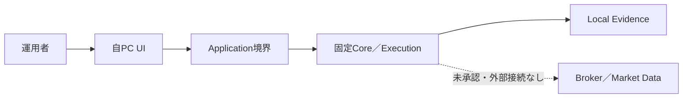

#### FIG-V2-002 起動→設定→Run→停止→復旧（F01 §10〜12）

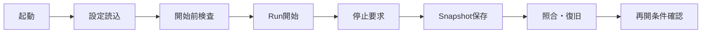

#### FIG-V2-003 Data来歴・Quality・Manifest（F02 §15）

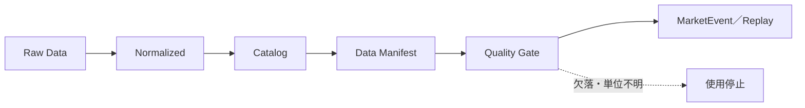

#### FIG-V2-004 Strategy Plugin→Turtle（F02 §16）

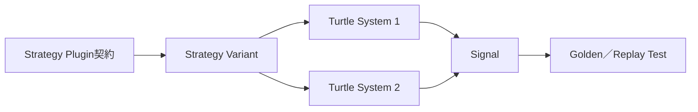

#### FIG-V2-005 Backtest／Sweep／Holdout flow（F03 §19〜22）

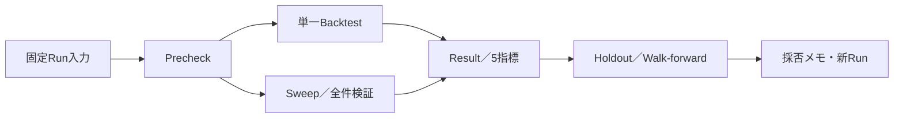

#### FIG-V2-006 Mode昇格・降格・停止（F04 §23〜26）

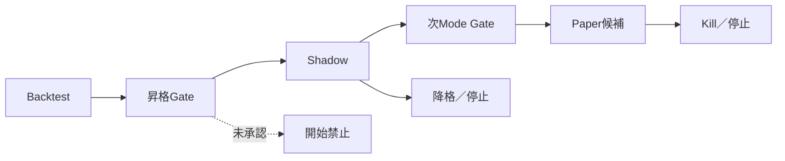

#### FIG-V2-007 Signal→Target→Intent→Order→Fill→Position（F04 §29）

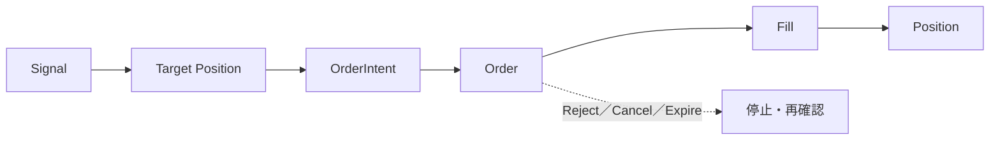

#### FIG-V2-008 Dashboard→Incident→Kill→Reconcile→Resume（F05 §31〜32）

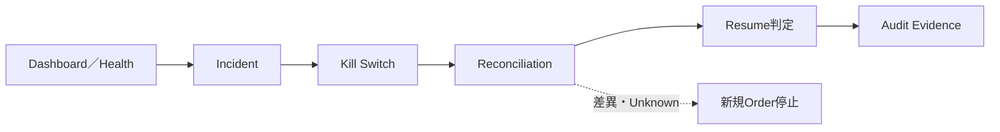

#### FIG-V2-009 UI Navigation・21画面・10状態（F05 §36〜38）

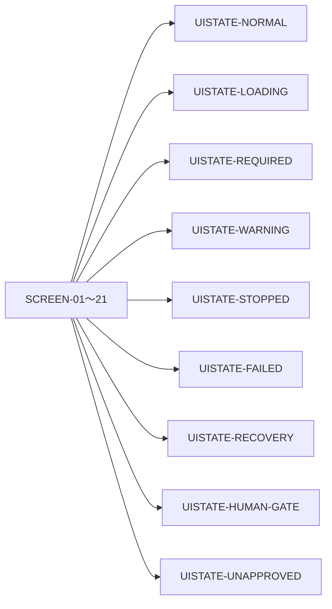

#### FIG-V2-010 Device→HTTPS Relay→PC境界（F05 §46）

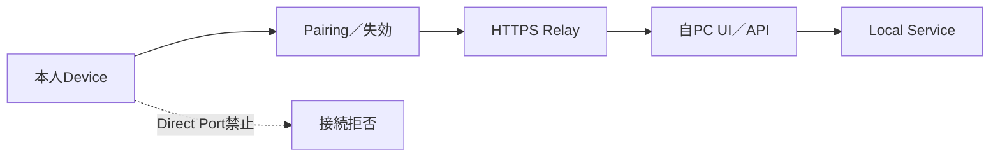

#### FIG-V2-011 Backup→Restore→停止→照合→再開（F05 §35）

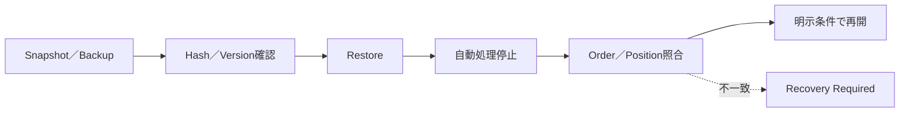

#### FIG-V2-012 Quality／Human Gate／正式化（F05 §51、F06 §60）

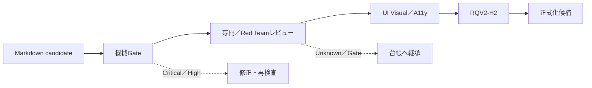

### 59.3 付録チェックリスト

| 付録ID | 内容 | 正本 |
|---|---|---|
| `APP-V2-001` | 用語・状態・Status glossary | F01、F04、F05、F06 |
| `APP-V2-002` | ID registry・命名・採番 | F06 §56 |
| `APP-V2-003` | Q／UC／Screen／State／Test index | F06 §57〜58、RQV2-02 |
| `APP-V2-004` | Error／Dialog／Gate catalog | F04 §29、F05 §39／50／55 |
| `APP-V2-005` | Core再利用・未実証範囲 | RQV2-01、F01〜F05 |
| `APP-V2-006` | Unknown／Blocked／History | 統合台帳、F05 §55、F06 §58／60 |
| `APP-V2-007` | 変更履歴・採否・レビュー | F06 §60〜62 |

### REQ-V2-0109 必須表図付録を配置先・根拠・代替説明付きで管理する

- Shall: システムは、RQU-20が要求する表、Mermaid図、状態図、Sequence、UI Matrix、Error／Dialog／Gate catalog、Core状態、Unknown、変更履歴について、ID、正本配置、入力、リンク、同義文章・代替説明、状態をチェックできなければならない。
- Source: RQU-20 §59、F01〜F05、RQV2-04執筆規約、Design Doc Set Writer Skill
- Reason: 図・表の存在だけを確認して内容・配置・リンク・代替説明を漏らさないため。
- Assumptions: 正式HTML化はRQV2-13。現段階はMarkdown候補と配置・追跡を確定する。
- Inputs: Required table／figure／appendix、Fragment、REQ、UC、Screen、Test、HTML plan。
- Processing: ID、正本、参照、文章代替、状態、欠落・重複・リンクを検査する。
- Outputs: Table／Figure／Appendix checklist、未配置、欠落、リンク切れ、Review finding。
- Exceptions: 図の意味不明、表の空行、代替説明欠落、正本重複、HTML導線不明は完了不可とする。
- Stop: 図だけで安全要求を表現、表だけでUC／Q内容を代替、未配置をPass扱いする場合。
- Recovery: 正本Fragmentへ戻り、表・図・文章・ID・Linkを追加して再レビューする。
- Persistence: 表図ID、配置、入力、出力、Link、状態、hash、レビューを保存する。
- Acceptance: 必須表14件、図12件、付録7件が一意ID・正本・代替説明・状態付きで確認できること。
- Implementation status: `DRAFT_BODY`
- Target phase: RQV2-10〜15、正式HTML化
- Traceability: `TABLE-V2-*`、`FIG-V2-*`、`APP-V2-*`、RQU-20 §59

## 60. 執筆・レビュー・正式化の品質Gate

### 60.1 Gate分類

| Gate ID | 種別 | 判定主体 | 合格条件 | 不合格・Unknown時 |
|---|---|---|---|---|
| `GATE-V2-01` | 機械 | ルートAgent | 63章、見出し、REQ採番、必須欄、ID重複0 | 修正して再検査 |
| `GATE-V2-02` | 機械 | Traceability | Q308、UC67、Screen21、REQ全件、孤立0、リンク | 未収容・リンク切れを修正 |
| `GATE-V2-03` | 機械 | Quality | `git diff --check`、表図Checklist、History／Current検査 | 不合格を保持 |
| `GATE-V2-04` | 専門 | A90／A160 | Findings first、Risk、Secret、OMS、Fail-closed | High/CriticalはH2前に解消または明示継承 |
| `GATE-V2-05` | UI機械 | A171 | Playwright、Visual、axe、Keyboard、focus、PC／スマホ | 未確認はUnknown、Pass化しない |
| `GATE-V2-06` | 統合 | A81 | 断片間用語、正本、リンク、Unknown、履歴、採否 | 統合candidateへ戻す |
| `GATE-V2-H2` | Human | 運用者 | 最終candidate、Critical／High、追跡、Unknown、hashを承認 | 承認までRQV2-16を開始しない |
| `GATE-V2-07` | 正式化 | ルート／A81 | Markdown／HTML／index／リンク／再検証 | H3・別判断へ戻す |
| `GATE-V2-H3` | Human | 運用者 | 正式v2・新Phase基準線を承認 | Phase実装は別計画・別Gate |

Human Gateは機械Gateの不合格を上書きしない。`RQV2-BLK-001`の運用者上書きは、Phase 1証拠欠落を機械Passへ変更しない。`RQV2-H2`承認前はRQV2-16（正式HTML・公開・最終検証）を開始しない。

### REQ-V2-0110 執筆・機械・専門・Human Gateを混同しない

- Shall: システムは、本文執筆、機械検査、Traceability検査、専門／Red Teamレビュー、UI Visual／A11y、統合、Human Gate、正式化を別Gate・別判定・別Evidenceとして記録し、Unknownや機械不合格をHuman承認だけでPassにしてはならない。
- Source: RQU-20 §60、RQV2-PLAN-001 §10、指定Orchestrator／Agent／Skill定義
- Reason: 件数・見た目・運用者承認の一つだけで、未検証の安全境界・リンク・品質を完了扱いしないため。
- Assumptions: Human Gateは意味・範囲・残課題を承認するが、機械証拠を生成しない。
- Inputs: Draft、Test、Review、Findings、Traceability、Hash、Gate、Operator approval。
- Processing: Gate順序、判定、修正、再検査、採否、履歴、残Riskを管理する。
- Outputs: Gate status、Finding、Adoption／Defer／Reject、Evidence、次Step可否。
- Exceptions: Gate証拠欠落、Critical／High、Unknown、リンク切れ、Scope外変更は停止または未完了とする。
- Stop: Human承認だけで機械不合格をPass、未実証性能を完了、H2前にRQV2-16を開始する場合。
- Recovery: 前Gateへ戻り、修正・再試験・再レビューを行い、残課題は台帳へ同期する。
- Persistence: Gate、判定者、時刻、入力hash、結果、Finding、採否、残Risk、承認記録を保存する。
- Acceptance: GATE-V2-01〜07とH2／H3が別状態で確認でき、承認前Stepが開始されないこと。
- Implementation status: `IMPLEMENTED_UNVERIFIED`（実行計画・ログ枠）
- Target phase: RQV2-10〜17、Human Gate
- Traceability: `GATE-V2-01`〜`GATE-V2-H3`、RQV2-H2、RQV2-H3、`ART-V2-GATE-001`

## 61. この構成案の使用方法

### 61.1 読み方

1. まず統合Blocked台帳の現在欄、RQV2-H0／H1／H2／H3、RQV2-BLK-001を読む。
2. 次にF01からF06を章順に読み、各REQの`Traceability`、Status、Target phase、Stop、Recoveryを確認する。
3. UIを確認する場合は、F05 §37〜41とRQV2-02／03のScreen・State・Evidenceを往復する。UIモック表示を正式実装・外部接続・実注文の証拠としない。
4. QやUCから読む場合は、F06 §57〜58とRQV2-02の詳細行からREQ／Screen／State／Test／Gateへ進む。
5. Unknown、LATER_GATE、HISTORY、BLOCKEDは、現在状態と履歴を分けて読み、統合台帳の再開条件を確認する。

### 61.2 変更方法

変更は、①根拠資料・回答・既存証拠を確認、②正本Fragmentを特定、③REQ／UC／Q／Screen／State／Test／Gateの影響を列挙、④IDと版を更新、⑤リンク・重複・孤立・History混入を検査、⑥専門レビュー、⑦統合candidateへの採否反映、⑧変更履歴と台帳を更新、の順に行う。既存Core・UI本体を変更する場合は本計画外の別依頼・別Gateとする。

### 61.3 旧文書との関係

旧要件定義書・RQU-UI成果物・Phase 1〜3設計・証拠は、実装済み・決定済み・履歴・固定Fixtureの根拠として参照する。旧章立て・本文をv2へ無条件に継承しない。旧要求IDは履歴・別名として残し、v2正本はREQ-V2とする。`tests/evidence/phase1/`の物理欠落はRQV2-BLK-001の運用者上書きがあっても解消済みと表現しない。

### REQ-V2-0111 構成案の読み方・変更方法・旧文書境界を固定する

- Shall: システムは、統合台帳→F01〜F06→REQ／Traceability→Q／UC／Screen／Test／Gateの読み方、正本Fragmentの変更手順、旧文書・履歴・固定Evidenceの参照境界、実装・UI本体変更の別Gateを文書内で説明しなければならない。
- Source: RQU-20 §61、RQV2-04執筆規約、AGENTS.md入口・更新ルール
- Reason: 読み手が旧文書を現行正本と誤認したり、断片を直接編集して追跡を壊したりしないため。
- Assumptions: 正式HTML・index導線はRQV2-13で生成・検査する。
- Inputs: Plan、Ledger、Fragments、Legacy docs、Evidence、Change request、Gate policy。
- Processing: 読み順、正本、参照、変更、Impact、Review、History、Gateを示す。
- Outputs: Usage guide、Change procedure、Legacy boundary、次Action、Evidence。
- Exceptions: 正本不明、旧Current混入、別Fragmentの直接改訂、Gate抜けは変更不可とする。
- Stop: 旧文書の無条件継承、履歴のCurrent表示、Core／UI本体への暗黙変更を検出した場合。
- Recovery: 正本FragmentとPlanへ戻り、影響・採否・履歴・台帳を更新する。
- Persistence: Change request、影響、正本、参照、Review、Gate、版、操作者を保存する。
- Acceptance: 新規読者が読み順・正本・旧文書境界・変更手順・次Gateを一つの付録で確認できること。
- Implementation status: `DRAFT_BODY`
- Target phase: RQV2-10〜15、正式HTML・運用引渡し
- Traceability: RQU-20 §61、RQV2-PLAN-001、`ART-V2-USAGE-001`

## 62. 変更履歴

### 62.1 RQV2-10の履歴

| 日付 | 版 | 変更 | 判定・次Step |
|---|---|---|---|
| 2026-08-11 | v0.1 | RQV2-04で章56〜62の見出し・編集所有権を固定 | 本文執筆をRQV2-10へ引渡し |
| 2026-08-11 | v0.2 | Q308、UC67、Screen21、REQ範囲、表図、Gate、使用方法、旧文書境界、Historyを本文candidate化 | 機械検査・専門レビュー・RQV2-11へ引渡し |

### 62.2 変更記録の規則

変更記録には、日付、Step、対象Fragment・章・ID、変更理由、根拠、採否、影響、機械検査、レビューFinding、残Unknown、次Gate、作成者を含める。新しい事実はCurrent欄へ反映し、古い事実は`HISTORY`・日付・参照先を明示する。RQV2-02追跡Matrix、統合Blocked台帳、実行ログ、各Fragmentの履歴を同時に検索し、現在状態の矛盾を残さない。

### REQ-V2-0112 変更履歴とCurrent／HISTORYを同期する

- Shall: システムは、変更ごとに日付、Step、Fragment、章、ID、理由、根拠、採否、影響、検査、Finding、Unknown、次Gate、作成者を保存し、CurrentとHISTORYを状態・日付・参照先付きで分離しなければならない。
- Source: RQU-20 §62、AGENTS.md更新ルール、RQV2-01〜10実行ログ、統合台帳
- Reason: 古い事実を現在状態へ混入させず、承認・撤回・再オープン・解消の履歴を監査可能にするため。
- Assumptions: 統合台帳は横断正本、実行ログはStep証跡、各Fragmentの変更履歴は本文の局所履歴とする。
- Inputs: Change、Current、History、Ledger、Log、Review、Gate、Evidence、Version。
- Processing: 全関連文書検索、現在状態整合、履歴化、Link、hash、Reviewを更新する。
- Outputs: Current／History、Change log、矛盾一覧、次Gate、Evidence。
- Exceptions: HistoryのCurrent混入、台帳と本文の矛盾、承認記録欠落、Version衝突は正式化不可とする。
- Stop: 古いH1未承認をCurrent表示、Q-277を現行採用、RQV2-BLK-001の欠落事実を消す場合。
- Recovery: 現行事実・承認・台帳・ログ・履歴を照合し、履歴注記付きで修正する。
- Persistence: 変更記録、前後Version、hash、Current／History、承認、Review、操作者、時刻を保存する。
- Acceptance: RQV2-01〜10の判定・承認・開始Step・残Unknownが各文書で矛盾なく表示されること。
- Implementation status: `IMPLEMENTED_UNVERIFIED`（実行ログ・統合台帳の現行更新）／正式HTML同期は`NOT_IMPLEMENTED`
- Target phase: RQV2-10〜17、H2／H3
- Traceability: RQV2-01〜10、RQV2-H0／H1／H2／H3、`ART-V2-HISTORY-001`

### 62.3 RQV2-10 Findings first

| Finding ID | 重大度 | 指摘 | 対応 |
|---|---|---|---|
| `RQV2-10-F-001` | Critical | 件数だけ一致したQ／UC一覧では、内容空行・孤立要求・循環参照を見逃す。 | Qの分類集合、UCのScreen／State／E2E／Q、REQの正本・Traceability、孤立0条件を収容した。 |
| `RQV2-10-F-002` | High | Q-277の撤回、Q-243のUnknown、RQV2-BLK-001の運用者上書きをCurrentへ混入させる危険がある。 | HISTORY／UNKNOWN／PASS_WITH_OPERATOR_OVERRIDEを別状態で記録し、統合台帳へのリンクを固定した。 |
| `RQV2-10-F-003` | High | 表・図・付録が各Fragmentに分散すると、正式HTMLで正本・導線・代替説明が欠落する。 | TABLE／FIG／APP ID、配置、入力、Link、同義文章、RQV2-13導線をChecklist化した。 |
| `RQV2-10-F-004` | High | Human Gateと機械Gateを混同すると、未実証性能・UI未確認・外部接続が承認済みと誤認される。 | Gate種別、判定主体、Evidence、停止、H2前RQV2-16禁止を分離した。 |
| `RQV2-10-F-005` | Medium | 旧別名・新REQ・UC-V2の採番が併存すると、同じ意味の二重正本が生じる。 | REQ-V2を正本、旧REQ／ADD-UCを参照別名とし、Fragment範囲とRegistryを固定した。 |

**RQV2-10判定: `COMPLETE_WITH_FULL_Q_UC_TRACEABILITY_APPENDIX`。** 章56〜62の7章、REQ-V2-0106〜0112、Q308行の分類集合、UC67件のScreen／State／E2E／Q対応、必須表14件・図12件・付録7件、Gate、使用方法、旧文書境界、変更履歴を記載した。RQV2-11はF07（Phase 4〜11再編ロードマップ）だけを編集対象として開始する。

### 62.4 変更履歴

| 日付 | 版 | 内容 |
|---|---|---|
| 2026-08-11 | v0.1 | RQV2-10で章56〜62を本文candidate化。Q／UC／REQ／Screen／State／Test／Gate／Evidenceの追跡、表図付録、品質Gate、使用方法、変更履歴を記載した。 |

### 62.5 RQV2-11統合：Phase 4〜11ゼロベース再編ロードマップ

独立artifact [RQV2-11 Phase 4以降再編ロードマップ](../../RQV2_Phase4以降再編ロードマップ_2026-08-11.md) を、candidateの追跡・変更履歴の正本である本章へ統合する。以下は独立artifactの内容を章62の下位見出しへ収容したものであり、Phase 4開始承認ではない。

| 統合ID | 内容 |
|---|---|
| `RQV2-ART-11-ROADMAP-001` | Phase 4〜11の目的、利用者能力、REQ範囲、再利用Core、成果物、依存、非対象、開始／完了条件、Quality／Human Gate、Unknown解消先、旧新対応 |
| 発火境界 | `RQV2-H3` → Phase 4実行計画・詳細設計・開始Gate。以降はP4→P5→P6→P7→P8→P9→P10→P11の順 |
| 外部副作用 | Broker、Paper、Secret、実注文、実資金、Cloudは各独立Human Gateまで禁止 |
| 残存状態 | `UNK-P3-01`、`UNK-P3-05`、`UNK-P3-07`、Q-243、`RQV2-BLK-001`の欠落事実を解消済みPassへ変換しない |

#### 1. 再編の目的と原則

##### 1.1 目的

旧Phase 4〜8の機能順を、実注文より先にProduct／Application基盤、Data、Portfolio／Risk／OMS、安全停止、Paper、長期運用を完成させる依存順へ再編する。新Phase 4〜11は、RQV2-05〜10のREQ・UC・Screen・State・Gate・Unknownに接続し、各Phaseで「利用者ができること」「安全に止まること」「Evidenceを残すこと」「次Phaseへ渡せること」を判定する。

##### 1.2 共通原則

1. Python Coreは原則無改変で再利用する。変更が必要な場合は、別の詳細設計、RED試験、影響レビュー、Human Gateを要する。
2. Broker注文より先にPortfolio／Risk／OMS／Kill Switch／照合／復旧を完成させる。
3. Backtest／Forward／Shadow／Paper／Live候補／小規模Live／通常Liveを別Mode・別Gateとして扱う。
4. `CONFIRMED`は回答方針の採用を意味し、実装済み・実証済み・利益性を意味しない。
5. `LATER_GATE`、`UNKNOWN`、`BLOCKED`、`HISTORY`をPassへ変換しない。Q-277の撤回、Q-243のGate、`RQV2-BLK-001`の物理欠落をCurrentへ混入させない。
6. 各Phase開始前に、そのPhase専用の複数Step実行計画書を作成し、成果物、依存、Human Gate、停止条件、証跡配置を確定する。
7. 全外部I/O、Secret、実資金、実注文、Cloud公開は、必要なPhaseで独立したHuman Gateを置く。

#### 2. 依存DAGと発火制御

##### 2.1 Phase依存DAG

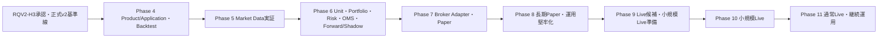

##### 2.2 発火制御

| 制御点 | 発火条件 | 発火しない条件 |
|---|---|---|
| Roadmap確定 | RQV2-10／11の内容・依存・Unknown・旧新対応をレビュー済み | RQV2-H2未承認でも候補として記録するが、実Phaseは開始しない |
| Phase 4 | RQV2-H3承認、Phase 4実行計画、詳細設計、Core再利用確認、開始Human Gate | H3未承認、Core差分不明、Critical／High未解消、入力範囲不明 |
| Phase 5 | Phase 4のData接続点・保存・Evidenceが完了、外部Data Gate承認 | Provider／費用／Secret／対象範囲不明、UNK-P3-01／05／07未評価 |
| Phase 6 | Data品質・Calendar・Cost実証の対象範囲が固定、Risk／OMS詳細設計とREDが完了 | Risk未定義、Order前判定なし、Kill／照合／復旧未設計 |
| Phase 7 | Phase 6のsimulation合格、Broker Adapter詳細設計、Paper／Secret／接続Gate承認 | 実注文、実資金、Live、照合・部分約定・再接続未検証 |
| Phase 8 | Paperの限定Gate、Phase 7の注文Lifecycle証拠、運用Runbook | 長期・負荷・Backup／Restore・端末境界未検証 |
| Phase 9 | 長期Paper、実値、法務・費用・Risk・Kill訓練、候補Gate | 実資金、実注文、自動承認、未解決Critical／High |
| Phase 10 | 小規模Liveの別Human Gate、対象・金額・期間・停止条件の承認 | Phase 9未完、照合・日次監視・損失停止不明 |
| Phase 11 | 小規模Liveの評価、通常Liveの別Human Gate、段階拡大条件 | 変更・Risk・SLO・監査・復旧・再承認が不十分 |

Phase内の詳細なStep順は、そのPhaseの実行計画書で定める。ここではPhase間のDAGだけを正本とし、Phaseを跨ぐ循環依存を許可しない。

#### 3. Phase 4：Product/Application基盤とBacktest製品化

##### 3.1 目的・利用者能力・対象要求

利用者が、固定・再現可能なData／Strategy／Config／Riskを画面または型付き入力から指定し、単一Backtest、Sweep、Result、Chart、取引明細、Evidenceを操作できる製品境界を作る。主対象はF01の基礎・起動／停止、F02のData／Strategy／Unit／Run、F03のBacktest／Sweep／Holdout、F05のAPI／UI／保存／Test要求である。

利用者能力は、設定Version作成、事前検査、Run／Job／Queue確認、Cancel／Stop、checkpointからの再開、5指標確認、全件表・CSV Job、同条件Run履歴、Holdout境界確認とする。外部Dataの継続取得、Broker、Paper、Live、実資金、Secret、Cloudは対象外とする。

##### 3.2 再利用Core・成果物

| 区分 | 内容 |
|---|---|
| 再利用 | Replay、Fill、Cost、Roll、Gap、Calendar、Holdout、Turtle Strategy、Manifest、固定fixture、既存Core APIの必要最小範囲 |
| 未一般化 | 実市場長期性能、Provider契約、実Cost／Slippage、Paper／Live、UI／API／Worker統合 |
| 主成果物 | Phase 4実行計画、詳細設計、型付きRunモデル、API／UI境界、Persistence設計、Backtest／Sweep実装、Test／Evidence、Runbook |
| 保存先 | Phase 4正式HTMLは`doc/phase4/`、計画・ログは`plan/`、証跡は`tests/evidence/phase4/<RunId>/` |

##### 3.3 依存・非対象・開始条件

- 依存：RQV2-H3承認、v2正式基準線、RQV2-01 Core再利用範囲、F01〜F06のREQ・Traceability。
- 非対象：外部Data取得、Broker接続、Secret、Paper注文、Live注文、実資金、Cloud、Core本体の無承認変更。
- 開始条件：Phase 4実行計画、詳細設計、REDテスト、Core差分0または承認済みChange、Human Gate。
- 停止条件：入力Manifest不一致、Risk欠落、未来参照、保存不一致、Idempotency不明、Critical／High、外部I/O混入。

##### 3.4 完了条件・Gate・Unknown解消先

- 完了：単一／Sweepの入力・状態・結果・Evidenceが再現でき、UI・API・Worker・Persistenceの境界が機械検証される。
- Quality Gate：REQ／UC／Test追跡、Golden／Replay、API／File契約、UI主要状態、Critical／High 0、`git diff --check`、証跡hash。
- Human Gate：Phase 4成果物、Core無改変範囲、Backtest製品化範囲、次PhaseData境界を承認する。外部Data・実注文は承認しない。
- Unknown解消先：UI／Worker性能はP4で測定設計、`UNK-P3-01/05/07`と実DataはP5、実Broker／PaperはP7以降へ残す。

#### 4. Phase 5：市場データ運用化と実証

##### 4.1 目的・利用者能力・対象要求

初期5候補（MCL、M6A、MZC、MZS、MZW）の論理IDから実Symbol、取引所、限月、Roll、単位、Provider／Broker対応を確定し、4資産種類、D1／H4／H1／M30／M15、Data Quality、正式Calendar、実測Cost／Slippage／Gap、長期期間、Holdout／Walk-forwardをEvidence付きで検証する。主対象はF02 §13〜15、F03 §22、F05 §43／47／55、`UNK-P3-01`、`UNK-P3-05`、`UNK-P3-07`である。

利用者能力は、Catalog確認、Data取得要求、Raw／Normalized／Quality／Manifest比較、欠損・重複・時刻逆行の停止、Calendar更新確認、期間・費用・Gap仮定の表示とする。Data契約、費用、Secret、外部接続は別Gateで承認する。

##### 4.2 再利用Core・成果物

| 区分 | 内容 |
|---|---|
| 再利用 | DBN decoder、Raw／Normalized store、Catalog／Manifest、Quality、固定Timeframe／M30 provenance、Replay入力契約 |
| 実証対象 | 初期5候補、4資産構造、実Data期間・本数・欠落、正式Calendar、Cost／Slippage／Gap、長期Holdout |
| 主成果物 | Data source／費用／Secret Gate記録、Catalog、Quality report、Provenance／hash、Calendar監視、Cost／Gap report、期間分割Evidence |
| 保存先 | Phase 5正式HTMLは`doc/phase5/`、外部Data証跡は`tests/evidence/phase5/<RunId>/`、Unknown更新は統合台帳 |

##### 4.3 依存・非対象・開始条件

- 依存：P4の型付きData／Manifest／保存／品質接続点、Data Provider契約、Human Gate。
- 非対象：利益性の採用、Broker注文、Paper／Live、実資金、未承認Secretの投入、20〜40 Unitの連続運用。
- 開始条件：対象Symbol・期間・Data source・費用・Secret範囲・取得方法・停止条件・Evidence配置がGateで承認される。
- 停止条件：entitlement不明、費用上限不明、Data欠損を埋める推測、Calendar未確認、未来Data、外部送信範囲不明。

##### 4.4 完了条件・Gate・Unknown解消先

- 完了：対象ごとのProvenance、hash、Quality、Calendar、Cost／Slippage／Gap、期間分割、欠落・停止・再生成の証拠がある。
- Quality Gate：Data contract、再現、Look-ahead／Survivorship防止、固定・実測値分離、外部通信・Secret監査、未確認範囲0ではなく明示。
- Human Gate：Data契約、費用、保存・再配布、対象範囲、外部接続方式を承認する。利益性・Live適合は承認しない。
- Unknown解消先：`UNK-P3-01/05/07`をP5のEvidenceで解消または未解消のままP6以降へ再分類する。未解消をPassにしない。

#### 5. Phase 6：複数運用単位・Portfolio／Risk／OMS・Forward／Shadow

##### 5.1 目的・利用者能力・対象要求

複数Unitを同時に管理し、Portfolio／Account／資金配分、Risk設定・判定、Signal→Target Position→OrderIntent→Order→Fill→Position、Idempotency、競合、部分約定モデル、照合前停止、Kill、再起動・復旧を外部Orderなしで実装・固定Simulationする。主対象はF02 §17〜18、F04 §23〜30、F05 §31〜34／44／48である。

利用者能力は、Unit作成・開始・停止、Risk Version、Portfolio集約、Risk拒否、仮想Forward／Shadow、OrderIntentの確認、Partial／Reject／Expireの表示、Incident、Snapshot照合、手動再開とする。

##### 5.2 再利用Core・成果物

| 区分 | 内容 |
|---|---|
| 再利用 | Unit Key、Run／Job／Queue、Signal／Strategy、固定Replay／Fill、既存停止・Snapshot契約、固定Evidence |
| 新規境界 | Portfolio／Account、Risk、OMS、Order状態、Idempotency、競合、Resource制御、Forward／Shadow仮想実行 |
| 主成果物 | Portfolio／Risk／OMS詳細設計、State／Event schema、Simulation、Failure injection、Restart／Reconcile report、UI／API接続、Runbook |
| 保存先 | Phase 6正式HTMLは`doc/phase6/`、固定Simulation証跡は`tests/evidence/phase6/<RunId>/` |

##### 5.3 依存・非対象・開始条件

- 依存：P4製品基盤、P5 Data品質・Manifest・Calendarの対象範囲、Risk・OMS詳細設計、REDテスト。
- 非対象：Brokerへの外部送信、Secret、Paper注文、実Account、実資金、Live、Cloud。
- 開始条件：Risk必須、Order前Risk、Idempotency、Kill、照合、Fail-closed、既存Position非自動処分、Simulation fixtureが固定される。
- 停止条件：Risk bypass、Order前判定なし、Duplicate、Unknown Fill、差分無視、自動Resume、Mode混同。

##### 5.4 完了条件・Gate・Unknown解消先

- 完了：20〜40候補の構造的負荷制御、複数Unit、競合、Restart、Idempotency、Risk限度、仮想Forward／Shadow、照合・復旧が固定条件で合格する。
- Quality Gate：Unit／Portfolio／Risk／OMS契約、状態遷移、Failure injection、Contract／Integration／Recovery、Critical／High 0。
- Human Gate：Portfolio／Risk／OMSの責務・限度・Simulation範囲を承認する。外部Order権限は承認しない。
- Unknown解消先：実Risk値・1N・Kill待ち・初回Order上限はP9、Broker照合・PaperはP7、長期・負荷実機はP8。

#### 6. Phase 7：Broker AdapterとPaper Trading

##### 6.1 目的・利用者能力・対象要求

Broker固有依存をAdapterへ閉じ込め、Account同期、Order／Fill／Position同期、注文Lifecycle、部分約定、Reject、Cancel、Expire、再接続、照合、重複防止、Paper仮想Ledgerを、明示的に承認されたPaper環境で検証する。主対象はF04 §30、F05 §43〜46／48／51、F06 Gateである。

利用者能力は、Paper開始Review、Connection状態、仮想／外部の区別、Order・Fill・Position、差異一覧、停止、照合、手動再開、Paper結果のCandidate化とする。Live注文・実資金は対象外とする。

##### 6.2 再利用Core・成果物

| 区分 | 内容 |
|---|---|
| 再利用 | P6のOMS／Risk／Kill／Reconcile、Adapter共通契約、固定Fixture、Paper状態モデル |
| Gate対象 | Broker採否、Secret管理、Sandbox／Paper契約、費用、Rate Limit、実外部I/O、Account同期 |
| 主成果物 | Broker Adapter詳細設計、Contract／Sandbox Test、Paper Runbook、注文Lifecycle・差異・再接続・停止Evidence |
| 保存先 | Phase 7正式HTMLは`doc/phase7/`、接続・Paper証跡は`tests/evidence/phase7/<RunId>/`。Secret値は保存しない |

##### 6.3 依存・非対象・開始条件

- 依存：P6のRisk／OMS／Kill／Reconcile固定Simulation合格、対象Broker候補、Paper／Secret／外部I/O各Human Gate。
- 非対象：Live注文、実資金、通常Live、未承認Broker、実Accountの無制限利用、Cloud。
- 開始条件：Adapter契約、Secret参照・Mask、Sandbox範囲、注文上限、費用、停止・照合・再接続、Evidence配置が承認される。
- 停止条件：未知応答成功扱い、Secret平文、照合前Resume、Duplicate、Broker差異無視、PaperからLiveへの自動昇格。

##### 6.4 完了条件・Gate・Unknown解消先

- 完了：承認範囲内PaperでOrder Lifecycle、Partial／Reject／Cancel、再接続、Account／Order／Fill／Position照合、停止・復旧がEvidence付きで合格する。
- Quality Gate：Adapter Contract、Sandbox／Paper、Security、Secret Mask、Idempotency、Recovery、Audit、外部通信範囲。
- Human Gate：Broker採用、Secret保管、Paper環境、費用、接続、注文上限、停止・再開を承認する。Liveは別Gate。
- Unknown解消先：P8で長期Paper・負荷・Backup・端末、P9でEngine・実値・Live候補、P10で実資金。

#### 7. Phase 8：運用堅牢化・長期Paper

##### 7.1 目的・利用者能力・対象要求

Dashboard、通知、Incident、Kill、Backup／Restore、長期Paper、20〜40 Unit、Soak、容量、復旧、スマートフォンHTTPS中継、端末Pairing／失効、PC／スマホVisual・a11y、運用Checklistを実機条件で検証する。主対象はF05 §31〜55とP7のPaper証拠である。

利用者能力は、日次・週次・月次確認、遅延・Health・容量、Alert確認・解消、停止・復旧、Backup／Restore、端末失効、Paper長期Report、再試行・再開とする。

##### 7.2 再利用Core・成果物

| 区分 | 内容 |
|---|---|
| 再利用 | P7 Paper、P6 Safety／OMS、F05 UI／Ops／Security要求、固定Test・Evidence形式 |
| 実証対象 | 長期連続、20〜40 Unit、実PC容量、CSV／UI性能、Backup／Restore、端末・中継、障害復旧 |
| 主成果物 | Operations Runbook、Soak／Load report、Backup／Restore証跡、Device／Relay Gate、SLO候補、Incident catalog |
| 保存先 | Phase 8正式HTMLは`doc/phase8/`、長期・隔離証跡は`tests/evidence/phase8/<RunId>/` |

##### 7.3 依存・非対象・開始条件

- 依存：P7のPaper契約・Lifecycle・停止・照合、P5のData期間・Quality、P4の性能計測枠。
- 非対象：実資金Live、通常Live、無制限Remote公開、Cloud移行、外部Pushの本採用。
- 開始条件：Soak範囲、PC・Network・Browser、端末、Backup対象・保存先、RPO／RTO測定、Stop／Recovery Runbookが承認される。
- 停止条件：長期中の自動Resume、容量不足で既存Audit破壊、端末未登録、Backup復元不一致、Critical／High。

##### 7.4 完了条件・Gate・Unknown解消先

- 完了：長期Paper、20〜40 Unit、障害復旧、Backup／Restore、容量制御、端末境界、PC／スマホ主要操作、品質GateがEvidence付きで合格する。
- Quality Gate：Soak、Load、Recovery、Security、Backup、Visual／A11y、容量、Audit、Runbook drill。
- Human Gate：Paper継続、端末・中継、Backup／Restore、SLO候補、Live候補へ進む条件を承認する。実資金は承認しない。
- Unknown解消先：実PC・20〜40 Unit・RPO／RTO・中継実到達・Backup実装を解消またはP9のCandidate Gateへ明示継承する。

#### 8. Phase 9：Live候補・小規模Live準備

##### 8.1 目的・利用者能力・対象要求

Live候補を、実注文前のCandidateとして評価し、最終Engine、実Symbol／契約、Risk実値、1N、限度、費用、法務、運用Runbook、Kill訓練、停止・照合・日次確認、Auto-approval設定を実資金なしで確定する。主対象はF04 §26／28〜30、F05 §46／49／53〜55、P5〜P8のEvidenceである。

利用者能力は、Candidate作成・差分表示・未達一覧、開始Review、Confirm／Cancel設定、Kill drill、損失・Exposure限度、実値・契約・費用の確認と、Small Live開始要求の作成（実行なし）とする。

##### 8.2 再利用Core・成果物

| 区分 | 内容 |
|---|---|
| 再利用 | P6 Risk／OMS、P7 Adapter／Paper、P8 Ops／Backup／Device、RQV2 Traceability／Gate |
| 未採用 | Candidate評価をLive承認としない。実資金・実注文・Cloudは別Gate |
| 主成果物 | Engine選定記録、実契約・Risk台帳、Live候補Checklist、Kill drill、運用Runbook、法務・費用・限度Evidence |
| 保存先 | Phase 9正式HTMLは`doc/phase9/`、Candidate／Drill証跡は`tests/evidence/phase9/<RunId>/` |

##### 8.3 依存・非対象・開始条件

- 依存：P8の長期Paper・運用・復旧・端末・Backup、P5の実Data／Calendar／Cost、P7のAdapter／Paper。
- 非対象：実資金、実注文、Live Auto-approvalの実運用、対象拡大、通常Live。
- 開始条件：Candidate対象、Engine、実Symbol／契約、Risk実値、費用、法務、Kill／損失上限、停止・照合・再開条件がEvidence付きで確認される。
- 停止条件：未解決Critical／High、実値不明、実Account接続、Secret・実Order、Candidateからの自動昇格。

##### 8.4 完了条件・Gate・Unknown解消先

- 完了：未解決Critical／High 0、Candidate全差分、実値、Kill訓練、限度・費用・法務、開始・停止・復旧条件が承認可能なEvidenceになる。
- Quality Gate：Candidate／Risk／Engine／Legal／Security／Kill／Reconcile／Audit／Runbook。
- Human Gate：Small Liveの対象・資金・期間・Order上限・Auto-approval設定・停止条件を別途承認する。承認前に実注文しない。
- Unknown解消先：未解消は統合台帳へ戻し、P10の開始条件を満たさない理由として残す。

#### 9. Phase 10：小規模Live

##### 9.1 目的・利用者能力・対象要求

明示された少額・少数Unit・限定期間・限定Symbol／Account Scopeで、初めて実資金・実注文を扱う。対象はP9の承認範囲だけとし、日次資金・Risk・Order・Fill・Position照合、停止、損失・Exposure限度、通信・Broker差異、Auto-approval、Incident、Auditを運用する。

##### 9.2 再利用Core・成果物

| 区分 | 内容 |
|---|---|
| 再利用 | P6 Risk／OMS、P7 Adapter／Paper、P8 Runbook／Backup／Device、P9 Candidate／Kill drill |
| 実資金範囲 | Human Gateで明示されたAccount／Instrument／Unit／期間／限度だけ |
| 主成果物 | Small Live実行計画、開始・日次・停止・照合Runbook、実運用Evidence、Incident／損失報告、拡大判定 |
| 保存先 | Phase 10正式HTMLは`doc/phase10/`、実運用証跡は`tests/evidence/phase10/<RunId>/`。Secret値は保存しない |

##### 9.3 依存・非対象・開始条件

- 依存：P9完了、Small Live別Human Gate、実Account・Secret・Broker・費用・法務・Kill・照合の承認。
- 非対象：通常Live、対象拡大、未承認Auto-approval、別Broker／Engine／Risk、Cloud移行。
- 開始条件：資金・数量・期間・対象・損失／Exposure／Order上限、停止・照合・手動介入、証跡・責任者が署名される。
- 停止条件：損失・Risk・通信・照合・Secret・Order Unknown、Limit超過、手動介入不能、日次確認欠落。

##### 9.4 完了条件・Gate・Unknown解消先

- 完了：限定期間内で、損失・異常・照合・停止基準を守り、全Order／Fill／Position／資金／Audit／Incidentを再現可能に保存する。
- Quality Gate：実運用監視、Risk／OMS、Broker Reconcile、Kill、Backup、日次確認、Incident、Secret／Access監査。
- Human Gate：通常Liveへの拡大可否を承認する。Passしない場合は停止・降格・Paperへ戻す。
- Unknown解消先：Limit・SLO・復旧・Broker差異・運用負荷の未解消はP11開始条件へ持ち越さず、台帳で明示する。

#### 10. Phase 11：通常Live・継続運用

##### 10.1 目的・利用者能力・対象要求

小規模Liveで承認された範囲を基に、対象・Unit・資金・Riskを段階的に拡大し、継続監視、更新、再検証、Audit、Backup、Incident、復旧、変更・再承認、将来Cloud／VM移行判断を行う。通常Liveは一度の承認で無制限に拡大せず、変更単位ごとにScopeとRiskを再承認する。

##### 10.2 再利用Core・成果物

| 区分 | 内容 |
|---|---|
| 再利用 | P4〜P10の全Evidence、Core契約、Data／Strategy／Risk／OMS／Adapter、Ops／Security／Quality |
| 主成果物 | 通常Live実行計画、SLO／SLA候補、定期再検証、変更・Migration、継続監視、拡大／降格Runbook、Cloud／VM判断 |
| 保存先 | Phase 11正式HTMLは`doc/phase11/`、継続運用証跡は`tests/evidence/phase11/<RunId>/` |

##### 10.3 依存・非対象・開始条件

- 依存：P10の限定Live完了、通常Live別Human Gate、対象・Risk・資金・監視・復旧・監査の再承認。
- 非対象：承認範囲外の自動拡大、無制限Auto-approval、未検証Cloud／VM、別環境への暗黙移行。
- 開始条件：拡大対象、Risk・Limit、SLO、日次・月次再検証、Backup／Restore、Incident、変更・降格・Killが確定する。
- 停止条件：SLO逸脱、Risk／Limit超過、照合差異、監査欠落、変更Version不一致、復旧不能、承認期限切れ。

##### 10.4 完了条件・Gate・Unknown解消先

- 完了：段階拡大、継続監視、定期再検証、Audit、Backup、復旧、変更管理、再承認、降格が継続可能である。
- Quality Gate：SLO、監査、復旧、Security、Data／Strategy再検証、Risk、Broker Reconcile、Backup、変更・Rollback。
- Human Gate：通常Live継続、Scope拡大、Risk変更、Cloud／VM移行を各々承認する。承認なしの変更は停止する。
- Unknown解消先：未解消事項は通常運用へ暗黙に残さず、Phase 11の運用台帳・次期計画・別Gateへ期限・責任者・証拠先付きで移す。

#### 11. 旧Phase 4〜8との対応と変更理由

##### 11.1 旧新対応表

| 旧計画の対象 | 新Phase | 変更理由・扱い |
|---|---|---|
| 旧Phase 2 Market Data | 新P5 | Product基盤をP4で先に作り、実Data・Calendar・Cost・QualityをP5で実証する。旧計画は履歴として保持。 |
| 旧Phase 3 Strategy／Backtest | 新P4 | 既存Coreの固定契約を再利用し、UI／API／Worker／Persistenceへ製品化する。Strategy固有実装はCore凍結。 |
| 旧Phase 4 Broker／Paper | 新P7 | Broker／Paperより先にP6でRisk／OMS／Kill／Reconcileを完成させる。外部接続・Secretは独立Gate。 |
| 旧Phase 5 Portfolio／Risk／Account | 新P6 | Broker注文前の責務境界・Risk・OMS・複数Unitを先に置く。固定Simulationで実証する。 |
| 旧Phase 6 Forward Test | 新P6／P8 | Forward／Shadowの意味・OMSはP6、長期Paper・監視・SoakはP8へ分ける。 |
| 旧Phase 7 Live移行準備 | 新P9 | Live候補・Engine・Risk実値・Kill訓練・法務・費用を実資金なしで確定する。 |
| 旧Phase 8 Live運用 | 新P10／P11 | 小規模Liveと通常Liveを別Human Gate・別Evidence・段階拡大へ分割する。 |

##### 11.2 変更理由

1. 旧順序のBroker／Paper先行を改め、Risk／OMS／Kill／照合をBroker注文より先に置いた。
2. UI、API、Persistence、Job Queue、BacktestをP4へまとめ、利用者が操作できる製品境界を先に作った。
3. Phase 3の固定synthetic／PoC合格と、実市場・長期・Cost・Calendar・Paper／Live実証をP5以降へ分離した。
4. Paper直後にLiveへ進まず、長期Paper、負荷、Backup／Restore、端末・中継をP8で実証する。
5. LiveをCandidate、Small、Normalの3段階にし、各Scope・Risk・実資金・Auto-approvalを別Gateへした。
6. 旧計画は削除・上書きせず、旧文書の状態・時点・変更理由を`HISTORY／SUPERSEDED`として参照可能にする。

#### 12. LATER_GATE／Unknownの解消先一覧

| ID・分類 | 現在状態 | 解消・決定Phase | 必要Evidence・停止条件 |
|---|---|---|---|
| `UNK-P3-01` 長期Data・市場数・Holdout | 未解消・未PASS | P5（必要ならP8へ実運用継承） | 期間・本数・欠落・Manifest・品質・長期Evidence。不足時は開始停止。 |
| `UNK-P3-05` Cost／Slippage／Gap | 未解消・未PASS | P5 | 市場別実測・保守値・Gap規則・感度・根拠。不明時は結果・Live適合を承認しない。 |
| `UNK-P3-07` 正式Calendar | 未解消・未PASS | P5 | 公式Provider・版・短縮日・臨時休場・更新監視。未確認Dataは停止。 |
| Q-243 Gate | UNKNOWN／後続4領域 | P5〜P8 | 安全境界、初期候補、実行可能性、性能の構造と実証を分離。 |
| 実Risk／1N／Kill待ち／初回Order上限 | LATER_GATE | P9 | Risk値、Limit、Kill drill、停止・解除・初回Order承認。 |
| Provider／Broker／Secret／Paper | LATER_GATE／NOT_IMPLEMENTED | P7 | Adapter、契約、Secret、Sandbox／Paper、Reconcile、外部I/O承認。 |
| 端末・HTTPS中継・実到達 | LATER_GATE | P8 | Pairing、失効、証明書、Direct Port禁止、PC／スマホ到達・障害復旧。 |
| 性能・容量・20〜40 Unit・RPO／RTO | UNKNOWN／LATER_GATE | P4／P8 | 固定条件、実PC、長時間、Soak、Backup／Restore、実測。未実測Pass禁止。 |
| Engine最終選定・法務・費用 | LATER_GATE | P7／P9 | 比較、License、費用、Paper／PoC、実契約、Candidate Gate。 |
| 実資金・Small Live | UNAPPROVED | P10 | 別Human Gate、対象・資金・期間・Limit・日次確認・Kill。 |
| 通常Live・継続運用・Cloud／VM | UNAPPROVED／FUTURE | P11または別計画 | 小規模実績、SLO、再承認、変更・Rollback、将来移行Gate。 |
| `RQV2-BLK-001` | `PASS_WITH_OPERATOR_OVERRIDE` | 解消ではなく継承 | `tests/evidence/phase1/`欠落と機械証拠不足を保持。運用者判定を実証Passへ変換しない。 |

#### 13. 共通Phase成果物・実行計画ルール

各Phaseの開始前に、`AutoTradePhasePlanning_Orchestrator_v0_1`またはその時点で明示された指定Orchestratorを使い、Phase実行計画書を`plan/`へ作成する。計画書は最低限、Phase目的、入力、再利用Core、複数Step、各Stepの直接実行プロンプト、Agent／Skill／Model完全名、発火制御、成果物配置、並列可否、Quality Gate、Human Gate、Unknown解消先、停止条件、`doc/index.html`導線を含む。

正式HTML成果物は`doc/phaseX/`へ置き、`doc/index.html`から到達可能にする。実行計画・ログは`plan/`、機械証跡は`tests/evidence/{phase_id}/{run_id}/`へ置く。Snapshot、Manifest、環境、対象Scope、Fixture hash、Git差分、判定、Reviewを証拠へ記録する。外部接続・Secret・実注文を行うStepは、Human Gate承認のない状態で発火させない。

#### 14. RQV2-11レビュー記録

| 観点 | 確認結果 |
|---|---|
| DAG | H3→P4→P5→P6→P7→P8→P9→P10→P11。Phase間循環なし。 |
| Risk／OMS順序 | P6をBroker／PaperのP7より前に置き、Order前Risk、Kill、照合、復旧を固定した。 |
| 巨大Phase | Product／Data／Risk／Broker／Ops／Candidate／Small／Normalを8Phaseへ分割した。 |
| Unknown | UNK-P3-01／05／07、Q-243、性能、Risk、Broker、Network、Backup、法務を解消先・証拠・停止条件付きで残した。 |
| 旧計画 | 旧Phase 2〜8を削除せず、旧新対応・変更理由・HISTORY境界を記載した。 |
| Gate | 各Phase開始・完了・Human Gate・外部I/O・実資金・Cloudを分離した。 |
| Core | Python Coreの固定契約を再利用し、変更は別詳細設計・RED・Gateへ送った。 |
| HTML／計画 | 各Phaseの正式HTML・`doc/index.html`、計画・ログ・Evidence配置を共通ルールへ記載した。 |

##### 14.1 Findings first

| Finding ID | 重大度 | 指摘 | 対応 |
|---|---|---|---|
| `RQV2-11-F-001` | Critical | Broker／PaperをPortfolio／Risk／OMSより先に置くと、Risk bypassや照合不能のまま外部副作用へ進む。 | P6をP7より前に固定し、P7開始条件へP6のRisk／OMS／Kill／Reconcile証拠を要求した。 |
| `RQV2-11-F-002` | High | Phaseを大きくまとめると、Data実証・長期運用・Live候補・実資金のGateが混ざる。 | P4〜P11へProduct、Data、Risk／OMS、Broker／Paper、堅牢化、Candidate、Small、Normalを分割した。 |
| `RQV2-11-F-003` | High | UNK-P3-01／05／07やQ-243をロードマップから省くと、固定Coreの合格を実市場の合格へ一般化する。 | P5の明示解消先、未解消時の継承、証拠、停止条件を記載した。 |
| `RQV2-11-F-004` | High | 旧Phase計画を削除・上書きすると、変更理由と過去の承認範囲が失われる。 | 旧計画は履歴として保持し、旧新対応表とSUPERSEDED時点を記録した。 |
| `RQV2-11-F-005` | Medium | RQV2-H3承認前にPhase 4実装へ進むと、v2 candidateと実装基準線が混ざる。 | H3→P4の発火制御、別Phase計画、別Human Gateを明記した。 |

**RQV2-11判定: `COMPLETE_WITH_PHASE4_TO_PHASE11_DAG_AND_GATE_MAP`。** 新Phase 4〜11の目的、利用者能力、REQ範囲、Core再利用、成果物、依存、非対象、開始／完了条件、品質Gate、Human Gate、Unknown解消先、旧新対応、変更理由を記載した。これは実装開始承認ではなく、RQV2-H2／H3および各Phase別Gateを前提とする候補ロードマップである。

#### 15. 変更履歴

| 日付 | 版 | 内容 |
|---|---|---|
| 2026-08-11 | v0.1 | RQV2-11で旧Phase 4〜8を履歴として保持し、新Phase 4〜11をProduct、Data、Risk／OMS、Broker／Paper、堅牢化、Candidate、Small、NormalのDAGへ再編した。Unknown、Gate、旧新対応、各Phase開始前の別計画ルールを記載した。 |
### 62.6 RQV2-12統合記録

| 項目 | 判定 |
|---|---|
| 章収容 | 章00〜62を章番号順に各1回収容。前書きは章番号を持たない統合メタデータとして扱った |
| 用語・ID | `REQ-V2`、`UC-V2`、`SCREEN`、`STATE-V2`、`GATE-V2`、`UNK`、Mode名を断片間で維持 |
| 重複正本 | F01〜F06の章所有権を維持し、F00の執筆規約は編集ルールへ適用。要求本文の別正本を新設していない |
| UI／Core／Gate | 21画面、10共通状態、既存UI証拠、Core再利用基準線、Unknown／Gate、RQV2-11ロードマップへの参照を収容 |
| 形式 | Markdown candidate。正式HTML、`doc/index.html`、最終公開、H2承認は未実施 |
| 統合修正 | 断片読込時の欠落・連結を原稿該当範囲から復元し、UC-V2-068／085を正規台帳のUC-V2-067／066へ、REQ範囲表の0115を実在する0112へ正規化。UI／台帳リンクはcandidate位置から解決できる相対リンクへ補正 |
| 機械検証 | 章63・REQ112・UC67・Q章58 308・Screen21、重複／欠落0、断片欠落マーカー0、ローカルリンク欠落0、UI mockリンク21、機密文字列0 |
| 次Step | RQV2-13 Candidate HTML生成・静的検査 |

**RQV2-12判定: `COMPLETE_WITH_SINGLE_MARKDOWN_CANDIDATE`。** 本candidateはRQV2-H2前の候補であり、Critical／Highの最終レビュー前に正式化しない。RQV2-12時点の`0115`記載は履歴上の補正事実であり、現行範囲表・Acceptanceは`0112`へ統一した。

### 62.7 RQV2-15レビュー反映記録

| Review finding | 判定 | 反映内容・閉鎖Evidence |
|---|---|---|
| `RQV2-14-F-001` Risk検証 | `CLOSED_WITH_FAIL_CLOSED_GATE` | Riskの型・単位・必須関係・基本範囲・項目間整合性を全Mode開始前に検査し、不明・不正・未確定はStart／Order拒否とした。Q-247は詳細な政策閾値だけを後続Gateへ残す。§28.1、`REQ-V2-0068`、§55.2へ反映。 |
| `RQV2-14-F-002` 必須図12件 | `CLOSED_WITH_CANDIDATE_DIAGRAMS` | `FIG-V2-001`〜`FIG-V2-012`を§59.2へMermaid実体化し、各行を`CANDIDATE_BODY`へ更新した。文章代替、ID、配置、REQ／UC／Test／Gateの追跡を維持する。 |
| `RQV2-14-F-003` REQ0115 | `CLOSED` | F06範囲表とREQ-V2-0106 Acceptanceを`REQ-V2-0112`へ統一した。RQV2-12時点の0115は履歴上の補正事実としてのみ保持する。 |
| `RQV2-14-F-004` State ID | `CLOSED_WITH_CANONICAL_MAPPING` | 共通UI状態の正本を`UISTATE-*`へ統一し、短縮表示ラベル10件との写像表を§38へ追加した。`STATE-V2-*`はDomain／実行状態の総称としてUISTATEと分離した。 |
| `RQV2-14-F-005` UI Fragment | `CLOSED_WITH_RUNTIME_MAPPING_EVIDENCE` | `#SCREEN-XX`→`screen-SCREEN-XX`のJavaScript写像、静的検査と実ブラウザ到達検査の分離、RQV2-03の21／21 Evidenceを§37へ明記した。 |
| `RQV2-14-F-006` UI範囲 | `CLOSED_WITH_SCOPE_LABEL` | 固定モック、PC／スマホ、a11y、外部通信0の範囲を明記し、実配備UI・実端末・実Brokerの合格へ拡張しない。 |

| 再検査対象 | RQV2-15結果 |
|---|---|
| 章／REQ | 章63、REQ112、見出し順序・欠落・重複0を再確認する。 |
| Q／UC／UI | Q基底305＋枝番3＝308、UC67、Screen21、UISTATE10、210セルを維持する。 |
| 図 | 必須図12件をcandidate本文へ配置し、Mermaid構文・描画・代替説明・ID追跡を確認する。既存のアーキテクチャ／ロードマップ図は追加図として扱い、必須12件の数え上げと混同しない。 |
| Safety／Gate | Risk不明・不正・未確定、Unknown、外部接続、Secret、Paper／Live、実資金、未実証性能はStart／Order／Phase開始へ進めない。 |
| Core／UI | Core基準線と既存UIモック本体は変更せず、固定範囲Evidenceと後続Gateを分離する。 |

**RQV2-15判定: `COMPLETE_WITH_REVIEWED_FINAL_CANDIDATE`。** RQV2-14のCritical／Highを未解決のまま残さず、Medium／Lowも修正・Evidence・範囲限定を記録した。candidate Markdown／HTML、版、hash、残存Unknown、GateをRQV2-H2の承認対象として固定し、H2承認前に正式公開・`doc/index.html`同期・RQV2-16以降を開始しない。
