# 繧ｿ繝ｼ繝医Ν繧ｺ繝ｻ繝医Ξ繝ｳ繝峨ヵ繧ｩ繝ｭ繝ｼ閾ｪ蜍輔ヨ繝ｬ繝ｼ繝峨す繧ｹ繝・Β 隕∽ｻｶ螳夂ｾｩ譖ｸ

- 譁・嶌迥ｶ諷・ 蛻晉沿繝峨Λ繝輔ヨ
- 蝓ｺ貅匁律: 2026-08-02
- 蜴溷・: `research/繧ｿ繝ｼ繝医Ν繧ｺ繝ｻ繝医Ξ繝ｳ繝峨ヵ繧ｩ繝ｭ繝ｼ謌ｦ逡･.md`
- 繝偵い繝ｪ繝ｳ繧ｰ蜴滓枚: `plan/chat_history/2026-08-02_閾ｪ蜍輔ヨ繝ｬ繝ｼ繝峨す繧ｹ繝・Β隕∽ｻｶ繝偵い繝ｪ繝ｳ繧ｰ.md`
- 逕ｨ騾・ 繝舌ャ繧ｯ繝・せ繝医€ヾhadow縲￣aper縲∝ｰ鷹｡広ive縲∵悽逡ｪ驕狗畑縺ｸ谿ｵ髫守ｧｻ陦後☆繧九す繧ｹ繝・Β縺ｮ險ｭ險亥渕貅・
> 譛ｬ譖ｸ縺ｯ繧ｷ繧ｹ繝・Β險ｭ險医・遐皮ｩｶ逶ｮ逧・・譁・嶌縺ｧ縺ゅｊ縲∵兜雉・勧險€縺ｧ縺ｯ縺ｪ縺・€ょ・迚ｩ縲：X縲，FD縲∵囓蜿ｷ雉・肇遲峨↓縺ｯ縲∬ｨｼ諡驥代ｒ雜・∴繧区錐螟ｱ縲√ぐ繝｣繝・・縲∵ｵ∝虚諤ｧ譫ｯ貂・€∝叙蠑募●豁｢縲∬ｿｽ險ｼ縲・剞譛井ｺ､莉｣縲∝叙蠑募・菫｡逕ｨ繝ｪ繧ｹ繧ｯ縺後≠繧九€・
---

## 1. 繧ｨ繧ｰ繧ｼ繧ｯ繝・ぅ繝悶・繧ｵ繝槭Μ繝ｼ

譛ｬ繧ｷ繧ｹ繝・Β縺ｯ縲√ち繝ｼ繝医Ν繧ｺ繝ｻ繝医Ξ繝ｳ繝峨ヵ繧ｩ繝ｭ繝ｼ謌ｦ逡･縺ｮ蜴溷・蜀咲樟迚医→迴ｾ莉｣蛹門€呵｣懊ｒ縲∝酔荳€縺ｮ繧､繝吶Φ繝磯ｧ・虚蝓ｺ逶､荳翫〒豈碑ｼ・＠縲∵､懆ｨｼ貂医∩縺ｮ謌ｦ逡･縺縺代ｒShadow縲￣aper縲∝ｰ鷹｡広ive縺ｸ譏・ｼ縺輔○繧九€・
證ｫ螳夂噪縺ｪ隨ｬ荳€蛟呵｣懈ｧ区・縺ｯ谺｡縺ｮ縺ｨ縺翫ｊ縺ｧ縺ゅｋ縲・
| 鬆・岼 | 證ｫ螳壽婿驥・|
|---|---|
| 險ｼ蛻ｸ莨夂､ｾ | Interactive Brokers Japan繧堤ｬｬ荳€蛟呵｣・|
| 蜿門ｼ輔お繝ｳ繧ｸ繝ｳ | NautilusTrader縺ｨLEAN繧単oC縺ｧ豈碑ｼ・＠縺ｦ豎ｺ螳・|
| 謌ｦ逡･險€隱・| Python繧堤ｬｬ荳€蛟呵｣・|
| 遐皮ｩｶ迺ｰ蠅・| 閾ｪ螳・indows PC |
| Shadow繝ｻPaper繝ｻLive | 譚ｱ莠ｬ繝ｪ繝ｼ繧ｸ繝ｧ繝ｳ縺ｮ繧ｯ繝ｩ繧ｦ繝鰻M |
| 繝・・繧ｿ | 險ｼ蛻ｸ莨夂､ｾ縺ｨ迢ｬ遶九＠縺溷ｱ･豁ｴ繝・・繧ｿ繧貞叙蠕励＠縲￣arquet縺ｧ荳榊､我ｿ晏ｭ・|
| 蛻晄悄蟇ｾ雎｡ | 3・・蟶ょｴ縲ょｮ牙ｮ壼ｾ後↓20・・0蟶ょｴ |
| 繝・・繧ｿ邊貞ｺｦ | 蛻晄悄蟇ｾ雎｡縺ｯ蜈ｨ譛滄俣1蛻・ｶｳ縲よ律雜ｳ繧ょ挨騾皮函謌・|
| 螳溯｡梧婿蠑・| 繝｢繧ｸ繝･繝ｩ繝ｼ繝｢繝弱Μ繧ｹ縲√う繝吶Φ繝磯ｧ・虚縲√い繝€繝励ち繝ｼ譁ｹ蠑・|
| 繝ｪ繧ｹ繧ｯ | 蜴溷・Unit蛻ｶ髯舌€∝渕逶､蛛ｴ繝上・繝峨ぎ繝ｼ繝峨€∵怙螟ｧDD逶ｮ讓・5% |
| 驕狗畑 | Shadow 竊・Paper螳悟・閾ｪ蜍・竊・蟆鷹｡広ive螳悟・閾ｪ蜍・|
| 髫懷ｮｳ譎・| 譁ｰ隕上・遨阪∩蠅励＠蛛懈ｭ｢縲∬ｨｼ蛻ｸ莨夂､ｾ蛛ｴ繧ｹ繝医ャ繝礼ｶｭ謖√€∝叉譎る€夂衍 |
| 繧ｻ繧ｭ繝･繝ｪ繝・ぅ | Secret Manager縲∵怙蟆乗ｨｩ髯舌€∫ｧ伜ｯ・ュ蝣ｱ繧竪it繝ｻ繝ｭ繧ｰ縺ｸ菫晏ｭ倥＠縺ｪ縺・|
| 蠕ｩ譌ｧ | 證怜捷蛹紋ｸ紋ｻ｣繝舌ャ繧ｯ繧｢繝・・縲∝挨繧ｹ繝医Ξ繝ｼ繧ｸ菫晏ｭ倥€∝ｮ壽悄蠕ｩ蜈・ｩｦ鬨・|

繝舌ャ繧ｯ繝・せ繝医ｒ險ｼ蛻ｸ莨夂､ｾ縺ｮ繝・Δ蜿｣蠎ｧ縺ｧ螳滓命縺吶ｋ險ｭ險医↓縺ｯ縺励↑縺・€ゅヰ繝・け繝・せ繝医・螻･豁ｴ繧､繝吶Φ繝医ｒ蜈ｱ騾壹お繝ｳ繧ｸ繝ｳ縺ｸ蜀咲函縺励※陦後＞縲∬ｨｼ蛻ｸ莨夂､ｾ縺ｮPaper蜿｣蠎ｧ縺ｯ繝ｪ繧｢繝ｫ繧ｿ繧､繝縺ｮ繝輔か繝ｯ繝ｼ繝峨ユ繧ｹ繝医→API邨ｱ蜷郁ｩｦ鬨薙↓菴ｿ逕ｨ縺吶ｋ縲・
---

## 2. 逶ｮ逧・→謌仙粥譚｡莉ｶ

### 2.1 逶ｮ逧・
1. 繧ｿ繝ｼ繝医Ν繧ｺ蜴溷・繝ｫ繝ｼ繝ｫ繧偵€∵尠譏ｧ縺輔ｒ譏守､ｺ縺励◆縺・∴縺ｧ蜀咲樟縺吶ｋ縲・2. 蜴溷・迚医→迴ｾ莉｣迚医ｒ蜷御ｸ€譚｡莉ｶ縺ｧ豈碑ｼ・☆繧九€・3. 謌ｦ逡･繝ｭ繧ｸ繝・け繧剃ｺ､謠帙＠縺ｦ繧ゅ€√ョ繝ｼ繧ｿ縲∵ｳｨ譁・€∝哨蠎ｧ辣ｧ蜷医€∫屮隕悶€√そ繧ｭ繝･繝ｪ繝・ぅ繧貞・蛻ｩ逕ｨ縺ｧ縺阪ｋ繧医≧縺ｫ縺吶ｋ縲・4. 繝舌ャ繧ｯ繝・せ繝医→Live縺ｮ螳溯｣・ｷｮ繧呈怙蟆丞喧縺吶ｋ縲・5. 髫懷ｮｳ縲∝・襍ｷ蜍輔€・㍾隍・う繝吶Φ繝医€・Κ蛻・ｴ・ｮ壹€・剞譛井ｺ､莉｣縺ｫ閠舌∴繧九€・6. 讀懆ｨｼ螻･豁ｴ縲√ョ繝ｼ繧ｿ迚医€√さ繝ｼ繝臥沿縲∬ｨｭ螳壹€∫匱豕ｨ蛻､譁ｭ繧貞・迴ｾ蜿ｯ閭ｽ縺ｫ縺吶ｋ縲・7. 蛻晄悄譛磯｡崎ｲｻ逕ｨ繧・荳・・譛ｪ貅€縺ｫ謚代∴縲∝ｦ･蠖捺€ｧ遒ｺ隱榊ｾ後↓谿ｵ髫守噪縺ｫ諡｡螟ｧ縺吶ｋ縲・
### 2.2 謌仙粥譚｡莉ｶ

- 蜷後§蜈･蜉帙ョ繝ｼ繧ｿ縲√さ繝ｼ繝臥沿縲∬ｨｭ螳壹€∽ｹｱ謨ｰ繧ｷ繝ｼ繝峨°繧牙酔縺倥ヰ繝・け繝・せ繝育ｵ先棡繧貞・迴ｾ縺ｧ縺阪ｋ縲・- 謌ｦ逡･縺九ｉ險ｼ蛻ｸ莨夂､ｾ蝗ｺ譛陰PI繧貞盾辣ｧ縺励↑縺・€・- Backtest縲￣aper縲´ive縺悟酔縺俶姶逡･繧､繝ｳ繧ｿ繝ｼ繝輔ぉ繝ｼ繧ｹ繧剃ｽｿ縺・€・- 蜀崎ｵｷ蜍募ｾ後↓豕ｨ譁・・邏・ｮ壹・繝昴ず繧ｷ繝ｧ繝ｳ繝ｻ谿矩ｫ倥ｒ險ｼ蛻ｸ莨夂､ｾ縺ｨ辣ｧ蜷医〒縺阪ｋ縲・- 蜷御ｸ€縺ｮ隲也炊豕ｨ譁・′莠碁㍾逋ｺ豕ｨ縺輔ｌ縺ｪ縺・€・- 蜿門ｼ募愛譁ｭ縲√Μ繧ｹ繧ｯ諡貞凄縲∵ｳｨ譁・､画峩縲∫ｴ・ｮ壹€∵焔蜍穂ｻ句・繧堤屮譟ｻ縺ｧ縺阪ｋ縲・- 繝・・繧ｿ蛛懈ｭ｢縺ｾ縺溘・蜀・Κ逡ｰ蟶ｸ譎ゅ↓縲∵眠隕上Μ繧ｹ繧ｯ縺瑚・蜍慕噪縺ｫ蠅励∴縺ｪ縺・€・- 螳夂ｾｩ貂医∩縺ｮ譏・ｼ蝓ｺ貅悶ｒ貅€縺溘☆縺ｾ縺ｧLive縺ｸ騾ｲ繧√↑縺・€・
### 2.3 髱樒岼讓・
- HFT縲√・繝ｼ繧ｱ繝・ヨ繝｡繧､繧ｯ縲√Α繝ｪ遘剃ｻ･荳九・菴朱≦蟒ｶ蜿門ｼ輔€・- 蛻晄悄谿ｵ髫弱〒縺ｮ繝槭う繧ｯ繝ｭ繧ｵ繝ｼ繝薙せ蛹悶€゜ubernetes蛹悶€∬､・焚蝨ｰ蝓蘗ctive-Active驕玖ｻ｢縲・- 隨ｬ荳芽€・｡ｧ螳｢蜿｣蠎ｧ縺ｮ驕狗畑縲∵兜雉・勧險€縲∬ｳ・≡縺ｮ蜈･蜃ｺ驥題・蜍募喧縲・- 繝舌ャ繧ｯ繝・せ繝亥庶逶翫□縺代ｒ譬ｹ諡縺ｨ縺励◆閾ｪ蜍畢ive遘ｻ陦後€・
---

## 3. 繝偵い繝ｪ繝ｳ繧ｰ縺ｧ遒ｺ螳壹＠縺溯ｦ∽ｻｶ

| ID | 豎ｺ螳壼・螳ｹ | 迥ｶ諷・|
|---|---|---|
| Q1 | 蜴溷・迚医→迴ｾ莉｣迚医ｒ荳ｦ陦梧ｯ碑ｼ・| 遒ｺ螳・|
| Q2 | 蟇ｾ雎｡繧｢繧ｻ繝・ヨ縺ｯ蛻･騾碑ｪｿ譟ｻ縺励※豎ｺ螳・| 譛ｪ遒ｺ螳・|
| Q3 | 蛻晄悄3・・蟶ょｴ縲∝ｮ牙ｮ壼ｾ・0・・0蟶ょｴ | 遒ｺ螳・|
| Q4 | 繝ｭ繝ｳ繧ｰ繝ｻ繧ｷ繝ｧ繝ｼ繝亥曙譁ｹ | 遒ｺ螳・|
| Q5 | Live髢句ｧ玖ｳ・≡縺ｯ100荳・・譛ｪ貅€ | 遒ｺ螳・|
| Q6 | 蛻晄悄譛磯｡崎ｲｻ逕ｨ1荳・・譛ｪ貅€縲∵ｮｵ髫取僑螟ｧ | 遒ｺ螳・|
| Q7 | IBKR繧堤ｬｬ荳€蛟呵｣・| 遒ｺ螳・|
| Q8 | 譛€螟ｧ繝峨Ο繝ｼ繝€繧ｦ繝ｳ逶ｮ讓・5% | 遒ｺ螳・|
| Q9 | 蜴溷・蝓ｺ貅悶→縺励※1N・晏哨蠎ｧ縺ｮ1% | 證ｫ螳・|
| Q10 | 蟷ｴ邇・・繝ｼ繝医ヵ繧ｩ繝ｪ繧ｪ繝ｻ繝懊Λ繝・ぅ繝ｪ繝・ぅ逶ｮ讓・0% | 隕∬ｧ｣驥育｢ｺ螳・|
| Q11 | 蜴溷・System 1繝ｻ2縲∫樟莉｣繝ｪ繧ｹ繧ｯ迚医€∬､・焚騾溷ｺｦ迚医ｒ谿ｵ髫取ｯ碑ｼ・| 遒ｺ螳・|
| Q12 | System 1縺ｮ蜑榊屓蜍昴■繝輔ぅ繝ｫ繧ｿ繝ｼ譛臥┌繧呈ｯ碑ｼ・| 遒ｺ螳・|
| Q13 | 譌･荳ｭ蛻ｰ驕斐お繝ｳ繝医Μ繝ｼ縺ｨ邨ょ€､遒ｺ隱阪お繝ｳ繝医Μ繝ｼ繧呈ｯ碑ｼ・| 遒ｺ螳・|
| Q14 | 4 Unit縲∫ｩ阪∩蠅励＠縺ｪ縺励€・ Unit荳企剞繧呈ｯ碑ｼ・| 遒ｺ螳・|
| Q15 | 2N縲仝hipsaw縲√・繝ｩ諤･荳頑・蟇ｾ蠢懊せ繝医ャ繝励ｒ豈碑ｼ・| 險よｭ｣蠕檎｢ｺ螳・|
| Q16 | 1N繝ｪ繧ｹ繧ｯ縺ｯ螂醍ｴ・ｲ貞ｺｦ縺ｨ譛€螟ｧDD隧ｦ鬨灘ｾ後↓豎ｺ螳・| 譛ｪ遒ｺ螳・|
| Q17 | 謌ｦ逡･縺ｯ蜈･蜃ｺ驥代ｒ髯､縺丞哨蠎ｧ邂｡逅・ｒ諡・ｽ・| 遒ｺ螳・|
| Q18 | 謌ｦ逡･縺ｮ繝昴・繝医ヵ繧ｩ繝ｪ繧ｪ荳企剞縺ｯ蜴溷・4/6/10/12 Unit | 遒ｺ螳・|
| Q19 | 髯先怦繝ｻ繝ｭ繝ｼ繝ｫ縺ｯ蟇ｾ雎｡繧｢繧ｻ繝・ヨ隱ｿ譟ｻ蠕後↓豎ｺ螳・| 譛ｪ遒ｺ螳・|
| Q20 | 蛻晄悄3・・蟶ょｴ縺ｯ蜈ｨ譛滄俣1蛻・ｶｳ | 遒ｺ螳・|
| Q21 | NautilusTrader縺ｨLEAN縺ｮPoC縺ｧ繧ｨ繝ｳ繧ｸ繝ｳ豎ｺ螳・| 譛ｪ遒ｺ螳・|
| Q22 | 遐皮ｩｶ縺ｯ閾ｪ螳・€ヾhadow繝ｻPaper繝ｻLive縺ｯ譚ｱ莠ｬ繧ｯ繝ｩ繧ｦ繝鰻M | 遒ｺ螳・|
| Q23 | 隱崎ｨｼ縲∬ｨｭ螳壹€．B縲∝ｮ溯｡後・繝ｭ繧ｻ繧ｹ繧堤腸蠅・挨縺ｫ蛻・屬 | 遒ｺ螳・|
| Q24 | Shadow竊単aper螳悟・閾ｪ蜍補・蟆鷹｡広ive螳悟・閾ｪ蜍・| 遒ｺ螳・|
| Q25 | 髫懷ｮｳ譎ゅ・譁ｰ隕上・遨阪∩蠅励＠蛛懈ｭ｢縲∵里蟄倥せ繝医ャ繝礼ｶｭ謖・| 遒ｺ螳・|
| Q26 | Bot蟆ら畑蜿｣蠎ｧ縺ｮ謇句虚蜿門ｼ輔・遖∵ｭ｢縲らｷ頑€･謫堺ｽ懊・縺ｿ | 遒ｺ螳・|
| Q27 | Push・九Γ繝ｼ繝ｫ・稀eartbeat蛛懈ｭ｢騾夂衍 | 遒ｺ螳・|
| Q28 | Secret Manager縺ｨ證怜捷骰ｵ繧剃ｽｿ逕ｨ | 遒ｺ螳・|
| Q29 | 蛻･繧ｹ繝医Ξ繝ｼ繧ｸ縺ｸ縺ｮ證怜捷蛹紋ｸ紋ｻ｣繝舌ャ繧ｯ繧｢繝・・縺ｨ蠕ｩ蜈・ｩｦ鬨・| 遒ｺ螳・|
| Q30 | 譛€菴取悄髢薙→謨ｰ蛟､譚｡莉ｶ縺ｮ蜿梧婿縺ｧLive遘ｻ陦悟愛螳・| 遒ｺ螳・|

---

## 4. 繧ｷ繧ｹ繝・Β蠅・阜縺ｨ雋ｬ莉ｻ蛻・屬

```mermaid
flowchart LR
    V["繝・・繧ｿ繝吶Φ繝€繝ｼ"] --> I["Data Ingestion"]
    I --> R["Raw Immutable Store"]
    R --> N["Normalization / Instrument Master"]
    N --> C["Versioned Data Catalog"]
    C --> E["Common Event Engine"]

    S["Strategy Plugin"] --> E
    E --> PR["Portfolio / Strategy Risk"]
    PR --> GR["Platform Hard Risk Gate"]
    GR --> OMS["OMS"]
    OMS --> BA["Broker Adapter"]
    BA --> BK["IBKR Paper / Live"]

    BK --> EX["Order / Fill / Account Events"]
    EX --> J["Durable Event Journal"]
    J --> RC["Reconciliation"]
    RC --> E

    E --> OB["Logs / Metrics / Alerts"]
    OB --> OP["Operator"]
    OP --> KS["Emergency Controls"]
    KS --> GR
```



### 4.1 蝓ｺ逶､縺梧球蠖薙☆繧狗ｯ・峇

- 繝・・繧ｿ蜿門ｾ励€∵凾蛻ｻ豁｣隕丞喧縲∵ｬ謳阪・驥崎､・､懈渊縲・- 驫俶氛螳夂ｾｩ縲∝叙蠑墓園繧ｫ繝ｬ繝ｳ繝€繝ｼ縲∝･醍ｴ・ｹ玲焚縲√ユ繧｣繝・け繧ｵ繧､繧ｺ縲・剞譛域ュ蝣ｱ縲・- 繧､繝吶Φ繝磯・騾√€∵凾險医€√ち繧､繝槭・縲∵ｰｸ邯壹う繝吶Φ繝医€・- 險ｼ蛻ｸ莨夂､ｾ謗･邯壹€∵ｳｨ譁・憾諷区ｩ滓｢ｰ縲・Κ蛻・ｴ・ｮ壹€∝叙豸医・險よｭ｣縲・- 襍ｷ蜍墓凾縺翫ｈ縺ｳ螳壽悄逧・↑蜿｣蠎ｧ辣ｧ蜷医€・- 蝓ｺ逶､蛛ｴ繝上・繝峨Μ繧ｹ繧ｯ繧ｬ繝ｼ繝峨€・- 逶｣隕悶€？eartbeat縲・€夂衍縲∫屮譟ｻ繝ｭ繧ｰ縲・- Secret蜿門ｾ励€√ヰ繝・け繧｢繝・・縲∝ｾｩ譌ｧ縲・
### 4.2 謌ｦ逡･繝励Λ繧ｰ繧､繝ｳ縺梧球蠖薙☆繧狗ｯ・峇

- 蟇ｾ雎｡驫俶氛縺ｮ驕ｸ謚櫁ｦ∵ｱゅ€・- Entry縲・xit縲∝・Entry縲√ヴ繝ｩ繝溘ャ繝・ぅ繝ｳ繧ｰ縲・- ATR/N縲．onchian Channel遲峨・謌ｦ逡･謖・ｨ吶€・- Unit繧ｵ繧､繧ｺ縲¨otional Account縲∵錐螟ｱ譎らｸｮ蟆上€・- 蜴溷・縺ｮ逶ｸ髢｢繧ｰ繝ｫ繝ｼ繝励♀繧医・4/6/10/12 Unit荳企剞縲・- 謌ｦ逡･縺斐→縺ｮ險ｼ諡驥代ヰ繝・ヵ繧｡繝ｼ縲・€夊ｲｨ驟榊・縲∫樟驥台ｽ吝鴨譁ｹ驥昴€・- 豕ｨ譁・◎縺ｮ繧ゅ・縺ｧ縺ｯ縺ｪ縺上€～OrderIntent`縺ｾ縺溘・`TargetPosition`縺ｮ逕滓・縲・
### 4.3 謌ｦ逡･縺九ｉ蛻・屬縺吶ｋ蠑ｷ蛻ｶ繧ｬ繝ｼ繝・
Q17縺ｧ蜿｣蠎ｧ邂｡逅・・闊ｬ繧呈姶逡･遽・峇縺ｨ縺励◆縺後€∵ｬ｡縺ｮ螳牙・讖溯・縺ｯ謌ｦ逡･縺瑚ｧ｣髯､縺ｧ縺阪↑縺・渕逶､隕∽ｻｶ縺ｨ縺吶ｋ縲・
- 險ｱ蜿ｯ驫俶氛繝ｪ繧ｹ繝医€・- 1豕ｨ譁・ｽ薙◆繧頑怙螟ｧ謨ｰ驥上・譛€螟ｧ諠ｳ螳壼・譛ｬ縲・- 蜿｣蠎ｧ蜈ｨ菴薙・譛€螟ｧ險ｼ諡驥大茜逕ｨ邇・€・- 逡ｰ蟶ｸ萓｡譬ｼ縲∝商縺・ｾ｡譬ｼ縲∝叙蠑墓凾髢灘､匁ｳｨ譁・・諡貞凄縲・- 蜷後§隲也炊豕ｨ譁・・驥崎､・拠蜷ｦ縲・- Kill Switch菴懷虚荳ｭ縺ｮ譁ｰ隕乗ｳｨ譁・拠蜷ｦ縲・- 繝・・繧ｿ蛛懈ｭ｢縲∫・蜷井ｸ堺ｸ€閾ｴ縲∬ｪ崎ｨｼ逡ｰ蟶ｸ譎ゅ・譁ｰ隕上Μ繧ｹ繧ｯ諡貞凄縲・- Paper逕ｨ謌先棡迚ｩ縺九ｉLive蜿｣蠎ｧ縺ｸ謗･邯壹〒縺阪↑縺・腸蠅・宛邏・€・
---

## 5. 謌ｦ逡･繝励Λ繧ｰ繧､繝ｳ莉墓ｧ・
### 5.1 蠢・医う繝ｳ繧ｿ繝ｼ繝輔ぉ繝ｼ繧ｹ

繧ｨ繝ｳ繧ｸ繝ｳ蝗ｺ譛陰PI縺ｮ螟門・縺ｫ縲∵ｬ｡縺ｮ隲也炊繧､繝ｳ繧ｿ繝ｼ繝輔ぉ繝ｼ繧ｹ繧貞ｮ夂ｾｩ縺吶ｋ縲・
```text
StrategyPlugin
  initialize(config, instrument_catalog)
  restore(strategy_state)
  on_market_event(event, portfolio_snapshot)
  on_order_event(order_event, portfolio_snapshot)
  on_account_event(account_event)
  on_timer(timer_event)
  emit_intents() -> list[OrderIntent]
  snapshot() -> StrategyState
  health() -> StrategyHealth
```

`OrderIntent`縺ｫ縺ｯ譛€菴朱剞縲∵ｬ｡繧貞性繧√ｋ縲・
- strategy_id
- strategy_version
- instrument_id
- desired_side
- desired_quantity縺ｾ縺溘・target_position
- intent_type: entry / add / stop / channel_exit / roll / emergency
- signal_timestamp
- decision_price
- N縲√メ繝｣繝阪Ν蛟､縲ゞnit險育ｮ玲ｹ諡
- 譛牙柑譛滄剞
- 荳€諢上↑intent_id
- 隕ｪ繧ｷ繧ｰ繝翫ΝID縲√ヴ繝ｩ繝溘ャ繝画ｮｵ謨ｰ

### 5.2 迥ｶ諷九・豌ｸ邯壼喧

谺｡縺ｮ迥ｶ諷九ｒ蜀崎ｵｷ蜍募ｾ後↓蠕ｩ蜈・〒縺阪↑縺代ｌ縺ｰ縺ｪ繧峨↑縺・€・
- 蜷・ｸょｴ縺ｮSystem 1蜑榊屓繝悶Ξ繧､繧ｯ繧｢繧ｦ繝育ｵ先棡縲・- 隕矩€√▲縺滉ｻｮ諠ｳ繝悶Ξ繧､繧ｯ繧｢繧ｦ繝医・霑ｽ霍｡迥ｶ諷九€・- 蜷Фnit縺ｮ螳溽ｴ・ｮ壻ｾ｡譬ｼ縲¨縲√せ繝医ャ繝励€∬ｿｽ蜉谿ｵ謨ｰ縲・- Notional Account縲∵錐螟ｱ谿ｵ髫弱€∝渕貅悶お繧ｯ繧､繝・ぅ縲・- 逶ｸ髢｢繧ｰ繝ｫ繝ｼ繝励→譁ｹ蜷大挨Unit菴ｿ逕ｨ謨ｰ縲・- 迴ｾ蝨ｨ縺ｮ髯先怦縲∵ｬ｡髯先怦縲√Ο繝ｼ繝ｫ迥ｶ諷九€・- 譛ｪ螳御ｺ・・豕ｨ譁・э蝗ｳ縺ｨ險ｼ蛻ｸ莨夂､ｾ豕ｨ譁⑩D縲・
### 5.3 豈碑ｼ・ｯｾ雎｡縺ｨ縺ｪ繧区姶逡･鄒､

| 霆ｸ | 蛟呵｣・|
|---|---|
| 蝓ｺ譛ｬ繧ｷ繧ｹ繝・Β | System 1縲ヾystem 2縲∽ｸ｡閠・・雉・≡驟榊・ |
| System 1繝輔ぅ繝ｫ繧ｿ繝ｼ | 蜴溷・繝輔ぅ繝ｫ繧ｿ繝ｼ譛峨€√ヵ繧｣繝ｫ繧ｿ繝ｼ辟｡ |
| Entry | 譌･荳ｭ蛻ｰ驕斐€∫ｵょ€､遒ｺ隱・|
| 騾溷ｺｦ | 20/10縲・5/20縲・00/50縲・00/100 |
| 繝斐Λ繝溘ャ繝・| 譛€螟ｧ4縲∵怙螟ｧ2縲∫ｩ阪∩蠅励＠縺ｪ縺・|
| Stop | 2N縲・.5N Whipsaw縲√・繝ｩ諤･荳頑・蟇ｾ蠢・|
| Unit繝ｪ繧ｹ繧ｯ | 1.0%縲・.5%縲・.25%繧貞ｮ溯｡悟庄閭ｽ諤ｧ隧ｦ鬨・|

豈碑ｼ・焚縺梧€･蠅励☆繧九◆繧√€∝・邨・粋縺帷ｷ丞ｽ薙◆繧翫ｒ譌｢螳壼虚菴懊↓縺ｯ縺励↑縺・€ら皮ｩｶ莉ｮ隱ｬ縺斐→縺ｫ豈碑ｼ・ｯｾ雎｡繧帝剞螳壹＠縲∬ｩｦ陦悟屓謨ｰ繧貞ｮ滄ｨ灘床蟶ｳ縺ｸ險倬鹸縺吶ｋ縲・
---

## 6. 蟶ょｴ繝・・繧ｿ隕∽ｻｶ

### 6.1 繝・・繧ｿ萓帷ｵｦ貅・
- 險ｼ蛻ｸ莨夂､ｾAPI縺ｯ繝ｪ繧｢繝ｫ繧ｿ繧､繝蝓ｷ陦檎｢ｺ隱阪→陬懷勧繝・・繧ｿ縺ｫ菴ｿ逕ｨ縺吶ｋ縲・- 髟ｷ譛溘ヰ繝・け繝・せ繝医・豁｣譛ｬ縺ｯ迢ｬ遶九＠縺溘ョ繝ｼ繧ｿ繝吶Φ繝€繝ｼ縺九ｉ蜿門ｾ励☆繧九€・- 蜈育黄繧帝∈縺ｶ蝣ｴ蜷医€．atabento繧堤ｬｬ荳€蛟呵｣懊→縺励※雋ｻ逕ｨ繝ｻ蟇ｾ雎｡蜿門ｼ墓園繝ｻ螻･豁ｴ譛滄俣繧定ｩ穂ｾ｡縺吶ｋ縲・- 蟇ｾ雎｡繧｢繧ｻ繝・ヨ隱ｿ譟ｻ縺ｧ譬ｪ蠑上€：X縲，FD縲∵囓蜿ｷ雉・肇繧帝∈縺ｶ蝣ｴ蜷医・縲∝ｯｾ蠢懊☆繧区ｭ｣隕上ョ繝ｼ繧ｿ貅舌ｒ蛻･騾秘∈螳壹☆繧九€・
### 6.2 菫晏ｭ倥Ξ繧､繝､繝ｼ

| 繝ｬ繧､繝､繝ｼ | 蜀・ｮｹ | 螟画峩譁ｹ驥・|
|---|---|---|
| Raw | 繝吶Φ繝€繝ｼ縺九ｉ蜿門ｾ励＠縺溷次繝・・繧ｿ縺ｨ蜿門ｾ励Γ繧ｿ繝・・繧ｿ | 荳頑嶌縺咲ｦ∵ｭ｢ |
| Normalized | UTC縲∫ｵｱ荳€驫俶氛ID縲・㍾隍・勁蜴ｻ縲∝刀雉ｪ繝輔Λ繧ｰ | 螟画鋤迚医ｒ莉倅ｸ・|
| Tradable | 螳滄剞譛医€∝ｮ滉ｾ｡譬ｼ縲∝・譚･鬮倥€∝ｻｺ邇峨€∝･醍ｴ・ｻ墓ｧ・| 迚育ｮ｡逅・|
| Signal | 繝舌ャ繧ｯ繧｢繧ｸ繝｣繧ｹ繝磯€｣邯夂ｳｻ蛻励€√Ο繝ｼ繝ｫ繝槭ャ繝・| 隕丞援縺斐→縺ｫ迚育ｮ｡逅・|
| Derived | N縲√メ繝｣繝阪Ν縲∫嶌髢｢縲∵ｵ∝虚諤ｧ謖・ｨ・| 繧ｳ繝ｼ繝臥沿縺ｨ邏蝉ｻ倥￠ |
| Experiment | 蜈･蜉帷沿縲∬ｨｭ螳壹€∫ｵ先棡縲√Γ繝医Μ繧ｯ繧ｹ | 霑ｽ險伜ｰら畑 |

### 6.3 蛻晄悄繝・・繧ｿ邊貞ｺｦ

- 3・・蟶ょｴ縺ｫ縺､縺・※縲∝茜逕ｨ蜿ｯ閭ｽ縺ｪ蜈ｨ譛滄俣縺ｮ1蛻・HLCV繧貞叙蠕励☆繧九€・- 譌･谺｡繧ｷ繧ｰ繝翫Ν蛟､縺ｯ縲∝叙蠑墓園繧ｻ繝・す繝ｧ繝ｳ螳夂ｾｩ縺ｫ蝓ｺ縺･縺・※1蛻・ｶｳ縺九ｉ逕滓・縺吶ｋ縲・- 繝吶Φ繝€繝ｼ縺ｮ譌･雜ｳ縺ｨ閾ｪ蜑埼寔險域律雜ｳ繧堤・蜷医☆繧九€・- 繧ｷ繧ｰ繝翫Ν譌･縲√Ο繝ｼ繝ｫ譌･縲√せ繝医ャ繝励・霑ｽ蜉縺悟酔譌･逋ｺ逕溘＠縺滓律縺ｯ1蛻・う繝吶Φ繝医〒鬆・ｺ上ｒ蜀咲函縺吶ｋ縲・- 1蛻・・縺ｧ隍・焚豌ｴ貅悶∈蛻ｰ驕斐＠鬆・ｺ丈ｸ肴・縺ｮ蝣ｴ蜷医€∽ｿ晏ｮ育噪縺ｪ鬆・ｺ上∪縺溘・繝・ぅ繝・け繝・・繧ｿ縺ｫ繧医ｋ蜀肴､懆ｨｼ繧定｡後≧縲・
### 6.4 驫俶氛繝槭せ繧ｿ繝ｼ

譛€菴朱剞縲∵ｬ｡繧呈怏蜉ｹ譛滄俣莉倥″縺ｧ菫晄戟縺吶ｋ縲・
- 蜀・Κinstrument_id縲√・繝ｳ繝€繝ｼID縲！BKR conId縲・- 蜿門ｼ墓園縲・€夊ｲｨ縲√ち繧､繝繧ｾ繝ｼ繝ｳ縲∝叙蠑輔そ繝・す繝ｧ繝ｳ縲・- 繝・ぅ繝・け繧ｵ繧､繧ｺ縲∽ｾ｡譬ｼ蛟咲紫縲∝･醍ｴ・ｹ玲焚縲∵怙蟆乗焚驥上€・- 荳雁ｴ譌･縲∵怙邨ょ叙蠑墓律縲：irst Notice Day縲∝女貂｡縺玲擅莉ｶ縲・- 險ｼ諡驥大盾閠・€､縲∽ｾ｡譬ｼ蛻ｶ髯舌€∝叙蠑募●豁｢諠・ｱ縲・- 隕ｪ蝠・刀縲・剞譛医€∝次蜈ｸ逶ｸ髢｢繧ｰ繝ｫ繝ｼ繝励€・
### 6.5 蜩∬ｳｪ讀懈渊

- 繧ｿ繧､繝繧ｹ繧ｿ繝ｳ繝怜腰隱ｿ諤ｧ縲・- 驥崎､・€∵ｬ謳阪€√ぞ繝ｭ萓｡譬ｼ縲∬ｲ縺ｮ蜃ｺ譚･鬮倥€・- OHLC謨ｴ蜷域€ｧ縲・- 逡ｰ蟶ｸ縺ｪ繧ｮ繝｣繝・・縺ｨ髯先怦蛻・崛逕ｱ譚･繧ｮ繝｣繝・・縺ｮ蛹ｺ蛻･縲・- 螂醍ｴ・ｻ墓ｧ伜､画峩縲・- 繧ｿ繧､繝繧ｾ繝ｼ繝ｳ縺翫ｈ縺ｳ螟乗凾髢灘｢・阜縲・- 蜿門ｼ穂ｼ第律繝ｻ遏ｭ邵ｮ蜿門ｼ墓律縲・- 繝・・繧ｿ險よｭ｣譎ゅ・蟾ｮ蛻・→蜀崎ｨ育ｮ礼ｯ・峇縲・
蜩∬ｳｪ繧ｨ繝ｩ繝ｼ縺ｯ鮟吶▲縺ｦ陬憺俣縺帙★縲∝刀雉ｪ繝輔Λ繧ｰ縺ｨ謗｡逕ｨ蛻､譁ｭ繧定ｨ倬鹸縺吶ｋ縲・
---

## 7. 蜈育黄繝ｭ繝ｼ繝ｫ隕∽ｻｶ

蟇ｾ雎｡繧｢繧ｻ繝・ヨ遒ｺ螳壹∪縺ｧ縲∝・菴鍋噪縺ｪ繝ｭ繝ｼ繝ｫ隕丞援縺ｯ譛ｪ遒ｺ螳壹→縺吶ｋ縲ゅ◆縺縺怜ｮ溯｣・・谺｡繧呈ｺ€縺溘☆縲・
- 繧ｷ繧ｰ繝翫Ν邉ｻ蛻励→螳滄圀縺ｫ蜿門ｼ輔☆繧矩剞譛医ｒ蛻・屬縺吶ｋ縲・- 蜃ｺ譚･鬮倥€∝ｻｺ邇峨€∵ｺ€譛滓律蝓ｺ貅悶・繝ｫ繝ｼ繝ｫ繧貞ｷｮ縺玲崛縺亥庄閭ｽ縺ｫ縺吶ｋ縲・- First Notice Day縺ｾ縺溘・譛€邨ょ叙蠑墓律繧医ｊ蜊∝・蜑阪↓蜿門ｼ募ｯｾ雎｡縺九ｉ髯､螟悶☆繧九€・- 1譌･縺ｮ荳€譎ら噪縺ｪ蜃ｺ譚･鬮倬€・ｻ｢縺ｧ髯先怦縺悟ｾ€蠕ｩ縺励↑縺Зysteresis繧呈戟縺､縲・- 繝ｭ繝ｼ繝ｫ譎ゅ・譌ｧ髯先怦豎ｺ貂医€∵眠髯先怦蟒ｺ邇峨€√さ繧ｹ繝医€∽ｾ｡譬ｼ蟾ｮ繧貞€句挨繧､繝吶Φ繝医→縺励※險倬鹸縺吶ｋ縲・- 騾｣邯夂ｳｻ蛻励・莠ｺ蟾･逧・ｾ｡譬ｼ蟾ｮ繧偵ヶ繝ｬ繧､繧ｯ繧｢繧ｦ繝医→縺励※謇ｱ繧上↑縺・€・- 繝ｭ繝ｼ繝ｫ荳ｭ縺ｫ繧ｷ繧ｰ繝翫Ν縺悟渚霆｢縺励◆蝣ｴ蜷医・蜆ｪ蜈磯・ｽ阪ｒ蝠・刀蛻･莉墓ｧ倥〒螳夂ｾｩ縺吶ｋ縲・- 迴ｾ迚ｩ蜿玲ｸ｡縺励↓閾ｳ繧狗ｵ瑚ｷｯ繧貞渕逶､蛛ｴ繝上・繝峨ぎ繝ｼ繝峨〒遖∵ｭ｢縺吶ｋ縲・
---

## 8. 繝舌ャ繧ｯ繝・せ繝郁ｦ∽ｻｶ

### 8.1 蝓ｺ譛ｬ蜴溷援

- Live縺ｨ蜷後§謌ｦ逡･繝励Λ繧ｰ繧､繝ｳ縺翫ｈ縺ｳ豕ｨ譁・憾諷区ｩ滓｢ｰ繧剃ｽｿ逕ｨ縺吶ｋ縲・- 譛ｪ譚･縺ｮ繝・・繧ｿ縲∝ｽ捺律譛ｪ遒ｺ螳壼€､縲∝ｰ・擂縺ｮ讒区・驫俶氛諠・ｱ繧剃ｽｿ逕ｨ縺励↑縺・€・- 繧､繝吶Φ繝域凾轤ｹ縺ｧ蛻ｩ逕ｨ蜿ｯ閭ｽ縺縺｣縺滄釜譟・ｮ夂ｾｩ縲∝叙蠑墓凾髢薙€∽ｾ｡譬ｼ縺縺代ｒ菴ｿ逕ｨ縺吶ｋ縲・- Data縲ヾtrategy縲・xecution縲￣ortfolio縲ヽisk繧剃ｺ､謠帛庄閭ｽ縺ｪ繧ｳ繝ｳ繝昴・繝阪Φ繝医↓縺吶ｋ縲・
### 8.2 邏・ｮ壹Δ繝・Ν

譛€菴朱剞縲∵ｬ｡繧偵Δ繝・Ν蛹悶☆繧九€・
- Bid/Ask縺ｾ縺溘・謗ｨ螳壹せ繝励Ξ繝・ラ縲・- 謇区焚譁吶€∝叙蠑墓園雋ｻ逕ｨ縲∬ｦ丞宛雋ｻ逕ｨ縲・- 豕ｨ譁・ｨｮ蛻･蛻･繧ｹ繝ｪ繝・・繝ｼ繧ｸ縲・- 蟇・ｻ倥″繧ｮ繝｣繝・・縲√せ繝医ャ繝苓ｶ・℃縲・- 驛ｨ蛻・ｴ・ｮ壹€∵ｳｨ譁・拠蜷ｦ縲∝叙蠑募●豁｢縲・- 蟶ょｴ蜿ょ刈邇・ｸ企剞縲・- 蜈育黄繝ｭ繝ｼ繝ｫ繧ｳ繧ｹ繝医€・- FX謠帷ｮ励→蝓ｺ貅夜€夊ｲｨPnL縲・- Paper縺ｧ縺ｯ蜀咲樟縺輔ｌ縺ｪ縺・ｸょｴ繧､繝ｳ繝代け繝医€・
蛻晄悄縺ｮ蟆丞哨驕狗畑縺ｧ縺ｯ蟶ょｴ繧､繝ｳ繝代け繝医・蟆上＆縺・庄閭ｽ諤ｧ縺碁ｫ倥＞縺後€√ぞ繝ｭ蝗ｺ螳壹↓縺ｯ縺帙★縲∵怙菴弱さ繧ｹ繝医・蝓ｺ貅悶さ繧ｹ繝医・繧ｹ繝医Ξ繧ｹ繧ｳ繧ｹ繝医ｒ豈碑ｼ・☆繧九€・
### 8.3 讀懆ｨｼ蛹ｺ蛻・
1. 髢狗匱逕ｨ譛滄俣縲・2. 繝代Λ繝｡繝ｼ繧ｿ驕ｸ螳壹↓菴ｿ逕ｨ縺励↑縺・怙邨・oldout譛滄俣縲・3. Walk-forward譛滄俣縲・4. 蟶ょｴ蛻･繝ｻ雉・肇繧ｯ繝ｩ繧ｹ蛻･繝ｻ蜊ｱ讖滓悄髢灘挨縺ｮ繧ｵ繝匁悄髢薙€・5. 蜷域・髫懷ｮｳ繝ｻ繧ｮ繝｣繝・・繝ｻ豬∝虚諤ｧ繧ｹ繝医Ξ繧ｹ譛滄俣縲・
### 8.4 驕主臆驕ｩ蜷亥ｯｾ遲・
- 縺吶∋縺ｦ縺ｮ隧ｦ陦後ｒ螳滄ｨ灘床蟶ｳ縺ｸ險倬鹸縺吶ｋ縲・- 譛€濶ｯ邨先棡縺縺代〒縺ｪ縺丞・蛟呵｣懷・蟶・ｒ菫晏ｭ倥☆繧九€・- Sharpe縲ヾortino縲，almar縺縺代〒蛻､譁ｭ縺励↑縺・€・- Deflated Sharpe Ratio縲￣robability of Backtest Overfitting遲峨ｒ隧穂ｾ｡蛟呵｣懊→縺吶ｋ縲・- 繝代Λ繝｡繝ｼ繧ｿ縺ｮ荳€轤ｹ譛€驕ｩ蛟､繧医ｊ縲∬ｿ大ｍ縺ｧ螳牙ｮ壹☆繧矩伜沺繧貞━蜈医☆繧九€・- 蟶ょｴ驕ｸ謚槭ｒ驕主悉謌千ｸｾ縺縺代〒陦後ｏ縺ｪ縺・€・- 譛€邨・oldout縺ｯ險ｭ險育｢ｺ螳壹∪縺ｧ髢句ｰ√＠縺ｪ縺・€・
### 8.5 蠢・亥・蜉・
- 譌･谺｡繧ｨ繧ｯ繧､繝・ぅ縲∬ｨｼ諡驥代€√げ繝ｭ繧ｹ繝ｻ繝阪ャ繝・xposure縲・- 蟶ょｴ蛻･繝ｻ雉・肇繧ｯ繝ｩ繧ｹ蛻･PnL縺ｨ繝ｪ繧ｹ繧ｯ蟇・ｸ弱€・- 蜈ｨ繧ｷ繧ｰ繝翫Ν縲∬ｦ矩€√ｊ繧ｷ繧ｰ繝翫Ν縲∽ｻｮ諠ｳSystem 1迥ｶ諷九€・- 蜷Фnit縺ｮEntry縲∬ｿｽ蜉縲ヾtop縲・xit縲ヽoll縲・- 謇区焚譁吶€√せ繝励Ξ繝・ラ縲√せ繝ｪ繝・・繝ｼ繧ｸ縲√Ο繝ｼ繝ｫ繧ｳ繧ｹ繝医€・- 譛€螟ｧDD縲∝屓蠕ｩ譛滄俣縲ゝail loss縲・€｣謨玲焚縲・- 螳滄ｨ的D縲；it commit縲√ョ繝ｼ繧ｿ迚医€∬ｨｭ螳壹ワ繝・す繝･縲・
---

## 9. 豕ｨ譁・ｮ｡逅・・險ｼ蛻ｸ莨夂､ｾ謗･邯夊ｦ∽ｻｶ

### 9.1 險ｼ蛻ｸ莨夂､ｾ繧｢繝€繝励ち繝ｼ

蛻晄悄縺ｯIBKR TWS API繧堤ｬｬ荳€蛟呵｣懊→縺吶ｋ縲８eb API縺ｯ隱崎ｨｼ譁ｹ蠑上→讖溯・蟾ｮ繧単oC縺ｧ遒ｺ隱阪☆繧九′縲¨autilusTrader騾｣謳ｺ繧定ｩ穂ｾ｡縺吶ｋ蝣ｴ蜷医・TWS API・終B Gateway縺御ｸｭ蠢・→縺ｪ繧九€・
繧｢繝€繝励ち繝ｼ縺ｯ谺｡繧貞・騾壼ｽ｢蠑上∈螟画鋤縺吶ｋ縲・
- 螂醍ｴ・､懃ｴ｢繝ｻ驫俶氛隗｣豎ｺ縲・- Market data縲、ccount縲￣osition縲・- Order accepted縲〉ejected縲｝artially filled縲’illed縲…anceled縲‘xpired縲・- Commission縲‘xecution ID縲｝ermanent order ID縲・- 謗･邯夂憾諷九€√し繝ｼ繝舌・蜀崎ｵｷ蜍輔€、PI繧ｨ繝ｩ繝ｼ縲・
### 9.2 豕ｨ譁・憾諷区ｩ滓｢ｰ

```text
IntentCreated
  -> RiskAccepted | RiskRejected
  -> SubmitPending
  -> Submitted
  -> Accepted | Rejected
  -> PartiallyFilled
  -> Filled | CancelPending | ReplacePending
  -> Canceled | Expired
```

- 縺吶∋縺ｦ縺ｮ驕ｷ遘ｻ繧定ｿｽ險伜ｰら畑繧､繝吶Φ繝医→縺励※菫晏ｭ倥☆繧九€・- 蜷御ｸ€繧､繝吶Φ繝医・蜀榊女菫｡縺ｯ蜀ｪ遲峨↓蜃ｦ逅・☆繧九€・- `intent_id`縺ｨ螳牙ｮ壹＠縺歔client_order_id`縺ｧ莠碁㍾逋ｺ豕ｨ繧帝亟縺舌€・- API timeout繧呈ｳｨ譁・､ｱ謨励→豎ｺ繧√▽縺代★縲∫・莨壼ｾ後↓蜀埼€∝庄蜷ｦ繧貞愛譁ｭ縺吶ｋ縲・- 驛ｨ蛻・ｴ・ｮ壼ｾ後・繧ｹ繝医ャ繝玲焚驥上ｒ螳滓ｮ矩ｫ倥↓蜷梧悄縺吶ｋ縲・
### 9.3 繧ｹ繝医ャ繝・
- Hard Stop縺ｯ縲∝ｯｾ蠢懷庄閭ｽ縺ｪ髯舌ｊ險ｼ蛻ｸ莨夂､ｾ蛛ｴ縺ｸ逋ｺ豕ｨ縺吶ｋ縲・- 譁ｰ縺励＞Unit邏・ｮ壼ｾ後€∽ｿ晁ｭｷ豕ｨ譁・′譛牙柑縺ｫ縺ｪ繧九∪縺ｧ辟｡菫晁ｭｷ譎る俣繧堤屮隕悶☆繧九€・- Stop螟画峩縺ｯ縲∝叙豸医→譁ｰ隕上・髢薙↓辟｡菫晁ｭｷ迥ｶ諷九ｒ菴懊ｉ縺ｪ縺・ｳｨ譁・婿豕輔ｒ蜆ｪ蜈医☆繧九€・- Paper縺ｨLive縺ｮStop謖吝虚蟾ｮ繧貞女蜈･隧ｦ鬨薙☆繧九€・- 繝√Ε繝阪ΝExit縺ｯ繧｢繝励Μ蛛ｴ繧ｷ繧ｰ繝翫Ν縺縺後€？ard Stop繧堤ｽｮ縺肴鋤縺医↑縺・€・
### 9.4 辣ｧ蜷・
谺｡縺ｮ蝣ｴ蜷医↓縲∬ｨｼ蛻ｸ莨夂､ｾ繧貞､夜Κ迴ｾ螳溘・豁｣譛ｬ縺ｨ縺励※辣ｧ蜷医☆繧九€・
- 繝励Ο繧ｻ繧ｹ襍ｷ蜍墓凾縲・- 蜀肴磁邯壽凾縲・- 荳€螳夐俣髫斐€・- 豕ｨ譁㏄imeout蠕後€・- 謇句虚邱頑€･謫堺ｽ懷ｾ後€・
辣ｧ蜷亥ｯｾ雎｡:

- Open orders縲・- 蠖捺律邏・ｮ壹♀繧医・蛻ｩ逕ｨ蜿ｯ閭ｽ縺ｪ邏・ｮ壼ｱ･豁ｴ縲・- Instrument蛻･Net position縲・- Cash縲¨AV縲∬ｨｼ諡驥代€∬ｳｼ雋ｷ蜉帙€・- 謌ｦ逡･縺梧悄蠕・☆繧倶ｿ晁ｭｷ豕ｨ譁・€・
荳堺ｸ€閾ｴ譎ゅ・譁ｰ隕上・遨阪∩蠅励＠繧貞●豁｢縺励€・€夂衍縺吶ｋ縲り・蜍戊｣懈ｭ｣縺ｯ縲∽ｸ堺ｸ€閾ｴ遞ｮ蛻･縺斐→縺ｫ譏守､ｺ逧・↓險ｱ蜿ｯ縺輔ｌ縺溷ｴ蜷医□縺題｡後≧縲・
---

## 10. 繝ｪ繧ｹ繧ｯ邂｡逅・ｦ∽ｻｶ

### 10.1 謌ｦ逡･繝ｪ繧ｹ繧ｯ

- 蜴溷・N險育ｮ励→騾壼ｸｸEMA繧呈ｷｷ蜷後＠縺ｪ縺・€・- Unit縺ｯ螂醍ｴ・ｹ玲焚縲・€夊ｲｨ謠帷ｮ励€∵怙蟆丞･醍ｴ・焚繧定€・・縺吶ｋ縲・- 蟆乗焚螂醍ｴ・ｸ榊庄縺ｮ蝣ｴ蜷医・蛻・ｊ謐ｨ縺ｦ縲∝ｮ滄圀縺ｮN繝ｪ繧ｹ繧ｯ繧定ｨ倬鹸縺吶ｋ縲・- 蜊倅ｸ€蟶ょｴ4 Unit縲・- 蠑ｷ逶ｸ髢｢蟶ょｴ鄒､縺ｯ蜷梧婿蜷・ Unit縲・- 邱ｩ逶ｸ髢｢蟶ょｴ鄒､縺ｯ蜷梧婿蜷・0 Unit縲・- 蜈ｨ蟶ょｴ蜷梧婿蜷・2 Unit縲・- Notional Account邵ｮ蟆上ｒ讒区・蜿ｯ閭ｽ縺ｫ縺吶ｋ縲・- 譛€螟ｧ繝峨Ο繝ｼ繝€繧ｦ繝ｳ15%縺ｯ謌ｦ逡･蛛懈ｭ｢繝ｻ蜀崎ｩ穂ｾ｡縺ｮ逶ｮ讓咏ｷ壹→縺吶ｋ縲・
### 10.2 蝓ｺ逶､繝上・繝峨ぎ繝ｼ繝・
- 譛€螟ｧ豕ｨ譁・焚驥上€・- 譛€螟ｧNet縺翫ｈ縺ｳGross Exposure縲・- 譛€螟ｧ險ｼ諡驥大茜逕ｨ邇・€・- 蜿｣蠎ｧ谿矩ｫ倥→險ｼ蛻ｸ莨夂､ｾ雉ｼ雋ｷ蜉帙・譛€蟆丞€､繧剃ｽｿ逕ｨ縲・- 萓｡譬ｼ魄ｮ蠎ｦ荳企剞縲・- 1蛻・ｽ薙◆繧頑ｳｨ譁・屓謨ｰ縲∝叙豸亥屓謨ｰ縲・- 1譌･蠖薙◆繧頑錐螟ｱ繝ｻ逡ｰ蟶ｸ邏・ｮ壻ｻｶ謨ｰ縲・- 譛ｪ菫晁ｭｷ繝昴ず繧ｷ繝ｧ繝ｳ讀懷・縲・- Kill Switch縲・
### 10.3 迴ｾ蝨ｨ谿九ｋ繝ｪ繧ｹ繧ｯ隕∽ｻｶ縺ｮ荳肴紛蜷・
Q10縺ｧ縺ｯ蟷ｴ邇・・繝ｼ繝医ヵ繧ｩ繝ｪ繧ｪ繝ｻ繝懊Λ繝・ぅ繝ｪ繝・ぅ10%繧帝∈謚槭＠縲＿18縺ｧ縺ｯ縲悟次蜈ｸ蝗ｺ螳啅nit荳企剞縺ｮ縺ｿ縲阪ｒ驕ｸ謚槭＠縺ｦ縺・ｋ縲・
谺｡縺ｮ縺ｩ縺｡繧峨→縺励※謇ｱ縺・°縲∝ｮ溯｣・幕蟋句燕縺ｫ豎ｺ螳壹☆繧九€・
1. **逶｣隕也岼讓・*: 蟷ｴ邇・0%繧偵Ξ繝昴・繝医・譏・ｼ蛻､螳壹↓菴ｿ縺・′縲∵焚驥上ｒ閾ｪ蜍戊ｪｿ謨ｴ縺励↑縺・€・2. **蠑ｷ蛻ｶ逶ｮ讓・*: 莠域ｸｬ繝懊Λ繝・ぅ繝ｪ繝・ぅ縺・0%繧定ｶ・∴繧句ｴ蜷医↓謨ｰ驥上ｒ邵ｮ蟆上☆繧九€ゅ％縺ｮ蝣ｴ蜷医€＿18縺ｯ蝗ｺ螳壻ｸ企剞縲後・縺ｿ縲阪〒縺ｯ縺ｪ縺上↑繧九€・
譛ｬ譖ｸ縺ｧ縺ｯ縲∵・遉ｺ逧・↓螟画峩縺輔ｌ繧九∪縺ｧ1縺ｮ縲檎屮隕也岼讓吶€阪ｒ證ｫ螳夊ｧ｣驥医→縺吶ｋ縲・
### 10.4 蟆丞哨雉・≡縺ｮ螳溯｡悟庄閭ｽ諤ｧ繧ｲ繝ｼ繝・
Live雉・≡100荳・・譛ｪ貅€縲・N・・%縲∵怙螟ｧ4 Unit縲∵怙螟ｧDD15%縺ｯ縲∝･醍ｴ・・譛€蟆丞腰菴阪↓繧医▲縺ｦ荳｡遶九＠縺ｪ縺・庄閭ｽ諤ｧ縺後≠繧九€・
蜷・€呵｣懊い繧ｻ繝・ヨ縺ｫ縺､縺・※谺｡繧定ｨ育ｮ励☆繧九€・
- 1譛€蟆丞･醍ｴ・・1N驥鷹｡阪€・- 2N繧ｹ繝医ャ繝鈴≡鬘阪→蜿｣蠎ｧ豈皮紫縲・- 4 Unit縺ｾ縺ｧ遨阪∩蠅励＠縺溽炊隲悶せ繝医ャ繝玲錐螟ｱ縲・- 蠢・ｦ∬ｨｼ諡驥代→菴吝臆迴ｾ驥代€・- 3・・蟶ょｴ蜷梧凾菫晄怏譎ゅ・險ｼ諡驥代・繧ｮ繝｣繝・・繧ｹ繝医Ξ繧ｹ縲・
險ｱ螳ｹ遽・峇繧定ｶ・∴繧句ｴ蜷医・縲｀icro蝠・刀縲，FD縲：X縲∝ｰ乗焚謨ｰ驥丞膚蜩√€・N繝ｪ繧ｹ繧ｯ邵ｮ蟆上€∝ｯｾ雎｡蟶ょｴ蜑頑ｸ帙・鬆・↓蜀崎ｩ穂ｾ｡縺吶ｋ縲りｨ育ｮ嶺ｸ・ Unit譛ｪ貅€縺ｨ縺ｪ繧句ｸょｴ縺ｯ蜿門ｼ輔＠縺ｪ縺・€・
---

## 11. 迺ｰ蠅・ｧ区・

### 11.1 閾ｪ螳・皮ｩｶ迺ｰ蠅・
逕ｨ騾・

- 繝・・繧ｿ蜿門ｾ励・讀懈渊縲・- Notebook繝ｻ謗｢邏｢蛻・梵縲・- 蜊倅ｽ薙・邨ｱ蜷医ユ繧ｹ繝医€・- 螟ｧ隕乗ｨ｡繝舌ャ繧ｯ繝・せ繝医€仝alk-forward縲√Ξ繝昴・繝育函謌舌€・- NautilusTrader・臭EAN PoC縲・
遖∵ｭ｢莠矩・

- Live蜿｣蠎ｧ縺ｮ逋ｺ豕ｨ讓ｩ髯舌ｒ謖√▽隱崎ｨｼ諠・ｱ縺ｮ蟶ｸ險ｭ縲・- 遐皮ｩｶ逕ｨ繧ｹ繧ｯ繝ｪ繝励ヨ縺九ｉLive API縺ｸ蛻ｰ驕斐☆繧九ロ繝・ヨ繝ｯ繝ｼ繧ｯ邨瑚ｷｯ縲・
### 11.2 譚ｱ莠ｬ繧ｯ繝ｩ繧ｦ繝臥腸蠅・
逕ｨ騾・

- Shadow縲・- Broker Paper縲・- 蟆鷹｡広ive縺翫ｈ縺ｳ譛ｬ逡ｪLive縲・- 辣ｧ蜷医€∫屮隕悶€・€夂衍縲√ヰ繝・け繧｢繝・・縲・
蛻晄悄莠育ｮ励ｒ閠・・縺励€∝酔荳€VM蜀・↓Paper縺ｨLive繧堤ｽｮ縺上％縺ｨ縺ｯ險ｱ螳ｹ縺吶ｋ縺後€∵ｬ｡繧貞ｿ・医→縺吶ｋ縲・
- OS繝ｦ繝ｼ繧ｶ繝ｼ縺ｾ縺溘・繧ｳ繝ｳ繝・リ繧貞・髮｢縲・- Secret縲∬ｨｭ螳壹€．B schema縺ｾ縺溘・DB instance繧貞・髮｢縲・- 繝昴・繝医€∥ccount_id縲…lient_id繧貞・髮｢縲・- Live繝励Ο繧ｻ繧ｹ縺ｮ襍ｷ蜍輔・譏守､ｺ逧・↑Live逕ｨ謌先棡迚ｩ縺縺題ｨｱ蜿ｯ縲・- Paper縺ｨLive繧堤判髱｢繝ｻ騾夂衍繝ｻ繝ｭ繧ｰ縺ｧ譏守｢ｺ縺ｫ隴伜挨縲・- 蜷後§謌ｦ逡･繧､繝ｳ繧ｹ繧ｿ繝ｳ繧ｹ縺御ｸ｡蜿｣蠎ｧ縺ｸ閾ｪ蜍輔Ν繝ｼ繝・ぅ繝ｳ繧ｰ縺励↑縺・€・
雉・≡繝ｻ蟇ｾ雎｡蟶ょｴ諡｡螟ｧ蠕後・Paper縺ｨLive縺ｮVM蛻・屬繧貞・隧穂ｾ｡縺吶ｋ縲・
### 11.3 繝ｪ繝ｪ繝ｼ繧ｹ


- 蜷後§commit縺九ｉ蝗ｺ螳壻ｾ晏ｭ倥ヰ繝ｼ繧ｸ繝ｧ繝ｳ縺ｮ謌先棡迚ｩ繧剃ｽ懊ｋ縲・- 謌先棡迚ｩ縺ｫ縺ｯcommit縲∽ｾ晏ｭ詫ock縲∬ｨｭ螳嘖chema迚医€√ン繝ｫ繝画凾蛻ｻ縲…hecksum繧剃ｻ倅ｸ弱☆繧九€・- Live VM荳翫〒繧ｽ繝ｼ繧ｹ繧堤峩謗･邱ｨ髮・＠縺ｪ縺・€・- 繝舌ャ繧ｯ繝・せ繝域悴螳滓命縺ｮ謌先棡迚ｩ繧単aper繝ｻLive縺ｸ驟咲ｽｮ縺励↑縺・€・- 譏・ｼ縺ｨRollback縺ｯ莠ｺ縺梧・遉ｺ逧・↓謇ｿ隱阪☆繧九€・
---

## 12. 逶｣隕悶・騾夂衍繝ｻ驕狗畑

### 12.1 蠢・医Γ繝医Μ繧ｯ繧ｹ

- Market data譛€邨ょ女菫｡譎ょ綾縺ｨ驕・ｻｶ縲・- Broker謗･邯夂憾諷九€∝・謗･邯壼屓謨ｰ縲・- Strategy heartbeat縲・- Event queue豺ｱ蠎ｦ縺ｨ蜃ｦ逅・≦蟒ｶ縲・- 豕ｨ譁・焚縲∵拠蜷ｦ縲・Κ蛻・ｴ・ｮ壹€∝叙豸医€》imeout縲・- Position繝ｻorder辣ｧ蜷亥ｷｮ逡ｰ縲・- 譛ｪ菫晁ｭｷ繝昴ず繧ｷ繝ｧ繝ｳ謨ｰ縲・- NAV縲￣nL縲．D縲∬ｨｼ諡驥大茜逕ｨ邇・€・- 謌ｦ逡･蛻･繝ｻ蟶ょｴ蛻･Unit菴ｿ逕ｨ謨ｰ縲・- Backup譛€邨よ・蜉滓凾蛻ｻ縲・- 隱崎ｨｼ譛滄剞繝ｻ蜀崎ｪ崎ｨｼ莠亥ｮ壹€・
### 12.2 騾夂衍繝ｬ繝吶Ν

| 繝ｬ繝吶Ν | 萓・| 騾夂衍 |
|---|---|---|
| INFO | 譌･谺｡繧ｵ繝槭Μ繝ｼ縲√す繧ｰ繝翫Ν縲∵ｭ｣蟶ｸ繝ｭ繝ｼ繝ｫ | 繝｡繝ｼ繝ｫ縺ｾ縺溘・Dashboard |
| WARNING | 蜀肴磁邯壹€√ョ繝ｼ繧ｿ驕・ｻｶ縲∵ｳｨ譁・拠蜷ｦ1莉ｶ | Push・九Γ繝ｼ繝ｫ |
| CRITICAL | 辣ｧ蜷井ｸ堺ｸ€閾ｴ縲∵悴菫晁ｭｷ繝昴ず繧ｷ繝ｧ繝ｳ縲？eartbeat蛛懈ｭ｢ | 蜊ｳ譎１ush・九Γ繝ｼ繝ｫ縲∫ｶ咏ｶ夐€夂衍 |
| EMERGENCY | Kill Switch縲∬ｨｼ諡驥大些髯ｺ蝓溘€・㍾隍・匱豕ｨ逍代＞ | 蜊ｳ譎る€夂衍縲∵眠隕上Μ繧ｹ繧ｯ蛛懈ｭ｢ |

螟門ｽ｢逶｣隕悶・蜿門ｼ彪M縺ｨ縺ｯ蛻･縺ｮ繧ｵ繝ｼ繝薙せ縺九ｉHeartbeat繧堤屮隕悶＠縲〃M閾ｪ菴薙′蛛懈ｭ｢縺励◆蝣ｴ蜷医ｂ騾夂衍縺ｧ縺阪ｋ繧医≧縺ｫ縺吶ｋ縲・
### 12.3 謇句虚謫堺ｽ・
Bot蟆ら畑蜿｣蠎ｧ縺ｧ縺ｯ縲。ot遞ｼ蜒堺ｸｭ縺ｮ陬・㍼逋ｺ豕ｨ繧堤ｦ∵ｭ｢縺吶ｋ縲りｨｱ蜿ｯ縺吶ｋ謫堺ｽ懊・谺｡縺縺代→縺吶ｋ縲・
- 譁ｰ隕上Μ繧ｹ繧ｯ蛛懈ｭ｢縲・- 豕ｨ譁・ｸ€諡ｬ蜿匁ｶ医€・- 邱頑€･蠑ｷ蛻ｶ豎ｺ貂医€・- Bot蛛懈ｭ｢縲・- Broker GUI縺ｫ繧医ｋ迥ｶ諷狗｢ｺ隱阪€・
縺吶∋縺ｦ縺ｮ謫堺ｽ懊↓縺､縺・※縲∝ｮ滓命閠・€∵凾蛻ｻ縲∫炊逕ｱ縲∝ｯｾ雎｡縲∫ｵ先棡繧定ｨ倬鹸縺吶ｋ縲・
---

## 13. 髫懷ｮｳ譎ょ虚菴・
### 13.1 Fail-closed蜴溷援

騾壻ｿ｡蛻・妙縲√ョ繝ｼ繧ｿ蛛懈ｭ｢縲∝・驛ｨ萓句､悶€∫・蜷井ｸ堺ｸ€閾ｴ譎ゅ↓縺ｯ谺｡繧定｡後≧縲・
1. 譁ｰ隕拾ntry繧貞●豁｢縲・2. 繝斐Λ繝溘ャ繝・ぅ繝ｳ繧ｰ繧貞●豁｢縲・3. Broker蛛ｴ縺ｮ譌｢蟄路ard Stop繧堤ｶｭ謖√€・4. 迥ｶ諷九ｒ豌ｸ邯壼喧縲・5. Push縺ｨ繝｡繝ｼ繝ｫ縺ｧ騾夂衍縲・6. 蠕ｩ譌ｧ蠕後↓Broker迥ｶ諷九ｒ辣ｧ蜷医€・7. 辣ｧ蜷亥ｮ御ｺ・∪縺ｧ閾ｪ蜍募・髢九＠縺ｪ縺・€・
蜿､縺・ｾ｡譬ｼ繧剃ｽｿ逕ｨ縺励◆邯咏ｶ夐°霆｢縺ｯ遖∵ｭ｢縺吶ｋ縲・
### 13.2 髫懷ｮｳ蛻･Runbook

譛€菴朱剞縲∵ｬ｡縺ｮ謇矩・嶌繧剃ｽ懊ｋ縲・
- Market data蛛懈ｭ｢縲・- IB Gateway/TWS蛛懈ｭ｢縲・- API pacing violation縲・- 隱崎ｨｼ譛滄剞蛻・ｌ縲・- Order timeout縲・- 驛ｨ蛻・ｴ・ｮ壼ｾ後・蛻・妙縲・- Stop豕ｨ譁・拠蜷ｦ縲・- Position荳堺ｸ€閾ｴ縲・- DB譖ｸ霎ｼ縺ｿ螟ｱ謨励€・- VM蛛懈ｭ｢繝ｻ蜀崎ｵｷ蜍輔€・- Secret蜿門ｾ怜､ｱ謨励€・- 逡ｰ蟶ｸ萓｡譬ｼ繝ｻ蜿門ｼ墓園蛛懈ｭ｢縲・- 譛滄剞謗･霑大・迚ｩ縺ｮ繝ｭ繝ｼ繝ｫ螟ｱ謨励€・
---

## 14. 繧ｻ繧ｭ繝･繝ｪ繝・ぅ隕∽ｻｶ

- Secret縺ｯ繧ｯ繝ｩ繧ｦ繝唄ecret Manager縺ｧ邂｡逅・☆繧九€・- 菫晏ｭ俶凾證怜捷蛹悶→霆｢騾∵凾TLS繧剃ｽｿ逕ｨ縺吶ｋ縲・- Live secret縺ｸ繧｢繧ｯ繧ｻ繧ｹ縺ｧ縺阪ｋ螳溯｡栗dentity繧帝剞螳壹☆繧九€・- 莠ｺ縺ｮ繧ｯ繝ｩ繧ｦ繝峨Ο繧ｰ繧､繝ｳ縺ｫMFA繧貞ｿ・医→縺吶ｋ縲・- SSH/RDP縺ｯ謗･邯壼・蛻ｶ髯舌€〃PN縺ｾ縺溘・雕上∩蜿ｰ繧呈､懆ｨ弱☆繧九€・- Secret縲》oken縲∥ccount ID蜈ｨ菴薙ｒ繝ｭ繧ｰ蜃ｺ蜉帙＠縺ｪ縺・€・- Git縲¨otebook縲√ユ繧ｹ繝・ixture縺ｸ螳欖ecret繧剃ｿ晏ｭ倥＠縺ｪ縺・€・- Paper縺ｨLive縺ｮSecret蜷阪€∵ｨｩ髯舌€∝ｮ溯｡栗dentity繧貞・髮｢縺吶ｋ縲・- 萓晏ｭ倥ヰ繝ｼ繧ｸ繝ｧ繝ｳ繧貞崋螳壹＠縲∬ф蠑ｱ諤ｧ讀懈渊繧定｡後≧縲・- OS縺翫ｈ縺ｳ萓晏ｭ俶峩譁ｰ縺ｯPaper縺ｧ讀懆ｨｼ蠕後↓Live縺ｸ驕ｩ逕ｨ縺吶ｋ縲・- 逶｣譟ｻ繝ｭ繧ｰ縺ｮ蜑企勁讓ｩ髯舌ｒ蜿門ｼ輔・繝ｭ繧ｻ繧ｹ縺ｸ荳弱∴縺ｪ縺・€・- IBKR縺ｮ螳壽悄蜀崎ｪ崎ｨｼ繧帝°逕ｨ繧ｫ繝ｬ繝ｳ繝€繝ｼ縺ｨ繧｢繝ｩ繝ｼ繝医∈逋ｻ骭ｲ縺吶ｋ縲・
---

## 15. 繝舌ャ繧ｯ繧｢繝・・繝ｻ蠕ｩ譌ｧ隕∽ｻｶ

### 15.1 繝舌ャ繧ｯ繧｢繝・・蟇ｾ雎｡

- PostgreSQL縺ｮ豕ｨ譁・€∫ｴ・ｮ壹€√・繧ｸ繧ｷ繝ｧ繝ｳ縲∵姶逡･迥ｶ諷九€∫屮譟ｻ繧､繝吶Φ繝医€・- 險ｭ螳壹ヵ繧｡繧､繝ｫ縺ｨ險ｭ螳嘖chema縲・- Instrument master縺ｨ繝ｭ繝ｼ繝ｫ繝槭ャ繝励€・- 螳滄ｨ灘床蟶ｳ縺ｨ驥崎ｦ√Ξ繝昴・繝医€・- Raw繝ｻNormalized繝・・繧ｿ縺ｮmanifest縲・- Runbook縲√Μ繝ｪ繝ｼ繧ｹmanifest縲・
### 15.2 譁ｹ驥・
- 證怜捷蛹悶＠縺滉ｸ紋ｻ｣蛻･繝舌ャ繧ｯ繧｢繝・・繧貞挨繧ｹ繝医Ξ繝ｼ繧ｸ縺ｸ菫晏ｭ倥☆繧九€・- 譛€菴弱〒繧よ律谺｡Full backup繧貞叙蠕励☆繧九€・- Live蜿門ｼ慕憾諷九・縲∽ｺ育ｮ励′險ｱ縺咏ｯ・峇縺ｧ譌･谺｡繧医ｊ遏ｭ縺・｢怜・菫晏ｭ倥ｒ謗｡逕ｨ縺吶ｋ縲・- 蜿門ｼ彪M縺ｮ蜑企勁繝ｻ證怜捷蛹冶｢ｫ螳ｳ縺ｧ蜷梧凾豸亥､ｱ縺励↑縺・ｨｩ髯先ｧ区・縺ｫ縺吶ｋ縲・- 譛・蝗樔ｻ･荳翫€・囈髮｢迺ｰ蠅・∈蠕ｩ蜈・＠縺ｦ謨ｴ蜷域€ｧ繧定ｩｦ鬨薙☆繧九€・- Backup謌仙粥縺縺代〒縺ｪ縺上€∝ｾｩ蜈・凾髢薙→蠕ｩ蜈・ｾ檎・蜷育ｵ先棡繧定ｨ倬鹸縺吶ｋ縲・
證ｫ螳夂岼讓・

- 蜿門ｼ慕憾諷騎PO: 15蛻・ｻ･蜀・ｒ逶ｮ讓吶€よ怙菴手ｦ∽ｻｶ縺ｯ譌･谺｡・毅roker辣ｧ蜷医↓繧医ｋ陬懷ｮ後€・- 遐皮ｩｶ繝・・繧ｿRPO: 24譎る俣莉･蜀・€・- Live RTO: 4譎る俣莉･蜀・€ゅ◆縺縺唯roker蛛ｴStop縺ｯ蛛懈ｭ｢荳ｭ繧よ怏蜉ｹ縺ｧ縺ゅｋ縺薙→縲・
---

## 16. 蜿門ｼ輔お繝ｳ繧ｸ繝ｳPoC

### 16.1 豈碑ｼ・ｯｾ雎｡

- NautilusTrader縲・- LEAN・讐uantConnect縲・
迢ｬ閾ｪ繧､繝吶Φ繝医お繝ｳ繧ｸ繝ｳ縺ｯ縲∽ｸ｡蛟呵｣懊′蠢・郁ｦ∽ｻｶ繧呈ｺ€縺溘○縺ｪ縺・ｴ蜷医□縺第､懆ｨ弱☆繧九€・
### 16.2 蜈ｱ騾啀oC繧ｷ繝翫Μ繧ｪ

1. 1蟶ょｴ縺ｮ20譌･繝悶Ξ繧､繧ｯ繧｢繧ｦ繝医€・2. 1蛻・ｶｳ螻･豁ｴ繝ｪ繝励Ξ繧､縲・3. 蜷梧律荳ｭ縺ｮEntry縲∬ｿｽ蜉縲ヾtop縲・4. 驛ｨ蛻・ｴ・ｮ壹€・5. 繝励Ο繧ｻ繧ｹ蠑ｷ蛻ｶ邨ゆｺ・→蜀崎ｵｷ蜍輔€・6. IBKR Paper謗･邯壹€・7. Open order縲：ill縲￣osition辣ｧ蜷医€・8. 蜈育黄髯先怦讀懃ｴ｢縺ｨ謇句虚繝ｭ繝ｼ繝ｫ繧ｷ繝翫Μ繧ｪ縲・9. Paper縺ｨLive縺ｮ險ｭ螳壼・髮｢縲・10. 蜷御ｸ€謌ｦ逡･繧ｳ繝ｼ繝峨・Backtest/Paper蛻ｩ逕ｨ縲・
### 16.3 隧穂ｾ｡陦ｨ

| 隧穂ｾ｡鬆・岼 | 驥阪∩ |
|---|---:|
| 豁｣遒ｺ縺ｪ繧､繝吶Φ繝磯・ｺ上・豎ｺ螳壽€ｧ | 20% |
| IBKR Paper繝ｻLive謗･邯壹・螳牙ｮ壽€ｧ | 20% |
| 蜀崎ｵｷ蜍募ｾｩ譌ｧ繝ｻ辣ｧ蜷・| 15% |
| 蜈育黄繝ｻ繝ｭ繝ｼ繝ｫ縺ｮ諡｡蠑ｵ諤ｧ | 15% |
| 謌ｦ逡･蟾ｮ譖ｿ縺亥ｮｹ譏捺€ｧ | 10% |
| Python縺ｧ縺ｮ髢狗匱繝ｻ繝・ヰ繝・げ諤ｧ | 10% |
| 驕狗畑繝ｻ逶｣隕悶・驟榊ｸ・| 5% |
| 繝ｩ繧､繧ｻ繝ｳ繧ｹ縲∬ｲｻ逕ｨ縲∽ｿ晏ｮ育憾豕・| 5% |

Critical鬆・岼縺ｫ1縺､縺ｧ繧よ悴隗｣豎ｺ縺ｮ螟ｱ謨励′縺ゅｋ蛟呵｣懊・縲∝粋險育せ縺ｫ髢｢菫ゅ↑縺乗治逕ｨ縺励↑縺・€・
---

## 17. 繝・せ繝郁ｦ∽ｻｶ

### 17.1 閾ｪ蜍輔ユ繧ｹ繝・
- N縲ゝrue Range縲．onchian縺ｮGolden test縲・- 蠖捺律蛟､繧偵メ繝｣繝阪Ν縺ｸ蜷ｫ繧√↑縺・ユ繧ｹ繝医€・- System 1莉ｮ諠ｳ繧ｷ繧ｰ繝翫Ν迥ｶ諷区ｩ滓｢ｰ縲・- 0.5N霑ｽ蜉縲∵怙螟ｧUnit縲・- 蜷Фnit Stop譖ｴ譁ｰ縲・- Notional Account邵ｮ蟆上€・- 4/6/10/12 Unit荳企剞縲・- 騾夊ｲｨ謠帷ｮ励€∝･醍ｴ・ｹ玲焚縲∵紛謨ｰ荳ｸ繧√€・- Gap縲・Κ蛻・ｴ・ｮ壹€∵ｳｨ譁・拠蜷ｦ縲・- Roll蜑榊ｾ後・PnL騾｣邯壽€ｧ縺ｨ蛛ｽ繧ｷ繧ｰ繝翫Ν髦ｲ豁｢縲・- 驥崎､・う繝吶Φ繝医・鬆・ｸ榊酔繧､繝吶Φ繝医€・- 蜀崎ｵｷ蜍輔・蜀咲・蜷医€・- Secret繧Лive endpoint縺後ユ繧ｹ繝医∈豺ｷ蜈･縺励↑縺・％縺ｨ縲・
### 17.2 蜿怜・繝・せ繝・
- Broker Paper縺ｧEntry縲∬ｿｽ蜉縲ヾtop縲・xit縲，ancel/Replace繧堤｢ｺ隱阪€・- Gateway譌･谺｡蜀崎ｵｷ蜍募ｾ後↓蠕ｩ譌ｧ縲・- 騾ｱ谺｡蜀崎ｪ崎ｨｼ縺ｮRunbook遒ｺ隱阪€・- 騾壻ｿ｡驕ｮ譁ｭ荳ｭ縺ｫ譁ｰ隕乗ｳｨ譁・′蜃ｺ縺ｪ縺・€・- 螟門ｽ｢Heartbeat蛛懈ｭ｢騾夂衍縲・- Backup縺九ｉ縺ｮ蠕ｩ蜈・€・- Kill Switch縺ｨ邱頑€･豎ｺ貂医€・- Live逕ｨ謌先棡迚ｩ縺訓aper蜿｣蠎ｧ縺ｸ隱､謗･邯壹＠縺溷ｴ蜷医・諡貞凄縲√♀繧医・騾・婿蜷代・諡貞凄縲・
---

## 18. Shadow繝ｻPaper繝ｻLive譏・ｼ蝓ｺ貅・
### 18.1 Backtest縺九ｉShadow

- 蜴溷・Golden test縺悟・莉ｶ蜷域ｼ縲・- Look-ahead讀懈渊縲√ョ繝ｼ繧ｿ蜩∬ｳｪ讀懈渊縺悟粋譬ｼ縲・- 繧ｳ繧ｹ繝医・繧ｮ繝｣繝・・繝ｻ繝ｭ繝ｼ繝ｫ繧貞性繧€縲・- Holdout繧帝勁縺城大▼諤ｧ隧ｦ鬨薙′蜷域ｼ縲・- 縺吶∋縺ｦ縺ｮ螳滄ｨ薙→隧ｦ陦悟屓謨ｰ繧定ｨ倬鹸縲・
### 18.2 Shadow縺九ｉPaper

- 繝ｪ繧｢繝ｫ繧ｿ繧､繝繧ｷ繧ｰ繝翫Ν縺ｨ螻･豁ｴ蜀崎ｨ育ｮ励′100%荳€閾ｴ縲・- 30譌･莉･荳翫€∵悴蜃ｦ逅・ｾ句､悶ぞ繝ｭ縲・- Heartbeat縲・€夂衍縲∝・襍ｷ蜍募ｾｩ譌ｧ隧ｦ鬨薙′蜷域ｼ縲・- Shadow縺檎函謌舌＠縺滓ｳｨ譁・э蝗ｳ繧剃ｺｺ縺檎・蜷域ｸ医∩縲・
### 18.3 Paper縺九ｉ蟆鷹｡広ive

譛€菴朱°霆｢譛滄俣縺ｨ謨ｰ蛟､譚｡莉ｶ縺ｮ蜿梧婿繧貞ｿ・ｦ√→縺吶ｋ縲・
證ｫ螳壼渕貅・

- Paper螳悟・閾ｪ蜍暮°霆｢90譌･莉･荳翫€・- 蟆代↑縺上→繧・蝗槭・髯先怦繝ｭ繝ｼ繝ｫ繧貞性繧€縲ょ・迚ｩ繧貞叙蠑輔＠縺ｪ縺・ｴ蜷医・隧ｲ蠖薙↑縺励€・- 驥崎､・ｳｨ譁・莉ｶ縲・- 譛ｪ隗｣豎ｺ縺ｮPosition繝ｻOrder辣ｧ蜷亥ｷｮ逡ｰ0莉ｶ縲・- 菫晁ｭｷStop譛ｪ險ｭ螳壽凾髢薙′險ｱ螳ｹ蛟､繧定ｶ・∴縺滉ｺ玖ｱ｡0莉ｶ縲・- 蜀崎ｵｷ蜍募ｾｩ譌ｧ縲・€壻ｿ｡驕ｮ譁ｭ縲．B蠕ｩ蜈・€・€夂衍隧ｦ鬨薙′蜈ｨ莉ｶ蜷域ｼ縲・- Paper縺ｨ蜀・Κ莉ｮ諠ｳ邏・ｮ壹・蟾ｮ逡ｰ繧定ｪｬ譏弱〒縺阪ｋ縲・- 譛€螟ｧDD15%縺ｮ繧ｹ繝医Ξ繧ｹ隧ｦ鬨薙ｒ蜷域ｼ縲・- 螂醍ｴ・ｲ貞ｺｦ荳翫€∵欠螳啅nit繝ｪ繧ｹ繧ｯ縺悟ｮ溯｡悟庄閭ｽ縲・- Runbook縺ｨ邱頑€･騾｣邨｡謇矩・ｒ遒ｺ隱肴ｸ医∩縲・
### 18.4 蟆鷹｡広ive縺九ｉ騾壼ｸｸLive

- 譛€蟆乗焚驥上〒90譌･莉･荳翫€・- 驕狗畑髫懷ｮｳ縺ｫ繧医ｋ諠ｳ螳壼､匁ｳｨ譁・莉ｶ縲・- Slippage縺ｨ謇区焚譁吶′莠句燕繧ｹ繝医Ξ繧ｹ遽・峇蜀・€・- Paper縺ｨLive縺ｮ蟾ｮ逡ｰ蛻・梵螳御ｺ・€・- 驥榊､ｧ繧｢繝ｩ繝ｼ繝医・蟇ｾ蠢懆ｨ倬鹸縺ｫ譛ｪ隗｣豎ｺ鬆・岼縺ｪ縺励€・- 蠅鈴｡阪・荳€蠎ｦ縺ｫ陦後ｏ縺壹€∽ｺ句燕螳夂ｾｩ縺励◆谿ｵ髫弱〒螳滓命縲・
譛滄俣縺ｨ莉ｶ謨ｰ縺ｯ縲∝ｯｾ雎｡繧｢繧ｻ繝・ヨ縺ｮ繧ｷ繧ｰ繝翫Ν鬆ｻ蠎ｦ縺梧ｱｺ縺ｾ縺｣縺溷ｾ後↓蜀崎ｪｿ謨ｴ縺吶ｋ縲・
---

## 19. 螳溯｣・Ο繝ｼ繝峨・繝・・

### Phase 0: 譛ｪ遒ｺ螳壻ｺ矩・・隗｣豸・
1. 迴ｾ莉｣縺ｫ驕ｩ縺励◆蜿門ｼ輔い繧ｻ繝・ヨ縺ｮ隱ｿ譟ｻ險育判縺ｨ隧穂ｾ｡縲りｩｳ邏ｰ縺ｯ `plan/Phase0_迴ｾ莉｣縺ｫ驕ｩ縺励◆蜿門ｼ輔い繧ｻ繝・ヨ隱ｿ譟ｻ險育判譖ｸ.md` 繧貞盾辣ｧ縺吶ｋ縲ょｮ溯｡悟燕縺ｮschema縲・vidence縲∵価隱宏ate縲√Ο繧ｰ隕冗ｴ・・ `plan/Phase0_Step0蜑浩螳溯｡悟渕逶､貅門ｙ.md` 繧貞盾辣ｧ縺吶ｋ縲・2. IBKR Japan縺ｮ蜿｣蠎ｧ縲∝叙蠑墓ｨｩ髯舌€∝ｯｾ雎｡蝠・刀縲｀arket data雋ｻ逕ｨ遒ｺ隱阪€・3. NautilusTrader蟇ｾLEAN縺ｮPoC縲・4. 譚ｱ莠ｬ繧ｯ繝ｩ繧ｦ繝牙€呵｣懊・雋ｻ逕ｨ繝ｻGUI繝ｻ蜀崎ｪ崎ｨｼ繝ｻBackup豈碑ｼ・€・5. 蟷ｴ邇・0%逶ｮ讓吶・謇ｱ縺・ｒ豎ｺ螳壹€・
### Phase 1: 繝峨Γ繧､繝ｳ莉墓ｧ倥→蜴溷・Golden test

1. 繧､繝吶Φ繝医€∫憾諷九€！D縲∵凾蛻ｻ隕丞援縲・2. N縲，hannel縲ゞnit縲：ilter縲ヾtop縲・xit縲・3. 蜴溷・萓九ｒ蝗ｺ螳喃ixture蛹悶€・4. Strategy Plugin interface縲・
### Phase 2: 繝・・繧ｿ蝓ｺ逶､

1. Raw download縲・2. Instrument master縲・3. Normalization縺ｨ蜩∬ｳｪ讀懈渊縲・4. 1蛻・ｶｳCatalog縲・5. Continuous signal series縺ｨRoll map縲・
### Phase 3: Backtest繝ｻ遐皮ｩｶ

1. 蜴溷・迚医€・2. 豈碑ｼ・€呵｣懊ｒ荳€霆ｸ縺壹▽霑ｽ蜉縲・3. 繧ｳ繧ｹ繝医・繧ｮ繝｣繝・・繝ｻ繝ｭ繝ｼ繝ｫ縲・4. Walk-forward縲？oldout縲・℃蜑ｰ驕ｩ蜷域､懈渊縲・5. 蟆丞哨雉・≡螳溯｡悟庄閭ｽ諤ｧ縲・
### Phase 4: OMS繝ｻIBKR Paper

1. Order state machine縲・2. IBKR adapter縲・3. Reconciliation縲・4. Broker-native Stop縲・5. 髫懷ｮｳ豕ｨ蜈･縺ｨ蜀崎ｵｷ蜍戊ｩｦ鬨薙€・
### Phase 5: 譚ｱ莠ｬ繧ｯ繝ｩ繧ｦ繝峨・Shadow繝ｻPaper

1. Infrastructure讒狗ｯ峨€・2. Secret縲∫屮隕悶€。ackup縲・3. Shadow驕玖ｻ｢縲・4. Paper螳悟・閾ｪ蜍輔€・5. 譏・ｼ蛻､螳壹€・
### Phase 6: 蟆鷹｡広ive

1. 譛€蟆乗焚驥上€・2. 逶｣隕門ｼｷ蛹悶€・3. Paper/Live蟾ｮ逡ｰ蛻・梵縲・4. 谿ｵ髫守噪繧ｹ繧ｱ繝ｼ繝ｫ縲・
---

## 20. 譛ｪ遒ｺ螳壻ｺ矩・・豎ｺ螳壹ご繝ｼ繝・
| ID | 譛ｪ遒ｺ螳壻ｺ矩・| 豎ｺ螳壽悄髯・| Live髦ｻ螳ｳ |
|---|---|---|---|
| OD-01 | 蟇ｾ雎｡繧｢繧ｻ繝・ヨ縺ｨ蛻晄悄3・・蟶ょｴ | 繝・・繧ｿ雉ｼ蜈･蜑・| Yes |
| OD-02 | 蝠・刀蛻･繝・・繧ｿ繝吶Φ繝€繝ｼ | 繝・・繧ｿ螳溯｣・燕 | Yes |
| OD-03 | NautilusTrader縺ｾ縺溘・LEAN | 蝓ｺ逶､螳溯｣・燕 | Yes |
| OD-04 | 蝠・刀蛻･髯先怦繝ｻ繝ｭ繝ｼ繝ｫ隕丞援 | 蜈育黄Backtest蜑・| Yes |
| OD-05 | 1N・・%縲・.5%縲・.25%縺ｮLive謗｡逕ｨ蛟､ | Paper蜑・| Yes |
| OD-06 | 蟷ｴ邇・0%繧堤屮隕也岼讓吶∪縺溘・蠑ｷ蛻ｶ逶ｮ讓吶・縺ｩ縺｡繧峨↓縺吶ｋ縺・| Risk螳溯｣・燕 | Yes |
| OD-07 | 譚ｱ莠ｬ繧ｯ繝ｩ繧ｦ繝我ｺ区･ｭ閠・・OS繝ｻVM蠖｢諷・| Shadow蜑・| Yes |
| OD-08 | Push騾夂衍繧ｵ繝ｼ繝薙せ | Shadow蜑・| No |
| OD-09 | Paper/Live縺ｮ譛€菴取悄髢薙・蠢・ｦ√す繧ｰ繝翫Ν謨ｰ縺ｮ譛€邨ょ€､ | Paper髢句ｧ句燕 | Yes |

---

## 21. 隱ｿ譟ｻ縺ｧ遒ｺ隱阪＠縺溷､夜Κ蛻ｶ邏・
- IBKR API縺ｯ豕ｨ譁・€∝ｸょｴ繝・・繧ｿ縲∝哨蠎ｧ繝ｻ繝昴ず繧ｷ繝ｧ繝ｳ逶｣隕悶ｒ謠蝉ｾ帙＠縲￣aper蜿｣蠎ｧ縺ｧ繧ょ茜逕ｨ縺ｧ縺阪ｋ縲・IBKR Japan API](https://www.interactivebrokers.co.jp/jp/index.php?f=50761)
- IBKR Paper縺ｯ譛€濶ｯ豌鈴・繧貞渕縺ｫ邏・ｮ壹ｒ繧ｷ繝溘Η繝ｬ繝ｼ繝医＠縲ヾtop繧・､・尅豕ｨ譁・€・Κ蛻・ｴ・ｮ壹′Live縺ｨ逡ｰ縺ｪ繧九€・IBKR Paper Trading limitations](https://ibkrcampus.com/campus/glossary-terms/paper-trading-account/)
- TWS・終B Gateway縺ｯ譛域屆縺九ｉ蝨滓屆縺ｮ譌･谺｡閾ｪ蜍募・襍ｷ蜍輔′蜿ｯ閭ｽ縺縺後€・€ｱ谺｡縺ｧ蜀崎ｪ崎ｨｼ縺悟ｿ・ｦ√〒縺ゅｊ縲∝・蠑上↓縺ｯ螳悟・縺ｪGUI縺ｪ縺鈴°逕ｨ繧偵し繝昴・繝医＠縺ｪ縺・€・IBKR third-party connections](https://ibkrcampus.com/campus/ibkr-api-page/third-party-connections/)
- IBKR螻･豁ｴ繝・・繧ｿ縺ｫ縺ｯ蜿門ｾ鈴ｻ蠎ｦ繧・悄髯仙・繧悟・迚ｩ遲峨・蛻ｶ邏・′縺ゅｋ縺溘ａ縲・聞譛溽皮ｩｶ繝・・繧ｿ縺ｮ蜊倡峡豁｣譛ｬ縺ｫ縺ｯ驕ｩ縺輔↑縺・€・IBKR historical data limitations](https://interactivebrokers.github.io/tws-api/historical_limitations.html)
- Databento縺ｮ騾｣邯壼・迚ｩ繧ｷ繝ｳ繝懊Ν縺ｯ螳滄剞譛医∈繝槭ャ繝斐Φ繧ｰ縺吶ｋ縺後€∽ｾ｡譬ｼ繧偵ヰ繝・け繧｢繧ｸ繝｣繧ｹ繝医＠縺ｪ縺・€・Databento symbology](https://databento.com/docs/standards-and-conventions/symbology)
- NautilusTrader縺ｯBacktest縲ヾandbox縲´ive縺ｮ蜈ｱ騾壹さ繧｢縲！BKR繝ｻDatabento繧｢繝€繝励ち繝ｼ縲∝ｮ溯｡檎・蜷医ｒ謠蝉ｾ帙☆繧九€・NautilusTrader docs](https://nautilustrader.io/docs/latest/)縲ーExecution reconciliation](https://nautilustrader.io/docs/latest/concepts/live/)
- QuantConnect Paper Trading縺ｯ繝ｪ繧｢繝ｫ繧ｿ繧､繝繝・・繧ｿ縺ｨ莉ｮ諠ｳ雉・≡縺ｫ繧医ｋ蜿門ｼ輔ｒ謠蝉ｾ帙☆繧九′縲∫ｴ・ｮ壹・繧ｷ繝溘Η繝ｬ繝ｼ繧ｷ繝ｧ繝ｳ縺ｧ縺ゅｋ縲・QuantConnect Paper Trading](https://www.quantconnect.com/docs/v2/cloud-platform/live-trading/brokerages/quantconnect-paper-trading)
- 閾ｪ蜍募叙蠑輔〒縺ｯ縲∵悽逡ｪ蜑崎ｩｦ鬨薙€∝､画峩邂｡逅・€∫ｶ咏ｶ夂屮隕悶€∫・蜷医€・幕逋ｺ繝ｻ譛ｬ逡ｪ蛻・屬縺梧怏蜉ｹ縺ｪ邂｡逅・ｭ悶→縺輔ｌ繧九€・FINRA Regulatory Notice 15-09](https://www.finra.org/industry/notices/15-09)
- 螟壽焚縺ｮ繝舌ャ繧ｯ繝・せ繝亥€呵｣懊°繧画怙濶ｯ邨先棡繧帝∈縺ｶ縺ｨ驕ｸ謚槭ヰ繧､繧｢繧ｹ縺檎函縺倥ｋ縺溘ａ縲∬ｩｦ陦悟屓謨ｰ縺ｨ髱樊ｭ｣隕乗€ｧ繧定€・・縺励◆隧穂ｾ｡縺悟ｿ・ｦ√〒縺ゅｋ縲・The Deflated Sharpe Ratio](https://papers.ssrn.com/sol3/Delivery.cfm/SSRN_ID2460551_code87814.pdf?abstractid=2460551)

---

## 22. 谺｡縺ｮ菴懈･ｭ

隕∽ｻｶ螳夂ｾｩ蠕後・譛€蛻昴・螳溯｡御ｽ懈･ｭ縺ｯ縲∵ｬ｡縺ｮ鬆・ｺ上ｒ謗ｨ螂ｨ縺吶ｋ縲・
1. 蟇ｾ雎｡繧｢繧ｻ繝・ヨ隱ｿ譟ｻ縺ｮ隧穂ｾ｡霆ｸ繝ｻ隱ｿ譟ｻ險育判繧剃ｽ懈・縺吶ｋ縲・2. NautilusTrader・臭EAN PoC縺ｮ蜿怜・繝・せ繝井ｻ墓ｧ倥ｒ蜈ｷ菴灘喧縺吶ｋ縲・3. 蜴溷・繝ｫ繝ｼ繝ｫ縺ｮ譖匁乂轤ｹ荳€隕ｧ縺ｨGolden test莉墓ｧ倥ｒ菴懈・縺吶ｋ縲・4. 蛻晄悄雉・≡100荳・・譛ｪ貅€縺ｧ蜿門ｼ募庄閭ｽ縺ｪ螂醍ｴ・ｲ貞ｺｦ繧定ｪｿ譟ｻ縺吶ｋ縲・5. OD-06縺ｮ蟷ｴ邇・0%逶ｮ讓吶・謇ｱ縺・ｒ遒ｺ螳壹☆繧九€・

