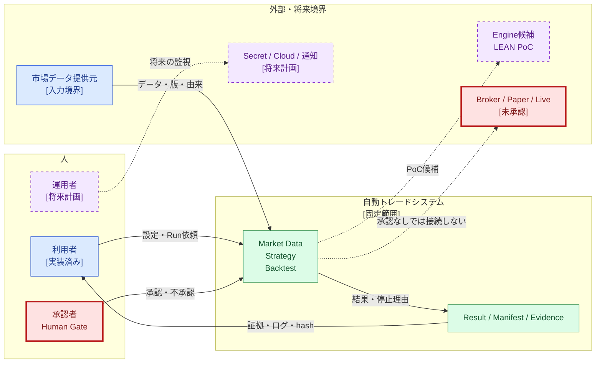
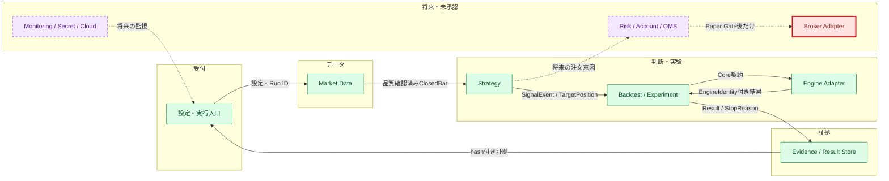
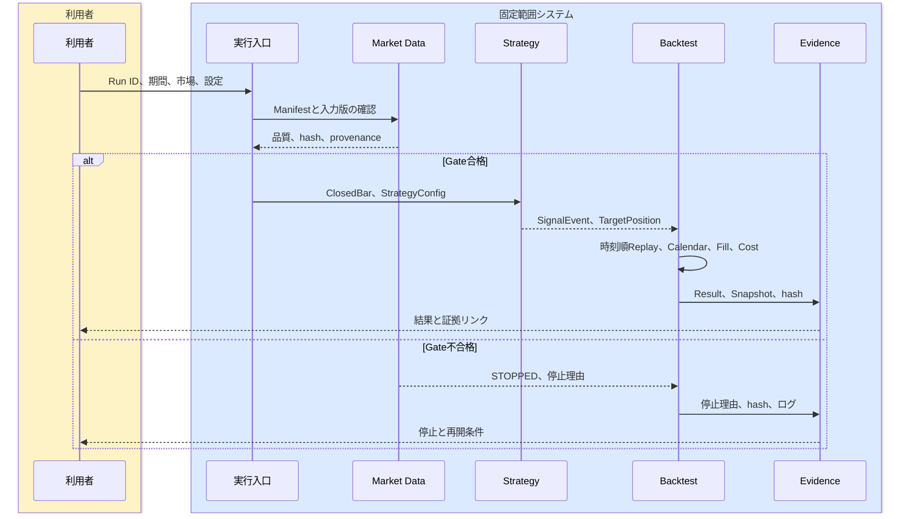
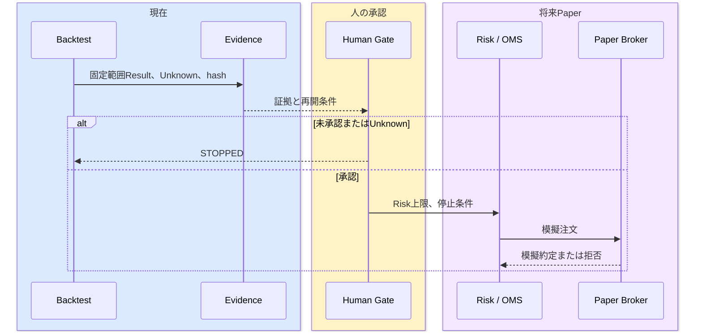
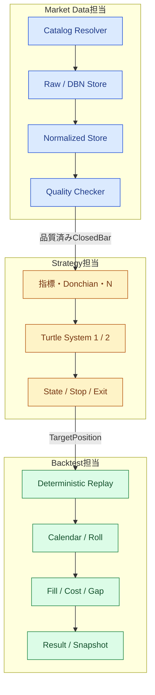
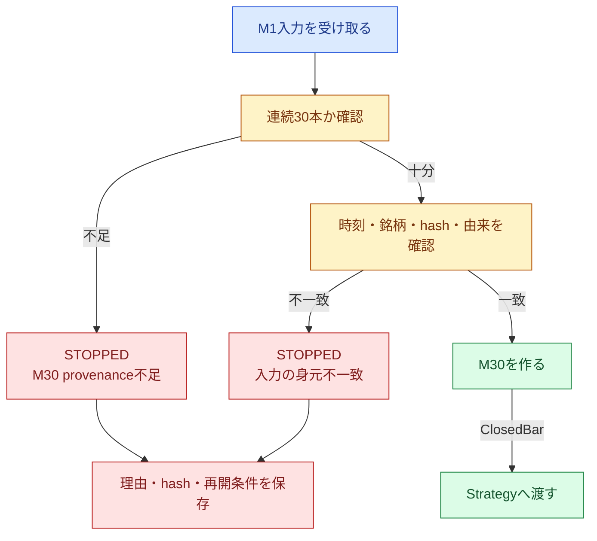
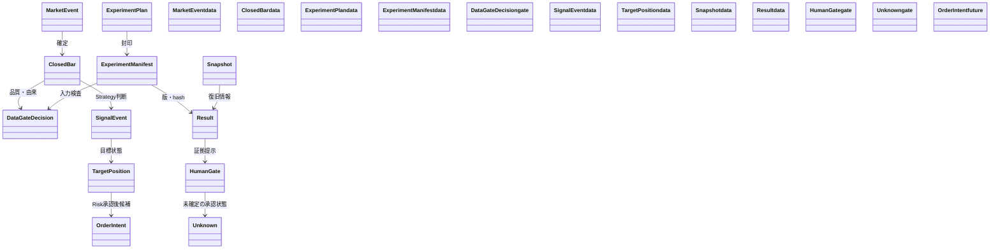
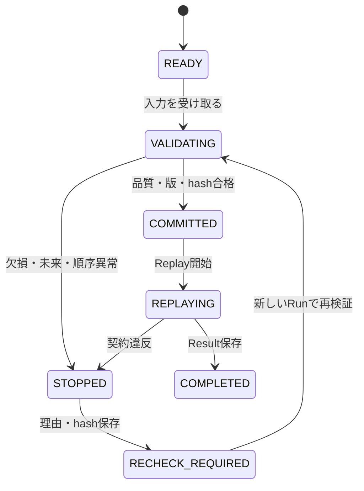
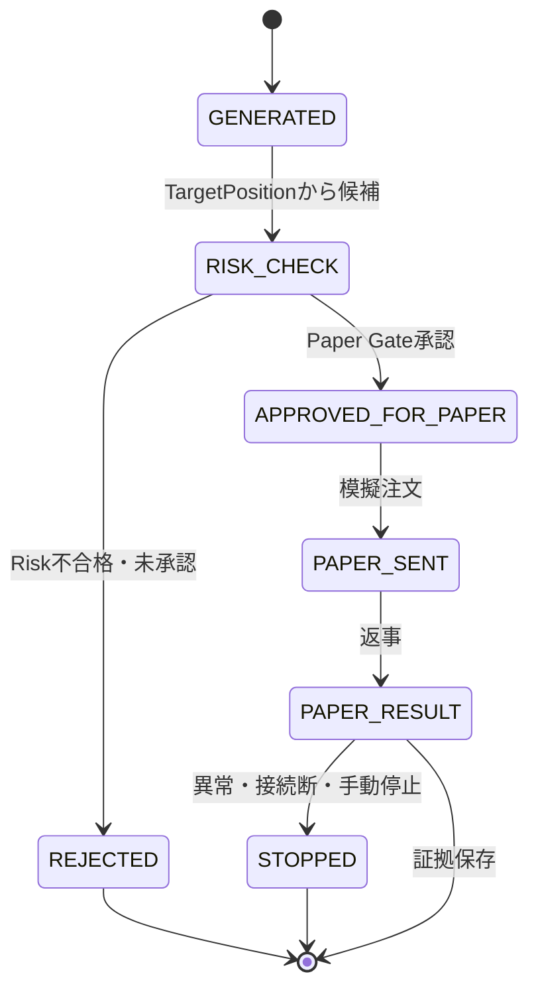

# 自動トレードシステム 要件定義書（C4正式版）

## 文書情報

| 項目 | 内容 |
|---|---|
| 文書ID | `AT-REQ-001` |
| 版 | `v0.4` |
| 基準日 | 2026-08-11 |
| 状態 | 正式正本（RQU-H3／RQU-UI-H3承認済み、RQU-UI-14正式化済み） |
| 編集原稿 | `plan/自動トレードシステム_要件定義書.md` |
| 正式HTMLの正本 | [doc/requirements/01_自動トレードシステム要件定義書.html](../doc/requirements/01_自動トレードシステム要件定義書.html) |
| 事実の基準 | Phase 3完了判定、正式詳細設計、src、tests、統合台帳 |

> この文書は、RQU-H3とRQU-UI-H3で承認された正式な要件定義書である。ITを知らない中学生でも読めるように、専門用語を消さず、身近なたとえ、正式名称、システム上の意味の順に説明する。正式HTMLは `doc/requirements/01_自動トレードシステム要件定義書.html`、正式UIモックは `doc/ui_mock/01_自動トレードシステム_UIモック.html`、総合入口は `doc/index.html` である。

## 目次

1. 30秒で分かる要約と状態の読み方
2. C4 Level 1: System Context
3. C4 Level 2: Container
4. C4 Level 3: Component
5. C4 Level 4: Code / Detail
6. 機能・品質・安全・移行要件
7. Q1〜Q30 / OD-01〜OD-08の現在状態
8. Unknown、証拠、ロードマップ、用語集、変更履歴
9. ユーザー機能、使用イメージ、画面・状態・テスト追跡

## 1. 30秒で分かる要約

このシステムは、過去の市場データを決めた順番で再生し、Turtleを含む売買ルールを固定条件で試す仕組みである。データの身元・品質・hashを確認してから、確定した足だけをStrategyへ渡し、Backtestの結果・停止理由・証拠を保存する。[REQ-CTX-003][REQ-DATA-001][REQ-STR-001][REQ-BT-001]

現在確認できているのは、固定入力・固定契約・固定範囲の検証である。利益保証、本番運用許可、Broker接続、Paper、Live、Secret、Cloudの承認ではない。長期データ、実Cost、正式Calendar、Risk値、外部接続は別のHuman Gateで確認する。[REQ-GATE-001][REQ-GATE-002][REQ-GATE-003][REQ-GATE-004]

### 状態の読み方

| ラベル | 意味 | 図の表現 |
|---|---|---|
| `[実装済み]` | 現在のコード・正式設計に責務がある | 青、実線 |
| `[固定範囲で確認済み]` | 固定入力・契約で証拠がある | 緑、証拠ID |
| `[承認済み延期/Unknown]` | 延期は承認済みだが未解消・未PASS | 黄、破線、`UNK-*` |
| `[将来計画]` | 将来候補・移行条件 | 紫、破線 |
| `[未承認/禁止境界]` | 人の承認なしには接続・実行しない | 赤、太線、停止矢印 |

色だけで状態を判断せず、ラベル、線種、要求ID、証拠IDを併用する。[REQ-QA-001][REQ-GATE-001]

## 2. C4 Level 1: System Context（街の中の建物）

Level 1は「この建物は街のどこにあり、誰が使うか」を説明する。利用者が条件を入力し、システムが過去データを再生し、結果または停止理由を返す。人が承認しなければ越えられない境界を明示する。[REQ-CTX-003][REQ-GATE-001]

**この図で見るポイント:** 緑は固定範囲、紫は将来、赤は未承認である。LEANはPoC候補であり、最終Engineの採用決定ではない。Broker、Paper、Live、Secret、Cloudは別Gateの対象である。[REQ-EXE-001][REQ-EXE-003][REQ-OPS-001][REQ-OPS-006]

| 外部・利用者 | 受け渡すもの | 返るもの | 不合格時 |
|---|---|---|---|
| 利用者 | Run ID、期間、市場、設定、実行依頼 | Result、StopReason、Manifest、hash | 必須項目がなければ開始しない [`REQ-BT-002`] |
| 市場データ | Raw/DBN、Catalog、版、provenance | 正規化データ、品質判定 | 欠損・順序・hash不一致なら停止 [`REQ-DATA-001`〜`REQ-DATA-004`] |
| 承認者 | Human Gateの承認・不承認 | 次段階へ進めるかの状態 | 未承認なら停止 [`REQ-GATE-001`〜`REQ-GATE-004`] |
| Engine候補 | Core契約と候補Engine結果 | 型付きResult、EngineIdentity | SDK漏れ・identity不一致なら停止 [`REQ-EXE-001`][`REQ-EXE-002`] |

## 3. C4 Level 2: Container（建物の部屋）

Containerは、責務を考えるための部屋である。必ずしも別サーバーを意味しない。部屋同士は決めた形式の情報だけを交換し、失敗したら安全に停止する。[REQ-EXE-002][REQ-QA-001]

初めて出てくる言葉を先に置き換える。`ClosedBar`は「値が確定した1本の足」、`SignalEvent`は「売買ルールが出した判断メモ」、`TargetPosition`は「持ちたい状態」であり注文そのものではない。`Paper`は「本物のお金を使わない模擬取引」、`OMS`は「注文を管理する係」である。[REQ-DATA-003][REQ-STR-001][REQ-RISK-006][REQ-EXE-003]

| 部屋 | 入力 | 出力 | 失敗時 | 要求ID |
|---|---|---|---|---|
| 設定・実行入口 | `ExperimentPlan`、設定版、Run ID | 受付結果 | 必須項目不足で開始しない | `REQ-BT-002`、`REQ-OPS-002` |
| Market Data | Raw/DBN、Catalog、版 | `MarketEvent`、`ClosedBar`、品質、provenance（データの出どころ） | 欠損・未来・重複・hash不一致で停止 | `REQ-DATA-001`〜`REQ-DATA-008` |
| Strategy | ClosedBar、Config、State | SignalEvent、TargetPosition | 未確定足・時間逆行・M30来歴不足で停止 | `REQ-STR-001`〜`REQ-STR-009` |
| Backtest | Manifest、Replay、Calendar、Fill設定 | Result、Snapshot、StopReason | Gate・Replay・Calendar・Fill違反で停止 | `REQ-BT-001`〜`REQ-BT-005` |
| Engine Adapter | Core契約、候補結果 | 型付きResult | SDK漏れ・未許可Engineで停止 | `REQ-EXE-001`、`REQ-EXE-002` |
| Evidence Store | Result、Manifest、hash、ログ | 後から確認できる証拠 | 保存不整合なら結果を採用しない | `REQ-QA-001`、`REQ-QA-003` |
| Risk / OMS / Broker | TargetPosition、承認、Risk判断 | 将来のOrderIntent・外部注文 | 現在は未承認で外部注文へ進めない | `REQ-RISK-006`、`REQ-EXE-003` |

### 3.1 Backtestのシーケンス

### 3.2 将来PaperのHuman Gate付きシーケンス

Paper以降は将来設計であり、現在の接続や実行実績を表さない。[REQ-GATE-001][REQ-GATE-003][REQ-OPS-001]

## 4. C4 Level 3: Component（部屋の専門スタッフ）

### 4.1 Market Data / Strategy / Backtest

### 4.2 安全停止とM30

M30（30分のまとまり）は実M1（1分の足）連続30本から直接集計する。M15を二本つなぐ近道、由来のないM30、未来の足は受け入れない。[REQ-DATA-003][REQ-QA-002]

## 5. C4 Level 4: Code / Detail（データと状態のマニュアル）

### 5.1 概念データ関係

### 5.2 Data Gate・Experiment・OrderIntentの状態

状態図は、箱が「いまの状態」、矢印が「状態の変化」を表す。`OrderIntent`の図はPaper以降の将来候補であり、現在の外部注文を表さない。`APPROVED_FOR_PAPER`は人の承認があった場合だけ通る境界である。[REQ-GATE-001][REQ-GATE-003][REQ-EXE-003]

`TargetPosition`は目標状態、`OrderIntent`は将来の注文意図である。Risk・OMS・Human Gateを通らない限り、外部注文にはならない。[REQ-RISK-006][REQ-EXE-003]

| 概念 | 現在の実装・証拠 | 要件上の意味 |
|---|---|---|
| `MarketEvent` / `ClosedBar` | Market Data正規化、`strategy.contracts` | 確定した市場入力 |
| `SignalEvent` | `strategy.contracts.SignalEvent` | ルール判断の記録 |
| `TargetPosition` | `strategy.contracts.TargetPosition` | 目標保有状態 |
| `OrderIntent` | Risk/OMS境界の将来概念 | 承認後の注文意図候補 |
| `ExperimentManifest` | `backtest.contracts`、`experiment_manifest.py` | 実験条件・版・hash |
| `DataGateDecision` | `runner.py` | 入力を通す・止める判断 |
| `Snapshot` | `snapshot.py` | 途中状態から復旧する情報 |
| `Result` | Backtest result DTO | 結果、停止理由、証拠への接続 |
| `HumanGate` / `Unknown` | 統合台帳、P3-D14、RQU記録 | 人の承認と未解決事項 |

## 6. 機能・非機能・安全・移行

### 6.1 機能要件

- Market DataはCatalog、Raw、Normalized、Quality、Manifest、provenanceを扱う。[REQ-DATA-001][REQ-DATA-002][REQ-DATA-003][REQ-DATA-004][REQ-DATA-008]
- StrategyはClosedBar、Turtle variant、SignalEvent、TargetPosition、Snapshotを扱う。[REQ-STR-001][REQ-STR-002][REQ-STR-003][REQ-STR-004][REQ-STR-005][REQ-STR-006][REQ-STR-007][REQ-STR-008][REQ-STR-009]
- Backtestは決定的Replay、Calendar、Fill、Cost、Roll、Manifest、Result、restoreを扱う。[REQ-BT-001][REQ-BT-002][REQ-BT-003][REQ-BT-004][REQ-BT-005]
- Engine Adapterは外部Engine依存を境界に閉じ込める。[REQ-EXE-001][REQ-EXE-002]

### 6.2 非機能・安全要件

| 要件 | 内容 | 状態 |
|---|---|---|
| 再現性 | 同じ入力、設定、版、hashで同じReplayを再現する | 固定範囲で確認済み [`REQ-BT-001`][`REQ-BT-002`] |
| 監査性 | Result、StopReason、Manifest、hash、ログを保存する | 実装済み [`REQ-QA-001`][`REQ-QA-003`] |
| 品質 | Golden、Bias、固定4 Gate、独立レビューを通す | 固定範囲で確認済み [`REQ-QA-002`][`REQ-QA-004`] |
| 安全停止 | 不明・不整合・未承認ではSTOPPEDを固定する | 実装済み [`REQ-RISK-007`][`REQ-OPS-003`] |
| Secret | Secretを出力せず、最小権限で扱う | 外部運用は未承認 [`REQ-OPS-006`] |
| 監視 | 新規注文、接続断、停止、Heartbeatを監視する | 将来計画 [`REQ-OPS-003`][`REQ-OPS-004`][`REQ-OPS-005`] |
| 環境分離 | Offline、host isolation、入力hash前後一致を確認する | 固定範囲確認済み [`REQ-OPS-007`] |

### 6.3 移行条件

`Backtest → Shadow → Paper → 少額Live → 本番Live`の順番を守る。前段階の証拠、人の承認、停止・復旧条件がない場合は次へ進まない。[REQ-GATE-001][REQ-GATE-002]

| 段階 | 条件 | 現在 |
|---|---|---|
| Backtest | 固定入力、Replay、Golden、証拠 | 固定範囲で確認済み |
| Shadow | 長期データ、監視、停止、復旧 | 未承認 |
| Paper | Risk、OMS、Broker Adapter、模擬注文、運用日数 | 未承認 |
| 少額Live | 資金、証拠金、実Cost、Human Gate | 未承認 |
| 本番Live | 継続監視、最終Checklist、採用判断 | 未承認 |

利益性、最大DD、1Nリスク、volatilityは目標・比較基準であり、利益保証や投資助言ではない。[REQ-RISK-001][REQ-RISK-002][REQ-RISK-003][REQ-RISK-005]

## 7. Q1〜Q30 / OD-01〜OD-08の現在状態

旧IDは履歴として残し、現在のREQ、実装済み範囲、未確定・将来を分ける。[REQ-QA-001]

| 旧ID | 現行REQ | 現在の意味・状態 |
|---|---|---|
| Q1 | `REQ-STR-001` | variant比較。固定範囲検証あり |
| Q2 | `REQ-CTX-003` | 対象市場は未確定 |
| Q3 | `REQ-CTX-004` | 初期3〜5市場、拡大は将来 |
| Q4 | `REQ-STR-002` | Long/Short、固定範囲確認済み |
| Q5 | `REQ-GATE-004` | 資金制約はLive許可ではない |
| Q6 | `REQ-OPS-004` | 費用目標、実績未確定 |
| Q7 | `REQ-EXE-003` | IBKR候補、接続未承認 |
| Q8 | `REQ-RISK-001` | DD15%は基準、保証ではない |
| Q9 | `REQ-RISK-002` | 1N 1%は比較基準、未確定 |
| Q10 | `REQ-RISK-003` | volatility参考基準、未決定 |
| Q11 | `REQ-STR-003` | 段階的Strategy比較 |
| Q12 | `REQ-STR-004` | System 1勝ちブレイク、固定範囲 |
| Q13 | `REQ-STR-005` | intradayとclose-confirmedを分離 |
| Q14 | `REQ-STR-006` | ピラミッディングvariant、範囲限定 |
| Q15 | `REQ-STR-007` | Stop/Whipsaw、実市場未確定 |
| Q16 | `REQ-RISK-005` | Unit値はPaper前に決定 |
| Q17 | `REQ-RISK-006` | StrategyとRisk/OMSを分離 |
| Q18 | `REQ-STR-008` | Unit比較基準を保持 |
| Q19 | `REQ-DATA-007` | Roll/Calendar、`UNK-P3-05/07` |
| Q20 | `REQ-DATA-008` | M1正本、上位足を決定生成 |
| Q21 | `REQ-EXE-001` | LEAN PoC候補、最終未決定 |
| Q22 | `REQ-OPS-001` | Cloud実行は将来・未承認 |
| Q23 | `REQ-OPS-002` | 設定版/hash追跡、固定範囲実装 |
| Q24 | `REQ-GATE-001` | 段階移行、将来Gate |
| Q25 | `REQ-OPS-003` | 停止・接続・Heartbeat監視、将来計画 |
| Q26 | `REQ-RISK-007` | 異常時新規注文停止、Core固定範囲 |
| Q27 | `REQ-OPS-005` | Push/Heartbeat未確定 |
| Q28 | `REQ-OPS-006` | Secret未承認 |
| Q29 | `REQ-QA-001` | 共通Core・固定証拠、確認済み |
| Q30 | `REQ-GATE-002` | 最終Checklist、人の承認、未承認 |

| 旧OD | 現行REQ | 決定状態 |
|---|---|---|
| OD-01 | `REQ-CTX-003` | 市場・データ確認後に決定 |
| OD-02 | `REQ-EXE-001` | LEAN主PoC候補、最終未決定 |
| OD-03 | `REQ-DATA-007` | 正式Calendar後に決定 |
| OD-04 | `REQ-RISK-002` | Paper前に決定 |
| OD-05 | `REQ-RISK-003` | Risk設計時に決定 |
| OD-06 | `REQ-OPS-001` | Cloud未承認 |
| OD-07 | `REQ-OPS-005` | 通知サービス未決定 |
| OD-08 | `REQ-GATE-003` | Paper/Live移行前に決定 |

## 8. Unknownと証拠

| ID | 内容 | 再開条件 | 状態 |
|---|---|---|---|
| `UNK-P3-01` | 長期データ、市場数、holdout | 市場・期間・Catalog・品質・split・hashを別Runで固定 | `APPROVED_DEFERRED_UNKNOWN` |
| `UNK-P3-05` | 実Cost、slippage、Gap | 市場別実値・感度分析・fixture | `APPROVED_DEFERRED_UNKNOWN` |
| `UNK-P3-07` | 正式Calendar継続追随 | 公式版・監視・欠損時停止・fixture | `APPROVED_DEFERRED_UNKNOWN` |
| `RQU-UNK-01` | 実ブラウザのMermaid文字配置・画面幅 | 実ブラウザ表示のスクリーンショット確認 | 部分解消、未PASS |

固定RunのPASSは、その固定範囲を示す証拠である。Unknown、長期利益、本番安全性をPASSへ広げない。[REQ-QA-001][REQ-GATE-003]

## 9. 用語ミニ辞典

| 正式語 | 中学生向けのたとえ | このシステムでの意味 |
|---|---|---|
| Database | 大きな本棚 | 記録を決めた場所に保存する仕組み |
| API | 部屋へ注文を運ぶウェイター | 別部品へ依頼し、返事を受け取る入口 |
| Adapter | 変換プラグ | 外部の違う形式をCore契約へ変換する境界 |
| Manifest | 封印付き持ち物リスト | 入力、設定、版、hashをまとめたもの |
| hash | デジタル指紋 | ファイルが変わっていないか確認する値 |
| Replay | 録画の再生 | 同じ市場データを同じ順番で流す処理 |
| Snapshot | ゲームのセーブデータ | 途中状態から同じ条件で再開する情報 |
| Fail-Closed | 分からない時の安全ブレーキ | 不整合・不明・未承認なら停止する設計 |
| Human Gate | 人が持つ鍵のゲート | 人が証拠を見て次の段階を承認する場所 |
| Unknown | まだ答えを書けない箱 | 証拠不足で未解消・未PASSの状態 |

## 10. 要求ID凡例

| 分類 | 要求ID |
|---|---|
| Context | `REQ-CTX-003`, `REQ-CTX-004` |
| Data | `REQ-DATA-001`, `REQ-DATA-002`, `REQ-DATA-003`, `REQ-DATA-004`, `REQ-DATA-005`, `REQ-DATA-006`, `REQ-DATA-007`, `REQ-DATA-008` |
| Strategy | `REQ-STR-001`, `REQ-STR-002`, `REQ-STR-003`, `REQ-STR-004`, `REQ-STR-005`, `REQ-STR-006`, `REQ-STR-007`, `REQ-STR-008`, `REQ-STR-009` |
| Backtest | `REQ-BT-001`, `REQ-BT-002`, `REQ-BT-003`, `REQ-BT-004`, `REQ-BT-005` |
| Engine / Adapter | `REQ-EXE-001`〜`REQ-EXE-003` |
| Risk | `REQ-RISK-001`, `REQ-RISK-002`, `REQ-RISK-003`, `REQ-RISK-005`, `REQ-RISK-006`, `REQ-RISK-007` |
| Operations | `REQ-OPS-001`, `REQ-OPS-002`, `REQ-OPS-003`, `REQ-OPS-004`, `REQ-OPS-005`, `REQ-OPS-006`, `REQ-OPS-007` |
| Quality | `REQ-QA-001`, `REQ-QA-002`, `REQ-QA-003`, `REQ-QA-004` |
| Gate | `REQ-GATE-001`, `REQ-GATE-002`, `REQ-GATE-003`, `REQ-GATE-004` |

## 11. ユーザー機能・使用イメージ・画面追跡

### 11.1 利用者と安全境界

| 利用者 | できること | 認証 |
|---|---|---|
| 運用者（開発者本人） | 設定、Run、監視、停止、復旧、承認、削除、記録確認の全て | 不要 |

ユーザー管理、ログイン、Role切替は作らない。ただし、認証不要であることは、未承認のLive実行や停止解除を許可することではない。利用環境は自PCまたは運用者本人のスマートフォンから閉じて使う前提であり、外部公開しない。実システムの端末制限、ネットワーク境界、TLS、公開範囲は後続Gateで証拠を確認するまでUnknownとする。

絶対に越えない境界は次のとおりである。

- UIモックは固定Seedの匿名ダミーデータだけを使い、実Broker、実口座、Secret、実注文、実市場データへ接続しない。
- Riskが未入力ならBacktestを含む全モードを開始しない。Risk値の範囲・妥当性検査は今回の仕様に含めない。
- データ品質不合格、接続断、Heartbeat異常、Position不一致、注文不一致ではSignal・新規注文を止める。
- 全体Kill Switchまたは個別停止後は、データ・注文・Positionを照合し、運用者が手動で再開する。自動再開しない。
- Live自動承認は設定画面で明示的にONにしたときだけ有効にし、切替・対象・設定版・Risk・端末・時刻を記録する。再起動後はOFFへ戻す。これはHuman Gateの別モードであり、確認Dialogと記録を省略しない。
- 取消、停止、再開、Strategy有効化・無効化・新版保存・ロールバックは、理由入力、確認Dialog、操作記録を経て受け付ける。
- Q-277の旧「Q-243を先に閉じる」方針は撤回済み。RQU-19/RQU-19Aを現在方針とし、Q-243の4領域を今回の構造確認と後続実証へ分ける。

### 11.2 ユーザーができること

| 機能群 | できること | 画面 |
|---|---|---|
| 状態・初期設定 | 現在状態、禁止事項、未承認、提供元、通知、自動更新を確認・設定 | `SCREEN-01`,`02`,`20`,`21` |
| 銘柄・データ | 4 Asset Class、MCL/M6A/MZC/MZS/MZW、5時間足、取得、品質、欠損、Catalog/Calendar/Roll、hashを確認 | `SCREEN-05`,`20` |
| Strategy | Turtle System 1/2、Long/Short、Entry、Stop、Exit、追加条件、検証、複製、比較、版管理 | `SCREEN-06`,`07` |
| 運用単位 | 銘柄×時間足×売買ルール×口座×モードを作成、独立運用、重複検査、停止、再開、終了 | `SCREEN-03`,`04` |
| Backtest | 単一Runの設定・検証・実行・進捗・取消・停止・再Run・結果確認 | `SCREEN-08`〜`11` |
| 網羅検証 | 下限・上限・ステップ、全組合せ、見積、Queue、部分失敗、5指標表、比較、CSV | `SCREEN-08`〜`12`、`VIEW-01` |
| 段階運用 | Forward、Shadow、Paper、Live候補、Liveの開始・停止・Gate確認 | `SCREEN-13`,`14`,`18` |
| 監視・注文 | 全単位の時刻、Signal、仮想/模擬/実注文区分、約定、Position、Risk、残高、差分 | `SCREEN-02`,`11`,`14`〜`17` |
| 安全停止・復旧 | 警告、再試行、個別停止、Kill、照合、手動再開、再起動後Snapshot復旧 | `SCREEN-15`〜`18` |
| 記録整理 | Run、Result、Manifest、hash、設定版、操作・Gate記録の検索、出力、非表示、削除 | `SCREEN-10`,`12`,`19`,`20` |

### 11.3 使用イメージ（画面を操作する順番）

1. **初回準備:** `SCREEN-01`で状態・禁止事項・未承認を確認し、`SCREEN-20`で提供元・通知・自動更新を設定する。`SCREEN-05`でMCL/M6A/MZC/MZS/MZWとD1/H4/H1/M30/M15を選び、`SCREEN-06/07`でTurtle System 1/2を版として作る。`SCREEN-04`で銘柄×時間足×ルールの運用単位を作る。
2. **単一Backtest:** `SCREEN-08`で銘柄、足、Strategy、期間、Risk、コスト、設定ファイルを入力し、事前検証に合格した場合だけ開始する。`SCREEN-09`でQueue・進捗・取消・停止・再Runを確認し、`SCREEN-10/11`で総損益、最大の落ち込み、取引回数、勝率、総残高と詳細を確認する。
3. **網羅検証:** `SCREEN-08`で各パラメータの下限・上限・ステップを入力または設定ファイルを選択し、`VIEW-01`で組合せ数・見積・上限警告を確認する。`SCREEN-09`で組合せ別の進捗と失敗を確認し、`SCREEN-10/12`で全組合せの5指標表、比較、CSVを確認する。最良設定は運用者が判断する。
4. **段階運用:** Backtest→Forward→Shadow→Paper→Live候補→Liveの順で進める。各段階の未承認・未実証を画面で確認し、Live自動承認を選んでもHuman Gateの確認Dialogと記録を通す。候補UIは実注文を送らない。
5. **日常監視・復旧:** `SCREEN-02`で全単位の最新データ、Heartbeat、次回判断、Signal、Position、警告、総残高を確認する。遅延・接続断・競合・拒否では再試行後に個別停止または全体Kill Switchを実行し、再起動後に照合して手動再開する。
6. **記録整理:** `SCREEN-19`でRun、Result、Manifest、hash、設定版、操作、Gateを検索・出力する。通常一覧から隠す操作と削除操作を分け、削除は確認Dialogと監査記録を必須にする。バックアップ実保存・復元は後続Gateで実証する。

### 11.4 全ユースケース索引

| 領域 | UC-IDと機能 |
|---|---|
| 状態・初期 | `ADD-UC-001`状態・禁止事項、`002`初期設定、`003`提供元、`004`接続状態、`005`Strategy一覧・版、`006`運用単位一覧 |
| 銘柄・データ | `ADD-UC-010`Asset・銘柄、`011`期間・時間足、`012`取得/インポート、`013`更新、`014`品質、`015`欠損・重複・時刻逆行、`016`再処理、`017`Catalog/Calendar/Roll/hash |
| Strategy | `ADD-UC-020`作成、`021`Turtle条件、`022`複製・比較・版、`023`検証、`024`有効化/無効化 |
| 運用単位 | `ADD-UC-025`割当、`026`複数同時開始、`027`停止・再開・終了、`028`設定差分 |
| Backtest | `ADD-UC-030`条件入力、`031`事前検証、`032`開始、`033`Queue/進捗、`034`取消・停止・再Run、`035`結果理由、`036`5指標・詳細、`037`絞込、`038`比較、`039`Holdout/Walk-forward/感度、`040`保存・出力、`041`Replay一致 |
| 段階運用 | `ADD-UC-050`Forward、`051`Shadow、`052`Paper、`053`Live条件、`054`本番Live条件 |
| 稼働・注文 | `ADD-UC-055`現在状態、`056`最新データ/Heartbeat、`057`Signal・注文区分、`058`約定、`059`想定/実績差分、`060`残高・証拠金・余力、`061`Position、`062`Risk、`063`Risk判定、`064`注文確認・取消・訂正、`065`Broker照合、`066`競合処理 |
| 監視・復旧 | `ADD-UC-070`全体稼働、`071`遅延・接続断、`072`通知、`073`個別停止、`074`Kill Switch、`075`停止理由・再開条件、`076`Snapshot復旧、`077`復旧後照合 |
| 記録整理 | `ADD-UC-080`Result/Run/hash検索、`081`操作履歴、`082`設定変更履歴、`083`Human Gate記録、`084`レポート、`085`ロールバック、`086`アーカイブ・非表示・削除 |

### 11.5 画面・状態・テスト追跡

`SCREEN-01`〜`SCREEN-21`を正式UIモックへ配置し、`NAV-01`〜`NAV-10`、`UISTATE-*`、`E2E-UI-*`、`AC-UI-*`を [RQU-UI要件・UI・テスト追跡マトリクス](requirements_update/RQU-UI_要件UIテスト追跡マトリクス_2026-08-11.md) で辿れるようにする。共通状態は通常、読込中、データなし、未入力、警告、停止、失敗、復旧確認中、Human Gate待ち、未承認の10種類であり、色だけで判断させない。React版でPC/スマートフォン各210セルを確認し、静的HTMLは表示・導線・外部通信なしの範囲を確認した。

### 11.6 後続GateとUnknown

| 項目 | 今回正式化する構造 | 後続Gateで実証すること |
|---|---|---|
| 安全境界 | Risk未入力停止、Kill、照合、手動再開、Live自動承認の記録 | 実Broker、実注文、実機、Liveの具体値 |
| 初期候補 | MCL/M6A/MZC/MZS/MZW、4 Asset Class、状態表示 | 実シンボル、取引所、限月、ロール、単位、契約、提供元 |
| 実行可能性 | UIモックの固定ダミー、React+TypeScript、Playwright境界、外部I/O禁止 | Frontend本実装、最終Engine、負荷、復旧、Broker照合 |
| 性能 | 初回一覧3秒、追加2秒、CSV非同期、初期3〜5目安を受入対象化 | 実PC負荷、20〜40単位、遅延、復旧実測 |
| バックアップ | 対象、非表示、削除、復旧UIの構造 | 実保存先、世代管理、復元確認の実証 |

Q-243、実接続、性能、Backup、端末境界は正式化によって解消したことにせず、決定時期、開始条件、停止条件、証拠先付きのUnknownとして統合台帳で管理する。Q-277撤回とRQU-19/RQU-19A優先も維持する。

## 12. 変更履歴と正本化条件

| 版 | 日付 | 内容 | 状態 |
|---|---|---|---|
| `candidate-0.1` | 2026-08-10 | RQU-05/06をC4 Level 1〜4と横断章へ統合 | 履歴候補 |
| `candidate-0.2` | 2026-08-10 | RQU-06R指摘、用語、Unknown、状態凡例を反映 | 履歴候補 |
| `v0.3` | 2026-08-10 | RQU-08A〜C指摘、追跡リンク、Q/OD行単位表、可読性補足を反映し、RQU-H3承認後に正式化 | 正式版 |
| `v0.4` | 2026-08-11 | RQU-UI-06〜13のユーザー機能、使用イメージ、21画面、10状態、5時間足、同時運用、網羅検証、Human Gate、停止・復旧、UI/テスト追跡を追加し、RQU-UI-H3承認を受けて正式化 | 正式版 |

### 関連する正式成果物・追跡先

この正式版は要件の全体像を示す。実装の細部と過去の判断は、次の正式成果物を開いて確認する。

- [P3-D04 Strategy実装詳細設計書](../doc/phase3/03_Strategy詳細設計/03_Strategy_Turtle実装詳細設計書.html)
- [P3-D05 Backtest/Experiment実装詳細設計書](../doc/phase3/04_Backtest詳細設計/04_Backtest_Experiment実装詳細設計書.html)
- [P3-D14 Phase 3完了判定・Phase 4移行承認書](../doc/phase3/10_完了判定/13_Phase3完了判定とPhase4移行承認書.html)
- [RQU-03 要件採否追跡マトリクス](requirements_update/RQU-03_要件採否追跡マトリクス_2026-08-10.md)
- [RQU-04 C4章構成・用語辞書](requirements_update/RQU-04_C4章構成図解仕様用語辞書_2026-08-10.md)
- [RQU-UI 要件・UI・テスト追跡マトリクス](requirements_update/RQU-UI_要件UIテスト追跡マトリクス_2026-08-11.md)
- [自動トレードシステム UIモック](../doc/ui_mock/01_自動トレードシステム_UIモック.html)
- [全Phase残課題・Blocked統合台帳](../doc/00_全Phase残課題Blocked統合台帳.html)

`REQ-DATA-005`と`REQ-DATA-006`の細かい意味は、この文書で勝手に再定義しない。採否、根拠、未確定状態はRQU-03を追跡先とする。[REQ-QA-001]

RQU-08A〜C、RQU-09A、RQU-09B、RQU-UI-05〜13を完了し、RQU-H3／RQU-UI-H3承認を受けてRQU-10／RQU-UI-14で正式Markdown、正式HTML、正式UI、`doc/index.html`を同じ基準日で正式化した。[REQ-GATE-002]
