# タートルズ・トレンドフォロー自動トレードシステム 要件定義書

- 文書状態: 初版ドラフト
- 基準日: 2026-08-02
- 原典資料: `research/タートルズ・トレンドフォロー戦略.md`
- ヒアリング原文: `plan/chat_history/2026-08-02_自動トレードシステム要件ヒアリング.md`
- 用途: バックテスト、Shadow、Paper、少額Live、本番運用へ段階移行するシステムの設計基準

> 本書はシステム設計と研究用の要件定義書であり、投資助言ではない。先物、FX、CFD、暗号資産等には、証拠金を上回る損失、ギャップ、流動性枯渇、取引停止、追証、限月交代、取引所・証券会社の信用リスクがある。

---

## 1. エグゼクティブサマリー

本システムは、タートルズ・トレンドフォロー戦略の原典再現版と現代化候補を、同一のイベント駆動基盤上で比較し、検証済みの戦略だけを Shadow、Paper、少額Live へ段階移行させるための自動トレードシステムである。

暫定的な第一候補構成は次のとおりである。

| 項目 | 暫定方針 |
|---|---|
| 証券会社 | Interactive Brokers Japan を第一候補 |
| 取引エンジン | NautilusTrader と LEAN を PoC で比較して決定 |
| 戦略実装 | Python を第一候補 |
| 研究環境 | Windows PC |
| Shadow / Paper / Live | 東京リージョンのクラウド VM |
| データ | 証券会社と独立した履歴データを取得し、Parquet で不変保管 |
| 初期対象市場 | 3〜5市場、安定後に20〜40市場へ拡大 |
| データ粒度 | 初期対象は全期間 1分足、日足は別途生成 |
| 実行方式 | モジュラーモノリス、イベント駆動、アダプター方式 |
| リスク | 原典 Unit 制限、基盤側ハードリスクガード、最大 DD 15% |
| 運用段階 | Shadow → Paper → 少額Live → 本番Live |
| 監視 | 新規注文・停止系・接続断・心拍停止を即時通知 |
| セキュリティ | Secret Manager、最小権限、証跡監査 |

本システムは、バックテストを証券会社の内部 API に依存して実装しない。履歴データと実運用イベントを共通エンジンへ入力し、証券会社の Paper / Live はリアルタイム執行と口座管理に使用する。

---

## 2. 目的と非目的

### 2.1 目的

1. タートルズ戦略ルールを、実装可能な形へ明文化する。
2. 原典版と現代版を同一基盤で比較できるようにする。
3. 戦略ロジックを交換可能にし、データ、執行、監視、セキュリティを共通化する。
4. バックテストから Live までの運用移行手順を確立する。
5. 障害、誤発注、限月交代、証券会社停止を考慮した運用基盤を整備する。
6. 小口資金で開始し、実績確認後に段階拡大できるようにする。
7. 初期資金100万円未満を前提に、実運用可能な資産候補を別途調査し最適化する。

### 2.2 非目的

- 超低遅延の HFT システムは対象外
- 取引所マイクロ秒級データを常時処理する分散基盤は対象外
- 最初からマルチブローカー Active-Active 構成を組むことは対象外
- AI 裁量売買シグナル生成を本システムの中核要件にはしない

---

## 3. ヒアリングで確定した主要方針

| ID | 要件 | 状態 |
|---|---|---|
| Q1 | 原典版と現代版を並行比較 | 確定 |
| Q2 | 対象アセットは別途調査で決定 | 未確定 |
| Q3 | 初期 3〜5 市場、安定後に 20〜40 市場 | 確定 |
| Q4 | ロング・ショート両方向 | 確定 |
| Q5 | Live 初期資金は 100万円未満 | 確定 |
| Q6 | 初期月額費用 1万円未満、段階拡大 | 確定 |
| Q7 | IBKR を第一候補 | 確定 |
| Q8 | 最大ドローダウン目標 15% | 確定 |
| Q9 | 原典基準として 1N リスク 1% を保持 | 確定 |
| Q10 | 年率ポートフォリオ・ボラティリティ目標 10% | 参考基準 |
| Q11 | 戦略比較は段階的に拡大 | 確定 |
| Q12 | System 1 勝ちブレイクフィルターは比較対象 | 確定 |
| Q13 | 原典版は intraday、現代版は終値確認も比較 | 確定 |
| Q14 | ピラミッディングは複数方式を比較 | 確定 |
| Q15 | 2N、Whipsaw、ボラ急上昇時縮小版を比較 | 確定 |
| Q16 | Unit リスクは契約粒度と DD 試験後に最終決定 | 未確定 |
| Q17 | 戦略は入出金を除く全口座管理を担当 | 確定 |
| Q18 | ポートフォリオ上限は原典 4/6/10/12 Unit を採用 | 確定 |
| Q19 | 限月選択とロール規則は資産調査後に決定 | 未確定 |
| Q20 | 初期 3〜5 市場は全期間 1分足 | 確定 |
| Q21 | 取引エンジンは PoC で決定 | 未確定 |
| Q22 | Shadow / Paper / Live は東京クラウド VM | 確定 |
| Q23 | 設定は戦略別 YAML、共通設定と分離 | 確定 |
| Q24 | Shadow → Paper → 少額Live の順に移行 | 確定 |
| Q25 | 監視は新規注文、接続断、停止系を重視 | 確定 |
| Q26 | Bot 実行中の異常監視と強制停止手段が必要 | 確定 |
| Q27 | Push 通知と Heartbeat 監視を実施 | 確定 |
| Q28 | Secret Manager を使う | 確定 |
| Q29 | テストは証券会社バックテストに依存しない | 確定 |
| Q30 | 本番移行前に最終チェックリストを通す | 確定 |

---

## 4. システム全体像

```mermaid
flowchart LR
    V["データベンダー"] --> I["Data Ingestion"]
    I --> R["Raw Immutable Store"]
    R --> N["Normalization / Instrument Master"]
    N --> C["Versioned Data Catalog"]
    C --> E["Common Event Engine"]

    S["Strategy Plugin"] --> E
    E --> PR["Portfolio / Strategy Risk"]
    PR --> GR["Platform Hard Risk Gate"]
    GR --> OMS["OMS"]
    OMS --> BA["Broker Adapter"]
    BA --> BK["IBKR Paper / Live"]

    BK --> EX["Order / Fill / Account Events"]
    EX --> J["Durable Event Journal"]
    J --> RC["Reconciliation"]
    RC --> E

    E --> OB["Logs / Metrics / Alerts"]
    OB --> OP["Operator"]
    OP --> KS["Emergency Controls"]
    KS --> GR
```



### 4.1 基盤が担当する責務

- データ取得、時刻正規化、欠損検知、重複排除
- 銘柄マスター、限月カレンダー、証拠金、ティックサイズ、最小取引単位
- イベント配信、時系列イベント、タイマー、一意イベント ID
- 証券会社接続、注文状態遷移、約定反映、口座情報同期
- 障害時の再起動後リカバリー
- 基盤側ハードリスクガード
- 通知、Heartbeat、監査ログ
- Secret 管理、バックアップ、復旧

### 4.2 戦略プラグインが担当する責務

- 対象市場ごとのシグナル判定
- Entry、Exit、再Entry、ピラミッディング
- ATR/N、Donchian Channel 等の戦略指標計算
- Unit サイズ、Notional Account、損失時縮小
- 原典の 4/6/10/12 Unit 上限の適用
- 戦略ごとの設定ファイル、内部状態、評価指標
- `OrderIntent` または `TargetPosition` の生成

### 4.3 戦略が担当しない責務

- 証券会社 API の接続管理
- 口座残高の正本管理
- 注文再送制御や重複注文防止
- 決済後キャッシュ移動や入出金
- Kill Switch 実行中の新規注文遮断

---

## 5. 戦略プラグイン要件

### 5.1 インターフェース

```text
StrategyPlugin
  initialize(config, instrument_catalog)
  restore(strategy_state)
  on_market_event(event, portfolio_snapshot)
  on_order_event(order_event, portfolio_snapshot)
  on_account_event(account_event)
  on_timer(timer_event)
  emit_intents() -> list[OrderIntent]
  snapshot() -> StrategyState
  health() -> StrategyHealth
```

### 5.2 `OrderIntent` の最低項目

- `strategy_id`
- `strategy_version`
- `instrument_id`
- `desired_side`
- `desired_quantity` または `target_position`
- `intent_type`: `entry` / `add` / `stop` / `channel_exit` / `roll` / `emergency`
- `signal_timestamp`
- `decision_price`
- `n_value`
- `channel_level`
- `risk_budget`
- `reason_code`

### 5.3 Strategy Config の主要項目

- `system_family`: `system1` / `system2` / `modernized`
- `entry_mode`: `intraday_breakout` / `close_confirm`
- `entry_channel_days`
- `exit_channel_days`
- `system1_skip_last_winner`: `true` / `false`
- `pyramiding_mode`
- `max_units`
- `stop_mode`
- `unit_risk_fraction`
- `portfolio_cap_mode`
- `roll_rule_id`

---

## 6. 戦略比較と評価対象

### 6.1 比較対象

- 原典 System 1
- 原典 System 2
- 現代版での終値確認 Entry
- ピラミッディング差分
- Stop 差分
- Unit リスク差分

### 6.2 原典再現で守るべき要素

- Donchian breakout の基本思想
- N の算出と Unit sizing
- 0.5N ごとの追加
- 2N Stop の比較対象維持
- Notional Account による縮小
- 4/6/10/12 Unit 上限

### 6.3 モダナイズ候補

- 終値確認 Entry
- Volatility regime に応じた Stop の縮小
- Unit リスクを 1.0% / 0.5% / 0.25% で比較
- 期間違いのチャネル
- コスト、ロール、ギャップを現代市場前提で再評価

---

## 7. 対象アセット要件

### 7.1 Phase 0 の位置づけ

現代に適した取引アセットの調査と評価は、第0段階で独立に実施する。詳細は次を参照する。

- `plan/第0段階_現代に適した取引アセット調査計画書.md`
- `plan/第0段階_ステップ0前_実行基盤準備.md`
- `plan/第0段階_機械実行用プロンプト列.md`

### 7.2 初期候補の扱い

P08 と P09 までの段階では、初期 5候補として次を扱う。

- `MCL`
- `MZC`
- `MZS`
- `MZW`
- `M6A`

ただし、`MZC / MZS / MZW` は履歴期間が短く、長期検証は別枠評価とする。

### 7.3 今後の確定事項

- 日本居住者が実際に取引可能か
- 証拠金水準
- 最小数量
- 取引時間
- ロール規則
- Databento / IBKR での取得可否

---

## 8. データ要件

### 8.1 基本方針

- 証券会社 API はリアルタイム確認用とし、履歴データの正本にはしない
- 履歴データは外部データベンダーから取得し、Raw で不変保管する
- 正規化済みデータ、研究用派生データ、実行用データを分離する

### 8.2 レイヤー

| レイヤー | 内容 |
|---|---|
| Raw | ベンダー取得そのままの不変データ |
| Normalized | UTC、共通カラム、共通 ID、品質検査済み |
| Tradable | 限月、出来高、証拠金、価格単位を付与した実運用候補データ |
| Signal | バックテストや戦略実行に使う連続系列 |
| Derived | N、チャネル、ロールマップ等の派生指標 |
| Experiment | 実験単位の固定入力セット |

### 8.3 粒度

- 初期 3〜5 市場は全期間 1分足
- 日足は 1分足から生成
- 1分足で判定不能な順序問題は、必要に応じてティックデータや保守的約定ルールで補う

### 8.4 データベンダー

- 第一候補: Databento
- 補完候補: IBKR 履歴データ、JPX / J-Quants、無料データ源

Databento の研究用取得補助は次で確認済み。

- `research/asset_selection/10_頑健性バックテスト/10_Databento取得補助レポート_v0.1_2026-08-02.md`

### 8.5 データ品質チェック

- 欠損バー
- 重複バー
- タイムゾーン不整合
- 異常価格
- 異常出来高
- ロール前後の不連続
- 原典指標算出に必要な最小履歴不足

---

## 9. バックテスト要件

### 9.1 方針

- バックテストは証券会社内蔵バックテストに依存しない
- 共通イベントエンジンへ履歴イベントを流して再現する
- 戦略評価は Backtest、Paper、Live で同一ロジックを使う

### 9.2 必須要件

- Look-ahead 防止
- Survivorship bias 防止
- 取引コストの明示
- ロール損益の明示
- 保守的約定ルール
- 実験マニフェスト固定
- Holdout / Walk-forward の実施

### 9.3 P10 研究用ハーネス

P10 で実装したものは本番実装ではなく、第0段階のアセット選定と比較検証のための研究用ハーネスである。

- 実装場所: `research/asset_selection/10_頑健性バックテスト/研究用ハーネス/`
- Databento `ohlcv-1m` 取得確認済み
- 5銘柄の短期 CSV 生成確認済み
- `run` 実行確認済み

未解決事項:

- 親シンボル取得のため複数限月が混在する可能性がある
- `definition` と `statistics` の保存は未実装
- ロール規則を連続足へ実装していない

---

## 10. OMS と執行要件

### 10.1 注文ライフサイクル

- `Created`
- `PendingSubmit`
- `Submitted`
- `PartiallyFilled`
- `Filled`
- `CancelRequested`
- `Cancelled`
- `Rejected`
- `Expired`
- `Error`

### 10.2 必須機能

- 一意な client order id
- 重複送信防止
- Cancel / Replace 対応
- 部分約定対応
- 約定イベントの順不同耐性
- 再起動後の open order 再同期
- Position / Cash / Margin の再同期

### 10.3 証券会社側 Stop

可能な限り、証券会社ネイティブの Stop を活用する。ただし、Paper 環境と Live 環境で挙動差があるため、Paper の結果だけで本番挙動を確定しない。

---

## 11. ハードリスクガード

基盤側のガードは戦略より優先する。

- 日次損失上限
- 1市場あたり最大想定損失上限
- 全口座の最大リスク総量
- 注文数量上限
- 同一方向エクスポージャ上限
- 市場別・資産群別のポジション上限
- Kill Switch 中の新規注文禁止
- データ異常時の新規注文禁止
- Paper 評価未通過戦略の Live 禁止

---

## 12. 監視・通知・障害対応

### 12.1 監視対象

- Market data 最終受信時刻
- Broker 接続状態
- Strategy heartbeat
- Event queue 深さ
- Position / Order 不整合
- NAV / PnL / DD
- 新規注文、取消、拒否
- バックアップ成否

### 12.2 通知レベル

| レベル | 条件 | 通知 |
|---|---|---|
| INFO | 日次サマリー、正常ロール | メールまたは Dashboard |
| WARNING | データ遅延、接続再試行、軽微不整合 | Push 通知 |
| CRITICAL | 接続断、心拍停止、注文拒否、ポジション不整合 | 即時 Push とメール |
| EMERGENCY | Kill Switch、想定外のポジション、最大損失超過 | 即時通知と運用手順発火 |

### 12.3 手動介入

次の手段を必須とする。

- 新規注文停止
- 一括 Cancel
- 戦略停止
- Bot 停止
- Broker GUI による最終介入

---

## 13. Shadow / Paper / Live 移行

### 13.1 Backtest から Shadow

- 指標再現性確認
- Look-ahead / bias 検査通過
- コスト、ロール、ギャップ反映
- Holdout で劣化が許容範囲

### 13.2 Shadow から Paper

- リアルタイムシグナルと後追い計算の一致
- 30営業日以上の安定観測
- Heartbeat、通知、障害検知が動作

### 13.3 Paper から 少額Live

- Paper 安定運用 90日以上
- 異常停止や未解決ポジション不整合がゼロ
- Stop、Kill Switch、復旧手順をリハーサル済み
- 最大 DD 15% のストレス確認済み

### 13.4 少額Live から 本番Live

- 少額Live 90日以上
- Paper と Live の挙動差が説明可能
- 実コストと想定コストの差分が許容範囲

---

## 14. セキュリティ要件

- Secret は Secret Manager で管理
- Live secret と Paper secret を分離
- MFA を有効化
- 最小権限原則
- API key、token、account id を Git やログへ保存しない
- SSH / RDP は制限付き
- 証跡監査ログを保持

---

## 15. バックアップと復旧

### 15.1 対象

- PostgreSQL の取引・注文・ポジション・イベント
- 設定ファイルと schema
- Instrument master とロールマップ
- 実験 manifest、runbook、レポート

### 15.2 方針

- 設定変更は履歴管理する
- 日次 Full backup を取得する
- 復旧手順を文書化し、定期的に復旧テストする

### 15.3 目標値

- 運用イベント RPO: 15分以内
- 研究データ RPO: 24時間以内
- Live RTO: 4時間以内

---

## 16. 取引エンジン PoC 要件

### 16.1 比較候補

- NautilusTrader
- LEAN / QuantConnect 系

### 16.2 PoC シナリオ

1. 1市場の 20日 breakout
2. 1分足リプレイ
3. Entry / Add / Stop / Exit
4. 部分約定
5. プロセス再起動と復旧
6. IBKR Paper 接続
7. Open order / Fill / Position 再同期
8. Heartbeat と通知

### 16.3 評価項目

| 項目 | 重み |
|---|---:|
| イベント再現性 | 20% |
| IBKR 接続と再同期の安定性 | 20% |
| 障害復旧性 | 15% |
| ロール表現のしやすさ | 15% |
| コストと保守性 | 10% |
| Python 親和性 | 10% |
| 監視連携 | 5% |
| ライセンスと運用制約 | 5% |

---

## 17. テスト要件

### 17.1 自動テスト

- N、True Range、Donchian の Golden test
- System 1 勝ちブレイクフィルター
- 0.5N 追加
- 2N Stop
- 4/6/10/12 Unit 上限
- Gap 時の保守的約定
- ロール損益連結
- データ異常時の fail-closed

### 17.2 結合テスト

- Broker Paper で Entry / Add / Stop / Exit
- Gateway 再接続後の復旧
- Position 不整合時の検知
- Kill Switch 発火

---

## 18. Fail-Closed 方針

障害時は「止まる」を優先する。

1. 新規 Entry を停止
2. 追加注文を停止
3. Broker 側 Stop は維持
4. 通知を発火
5. 手順書に従って復旧

---

## 19. 実装ロードマップ

### Phase 0: 未確定事項の解消

1. 現代に適した取引アセットの調査計画と評価
2. Databento / IBKR での取得可否確認
3. 初期 3〜5 候補の絞り込み

### Phase 1: ドメイン設計と戦略 Golden test

1. イベント、注文、口座、ID、時系列の定義
2. N、Channel、Unit、Filter、Stop、Exit
3. 戦略 plugin interface

### Phase 2: データ基盤

1. Raw download
2. Instrument master
3. Normalization
4. 1分足 catalog
5. Continuous signal series と roll map

### Phase 3: Backtest / 検証

1. 原典版実装
2. 比較候補実装
3. コスト、ロール、ギャップ反映
4. Walk-forward / Holdout

### Phase 4: OMS / IBKR Paper

1. Order state machine
2. IBKR adapter
3. Reconciliation
4. Broker-native Stop

### Phase 5: 東京クラウド / Shadow / Paper

1. Infrastructure 構築
2. Secret、監視、バックアップ
3. Shadow 評価
4. Paper 評価

### Phase 6: 少額Live から本番Live

1. 少額Live
2. 運用 KPI 評価
3. 資金拡大判断

---

## 20. 未確定事項ゲート

| ID | 未確定事項 | 決定タイミング | Live 前必須 |
|---|---|---|---|
| OD-01 | 対象アセットと初期 3〜5 市場 | Phase 0 | Yes |
| OD-02 | 取引エンジン最終決定 | Phase 1 | Yes |
| OD-03 | ロール規則と continuous signal 方式 | Phase 2 | Yes |
| OD-04 | 1N リスクの Live 採用値 | Paper 前 | Yes |
| OD-05 | 年率 10% ボラ目標を強制制御へ入れるか | Risk 設計時 | Yes |
| OD-06 | 東京クラウドの OS / VM 形式 | Shadow 前 | Yes |
| OD-07 | Push 通知サービス | Shadow 前 | No |
| OD-08 | Paper / Live の最小運用日数しきい値 | 移行判定前 | Yes |

---

## 21. 参考資料

- `research/タートルズ・トレンドフォロー戦略.md`
- `plan/chat_history/2026-08-02_自動トレードシステム要件ヒアリング.md`
- `plan/第0段階_現代に適した取引アセット調査計画書.md`
- `plan/第0段階_ステップ0前_実行基盤準備.md`
- `plan/第0段階_機械実行用プロンプト列.md`
- `research/asset_selection/09_バックテスト手順/09_バックテスト手順書_v0.1_2026-08-02.md`
- `research/asset_selection/10_頑健性バックテスト/10_研究用ハーネス方針_v0.1_2026-08-02.md`
- `research/asset_selection/10_頑健性バックテスト/10_Databento取得補助レポート_v0.1_2026-08-02.md`

---

## 22. 次の作業

1. Phase 0 の資産候補選定を完了する
2. 取引エンジン PoC の評価軸を固定する
3. ドメイン設計書とモジュール分割案を作成する
4. ロール規則と連続足生成仕様を確定する
5. Paper 前提の OMS / Reconciliation 詳細設計へ進む
