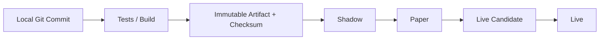

```mermaid
flowchart LR
    V["データベンダー"] --> I["Data Ingestion"]
    I --> R["Raw Immutable Store"]
    R --> N["Normalization / Instrument Master"]
    N --> C["Versioned Data Catalog"]
    C --> E["Common Event Engine"]

    S["Strategy Plugin"] --> E
    E --> PR["Portfolio / Strategy Risk"]
    PR --> GR["Platform Hard Risk Gate"]
    GR --> OMS["OMS"]
    OMS --> BA["Broker Adapter"]
    BA --> BK["IBKR Paper / Live"]

    BK --> EX["Order / Fill / Account Events"]
    EX --> J["Durable Event Journal"]
    J --> RC["Reconciliation"]
    RC --> E

    E --> OB["Logs / Metrics / Alerts"]
    OB --> OP["Operator"]
    OP --> KS["Emergency Controls"]
    KS --> GR
```

# タートルズ・トレンドフォロー自動トレードシステム 要件定義書

- 文書状態: 初版ドラフト
- 基準日: 2026-08-02
- 原典: `research/タートルズ・トレンドフォロー戦略.md`
- ヒアリング原文: `plan/chat_history/2026-08-02_自動トレードシステム要件ヒアリング.md`
- 用途: バックテスト、Shadow、Paper、少額Live、本番運用へ段階移行するシステムの設計基準

> 本書はシステム設計・研究目的の文書であり、投資助言ではない。先物、FX、CFD、暗号資産等には、証拠金を超える損失、ギャップ、流動性枯渇、取引停止、追証、限月交代、取引先信用リスクがある。

---

## 1. エグゼクティブ・サマリー

本システムは、タートルズ・トレンドフォロー戦略の原典再現版と現代化候補を、同一のイベント駆動基盤上で比較し、検証済みの戦略だけをShadow、Paper、少額Liveへ昇格させる。

暫定的な第一候補構成は次のとおりである。

| 項目 | 暫定方針 |
|---|---|
| 証券会社 | Interactive Brokers Japanを第一候補 |
| 取引エンジン | NautilusTraderとLEANをPoCで比較して決定 |
| 戦略言語 | Pythonを第一候補 |
| 研究環境 | 自宅Windows PC |
| Shadow・Paper・Live | 東京リージョンのクラウドVM |
| データ | 証券会社と独立した履歴データを取得し、Parquetで不変保存 |
| 初期対象 | 3～5市場。安定後に20～40市場 |
| データ粒度 | 初期対象は全期間1分足。日足も別途生成 |
| 実行方式 | モジュラーモノリス、イベント駆動、アダプター方式 |
| リスク | 原典Unit制限、基盤側ハードガード、最大DD目標15% |
| 運用 | Shadow → Paper完全自動 → 少額Live完全自動 |
| 障害時 | 新規・積み増し停止、証券会社側ストップ維持、即時通知 |
| セキュリティ | Secret Manager、最小権限、秘密情報をGit・ログへ保存しない |
| 復旧 | 暗号化世代バックアップ、別ストレージ保存、定期復元試験 |

バックテストを証券会社のデモ口座で実施する設計にはしない。バックテストは履歴イベントを共通エンジンへ再生して行い、証券会社のPaper口座はリアルタイムのフォワードテストとAPI統合試験に使用する。

---

## 2. 目的と成功条件

### 2.1 目的

1. タートルズ原典ルールを、曖昧さを明示したうえで再現する。
2. 原典版と現代版を同一条件で比較する。
3. 戦略ロジックを交換しても、データ、注文、口座照合、監視、セキュリティを再利用できるようにする。
4. バックテストとLiveの実装差を最小化する。
5. 障害、再起動、重複イベント、部分約定、限月交代に耐える。
6. 検証履歴、データ版、コード版、設定、発注判断を再現可能にする。
7. 初期月額費用を1万円未満に抑え、妥当性確認後に段階的に拡大する。

### 2.2 成功条件

- 同じ入力データ、コード版、設定、乱数シードから同じバックテスト結果を再現できる。
- 戦略から証券会社固有APIを参照しない。
- Backtest、Paper、Liveが同じ戦略インターフェースを使う。
- 再起動後に注文・約定・ポジション・残高を証券会社と照合できる。
- 同一の論理注文が二重発注されない。
- 取引判断、リスク拒否、注文変更、約定、手動介入を監査できる。
- データ停止または内部異常時に、新規リスクが自動的に増えない。
- 定義済みの昇格基準を満たすまでLiveへ進めない。

### 2.3 非目標

- HFT、マーケットメイク、ミリ秒以下の低遅延取引。
- 初期段階でのマイクロサービス化、Kubernetes化、複数地域Active-Active運転。
- 第三者顧客口座の運用、投資助言、資金の入出金自動化。
- バックテスト収益だけを根拠とした自動Live移行。

---

## 3. ヒアリングで確定した要件

| ID | 決定内容 | 状態 |
|---|---|---|
| Q1 | 原典版と現代版を並行比較 | 確定 |
| Q2 | 対象アセットは別途調査して決定 | 未確定 |
| Q3 | 初期3～5市場、安定後20～40市場 | 確定 |
| Q4 | ロング・ショート双方 | 確定 |
| Q5 | Live開始資金は100万円未満 | 確定 |
| Q6 | 初期月額費用1万円未満、段階拡大 | 確定 |
| Q7 | IBKRを第一候補 | 確定 |
| Q8 | 最大ドローダウン目標15% | 確定 |
| Q9 | 原典基準として1N＝口座の1% | 暫定 |
| Q10 | 年率ポートフォリオ・ボラティリティ目標10% | 要解釈確定 |
| Q11 | 原典System 1・2、現代リスク版、複数速度版を段階比較 | 確定 |
| Q12 | System 1の前回勝ちフィルター有無を比較 | 確定 |
| Q13 | 日中到達エントリーと終値確認エントリーを比較 | 確定 |
| Q14 | 4 Unit、積み増しなし、2 Unit上限を比較 | 確定 |
| Q15 | 2N、Whipsaw、ボラ急上昇対応ストップを比較 | 訂正後確定 |
| Q16 | 1Nリスクは契約粒度と最大DD試験後に決定 | 未確定 |
| Q17 | 戦略は入出金を除く口座管理を担当 | 確定 |
| Q18 | 戦略のポートフォリオ上限は原典4/6/10/12 Unit | 確定 |
| Q19 | 限月・ロールは対象アセット調査後に決定 | 未確定 |
| Q20 | 初期3～5市場は全期間1分足 | 確定 |
| Q21 | NautilusTraderとLEANのPoCでエンジン決定 | 未確定 |
| Q22 | 研究は自宅、Shadow・Paper・Liveは東京クラウドVM | 確定 |
| Q23 | 認証、設定、DB、実行プロセスを環境別に分離 | 確定 |
| Q24 | Shadow→Paper完全自動→少額Live完全自動 | 確定 |
| Q25 | 障害時は新規・積み増し停止、既存ストップ維持 | 確定 |
| Q26 | Bot専用口座の手動取引は禁止。緊急操作のみ | 確定 |
| Q27 | Push＋メール＋Heartbeat停止通知 | 確定 |
| Q28 | Secret Managerと暗号鍵を使用 | 確定 |
| Q29 | 別ストレージへの暗号化世代バックアップと復元試験 | 確定 |
| Q30 | 最低期間と数値条件の双方でLive移行判定 | 確定 |

---

## 4. システム境界と責任分離



### 4.1 基盤が担当する範囲

- データ取得、時刻正規化、欠損・重複検査。
- 銘柄定義、取引所カレンダー、契約乗数、ティックサイズ、限月情報。
- イベント配送、時計、タイマー、永続イベント。
- 証券会社接続、注文状態機械、部分約定、取消・訂正。
- 起動時および定期的な口座照合。
- 基盤側ハードリスクガード。
- 監視、Heartbeat、通知、監査ログ。
- Secret取得、バックアップ、復旧。

### 4.2 戦略プラグインが担当する範囲

- 対象銘柄の選択要求。
- Entry、Exit、再Entry、ピラミッディング。
- ATR/N、Donchian Channel等の戦略指標。
- Unitサイズ、Notional Account、損失時縮小。
- 原典の相関グループおよび4/6/10/12 Unit上限。
- 戦略ごとの証拠金バッファー、通貨配分、現金余力方針。
- 注文そのものではなく、`OrderIntent`または`TargetPosition`の生成。

### 4.3 戦略から分離する強制ガード

Q17で口座管理全般を戦略範囲としたが、次の安全機能は戦略が解除できない基盤要件とする。

- 許可銘柄リスト。
- 1注文当たり最大数量・最大想定元本。
- 口座全体の最大証拠金利用率。
- 異常価格、古い価格、取引時間外注文の拒否。
- 同じ論理注文の重複拒否。
- Kill Switch作動中の新規注文拒否。
- データ停止、照合不一致、認証異常時の新規リスク拒否。
- Paper用成果物からLive口座へ接続できない環境制約。

---

## 5. 戦略プラグイン仕様

### 5.1 必須インターフェース

エンジン固有APIの外側に、次の論理インターフェースを定義する。

```text
StrategyPlugin
  initialize(config, instrument_catalog)
  restore(strategy_state)
  on_market_event(event, portfolio_snapshot)
  on_order_event(order_event, portfolio_snapshot)
  on_account_event(account_event)
  on_timer(timer_event)
  emit_intents() -> list[OrderIntent]
  snapshot() -> StrategyState
  health() -> StrategyHealth
```

`OrderIntent`には最低限、次を含める。

- strategy_id
- strategy_version
- instrument_id
- desired_side
- desired_quantityまたはtarget_position
- intent_type: entry / add / stop / channel_exit / roll / emergency
- signal_timestamp
- decision_price
- N、チャネル値、Unit計算根拠
- 有効期限
- 一意なintent_id
- 親シグナルID、ピラミッド段数

### 5.2 状態の永続化

次の状態を再起動後に復元できなければならない。

- 各市場のSystem 1前回ブレイクアウト結果。
- 見送った仮想ブレイクアウトの追跡状態。
- 各Unitの実約定価格、N、ストップ、追加段数。
- Notional Account、損失段階、基準エクイティ。
- 相関グループと方向別Unit使用数。
- 現在の限月、次限月、ロール状態。
- 未完了の注文意図と証券会社注文ID。

### 5.3 比較対象となる戦略群

| 軸 | 候補 |
|---|---|
| 基本システム | System 1、System 2、両者の資金配分 |
| System 1フィルター | 原典フィルター有、フィルター無 |
| Entry | 日中到達、終値確認 |
| 速度 | 20/10、55/20、100/50、200/100 |
| ピラミッド | 最大4、最大2、積み増しなし |
| Stop | 2N、0.5N Whipsaw、ボラ急上昇対応 |
| Unitリスク | 1.0%、0.5%、0.25%を実行可能性試験 |

比較数が急増するため、全組合せ総当たりを既定動作にはしない。研究仮説ごとに比較対象を限定し、試行回数を実験台帳へ記録する。

---

## 6. 市場データ要件

### 6.1 データ供給源

- 証券会社APIはリアルタイム執行確認と補助データに使用する。
- 長期バックテストの正本は独立したデータベンダーから取得する。
- 先物を選ぶ場合、Databentoを第一候補として費用・対象取引所・履歴期間を評価する。
- 対象アセット調査で株式、FX、CFD、暗号資産を選ぶ場合は、対応する正規データ源を別途選定する。

### 6.2 保存レイヤー

| レイヤー | 内容 | 変更方針 |
|---|---|---|
| Raw | ベンダーから取得した原データと取得メタデータ | 上書き禁止 |
| Normalized | UTC、統一銘柄ID、重複除去、品質フラグ | 変換版を付与 |
| Tradable | 実限月、実価格、出来高、建玉、契約仕様 | 版管理 |
| Signal | バックアジャスト連続系列、ロールマップ | 規則ごとに版管理 |
| Derived | N、チャネル、相関、流動性指標 | コード版と紐付け |
| Experiment | 入力版、設定、結果、メトリクス | 追記専用 |

### 6.3 初期データ粒度

- 3～5市場について、利用可能な全期間の1分OHLCVを取得する。
- 日次シグナル値は、取引所セッション定義に基づいて1分足から生成する。
- ベンダーの日足と自前集計日足を照合する。
- シグナル日、ロール日、ストップ・追加が同日発生した日は1分イベントで順序を再生する。
- 1分内で複数水準へ到達し順序不明の場合、保守的な順序またはティックデータによる再検証を行う。

### 6.4 銘柄マスター

最低限、次を有効期間付きで保持する。

- 内部instrument_id、ベンダーID、IBKR conId。
- 取引所、通貨、タイムゾーン、取引セッション。
- ティックサイズ、価格倍率、契約乗数、最小数量。
- 上場日、最終取引日、First Notice Day、受渡し条件。
- 証拠金参考値、価格制限、取引停止情報。
- 親商品、限月、原典相関グループ。

### 6.5 品質検査

- タイムスタンプ単調性。
- 重複、欠損、ゼロ価格、負の出来高。
- OHLC整合性。
- 異常なギャップと限月切替由来ギャップの区別。
- 契約仕様変更。
- タイムゾーンおよび夏時間境界。
- 取引休日・短縮取引日。
- データ訂正時の差分と再計算範囲。

品質エラーは黙って補間せず、品質フラグと採用判断を記録する。

---

## 7. 先物ロール要件

対象アセット確定まで、具体的なロール規則は未確定とする。ただし実装は次を満たす。

- シグナル系列と実際に取引する限月を分離する。
- 出来高、建玉、満期日基準のルールを差し替え可能にする。
- First Notice Dayまたは最終取引日より十分前に取引対象から除外する。
- 1日の一時的な出来高逆転で限月が往復しないHysteresisを持つ。
- ロール時の旧限月決済、新限月建玉、コスト、価格差を個別イベントとして記録する。
- 連続系列の人工的価格差をブレイクアウトとして扱わない。
- ロール中にシグナルが反転した場合の優先順位を商品別仕様で定義する。
- 現物受渡しに至る経路を基盤側ハードガードで禁止する。

---

## 8. バックテスト要件

### 8.1 基本原則

- Liveと同じ戦略プラグインおよび注文状態機械を使用する。
- 未来のデータ、当日未確定値、将来の構成銘柄情報を使用しない。
- イベント時点で利用可能だった銘柄定義、取引時間、価格だけを使用する。
- Data、Strategy、Execution、Portfolio、Riskを交換可能なコンポーネントにする。

### 8.2 約定モデル

最低限、次をモデル化する。

- Bid/Askまたは推定スプレッド。
- 手数料、取引所費用、規制費用。
- 注文種別別スリッページ。
- 寄付きギャップ、ストップ超過。
- 部分約定、注文拒否、取引停止。
- 市場参加率上限。
- 先物ロールコスト。
- FX換算と基準通貨PnL。
- Paperでは再現されない市場インパクト。

初期の小口運用では市場インパクトは小さい可能性が高いが、ゼロ固定にはせず、最低コスト・基準コスト・ストレスコストを比較する。

### 8.3 検証区分

1. 開発用期間。
2. パラメータ選定に使用しない最終Holdout期間。
3. Walk-forward期間。
4. 市場別・資産クラス別・危機期間別のサブ期間。
5. 合成障害・ギャップ・流動性ストレス期間。

### 8.4 過剰適合対策

- すべての試行を実験台帳へ記録する。
- 最良結果だけでなく全候補分布を保存する。
- Sharpe、Sortino、Calmarだけで判断しない。
- Deflated Sharpe Ratio、Probability of Backtest Overfitting等を評価候補とする。
- パラメータの一点最適値より、近傍で安定する領域を優先する。
- 市場選択を過去成績だけで行わない。
- 最終Holdoutは設計確定まで開封しない。

### 8.5 必須出力

- 日次エクイティ、証拠金、グロス・ネットExposure。
- 市場別・資産クラス別PnLとリスク寄与。
- 全シグナル、見送りシグナル、仮想System 1状態。
- 各UnitのEntry、追加、Stop、Exit、Roll。
- 手数料、スプレッド、スリッページ、ロールコスト。
- 最大DD、回復期間、Tail loss、連敗数。
- 実験ID、Git commit、データ版、設定ハッシュ。

---

## 9. 注文管理・証券会社接続要件

### 9.1 証券会社アダプター

初期はIBKR TWS APIを第一候補とする。Web APIは認証方式と機能差をPoCで確認するが、NautilusTrader連携を評価する場合はTWS API／IB Gatewayが中心となる。

アダプターは次を共通形式へ変換する。

- 契約検索・銘柄解決。
- Market data、Account、Position。
- Order accepted、rejected、partially filled、filled、canceled、expired。
- Commission、execution ID、permanent order ID。
- 接続状態、サーバー再起動、APIエラー。

### 9.2 注文状態機械

```text
IntentCreated
  -> RiskAccepted | RiskRejected
  -> SubmitPending
  -> Submitted
  -> Accepted | Rejected
  -> PartiallyFilled
  -> Filled | CancelPending | ReplacePending
  -> Canceled | Expired
```

- すべての遷移を追記専用イベントとして保存する。
- 同一イベントの再受信は冪等に処理する。
- `intent_id`と安定した`client_order_id`で二重発注を防ぐ。
- API timeoutを注文失敗と決めつけず、照会後に再送可否を判断する。
- 部分約定後のストップ数量を実残高に同期する。

### 9.3 ストップ

- Hard Stopは、対応可能な限り証券会社側へ発注する。
- 新しいUnit約定後、保護注文が有効になるまで無保護時間を監視する。
- Stop変更は、取消と新規の間に無保護状態を作らない注文方法を優先する。
- PaperとLiveのStop挙動差を受入試験する。
- チャネルExitはアプリ側シグナルだが、Hard Stopを置き換えない。

### 9.4 照合

次の場合に、証券会社を外部現実の正本として照合する。

- プロセス起動時。
- 再接続時。
- 一定間隔。
- 注文timeout後。
- 手動緊急操作後。

照合対象:

- Open orders。
- 当日約定および利用可能な約定履歴。
- Instrument別Net position。
- Cash、NAV、証拠金、購買力。
- 戦略が期待する保護注文。

不一致時は新規・積み増しを停止し、通知する。自動補正は、不一致種別ごとに明示的に許可された場合だけ行う。

---

## 10. リスク管理要件

### 10.1 戦略リスク

- 原典N計算と通常EMAを混同しない。
- Unitは契約乗数、通貨換算、最小契約数を考慮する。
- 小数契約不可の場合は切り捨て、実際のNリスクを記録する。
- 単一市場4 Unit。
- 強相関市場群は同方向6 Unit。
- 緩相関市場群は同方向10 Unit。
- 全市場同方向12 Unit。
- Notional Account縮小を構成可能にする。
- 最大ドローダウン15%は戦略停止・再評価の目標線とする。

### 10.2 基盤ハードガード

- 最大注文数量。
- 最大NetおよびGross Exposure。
- 最大証拠金利用率。
- 口座残高と証券会社購買力の最小値を使用。
- 価格鮮度上限。
- 1分当たり注文回数、取消回数。
- 1日当たり損失・異常約定件数。
- 未保護ポジション検出。
- Kill Switch。

### 10.3 現在残るリスク要件の不整合

Q10では年率ポートフォリオ・ボラティリティ10%を選択し、Q18では「原典固定Unit上限のみ」を選択している。

次のどちらとして扱うか、実装開始前に決定する。

1. **監視目標**: 年率10%をレポート・昇格判定に使うが、数量を自動調整しない。
2. **強制目標**: 予測ボラティリティが10%を超える場合に数量を縮小する。この場合、Q18は固定上限「のみ」ではなくなる。

本書では、明示的に変更されるまで1の「監視目標」を暫定解釈とする。

### 10.4 小口資金の実行可能性ゲート

Live資金100万円未満、1N＝1%、最大4 Unit、最大DD15%は、契約の最小単位によって両立しない可能性がある。

各候補アセットについて次を計算する。

- 1最小契約の1N金額。
- 2Nストップ金額と口座比率。
- 4 Unitまで積み増した理論ストップ損失。
- 必要証拠金と余剰現金。
- 3～5市場同時保有時の証拠金・ギャップストレス。

許容範囲を超える場合は、Micro商品、CFD、FX、小数数量商品、1Nリスク縮小、対象市場削減の順に再評価する。計算上1 Unit未満となる市場は取引しない。

---

## 11. 環境構成

### 11.1 自宅研究環境

用途:

- データ取得・検査。
- Notebook・探索分析。
- 単体・統合テスト。
- 大規模バックテスト、Walk-forward、レポート生成。
- NautilusTrader／LEAN PoC。

禁止事項:

- Live口座の発注権限を持つ認証情報の常設。
- 研究用スクリプトからLive APIへ到達するネットワーク経路。

### 11.2 東京クラウド環境

用途:

- Shadow。
- Broker Paper。
- 少額Liveおよび本番Live。
- 照合、監視、通知、バックアップ。

初期予算を考慮し、同一VM内にPaperとLiveを置くことは許容するが、次を必須とする。

- OSユーザーまたはコンテナを分離。
- Secret、設定、DB schemaまたはDB instanceを分離。
- ポート、account_id、client_idを分離。
- Liveプロセスの起動は明示的なLive用成果物だけ許可。
- PaperとLiveを画面・通知・ログで明確に識別。
- 同じ戦略インスタンスが両口座へ自動ルーティングしない。

資金・対象市場拡大後はPaperとLiveのVM分離を再評価する。

### 11.3 リリース



- 同じcommitから固定依存バージョンの成果物を作る。
- 成果物にはcommit、依存lock、設定schema版、ビルド時刻、checksumを付与する。
- Live VM上でソースを直接編集しない。
- バックテスト未実施の成果物をPaper・Liveへ配置しない。
- 昇格とRollbackは人が明示的に承認する。

---

## 12. 監視・通知・運用

### 12.1 必須メトリクス

- Market data最終受信時刻と遅延。
- Broker接続状態、再接続回数。
- Strategy heartbeat。
- Event queue深度と処理遅延。
- 注文数、拒否、部分約定、取消、timeout。
- Position・order照合差異。
- 未保護ポジション数。
- NAV、PnL、DD、証拠金利用率。
- 戦略別・市場別Unit使用数。
- Backup最終成功時刻。
- 認証期限・再認証予定。

### 12.2 通知レベル

| レベル | 例 | 通知 |
|---|---|---|
| INFO | 日次サマリー、シグナル、正常ロール | メールまたはDashboard |
| WARNING | 再接続、データ遅延、注文拒否1件 | Push＋メール |
| CRITICAL | 照合不一致、未保護ポジション、Heartbeat停止 | 即時Push＋メール、継続通知 |
| EMERGENCY | Kill Switch、証拠金危険域、重複発注疑い | 即時通知、新規リスク停止 |

外形監視は取引VMとは別のサービスからHeartbeatを監視し、VM自体が停止した場合も通知できるようにする。

### 12.3 手動操作

Bot専用口座では、Bot稼働中の裁量発注を禁止する。許可する操作は次だけとする。

- 新規リスク停止。
- 注文一括取消。
- 緊急強制決済。
- Bot停止。
- Broker GUIによる状態確認。

すべての操作について、実施者、時刻、理由、対象、結果を記録する。

---

## 13. 障害時動作

### 13.1 Fail-closed原則

通信切断、データ停止、内部例外、照合不一致時には次を行う。

1. 新規Entryを停止。
2. ピラミッディングを停止。
3. Broker側の既存Hard Stopを維持。
4. 状態を永続化。
5. Pushとメールで通知。
6. 復旧後にBroker状態を照合。
7. 照合完了まで自動再開しない。

古い価格を使用した継続運転は禁止する。

### 13.2 障害別Runbook

最低限、次の手順書を作る。

- Market data停止。
- IB Gateway/TWS停止。
- API pacing violation。
- 認証期限切れ。
- Order timeout。
- 部分約定後の切断。
- Stop注文拒否。
- Position不一致。
- DB書込み失敗。
- VM停止・再起動。
- Secret取得失敗。
- 異常価格・取引所停止。
- 期限接近先物のロール失敗。

---

## 14. セキュリティ要件

- SecretはクラウドSecret Managerで管理する。
- 保存時暗号化と転送時TLSを使用する。
- Live secretへアクセスできる実行Identityを限定する。
- 人のクラウドログインにMFAを必須とする。
- SSH/RDPは接続元制限、VPNまたは踏み台を検討する。
- Secret、token、account ID全体をログ出力しない。
- Git、Notebook、テストfixtureへ実Secretを保存しない。
- PaperとLiveのSecret名、権限、実行Identityを分離する。
- 依存バージョンを固定し、脆弱性検査を行う。
- OSおよび依存更新はPaperで検証後にLiveへ適用する。
- 監査ログの削除権限を取引プロセスへ与えない。
- IBKRの定期再認証を運用カレンダーとアラートへ登録する。

---

## 15. バックアップ・復旧要件

### 15.1 バックアップ対象

- PostgreSQLの注文、約定、ポジション、戦略状態、監査イベント。
- 設定ファイルと設定schema。
- Instrument masterとロールマップ。
- 実験台帳と重要レポート。
- Raw・Normalizedデータのmanifest。
- Runbook、リリースmanifest。

### 15.2 方針

- 暗号化した世代別バックアップを別ストレージへ保存する。
- 最低でも日次Full backupを取得する。
- Live取引状態は、予算が許す範囲で日次より短い増分保存を採用する。
- 取引VMの削除・暗号化被害で同時消失しない権限構成にする。
- 月1回以上、隔離環境へ復元して整合性を試験する。
- Backup成功だけでなく、復元時間と復元後照合結果を記録する。

暫定目標:

- 取引状態RPO: 15分以内を目標。最低要件は日次＋Broker照合による補完。
- 研究データRPO: 24時間以内。
- Live RTO: 4時間以内。ただしBroker側Stopは停止中も有効であること。

---

## 16. 取引エンジンPoC

### 16.1 比較対象

- NautilusTrader。
- LEAN／QuantConnect。

独自イベントエンジンは、両候補が必須要件を満たせない場合だけ検討する。

### 16.2 共通PoCシナリオ

1. 1市場の20日ブレイクアウト。
2. 1分足履歴リプレイ。
3. 同日中のEntry、追加、Stop。
4. 部分約定。
5. プロセス強制終了と再起動。
6. IBKR Paper接続。
7. Open order、Fill、Position照合。
8. 先物限月検索と手動ロールシナリオ。
9. PaperとLiveの設定分離。
10. 同一戦略コードのBacktest/Paper利用。

### 16.3 評価表

| 評価項目 | 重み |
|---|---:|
| 正確なイベント順序・決定性 | 20% |
| IBKR Paper・Live接続の安定性 | 20% |
| 再起動復旧・照合 | 15% |
| 先物・ロールの拡張性 | 15% |
| 戦略差替え容易性 | 10% |
| Pythonでの開発・デバッグ性 | 10% |
| 運用・監視・配布 | 5% |
| ライセンス、費用、保守状況 | 5% |

Critical項目に1つでも未解決の失敗がある候補は、合計点に関係なく採用しない。

---

## 17. テスト要件

### 17.1 自動テスト

- N、True Range、DonchianのGolden test。
- 当日値をチャネルへ含めないテスト。
- System 1仮想シグナル状態機械。
- 0.5N追加、最大Unit。
- 各Unit Stop更新。
- Notional Account縮小。
- 4/6/10/12 Unit上限。
- 通貨換算、契約乗数、整数丸め。
- Gap、部分約定、注文拒否。
- Roll前後のPnL連続性と偽シグナル防止。
- 重複イベント・順不同イベント。
- 再起動・再照合。
- SecretやLive endpointがテストへ混入しないこと。

### 17.2 受入テスト

- Broker PaperでEntry、追加、Stop、Exit、Cancel/Replaceを確認。
- Gateway日次再起動後に復旧。
- 週次再認証のRunbook確認。
- 通信遮断中に新規注文が出ない。
- 外形Heartbeat停止通知。
- Backupからの復元。
- Kill Switchと緊急決済。
- Live用成果物がPaper口座へ誤接続した場合の拒否、および逆方向の拒否。

---

## 18. Shadow・Paper・Live昇格基準

### 18.1 BacktestからShadow

- 原典Golden testが全件合格。
- Look-ahead検査、データ品質検査が合格。
- コスト・ギャップ・ロールを含む。
- Holdoutを除く頑健性試験が合格。
- すべての実験と試行回数を記録。

### 18.2 ShadowからPaper

- リアルタイムシグナルと履歴再計算が100%一致。
- 30日以上、未処理例外ゼロ。
- Heartbeat、通知、再起動復旧試験が合格。
- Shadowが生成した注文意図を人が照合済み。

### 18.3 Paperから少額Live

最低運転期間と数値条件の双方を必要とする。

暫定基準:

- Paper完全自動運転90日以上。
- 少なくとも1回の限月ロールを含む。先物を取引しない場合は該当なし。
- 重複注文0件。
- 未解決のPosition・Order照合差異0件。
- 保護Stop未設定時間が許容値を超えた事象0件。
- 再起動復旧、通信遮断、DB復元、通知試験が全件合格。
- Paperと内部仮想約定の差異を説明できる。
- 最大DD15%のストレス試験を合格。
- 契約粒度上、指定Unitリスクが実行可能。
- Runbookと緊急連絡手順を確認済み。

### 18.4 少額Liveから通常Live

- 最小数量で90日以上。
- 運用障害による想定外注文0件。
- Slippageと手数料が事前ストレス範囲内。
- PaperとLiveの差異分析完了。
- 重大アラートの対応記録に未解決項目なし。
- 増額は一度に行わず、事前定義した段階で実施。

期間と件数は、対象アセットのシグナル頻度が決まった後に再調整する。

---

## 19. 実装ロードマップ

### Phase 0: 未確定事項の解消

1. 現代に適した取引アセットの調査計画と評価。詳細は `plan/Phase0_現代に適した取引アセット調査計画書.md` を参照する。実行前のschema、Evidence、承認Gate、ログ規約は `plan/Phase0_Step0前_実行基盤準備.md` を参照する。
2. IBKR Japanの口座、取引権限、対象商品、Market data費用確認。
3. NautilusTrader対LEANのPoC。
4. 東京クラウド候補の費用・GUI・再認証・Backup比較。
5. 年率10%目標の扱いを決定。

### Phase 1: ドメイン仕様と原典Golden test

1. イベント、状態、ID、時刻規則。
2. N、Channel、Unit、Filter、Stop、Exit。
3. 原典例を固定fixture化。
4. Strategy Plugin interface。

### Phase 2: データ基盤

1. Raw download。
2. Instrument master。
3. Normalizationと品質検査。
4. 1分足Catalog。
5. Continuous signal seriesとRoll map。

### Phase 3: Backtest・研究

1. 原典版。
2. 比較候補を一軸ずつ追加。
3. コスト・ギャップ・ロール。
4. Walk-forward、Holdout、過剰適合検査。
5. 小口資金実行可能性。

### Phase 4: OMS・IBKR Paper

1. Order state machine。
2. IBKR adapter。
3. Reconciliation。
4. Broker-native Stop。
5. 障害注入と再起動試験。

### Phase 5: 東京クラウド・Shadow・Paper

1. Infrastructure構築。
2. Secret、監視、Backup。
3. Shadow運転。
4. Paper完全自動。
5. 昇格判定。

### Phase 6: 少額Live

1. 最小数量。
2. 監視強化。
3. Paper/Live差異分析。
4. 段階的スケール。

---

## 20. 未確定事項・決定ゲート

| ID | 未確定事項 | 決定期限 | Live阻害 |
|---|---|---|---|
| OD-01 | 対象アセットと初期3～5市場 | データ購入前 | Yes |
| OD-02 | 商品別データベンダー | データ実装前 | Yes |
| OD-03 | NautilusTraderまたはLEAN | 基盤実装前 | Yes |
| OD-04 | 商品別限月・ロール規則 | 先物Backtest前 | Yes |
| OD-05 | 1N＝1%、0.5%、0.25%のLive採用値 | Paper前 | Yes |
| OD-06 | 年率10%を監視目標または強制目標のどちらにするか | Risk実装前 | Yes |
| OD-07 | 東京クラウド事業者・OS・VM形態 | Shadow前 | Yes |
| OD-08 | Push通知サービス | Shadow前 | No |
| OD-09 | Paper/Liveの最低期間・必要シグナル数の最終値 | Paper開始前 | Yes |

---

## 21. 調査で確認した外部制約

- IBKR APIは注文、市場データ、口座・ポジション監視を提供し、Paper口座でも利用できる。[IBKR Japan API](https://www.interactivebrokers.co.jp/jp/index.php?f=50761)
- IBKR Paperは最良気配を基に約定をシミュレートし、Stopや複雑注文、部分約定がLiveと異なる。[IBKR Paper Trading limitations](https://ibkrcampus.com/campus/glossary-terms/paper-trading-account/)
- TWS／IB Gatewayは月曜から土曜の日次自動再起動が可能だが、週次で再認証が必要であり、公式には完全なGUIなし運用をサポートしない。[IBKR third-party connections](https://ibkrcampus.com/campus/ibkr-api-page/third-party-connections/)
- IBKR履歴データには取得頻度や期限切れ先物等の制約があるため、長期研究データの単独正本には適さない。[IBKR historical data limitations](https://interactivebrokers.github.io/tws-api/historical_limitations.html)
- Databentoの連続先物シンボルは実限月へマッピングするが、価格をバックアジャストしない。[Databento symbology](https://databento.com/docs/standards-and-conventions/symbology)
- NautilusTraderはBacktest、Sandbox、Liveの共通コア、IBKR・Databentoアダプター、実行照合を提供する。[NautilusTrader docs](https://nautilustrader.io/docs/latest/)、[Execution reconciliation](https://nautilustrader.io/docs/latest/concepts/live/)
- QuantConnect Paper Tradingはリアルタイムデータと仮想資金による取引を提供するが、約定はシミュレーションである。[QuantConnect Paper Trading](https://www.quantconnect.com/docs/v2/cloud-platform/live-trading/brokerages/quantconnect-paper-trading)
- 自動取引では、本番前試験、変更管理、継続監視、照合、開発・本番分離が有効な管理策とされる。[FINRA Regulatory Notice 15-09](https://www.finra.org/industry/notices/15-09)
- 多数のバックテスト候補から最良結果を選ぶと選択バイアスが生じるため、試行回数と非正規性を考慮した評価が必要である。[The Deflated Sharpe Ratio](https://papers.ssrn.com/sol3/Delivery.cfm/SSRN_ID2460551_code87814.pdf?abstractid=2460551)

---

## 22. 次の作業

要件定義後の最初の実行作業は、次の順序を推奨する。

1. 対象アセット調査の評価軸・調査計画を作成する。
2. NautilusTrader／LEAN PoCの受入テスト仕様を具体化する。
3. 原典ルールの曖昧点一覧とGolden test仕様を作成する。
4. 初期資金100万円未満で取引可能な契約粒度を調査する。
5. OD-06の年率10%目標の扱いを確定する。
