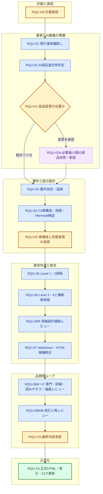

# 自動トレードシステム 要件定義書アップデート実行計画書

## 0. 文書情報

| 項目 | 内容 |
|---|---|
| 計画書ID | RQU-PLAN-001 |
| 版 | v0.1 |
| 作成日 | 2026-08-10 |
| 状態 | PLAN_ONLY / 実行前 |
| 更新対象の編集原稿 | `plan/自動トレードシステム_要件定義書.md` |
| 更新対象の正式成果物 | `doc/requirements/01_自動トレードシステム要件定義書.html` |
| 目的 | 既存要件、Phase 0〜3の実装・検証結果、Human Gate、残存Unknownを整合させ、中学生でも理解できるC4モデル要件定義書へ更新する |
| 実行開始条件 | 本計画に対するユーザー承認（RQU-H0） |

> **重要:** 本書は要件定義書そのものではなく、更新作業の順序・担当AI部品・停止条件・品質Gateを定める実行計画である。本書の作成時点では、要件定義書本文、正式HTML、AI部品の実体を変更しない。

## 1. 目的

次の4点を同時に満たす要件定義書へ更新する。

1. 2026-08-10時点までの実装、テスト、採用判断、Human Gate、残存Unknownを正しく反映する。
2. ITを知らない中学生が、専門用語の意味とシステムの安全境界を一読で理解できるようにする。
3. C4モデルのLevel 1〜4に沿い、文章と直後のMermaid図を組にした、視覚中心のHTML文書にする。
4. 詳細設計書作成用AI基盤の「入力整理 → 構造化 → 専門レビュー → 改訂 → 再レビュー」を品質統制として利用する。

## 2. 今回の更新で直すべき現状差分

現行要件定義書は初期構想として有用だが、現在の事実と次の差分がある。

| 現行記載 | 2026-08-10時点で反映すべき内容 |
|---|---|
| NautilusTraderとLEANを今後比較して決定する | LEANはローカルBacktestの主PoC候補として条件付き採用候補。最終エンジン決定はPhase 4以降のPaper証拠を含む別Gate |
| Phase 0〜3が今後の作業として書かれている | Phase 0〜2の成果物、Phase 3の実装・PoC・統合検証完了を現在状態として整理 |
| Phase 3のStrategy / Backtest実装が未反映 | `src/autotrade/strategy/`、`src/autotrade/backtest/`、`src/autotrade/market_data/` の実装済み境界を反映 |
| M30、安全な再生、Manifest、CalendarPortなどが未反映 | 実M1連続30本、provenance、決定的Replay、Manifest/hash、snapshot/restore、fail-closedを反映 |
| 完了・未完了の区別が粗い | `実装・検証済み`、`承認済み延期`、`計画中`、`未承認・禁止`を色と文章で区別 |
| Phase 3残課題が未反映 | `UNK-P3-01`、`UNK-P3-05`、`UNK-P3-07`は未解消・未PASSのままPhase 4へ延期した事実を反映 |
| Broker / Paper / Liveの境界が構想中心 | Phase 4は計画、Broker/Paper境界設計、隔離検証準備のみ許可。Broker接続、Paper実行、実注文、Live、Secret、Cloud、利益採用は別Human Gate |

## 3. 成果物と正本ルール

### 3.1 最終成果物

| 区分 | パス | 位置づけ |
|---|---|---|
| 編集用原稿 | `plan/自動トレードシステム_要件定義書.md` | HTMLと同じ要求ID・版・状態を持つ編集原稿。単独の正式正本にはしない |
| 正式要件定義書 | `doc/requirements/01_自動トレードシステム要件定義書.html` | 現在状態を示す唯一の正式な要件定義書 |
| 総合索引 | `doc/index.html` | 正式HTMLへの入口と、版・現在状態の短い説明を更新 |
| 実行ログ | `plan/requirements_update/RQU-10_要件定義書更新実行ログ_2026-08-10.md` | 実行手順、レビュー結果、採否、検証結果を記録 |

### 3.2 中間成果物

中間成果物は `plan/requirements_update/` に保存する。正式HTMLへ統合する前の章別原稿は `plan/requirements_update/drafts/`、レビュー結果は `plan/requirements_update/reviews/`、Mermaid検証証跡は `plan/requirements_update/evidence/mermaid/` に置く。

### 3.3 二重正本を防ぐ規則

- 正式な現在状態はHTMLを正本とする。
- Markdownには「編集用原稿。正式版はHTML」と明記する。
- MarkdownとHTMLは同じ文書ID、版、基準日、要求IDを持たせる。
- 内容差分を機械確認し、要求IDや状態が片方だけに存在する場合は公開しない。
- 旧事実は削除して現在事実に見せず、「変更履歴」または「当時の計画」と明記して残す。

## 4. 対象範囲

### 4.1 対象

- システムの目的、利用者、外部システム、安全境界
- Market Data、Strategy、Backtest、Engine Adapter、将来のBroker/Paper/Live境界
- Turtle戦略の責務と非責務
- データ、イベント、注文意図、実験、Manifest、品質Gate、状態遷移
- セキュリティ、監視、停止、復旧、監査、費用、環境分離
- Phase 0〜3の実装・決定事項とPhase 4以降の許可範囲
- Human Gate、Blocked、Unknown、再開条件
- 要求から設計、実装、テスト、証拠への追跡性

### 4.2 対象外

- 新しい売買手法、銘柄別パラメータ、利益予測、投資助言の追加
- Broker接続、Secret投入、Paper注文、Live注文、Cloud配備の実行
- Phase 4実装の先取り
- 残存Unknownを根拠なく解消またはPASSへ変更すること
- 要件定義書に実装詳細設計の全コード、全API、全テーブル定義を複製すること

## 5. 入力資料と優先順位

矛盾時は、次の順で現在事実を判定する。

1. `doc/00_全Phase残課題Blocked統合台帳.html` の最新正本状態
2. 各Phaseの最終判定書、承認記録、最新レビュー反映履歴
3. `tests/evidence/` の固定Run証拠と品質Gate結果
4. `src/` と `tests/` の現行実装・テスト契約
5. Phase別正式HTML設計書
6. Phase実行計画、実行ログ、旧履歴
7. 現行 `plan/自動トレードシステム_要件定義書.md`

主な入力は次のとおり。

- `plan/自動トレードシステム_要件定義書.md`
- `doc/requirements/01_自動トレードシステム要件定義書.html`
- `doc/00_全Phase残課題Blocked統合台帳.html`
- `doc/index.html`
- `doc/phase1/`、`doc/phase2/`、`doc/phase3/` の正式成果物
- `doc/phase3/10_完了判定/13_Phase3完了判定とPhase4移行承認書.html`
- `src/autotrade/market_data/`、`src/autotrade/strategy/`、`src/autotrade/backtest/`
- `tests/market_data/`、`tests/strategy/`、`tests/backtest/`、`tests/engine_poc/`、`tests/quality_gate/`
- `tests/evidence/phase2/`、`tests/evidence/phase3/`
- `doc/ai_foundation/14_実装詳細設計書構成標準.html`
- `doc/ai_foundation/15_実装詳細設計AI基盤仕様.html`
- `doc/ai_foundation/16_実装詳細設計書HTMLテンプレート.html`
- `doc/ai_foundation/17_実装詳細設計書作成依頼プロンプト.html`

外部仕様を新しく断定する必要が生じた場合だけ、公式一次情報を調査し、URLと確認日を記録する。既存の正式成果物で足りる場合は再調査しない。

## 6. 文書の情報設計

### 6.1 読者が最初に見る部分

1. 30秒で分かる要約
2. このシステムが「できること」「まだしてはいけないこと」
3. 状態の読み方
4. C4 Level 1の全体図
5. 専門用語ミニ辞典

### 6.2 C4 Level 1: System Context

「街の中のどんな建物か」という例えで説明する。

- 利用者、運用者、承認者
- 自動トレードシステム
- 市場データ提供元、取引エンジン、将来のBroker、通知先、Secret管理、Cloud
- 情報の入口と出口
- 人間が承認しなければ越えられない境界
- Context Diagram

### 6.3 C4 Level 2: Container

「建物の中の部屋」という例えで説明する。

- 設定・実行入口
- Market Data
- Strategy
- Backtest / Experiment
- Engine Adapter / LEAN PoC
- Evidence / Manifest / Result Store
- 将来のOMS / Risk / Broker Adapter / Monitoring
- コンテナ配置図
- Backtest操作のシーケンス図
- 将来のPaper移行におけるHuman Gate付きシーケンス図

### 6.4 C4 Level 3: Component

「部屋の中の専門スタッフ」という例えで説明する。

- Market Data内の取得、Catalog解決、正規化、品質判定、保存
- Strategy内の指標、Turtle規則、状態、Snapshot、TargetPosition
- Backtest内のReplay順序、時間足集約、Calendar、Cost、Fill、Roll、結果保存
- Engine AdapterとCoreの分離
- 主要コンポーネント図
- Data Gate停止フロー
- M30生成フロー
- Backtest再現フロー
- 注文意図から安全境界までのフロー

### 6.5 C4 Level 4: Code / Detail

「スタッフのマニュアルと整理用ファイル」という例えで説明する。ただし要件定義書なので、実装クラスの全項目を複製せず、理解と追跡に必要な概念データと状態に絞る。

- MarketEvent、OrderIntent、TargetPosition、ExperimentPlan、Manifest、Snapshot、Result、HumanGate、Unknown
- 概念クラス図またはER図
- Data Gate状態遷移
- Experiment実行状態遷移
- 注文意図の状態遷移
- 「要求上の概念」と「現在の実装名」の対応表

### 6.6 C4の後に置く横断章

- 機能要件
- 非機能要件
- セキュリティと権限
- Fail-Closedと手動停止
- テスト・品質Gate・証跡
- Backtest → Shadow → Paper → Liveの移行条件
- 現在の実装状況
- Phaseロードマップ
- Human Gate / Blocked / Unknown
- 要求追跡表
- 用語集
- 変更履歴

## 7. 中学生向け表現ルール

### 7.1 基本ルール

- 1文を短くし、1文で伝える主題を1つにする。
- 先に身近な例え、次に正式名称、最後にこのシステムでの役割を書く。
- 専門用語を消さず、初出で必ず説明する。
- 「なぜ必要か」「壊れるとどうなるか」「誰が止めるか」をセットで説明する。
- 数値、ID、状態名は正確に保ち、やさしくするために意味を変えない。
- 「利益が出る」「安全である」と一般化せず、検証できた範囲を明記する。

### 7.2 用語の説明例

| 正式語 | 中学生向けの入口 |
|---|---|
| Database / DB | たくさんの記録を決められた場所にしまう「巨大な本棚」 |
| API | 別の部屋へ注文を伝え、返事を運ぶ「ウェイターさん」 |
| Adapter | 形の違う差し込み口をつなぐ「変換プラグ」 |
| Manifest | 入力、設定、版、hashを書いた「封印付き持ち物リスト」 |
| hash | ファイルが変わっていないか確かめる「デジタル指紋」 |
| Snapshot | 途中から同じ状態で再開するための「セーブデータ」 |
| Replay | 同じ市場データを同じ順番でもう一度流す「録画の再生」 |
| Fail-Closed | 分からないときに進まず止まる「安全ブレーキ」 |
| Human Gate | 人が内容を見て承認するまで開かない「安全ゲート」 |
| Unknown | まだ証拠が足りず、正しいとも間違いとも決めていない状態 |

### 7.3 読みやすさGate

- 各C4 Levelを独立に中学生視点でレビューする。
- 難しい語、長い文、例えの誤解、図と文章の不一致を指摘する。
- 補助評価として `student-reviewer` を本文説明部分に限定して使い、各Level 85点以上を目標とする。
- `student-reviewer` の「数式なし」は説明本文にだけ適用し、要求上必要な数値・ID・型名・コード名は削除しない。
- 読みやすさ修正で意味が変わっていないことをA10、A90、A91が再確認する。

## 8. Mermaid図解標準

### 8.1 共通規則

- 解説文の直後に対応する図を置く。
- 図の直後に「この図で見るポイント」を3点以内で置く。
- 色だけで状態を伝えず、ラベルや線種も併用する。
- 実装済み、承認済み延期、将来予定、禁止境界を別の色と語で示す。
- 外部CDNを使わず、既存の `doc/assets/mermaid.min.js` と `doc/assets/mermaid-init.js` を使う。
- 全図にタイトル、凡例、代替説明を付ける。

### 8.2 図種別の色分け方法

Mermaidは図種ごとに使える文法が異なるため、無効な `subgraph` や `classDef` を無理に付けない。RQU-04でローカルMermaid版の実描画を確認し、次を基本にする。

| 図 | 基本記法 | 色分け・グループ化 |
|---|---|---|
| Context / Container / Component / Flow | `flowchart` | `subgraph` と `classDef` / `style` |
| Sequence | `sequenceDiagram` | `box rgb(...)`、`rect rgb(...)`、`Note` |
| Data relationship | `classDiagram`を第一候補 | `classDef` と `class`。非対応なら検証済みのER表現へ切替 |
| State | `stateDiagram-v2` | ローカル版で有効な `classDef` / `class` または状態群の分割と注記 |

### 8.3 Mermaid互換性Gate

- 最終原稿に先立ち、使用予定の全図種を最小サンプルで描画する。
- Mermaid構文エラー、空図、横切れ、縦切れ、文字重なりを確認する。
- HTMLをローカル表示し、画面幅を変えて確認する。
- 構文非対応の場合は、意味を保った対応済み記法へ変更する。
- C4専用構文に依存せず、Level 1は要件で許可されたflowchartを使ってよい。

## 9. 要求IDと追跡性

### 9.1 既存IDの扱い

- Q1〜Q30、OD-01〜OD-08は削除せず、現在状態を再評価する。
- Phaseの要求ID、P3-AC-01〜08、Human Gate、Blocked、Unknownを対応付ける。
- 旧IDを置換する場合は、旧ID → 新IDの対応表を残す。

### 9.2 新しい要求分類

必要に応じて、次の接頭辞で安定した要求IDを付ける。

| 接頭辞 | 意味 |
|---|---|
| REQ-CTX | 利用者、目的、外部境界 |
| REQ-DATA | 市場データ、品質、保存、再生 |
| REQ-STR | StrategyとTurtle規則 |
| REQ-BT | Backtest、Experiment、再現性 |
| REQ-EXE | 実行エンジン、Adapter、OMS境界 |
| REQ-RISK | Risk、Account、手動停止 |
| REQ-OPS | 監視、復旧、環境分離、Secret |
| REQ-QA | テスト、証跡、品質Gate |
| REQ-GATE | Human Gate、Blocked、Unknown |

### 9.3 追跡表の最低列

`要求ID / 中学生向け説明 / 正式な要求 / 状態 / 根拠文書 / 実装 / テスト / 証拠 / Human Gate / Unknown / 次の確認時期`

## 10. 詳細設計AI基盤の使い方

本成果物の種類は「要件定義書」であり、「実装詳細設計書」へ改称しない。ただし、詳細設計AI基盤の品質ループを次のように利用する。

| AI部品 | この作業での責務 |
|---|---|
| `AutoTradeProject_ImplementationDesign_Orchestrator_v0_1` | 入力、章別設計、レビュー、改訂、再レビューの全体統制 |
| `AutoTrade_A10_RequirementsCurator_v0_1` | 現行要件、決定事項、実装、証拠の事実整理 |
| `AutoTrade_A20_ArchitectureDomainArchitect_v0_1` | C4 Level 1〜4、ドメイン、依存方向の整合 |
| `AutoTrade_A30_StrategyQaArchitect_v0_1` | Strategy、Turtle、Golden/Bias、品質Gate |
| `AutoTrade_A40_ExecutionEnginePocArchitect_v0_1` | Backtest、LEAN PoC、実行モード境界 |
| `AutoTrade_A50_AdapterArchitect_v0_1` | Market Data / Engine / Broker Adapter境界 |
| `AutoTrade_A60_RiskAccountArchitect_v0_1` | Portfolio、Risk、Account、OMS責務 |
| `AutoTrade_A70_OpsSecurityArchitect_v0_1` | 監視、Secret、環境分離、安全停止 |
| `AutoTrade_A80_DocumentIntegrator_v0_1` | 章統合、用語統一、履歴、正式HTML反映 |
| `AutoTrade_A81_DesignDocSetWriter_v0_1` | HTML構造、相互参照、`doc/index.html` 導線 |
| `AutoTrade_A82_ImplementationDetailDesigner_v0_1` | Level 3/4の実装可能性と、要件・詳細設計の境界確認 |
| `AutoTrade_A90_DesignReviewer_v0_1` | 全体整合、過剰断定、追跡漏れ、安全境界のレビュー |
| `AutoTrade_A91_ImplementationDetailReviewer_v0_1` | モジュール、入出力、状態、例外、テストとの接続可能性レビュー |

実装詳細設計標準の項目が要件定義書に不要な場合は、無理に詳細化せず `N/A（理由）` または既存詳細設計書へのリンクとする。

## 11. AI部品の改修・新設方針

### 11.1 初期仮説

既存の汎用AI部品を組み合わせれば本作業を実行できる可能性が高い。したがって、最初から新しいSkill、Agent、Orchestratorを作らない。

### 11.2 RQU-02で判定する観点

| 観点 | 合格条件 |
|---|---|
| 事実忠実性 | 現行要件、統合台帳、実装、証拠を優先順位どおりに統合できる |
| C4構成 | Level 1〜4を責務境界を壊さず作成できる |
| 中学生向け表現 | 例えを加えても正式な要求、安全警告、数値、状態を失わない |
| Mermaid | ローカルHTMLで構文・配色・可読性を検証できる |
| HTML | 正式成果物、索引、相互リンク、履歴を同期できる |
| レビュー閉ループ | 専門レビュー、読みやすさレビュー、改訂、再レビューを分離できる |

### 11.3 改修・新設の必要条件

次のすべてを満たす場合だけRQU-02Aを実行する。

1. 既存部品の単独利用または組合せでは、上表の必須責務を満たせない。
2. 不足が今回限りの文言調整ではなく、今後も再利用する恒久責務である。
3. 既存部品への最小改修と新設を比較し、新設の方が責務境界を明確にできる。
4. 完全名、責務、入力、出力、停止条件、使用Skill、発火条件を提示できる。
5. ユーザーがRQU-H1で変更対象を承認する。

### 11.4 条件付き変更の必須範囲

RQU-02Aを実行する場合は、`AutoTradeComponentLifecycle_Orchestrator_v0_1` と `AutoTrade_A06_AiComponentEngineer_v0_1` を使い、次を同じ変更セットで行う。

- `.codex/skills/`、`.codex/agents/`、`.codex/orchestrators/` の必要最小限の実体変更
- `doc/ai_foundation/03`〜`08` の追従更新
- `settings/ai_component_rules.md` の必要箇所だけ更新
- 必要な場合だけ `AGENTS.md` と `README.md` を更新
- `doc/index.html` の導線更新
- JSON、参照、リンク、名前衝突、発火制御の検証
- `default_orchestrator` は変更しない

不足がない場合は、RQU-02Aを `SKIPPED_REUSE_SUFFICIENT` と記録し、文書更新へ進む。

## 12. 実行DAG



## 13. Human Gate

| Gate | 判断者 | 判断内容 | 承認前に可能 | 承認前に禁止 |
|---|---|---|---|---|
| RQU-H0 | ユーザー | 本計画で更新作業を開始する | 読取調査 | 要件本文、正式HTML、AI部品の変更 |
| RQU-H1 | ユーザー | AI部品の具体的な改修・新設対象 | 適合性判定と提案 | AI部品実体、仕様、ルールの変更 |
| RQU-H2 | ユーザー | C4章構成、正本ルール、状態の見せ方 | 棚卸し、追跡表、Mermaid試験 | 全文統合と正式差替え |
| RQU-H3 | ユーザー | 最終候補の意味、読みやすさ、安全境界 | レビューと候補修正 | 正式HTMLへの差替え、正本版更新 |

RQU-H1は変更不要なら開かず、`SKIPPED_REUSE_SUFFICIENT` として進む。

## 14. ステップ別実行プロンプト

### 14.0 共通Runbookパラメータ

以下は、RQU-01〜10の各プロンプトと一緒に入力する共通Runbookである。`step_id` と成果物パスだけは各ステップの値へ置き換える。

```text
phase_id: RQU
step_id: 各ステップID
output_root: plan/requirements_update/
log_root: plan/requirements_update/logs/
document_set_id: RQU-DOCSET-001
detail_boundary: 要件定義とC4概念構造まで。実装詳細は既存詳細設計へリンクし、不要項目はN/A理由を付ける。
human_gate_policy: RQU-H0/H1/H2/H3の未承認範囲を越えない。UnknownをPASSにしない。
implementation_target: plan/自動トレードシステム_要件定義書.md と doc/requirements/01_自動トレードシステム要件定義書.html。事実確認対象は現行src/tests/evidence。
document_coverage_matrix: RQU-03完了後は plan/requirements_update/RQU-03_要件採否追跡マトリクス_2026-08-10.md。完了前はN/A（作成前）と明記する。
detail_design_template: doc/ai_foundation/16_実装詳細設計書HTMLテンプレート.htmlを品質構造として参照し、要件定義書向けにN/A理由付きで適用する。
detail_design_prompt_template: doc/ai_foundation/17_実装詳細設計書作成依頼プロンプト.html
```

### RQU-01 現行事実・決定事項・実装棚卸し

**依存:** RQU-H0
**成果物:** `plan/requirements_update/RQU-01_現行事実棚卸し_2026-08-10.md`

```text
ステップID: RQU-01
ロール: 要件と現在事実の整理責任者
使用オーケストレータ完全名: AutoTradeProject_Orchestrator_v0_1
担当サブエージェント完全名: AutoTrade_A10_RequirementsCurator_v0_1, AutoTrade_A90_DesignReviewer_v0_1
使用Skill完全名: autotrade_skill_source_reader_v0_1, autotrade_skill_traceability_v0_1, autotrade_skill_design_review_v0_1

タスク:
現行要件定義書、統合台帳、Phase 0〜3の正式成果物、src、tests、tests/evidenceを読み、2026-08-10時点の現在事実を棚卸ししてください。

必須要件:
- 入力優先順位は、統合台帳最新欄、最終判定、固定Run証拠、実装・テスト、正式設計、計画・履歴、旧要件の順とする。
- 現行要件の各主張を「維持」「更新」「廃止ではなく履歴化」「Unknown」「証拠不足」に分類する。
- 実装済み、検証済み、承認済み延期、計画中、未承認・禁止を混同しない。
- Phase 3は COMPLETE_WITH_APPROVED_UNKNOWN、Phase 4は計画・境界設計・隔離検証準備だけ許可された状態として扱う。
- UNK-P3-01/05/07をPASSにしない。
- Broker、Paper実行、実注文、Live、Secret、Cloud、利益採用を許可済みと書かない。
- 外部仕様を新しく断定する場合だけ公式一次情報と確認日を記録する。

出力:
- 要件ごとの現行記載、現在事実、根拠、更新方針
- 実装モジュールとテスト・証拠の対応
- 矛盾、証拠不足、追加で確認すべきUnknown
- A90による事実の過剰一般化レビュー
```

### RQU-02 既存AI部品の適合性判定

**依存:** RQU-01
**成果物:** `plan/requirements_update/RQU-02_AI部品適合性判定_2026-08-10.md`

```text
ステップID: RQU-02
ロール: AI部品再利用判定責任者
使用オーケストレータ完全名: AutoTradeComponentLifecycle_Orchestrator_v0_1
担当サブエージェント完全名: AutoTrade_A06_AiComponentEngineer_v0_1, AutoTrade_A10_RequirementsCurator_v0_1, AutoTrade_A90_DesignReviewer_v0_1
使用Skill完全名: autotrade_skill_ai_component_lifecycle_v0_1, autotrade_skill_source_reader_v0_1, autotrade_skill_traceability_v0_1, autotrade_skill_orchestration_v0_1, autotrade_skill_design_review_v0_1

タスク:
本計画11章の判定観点に従い、既存Skill、Agent、Orchestratorの組合せで、C4要件定義書作成と品質閉ループを安全に実行できるか判定してください。このステップではAI部品を変更しないでください。

必須要件:
- 既存部品ごとに「そのまま再利用」「組合せで再利用」「最小改修候補」「新設候補」「不使用」を記録する。
- 一回限りのプロンプト調整で解決できる不足を、恒久AI部品の不足としない。
- student-reviewerは説明本文の読みやすさ補助に限定し、要件忠実性の最終判断を担当させない。
- 不足なしなら SKIPPED_REUSE_SUFFICIENT と判定する。
- 不足ありなら、変更候補の完全名、責務、入力、出力、境界、使用Skill、発火条件、停止条件、変更対象ファイルを提案する。ただしRQU-H1前に実体を変更しない。
- default_orchestratorの変更を提案しない。
- A90は過剰新設、責務重複、名前衝突、仕様追従漏れをレビューする。

完了条件:
- 既存再利用だけで進むか、RQU-H1を開くかを一意に判断できる。
```

### RQU-02A 条件付きAI部品改修・新設

**発火条件:** RQU-02が不足あり、かつRQU-H1で対象完全名と変更範囲が承認された場合だけ
**成果物:** AI部品実体、AI基盤HTML、規則、索引、`plan/requirements_update/RQU-02A_AI部品変更記録_2026-08-10.md`

```text
ステップID: RQU-02A
ロール: AI部品ライフサイクル管理者
使用オーケストレータ完全名: AutoTradeComponentLifecycle_Orchestrator_v0_1
担当サブエージェント完全名: AutoTrade_A06_AiComponentEngineer_v0_1, AutoTrade_A10_RequirementsCurator_v0_1, AutoTrade_A80_DocumentIntegrator_v0_1, AutoTrade_A90_DesignReviewer_v0_1
使用Skill完全名: autotrade_skill_ai_component_lifecycle_v0_1, autotrade_skill_source_reader_v0_1, autotrade_skill_traceability_v0_1, autotrade_skill_orchestration_v0_1, autotrade_skill_html_doc_writer_v0_1, autotrade_skill_design_review_v0_1, autotrade_skill_revision_integration_v0_1

タスク:
RQU-H1で承認された完全名と変更範囲だけを対象に、必要最小限のSkill、Agent、Orchestratorを改修または新設してください。

必須要件:
- 既存再利用調査 → 明示的変更 → 関連文書更新 → 検証の順で行う。
- 未承認の部品を変更しない。
- 新設名が衝突する場合は上書きせず停止する。
- doc/ai_foundation/03〜08、settings/ai_component_rules.md、doc/index.htmlを同じ変更セットで整合させる。
- AGENTS.mdとREADME.mdは入口・標準部品・保存規則が変わる場合だけ更新する。
- JSON妥当性、完全名参照、リンク、発火条件、停止条件を検証する。
- default_orchestratorを変更しない。
- UnknownをPASSにしない。
- A90のCritical/Highを0にし、再レビューを記録する。
```

### RQU-03 要件採否・追跡マトリクス確定

**依存:** RQU-02またはRQU-02A
**成果物:** `plan/requirements_update/RQU-03_要件採否追跡マトリクス_2026-08-10.md`

```text
ステップID: RQU-03
ロール: 要件追跡責任者
使用オーケストレータ完全名: AutoTradeProject_Orchestrator_v0_1
担当サブエージェント完全名: AutoTrade_A10_RequirementsCurator_v0_1, AutoTrade_A20_ArchitectureDomainArchitect_v0_1, AutoTrade_A30_StrategyQaArchitect_v0_1, AutoTrade_A40_ExecutionEnginePocArchitect_v0_1, AutoTrade_A50_AdapterArchitect_v0_1, AutoTrade_A60_RiskAccountArchitect_v0_1, AutoTrade_A70_OpsSecurityArchitect_v0_1, AutoTrade_A90_DesignReviewer_v0_1
使用Skill完全名: autotrade_skill_source_reader_v0_1, autotrade_skill_traceability_v0_1, autotrade_skill_architecture_writer_v0_1, autotrade_skill_domain_modeling_v0_1, autotrade_skill_strategy_interface_v0_1, autotrade_skill_execution_model_v0_1, autotrade_skill_adapter_boundary_v0_1, autotrade_skill_risk_account_design_v0_1, autotrade_skill_ops_security_v0_1, autotrade_skill_design_review_v0_1

タスク:
RQU-01の棚卸しを要件単位に再編し、Q1〜Q30、OD-01〜08、Phase要求、P3-AC-01〜08、Human Gate、Blocked、Unknown、実装、テスト、証拠の追跡マトリクスを確定してください。

必須要件:
- 各要件を維持、変更、新規、延期、履歴化に分類する。
- 新しいREQ-* IDを付ける場合も旧IDとの対応を残す。
- 「要件」「実装事実」「テスト結果」「将来案」を別列にする。
- 証拠のない実装済み・安全・利益性の断定を禁止する。
- Unknownの再開条件と判断期限を残す。
- 各専門Agentが自分の責務範囲だけを確認し、A90が全体矛盾をレビューする。
```

### RQU-04 C4章構成・用語辞書・Mermaid互換性確定

**依存:** RQU-03
**成果物:** `plan/requirements_update/RQU-04_C4章構成図解仕様用語辞書_2026-08-10.md`、`plan/requirements_update/evidence/mermaid/`

```text
ステップID: RQU-04
ロール: C4情報設計・視覚表現責任者
使用オーケストレータ完全名: AutoTradeProject_ImplementationDesign_Orchestrator_v0_1
担当サブエージェント完全名: AutoTrade_A20_ArchitectureDomainArchitect_v0_1, AutoTrade_A80_DocumentIntegrator_v0_1, AutoTrade_A81_DesignDocSetWriter_v0_1, AutoTrade_A82_ImplementationDetailDesigner_v0_1, AutoTrade_A91_ImplementationDetailReviewer_v0_1
使用Skill完全名: autotrade_skill_architecture_writer_v0_1, autotrade_skill_domain_modeling_v0_1, autotrade_skill_implementation_detail_design_v0_1, autotrade_skill_implementation_detail_review_v0_1, autotrade_skill_html_doc_writer_v0_1, autotrade_skill_design_doc_set_writer_v0_1

タスク:
本計画6〜8章に従い、C4 Level 1〜4の章構成、図一覧、各図の目的、専門用語辞書、状態色、凡例を確定してください。ローカルMermaid資産で全使用図種の最小描画試験も行ってください。

必須要件:
- 各節を「短い説明 → 直後の図 → 図の読み方」の組にする。
- flowchartはsubgraphとclassDef/style、sequenceはbox/rect、class/stateはローカル版で有効な色分けを使う。
- 無効なMermaid文法を要件に合わせるためだけに混入させない。
- C4 Level 4は概念データと状態に絞り、詳細設計の複製にしない。
- 用語は例え、正式名称、実システムでの意味の3段で定義する。
- 図ごとに実装済み、延期、将来、禁止境界を判別できるようにする。
- A91は図からモジュール、入出力、状態、例外、テストへ追跡できるか確認する。

停止条件:
- 使用予定の図種がローカルMermaidで描画できない。
- 章構成が要件と詳細設計を混同する。

完了後:
RQU-H2として、章構成、正本ルール、状態表現の承認を求める。
```

### RQU-05 C4 Level 1・2章別原稿作成

**依存:** RQU-H2
**成果物:** `plan/requirements_update/drafts/RQU-05_C4_Level1-2.md`

```text
ステップID: RQU-05
ロール: System Context / Container要件執筆責任者
使用オーケストレータ完全名: AutoTradeProject_Orchestrator_v0_1
担当サブエージェント完全名: AutoTrade_A10_RequirementsCurator_v0_1, AutoTrade_A20_ArchitectureDomainArchitect_v0_1, AutoTrade_A40_ExecutionEnginePocArchitect_v0_1, AutoTrade_A50_AdapterArchitect_v0_1, AutoTrade_A70_OpsSecurityArchitect_v0_1, AutoTrade_A80_DocumentIntegrator_v0_1
使用Skill完全名: autotrade_skill_source_reader_v0_1, autotrade_skill_architecture_writer_v0_1, autotrade_skill_execution_model_v0_1, autotrade_skill_adapter_boundary_v0_1, autotrade_skill_ops_security_v0_1, autotrade_skill_html_doc_writer_v0_1, autotrade_skill_traceability_v0_1

タスク:
RQU-03とRQU-04を正本入力として、C4 Level 1 System ContextとLevel 2 Containerの章別原稿を作成してください。

必須要件:
- 中学生向けの建物・部屋の例えから始める。
- Context図、Container図、Backtestシーケンス、将来Paper境界シーケンスを含める。
- 各矢印に「何を送るか」「何を受け取るか」「失敗時にどう止まるか」を書く。
- 現在実装と将来予定を同じ色にしない。
- LEANを最終決定済みと書かない。
- Broker/Paper/Liveの未承認境界を明示する。
- 各要求文にREQ-* IDまたは既存IDへの参照を付ける。
```

### RQU-06 C4 Level 3・4および横断章原稿作成

**依存:** RQU-05
**成果物:** `plan/requirements_update/drafts/RQU-06_C4_Level3-4_横断章.md`

```text
ステップID: RQU-06
ロール: Component / Detail要件執筆責任者
使用オーケストレータ完全名: AutoTradeProject_Orchestrator_v0_1
担当サブエージェント完全名: AutoTrade_A20_ArchitectureDomainArchitect_v0_1, AutoTrade_A30_StrategyQaArchitect_v0_1, AutoTrade_A40_ExecutionEnginePocArchitect_v0_1, AutoTrade_A50_AdapterArchitect_v0_1, AutoTrade_A60_RiskAccountArchitect_v0_1, AutoTrade_A70_OpsSecurityArchitect_v0_1, AutoTrade_A80_DocumentIntegrator_v0_1
使用Skill完全名: autotrade_skill_domain_modeling_v0_1, autotrade_skill_strategy_interface_v0_1, autotrade_skill_turtle_strategy_rules_v0_1, autotrade_skill_golden_test_v0_1, autotrade_skill_test_strategy_v0_1, autotrade_skill_execution_model_v0_1, autotrade_skill_adapter_boundary_v0_1, autotrade_skill_risk_account_design_v0_1, autotrade_skill_ops_security_v0_1, autotrade_skill_html_doc_writer_v0_1, autotrade_skill_traceability_v0_1

タスク:
C4 Level 3 Component、Level 4 Code/Detail、機能・非機能・安全・移行・テスト・Unknown・ロードマップの横断章原稿を作成してください。

必須要件:
- Market Data、Strategy、Backtest、Engine Adapter、安全停止のコンポーネント図と主要フローを含める。
- MarketEvent、OrderIntent、TargetPosition、Experiment、Manifest、Snapshot、Result、Gate、Unknownの概念関係図を含める。
- Data Gate、Experiment、注文意図の状態遷移を含める。
- M30は実M1連続30本とprovenanceが必要で、不足時は停止することを説明する。
- Manifest/hash、決定的Replay、snapshot/restore、closed-bar、look-ahead拒否を説明する。
- 実装クラスの全詳細を複製せず、要件上必要な概念と状態に絞る。
- Q1〜Q30、OD-01〜08の現在状態を更新し、履歴と将来を分ける。
- UNK-P3-01/05/07を承認済み延期として残し、PASSにしない。
- 投資助言、利益保証、銘柄別最適化を追加しない。
```

### RQU-06R Level 3・4の詳細設計接続レビュー

**依存:** RQU-06
**成果物:** `plan/requirements_update/reviews/RQU-06R_詳細設計接続レビュー.md`

```text
ステップID: RQU-06R
ロール: 要件と実装詳細設計の境界レビュー責任者
使用オーケストレータ完全名: AutoTradeProject_ImplementationDesign_Orchestrator_v0_1
担当サブエージェント完全名: AutoTrade_A82_ImplementationDetailDesigner_v0_1, AutoTrade_A91_ImplementationDetailReviewer_v0_1
使用Skill完全名: autotrade_skill_implementation_detail_design_v0_1, autotrade_skill_implementation_detail_review_v0_1, autotrade_skill_traceability_v0_1

タスク:
RQU-06のLevel 3・4原稿について、要件から既存の詳細設計、実装、テストへ接続できるかをレビューしてください。新しい実装詳細設計書は作らず、要件定義書に詳細を詰め込みすぎない境界も確認してください。

必須要件:
- モジュール責務、主要入力出力、概念データ、正常・異常状態、テスト観点が追跡できるか確認する。
- 詳細が必要な箇所は既存正式HTMLへのリンクを要求する。
- AF-D14/16の不要項目はN/A理由を認める。
- 実装名と概念名が違う場合は対応表を要求する。
- Critical/Highを0にするまで採用指摘をRQU-06へ反映し、再レビューする。
```

### RQU-07 Markdown・HTML候補統合

**依存:** RQU-05、RQU-06、RQU-06R
**成果物:** 更新候補Markdown、`plan/requirements_update/drafts/01_自動トレードシステム要件定義書_candidate.html`

```text
ステップID: RQU-07
ロール: 文書統合・HTML候補作成責任者
使用オーケストレータ完全名: AutoTradeProject_DesignDocSet_Orchestrator_v0_1
担当サブエージェント完全名: AutoTrade_A10_RequirementsCurator_v0_1, AutoTrade_A80_DocumentIntegrator_v0_1, AutoTrade_A81_DesignDocSetWriter_v0_1, AutoTrade_A90_DesignReviewer_v0_1
使用Skill完全名: autotrade_skill_revision_integration_v0_1, autotrade_skill_html_doc_writer_v0_1, autotrade_skill_design_doc_set_writer_v0_1, autotrade_skill_source_reader_v0_1, autotrade_skill_design_review_v0_1, autotrade_skill_traceability_v0_1

タスク:
RQU-05とRQU-06を一つの編集用Markdown候補と一つのHTML候補へ統合してください。このステップでは正式HTMLをまだ差し替えないでください。

必須要件:
- 文書ID、版、基準日、状態凡例、要求IDをMarkdownとHTMLで一致させる。
- HTMLは単体で読め、目次、戻るリンク、用語集、変更履歴を持つ。
- Mermaidは既存ローカル資産だけを使う。
- 各節で説明と図が離れないようにする。
- 横幅、スマートフォン幅、印刷時の可読性を考慮する。
- doc/index.htmlの更新候補を作るが、RQU-H3前に正式導線を切り替えない。
- 既存詳細設計書、最終判定書、統合台帳への相対リンクを確認する。
```

### RQU-08A 専門領域・安全境界レビュー

**依存:** RQU-07
**成果物:** `plan/requirements_update/reviews/RQU-08A_専門安全レビュー.md`

```text
ステップID: RQU-08A
ロール: 独立専門・安全レビュー責任者
使用オーケストレータ完全名: AutoTradeProject_Orchestrator_v0_1
担当サブエージェント完全名: AutoTrade_A10_RequirementsCurator_v0_1, AutoTrade_A20_ArchitectureDomainArchitect_v0_1, AutoTrade_A30_StrategyQaArchitect_v0_1, AutoTrade_A40_ExecutionEnginePocArchitect_v0_1, AutoTrade_A50_AdapterArchitect_v0_1, AutoTrade_A60_RiskAccountArchitect_v0_1, AutoTrade_A70_OpsSecurityArchitect_v0_1, AutoTrade_A90_DesignReviewer_v0_1
使用Skill完全名: autotrade_skill_design_review_v0_1, autotrade_skill_red_team_review_v0_1, autotrade_skill_traceability_v0_1

タスク:
RQU-07候補を、事実忠実性、C4構造、各専門領域、安全境界の観点で独立レビューしてください。

必須レビュー:
- A10: 現行事実、承認、Unknown、履歴との一致。
- A20〜A70: 各専門領域の責務漏れ・越境・誤解。
- A90/Red Team: 利益保証、過剰一般化、fail-open、Secret/Live先取り、Human Gate漏れ。

合格基準:
- A90のCritical 0、High 0。
- 各専門Agentの未解決Critical/High 0。
```

### RQU-08B 実装詳細接続レビュー

**依存:** RQU-08A
**成果物:** `plan/requirements_update/reviews/RQU-08B_実装詳細接続レビュー.md`

```text
ステップID: RQU-08B
ロール: 独立実装詳細接続レビュー責任者
使用オーケストレータ完全名: AutoTradeProject_ImplementationDesign_Orchestrator_v0_1
担当サブエージェント完全名: AutoTrade_A82_ImplementationDetailDesigner_v0_1, AutoTrade_A91_ImplementationDetailReviewer_v0_1, AutoTrade_A90_DesignReviewer_v0_1
使用Skill完全名: autotrade_skill_implementation_detail_design_v0_1, autotrade_skill_implementation_detail_review_v0_1, autotrade_skill_design_review_v0_1, autotrade_skill_traceability_v0_1

タスク:
RQU-07候補のLevel 3/4と横断章が、既存詳細設計、モジュール入出力、状態、異常系、テストへ接続できるか独立レビューしてください。

必須要件:
- 要件定義書であるため、実装詳細の全記載を要求しない。
- 不足詳細は、N/A理由または正式詳細設計へのリンクで閉じられるか確認する。
- 図の矢印とデータ受渡し表が矛盾しないか確認する。
- Critical/Highを0にする。
```

### RQU-08C 中学生向け可読性・Mermaid・HTMLレビュー

**依存:** RQU-08B
**成果物:** `plan/requirements_update/reviews/RQU-08C_可読性描画HTMLレビュー.md`、描画証跡

```text
ステップID: RQU-08C
ロール: 中学生向け可読性・表示品質レビュー責任者
補助サブエージェント完全名: student-review-agent
使用Skill完全名: student-reviewer

タスク:
RQU-07候補の説明本文をC4 Levelごとにstudent-review-agentで評価し、同時にローカルHTMLのMermaid描画とリンクを検証してください。student-review-agentは既存AutoTrade Orchestratorの配下に見せかけず、独立した補助レビューとして実行してください。

必須要件:
- 難語、長文、分かりにくい例えを指摘する。
- 数値、ID、型名、コード名、安全警告は削除対象にしない。
- source fidelityの最終判断は行わず、RQU-08A/Bへ委ねる。
- 全図の構文エラー、空図、切れ、重なり、凡例、色以外の識別を確認する。
- UTF-8、ローカル資産、相対リンク、目次、スマートフォン幅、印刷を確認する。

合格基準:
- 各C4 Level 85点以上。
- Mermaid構文エラー0、リンク切れ0。
- 要求IDのMarkdown/HTML差分0。
```

### RQU-09A 改訂統合

**依存:** RQU-08A〜C
**成果物:** 最終候補Markdown、最終候補HTML、`plan/requirements_update/reviews/RQU-09A_指摘採否反映表.md`

```text
ステップID: RQU-09A
ロール: 改訂統合責任者
使用オーケストレータ完全名: AutoTradeProject_DesignDocSet_Orchestrator_v0_1
担当サブエージェント完全名: AutoTrade_A10_RequirementsCurator_v0_1, AutoTrade_A80_DocumentIntegrator_v0_1, AutoTrade_A81_DesignDocSetWriter_v0_1, AutoTrade_A90_DesignReviewer_v0_1
使用Skill完全名: autotrade_skill_revision_integration_v0_1, autotrade_skill_html_doc_writer_v0_1, autotrade_skill_design_doc_set_writer_v0_1, autotrade_skill_design_review_v0_1, autotrade_skill_traceability_v0_1

タスク:
RQU-08A〜Cの全指摘について採否理由を記録し、採用指摘をMarkdown/HTML候補へ反映してください。

必須要件:
- 指摘ID、重要度、採否、理由、反映箇所、再レビュー結果を残す。
- 読みやすさ修正で正式な要求、安全警告、数値、ID、Unknown状態を変えない。
- 中学生向け評価が85点未満のLevelは再改訂する。
```

### RQU-09B 再レビュー・最終候補確定

**依存:** RQU-09A
**成果物:** `plan/requirements_update/reviews/RQU-09B_最終再レビュー結果.md`

```text
ステップID: RQU-09B
ロール: 最終再レビュー責任者
使用オーケストレータ完全名: AutoTradeProject_ImplementationDesign_Orchestrator_v0_1
担当サブエージェント完全名: AutoTrade_A82_ImplementationDetailDesigner_v0_1, AutoTrade_A90_DesignReviewer_v0_1, AutoTrade_A91_ImplementationDetailReviewer_v0_1
使用Skill完全名: autotrade_skill_implementation_detail_design_v0_1, autotrade_skill_implementation_detail_review_v0_1, autotrade_skill_design_review_v0_1, autotrade_skill_red_team_review_v0_1, autotrade_skill_traceability_v0_1

タスク:
RQU-09A最終候補をRQU-08A〜Cと同じ基準で再レビューし、専門内容、実装詳細接続、安全境界、要求追跡、表示品質の最終判定を出してください。

必須要件:
- A90/A91のCritical 0、High 0。
- 中学生向け評価85点以上が維持されていることを確認する。
- Mermaid・リンク・要求ID同期を再検証する。
- Critical/Highが残る場合はRQU-H3を開かない。

完了後:
最終候補の要約、主要変更、残存Unknown、正式化後の正本パスを示し、RQU-H3承認を求める。
```

### RQU-10 正式化・索引・記録

**依存:** RQU-H3
**成果物:** 更新済みMarkdown、正式HTML、索引、実行ログ。必要時のみ統合台帳

```text
ステップID: RQU-10
ロール: 正式成果物公開責任者
使用オーケストレータ完全名: AutoTradeProject_DesignDocSet_Orchestrator_v0_1
担当サブエージェント完全名: AutoTrade_A80_DocumentIntegrator_v0_1, AutoTrade_A81_DesignDocSetWriter_v0_1, AutoTrade_A90_DesignReviewer_v0_1
使用Skill完全名: autotrade_skill_revision_integration_v0_1, autotrade_skill_html_doc_writer_v0_1, autotrade_skill_design_doc_set_writer_v0_1, autotrade_skill_traceability_v0_1, autotrade_skill_design_review_v0_1

タスク:
RQU-H3で承認された最終候補を正式化してください。

必須要件:
- plan/自動トレードシステム_要件定義書.mdを編集用原稿として更新し、正式HTMLへのリンクを明記する。
- doc/requirements/01_自動トレードシステム要件定義書.htmlを正式正本として更新する。
- doc/index.htmlの要件定義欄へ版、基準日、C4 Level 1〜4対応を反映する。
- plan/requirements_update/RQU-10_要件定義書更新実行ログ_2026-08-10.mdを作成する。
- Human Gate、Blocked、Unknownの現在状態が変わった場合だけ統合台帳を更新し、台帳全体の関連行を整合点検する。文書の説明改善だけなら状態を変更しない。
- 最終HTMLを再描画し、リンク、Mermaid、UTF-8、画面幅、要求ID同期を確認する。
- 変更をcommit/pushし、WSL同期が必要な場合はWindows正本、WSL clean、branch、originを確認してgit pull --ff-onlyだけを行う。
- WSLがdirty、remote不明、非fast-forward、想定外パスの場合は同期せず報告する。
```

## 15. 完了条件

次をすべて満たした場合だけ、要件定義書アップデートを完了とする。

### 15.1 内容

- Phase 0〜3の現在状態とPhase 4以降の許可範囲が反映されている。
- Q1〜Q30、OD-01〜08の扱いが追跡できる。
- P3-AC-01〜08の固定契約範囲と限界が説明されている。
- UNK-P3-01/05/07が未解消・未PASSのまま表示されている。
- 実装済み、検証済み、承認済み延期、将来予定、禁止境界を識別できる。
- 投資助言、利益保証、未承認の実運用許可がない。

### 15.2 C4・視覚

- Level 1 Context図がある。
- Level 2 Container図とSequence図がある。
- Level 3 Component図と主要Flowchartがある。
- Level 4概念クラス図またはER図と状態遷移図がある。
- 各主要説明の直後に対応図がある。
- 各図に有効なグループ化・配色、凡例、読み方がある。
- Mermaid構文エラー、切れ、重なりがない。

### 15.3 読みやすさ

- 専門用語の初出に身近な例えがある。
- 各C4 Levelの中学生向け評価が85点以上である。
- 例えが正式な意味や安全境界を壊していない。
- 状態、ID、数値、警告が省略されていない。

### 15.4 品質・追跡

- A90/A91のCritical 0、High 0。
- MarkdownとHTMLの文書ID、版、基準日、要求ID、状態が一致する。
- `doc/index.html` から正式HTMLへ到達できる。
- 正式HTMLから統合台帳、主要詳細設計、最終判定へ到達できる。
- 外部CDNやSecretを含まない。
- 変更履歴、実行ログ、レビュー記録が残る。

## 16. 停止条件

次の場合は安全に停止し、状態を `BLOCKED` または `UNKNOWN` として報告する。

- 統合台帳、最終判定、実装、テスト証拠が矛盾し、優先順位だけでは解決できない。
- Human Gateの承認範囲を越える変更が必要になる。
- AI部品変更が必要だがRQU-H1で対象が承認されていない。
- Mermaidの必須図種をローカル資産で安定描画できない。
- CriticalまたはHighのレビュー指摘が残る。
- 読みやすさ向上と要件忠実性を両立できない。
- MarkdownとHTMLの要求ID・状態を一致させられない。
- UnknownをPASSへ変更しないと章を成立させられない。

## 17. リスクと対策

| リスク | 対策 |
|---|---|
| やさしい例えで意味が変わる | 例えの直後に正式定義を置き、A10/A90/A91が再確認 |
| 図が多すぎてかえって読みにくい | 各図の問いを1つに絞り、図の読み方を3点以内にする |
| C4 Level 4が詳細設計の複製になる | 概念データ・状態・要求上の契約だけに限定し、詳細はリンク |
| 実装済みと将来予定を混同する | 状態凡例、色、ラベル、要求状態列を併用 |
| 旧要件IDが失われる | 旧ID→新ID対応表と採否履歴を維持 |
| AI部品を作りすぎる | RQU-02で既存組合せを先に評価し、RQU-H1なしでは変更しない |
| Mermaidの図種ごとの文法差 | RQU-04でローカル版の最小描画試験を先行 |
| MarkdownとHTMLが乖離する | 同一要求IDの機械比較とRQU-10での同時更新 |
| 要件更新が実運用許可に見える | Broker、Paper、Live、Secret、Cloud、利益採用の別Gateを全体で明示 |

## 18. 既知Unknown

| ID | 内容 | 解消方法 | 期限 |
|---|---|---|---|
| RQU-UNK-01 | ローカルMermaid版でclass/stateの希望する色分け文法がすべて使えるか | RQU-04の最小描画試験 | RQU-H2前 |
| RQU-UNK-02 | 既存AI部品だけで中学生向けC4要件定義書の再利用可能な閉ループを十分に構成できるか | RQU-02の適合性判定 | RQU-H1判断時 |
| RQU-UNK-03 | Q1〜Q30、OD-01〜08の一部が後続決定で置換・分割されている可能性 | RQU-01/03で旧IDと最新決定を全件照合 | RQU-H2前 |
| RQU-UNK-04 | 現行HTML内の旧相対リンクや図が、新構成統合時にも有効か | RQU-07/08でリンク・描画検証 | RQU-H3前 |

これらは計画作成時点のUnknownであり、未確認のままPASSにしない。

## 19. 実行開始時のユーザー向け承認文

本計画を実行する場合の最初の承認文は次のとおり。

```text
RQU-H0を承認します。RQU-01から順に実行してください。
```

AI部品変更が必要と判定された場合は、RQU-02の提案を確認後、具体的な完全名と変更範囲を示したRQU-H1を別途承認する。既存部品で十分な場合、RQU-H1とRQU-02Aは省略する。
