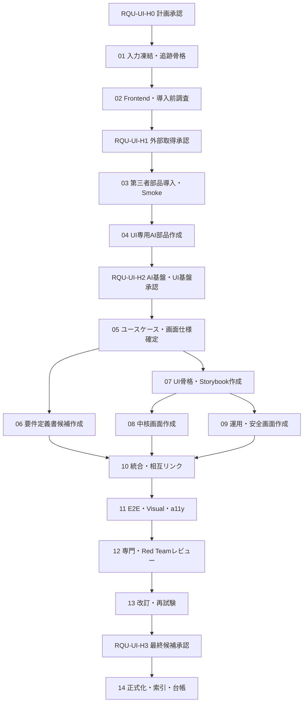

# 自動トレードシステム 要件定義書追加更新・UIモックHTML作成 実行計画書

## 0. 文書情報

| 項目 | 内容 |
|---|---|
| 文書ID | `RQU-UI-PLAN-001` |
| 版 | `v0.1` |
| 作成日 | 2026-08-11 |
| 状態 | `WAITING_RQU-UI-H3` |
| 計画対象 | 現行要件定義書へのユーザー機能・操作要件追加、UIモックHTML作成、両者の追跡・品質確認 |
| 現行正式要件 | `doc/requirements/01_自動トレードシステム要件定義書.html`（`AT-REQ-001`、v0.3） |
| 計画作成基盤 | `AutoTradePhasePlanning_Orchestrator_v0_1` |
| 計画担当Agent | `AutoTrade_A05_PhaseExecutionPlanner_v0_1` |
| 主Skill | `autotrade_skill_phase_execution_planning_v0_1` |
| 実行開始条件 | 運用者が `RQU-UI-H0`、`RQU-UI-H1`、`RQU-UI-H2`（いずれも2026-08-11）を承認済み |

## 1. 結論

本作業は、単なる要件書への章追加と静止画作成ではなく、次の4本を1つの変更セットとして実行する。

1. RQU-11〜RQU-19Aの回答を、運用者が「何ができ、どう操作するか」を理解できる正式要件へ変換する。
2. 全ユースケース、操作、状態、警告、停止、復旧、未承認表示を実際にクリックして確認できるUIモックHTMLを作る。
3. 要求ID、ユースケースID、画面ID、UI状態ID、PlaywrightテストIDを追跡表で一対一または一対多に結ぶ。
4. 初期工程で、選定済みの第三者UI部品とPlaywrightを導入し、UI作成専用のSkill、Agent、Orchestratorを新設・検証する。

正式成果物は、更新後の要件定義書HTMLとUIモックHTMLの2つを中心とし、どちらも `doc/index.html` から到達可能にする。Markdown、追跡表、テスト証跡、実行ログは `plan/requirements_update/` 配下で管理する。

## 2. この計画で達成する状態

運用者が正式要件定義書とUIモックを読む・操作するだけで、少なくとも次を理解できる状態を完了とする。

- このシステムの利用者は認証を必要としない単一の運用者本人であり、ユーザー管理機能を持たないこと。
- 先物、株式、FX、暗号資産を扱える構造と、初期候補 MCL / M6A / MZC / MZS / MZW の位置づけ。
- 日足、4時間足、1時間足、30分足、15分足の全時間足を対象にできること。
- 「銘柄 × 時間足 × 売買ルール」を1運用単位とし、異なる組合せを独立・同時運用できること。
- Turtle System 1 / System 2を初期戦略とし、戦略と時間足を自由に組み合わせられること。
- Backtest、Forward、Shadow、Paper、Live候補、Liveで何ができ、どう状態が移るか。
- 単一パラメータBacktestと、下限・上限・ステップを使う網羅検証の設定、実行、進捗、取消、比較、結果確認方法。
- 総損益、最大の落ち込み、取引回数、勝率、総残高を確認・比較・出力できること。
- 運用中の全インスタンスについて、最新データ時刻、Signal、Position、警告などを確認できること。
- Risk入力、Human Gate、自動承認、停止、復旧、照合、注文取消など、安全に関わる操作。
- 通常、読込中、データなし、未入力、警告、停止、失敗、復旧待ち、Human Gate待ち、未承認の見え方と次の操作。
- 実シンボル、契約条件、料金、Calendar版、Broker名、実運用Risk値など、後続Gateで決める項目と、それまで操作を止める境界。

## 3. 対象範囲

### 3.1 今回実施するもの

- `AT-REQ-001` v0.3を基礎にした要件定義書の追加更新。
- 編集用Markdownと正式HTMLの同期。
- ユースケース一覧、操作フロー、状態遷移、画面一覧、用語、後続Gateの追加。
- クリック可能なUIモックのソース、部品カタログ、テスト、静的HTML成果物の作成。
- PCとスマートフォン相当の表示確認。
- Storybook、Vitest、axe、Playwright、固定SeedのFakerを使うローカル品質確認。
- 標準Playwright CLIと `@playwright/test` による正式確認。
- AI向け `@playwright/cli` は、匿名ダミーデータだけを扱う探索補助として限定試行。
- 要件・UI・E2Eの追跡表、レビュー記録、実行ログ、統合台帳、`doc/index.html` の更新。

### 3.2 今回実施しないもの

- 実Broker、実市場データ提供元、実口座、Secretへの接続。
- 実注文、Paper注文、Live注文の送信。
- FastAPI、SQLite、Python Worker、SSE、LEANを含む本番機能実装。
- Cloud、VM、常時稼働サーバー、監視製品への移行。
- Vercel v0、Figma MCP、Chromaticの必須利用。
- 認証、ユーザー管理、ロール管理画面の作成。
- 後続Gate対象の実数値を推測で埋めること。

### 3.3 UIモックと本実装の境界

UIモックは、操作、状態、警告、画面遷移、表示項目を確認するための仕様書である。市場データ、残高、注文、損益、Run結果は固定Seedの架空データを使い、実Brokerや既存Python処理へ接続しない。ボタンは画面状態を変えるが、実注文や外部送信を行わない。

## 4. 正本・成果物・保存先

### 4.1 最終成果物

| 成果物ID | 成果物 | 保存先 | 正本区分 |
|---|---|---|---|
| `RQUUI-ART-REQ-HTML` | 更新後の自動トレードシステム要件定義書 | `doc/requirements/01_自動トレードシステム要件定義書.html` | 正式HTML正本 |
| `RQUUI-ART-REQ-MD` | 要件定義書の編集用Markdown | `plan/自動トレードシステム_要件定義書.md` | 編集用・HTMLと同期 |
| `RQUUI-ART-REQ-CANDIDATE-MD` | ユーザー機能・操作追加candidate Markdown | `plan/requirements_update/drafts/RQU-UI-06_自動トレードシステム要件定義書_candidate.md` | RQU-UI-06候補 |
| `RQUUI-ART-REQ-CANDIDATE-HTML` | ユーザー機能・操作追加candidate HTML | `plan/requirements_update/drafts/01_自動トレードシステム要件定義書_candidate.html` | RQU-UI-06候補。正式HTMLではない |
| `RQUUI-ART-UI-HTML` | クリック可能なUIモックHTML候補 | `doc/ui_mock/01_自動トレードシステム_UIモック.html` | RQU-UI-13 candidate-0.2。RQU-UI-H3後に正式化判定 |
| `RQUUI-ART-UI-ASSET` | UIモックのローカル資産 | `doc/ui_mock/assets/` | HTML付属・外部CDN禁止 |
| `RQUUI-ART-TRACE` | 要件・ユースケース・画面・状態・テスト追跡表 | `plan/requirements_update/RQU-UI_要件UIテスト追跡マトリクス_2026-08-11.md` | 追跡正本 |
| `RQUUI-ART-PREINSTALL` | Frontend・第三者部品の導入前調査記録 | `plan/requirements_update/RQU-UI_導入前調査記録_2026-08-11.md` | RQU-UI-H1承認資料 |
| `RQUUI-ART-UI03` | 第三者部品導入・Smoke記録 | `plan/requirements_update/RQU-UI-03_第三者部品導入Smoke記録_2026-08-11.md` | RQU-UI-03証跡 |
| `RQUUI-ART-UI04` | UI専用AI部品作成・AI基盤同期記録 | `plan/requirements_update/RQU-UI-04_AI部品作成・基盤同期記録_2026-08-11.md` | RQU-UI-04証跡・H2提示 |
| `RQUUI-ART-UI05` | ユースケース・画面・状態仕様記録 | `plan/requirements_update/RQU-UI-05_情報設計・画面状態仕様記録_2026-08-11.md` | RQU-UI-05共通仕様 |
| `RQUUI-ART-UI07` | UI骨格・Design System実装記録 | `plan/requirements_update/RQU-UI-07_UI骨格DesignSystem実装記録_2026-08-11.md` | RQU-UI-07証跡・Open Finding記録 |
| `RQUUI-ART-UI08` | 中核画面実装記録 | `plan/requirements_update/RQU-UI-08_中核画面実装記録_2026-08-11.md` | RQU-UI-08証跡・Open Finding記録 |
| `RQUUI-ART-UI09` | 運用・安全・接続画面実装記録 | `plan/requirements_update/RQU-UI-09_運用安全接続画面実装記録_2026-08-11.md` | RQU-UI-09証跡・Open Finding記録 |
| `RQUUI-ART-UI10` | 要件・UI文書セット統合記録 | `plan/requirements_update/RQU-UI-10_文書セット統合記録_2026-08-11.md` | RQU-UI-10静的UIモック、相互リンク、ID/Trace、外部境界監査 |
| `RQUUI-ART-UI11` | Playwright・Visual・a11y検証記録 | `plan/requirements_update/RQU-UI-11_Playwright-Visual-A11y検証記録_2026-08-11.md` | RQU-UI-11のE2E、PC/スマートフォン、axe、外部境界、固定Seed証跡 |
| `RQUUI-ART-UI12` | 専門Design・Red Teamレビュー記録 | `plan/requirements_update/RQU-UI-12_専門Design_RedTeamレビュー記録_2026-08-11.md` | Findings first、重大度、採否、Q-243分解、RQU-UI-13修正対象 |
| `RQUUI-ART-UI13` | 改訂統合・再試験・最終候補記録 | `plan/requirements_update/RQU-UI-13_改訂統合・再試験・最終候補記録_2026-08-11.md` | Findings採否、candidate同期、Playwright/Visual/a11y、Q-243、H3提示パッケージ |
| `RQUUI-ART-ACCEPT` | UI受入確認表 | `plan/requirements_update/RQU-UI_UIモック受入確認表_2026-08-11.md` | Gate判定正本 |
| `RQUUI-ART-LOG` | 実行ログ | `plan/requirements_update/RQU-UI_実行ログ_2026-08-11.md` | 実行記録 |
| `RQUUI-ART-EVIDENCE` | E2E、画面比較、a11y、Trace、スクリーンショット証跡 | `tests/evidence/requirements_ui/<run_id>/` | 機械Gate証跡 |

UIモックのReact＋TypeScriptソース、Storybook、テストのルートは `RQU-UI-02` の調査結果に基づき、RQU-UI-03で`ui/mock/`へ固定した。正式HTMLやroot packageとは分離する。

### 4.2 二重正本を防ぐ規則

- 正式な要件はHTMLを正本とし、Markdownは同じ版・更新日・要求IDを保つ。
- UI動作の正式な説明はUIモックHTML、網羅性の判定は追跡表、合否の証拠は受入確認表とE2E証跡を正本とする。
- StorybookやReactソースだけを正式文書扱いしない。
- 後続Gateの未確定値をダミー値で確定したように見せない。ダミー値には常に「例」「未接続」「未承認」を表示する。

## 5. 入力資料と優先順位

矛盾がある場合は、次の優先順位で扱い、黙って統合しない。

1. 本セッションの最新方針である `RQU-19` と `RQU-19A`。
2. `RQU-17A`、`RQU-18A` など、後の日付の回答記録。
3. `RQU-11` の全機能・UI追加項目一覧。
4. `RQU-12A`〜`RQU-16A` の回答記録。
5. 現行正式要件 `AT-REQ-001` v0.3。
6. Phase 1〜3の正式設計書と統合台帳。
7. 古い計画・古い回答は履歴として参照し、最新方針を上書きしない。

必須入力は次のとおり。

- `doc/requirements/01_自動トレードシステム要件定義書.html`
- `plan/自動トレードシステム_要件定義書.md`
- `plan/requirements_update/RQU-11_ユーザー機能・操作要件追加項目一覧_2026-08-10.md`
- `plan/requirements_update/RQU-12A_第1回ヒアリング回答記録_Q01-Q22C_2026-08-10.md`
- `plan/requirements_update/RQU-12B_第2回以降ヒアリング回答記録_Q23-Q86_2026-08-10.md`
- `plan/requirements_update/RQU-13A_追加ヒアリング回答記録_Q87-Q156_2026-08-11.md`
- `plan/requirements_update/RQU-14A_追加ヒアリング回答記録_Q157-Q199_2026-08-11.md`
- `plan/requirements_update/RQU-15A_最終未決定事項追加ヒアリング回答記録_Q200-Q226_2026-08-11.md`
- `plan/requirements_update/RQU-16A_残存事項最終確認回答記録_Q227-Q236_2026-08-11.md`
- `plan/requirements_update/RQU-17A_残存未決定事項追加ヒアリング回答記録_Q237-Q261_2026-08-11.md`
- `plan/requirements_update/RQU-18A_Phase3以降残存未決定事項回答記録_Q262-Q280_2026-08-11.md`
- `plan/requirements_update/RQU-19_Q277撤回_未決定事項時期分類と追加ヒアリング票_2026-08-11.md`
- `plan/requirements_update/RQU-19A_Q277撤回後追加ヒアリング回答記録_Q281-Q305_2026-08-11.md`
- `plan/requirements_update/UI作成用AI基盤調査.md`
- `plan/requirements_update/UI作成用AI基盤サードパーティ調査・選定書_2026-08-11.md`
- `doc/00_全Phase残課題Blocked統合台帳.html`
- `doc/index.html`
- `settings/ai_component_rules.md`

## 6. 要件とUIの情報設計

### 6.1 要件定義書へ追加する中心章

1. 利用者・利用環境・認証不要の前提。
2. 運用者ができることの全体一覧。
3. 初回準備から日常監視、異常停止、復旧までの利用シナリオ。
4. 取扱資産、初期候補、5時間足、戦略、運用単位、同時運用。
5. 市場データと銘柄状態の確認・管理。
6. Strategy設定と設定版。
7. Backtestの単一Runと網羅検証。
8. Backtest結果、比較、履歴、削除、再実行、CSV出力。
9. Forward、Shadow、Paper、Live候補、Liveの開始・確認・停止。
10. Portfolio、Account、Risk、注文、約定、Position。
11. Human Gate、Live自動承認、警告、停止、復旧、照合。
12. 監視、自動更新、手動更新、通知、ログ、操作記録、バックアップ。
13. 画面一覧と各画面から可能な操作。
14. 正常系・異常系・誤操作・データなし・未承認時の振る舞い。
15. UI・性能・安全・アクセシビリティ・E2Eの受入条件。
16. 今回確定する構造と、後続Gateで確定する実データ・外部接続・実数値。

### 6.2 UIモックの10ナビゲーショングループ、21必須画面、補助ビュー

RQU-19A Q-298の10項目を左ナビゲーションの大分類とし、RQU-11の21必須画面をその配下へ漏れなく配置する。網羅検証パラメータ、取扱資産・初期候補状態、Run履歴・削除・出力は、21必須画面の機能を分かりやすくする補助ビューとして追加する。

| ナビID | 大分類 | 配下の必須画面（RQU-11） | 補助ビュー |
|---|---|---|---|
| `NAV-01` | ホーム | システム状態・禁止事項、ホーム／全体ダッシュボード、警告・障害・通知 | なし |
| `NAV-02` | Backtest設定 | Backtest条件設定 | 単一Run設定タブ |
| `NAV-03` | 網羅検証設定 | Backtest実行一覧・進捗 | 網羅検証パラメータ、組合せ数・見積り・検査 |
| `NAV-04` | 結果・比較 | Backtest結果サマリー、チャート・取引・Signal詳細、Run比較 | なし |
| `NAV-05` | 運用単位 | 運用単位一覧、運用単位の作成・編集、Strategy一覧、Strategy設定 | なし |
| `NAV-06` | 銘柄・データ状態 | 市場データ・品質 | 取扱資産・初期候補・接続状態 |
| `NAV-07` | Risk・注文 | Portfolio・Account・Risk、注文・約定・Position | なし |
| `NAV-08` | 運用・昇格 | Forward／Shadowダッシュボード、Paper／Liveダッシュボード、Human Gate・移行確認 | なし |
| `NAV-09` | ログ・操作記録 | 監査ログ・証跡 | Run履歴・削除・出力 |
| `NAV-10` | 設定・接続 | 接続先・Secret・通知設定、ヘルプ・用語説明 | なし |

### 6.3 全画面共通の状態

各画面は、該当しない理由を記録した場合を除き、次の状態をモック・追跡表・E2E期待値で扱う。

- `UISTATE-NORMAL`: 通常。
- `UISTATE-LOADING`: 読込中。
- `UISTATE-EMPTY`: データなし。
- `UISTATE-REQUIRED`: 必須入力なし。
- `UISTATE-WARNING`: 警告。
- `UISTATE-STOPPED`: 安全停止。
- `UISTATE-FAILED`: 失敗。
- `UISTATE-RECOVERY`: 復旧・照合待ち。
- `UISTATE-HUMAN-GATE`: Human Gate待ち。
- `UISTATE-UNAPPROVED`: 未承認・未検証。

各状態には、理由、影響、実行できない操作、次に可能な操作、最終更新時刻を表示する。色だけで区別せず、文字とアイコンを併用する。

## 7. 使用するAI実行基盤

### 7.1 計画・統制

- Orchestrator: `AutoTradePhasePlanning_Orchestrator_v0_1`
- Agent: `AutoTrade_A05_PhaseExecutionPlanner_v0_1`
- Skill: `autotrade_skill_phase_execution_planning_v0_1`

### 7.2 AI部品の作成・更新

- Orchestrator: `AutoTradeComponentLifecycle_Orchestrator_v0_1`
- Agent: `AutoTrade_A06_AiComponentEngineer_v0_1`
- Skill: `autotrade_skill_ai_component_lifecycle_v0_1`

### 7.3 要件・正式HTML統合

- Orchestrator: `AutoTradeProject_DesignDocSet_Orchestrator_v0_1`
- Agents: `AutoTrade_A10_RequirementsCurator_v0_1`、`AutoTrade_A81_DesignDocSetWriter_v0_1`、`AutoTrade_A80_DocumentIntegrator_v0_1`、`AutoTrade_A90_DesignReviewer_v0_1`
- Skills: `autotrade_skill_source_reader_v0_1`、`autotrade_skill_traceability_v0_1`、`autotrade_skill_design_doc_set_writer_v0_1`、`autotrade_skill_html_doc_writer_v0_1`、`autotrade_skill_design_review_v0_1`、`autotrade_skill_red_team_review_v0_1`、`autotrade_skill_revision_integration_v0_1`

### 7.4 初期工程で新設するUI専用部品

次の部品は `RQU-UI-04` で初めて作成する。それ以前のStepで存在するものとして発火してはならない。

- Skill: `autotrade_skill_ui_mock_generation_v0_1`
- Skill: `autotrade_skill_ui_visual_validation_v0_1`
- Skill: `autotrade_skill_ui_accessibility_validation_v0_1`
- Agent: `AutoTrade_A170_UiMockEngineer_v0_1`
- Agent: `AutoTrade_A171_UiVisualQaReviewer_v0_1`
- Orchestrator: `AutoTradeProject_UiMock_Orchestrator_v0_1`

新設部品のモデルは、作成時に利用可能な正式モデルと既存AI部品規則を確認して固定する。推測で存在しないモデル名を設定しない。新設が未完了・不合格なら `RQU-UI-06` 以降を開始しない。

## 8. 第三者部品の導入方針

### 8.1 必須導入候補

- React＋TypeScriptのローカルFrontend基盤。
- shadcn/ui CLIとローカル／カスタムRegistry。
- Storybook。
- `@storybook/addon-vitest`。
- `@storybook/addon-a11y` と axe。
- `@playwright/test`、標準 `npx playwright` CLI、`toHaveScreenshot`。
- Faker.js。Seed、基準日時、版を固定する。

### 8.2 限定利用

- Microsoft `@playwright/cli` / `playwright-cli`: 匿名モックの探索だけに使う。正式合否は固定された `@playwright/test` で判定する。
- Vercel v0: デザイン案比較だけに限定し、Human Gateで外部送信、費用、入力内容を承認した場合のみ使う。計画のクリティカルパスには含めない。

### 8.3 保留

- Figma MCP、Chromatic、Playwright MCPは今回の完了条件にしない。

### 8.4 導入時の禁止事項

- Human Gate前のパッケージ取得、ブラウザ取得、外部アカウント作成、費用発生、外部サービスへの画面・要件送信。
- floating versionのまま正式証跡を残すこと。
- CDN依存を正式HTMLに残すこと。
- Secret、実口座、実注文、個人情報、非匿名ログを第三者AIや探索CLIへ渡すこと。
- AI向けCLIの探索結果だけで合格にすること。

## 9. 実行DAGと並列条件



- `RQU-UI-06` と `RQU-UI-07` は、共通仕様 `RQU-UI-05` 完了後に並行可能。
- `RQU-UI-08` と `RQU-UI-09` は、画面・ファイル所有範囲を分け、共通ナビゲーションを `RQU-UI-07` で固定した場合だけ並行可能。
- 同一ファイルを同時編集しない。要件HTML、UI共通骨格、`doc/index.html`、統合台帳の編集は統合Stepだけが所有する。
- Human Gateを越えて先行しない。承認待ちはBlockedではなく `WAITING_HUMAN_GATE` として記録する。

## 10. Human Gate

| Gate | 承認対象 | 承認前に提示する証拠 | 承認後に許可されること | 未承認時 |
|---|---|---|---|---|
| `RQU-UI-H0` | 本実行計画 | 範囲、DAG、成果物、停止条件、直接実行プロンプト | `RQU-UI-01`開始 | 計画のみ保存して停止 |
| `RQU-UI-H1` | Nodeパッケージ・ブラウザ等の外部取得 | 導入先、package manager、固定版、lockfile、ライセンス、取得物、概算容量、rollback | 必須第三者部品のインストールとSmoke | 外部取得せず停止 |
| `RQU-UI-H2` | 新設AI部品とUI基盤 | 再利用判定、作成部品、Base UI/Radix比較、Smoke、AI基盤仕様更新、残リスク | UI・要件本体の作成 | 候補だけ残して停止 |
| `RQU-UI-H3` | 要件・UI最終候補 | 差分、21画面、10状態、PC/スマホ画像、追跡表、E2E/Visual/a11y、レビュー採否、Q-243対応 | 正式版へ昇格 | candidateのまま停止 |

Vercel v0を使う場合は `RQU-UI-H1-V0` を別に登録し、外部送信内容、保存範囲、費用、アカウントを承認する。承認がなくても本計画は完遂できる。

## 11. 品質Gate

### 11.1 機械Gate

- JSON、Markdown、HTML、リンク、重複ID、文字化けを検査する。
- UIビルド、Storybook、component test、Vitest、axe、Playwright E2Eを固定コマンドで再実行できる。
- PC幅とスマートフォン幅で主要画面のスクリーンショット比較を行う。
- Playwright TraceとHTMLレポートを失敗時に保存する。
- ダミーデータは同じSeed、基準日時、版で再現する。
- CriticalまたはHighの不合格が1件でもあれば全体を不合格にする。カバレッジ80%は目安であり、安全上の失敗を相殺しない。

### 11.2 内容Gate

- RQU-11の全ユースケースが「できること」「開始条件」「操作」「結果」「異常時」「対応画面」を持つ。
- 21必須画面と10共通状態の対応漏れがない。
- 日足、4時間足、1時間足、30分足、15分足を明記する。
- 単一Backtestと網羅検証の画面・結果を混同しない。
- 全運用インスタンスの状態表示、手動更新、自動更新スイッチ、自動更新間隔を示す。
- Human Gateと認証を混同しない。
- Live自動承認の有効化、記録、再起動後OFF、安全警告を示す。
- 未入力Riskは開始不可だが、値の妥当性検査はしないという決定を正確に表す。
- 同一条件Runを許可し、最新結果表示と内部記録の扱いを説明する。
- 削除、通常一覧から隠す、復旧、取消、停止後の照合を画面で確認できる。

### 11.3 Human Gateと機械Gateの分離

Playwrightが通っても、運用者が画面の意味・操作感・安全表示を承認したことにはならない。逆に運用者が見た目を承認しても、Critical/Highの機械Gate不合格をPassへ変更しない。

## 12. 共通Runbookパラメータ

後続Stepの直接実行プロンプトは、少なくとも次を埋めて実行する。

| パラメータ | 値 |
|---|---|
| `phase_id` | `REQUIREMENTS_UI_UPDATE_2026_08_11` |
| `plan_id` | `RQU-UI-PLAN-001` |
| `output_root` | `doc/requirements/` と `doc/ui_mock/` |
| `log_root` | `plan/requirements_update/` |
| `evidence_root` | `tests/evidence/requirements_ui/<run_id>/` |
| `document_set_id` | `AT-REQ-UI-SET-001` |
| `detail_boundary` | 要件とクリック可能UI仕様まで。本番機能・実外部接続・実注文は対象外 |
| `human_gate_policy` | `RQU-UI-H0`〜`H3`。未承認時は停止し、統合台帳へ状態を記録 |
| `unknown_policy` | UnknownをPassにしない。決定期限、開始条件、停止条件、証拠先を付ける |
| `secret_policy` | Secret・実口座・実注文・個人情報を入力・表示・証跡化しない |

## 13. Step別の直接実行プロンプト

### RQU-UI-01 入力凍結・要件追跡骨格の作成

**目的:** 305問までの回答、現行要件、Phase成果物を再解釈可能な入力セットへ変換し、採用・履歴・後続Gateを分ける。

**依存:** `RQU-UI-H0` 承認済み。  
**出力:** 入力一覧、決定事項一覧、競合一覧、追跡マトリクス初版、実行ログ初版。  
**停止:** 入力欠落、最新回答の優先順位不明、Q-277撤回を旧方針で上書きする必要がある場合。

```text
あなたは自動トレードシステムの要件整理担当です。

Step ID: RQU-UI-01
Phase ID: REQUIREMENTS_UI_UPDATE_2026_08_11
Orchestrator: AutoTradeProject_DesignDocSet_Orchestrator_v0_1
Agents: AutoTrade_A10_RequirementsCurator_v0_1、AutoTrade_A90_DesignReviewer_v0_1
Model: Orchestrator=gpt-5.6-terra。各Agentは実体JSONに固定されたmodelを使う。利用不能なら代替せず停止する。
Skills: autotrade_skill_source_reader_v0_1、autotrade_skill_traceability_v0_1、autotrade_skill_design_review_v0_1
発火制御: RQU-UI-H0の承認記録が統合台帳にある場合だけ開始する。編集対象はplan/requirements_update/の追跡表と実行ログに限定する。

入力:
- RQU-UI-PLAN-001の「5. 入力資料と優先順位」にある全ファイル
- doc/00_全Phase残課題Blocked統合台帳.html
- Phase 1〜3の正式HTMLのうち、要件からリンクされた成果物

実施:
1. 全入力の存在、版、日付、状態を一覧化する。
2. Q-01〜Q-305の回答を、確定方針、補足、撤回済み履歴、後続Gate、矛盾候補に分類する。
3. RQU-11の全ユースケースへUC-IDを付け、要求ID、回答Q、画面候補、状態候補、テスト候補の列を持つ追跡表を作る。
4. Q-277撤回とRQU-19/RQU-19Aの優先を明記する。
5. Q-243の安全境界、初期候補、実行可能性、性能基準を、今回閉じる確認と後続実証に分解する。
6. 推測で値を埋めず、Unknownには決定時期、開始条件、停止条件、証拠先を付ける。
7. 変更内容と未解決点を実行ログへ残す。

レビュー:
- Findings firstで、回答の取りこぼし、撤回済み方針の混入、同じ概念の別名、要件とPhase設計の衝突を確認する。
- RQU-11の全ユースケースが少なくとも1行の追跡先を持つことを確認する。

完了条件:
- 入力欠落0件、ID重複0件。
- 確定・履歴・後続Gateの三分類が全項目で明示される。
- RQU-UI_要件UIテスト追跡マトリクス_2026-08-11.mdとRQU-UI_実行ログ_2026-08-11.mdが作成される。
- UnknownをPassにしていない。
```

### RQU-UI-02 Frontend・第三者部品の導入前調査

**目的:** 既存Frontend、Node、package manager、lockfile、導入先、版、ライセンス、容量、rollbackを読み取り専用で確定する。  
**依存:** `RQU-UI-01` 完了。  
**出力:** 導入前調査記録、固定版候補、`RQU-UI-H1` 承認資料。  
**停止:** 既存の未コミット変更と導入対象が衝突する、Secretらしいファイル、package managerの正本不明、ライセンス不明。

```text
あなたはローカルFrontend・UI品質基盤の導入調査担当です。変更やインストールは行わないでください。

Step ID: RQU-UI-02
Orchestrator: AutoTradeComponentLifecycle_Orchestrator_v0_1
Agents: AutoTrade_A06_AiComponentEngineer_v0_1、AutoTrade_A90_DesignReviewer_v0_1
Model: Orchestrator=gpt-5.6-terra。各Agentは実体JSONに固定されたmodelを使う。
Skills: autotrade_skill_ai_component_lifecycle_v0_1、autotrade_skill_source_reader_v0_1、autotrade_skill_traceability_v0_1、autotrade_skill_design_review_v0_1
発火制御: RQU-UI-01完了後。read-only。外部取得、package.json変更、ブラウザ取得、アカウント作成は禁止。

入力:
- UI作成用AI基盤サードパーティ調査・選定書_2026-08-11.md
- package.json、全lockfile、既存Frontend候補、Node/package manager設定
- .codex/、settings/ai_component_rules.md、AGENTS.md
- git statusと既存変更

実施:
1. rg --filesを使いFrontend、React、Vite、Storybook、Playwright、Vitest、axe、shadcnの既存有無を確認する。
2. Node版、package manager、lockfile、現在の依存関係、既存scriptsを記録する。
3. 既存Frontendを再利用する案と、新規ui/mock/を作る案を比較し、正本候補を1つ推奨する。
4. shadcn/uiのBase UIとRadixの候補を小規模pilotの観点で比較する。まだ導入しない。
5. 必須パッケージ、開発専用区分、固定版候補、ブラウザ、概算容量、ライセンス、rollbackを表にする。
6. 標準PlaywrightとAI向けCLIの責務境界、Storage/Secret禁止、正式合否の入口を明記する。
7. RQU-UI-H1で運用者が判断できる承認資料を実行ログへ追記する。

レビュー:
- ユーザー所有の未コミット変更を上書きしない計画か。
- 外部取得物と外部送信を混同していないか。
- Vercel v0等の任意サービスがクリティカルパスへ入っていないか。

完了条件:
- UI-AI-UNK-01、02、07、08について、決定候補と証拠が提示される。
- 変更0件、外部取得0件。
- RQU-UI-H1の対象、コマンド候補、rollback、停止条件が明示される。
```

### RQU-UI-03 第三者UI・品質部品の導入とSmoke test

**目的:** 承認済みの固定版だけを導入し、最小画面でローカル動作を確認する。  
**依存:** `RQU-UI-H1` 承認済み。  
**出力:** Frontend基盤、lockfile、最小Storybook、最小E2E、導入証跡。  
**停止:** 承認範囲外の取得、版解決差異、ライセンス問題、既存構成破壊、ブラウザ導入失敗。

```text
あなたは承認済みUI開発依存関係の導入担当です。

Step ID: RQU-UI-03
Orchestrator: AutoTradeComponentLifecycle_Orchestrator_v0_1
Agents: AutoTrade_A06_AiComponentEngineer_v0_1、AutoTrade_A90_DesignReviewer_v0_1
Model: Orchestrator=gpt-5.6-terra。各Agentは実体JSONに固定されたmodelを使う。
Skills: autotrade_skill_ai_component_lifecycle_v0_1、autotrade_skill_test_strategy_v0_1、autotrade_skill_design_review_v0_1
発火制御: 統合台帳でRQU-UI-H1が承認済みで、承認資料の版・導入先・package managerと一致するときだけ開始する。

入力:
- RQU-UI-02の導入前調査記録
- RQU-UI-H1の承認範囲
- 現在のpackage.json、lockfile、git status

実施:
1. 承認されたFrontend正本にReact＋TypeScript基盤を作成または補完する。
2. 承認された固定版のshadcn/ui、Storybook、addon-vitest、addon-a11y、Vitest、axe、@playwright/test、Fakerをdev依存中心で導入する。
3. Chromium等は承認されたブラウザだけを取得する。
4. Base UI/Radix候補の最小Button、Dialog、Table、Formをpilotし、キーボード、focus、a11y、生成差分を比較する。
5. 固定Seed・固定日時の匿名ダミーデータを1件作る。
6. Storybook起動、component test、axe、Playwright起動、1画面のscreenshotをSmoke testする。
7. AI向け@playwright/cliは承認対象なら匿名画面だけで起動確認し、正式合否には使わない。
8. インストールコマンド、版、hash/lockfile、結果、rollback方法を証跡へ保存する。

レビュー:
- 本番依存と開発依存の分類、外部CDNなし、Secretなし、floating versionなしを確認する。
- 既存Python実装や正式HTMLへ不要な変更がないことを確認する。

完了条件:
- lockfileで版が固定され、再インストール可能。
- Storybook、Vitest/axe、Playwrightの最小Smokeが成功。
- 失敗時の証跡とrollbackが残る。
- Critical/Highの不具合0件。残る不具合はRQU-UI-H2へ提示する。
```

### RQU-UI-04 UI専用AI部品の作成・既存AI基盤の同期

**目的:** 選定書で定義した3 Skill、2 Agent、1 Orchestratorを、既存再利用調査後に必要最小限で作成する。  
**依存:** `RQU-UI-03` Smoke成功。  
**出力:** 新規AI部品、AI foundation HTML更新、索引、検証記録。  
**停止:** 名前衝突、既存部品で十分、新設部品の責務重複、モデル利用不能、仕様書同期不能。

```text
あなたは本プロジェクトのAI部品ライフサイクル担当です。

Step ID: RQU-UI-04
Orchestrator: AutoTradeComponentLifecycle_Orchestrator_v0_1
Agents: AutoTrade_A06_AiComponentEngineer_v0_1、AutoTrade_A10_RequirementsCurator_v0_1、AutoTrade_A80_DocumentIntegrator_v0_1、AutoTrade_A90_DesignReviewer_v0_1
Model: Orchestrator=gpt-5.6-terra。既存Agentは実体JSONのmodel。新規部品は実行環境で利用可能な正式モデルを確認して固定する。
Skills: autotrade_skill_ai_component_lifecycle_v0_1、autotrade_skill_source_reader_v0_1、autotrade_skill_traceability_v0_1、autotrade_skill_html_doc_writer_v0_1、autotrade_skill_design_review_v0_1、autotrade_skill_revision_integration_v0_1
発火制御: RQU-UI-03の全Smoke成功後だけ開始する。default_orchestratorを変更しない。

入力:
- RQU-UI-03の導入結果・Smoke証跡
- UI作成用AI基盤サードパーティ調査・選定書_2026-08-11.md
- .codex/skills、.codex/agents、.codex/orchestrators、settings/ai_component_rules.md
- doc/ai_foundation/03〜08、doc/index.html、AGENTS.md、README.md

作成候補:
- autotrade_skill_ui_mock_generation_v0_1
- autotrade_skill_ui_visual_validation_v0_1
- autotrade_skill_ui_accessibility_validation_v0_1
- AutoTrade_A170_UiMockEngineer_v0_1
- AutoTrade_A171_UiVisualQaReviewer_v0_1
- AutoTradeProject_UiMock_Orchestrator_v0_1

実施:
1. .codex/skills、.codex/agents、.codex/orchestratorsを全件調査し、再利用・合成・新設の判定を記録する。
2. 既存名があれば上書きせず、作成か明示更新かを判定する。
3. UI生成、要件・画面ID追跡、固定ダミーデータ、Storybook、E2E、Visual、a11y、PC/スマホ確認、外部I/O禁止を責務に含める。
4. 生成担当A170と独立品質担当A171を分離する。
5. OrchestratorにHuman Gate、Critical/High停止、正式Playwrightと探索CLIの境界を持たせる。
6. doc/ai_foundation/03〜08、必要なAI部品仕様、doc/index.html、必要時のみAGENTS.md/README.mdを同期する。
7. JSON、名前、参照、リンク、発火例、停止条件を検証する。
8. A90で過剰作成、責務重複、Secret、安全停止、UnknownのPass化をレビューし、採否を記録する。

レビュー:
- 新規部品を作らず既存部品の合成で満たせる責務がないか、作成後にもう一度確認する。
- 新設実体、AI foundation仕様、相関図、発火制御、索引の完全名が一致することを確認する。

完了条件:
- 作成判定された全実体が存在し、JSON/Markdown/リンク検査に合格。
- 仕様書03〜08とdoc/index.htmlが実体と一致。
- 新規OrchestratorからA170/A171と3 Skillへ到達可能。
- UI-AI-UNK-06が解決または理由付き保留。
- RQU-UI-H2向けに再利用判定、差分、検証、残リスクを提示できる。
```

### RQU-UI-05 ユースケース・画面・状態・受入仕様の確定

**目的:** 要件本文とUI実装が並行しても矛盾しない共通仕様を固定する。  
**依存:** `RQU-UI-H2` 承認済み。  
**出力:** 追跡表更新、画面カタログ、操作フロー、状態表、受入確認表初版。  
**停止:** 21画面、10状態、全ユースケースの対応漏れ、後続Gateの誤確定。

```text
あなたは要件とUI仕様の情報設計担当です。

Step ID: RQU-UI-05
Orchestrator: AutoTradeProject_DesignDocSet_Orchestrator_v0_1
Agents: AutoTrade_A10_RequirementsCurator_v0_1、AutoTrade_A81_DesignDocSetWriter_v0_1、AutoTrade_A90_DesignReviewer_v0_1
Model: Orchestrator=gpt-5.6-terra。各Agentは実体JSONのmodel。
Skills: autotrade_skill_source_reader_v0_1、autotrade_skill_traceability_v0_1、autotrade_skill_design_doc_set_writer_v0_1、autotrade_skill_design_review_v0_1、autotrade_skill_red_team_review_v0_1
発火制御: RQU-UI-H2承認後。要件正式HTMLとUI本体はまだ編集しない。

入力:
- RQU-UI-01追跡表
- 本計画6章の情報設計
- RQU-11〜RQU-19A
- RQU-UI-03/04のUI・AI基盤決定

実施:
1. 全ユースケースへ目的、開始条件、事前確認、手順、結果、例外、取消、停止、復旧、保存、対応画面を定義する。
2. 21画面へSCREEN-IDを付け、10ナビゲーショングループへ配置する。
3. 各画面について、表示、入力、Button、Dialog、遷移、正常・異常状態、PC/スマホ差、要求ID、E2E-IDを定義する。
4. Backtest単一Runと網羅検証の設定・進捗・結果を別仕様にする。
5. Backtest、Forward、Shadow、Paper、Live候補、Liveの状態遷移とHuman Gateを図・表で定義する。
6. 危険操作、Live自動承認、Kill Switch、停止後照合、削除、再実行の確認Dialogと記録項目を定義する。
7. Q-243の4項目を今回の文書・UI確認と後続実証Gateへ割り当てる。
8. 受入確認表をCritical/High/Medium/Lowで作り、Critical/High失敗時の全体停止を定義する。

レビュー:
- 画面にない操作、操作結果のないButton、要件にない危険操作、理由のないdisabled状態を検出する。
- 色だけに依存する状態、スマホで到達不能な操作、認証とHuman Gateの混同を検出する。

完了条件:
- 全UC-ID→REQ-ID→SCREEN-ID→UISTATE-ID→E2E-IDが追跡可能。
- 21画面と10状態の未判定セル0件。非該当は理由付き。
- 受入確認表の全項目に重要度、期待値、証拠種別がある。
```

### RQU-UI-06 要件定義書候補の追加更新

**目的:** 運用者が全機能と使い方を読んで理解できる要件定義書candidateを作る。  
**依存:** `RQU-UI-05` 完了。`RQU-UI-07` と並行可能。  
**所有:** `plan/自動トレードシステム_要件定義書.md` と要件candidate。`doc/index.html`は編集しない。  
**停止:** 既存正式要件の安全要件を弱める、後続Gate値を推測する、既存IDを別意味で再利用する。

```text
あなたはユーザー視点の要件定義書編集担当です。

Step ID: RQU-UI-06
Orchestrator: AutoTradeProject_DesignDocSet_Orchestrator_v0_1
Agents: AutoTrade_A10_RequirementsCurator_v0_1、AutoTrade_A81_DesignDocSetWriter_v0_1、AutoTrade_A80_DocumentIntegrator_v0_1
Model: Orchestrator=gpt-5.6-terra。各Agentは実体JSONのmodel。
Skills: autotrade_skill_source_reader_v0_1、autotrade_skill_traceability_v0_1、autotrade_skill_design_doc_set_writer_v0_1、autotrade_skill_html_doc_writer_v0_1、autotrade_skill_revision_integration_v0_1
発火制御: RQU-UI-05完了後。正式版へ昇格せずcandidateとして作る。doc/index.htmlと統合台帳は編集しない。

入力:
- AT-REQ-001 v0.3 HTMLと編集用Markdown
- RQU-UI-05の共通仕様と追跡表
- RQU-11〜RQU-19A

実施:
1. 既存C4説明を壊さず、その前後に「できること」「どう使うか」を最短経路で読める章と導線を追加する。
2. 本計画6.1の全章を、専門用語を説明しながら日本語で記載する。
3. 初回準備、Backtest、網羅検証、Forward/Shadow、Paper、Live候補/Live、日常監視、警告、停止、復旧の使用シナリオを番号付き手順で示す。
4. 5時間足、4資産種類、初期候補5件、戦略×時間足、運用単位、同時運用の具体例を示す。
5. 全入力欄、Button、確認、結果、保存、履歴、削除、再実行、CSV出力をユースケース観点で説明する。
6. 認証不要とHuman Gateの違い、Live自動承認の安全条件を明記する。
7. 後続Gateは未確定のまま、決定期限、開始禁止条件、証拠先を示す。
8. UIモックの予定SCREEN-IDを各機能章へ付け、candidateリンクを準備する。
9. Markdownとcandidate HTMLの版、日付、ID、変更履歴を同期する。

レビュー:
- 「何ができるか」「どこを操作するか」「何が起こるか」「失敗時どうするか」の4点が全機能にあるか確認する。
- RQU-11の機能が落ちていないか追跡表で確認する。

完了条件:
- 要件candidateが単体で読める。
- 全UC-IDが本文または明示的な後続Gateへ対応する。
- UIモック未完成リンクはcandidate状態と明記される。
- v0.3の正式状態はRQU-UI-H3前に上書きしない。
```

### RQU-UI-07 UI骨格・Design System・Storybookの作成

**目的:** 全画面が共有するナビゲーション、状態、表示規則、ダミーデータ、部品を先に固定する。  
**依存:** `RQU-UI-05` 完了。`RQU-UI-06` と並行可能。  
**所有:** Frontend共通骨格・UI部品・Storybook。  
**停止:** 外部CDN、実接続、固定Seedなし、スマホ導線なし、a11y Critical/High。

```text
あなたは自動トレードシステムUIモックの基盤実装担当です。

Step ID: RQU-UI-07
Orchestrator: AutoTradeProject_UiMock_Orchestrator_v0_1
Agents: AutoTrade_A170_UiMockEngineer_v0_1、AutoTrade_A171_UiVisualQaReviewer_v0_1
Model: RQU-UI-04で各新規部品に固定・検証されたmodelを使用する。未固定なら停止する。
Skills: autotrade_skill_ui_mock_generation_v0_1、autotrade_skill_ui_visual_validation_v0_1、autotrade_skill_ui_accessibility_validation_v0_1、autotrade_skill_traceability_v0_1
発火制御: 新規部品の実体・仕様・検証が完了し、RQU-UI-H2承認済みの場合だけ開始する。

入力:
- RQU-UI-05の画面カタログ、状態表、受入確認表
- RQU-UI-03で承認されたFrontend構成とUI部品

実施:
1. 左ナビゲーション10分類、PCヘッダー、スマホメニュー、パンくず、画面タイトル、更新状態を実装する。
2. 状態Badge、Alert、Dialog、Form、Table、Tabs、Progress、Empty、Loading、Error、Helpの共通部品を作る。
3. Backtest/Forward/Shadow/Paper/Live候補/Live、未検証/検証済み、未承認/承認済みを色・文字・アイコンで区別する。
4. 手動更新Button、自動更新Switch、自動更新間隔[s]入力、最終更新時刻を共通化する。
5. 固定Seed・固定日時・匿名データで、5銘柄、5時間足、複数運用単位、警告、結果を生成する。
6. 全共通部品にStoryと主要状態を作り、keyboard/focus/axeを確認する。
7. Route、SCREEN-ID、data-testid、E2E-ID命名を固定する。
8. PCとスマホでナビゲーションSmokeを実行する。

レビュー:
- 取引モードの取り違え、危険Buttonの通常Button化、色だけの状態表現、focus欠落を確認する。
- 共通部品に画面固有の業務判断を埋め込まない。

完了条件:
- 10ナビゲーションへPC/スマホから到達可能。
- 共通部品のStory、状態、a11y結果が揃う。
- 固定ダミーデータが再現可能。
- RQU-UI-08/09が同じ規約で独立実装できる。
```

### RQU-UI-08 中核画面の作成

**目的:** ホーム、Backtest、網羅検証、結果、運用単位の主要利用シナリオをクリック可能にする。  
**依存:** `RQU-UI-07` 完了。`RQU-UI-09` と所有分離して並行可能。  
**所有:** `NAV-01` のホーム、`NAV-02`〜`NAV-05`。  
**停止:** 要件・共通部品の無断変更、単一Runと網羅検証の混同、重複運用単位の扱い漏れ。

```text
あなたはBacktestと運用単位を担当するUIモック実装者です。

Step ID: RQU-UI-08
Orchestrator: AutoTradeProject_UiMock_Orchestrator_v0_1
Agents: AutoTrade_A170_UiMockEngineer_v0_1、AutoTrade_A171_UiVisualQaReviewer_v0_1
Model: RQU-UI-04で固定されたmodel。
Skills: autotrade_skill_ui_mock_generation_v0_1、autotrade_skill_ui_visual_validation_v0_1、autotrade_skill_ui_accessibility_validation_v0_1、autotrade_skill_traceability_v0_1
発火制御: RQU-UI-07完了後。NAV-06〜10と共通骨格を編集しない。

入力:
- RQU-UI-05の担当画面仕様・受入項目・追跡表
- RQU-UI-07の共通部品、route、固定ダミーデータ、命名規約
- RQU-11〜RQU-19AのBacktest・運用単位関連決定

実施:
1. ホームに全運用単位、最新データ時刻、Signal、Position、警告、最新Backtest、総残高を表示する。
2. Backtest条件画面に銘柄、時間足、戦略、期間、Risk、コスト等の設定・設定ファイル読込を配置する。
3. 網羅検証画面に各パラメータの下限、上限、ステップ、組合せ数、見積時間、上限警告、開始確認を実装する。
4. 実行一覧に待ち行列、進捗、経過・残り見積、成功・一部失敗・失敗、取消、再実行を実装する。
5. 単一Run結果に総損益、最大の落ち込み、取引回数、勝率、総残高、資産曲線、取引・Signal詳細を実装する。
6. 網羅検証結果に全パラメータ組合せと5指標の表、検索、絞込、並替、比較、CSV非同期出力を実装する。
7. 同一条件Runを許可し、最新表示と内部記録の説明、削除・通常一覧から隠す導線を実装する。
8. 運用単位一覧・作成編集で銘柄×時間足×売買ルール、独立状態、重複組合せの開始不可を表す。
9. 主要正常・異常状態をStoryとPlaywright候補へ追加する。

レビュー:
- A171が担当画面を要件・Visual・a11y・PC/スマホの観点で独立確認する。
- Buttonごとに結果、取消、失敗、disabled理由があることを確認する。

完了条件:
- NAV-01〜05の担当画面がクリックで一連操作できる。
- Backtest単一Runと網羅検証で表示が明確に異なる。
- RQU-UI-05の担当受入項目に証拠候補が付く。
- a11y Critical/High 0件。
```

### RQU-UI-09 運用・安全・接続画面の作成

**目的:** データ、Risk、注文、Forward/Paper/Live、Human Gate、ログ、設定の操作と安全状態をクリック可能にする。  
**依存:** `RQU-UI-07` 完了。`RQU-UI-08` と所有分離して並行可能。  
**所有:** `NAV-01` の警告・障害、`NAV-06`〜`NAV-10`。  
**停止:** 実外部接続、実注文、Secret表示、Human Gate回避、安全停止の弱体化。

```text
あなたは運用監視と取引安全を担当するUIモック実装者です。

Step ID: RQU-UI-09
Orchestrator: AutoTradeProject_UiMock_Orchestrator_v0_1
Agents: AutoTrade_A170_UiMockEngineer_v0_1、AutoTrade_A171_UiVisualQaReviewer_v0_1
Model: RQU-UI-04で固定されたmodel。
Skills: autotrade_skill_ui_mock_generation_v0_1、autotrade_skill_ui_visual_validation_v0_1、autotrade_skill_ui_accessibility_validation_v0_1、autotrade_skill_traceability_v0_1、autotrade_skill_red_team_review_v0_1
発火制御: RQU-UI-07完了後。NAV-02〜05と共通骨格を編集しない。外部I/Oは常に禁止。

入力:
- RQU-UI-05の担当画面仕様・状態遷移・受入項目・追跡表
- RQU-UI-07の共通部品、route、固定ダミーデータ、命名規約
- RQU-11〜RQU-19AのRisk、Human Gate、停止・復旧、接続関連決定

実施:
1. 4資産種類、初期5候補、システム対応、データ検証、Paper承認、Live承認、接続状態を別表示にする。
2. 市場データ品質、欠落、最終時刻、再取得、再処理、Calendar/roll版の未確定状態を実装する。
3. Portfolio、Account、Risk、注文、約定、Position画面を匿名データで実装する。
4. Risk未入力時は開始不可とし、値の範囲・整合性を検査しない決定を説明する。
5. Forward/Shadow、Paper、Live候補、Liveのダッシュボードと状態遷移を実装する。
6. Human Gateの確認・取消モード、自動承認モード、警告、対象、設定版、Risk、時刻、端末、操作記録を実装する。再起動後は自動承認OFFを示す。
7. 新規注文停止、Kill Switch、接続断、Broker差異、復旧待ち、照合、手動再開の操作を実装する。
8. ログ、操作記録、Run履歴、通常一覧から隠す、削除、バックアップ状態を実装する。
9. 接続・通知設定では秘密値を表示せず、未設定・保存場所・接続未承認だけを示す。
10. ヘルプと用語説明から各画面へ戻れるようにする。

レビュー:
- 誤操作でLiveや実注文に見える状態へ移れないこと。
- 認証不要が安全確認不要に見えないこと。
- スマホでKill Switch、警告確認、状態確認へ到達できること。

完了条件:
- NAV-06〜10と警告画面がクリック可能。
- 安全停止・復旧・Human Gate・未承認が要件どおり表現される。
- Secret/実口座/実注文/外部通信0件。
- Red Team Critical/High 0件。
```

### RQU-UI-10 要件・UI統合、相互リンク、静的HTML生成

**目的:** 並行成果物を1つの文書セットへ統合し、正式候補HTMLをローカルで閲覧可能にする。  
**依存:** `RQU-UI-06`、`08`、`09` 完了。  
**所有:** UI共通統合、要件candidate、`doc/ui_mock/` candidate。`doc/index.html`はまだ正式リンクへ変更しない。  
**停止:** merge conflict、外部CDN、リンク孤立、画面ID不一致、ビルドにネットワークが必要。

```text
あなたは要件とUIモックの文書セット統合担当です。

Step ID: RQU-UI-10
Orchestrator: AutoTradeProject_DesignDocSet_Orchestrator_v0_1
Agents: AutoTrade_A81_DesignDocSetWriter_v0_1、AutoTrade_A80_DocumentIntegrator_v0_1、AutoTrade_A170_UiMockEngineer_v0_1
Model: Orchestrator=gpt-5.6-terra。各Agentは実体JSONまたはRQU-UI-04で固定されたmodel。
Skills: autotrade_skill_design_doc_set_writer_v0_1、autotrade_skill_html_doc_writer_v0_1、autotrade_skill_traceability_v0_1、autotrade_skill_ui_mock_generation_v0_1、autotrade_skill_revision_integration_v0_1
発火制御: RQU-UI-06/08/09の完了記録と所有範囲遵守を確認後に開始する。

入力:
- RQU-UI-06の要件Markdown・HTML candidate
- RQU-UI-07〜09のUIソース、Story、担当試験結果
- RQU-UI-05の追跡表・画面カタログ・受入確認表

実施:
1. 共通ナビゲーションへ全21画面を統合し、重複route、SCREEN-ID、data-testidを解消する。
2. UIをローカル静的資産としてbuildし、doc/ui_mock/01_自動トレードシステム_UIモック.htmlから開始できる形にする。
3. 外部CDN、オンラインfont、実API呼出しを除去する。
4. 要件candidate各機能から対応SCREEN-IDへ、UI各画面から対応REQ/UC-IDへ相互リンクまたは追跡導線を作る。
5. UIモックに文書ID、版、状態、入力資料、ダミーデータ注意、対象外、Unknown、変更履歴、関連リンクを付ける。
6. 追跡表を実装済みrouteと照合し、未実装・未リンク・孤立画面を列挙する。
7. PC/スマホで全ナビゲーションをSmokeする。

レビュー:
- 統合後にA81が文書メタ情報・相互リンク・Unknownを、A170がroute・状態・静的buildを確認する。
- 並行作業で共通部品や要求IDが上書きされていないか差分を確認する。

完了条件:
- 要件candidateとUI candidateが相互に追跡可能。
- 21画面すべてがUI内と追跡表から到達可能。
- オフライン相当で静的HTMLが表示でき、外部通信0件。
- 孤立リンク、重複ID、未実装route 0件。
```

### RQU-UI-11 Playwright E2E・Visual・アクセシビリティ検証

**目的:** 確認表の期待値を自動操作・画像・a11yで証明する。  
**依存:** `RQU-UI-10` 完了。  
**出力:** `tests/evidence/requirements_ui/<run_id>/` のレポート、Trace、画像、結果表。  
**停止:** テスト対象外の外部通信、Seed不一致、baselineの無断更新、Critical/High失敗。

```text
あなたはUIモックの独立品質検証担当です。

Step ID: RQU-UI-11
Orchestrator: AutoTradeProject_UiMock_Orchestrator_v0_1
Agents: AutoTrade_A171_UiVisualQaReviewer_v0_1、AutoTrade_A130_VerificationEngineer_v0_1
Model: 各Agent実体JSONまたはRQU-UI-04で固定されたmodel。
Skills: autotrade_skill_ui_visual_validation_v0_1、autotrade_skill_ui_accessibility_validation_v0_1、autotrade_skill_test_strategy_v0_1、autotrade_skill_traceability_v0_1
発火制御: RQU-UI-10の静的HTMLと固定ダミーデータが完成後。品質担当は生成担当の自己申告をそのまま採用しない。

入力:
- RQU-UI-10の統合UI candidateと静的build
- RQU-UI-05の受入確認表・追跡表
- RQU-UI-07〜09のStory・component test候補
- RQU-UI-03で固定したNode、Playwright、ブラウザ、実行コマンド

実施:
1. 受入確認表のCritical/High項目から先にPlaywright journeyを作る。
2. 初期準備、Backtest単一Run、網羅検証、比較、運用単位、Forward/Shadow、Paper/Live、Human Gate、停止、復旧、削除を操作する。
3. 10状態について、理由、影響、不可操作、次操作、更新時刻を検査する。
4. PC基準幅とスマートフォン基準幅で主要画面のtoHaveScreenshotを実行する。
5. 全主要画面でaxe、keyboard、focus、Dialog、label、表、コントラストを確認する。
6. 失敗時はTrace、HTML report、screenshot、console、networkを証跡へ保存する。
7. AI向け@playwright/cliを使う場合は匿名モックで探索し、見つけたjourneyを固定@playwright/testへ移植してから判定する。
8. baseline変更は差分理由を記録し、レビューなしに更新しない。
9. UC/SCREEN/UISTATE/E2EごとにPass/Fail/Blocked/Not applicableを追跡表へ反映する。

レビュー:
- A171が画像差分とa11y、A130が再現性・証跡・E2E期待値を別々に確認する。
- flaky再試行で失敗を隠さず、再現しない場合はBlockedまたは残リスクにする。

完了条件:
- Critical/High全件Pass。未実行や不安定はPassにしない。
- 主要画面のPC/スマホ証跡、a11y結果、Trace方針が揃う。
- 全テストが固定コマンド、固定Seed、固定版で再実行可能。
- 外部通信、Secret、実注文0件。
```

### RQU-UI-12 専門領域・Design・Red Teamレビュー

**目的:** 文書とUIを、要件整合、安全、Risk、運用、可読性、Visual、a11yの別視点で監査する。  
**依存:** `RQU-UI-11` 完了。  
**出力:** Findings firstの指摘、重大度、採否案、残リスク。  
**停止:** Critical/High、要件欠落、Human Gate回避、誤注文につながる表現、UnknownのPass化。

```text
あなたは要件・UI文書セットの独立レビュー責任者です。

Step ID: RQU-UI-12
Orchestrator: AutoTradeProject_DesignDocSet_Orchestrator_v0_1
Agents: AutoTrade_A90_DesignReviewer_v0_1、AutoTrade_A60_RiskAccountArchitect_v0_1、AutoTrade_A70_OpsSecurityArchitect_v0_1、AutoTrade_A171_UiVisualQaReviewer_v0_1
Model: Orchestrator=gpt-5.6-terra。各Agentは実体JSONまたはRQU-UI-04で固定されたmodel。
Skills: autotrade_skill_design_review_v0_1、autotrade_skill_red_team_review_v0_1、autotrade_skill_traceability_v0_1、autotrade_skill_risk_account_design_v0_1、autotrade_skill_ops_security_v0_1、autotrade_skill_ui_visual_validation_v0_1、autotrade_skill_ui_accessibility_validation_v0_1
発火制御: RQU-UI-11証跡完成後。レビュー担当は対象の要件・UI実装を直接修正せず、指摘を先に出す。

入力:
- RQU-UI-10の要件・UI candidate
- RQU-UI-11のE2E・Visual・a11y証跡
- 追跡表、受入確認表、統合台帳、RQU-11〜RQU-19A

実施:
1. 要件とUIの全追跡、用語、版、リンク、後続Gateを監査する。
2. 認証不要、Human Gate、自動承認、Risk、注文、取消、Kill Switch、停止、照合、再開を事故シナリオで監査する。
3. BacktestとLive、ダミーと実データ、未検証と承認済みが誤認されないか確認する。
4. 複数銘柄・全5時間足・戦略組合せ・運用単位重複制約が正確か確認する。
5. 網羅検証の規模警告、待ち行列、取消、部分失敗、結果表、出力が欠けていないか確認する。
6. PC/スマホ、keyboard、focus、コントラスト、読込・空・警告・失敗状態をVisual/a11y観点で監査する。
7. Q-243の4項目が今回Gateと後続Gateへ正しく割り当てられているか確認する。
8. FindingsをCritical/High/Medium/Lowで、ファイル、章/画面、ID、根拠、修正案付きで出す。

レビュー:
- 各専門担当の指摘をA90が統合するが、異なる見解を無断で相殺しない。
- 要約より先にFindingを示し、未解決Unknownを承認扱いにしない。

完了条件:
- Findings firstのレビュー記録がある。
- Critical/Highが0件、またはRQU-UI-13で必ず修正対象になっている。
- 保留・却下には理由と残リスクがある。
```

### RQU-UI-13 改訂統合・再試験・最終候補作成

**目的:** レビュー指摘を採否付きで反映し、RQU-UI-H3へ提示できる最終candidateを作る。  
**依存:** `RQU-UI-12` 完了。  
**出力:** 修正candidate、採否表、再試験証跡、運用者確認パッケージ。  
**停止:** Critical/High残存、未承認baseline更新、追跡漏れ、Q-243未割当。

```text
あなたは要件・UI候補の改訂統合担当です。

Step ID: RQU-UI-13
Orchestrators: AutoTradeProject_DesignDocSet_Orchestrator_v0_1、AutoTradeProject_UiMock_Orchestrator_v0_1
Agents: AutoTrade_A80_DocumentIntegrator_v0_1、AutoTrade_A81_DesignDocSetWriter_v0_1、AutoTrade_A170_UiMockEngineer_v0_1、AutoTrade_A171_UiVisualQaReviewer_v0_1、AutoTrade_A90_DesignReviewer_v0_1
Model: 既存Agentは実体JSON、新規AgentはRQU-UI-04で固定されたmodel。
Skills: autotrade_skill_revision_integration_v0_1、autotrade_skill_traceability_v0_1、autotrade_skill_html_doc_writer_v0_1、autotrade_skill_ui_mock_generation_v0_1、autotrade_skill_ui_visual_validation_v0_1、autotrade_skill_ui_accessibility_validation_v0_1、autotrade_skill_design_review_v0_1
発火制御: RQU-UI-12の全FindingにIDと重大度がある場合だけ開始する。

入力:
- RQU-UI-12の全Findingと専門担当別レビュー
- RQU-UI-10のcandidate一式
- RQU-UI-11のbaseline・試験証跡
- 追跡表、受入確認表、実行ログ

実施:
1. 各Findingを採用、部分採用、保留、却下に分類し、理由と残リスクを記録する。
2. Critical/Highは原則採用し、採用不能なら最終候補にせず停止する。
3. 要件Markdown/HTML、UIソース/静的HTML、追跡表、受入確認表を同期更新する。
4. 影響範囲のcomponent test、a11y、Playwright、Visualを再実行する。
5. 21画面、10状態、全UC、PC/スマホ、全リンク、全IDを再監査する。
6. Q-243の安全境界、初期候補、UI実行可能性、性能基準について今回の証拠と後続Gateを一覧化する。
7. RQU-UI-H3向けに、要件差分、操作可能なUI、主要画像、テスト結果、残Unknown、正式化後の版を提示する。

レビュー:
- A90/A171が改訂後の差分を再レビューし、元Findingが本当に閉じたか確認する。
- 変更していないbaseline・画面・要件への回帰がないことを確認する。

完了条件:
- Critical/High 0件。
- 機械Gate再実行が全Pass。
- 採否表、変更履歴、残Unknownが揃う。
- 運用者が要件とUIを同じ確認表で評価できる。
```

### RQU-UI-14 正式化・索引・統合台帳・実行完了記録

**目的:** 承認済みcandidateを正式正本へ昇格し、全入口と台帳を整合させる。  
**依存:** `RQU-UI-H3` 承認済み。  
**出力:** 正式要件、正式UIモック、索引、台帳、最終ログ。  
**停止:** H3未承認、candidateと承認対象のhash/差分不一致、Critical/High再発、リンク不整合。

```text
あなたは承認済み要件・UI文書セットの正式化担当です。

Step ID: RQU-UI-14
Orchestrator: AutoTradeProject_DesignDocSet_Orchestrator_v0_1
Agents: AutoTrade_A80_DocumentIntegrator_v0_1、AutoTrade_A81_DesignDocSetWriter_v0_1、AutoTrade_A90_DesignReviewer_v0_1
Model: Orchestrator=gpt-5.6-terra。各Agentは実体JSONのmodel。
Skills: autotrade_skill_design_doc_set_writer_v0_1、autotrade_skill_html_doc_writer_v0_1、autotrade_skill_traceability_v0_1、autotrade_skill_revision_integration_v0_1、autotrade_skill_design_review_v0_1
発火制御: 統合台帳でRQU-UI-H3承認済みを確認し、承認対象candidateとの差分がない場合だけ開始する。

入力:
- RQU-UI-H3承認記録と承認対象candidateの識別情報
- RQU-UI-13の要件・UI・追跡表・受入表・再試験証跡
- doc/index.htmlとdoc/00_全Phase残課題Blocked統合台帳.html

実施:
1. AT-REQ-001の版、状態、日付、変更履歴を更新し、Markdownと正式HTMLを同期する。
2. AT-UI-MOCK-001の版、状態、日付、変更履歴を正式化する。
3. 要件とUIの相互リンク、統合台帳、Phase設計への関連リンクを確定する。
4. doc/index.htmlへ正式要件とUIモックの導線、状態、版を追加・更新する。
5. doc/00_全Phase残課題Blocked統合台帳.htmlのH0〜H3、UI-AI-UNK、Q-243、後続Gate、履歴を全件検索して整合させる。
6. 後続確認事項を消さず、開始条件・停止条件・証拠先付きで残す。
7. HTML parser、リンク、重複ID、文字化け、外部CDN、Secret、git diff --checkを実行する。
8. 実行ログに成果物、版、Gate、試験、残リスク、変更ファイルを記録する。

レビュー:
- A90が承認対象と正式化差分、リンク、状態、後続Unknownを最終確認する。
- 正式化作業そのものが要件やUI動作を変更していないことを確認する。

完了条件:
- doc/index.htmlから両正式HTMLへ到達可能。
- 要件HTML、編集用Markdown、UI HTML、追跡表、受入表、台帳の版・ID・状態が整合。
- HTML parse error 0、重複ID 0、壊れた内部リンク0、外部CDN 0、Secret 0。
- Q-243と後続Gateが未完了なら未完了のまま明示される。
- 実行ログがCOMPLETE、または残る理由付きでPARTIAL/BLOCKEDとなる。
```

## 14. 要件更新とUI作成の対応表

| 要件領域 | 要件書で説明する内容 | UIで確認する内容 | 主Step |
|---|---|---|---|
| 利用者・認証 | 単一運用者、認証なし、Human Gateは安全確認 | Loginなし、Human Gate Dialogあり | 05, 06, 09 |
| 資産・時間足 | 4資産種類、初期5候補、D1/H4/H1/M30/M15 | 銘柄・データ状態、運用単位作成 | 06, 08, 09 |
| 戦略・運用単位 | Turtle 1/2、自由な組合せ、独立状態、重複制約 | 運用単位一覧・作成編集・Strategy設定 | 06, 08 |
| Backtest | 単一Run、設定ファイル、網羅検証、待ち行列 | 設定、組合せ見積、進捗、取消 | 06, 08 |
| 結果 | 5指標、チャート、比較、CSV、履歴、再実行、削除 | 結果・比較・履歴画面 | 06, 08 |
| 運用モード | Forward/Shadow/Paper/Live候補/Live | モード別Dashboard、昇格 | 06, 09 |
| Risk・注文 | Risk必須、注文、取消、Position、照合 | Risk・注文・Human Gate | 06, 09 |
| 監視・更新 | 全instance、手動更新、自動更新間隔 | Home、警告、更新Controls | 06, 07, 08 |
| 停止・復旧 | Fail-closed、Kill Switch、再開条件 | 停止、復旧待ち、照合、手動再開 | 06, 09 |
| 後続Gate | 実値・契約・外部接続・実機証跡 | 未検証・未承認・設定待ち表示 | 05, 06, 09 |

## 15. 未決定事項と決定タイミング

| ID | 未決定事項 | 今回の扱い | 決定Step/Gate | 未決定時の停止範囲 |
|---|---|---|---|---|
| `RQU-UI-UNK-01` | Frontendソース正本・package manager | 導入前調査で確定 | 02 → H1 | 03以降 |
| `RQU-UI-UNK-02` | shadcn/uiのBase UI / Radix | pilot結果で確定 | 03 → H2 | 05以降 |
| `RQU-UI-UNK-03` | 必須パッケージ・Node・Playwright・ブラウザ固定版 | lockfileとSmokeで確定 | 02, 03 → H2 | 04以降 |
| `RQU-UI-UNK-04` | UI専用AI部品の最終責務・model | 既存再利用調査後に確定 | 04 → H2 | 05以降 |
| `RQU-UI-UNK-05` | UIモックのPC/スマホ基準幅 | 画面仕様で固定 | 05 | Visual Gate |
| `RQU-UI-UNK-06` | 正式要件の次版番号 | 既存履歴と変更量から候補提示 | 13 → H3 | 14 |
| `RQU-UI-UNK-07` | Vercel v0使用 | 任意・非クリティカル | H1-V0 | 使用しないだけで継続 |
| `RQU-UI-UNK-08` | Q-243の4項目の閉鎖状態 | 今回証拠と後続Gateへ分解 | 05, 13 → H3 | 正式化または該当運用開始 |

RQU-19-LATER-01以降の実データ、契約、Broker、実数値、実機、Cloud等は、UIに入力・状態表示の場所を作るが、この計画で値を確定しない。

## 16. 全体停止条件

- Human Gateが未承認。
- 指定された既存AI部品が存在せず、現在Stepが作成Stepではない。
- ユーザー所有の既存変更を上書きする必要がある。
- Secret、実口座、実注文、個人情報を扱う必要が生じた。
- 外部サービス利用、外部送信、費用、外部取得が承認範囲を超える。
- Critical/Highのテスト・レビュー不合格が残る。
- UnknownをPassにしないと先へ進めない。
- 正式HTMLが `doc/index.html` から孤立する。
- 外部CDNまたはオンライン接続なしではUIモックが表示できない。
- 要件、UI、追跡表、E2Eで同じIDの意味が一致しない。
- Q-277撤回後の方針を旧Q-277=Aで再上書きする。

## 17. 完了条件

### 17.1 機能・操作の完全性

- RQU-11の全機能が要件本文、UI画面、または理由付き後続Gateへ対応する。
- 全21画面が作成され、全10ナビゲーショングループから到達できる。
- 運用者の初回準備、Backtest、網羅検証、運用、監視、停止、復旧の一連操作をUIで再現できる。
- 4資産種類、初期5候補、全5時間足、Turtle 1/2、複数運用単位が説明・表示される。

### 17.2 状態・安全

- 全10状態が理由と次操作付きで確認できる。
- 認証不要とHuman Gateが明確に区別される。
- Risk、Live自動承認、Kill Switch、停止・照合・再開、未承認表示が要件と一致する。
- 実注文、実接続、Secretが存在しない。

### 17.3 品質・追跡

- 要件→UC→画面→状態→E2E→証跡を追跡できる。
- Critical/High全件Pass。
- PC/スマホ、Visual、a11y、E2Eの証跡が固定条件で再現可能。
- HTML parse error、重複ID、壊れた内部リンク、外部CDNが0件。

### 17.4 正式化

- `RQU-UI-H3`承認後、要件とUIモックが正式版として状態・版・変更履歴を持つ。
- `doc/index.html`から両方へ到達でき、相互リンクがある。
- 統合台帳にGate、解決、後続Unknown、証拠先が反映される。
- 実行ログに最終判定が記録される。

## 18. 実行開始時の承認文

本計画の実行を開始する場合、運用者は次のように明示する。

> RQU-UI-H0として、`RQU-UI-PLAN-001 v0.1`の実行開始を承認します。まずRQU-UI-01とRQU-UI-02まで進め、外部取得を伴うRQU-UI-03の前にRQU-UI-H1で停止してください。

この承認は、パッケージ取得、ブラウザ取得、外部アカウント、外部AIサービス、費用、Secret、実Broker、実注文を承認するものではない。それぞれは該当Human Gateで別に確認する。

## 19. 変更履歴

| 版 | 日付 | 内容 |
|---|---|---|
| `v0.1` | 2026-08-11 | RQU-11〜RQU-19A、現行要件v0.3、UI用AI基盤調査・選定書を統合し、第三者部品導入、AI部品新設、要件更新、21画面UIモック、Playwright/Visual/a11y、レビュー、正式化を14 Stepと4 Human Gateへ分解した。 |
| `v0.2` | 2026-08-11 | 運用者のRQU-UI-H0承認を反映し、RQU-UI-01/02の実行状態へ更新した。RQU-UI-03の外部取得はRQU-UI-H1承認まで停止する。 |
| `v0.3` | 2026-08-11 | RQU-UI-01/02を完了し、追跡マトリクス、導入前調査記録、実行ログを作成した。RQU-UI-03はRQU-UI-H1待ちとして停止した。 |
| `v0.4` | 2026-08-11 | 運用者がRQU-UI-H1を承認したため、RQU-UI-03以降の順次実行を開始する。RQU-UI-05開始前はRQU-UI-H2で停止する。 |
| `v0.5` | 2026-08-11 | RQU-UI-03で固定版Frontend、Storybook、Vitest/axe、Playwright Chromium、Faker、Base UI/Radix pilotを導入し、Smokeを完了した。RQU-UI-04へ進み、RQU-UI-05開始前はH2で停止する。 |
| `v0.6` | 2026-08-11 | RQU-UI-04で既存AI部品の再利用調査、新設UI Skill 3件、A170/A171、UI Orchestrator、AI基盤仕様・ルール同期、JSON/HTML相互参照検証を完了した。F-001〜005をOpen/UnknownとしてH2へ提示し、RQU-UI-05開始前で停止する。 |
| `v0.7` | 2026-08-11 | 運用者のRQU-UI-H2承認を反映し、RQU-UI-05（ユースケース・画面・状態・受入仕様の確定）を開始した。正式要件HTML・UI本体はまだ編集せず、共通仕様を先に固定する。 |
| `v0.8` | 2026-08-11 | RQU-UI-05の共通仕様を完了し、RQU-UI-06（ユーザー視点の要件定義書candidate）を開始した。正式要件・`doc/index.html`・統合台帳の正式化はH3後まで行わない。 |
| `v0.9` | 2026-08-11 | RQU-UI-06でユーザー機能・操作、67UC索引、21画面導線、使用シナリオ、段階運用・安全境界をcandidate Markdown/HTMLへ追加した。正式要件とUI本体は未変更のままRQU-UI-07へ進む。 |
| `v1.0` | 2026-08-11 | RQU-UI-06のcandidate Markdown/HTMLを検証済みとして完了し、RQU-UI-07（UI骨格・Design System・Storybook）を開始した。 |
| `v1.1` | 2026-08-11 | RQU-UI-07で10ナビ・21画面の共通骨格、10状態、固定Seed、PC/スマホ導線、Storybook、component/E2Eを実装・検証。Open Findingを残し、RQU-UI-08を開始した。 |
| `v1.2` | 2026-08-11 | RQU-UI-08でNAV-01〜05の中核画面、単一Run/網羅検証、進捗、結果5指標、比較、運用単位、Strategy版を実装・検証。Open Findingを残し、RQU-UI-09を開始した。 |
| `v1.3` | 2026-08-11 | RQU-UI-09でNAV-06〜10、警告、Human Gate、停止・復旧、Secret非表示、接続境界、用語導線を実装・検証。Open Findingを残し、RQU-UI-10を開始した。 |

| `v1.4` | 2026-08-11 | RQU-UI-10で要件candidate-0.5、21画面のオフライン静的UIモック候補、相互リンク、SCREEN/nav testid、ID・外部境界監査、AC-UI-041〜045、統合記録を作成した。Open Findingを残し、RQU-UI-11へ進む。 |
| `v1.5` | 2026-08-11 | RQU-UI-11で初回失敗（指定・コントラスト・モバイルスクロール）を検出・修正し、Playwright 14/14、PC/スマートフォン21画面、axe 4条件、外部要求0、Visual baseline再実行を確認した。Open Unknownを保持し、RQU-UI-12へ進む。 |
| `v1.6` | 2026-08-11 | RQU-UI-12でDesign、Risk/Account、Ops/Security、Visual/a11yをレビューし、High 8件、Medium 4件、Low 1件を記録した。RQU-UI-13で必須修正・再試験を行う。 |
| `v1.7` | 2026-08-11 | RQU-UI-13でHigh指摘を修正・採否分類し、candidate-0.6／静的candidate-0.2、React安全操作、21画面×10状態、静的重要7画面Visual、追跡・受入・実行ログを同期した。機械Gateを通過し、RQU-UI-H3承認待ちへ停止した。 |
