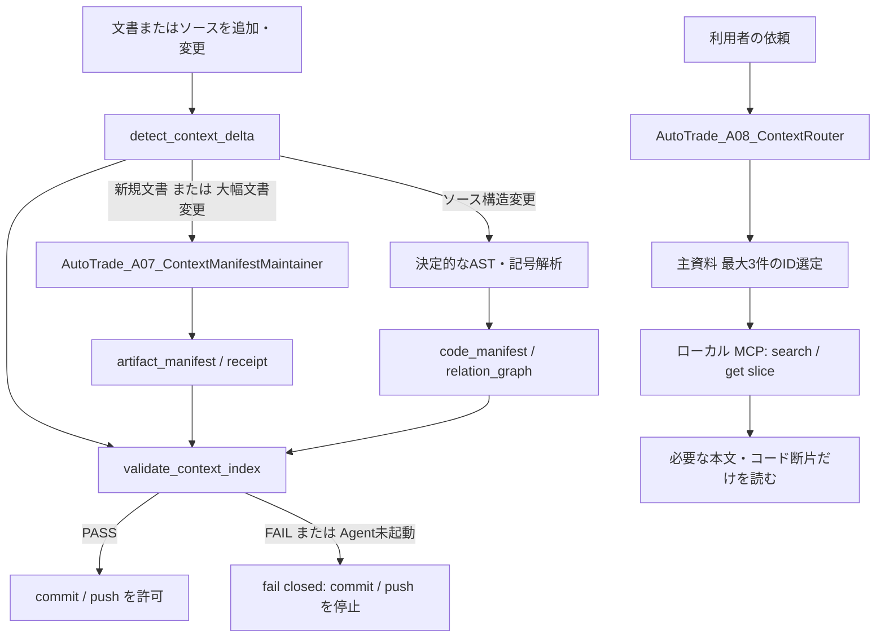

# 資料参照効率化施策 全体導入実行計画書

- 計画ID: `CTXMAP-PLAN-001`
- 版: `v0.1`
- 作成日: 2026-08-14
- 状態: `DRAFT / HUMAN_GATE_REQUIRED`
- 対象: リポジトリ内のプロジェクト所有ドキュメント（`.md` / `.html`）およびソースコード、関連するAI部品・ローカル参照基盤
- 元施策: `plan/資料参照効率化施策.md`

## 1. 結論と到達状態

本計画は、既存の手作業索引・HTML相互リンク・要件追跡を置き換えず、その上に「必要な資料だけを安全に見つけて読む」ための参照基盤を追加する。

完成時には、次を満たす。

1. 管理対象の `.md`、`.html`、ソースコード、AI部品定義、主要設定について、安定ID・要約・見出しまたは公開記号・関連・内容hashを持つ機械可読マニフェストが存在する。
2. 新規文書の追加は、専用の超軽量Skillと専用サブエージェントが必ず検出し、当該文書のマニフェストレコードを追加する。エージェントが起動できない場合は、マニフェスト未更新のコミット／プッシュを失敗させる。
3. 既存文書の大幅変更は、同じ専用サブエージェントが差分と既存レコードを確認し、要約・用途・発火条件・関連・見出し索引の更新要否を判定する。更新不要でも判定根拠と対象hashを残す。
4. ソースコードは、公開記号、import／依存、定義位置、呼出し候補、内容hashを別レイヤーで索引化する。構造変更は決定的な検出器で必ず再解析する。
5. 依頼文を受けるルーターは、マニフェストだけを先に読み、主資料を最大3件、補助資料を必要最小限に絞る。本文やコード断片は、ローカルMCPのJIT取得で初めて読む。
6. `doc/index.html` は人間用の正本入口として維持し、参照基盤の正式な詳細解説HTMLもそこから到達可能にする。

## 2. 現状確認と設計判断

### 2.1 既存資産として再利用するもの

|既存資産|再利用方法|置換しない理由|
|---|---|---|
|`doc/index.html`|正式HTMLの人間向け入口・リンク整合確認として維持|文書の正本性と閲覧導線を既に担っているため|
|設計書のREQ／DEC／UNK／ART追跡|マニフェストの関係情報へ取り込む|設計判断の意味を単なるファイル一覧に落とさないため|
|`AutoTradeComponentLifecycle_Orchestrator_v0_1` と `AutoTrade_A06_AiComponentEngineer_v0_1`|AI部品の追加・仕様同期を統制|既存の部品ライフサイクル規約に従うため|
|`AutoTrade_A80_DocumentIntegrator_v0_1`、`AutoTrade_A81_DesignDocSetWriter_v0_1`|HTML作成後のマニフェスト保守を呼び出す側へ更新|正式文書の作成導線を二重化しないため|
|`AutoTradeProject_ImplementationQuality_Orchestrator_v0_1` とPython品質Skill群|実装のRED→GREEN、検証、レビュー|新規スクリプトの品質を既存規約で確認するため|

### 2.2 新規AI部品

|種別|完全名|固定モデル|責務|軽量化境界|
|---|---|---|---|---|
|Skill|`autotrade_skill_context_manifest_maintenance_v0_1`|該当なし|新規／大幅変更文書のマニフェスト判定・更新規約|対象1ファイル、既存レコード、構造化差分だけを入力にする|
|Agent|`AutoTrade_A07_ContextManifestMaintainer_v0_1`|`gpt-5.1`|文書レコードの追加、または大幅変更時の意味的更新要否を返す|本文は上限18,000文字、出力はJSON 1レコード、ネットワーク・Secret・本文全量出力禁止|
|Skill|`autotrade_skill_context_routing_v0_1`|該当なし|依頼をマニフェスト検索語へ正規化し、読むべきIDを選ぶ規約|マニフェスト以外を初期入力にしない|
|Agent|`AutoTrade_A08_ContextRouter_v0_1`|`gpt-5.1`|最大3主資料と補助資料、JIT取得範囲、欠落情報を構造化出力する|本文を読まない。選定JSONのみを返す|

`gpt-5.1` は既存の `AutoTrade_A80_DocumentIntegrator_v0_1` で採用済みの固定モデルである。超軽量化はモデル名だけに依存せず、入力ファイル数・文字数・出力schema・禁止操作を厳格に固定して達成する。

新しい常時Orchestratorは作らない。AI部品を作成・変更する一回限りの作業は既存の `AutoTradeComponentLifecycle_Orchestrator_v0_1` が統制し、日常の1ファイル保守は軽量Agentと決定的なローカルゲートで行う。これにより、文書保存のたびに重いOrchestratorを起動しない。

### 2.3 更新が必要な既存AI部品

|対象|更新内容|
|---|---|
|`AutoTradeComponentLifecycle_Orchestrator_v0_1` と `AutoTrade_A06_AiComponentEngineer_v0_1`|A07／A08作成時の再利用確認、仕様同期対象、受領証跡を明記する|
|`autotrade_skill_html_doc_writer_v0_1`|新規HTMLまたは大幅変更HTMLの完了条件にマニフェスト整合receiptを追加する|
|`autotrade_skill_design_doc_set_writer_v0_1`|文書セットの追加・更新後に差分対象すべてを保守キューへ送る規約を追加する|
|`autotrade_skill_python_implementation_v0_1` と `AutoTrade_A120_PythonImplementer_v0_1`|構造変更したソースのコード索引再生成・整合検証を完了条件へ追加する|
|`settings/ai_component_rules.md`、`AGENTS.md`、`README.md`|新規AI部品、実行入口、生成物の正本、更新責務、禁止事項を同期する|
|AI基盤HTML 03〜08 と `doc/index.html`|Skill／Agent／発火図／作成ルール／検証結果／詳細解説への導線を同期する|

### 2.4 マニフェストとローカルツールの配置案

```text
context/
  README.md                         # 人間向け利用方法・スコープ
  context_policy.json               # 対象拡張子、除外、閾値、content上限
  artifact_manifest.schema.json     # 文書・設定のレコードschema
  artifact_manifest.json            # 文書・設定の索引（追跡対象）
  code_manifest.json                # 記号・import・依存・呼出し候補（追跡対象）
  relation_graph.json               # 文書リンク、REQ/DEC/UNK、import等の辺
  manifest_state.json               # 各レコードのhash・判定・generator版
  routing_fixtures.json             # 依頼→期待IDの回帰fixture
  receipts/                          # A07/A08のsanitized判定receipt

scripts/context_index/
  build_context_index.py            # 全量／差分の決定的抽出
  detect_context_delta.py           # 追加・削除・rename・大幅変更の判定
  validate_context_index.py         # coverage・schema・hash・安全検証
  query_context.py                  # CLI検索・JIT slice取得
  context_mcp_server.py             # ローカルstdio MCP
  run_context_maintenance.py        # Agent dispatch＋反映＋検証の唯一の入口
  context_watch.py                  # 承認後の変更監視（永続化はしない）
tests/context_index/
  ...                               # 単体、統合、回帰、失敗系fixture
```

`context/` 内は正本の追跡対象とする。キャッシュ、ログ、原文コピー、Secret、認証情報、巨大な生成物は保存しない。`context/receipts/` はhash・対象ID・判定・時刻・Agent起動状態だけを保持し、対象本文やdiff本文を保存しない。

### 2.5 管理対象の分類

初回棚卸しで、各パスを必ず次のいずれかに分類し、除外を黙示しない。

|分類|対象|扱い|
|---|---|---|
|`managed_document`|プロジェクト所有の `.md`、`.html`|ファイルごとにマニフェストレコードを作る|
|`managed_source`|`.py`、`.js`、`.mjs`、`.cjs`、`.ts`、`.tsx`、`.ps1`、`.sh`、`.cmd`|ファイル・公開記号・import／依存をコードマニフェストへ作る|
|`managed_config`|`.json`、`.toml`、`.yaml`、`.yml` のうち実装・AI部品・品質設定|設定レコードと主要キーを作る。Secretらしき値は出力しない|
|`generated_or_evidence`|テスト証跡、ビルド生成物、ログ、rawデータ|原則は境界レコードのみ。個別内容の索引化はHuman Gateで明示採用したものに限る|
|`third_party_or_runtime`|`third_party/`、`node_modules/`、`.venv/`、`.git/`|個別索引化しない。除外理由・版／境界だけを1レコード化する|
|`sensitive_or_unknown`|`.env`、鍵、認証情報、分類不能なバイナリ|内容を読まず除外する。検出時は失敗として報告する|

### 2.6 大幅変更の定義

大幅変更は決定的に判定し、曖昧な場合は「大幅」として安全側に倒す。

- 文書: 新規／削除／rename、title・見出し構造・文書ID・REQ／DEC／UNK／Human Gate・ローカルリンクの変更、または正規化本文の20%以上か120行以上の変更。
- コード: 新規／削除／rename、公開関数・class・interface・export・import・型／引数・entry pointの変更、または論理行の20%以上か150行以上の変更。
- 小変更でもhash、解析日時、generator版は更新する。小変更ではA07が意味的な要約を更新不要と判定できるが、レコードを古いhashのまま残してはならない。

## 3. 完成時の処理フロー



## 4. Human Gate と未確定事項

|ID|対象|状態|承認が必要な理由|再開条件|
|---|---|---|---|---|
|`CTXMAP-H0`|本計画の実行開始、`context/`導入、AI部品2組の追加、既存Skill／Agent更新|`WAITING_FOR_APPROVAL`|広範なリポジトリ横断変更とAI部品仕様の追加を伴うため|ユーザーが `CTXMAP-H0を承認します` と明示すること|
|`CTXMAP-H1`|変更監視でA07を自動起動し、auto-commit前に整合ゲートを必須化すること|`WAITING_FOR_APPROVAL`|保存時の自動モデル実行・自動コミット経路変更・失敗時停止を伴うため|実装・テスト・初回全量マニフェストがPASSし、ユーザーが `CTXMAP-H1を承認します` と明示すること|
|`CTXMAP-UNK-01`|TypeScript／PowerShell／shellの構文抽出器の実装方式|`OPEN`|既存依存のみで十分か、追加parserが必要かは環境確認前には確定できない|CTX-02で決定的な試作・精度試験を行い、追加依存は別承認とする|
|`CTXMAP-UNK-02`|巨大な履歴・evidence・未追跡資料の個別全文索引範囲|`OPEN`|容量、秘匿性、更新頻度が異なる|CTX-01の分類表をH0で承認する。未分類はfail closed|

外部ネットワーク、Broker、Secret、実取引、クラウドへの本文送信は本計画の対象外であり、禁止する。MCPはローカルstdioでのみ提供し、外部MCPサーバーや外部ベクトルDBを導入しない。追加パッケージ、外部モデルAPI、外部ホスティングが必要と判明した場合は、その時点で停止して別Human Gateを作る。

## 5. 実行Stepと依存関係

```text
CTX-00 → CTX-01 → [CTXMAP-H0] → CTX-02 → CTX-03 → CTX-04 → CTX-05
                                                    ↘           ↙
                                                     CTX-06 → CTX-07 → CTX-08
                                                                           ↓
                                                                      CTX-09
                                                                           ↓
                                                                    [CTXMAP-H1]
                                                                           ↓
                                                                    CTX-10 → CTX-11
```

以下の各プロンプトは、実行時にそのままAIエージェントへ渡す。すべてのStepで、未起動のAgentを独立実行済みと表現してはならない。`multi_agent_v1__spawn_agent`／`multi_agent_v1__wait_agent` が利用できない場合は、`RUNTIME_DISPATCH_FALLBACK_REQUIRED`、`agent_id=N/A`、`independent=false`、`review_mode=SELF_REVIEW_FALLBACK` をreceiptへ残し、責務チェックリストで継続する。

### CTX-00 — 現状棚卸しと対象範囲の凍結

- 目的: 初回導入前の完全な対象一覧、除外理由、既存導線、変更基準線を作る。
- 主成果物: `plan/context_index/CTX-00_棚卸し・対象分類.md`、`plan/context_index/CTX-00_変更基準線.json`、`plan/context_index/CTX-00_Unknown台帳.md`。
- 変更境界: 読み取りと `plan/context_index/` への新規記録だけ。既存AI部品、既存文書、ソース、依存、監視、設定を変更しない。
- 受入条件: 対象拡張子・全パス数・分類数・除外数が一致し、未分類0件またはUnknownとして明記される。`git status --short` の既存変更を基準線に保存し、ユーザー変更を変更候補へ混ぜない。

#### 実行用プロンプト

```text
あなたは CTX-00 の「資料・コード参照基盤の導入前棚卸し担当」です。読み取り専用で作業し、実装・設定変更・依存追加・Git commit/pushは絶対に行わないでください。

【固定の実行構成】
- Orchestrator: AutoTradePhasePlanning_Orchestrator_v0_1
- Orchestrator JSON: .codex/orchestrators/AutoTradePhasePlanning_Orchestrator_v0_1.json
- Orchestrator model: gpt-5.6-terra
- 主Agent: AutoTrade_A05_PhaseExecutionPlanner_v0_1
- 併用Agent: AutoTrade_A10_RequirementsCurator_v0_1, AutoTrade_A90_DesignReviewer_v0_1
- Agent model: 各Agent JSONの定義をそのまま使う。勝手に代替しない。
- Skills: autotrade_skill_phase_execution_planning_v0_1, autotrade_skill_source_reader_v0_1, autotrade_skill_traceability_v0_1, autotrade_skill_design_review_v0_1
- 実ランタイム起動: Orchestratorをspawnし、上記全Agentを個別spawnして全件waitする。receiptを plan/context_index/CTX-00_dispatch_receipt.json に保存する。起動不能時はRUNTIME_DISPATCH_FALLBACK_REQUIREDを先に記録する。

【必ず読む正本】
README.md、AGENTS.md、settings/language.md、settings/ai_component_rules.md、doc/index.html、doc/00_全Phase残課題Blocked統合台帳.html、plan/資料参照効率化施策.md、.codex/config.json、package.json、.gitignore、auto-commit.sh、scripts/watch-*.js、.codex/skills/、.codex/agents/、.codex/orchestrators/。

【実施内容】
1. Git追跡・未追跡を区別して、プロジェクト直下から .md/.html/.py/.js/.mjs/.cjs/.ts/.tsx/.ps1/.sh/.cmd/.json/.toml/.yaml/.yml を列挙する。
2. 各パスを managed_document / managed_source / managed_config / generated_or_evidence / third_party_or_runtime / sensitive_or_unknown のいずれかへ分類する。分類不能を除外扱いにしてはならない。
3. .gitignore、サイズ、バイナリ、Secretらしき名前、third_party、node_modules、.venv、tests/evidenceを根拠付きで点検する。
4. doc/index.htmlのHTML到達性、既存のREQ/DEC/UNK/ART追跡、既存のAI部品作成導線、watch-commitのgit add -Aリスクを事実として記録する。
5. 現在のgit status --short、branch、origin、HEADを基準線へ記録する。既存の未追跡ファイルを本Stepの成果物や将来のcommit対象と誤認しない。
6. 文書とコードの「大幅変更」候補閾値が本計画の2.6節で妥当か、例外パスを含めてレビューする。

【出力】
- plan/context_index/CTX-00_棚卸し・対象分類.md: 集計、分類方針、各除外理由、既存導線、リスク。
- plan/context_index/CTX-00_変更基準線.json: 再実行可能な件数・path一覧・hash・Git基準線。Secret本文を含めない。
- plan/context_index/CTX-00_Unknown台帳.md: ID、対象、理由、停止条件、再開条件。
- plan/context_index/CTX-00_dispatch_receipt.json: 起動証跡または正直なFallback証跡。

【停止条件】
- Secret、鍵、.env、認証情報らしき内容を読む必要がある。
- 管理対象か除外かを判断できないパスが残る。
- 外部ネットワーク、依存取得、既存ファイル変更が必要になる。
停止時は対象パスと理由だけを記録し、内容を出力しないでください。
```

### CTX-01 — 参照基盤の詳細設計と受入基準

- 目的: manifest schema、差分判定、MCP境界、運用責務、テストを実装可能な粒度へ固定する。
- 主成果物: `plan/context_index/CTX-01_資料コード参照基盤詳細設計候補.md`、`plan/context_index/CTX-01_受入・脅威・テスト設計.md`、`plan/context_index/CTX-01_マニフェストschema案.json`。
- 変更境界: 設計候補とplan記録だけ。実装・AI部品実体・監視変更・MCP登録・依存追加をしない。
- 受入条件: 文書／コードのレコードschema、ID・rename・削除処理、閾値、Agent入出力、MCP tool schema、秘密情報防止、失敗時のcommit停止、全テストケースが具体化される。

#### 実行用プロンプト

```text
あなたは CTX-01 の実装詳細設計者です。CTX-00の棚卸し結果と本計画を入力に、ローカルだけで完結する資料・コード参照基盤の詳細設計候補を作成してください。実装、依存追加、MCP設定登録、監視起動、Git commit/pushは禁止です。

【固定の実行構成】
- Orchestrator: AutoTradeProject_ImplementationDesign_Orchestrator_v0_1
- Orchestrator JSON: .codex/orchestrators/AutoTradeProject_ImplementationDesign_Orchestrator_v0_1.json
- Orchestrator model: gpt-5.6-terra
- 主Agent: AutoTrade_A82_ImplementationDetailDesigner_v0_1
- 独立Reviewer: AutoTrade_A91_ImplementationDetailReviewer_v0_1
- 補助Agent: AutoTrade_A70_OpsSecurityArchitect_v0_1, AutoTrade_A80_DocumentIntegrator_v0_1
- Skills: autotrade_skill_implementation_detail_design_v0_1, autotrade_skill_implementation_detail_review_v0_1, autotrade_skill_source_reader_v0_1, autotrade_skill_traceability_v0_1, autotrade_skill_ops_security_v0_1, autotrade_skill_html_doc_writer_v0_1
- 実ランタイム起動とreceipt: 全Agentを個別spawn/waitし、plan/context_index/CTX-01_dispatch_receipt.jsonへ保存する。Fallbackは明示する。

【必須設計】
1. context/ の全ファイルschemaを定義する。artifact_manifest、code_manifest、relation_graph、manifest_state、receiptの必須・任意フィールド、schema_version、source_hash、generator_version、更新責務を表にする。
2. stable IDをパスhashだけに依存させず、rename時に旧IDを追跡できる設計にする。削除は履歴statusで表し、関係を壊さない。
3. 文書抽出はtitle、h1-h3、文書ID、REQ/DEC/UNK/ART、ローカルリンク、要約、用途、発火条件、関連IDを扱う。コード抽出はPython AST、TypeScript/JavaScript、PowerShell、shellの言語別方針と、未対応時のPARTIAL状態を定義する。
4. 新規文書はA07必須、大幅文書変更はA07による更新要否判定必須、構造変更したコードは決定的再解析必須とする。小変更時もhash更新を必須にする。
5. A07/A08の入力・出力JSON schema、18,000文字上限、1ファイル制限、Secret拒否、ネットワーク禁止、receipt項目、失敗時fail closedを明文化する。
6. ローカルstdio MCPの tools: search_context、get_artifact、get_code_slice、get_related を定義する。すべてのpathはrepo内allowlist、結果数・文字数上限、line範囲、Secret denylistを持たせる。
7. auto-commit.shの無差別git add -Aを置換または前段ゲート化する選択肢を比較し、「未整合ならcommitしない」を必須契約にする。ユーザーの既存未追跡変更をstageしない設計にする。
8. 単体・統合・回帰・mutation相当・negative testを、入力fixture、期待結果、失敗条件まで書く。最小でも新規文書、文書大変更、文書小変更、コード構造変更、rename、削除、Agent起動不能、schema破損、stale hash、Secret検出、router誤選定を含める。
9. 脅威モデルを作る。prompt injectionを含む文書本文、path traversal、Secret漏えい、巨大ファイル、無限監視、自己更新ループ、auto-commit誤stageを必ず扱う。

【成果物の構成】
設計候補は `plan/context_index/CTX-01_資料コード参照基盤詳細設計候補.md` に置く。最初に利用者向け概要、次にディレクトリ図、Mermaid構造図、manifest表、更新シーケンス、MCP API、例外、テスト表、運用境界、Unknown、追跡表、レビュー履歴を置く。各表の前に目的を日本語で書く。文書IDは CTXMAP-D01、設計判断は CTXMAP-DEC-xx、Unknownは CTXMAP-UNK-xx を使う。完成システムの正式HTMLはCTX-10で作成し、同一Stepで `doc/index.html` へ登録する。

【出力と停止条件】
- Critical/Highのレビュー指摘が残る設計を受入可にしない。
- parser追加依存が必要なら、名称・用途・ライセンス確認項目・外部取得が必要な理由をCTXMAP-UNK-01として止める。
- 外部MCP、クラウドDB、Secret、外部本文送信を設計へ含めない。
```

### Gate CTXMAP-H0 — 実装開始承認

CTX-00とCTX-01を終え、対象分類、除外、manifest schema、MCP境界、AI部品名、追加依存の有無、テスト計画を提示した時点で停止する。ユーザーが `CTXMAP-H0を承認します` と明示するまで、以降のAI部品作成、スクリプト実装、設定・監視変更を開始しない。

### CTX-02 — AI部品の作成と既存部品・基盤仕様の同期

- 目的: A07/A08と2 Skillを最小追加し、既存の作成・文書・実装導線へマニフェスト責務を接続する。
- 主成果物: 新規Skill／Agent JSON、更新済み既存Skill／Agent／Orchestrator、AI基盤HTML 03〜08、`settings/ai_component_rules.md`、`AGENTS.md`、`README.md`、`doc/index.html`。
- 受入条件: 名前衝突なし、`default_orchestrator`不変、Agent JSONとSkill内容・AI基盤HTML・設定が一致し、A07/A08の起動／Fallback契約が検証される。

#### 実行用プロンプト

```text
あなたは CTX-02 のAI部品ライフサイクル担当です。CTXMAP-H0の明示承認、CTX-00、CTX-01を確認してから実行してください。承認がない場合は変更せずBLOCKEDを返してください。

【固定の実行構成】
- Orchestrator: AutoTradeComponentLifecycle_Orchestrator_v0_1
- Orchestrator JSON: .codex/orchestrators/AutoTradeComponentLifecycle_Orchestrator_v0_1.json
- Orchestrator model: gpt-5.6-terra
- 主Agent: AutoTrade_A06_AiComponentEngineer_v0_1
- 補助Agent: AutoTrade_A10_RequirementsCurator_v0_1, AutoTrade_A80_DocumentIntegrator_v0_1
- 独立Reviewer: AutoTrade_A90_DesignReviewer_v0_1
- 新規Agentの妥当性確認: AutoTrade_A07_ContextManifestMaintainer_v0_1, AutoTrade_A08_ContextRouter_v0_1
- Skills: autotrade_skill_ai_component_lifecycle_v0_1, autotrade_skill_context_manifest_maintenance_v0_1, autotrade_skill_context_routing_v0_1, autotrade_skill_source_reader_v0_1, autotrade_skill_traceability_v0_1, autotrade_skill_html_doc_writer_v0_1, autotrade_skill_design_review_v0_1
- Runtime: Orchestratorおよび上記全Agentを個別spawn/waitし、receiptを plan/context_index/CTX-02_dispatch_receipt.json に保存する。新規Agentは作成前に名前衝突を確認し、作成後にJSONの固定modelを再読込する。

【作成する実体】
1. .codex/skills/autotrade_skill_context_manifest_maintenance_v0_1/SKILL.md
2. .codex/agents/AutoTrade_A07_ContextManifestMaintainer_v0_1.json
3. .codex/skills/autotrade_skill_context_routing_v0_1/SKILL.md
4. .codex/agents/AutoTrade_A08_ContextRouter_v0_1.json

【必須契約】
- A07は新規文書なら必ず record_add、既存文書の大幅変更なら record_update / metadata_unchanged のどちらかを返す。対象外、Secret疑い、入力不足、schema不整合は pass にせず blocked を返す。
- A07の入力は1ファイル、相対path、kind、hash、構造化差分、既存レコード、最大18,000文字の安全な本文抜粋だけとする。出力はstrict JSONで、artifact_id、action、summary、purpose、triggers、headings、relations、confidence、reason、source_hash、receiptだけとする。
- A08はマニフェストと依頼文だけを入力にし、primary_idsは1〜3件、supporting_idsは最大6件、JIT取得範囲、選定理由、不足情報を返す。本文やコードを直接読まない。
- A07/A08にネットワーク、Secret読取、Git stage/commit/push、任意path読取、本文全量保存を許可しない。
- 既存のhtml_doc_writer、design_doc_set_writer、python_implementation、A120、A06、ComponentLifecycleに、該当差分をrun_context_maintenanceへ渡し、validator PASSまたは正直なBLOCKEDなしには完了しない規約を追加する。
- AutoTradeComponentLifecycleのstatic mapへA07/A08を必要最小限で追加する。新規の常時Orchestratorは作らない。default_orchestratorは変更しない。

【同期更新】
- settings/ai_component_rules.md、AGENTS.md、README.md。
- doc/ai_foundation/03〜08。新Skill、新Agent、発火制御、model、日常保守が重いOrchestratorを使わない理由、receipt/Fallback、停止条件を同期する。
- AI基盤HTML 03〜08の既存導線を確認する。完成システムの新規正式HTMLと `doc/index.html` への導線追加はCTX-10で同時に行う。
- doc/00_全Phase残課題Blocked統合台帳.htmlにCTXMAP-H0/H1とUnknownの現在状態・再開条件・証拠先を登録し、関連する最新状態・Human Gate・履歴リンクを横断検索して矛盾を解消する。

【検証】
- JSON parse、名前重複なし、Skill内参照path存在、完全名一致、default不変、doc/indexのローカルリンク整合、AI基盤03〜08の記載一致。
- 新規Agentを起動できないときは、起動済みとは書かずFallbackにする。
- 既存ユーザー変更をstageしない。commit/pushはこのStepでは行わず、最終Stepの明示範囲まで保留する。
```

### CTX-03 — 決定的なマニフェスト基盤のRED設計と実装

- 目的: schema、探索、hash、文書構造抽出、差分検出、検証器の最小実装をテスト先行で作る。
- 主成果物: `context/` のschema・policy・state、`scripts/context_index/` の基盤、`tests/context_index/` のRED→GREEN証跡。
- 受入条件: 新規文書／小変更／大幅変更／rename／削除／schema不正／stale hash／Secret拒否を再現可能に判定し、対象未登録でvalidatorが失敗する。

#### 実行用プロンプト

```text
あなたは CTX-03 のテスト先行実装担当です。CTXMAP-H0承認済み、CTX-01詳細設計受入可、CTX-02のAI部品・規約同期済みを前提にします。未成立なら実装せずBLOCKEDにしてください。

【固定の実行構成】
- Orchestrator: AutoTradeProject_ImplementationQuality_Orchestrator_v0_1
- Orchestrator JSON: .codex/orchestrators/AutoTradeProject_ImplementationQuality_Orchestrator_v0_1.json
- Orchestrator model: gpt-5.6-terra
- Agents: AutoTrade_A110_PythonTestEngineer_v0_1 → AutoTrade_A120_PythonImplementer_v0_1 → AutoTrade_A130_VerificationEngineer_v0_1 → AutoTrade_A150_PythonCodeReviewer_v0_1
- Skills: autotrade_skill_python_test_quality_v0_1, autotrade_skill_python_implementation_v0_1, autotrade_skill_debug_recovery_v0_1, autotrade_skill_python_code_review_v0_1, autotrade_skill_ops_security_v0_1
- Runtime receipt: plan/context_index/CTX-03_dispatch_receipt.json。指定Agentを個別spawn/waitする。実行可能なtrusted scopeが未登録なら、勝手にWSL Gateを流さず、ローカルunit test範囲とBLOCKED理由を分けて記録する。

【変更を許可する範囲】
context/、scripts/context_index/、tests/context_index/、必要最小限のpackageまたはpytest設定、plan/context_index/。それ以外のアプリ本体、取引ロジック、外部接続、既存evidence、Secretを変更しない。

【TDDの順序】
1. A110が最初に失敗するテストを作る。各テストは一つの受入条件だけを検証し、fixtureはtests/context_index/fixtures配下に固定する。
2. RED結果を保存する。skip、xfail、閾値緩和、対象削除でREDを回避しない。
3. A120が最小の実装でGREENにする。
4. A130がformat、lint、type、testの実行可能なローカルコマンドを記録する。未設定のGateはPASSとせずUNKNOWN/BLOCKEDにする。
5. A150がpath confinement、入力検証、例外、再現性、不要な依存追加をレビューする。

【最低限の実装内容】
- context_policy.json: 対象・除外・閾値・最大サイズ・Secret denylistをschemaで検証する。
- build_context_index.py: 文書のtitle、h1-h3、ID候補、ローカルリンク、hash、行数を決定的に抽出する。要約の意味更新はまだA07に委譲し、勝手なLLM呼出をしない。
- detect_context_delta.py: Git baseまたは明示したbefore/after fixtureからadded/modified/renamed/deletedを返し、大幅変更条件を機械判定する。
- validate_context_index.py: managed_documentのcoverage、schema、hash、削除状態、未分類、Secret検出、stale stateを検査し、1件でも不整合なら非0終了する。
- query_context.py: manifestだけを検索し、path traversalを拒否する。本文取得はCTX-06まで実装しない。

【必須テスト】
新規Markdown、新規HTML、文書小変更、見出し変更、20%超変更、REQ/DEC/UNK変更、rename、削除、壊れたJSON、未登録文書、hash不一致、.env相当、third_party除外、WindowsパスとPOSIX相対pathの正規化、出力順の再現性。

【停止条件】
ネットワーク、pip/npm install、外部parser、Secret読取、対象外パス変更が必要なら停止する。追加依存が必要ならCTXMAP-UNK-01を更新し、Human Gateなしに取得しない。
```

### CTX-04 — 文書マニフェスト保守Agentの接続と失敗閉鎖

- 目的: A07を決定的な保守入口へ接続し、新規文書と大幅変更文書で必ずA07判定・receipt・validatorが動くようにする。
- 主成果物: `run_context_maintenance.py`、A07入出力adapter、sanitized receipt、統合テスト。
- 受入条件: 新規文書はA07なしにPASSできず、大幅変更はA07がupdate／unchangedのどちらかを明示し、Agent起動不能時はcommit許可にならない。

#### 実行用プロンプト

```text
あなたは CTX-04 の文書マニフェスト保守統合担当です。CTX-03の基盤テストがGREENであることを確認してから、A07を唯一の文書意味更新入口として接続してください。

【固定の実行構成】
- Orchestrator: AutoTradeComponentLifecycle_Orchestrator_v0_1（AI部品契約確認）および AutoTradeProject_ImplementationQuality_Orchestrator_v0_1（実装品質）
- 主Agent: AutoTrade_A07_ContextManifestMaintainer_v0_1
- 実装Agent: AutoTrade_A120_PythonImplementer_v0_1
- Test/Verification/Review: AutoTrade_A110_PythonTestEngineer_v0_1, AutoTrade_A130_VerificationEngineer_v0_1, AutoTrade_A150_PythonCodeReviewer_v0_1
- Skills: autotrade_skill_context_manifest_maintenance_v0_1, autotrade_skill_python_implementation_v0_1, autotrade_skill_python_test_quality_v0_1, autotrade_skill_python_code_review_v0_1
- Runtime: 両Orchestratorと明示Agentを個別spawn/waitし、plan/context_index/CTX-04_dispatch_receipt.jsonへ保存する。A07自身の起動失敗は自動的にFallback PASSへ変換しない。

【実装契約】
1. run_context_maintenance.py は `--changed <path>` または差分検出結果だけを受ける。リポジトリ全体を無条件に本文読込しない。
2. 新規managed_documentはA07へ必ずdispatchする。A07出力がrecord_addでなく、またはschema不正なら失敗する。
3. 大幅変更managed_documentはA07へ必ずdispatchし、record_update または metadata_unchanged のaction、理由、source_hash、confidenceをreceiptに保存する。metadata_unchangedでもmanifest_stateのhashは更新する。
4. 小変更managed_documentは決定的更新のみ行うが、A07不要とした根拠をstateへ記録する。
5. A07入力はpolicyに従い、Secret疑い、巨大文書、path外アクセスを拒否する。拒否時は内容をreceiptへ複写しない。
6. agent dispatch backendが利用できない場合、`RUNTIME_DISPATCH_FALLBACK_REQUIRED` と対象pathを記録し、new/majorのvalidatorは非0終了する。人手がA07結果を偽造して通す経路を作らない。
7. markdown/htmlを作る既存Skill側からこの入口を呼ぶ契約を、CTX-02で更新した内容と一致させる。

【テスト】
- 新規Markdownと新規HTMLがA07 receiptなしではvalidator FAIL。
- 大幅な見出し／本文変更がA07のrecord_updateまたはmetadata_unchangedを要求。
- 小変更でsummaryを不必要に書換えないがhashは更新。
- A07 timeout、JSON不正、confidence不足、Secret検出、二重実行、同一event再試行、rename、削除をテストする。
- receiptに本文、トークン、Secret、絶対ユーザーパスを保存しない。

【禁止】
外部API、background常駐、Git stage/commit、全量再要約、モデルの黙示代替。ここでは手動／CIから呼ぶ同期コマンドだけを作る。
```

### CTX-05 — コードマニフェストと関係グラフ

- 目的: 全管理ソースの定義・依存・構造変更をマニフェスト化し、文書とコードを関連付ける。
- 主成果物: `code_manifest.json`、`relation_graph.json`、言語別抽出器、解析品質のfixtureとcoverage表。
- 受入条件: PythonはAST由来の記号・import、TypeScript／JavaScript・PowerShell・shellは対応度を明示した抽出結果を持ち、未対応は偽の完全性を主張しない。

#### 実行用プロンプト

```text
あなたは CTX-05 のコード索引実装担当です。CTX-00の対象分類とCTX-01の言語別設計を守り、既存コードを変更せず、索引器とテストだけを実装してください。

【固定の実行構成】
- Orchestrator: AutoTradeProject_ImplementationQuality_Orchestrator_v0_1
- 主Agent: AutoTrade_A110_PythonTestEngineer_v0_1
- 実装Agent: AutoTrade_A120_PythonImplementer_v0_1
- 検証・レビュー: AutoTrade_A130_VerificationEngineer_v0_1, AutoTrade_A150_PythonCodeReviewer_v0_1
- Skills: autotrade_skill_python_test_quality_v0_1, autotrade_skill_python_implementation_v0_1, autotrade_skill_python_code_review_v0_1, autotrade_skill_traceability_v0_1
- Runtime receipt: plan/context_index/CTX-05_dispatch_receipt.json。

【実装順序】
1. Python標準astでfunction、async function、class、method、decorator、import/from import、公開候補、行範囲を抽出するRED testから開始する。
2. TypeScript/JavaScriptは、既存依存で構文木を利用できるかを先に確認する。利用できなければ追加依存を取得せず、export/import/宣言の保守的な抽出と extraction_status=PARTIAL を実装する。完全ASTを偽装しない。
3. PowerShellとshellはfunction定義、script entry、source/dot-source/import相当だけを保守的に抽出し、限界をmanifestへ記録する。
4. JSON等managed_configは主要top-level keyと参照先pathだけを抽出し、値・Secretを記録しない。
5. relation_graphは、文書のローカルリンク、REQ/DEC/UNK/ART参照、コードのimport、Skill→Agent→Orchestrator参照を辺として区別して保存する。自動推測の意味関係は evidence=heuristic と明示する。
6. code構造変更で再解析、文書との明示参照変更でrelation再生成、単なるコメント変更ではhashだけ更新という契約を実装する。

【必須テスト】
Pythonのnested定義、alias import、relative import、syntax error、TypeScript export/import、PowerShell function、shell function/source、JSONのSecretらしきkey、path rename、同一出力再現、関係先不存在、循環関係、PARTIAL表示、構造変更の検出。

【停止条件】
AST完全対応のために新規npm/pip依存が必要なら、パッケージを取得せず、比較結果と必要性をCTXMAP-UNK-01へ追記して停止する。既存ソースのformat変更、取引ロジック変更、外部接続は禁止。
```

### CTX-06 — ルーターとローカルstdio MCPのJIT参照

- 目的: マニフェスト先行の資料選定と、許可済み範囲だけの本文／コード断片取得を提供する。
- 主成果物: A08 adapter、`context_mcp_server.py`、CLI、router fixture、MCP security test。
- 受入条件: A08は本文を読まず1〜3主資料を選び、MCPはrepo外・Secret・過大レスポンス・パストラバーサルを拒否する。

#### 実行用プロンプト

```text
あなたは CTX-06 のルーター・ローカルMCP担当です。CTX-04/05のマニフェスト検証がPASSしていることを確認してから実装してください。外部MCPサーバー、外部DB、HTTP listen、クラウドは導入しません。

【固定の実行構成】
- Orchestrator: AutoTradeComponentLifecycle_Orchestrator_v0_1（A08契約確認）および AutoTradeProject_ImplementationQuality_Orchestrator_v0_1（実装品質）
- 主Agent: AutoTrade_A08_ContextRouter_v0_1
- 補助Agent: AutoTrade_A07_ContextManifestMaintainer_v0_1
- 実装・試験・検証・レビュー: AutoTrade_A120_PythonImplementer_v0_1, AutoTrade_A110_PythonTestEngineer_v0_1, AutoTrade_A130_VerificationEngineer_v0_1, AutoTrade_A150_PythonCodeReviewer_v0_1
- Skills: autotrade_skill_context_routing_v0_1, autotrade_skill_context_manifest_maintenance_v0_1, autotrade_skill_python_implementation_v0_1, autotrade_skill_python_test_quality_v0_1, autotrade_skill_python_code_review_v0_1
- Runtime receipt: plan/context_index/CTX-06_dispatch_receipt.json。

【A08契約】
- 入力: ユーザー依頼、artifact_manifestの安全な検索結果、code_manifestの安全な検索結果、relation_graphの近傍だけ。
- 出力: primary_ids（1〜3）、supporting_ids（0〜6）、各選定理由、必要なtool名、path、line/heading範囲、総JIT予算、不足情報。
- 禁止: 本文取得、コード本文取得、全文検索の再実行、外部通信、Agent自身によるファイル更新。

【MCP tool契約】
1. search_context(query, kinds?, limit<=20): マニフェストのみ検索し、ID・要約・用途・関連・scoreを返す。
2. get_artifact(artifact_id, heading_or_line_range?, max_chars<=12000): policy allowlist内のMarkdown/HTMLだけを読取り、指定範囲を返す。
3. get_code_slice(code_id, symbol_or_line_range?, max_chars<=12000): code_manifestに登録済みの記号・範囲だけを返す。
4. get_related(artifact_id, relation_types?, depth<=1, limit<=20): relation_graphだけを返す。
5. 全toolは相対path正規化、repo境界、denylist、最大サイズ、UTF-8失敗、シンボル不存在、ID不存在を安全に拒否する。stdio以外のlistenを行わない。

【回帰fixture】
context/routing_fixtures.jsonに、「AI部品の追加方法」「Phase5の外部Data Gate」「資料参照効率化の実装」「Python品質Gate」など少なくとも10件の依頼と期待primary IDを固定する。正解が一意でない場合は許容集合を定義し、理由なしの偶然一致をPASSにしない。

【セキュリティテスト】
../../、C:\\外部パス、UNC、.env、秘密鍵名、node_modules、third_party本文、巨大範囲、invalid UTF-8、prompt injectionを含む文書、存在しないID、長すぎるqueryを必ず拒否または安全に縮約する。
```

### CTX-07 — commit前ゲート・監視経路・運用安全化

- 目的: 手動・Agent・既存watch-commitのいずれの変更経路でも、未整合マニフェストをcommit／pushさせない。
- 主成果物: manifest整合ゲート、watch前段、運用コマンド、ログ／復旧手順、テスト。
- 受入条件: 現行の`git add -A`による既存ユーザー変更の混入をなくし、整合失敗時は何もstage／commit／pushしない。

#### 実行用プロンプト

```text
あなたは CTX-07 の変更経路・運用安全化担当です。CTX-06までのテストがPASSした後に、commit前の整合ゲートを実装してください。CTXMAP-H1の承認前に常駐監視を有効化してはなりません。

【固定の実行構成】
- Orchestrator: AutoTradeProject_ImplementationQuality_Orchestrator_v0_1
- Agents: AutoTrade_A110_PythonTestEngineer_v0_1, AutoTrade_A120_PythonImplementer_v0_1, AutoTrade_A130_VerificationEngineer_v0_1, AutoTrade_A150_PythonCodeReviewer_v0_1, AutoTrade_A07_ContextManifestMaintainer_v0_1
- Skills: autotrade_skill_python_test_quality_v0_1, autotrade_skill_python_implementation_v0_1, autotrade_skill_python_code_review_v0_1, autotrade_skill_context_manifest_maintenance_v0_1
- Runtime receipt: plan/context_index/CTX-07_dispatch_receipt.json。

【必須実装】
1. `scripts/context_index/check_context_gate.py` を作る。対象差分を検出し、必要ならrun_context_maintenanceを起動し、validate_context_indexを実行する。失敗時は非0終了し、stage/commit/pushを一切しない。
2. auto-commit.shは `git add -A` を使わない。gate PASS後に、明示された変更集合だけをstageする実装へ改める。未追跡のユーザー資料、Secret疑い、gate対象外は自動stageしない。
3. watch-commit経路は、H1承認前は停止状態を保ち、startコマンドもH1 receiptがない場合は説明付きで拒否する。
4. H1承認後にだけ context_watch.py をwatch-commitより前に起動できるようにする。eventをdebounce・直列化し、manifest自身の更新で無限再起動しない。新規／大幅文書イベントはA07が完了してvalidator PASSになるまで次のcommitを許可しない。
5. 監視は永続サービス・外部ネットワークを使わない。停止コマンド、PID確認、イベントログの保存先、失敗からの手動再実行手順をREADMEへ書く。
6. 「文書が保存された瞬間」にAgent backendが利用不能なときは、pending状態と理由を残し、次のcommit/pushをfail closedにする。自動で本文を外部へ送らない。

【必須テスト】
- managed_document新規追加→A07 receipt→gate PASS。
- 大幅変更→A07判定→gate PASS。
- A07起動不可／timeout→gate FAIL、git index不変。
- source構造変更→code manifest更新必須。
- context内の生成物変更→自己ループなし。
- 既存の未追跡ファイルが存在→自動stageしない。
- validator失敗、Secret疑い、rename、削除→commit/pushしない。
- H1未承認→監視開始拒否。

【禁止】
git reset --hard、checkout、force push、stash drop、ユーザー変更の自動削除、外部API、無承認の監視起動。テストで実際のpushをしない。
```

### CTX-08 — 全ドキュメント・全ソースの初回マニフェスト化

- 目的: 承認済み対象を全量走査して初期マニフェストを作り、未登録ゼロを確認する。
- 主成果物: `context/*.json`、初回A07 receipt群、coverage report、未確定一覧。
- 受入条件: CTX-00で`managed_*`とした全パスが唯一のレコードを持ち、文書新規レコードはA07、コードは決定的抽出で作られる。除外は理由と境界レコードを持つ。

#### 実行用プロンプト

```text
あなたは CTX-08 の初回全量マニフェスト化担当です。CTX-07のgate・安全テストがPASSし、CTXMAP-H0承認が有効であることを確認してください。CTXMAP-H1承認前なので常駐監視は開始せず、明示的な一回限りのバッチとして実行します。

【固定の実行構成】
- Orchestrator: AutoTradeProject_Orchestrator_v0_1
- 主Agent: AutoTrade_A07_ContextManifestMaintainer_v0_1
- 補助Agent: AutoTrade_A08_ContextRouter_v0_1（router fixtureの確認だけ）, AutoTrade_A130_VerificationEngineer_v0_1
- Skills: autotrade_skill_context_manifest_maintenance_v0_1, autotrade_skill_context_routing_v0_1, autotrade_skill_traceability_v0_1, autotrade_skill_python_test_quality_v0_1
- Runtime: Orchestratorをspawnし、A07は文書ごとに入力上限を守って逐次または安全な小バッチでspawn/waitする。全receiptの索引だけをplan/context_index/CTX-08_dispatch_receipt_index.jsonへ保存する。起動不能文書を成功扱いしない。

【実行手順】
1. CTX-00の分類表と現在のworktreeを照合する。新たな対象があれば分類し、勝手に除外しない。
2. managed_documentごとに決定的抽出→A07のrecord_add→schema検証→receipt保存を行う。要約不確実ならconfidenceを下げ、内容を捏造しない。
3. managed_source／managed_configごとに決定的抽出を行い、抽出不能はPARTIALまたはBLOCKEDとして記録する。完全性を偽らない。
4. link、REQ/DEC/UNK/ART、Agent/Skill/Orchestrator、importの明示関係をrelation_graphへ入れる。
5. generated_or_evidenceとthird_party_or_runtimeは、個別本文を索引化せず境界レコード・除外理由・再評価条件を作る。
6. validate_context_index --full を実行し、coverage、重複ID、孤立relation、hash、Secret、出力再現性を検証する。
7. router fixtureをA08で実行し、primary_idsと根拠を記録する。期待に外れた場合は、関連情報かfixtureを修正し、単に期待値を緩めない。

【出力】
- context/ 配下の追跡対象manifest。
- plan/context_index/CTX-08_初回全量化レポート.md: 件数、分類別coverage、PARTIAL/BLOCKED、容量、実行時間、除外、残リスク。
- plan/context_index/CTX-08_不確実レコード一覧.md: ID、理由、再確認条件。

【停止条件】
Secret、対象外へのアクセス、未分類、A07未起動、schema/hash不整合、内容の外部送信が発生し得る経路。停止しても既存文書・ソースを変更しない。
```

### CTX-09 — 統合品質・独立レビュー・運用リハーサル

- 目的: 参照精度、更新保証、安全性、性能、復旧を横断して受入可否を決める。
- 主成果物: 正式レビューHTML候補、Findings first一覧、修正・再試験記録、H1判断材料。
- 受入条件: Critical／High=0、全managed対象coverage=100%、新規／大幅変更のgate失敗閉鎖、router回帰、MCP安全テスト、手動復旧がPASSする。

#### 実行用プロンプト

```text
あなたは CTX-09 の独立品質・セキュリティレビュー担当です。作成者の自己判定を採用せず、CTX-03〜08の成果物を横断してFindings firstで監査してください。修正が必要な場合は実装せず、対象・根拠・重大度・再試験条件を明確に返してください。

【固定の実行構成】
- Orchestrator: AutoTradeProject_ImplementationQuality_Orchestrator_v0_1
- 独立Reviewer: AutoTrade_A150_PythonCodeReviewer_v0_1, AutoTrade_A160_TradingSecurityReviewer_v0_1, AutoTrade_A90_DesignReviewer_v0_1
- 検証Agent: AutoTrade_A130_VerificationEngineer_v0_1
- Skills: autotrade_skill_python_code_review_v0_1, autotrade_skill_design_review_v0_1, autotrade_skill_red_team_review_v0_1, autotrade_skill_ops_security_v0_1, autotrade_skill_test_strategy_v0_1
- Runtime receipt: plan/context_index/CTX-09_dispatch_receipt.json。全Reviewerを個別spawn/waitする。できない場合は独立レビュー済みと書かない。

【監査観点】
1. coverage: CTX-00のmanaged全件とmanifestの1対1対応、重複ID、削除、rename、PARTIALの扱い。
2. 更新保証: 新規文書、大幅文書変更、コード構造変更、Agent不在、schema不正、watch再起動の全てでcommitが閉鎖されるか。
3. Git安全: auto-commitが既存未追跡ユーザー変更をstageしないか、失敗時index/worktreeを壊さないか。
4. MCP安全: repository confinement、Secret denylist、文字数上限、line範囲、stdio限定、prompt injection耐性、ログ非漏えい。
5. 参照品質: routing fixtureの正解、主資料3件上限、関連の過剰展開防止、該当なし時の正直なUNKNOWN。
6. 再現性・性能: 同一入力で同一manifest順序、増分更新が全量より小さいこと、巨大文書・壊れた文書で停止可能なこと。
7. 運用: 監視停止／起動、pending event、手動再実行、receipt保持期間、失敗復旧、doc/index導線、READMEの理解可能性。

【判定】
- Critical/Highが1件でもあればH1候補に進めない。
- Mediumは採否・期限・検証が明記され、更新保証またはSecret境界を弱めない場合だけ残リスクとして扱える。
- すべての指摘は plan/context_index/reviews/CTX-09_findings.md に出し、修正後は同じfixtureで再試験する。
```

### Gate CTXMAP-H1 — 自動保守の有効化承認

CTX-09で受入条件を満たし、初回全量マニフェスト、MCPのローカル安全性、commit前fail closed、監視の停止・復旧手順、実行時のAgent呼出し境界を提示した時点で停止する。ユーザーが `CTXMAP-H1を承認します` と明示するまで、watcherは起動せず、A07の保存時自動呼出しは有効化しない。

### CTX-10 — 自動保守の有効化と完成システム詳細解説HTML

- 目的: 承認済みの自動保守を有効化し、完成したシステムを「超分かりやすく、超詳しく」説明する正式HTMLを作成する。
- 主成果物: 監視有効化record、`doc/ai_foundation/21_資料コード参照基盤システム詳細解説.html`、`doc/index.html`導線、運用手順、図解、FAQ、障害対応。
- 受入条件: 新規文書と大幅変更文書の実地リハーサルがPASSし、詳細解説HTMLが単独で理解でき、doc/indexから到達し、構成・マニフェスト・Agent・Router・MCP・安全境界・操作・失敗復旧・FAQを説明する。

#### 実行用プロンプト

```text
あなたは CTX-10 の有効化・システム詳細解説資料作成担当です。CTXMAP-H1の明示承認、CTX-09のCritical/High=0、初回全量manifest PASSを確認してから実行してください。承認がなければ監視を起動せずBLOCKEDにしてください。

【固定の実行構成】
- Orchestrator: AutoTradeProject_DesignDocSet_Orchestrator_v0_1
- Orchestrator JSON: .codex/orchestrators/AutoTradeProject_DesignDocSet_Orchestrator_v0_1.json
- Orchestrator model: gpt-5.6-terra
- 主Agent: AutoTrade_A81_DesignDocSetWriter_v0_1
- 文書統合Agent: AutoTrade_A80_DocumentIntegrator_v0_1
- 保守・Router確認Agent: AutoTrade_A07_ContextManifestMaintainer_v0_1, AutoTrade_A08_ContextRouter_v0_1
- 独立Reviewer: AutoTrade_A90_DesignReviewer_v0_1
- Skills: autotrade_skill_design_doc_set_writer_v0_1, autotrade_skill_html_doc_writer_v0_1, autotrade_skill_context_manifest_maintenance_v0_1, autotrade_skill_context_routing_v0_1, autotrade_skill_design_review_v0_1, autotrade_skill_traceability_v0_1
- Runtime receipt: plan/context_index/CTX-10_dispatch_receipt.json。全Agentを個別spawn/waitする。

【有効化】
1. context_watch.py とwatch-commitの起動条件にCTXMAP-H1 approval recordを渡す。H1記録なしの起動拒否を再確認する。
2. 隔離fixtureまたは承認済みの非機密サンプルで、新規Markdown追加、大幅HTML変更、コード構造変更の3ケースを実施する。各ケースでA07 receiptまたはコード再解析、validator PASS、未関連ファイルの非stageを確認する。
3. 失敗ケース（A07未起動、schema破損、Secret名）を実施し、commit/push前に止まることを確認する。実際の外部pushはこの検証で行わない。

【正式HTML: doc/ai_foundation/21_資料コード参照基盤システム詳細解説.html】
以下を、専門用語を最初にやさしく説明しながら、初心者でも運用できる粒度で作成する。抽象的な説明だけで済ませず、画面・CLI・JSONの具体例を安全なダミーで示す。
- 何を解決する仕組みか。従来のdoc/index、全文検索、要件追跡との違い。
- 全体のディレクトリ図とMermaid構成図。各ファイルの役割、正本／生成物／禁止保存物。
- 文書マニフェスト、コードマニフェスト、関係グラフの項目を、具体的な架空レコードつきで説明。
- 新規文書、文書の小変更・大幅変更、コード構造変更、rename、削除の時系列図。A07が必ず何をするか、A08が何をしないかを明記。
- 大幅変更の閾値、更新不要判定、receipt、fail closed、Human Gateの意味。
- Router→MCP→JIT本文取得の流れ。主資料最大3件の理由と、検索／本文取得の安全境界。
- MCP各toolの引数、返り値、上限、拒否例。path traversal、Secret、prompt injection、巨大文書への対応。
- 開発者・文書作成者・運用者別の毎日の操作手順。新規文書追加時に何を確認するか、手動再実行、watchの開始／停止、pending復旧。
- auto-commitがどう変わるか、既存の未追跡ファイルを勝手にstageしない理由。
- テスト・回帰fixture・監査証跡・限界（PARTIAL parser、除外領域、外部MCP非対応）。
- FAQ、トラブルシュート表、用語集、変更履歴、REQ/DEC/UNK/ARTとCTXMAP-H0/H1へのリンク。

【品質】
- HTML単体で読める日本語資料にする。Mermaidは長文ノードを避け、表の前に目的を書き、色だけに意味を依存しない。
- doc/index.htmlからリンクし、リンク切れ、HTML構文、Mermaid、見出し、操作手順、文書内相互リンクを検証する。
- HTML自身は新規文書のため、A07によりartifact_manifestへ必ず登録する。
- Critical/Highレビュー指摘を残して有効化完了としない。
```

### CTX-11 — 最終受入・台帳同期・コミット／プッシュ

- 目的: 全成果物・証跡・正本導線・運用状態を確定し、安全に引き渡す。
- 主成果物: 最終受入記録、更新済み統合台帳、実行ログ、Git commit/push。
- 受入条件: CTX-00〜10の出力、manifest、MCP、gate、詳細解説HTML、README、AI基盤HTML、doc/index、台帳が一致し、今回の変更だけをコミットする。

#### 実行用プロンプト

```text
あなたは CTX-11 の最終統合・引渡し担当です。CTXMAP-H1承認、CTX-10の有効化検証、詳細解説HTMLの独立レビューPASSを確認してから実施してください。

【固定の実行構成】
- Orchestrator: AutoTradeProject_Orchestrator_v0_1
- 主Agent: AutoTrade_A80_DocumentIntegrator_v0_1
- 検証Agent: AutoTrade_A130_VerificationEngineer_v0_1
- 独立Reviewer: AutoTrade_A90_DesignReviewer_v0_1, AutoTrade_A150_PythonCodeReviewer_v0_1
- Skills: autotrade_skill_html_doc_writer_v0_1, autotrade_skill_traceability_v0_1, autotrade_skill_design_review_v0_1, autotrade_skill_python_test_quality_v0_1, autotrade_skill_python_code_review_v0_1
- Runtime receipt: plan/context_index/CTX-11_dispatch_receipt.json。

【最終確認】
1. CTX-00のmanaged対象数とcontext manifest coverageが一致すること。
2. 新規文書／大幅文書変更／コード構造変更／Agent起動不能の回帰テストがPASSし、未整合時のcommit失敗を再確認すること。
3. A07/A08、Skill、既存Skill更新、AI基盤03〜08、settings、AGENTS、README、doc/index、詳細解説HTML、統合台帳の完全名・リンク・状態を横断検索すること。
4. CTXMAP-H0/H1、CTXMAP-UNK-01/02の現在状態・期限・再開条件・証拠先を統合台帳で確認し、古い状態を現在状態と混同させないこと。
5. manifest内にSecret、本文全量、絶対ユーザーパス、外部URL由来の不要情報がないこと。

【Git手順】
- 完了判定の直前に git status --short を実行する。
- 今回作成・変更したファイルを明示的に一覧化し、既存のユーザー変更や未追跡ファイルを絶対にstageしない。
- 差分、JSON/HTML/link検証、テスト結果、レビュー結果を確認する。
- 意味のある単位でcommitし、現在ブランチの追跡先へ通常pushする。reset --hard、checkout、force push、履歴書換えは禁止。
- 認証・接続・追跡先が利用できない、または意図しない差分／Secretがあれば、変更を保持して停止理由を実行ログと最終報告へ残す。

【最終出力】
- plan/context_index/CTX-11_最終受入・引渡し.md
- テスト・レビュー・dispatch receiptへのリンク
- commit hash、branch、push先、または未実施理由
```

## 6. 全体受入基準

|ID|受入条件|確認方法|
|---|---|---|
|`CTXMAP-AC-01`|管理対象の文書・ソース・設定が分類済みで、未分類は0件|CTX-00とfull validator|
|`CTXMAP-AC-02`|新規文書はA07 record_addなしにcommitできない|統合fixtureとgate負例|
|`CTXMAP-AC-03`|大幅文書変更はA07の明示判定を持つ|差分fixtureとreceipt|
|`CTXMAP-AC-04`|コード構造変更はcode manifestとrelation graphの更新を要求する|AST／記号fixture|
|`CTXMAP-AC-05`|Routerはマニフェスト先行で主資料を最大3件選ぶ|routing fixture|
|`CTXMAP-AC-06`|MCPはローカルstdio・repo境界・Secret拒否・上限を守る|negative security test|
|`CTXMAP-AC-07`|auto-commitは既存未追跡ファイルを自動stageしない|Git index fixture|
|`CTXMAP-AC-08`|初回全量マニフェストのcoverageはmanaged対象100%|CTX-08 full report|
|`CTXMAP-AC-09`|AI部品・設定・AI基盤HTML・入口文書が同期する|JSON/link/名称整合検証|
|`CTXMAP-AC-10`|完成後の詳細解説HTMLがdoc/indexから到達し、単独で運用を理解できる|HTML/link/Mermaid/独立レビュー|

## 7. 実行開始時の注意

この文書を作成したこと自体は `CTXMAP-H0` または `CTXMAP-H1` の承認ではない。承認前は、棚卸し・設計候補以外の変更を開始しない。実行中に対象外パス、Secret、追加依存、外部通信、Agent runtime不在、品質Gate未定義が見つかった場合は、該当StepをBLOCKEDとして統合台帳とUnknown台帳へ記録し、勝手にスコープを広げない。
